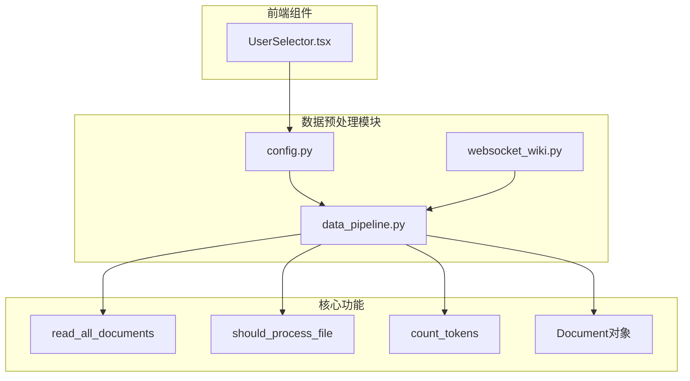
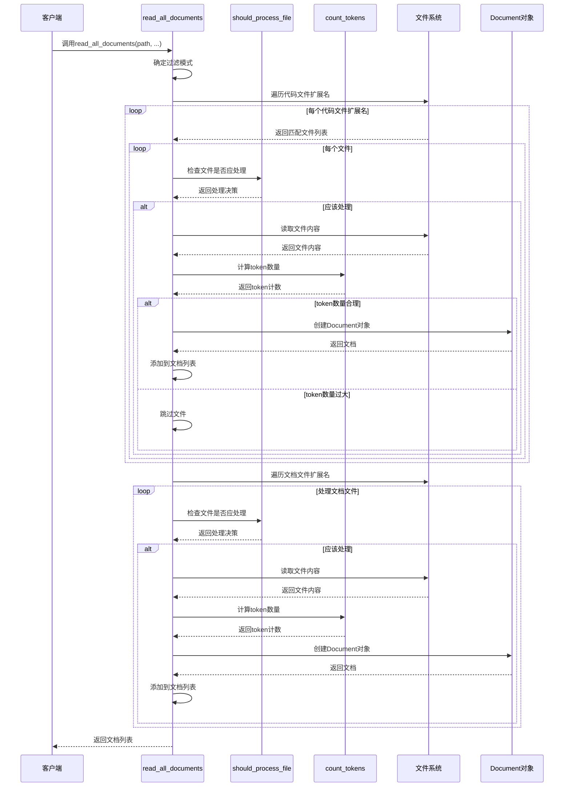
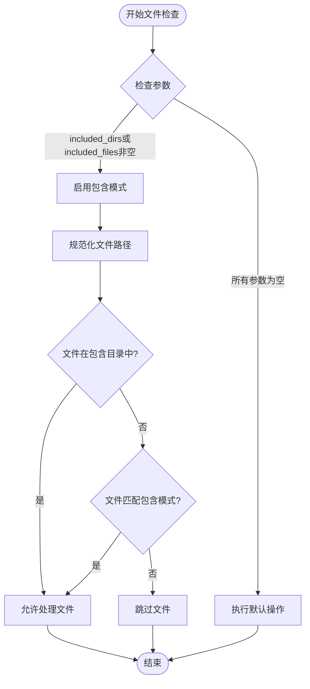
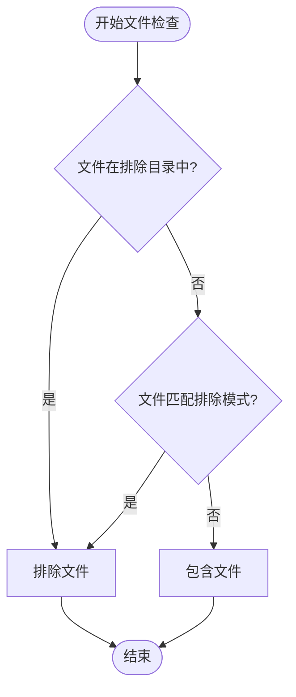
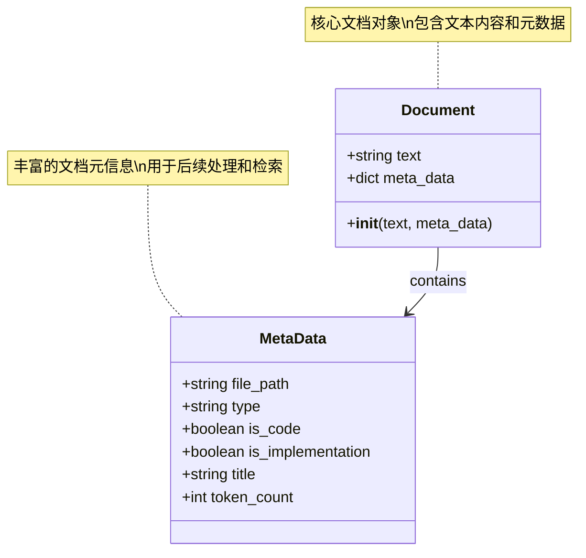
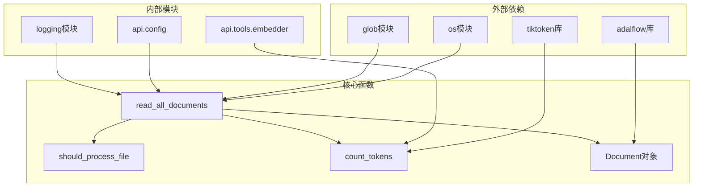

# 文档读取

<cite>
**本文档中引用的文件**
- [data_pipeline.py](file://api/data_pipeline.py)
- [config.py](file://api/config.py)
- [websocket_wiki.py](file://api/websocket_wiki.py)
- [UserSelector.tsx](file://src/components/UserSelector.tsx)
</cite>

## 目录
1. [简介](#简介)
2. [项目结构](#项目结构)
3. [核心组件](#核心组件)
4. [架构概览](#架构概览)
5. [详细组件分析](#详细组件分析)
6. [依赖关系分析](#依赖关系分析)
7. [性能考虑](#性能考虑)
8. [故障排除指南](#故障排除指南)
9. [结论](#结论)

## 简介

deepwiki-open的RAG（检索增强生成）系统数据预处理模块提供了一个强大的文档读取功能，能够从指定目录中递归读取各种类型的文档文件。该系统支持两种文件过滤模式：包含模式（inclusion mode）和排除模式（exclusion mode），并优先处理代码文件后处理文档文件。系统还具备智能的token计数功能，能够根据嵌入模型的限制自动跳过大文件，确保数据处理的效率和质量。

## 项目结构

**图表来源**
- [data_pipeline.py](file://api/data_pipeline.py#L143-L370)
- [config.py](file://api/config.py#L260-L304)

**章节来源**
- [data_pipeline.py](file://api/data_pipeline.py#L1-L50)
- [config.py](file://api/config.py#L1-L50)

## 核心组件

### read_all_documents函数

`read_all_documents`是整个文档读取功能的核心入口函数，负责协调文件过滤、内容读取和文档对象构建的整个流程。

#### 主要特性：
- **双模式过滤**：支持包含模式和排除模式的灵活文件筛选
- **优先级处理**：先处理代码文件，后处理文档文件
- **智能跳过**：基于token数量限制自动跳过大文件
- **元数据丰富**：为每个文档添加详细的元数据信息

#### 参数配置：
- `path`: 根目录路径
- `embedder_type`: 嵌入器类型（openai/google/ollama）
- `excluded_dirs`: 排除的目录列表
- `excluded_files`: 排除的文件模式列表
- `included_dirs`: 包含的目录列表
- `included_files`: 包含的文件模式列表

**章节来源**
- [data_pipeline.py](file://api/data_pipeline.py#L143-L370)

### should_process_file内部函数

`should_process_file`是一个关键的文件过滤函数，根据包含/排除规则确定文件是否应该被处理。

#### 过滤逻辑：
- **包含模式**：文件必须在包含的目录中或匹配包含的文件模式
- **排除模式**：文件不能在排除的目录中且不匹配排除的文件模式
- **路径规范化**：对文件路径进行标准化处理
- **模式匹配**：支持精确匹配和通配符匹配

**章节来源**
- [data_pipeline.py](file://api/data_pipeline.py#L226-L294)

### count_tokens函数

`count_tokens`函数负责计算文本内容的token数量，为文件大小控制提供基础。

#### 支持的嵌入器类型：
- **Ollama**: 使用cl100k_base编码
- **Google**: 使用cl100k_base编码（近似估算）
- **OpenAI**: 使用text-embedding-3-small模型编码

#### 备用机制：
当tiktoken计算失败时，系统会使用字符数除以4的粗略估算方法。

**章节来源**
- [data_pipeline.py](file://api/data_pipeline.py#L27-L68)

## 架构概览

**图表来源**
- [data_pipeline.py](file://api/data_pipeline.py#L143-L370)

## 详细组件分析

### 文件过滤模式分析

#### 包含模式（Inclusion Mode）

**图表来源**
- [data_pipeline.py](file://api/data_pipeline.py#L245-L274)

#### 排除模式（Exclusion Mode）

**图表来源**
- [data_pipeline.py](file://api/data_pipeline.py#L276-L294)

**章节来源**
- [data_pipeline.py](file://api/data_pipeline.py#L177-L223)

### 代码文件与文档文件处理流程

#### 代码文件处理

系统首先处理代码文件，这些文件具有以下特征：

| 特征 | 描述 | 实现细节 |
|------|------|----------|
| 扩展名优先级 | 优先处理常见编程语言文件 | .py, .js, .ts, .java, .cpp等 |
| 实现文件识别 | 自动标记非测试/应用文件 | 基于路径前缀和关键词检测 |
| token限制 | 更严格的token数量限制 | MAX_EMBEDDING_TOKENS * 10 |
| 元数据标记 | 设置is_code=True和is_implementation属性 |

#### 文档文件处理

文档文件处理遵循相同的过滤和验证流程，但具有不同的token限制：

| 特征 | 代码文件 | 文档文件 |
|------|----------|----------|
| token限制 | MAX_EMBEDDING_TOKENS * 10 | MAX_EMBEDDING_TOKENS |
| is_code属性 | True | False |
| is_implementation属性 | 基于路径检测 | False |
| 处理顺序 | 优先处理 | 后处理 |

**章节来源**
- [data_pipeline.py](file://api/data_pipeline.py#L295-L370)

### Document对象构建过程

**图表来源**
- [data_pipeline.py](file://api/data_pipeline.py#L321-L331)
- [data_pipeline.py](file://api/data_pipeline.py#L355-L365)

#### Document对象字段详解

| 字段名 | 类型 | 描述 | 示例值 |
|--------|------|------|--------|
| file_path | string | 相对于根目录的文件路径 | "src/main.py" |
| type | string | 文件扩展名（不带点） | "py", "md", "js" |
| is_code | boolean | 是否为代码文件 | true/false |
| is_implementation | boolean | 是否为实现文件（仅代码文件） | true/false |
| title | string | 文档标题（通常与file_path相同） | "src/main.py" |
| token_count | int | 文本的token数量 | 1234 |

**章节来源**
- [data_pipeline.py](file://api/data_pipeline.py#L321-L366)

### 默认排除配置

系统提供了全面的默认排除配置，涵盖常见的开发环境和文件类型：

#### 默认排除目录

| 分类 | 目录模式 | 用途 |
|------|----------|------|
| 虚拟环境 | ./.venv/, ./venv/, ./env/ | Python虚拟环境 |
| 包管理器 | ./node_modules/, ./bower_components/ | JavaScript包管理 |
| 版本控制 | ./.git/, ./.svn/, ./.hg/ | 版本控制系统 |
| 缓存文件 | ./.pytest_cache/, ./.mypy_cache/ | 开发工具缓存 |
| 构建输出 | ./dist/, ./build/, ./target/ | 构建产物 |
| 文档生成 | ./docs/, ./_docs/ | 文档站点 |
| IDE配置 | ./.idea/, ./.vscode/ | 开发环境配置 |

#### 默认排除文件

| 分类 | 文件模式 | 用途 |
|------|----------|------|
| 锁文件 | *.lock, .env* | 依赖锁定和环境配置 |
| 构建配置 | *.config, webpack.config.js | 构建工具配置 |
| 压缩文件 | *.zip, *.tar, *.gz | 压缩归档文件 |
| 二进制文件 | *.exe, *.dll, *.so | 可执行文件和库 |
| 图片资源 | *.jpg, *.png, *.svg | 静态媒体文件 |

**章节来源**
- [config.py](file://api/config.py#L262-L301)

## 依赖关系分析

**图表来源**
- [data_pipeline.py](file://api/data_pipeline.py#L1-L10)
- [config.py](file://api/config.py#L1-L10)

### 关键依赖说明

#### 外部依赖
- **os模块**: 提供文件路径操作和系统交互功能
- **glob模块**: 支持通配符文件匹配
- **tiktoken**: 提供准确的token计数功能
- **adalflow**: 提供Document对象和相关类型定义

#### 内部依赖
- **api.config**: 提供配置管理和默认排除列表
- **api.tools.embedder**: 提供嵌入器客户端接口
- **logging**: 提供日志记录功能

**章节来源**
- [data_pipeline.py](file://api/data_pipeline.py#L1-L10)

## 性能考虑

### 文件遍历优化

系统采用分阶段文件处理策略，先处理代码文件再处理文档文件，这种设计有以下优势：

1. **内存效率**: 一次性只处理一种类型的文件
2. **错误隔离**: 单种文件类型的错误不会影响其他文件类型
3. **优先级控制**: 重要代码文件优先处理

### Token计算优化

- **缓存机制**: tiktoken编码器会被复用
- **备用算法**: 当tiktoken失败时使用字符数估算
- **早期跳过**: 在读取文件内容之前就进行token数量检查

### 并发处理

虽然当前实现是同步的，但系统架构支持未来的并发优化：
- 独立的文件处理单元
- 明确的错误边界
- 可插拔的嵌入器接口

## 故障排除指南

### 常见问题及解决方案

#### 文件未被处理

**可能原因**:
1. 文件路径不符合包含/排除规则
2. 文件扩展名不在支持列表中
3. 文件过大超过token限制

**排查步骤**:
1. 检查文件路径是否符合过滤规则
2. 验证文件扩展名是否在code_extensions或doc_extensions列表中
3. 查看日志中的警告信息

#### Token计数异常

**可能原因**:
1. 嵌入器类型配置错误
2. 文本编码问题
3. tiktoken库版本不兼容

**解决方案**:
1. 检查embedder_type参数设置
2. 验证文本编码格式
3. 更新tiktoken库到最新版本

#### 性能问题

**优化建议**:
1. 减少排除目录的数量
2. 使用更精确的包含规则
3. 调整MAX_EMBEDDING_TOKENS阈值

**章节来源**
- [data_pipeline.py](file://api/data_pipeline.py#L317-L319)
- [data_pipeline.py](file://api/data_pipeline.py#L65-L67)

## 结论

deepwiki-open的文档读取功能是一个设计精良的数据预处理模块，具有以下突出特点：

### 技术优势
1. **灵活的文件过滤**: 支持包含和排除两种模式，满足不同场景需求
2. **智能的文件分类**: 优先处理代码文件，确保重要文档的完整性
3. **精确的大小控制**: 基于token数量的文件大小限制机制
4. **丰富的元数据**: 为每个文档提供详细的处理信息

### 设计亮点
1. **模块化架构**: 清晰的功能分离和职责划分
2. **可扩展性**: 支持新的文件类型和嵌入器
3. **容错能力**: 完善的错误处理和降级机制
4. **配置灵活性**: 支持运行时和编译时的配置调整

### 应用价值
该模块为RAG系统的知识库构建提供了坚实的基础，通过智能的文件处理和质量控制，确保了后续检索和生成任务的有效性。其设计原则和实现方式可以作为其他类似系统的参考模板。