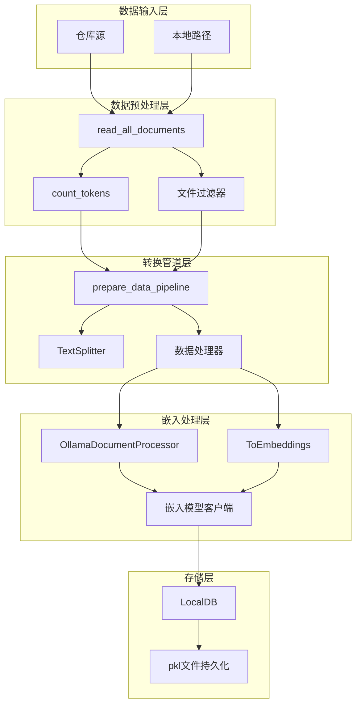
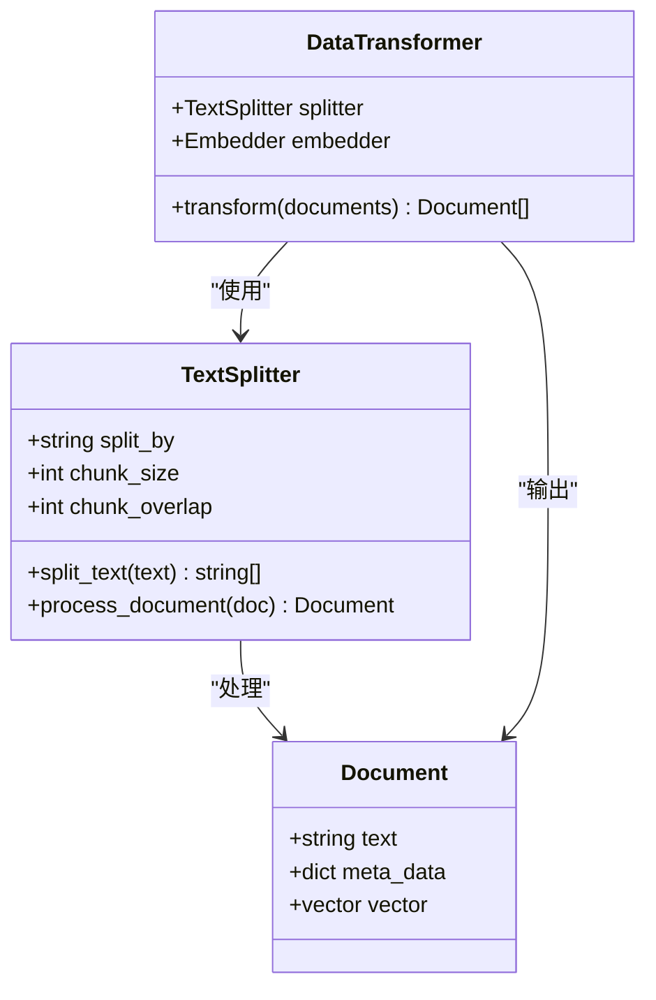
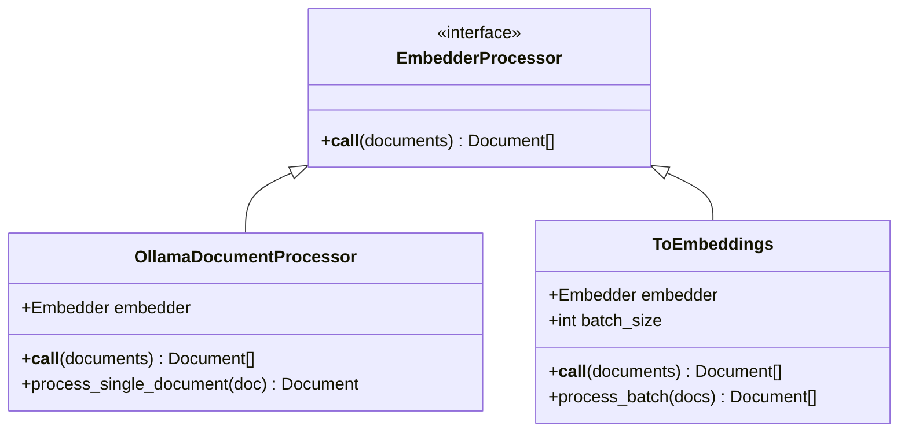
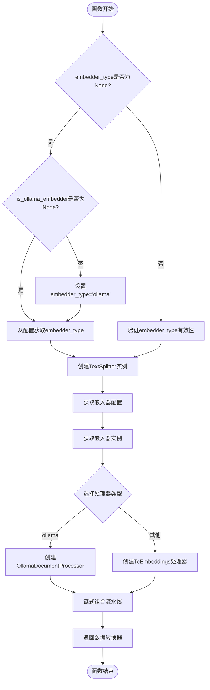
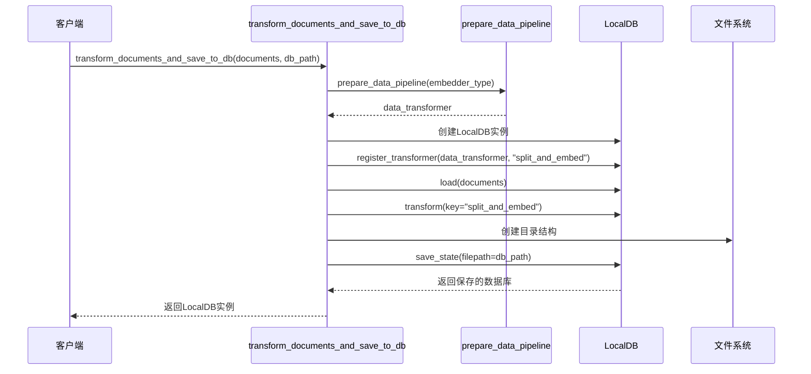
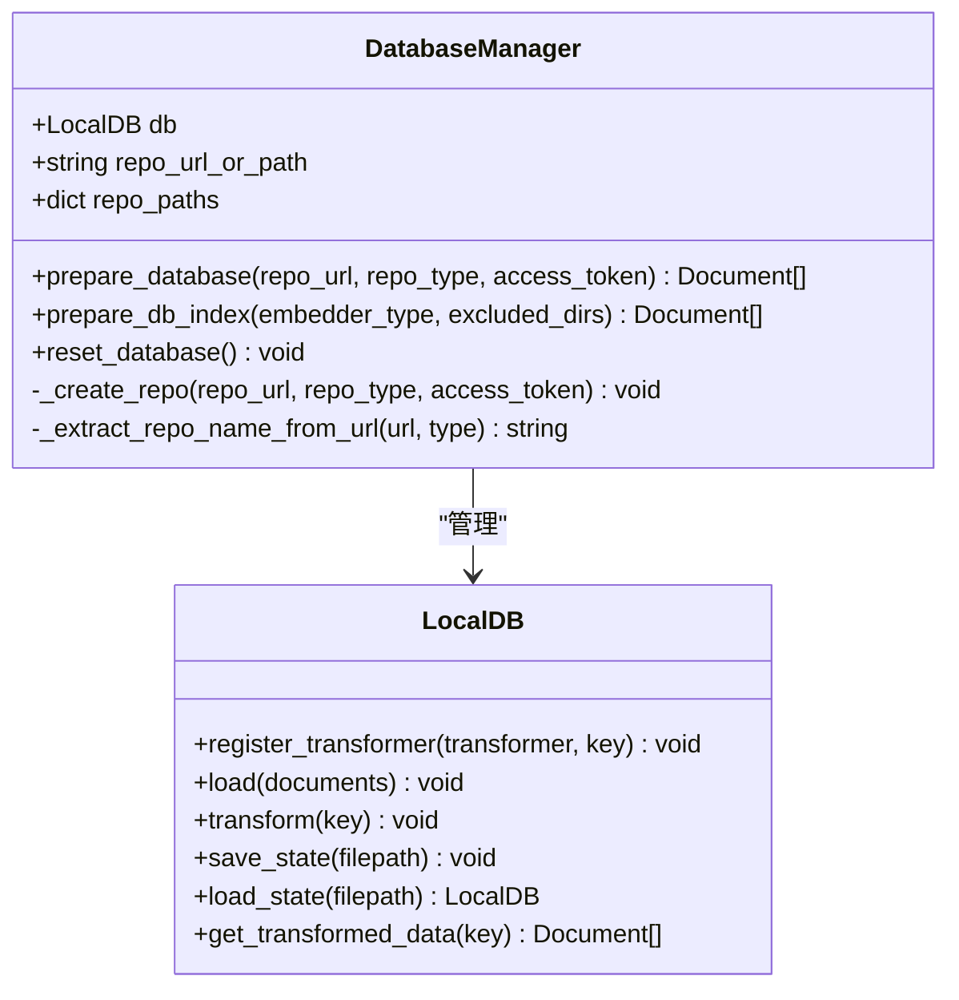
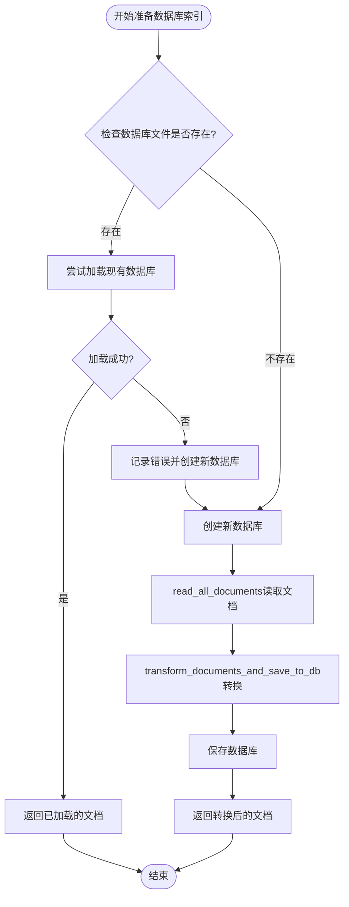
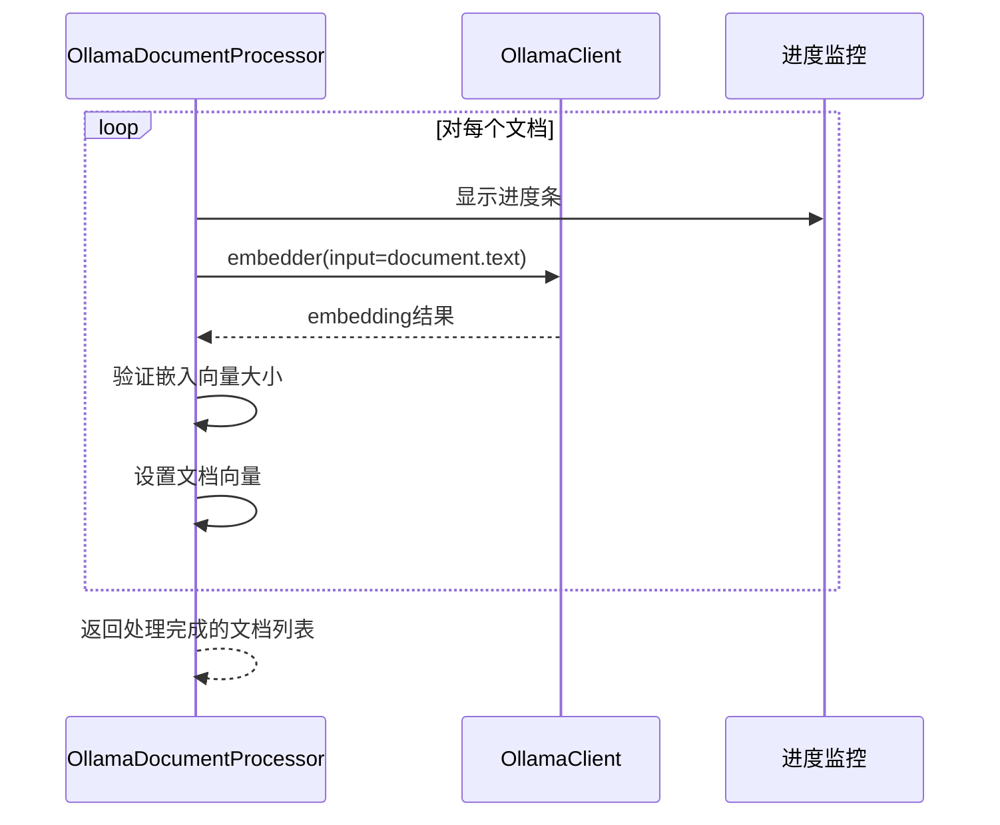
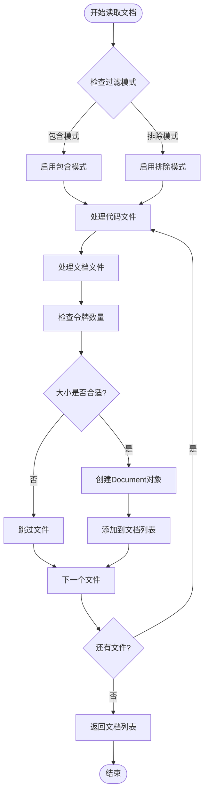
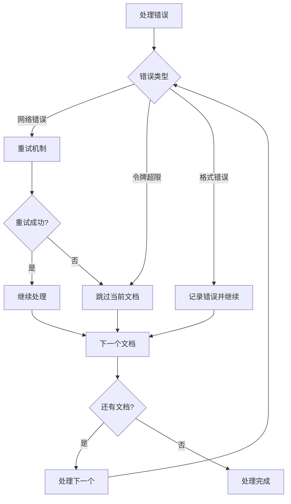

# 转换管道

<cite>
**本文档引用的文件**
- [api/data_pipeline.py](file://api/data_pipeline.py)
- [api/config.py](file://api/config.py)
- [api/tools/embedder.py](file://api/tools/embedder.py)
- [api/ollama_patch.py](file://api/ollama_patch.py)
- [api/config/embedder.json](file://api/config/embedder.json)
- [tests/unit/test_all_embedders.py](file://tests/unit/test_all_embedders.py)
- [api/rag.py](file://api/rag.py)
</cite>

## 目录
1. [简介](#简介)
2. [系统架构概览](#系统架构概览)
3. [核心组件分析](#核心组件分析)
4. [prepare_data_pipeline函数详解](#prepare_data_pipeline函数详解)
5. [transform_documents_and_save_to_db函数详解](#transform_documents_and_save_to_db函数详解)
6. [DatabaseManager数据库管理](#databasemanager数据库管理)
7. [嵌入模型类型处理策略](#嵌入模型类型处理策略)
8. [数据处理流程](#数据处理流程)
9. [性能优化考虑](#性能优化考虑)
10. [故障排除指南](#故障排除指南)
11. [总结](#总结)

## 简介

deepwiki-open项目的RAG（检索增强生成）系统采用了一套高度灵活的数据预处理管道，专门设计用于处理不同类型的嵌入模型（OpenAI、Google、Ollama）。该系统的核心是`prepare_data_pipeline`函数，它能够根据指定的嵌入模型类型动态创建相应的数据转换流水线，支持文本分块、向量化和数据库持久化等关键功能。

## 系统架构概览



**图表来源**
- [api/data_pipeline.py](file://api/data_pipeline.py#L144-L416)
- [api/ollama_patch.py](file://api/ollama_patch.py#L62-L105)

## 核心组件分析

### 文本分块组件（TextSplitter）

系统使用`adalflow.components.data_process.TextSplitter`进行文本分块处理，配置参数可在`embedder.json`中定义：



**图表来源**
- [api/config/embedder.json](file://api/config/embedder.json#L28-L32)
- [api/data_pipeline.py](file://api/data_pipeline.py#L396-L414)

### 嵌入处理器组件

系统针对不同的嵌入模型类型提供了专门的处理器：



**图表来源**
- [api/ollama_patch.py](file://api/ollama_patch.py#L62-L105)
- [api/data_pipeline.py](file://api/data_pipeline.py#L402-L410)

**章节来源**
- [api/data_pipeline.py](file://api/data_pipeline.py#L373-L416)
- [api/ollama_patch.py](file://api/ollama_patch.py#L62-L105)

## prepare_data_pipeline函数详解

`prepare_data_pipeline`函数是整个数据预处理系统的核心入口点，负责根据嵌入模型类型动态创建数据转换流水线。

### 函数签名与参数

```python
def prepare_data_pipeline(embedder_type: str = None, is_ollama_embedder: bool = None):
```

该函数接受两个参数：
- `embedder_type`: 明确指定的嵌入模型类型（'openai'、'google'、'ollama'）
- `is_ollama_embedder`: 已弃用的兼容性参数，建议使用`embedder_type`

### 流程控制逻辑



**图表来源**
- [api/data_pipeline.py](file://api/data_pipeline.py#L373-L416)

### 处理器选择策略

系统根据嵌入模型类型选择不同的数据处理器：

| 嵌入模型类型 | 数据处理器 | 批处理策略 | 单位 |
|-------------|-----------|-----------|------|
| ollama | OllamaDocumentProcessor | 单文档处理 | 每个文档单独处理 |
| openai | ToEmbeddings | 批量处理 | 默认500个文档/批次 |
| google | ToEmbeddings | 批量处理 | 默认100个文档/批次 |

**章节来源**
- [api/data_pipeline.py](file://api/data_pipeline.py#L373-L416)

## transform_documents_and_save_to_db函数详解

该函数协调数据转换器与LocalDB数据库，实现完整的文档加载、转换和持久化流程。

### 函数执行流程



**图表来源**
- [api/data_pipeline.py](file://api/data_pipeline.py#L417-L441)

### 数据持久化机制

系统使用`LocalDB`类进行数据持久化，支持以下操作：

1. **注册转换器**: 将数据转换器注册到数据库中
2. **加载数据**: 将原始文档加载到数据库中
3. **执行转换**: 应用数据转换流水线
4. **保存状态**: 将转换后的数据序列化到pkl文件

**章节来源**
- [api/data_pipeline.py](file://api/data_pipeline.py#L417-L441)

## DatabaseManager数据库管理

`DatabaseManager`类提供了高级的数据库管理功能，封装了复杂的数据库创建、加载和索引过程。

### 核心方法分析



**图表来源**
- [api/data_pipeline.py](file://api/data_pipeline.py#L703-L886)

### 数据库索引准备流程



**图表来源**
- [api/data_pipeline.py](file://api/data_pipeline.py#L819-L870)

**章节来源**
- [api/data_pipeline.py](file://api/data_pipeline.py#L703-L886)

## 嵌入模型类型处理策略

系统针对不同的嵌入模型类型采用了差异化的处理策略，以优化性能和资源利用。

### Ollama处理策略

Ollama使用单文档处理模式，因为其不支持批量嵌入：



**图表来源**
- [api/ollama_patch.py](file://api/ollama_patch.py#L71-L105)

### OpenAI/Google处理策略

OpenAI和Google使用批量处理模式，提高处理效率：

| 参数 | OpenAI | Google |
|------|--------|--------|
| 默认批处理大小 | 500 | 100 |
| 支持的格式 | float数组 | float数组 |
| 并发处理 | 是 | 是 |
| 错误恢复 | 文档级隔离 | 文档级隔离 |

**章节来源**
- [api/data_pipeline.py](file://api/data_pipeline.py#L402-L410)
- [api/config/embedder.json](file://api/config/embedder.json#L3-L5)

## 数据处理流程

### 文档读取与过滤

系统实现了智能的文档读取和过滤机制：



**图表来源**
- [api/data_pipeline.py](file://api/data_pipeline.py#L144-L371)

### 令牌计数与大小限制

系统使用`tiktoken`库进行精确的令牌计数：

| 嵌入模型类型 | 编码方式 | 最大令牌数 | 限制倍数 |
|-------------|---------|-----------|----------|
| ollama | cl100k_base | 8192 | 10倍 |
| google | cl100k_base | 8192 | 1倍 |
| openai | text-embedding-3-small | 8192 | 1倍 |

**章节来源**
- [api/data_pipeline.py](file://api/data_pipeline.py#L27-L68)
- [api/data_pipeline.py](file://api/data_pipeline.py#L144-L371)

## 性能优化考虑

### 内存管理

系统在处理大型文档集合时采用了多种内存优化策略：

1. **流式处理**: 使用生成器模式避免一次性加载所有文档
2. **分批处理**: 对于非Ollama模型，采用分批处理减少内存占用
3. **进度监控**: 使用`tqdm`提供实时处理进度反馈

### 并发处理

- **Ollama**: 单线程处理，确保稳定性
- **OpenAI/Google**: 支持并发请求，提高吞吐量

### 错误恢复

系统实现了健壮的错误恢复机制：



## 故障排除指南

### 常见问题与解决方案

| 问题类型 | 症状 | 可能原因 | 解决方案 |
|---------|------|---------|---------|
| 嵌入失败 | 文档无法转换 | API密钥无效 | 检查环境变量配置 |
| 内存不足 | 处理中断 | 文档过大 | 调整批处理大小 |
| 令牌超限 | 部分文档被跳过 | 单文档过大 | 减少最大令牌数 |
| 网络超时 | 连接失败 | 网络不稳定 | 增加重试次数 |

### 调试技巧

1. **启用详细日志**: 设置`DEBUG`级别日志记录
2. **检查配置**: 验证`embedder.json`配置正确性
3. **测试连接**: 验证嵌入服务的可用性
4. **监控资源**: 监控内存和CPU使用情况

**章节来源**
- [api/data_pipeline.py](file://api/data_pipeline.py#L27-L68)
- [api/ollama_patch.py](file://api/ollama_patch.py#L71-L105)

## 总结

deepwiki-open项目的RAG系统数据预处理模块展现了高度的灵活性和可扩展性。通过`prepare_data_pipeline`函数的动态流水线创建机制，系统能够根据不同嵌入模型的特点自动调整处理策略。Ollama的单文档处理模式确保了稳定性，而OpenAI/Google的批量处理模式则优化了性能。

该系统的主要优势包括：

1. **模块化设计**: 清晰的组件分离便于维护和扩展
2. **类型安全**: 强类型参数确保正确的嵌入模型选择
3. **错误恢复**: 健壮的错误处理机制保证系统稳定性
4. **性能优化**: 针对不同模型的优化策略
5. **持久化支持**: 完整的数据库管理和缓存机制

这种设计使得系统能够适应不断变化的需求，为RAG应用提供了坚实的基础支撑。