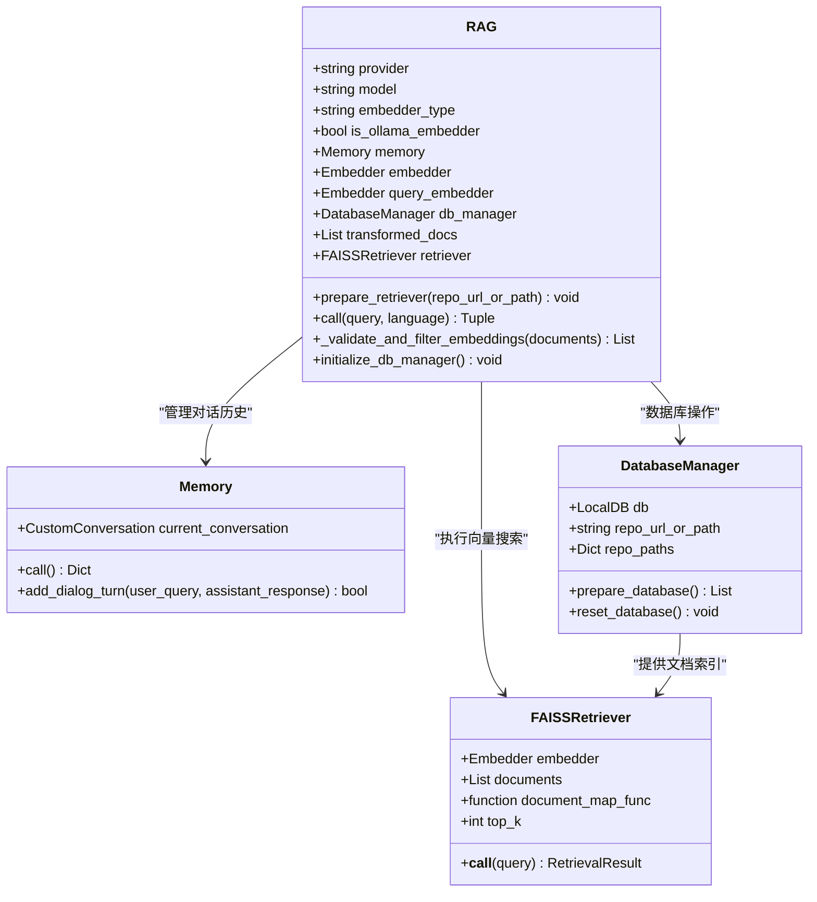
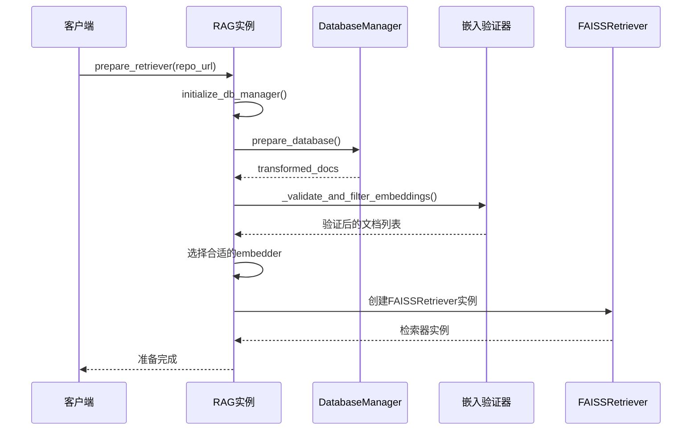
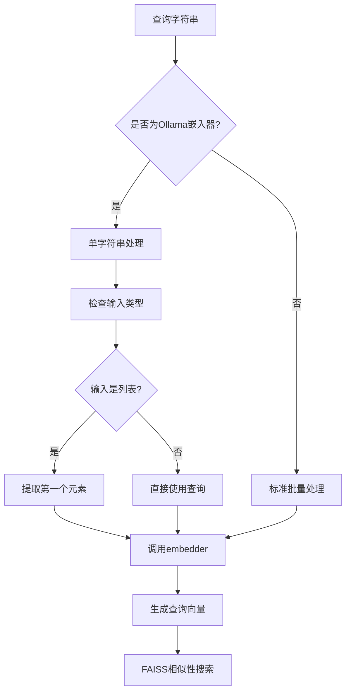
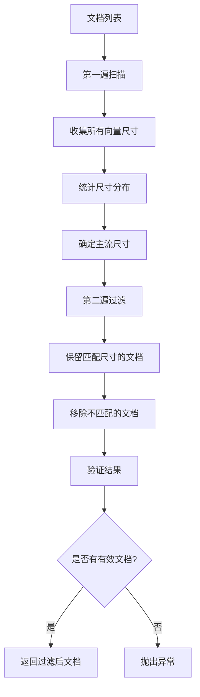
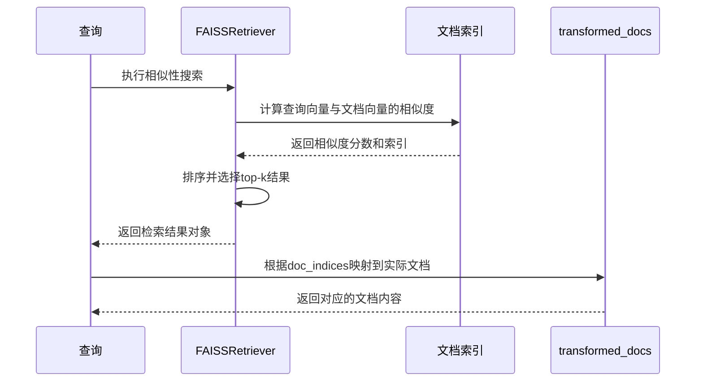
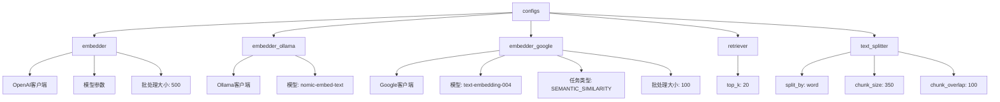
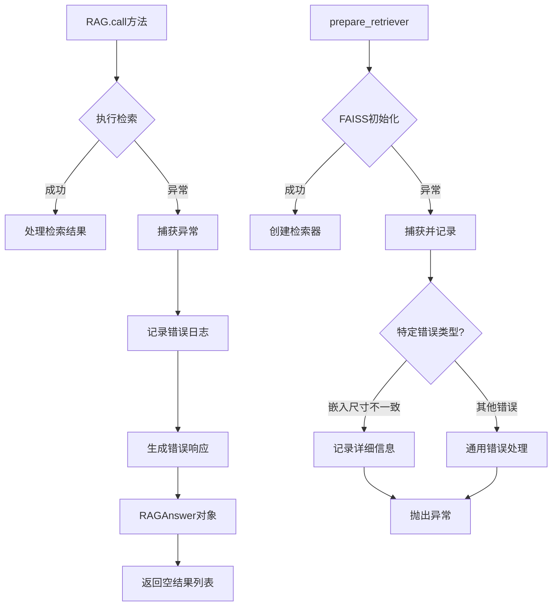

# 向量搜索

<cite>
**本文档引用的文件**
- [api/rag.py](file://api/rag.py)
- [api/config.py](file://api/config.py)
- [api/tools/embedder.py](file://api/tools/embedder.py)
- [api/config/embedder.json](file://api/config/embedder.json)
- [api/data_pipeline.py](file://api/data_pipeline.py)
- [api/logging_config.py](file://api/logging_config.py)
</cite>

## 目录
1. [简介](#简介)
2. [系统架构概览](#系统架构概览)
3. [RAG类核心组件](#rag类核心组件)
4. [FAISSRetriever实例化过程](#faissretriever实例化过程)
5. [查询嵌入向量生成](#查询嵌入向量生成)
6. [相似性搜索机制](#相似性搜索机制)
7. [检索结果处理](#检索结果处理)
8. [配置系统详解](#配置系统详解)
9. [异常处理与日志记录](#异常处理与日志记录)
10. [性能优化策略](#性能优化策略)
11. [故障排除指南](#故障排除指南)

## 简介

deepwiki-open的RAG（检索增强生成）系统采用FAISS（Facebook AI Similarity Search）作为核心向量搜索引擎，实现了高效的语义相似性搜索功能。该系统通过将查询字符串转换为嵌入向量，在预先构建的文档向量索引中进行快速相似性匹配，为后续的生成式问答提供高质量的上下文信息。

## 系统架构概览

RAG系统的核心架构围绕FAISSRetriever展开，通过多层组件协作实现完整的向量搜索流程：

```mermaid
graph TB
subgraph "用户查询处理"
A[用户查询] --> B[query_embedder]
B --> C[查询嵌入向量]
end
subgraph "FAISS索引管理"
D[FAISSRetriever] --> E[文档向量索引]
E --> F[相似性计算]
F --> G[Top-K搜索]
end
subgraph "文档处理管道"
H[transformed_docs] --> I[向量验证过滤]
I --> J[FAISS索引构建]
end
subgraph "配置管理系统"
K[configs['retriever']] --> L[搜索参数配置]
M[embedder_type] --> N[嵌入器选择]
end
C --> D
J --> D
L --> D
N --> B
D --> O[检索结果]
O --> P[doc_indices映射]
P --> Q[transformed_docs索引]
Q --> R[最终检索文档]
```

**图表来源**
- [api/rag.py](file://api/rag.py#L382-L405)
- [api/config/embedder.json](file://api/config/embedder.json#L25-L27)

## RAG类核心组件

RAG类是整个向量搜索系统的核心控制器，负责协调各个组件的工作流程：



**图表来源**
- [api/rag.py](file://api/rag.py#L153-L206)
- [api/rag.py](file://api/rag.py#L51-L89)

**章节来源**
- [api/rag.py](file://api/rag.py#L153-L206)

## FAISSRetriever实例化过程

FAISSRetriever的创建是向量搜索系统的关键步骤，涉及多个配置参数和初始化逻辑：

### prepare_retriever方法详解

`prepare_retriever`方法负责整个检索器的准备工作，包括数据库准备、文档验证和FAISS索引创建：



**图表来源**
- [api/rag.py](file://api/rag.py#L345-L405)

### 嵌入器选择机制

系统根据embedder_type自动选择合适的嵌入器：

| embedder_type | 使用的嵌入器 | 特殊处理 |
|---------------|--------------|----------|
| 'openai' | self.embedder | 标准批量处理 |
| 'google' | self.embedder | 标准批量处理 |
| 'ollama' | self.query_embedder | 单字符串处理 |

**章节来源**
- [api/rag.py](file://api/rag.py#L345-L405)
- [api/tools/embedder.py](file://api/tools/embedder.py#L6-L55)

## 查询嵌入向量生成

查询字符串的嵌入向量生成是向量搜索的第一步，涉及文本预处理和向量计算：

### query_embedder工作机制

系统为不同类型的嵌入器提供了专门的查询处理逻辑：



**图表来源**
- [api/rag.py](file://api/rag.py#L194-L206)

### 嵌入向量验证与过滤

系统实现了严格的嵌入向量验证机制，确保所有文档具有一致的向量维度：



**图表来源**
- [api/rag.py](file://api/rag.py#L251-L343)

**章节来源**
- [api/rag.py](file://api/rag.py#L194-L206)
- [api/rag.py](file://api/rag.py#L251-L343)

## 相似性搜索机制

FAISSRetriever的核心功能是执行高效的相似性搜索，基于余弦相似度或其他度量方式进行最近邻查找：

### FAISS索引构建

FAISSRetriever的初始化过程包含以下关键步骤：

1. **文档映射函数**：`lambda doc: doc.vector` 将文档对象映射为其向量表示
2. **嵌入器配置**：根据embedder_type选择合适的嵌入器实例
3. **配置参数传递**：从`configs['retriever']`获取搜索参数
4. **索引构建**：FAISS内部自动构建高效的向量索引结构

### 搜索参数配置

configs['retriever']配置项直接影响搜索行为：

| 参数名 | 类型 | 默认值 | 描述 |
|--------|------|--------|------|
| top_k | int | 20 | 返回的最相似文档数量 |
| metric | string | cosine | 相似度度量方式 |
| nprobe | int | auto | 搜索时检查的候选点数 |

**章节来源**
- [api/rag.py](file://api/rag.py#L382-L405)
- [api/config/embedder.json](file://api/config/embedder.json#L25-L27)

## 检索结果处理

检索结果的处理涉及doc_indices的生成和文档映射两个关键步骤：

### doc_indices生成机制

FAISSRetriever返回的检索结果包含doc_indices数组，这是文档在原始文档列表中的索引映射：



**图表来源**
- [api/rag.py](file://api/rag.py#L427-L435)

### 文档映射原理

检索结果中的doc_indices数组提供了从FAISS内部索引到transformed_docs列表的映射关系：

```python
# 检索结果映射示例
retrieved_documents[0].documents = [
    self.transformed_docs[doc_index]  # 根据索引获取对应文档
    for doc_index in retrieved_documents[0].doc_indices
]
```

**章节来源**
- [api/rag.py](file://api/rag.py#L427-L435)

## 配置系统详解

RAG系统的配置管理采用分层设计，支持多种嵌入器和检索参数的灵活配置：

### 嵌入器配置结构

系统支持三种主要的嵌入器类型，每种都有独立的配置：



**图表来源**
- [api/config/embedder.json](file://api/config/embedder.json#L1-L34)

### 配置加载机制

配置系统通过环境变量和JSON文件实现灵活的配置管理：

| 配置项 | 环境变量 | 默认值 | 说明 |
|--------|----------|--------|------|
| embedder_type | DEEPWIKI_EMBEDDER_TYPE | openai | 当前使用的嵌入器类型 |
| retriever.top_k | - | 20 | 检索返回的文档数量 |
| text_splitter.chunk_size | - | 350 | 文本块大小 |
| text_splitter.chunk_overlap | - | 100 | 文本块重叠大小 |

**章节来源**
- [api/config/embedder.json](file://api/config/embedder.json#L1-L34)
- [api/config.py](file://api/config.py#L48-L50)

## 异常处理与日志记录

系统实现了完善的异常处理和日志记录机制，确保向量搜索过程的稳定性和可调试性：

### 异常处理策略



**图表来源**
- [api/rag.py](file://api/rag.py#L437-L446)
- [api/rag.py](file://api/rag.py#L392-L415)

### 日志记录层次

系统采用分级日志记录策略：

| 日志级别 | 记录内容 | 触发条件 |
|----------|----------|----------|
| INFO | 关键操作状态 | 检索器创建、文档加载、搜索执行 |
| WARNING | 警告信息 | 文档缺失向量、嵌入尺寸不匹配 |
| ERROR | 错误信息 | 检索器初始化失败、搜索异常 |

**章节来源**
- [api/rag.py](file://api/rag.py#L437-L446)
- [api/rag.py](file://api/rag.py#L392-L415)

## 性能优化策略

为了确保向量搜索的高效性，系统采用了多种性能优化技术：

### 内存管理优化

1. **弱引用机制**：使用`weakref.ref(self)`避免循环引用
2. **延迟加载**：仅在需要时创建FAISS索引
3. **内存池管理**：合理控制批量处理的内存使用

### 搜索效率优化

1. **索引预构建**：在文档准备阶段一次性构建FAISS索引
2. **参数调优**：根据文档数量调整nprobe参数
3. **缓存策略**：对频繁访问的文档向量进行缓存

### 批处理优化

不同嵌入器采用不同的批处理策略：

| 嵌入器类型 | 批处理大小 | 优化策略 |
|------------|------------|----------|
| OpenAI | 500 | 大批量处理，充分利用API限制 |
| Google | 100 | 中等批量，平衡速度和成本 |
| Ollama | 单文档 | 单独处理，避免批处理复杂性 |

## 故障排除指南

### 常见问题及解决方案

#### 1. 嵌入向量尺寸不一致错误

**症状**：`Error creating FAISS retriever: All embeddings should be of the same size`

**原因**：文档集合中存在不同维度的向量

**解决方案**：
- 检查嵌入器配置是否正确
- 验证文档预处理流程
- 查看日志中的嵌入尺寸统计信息

#### 2. 检索器初始化失败

**症状**：`ValueError: No valid documents with embeddings found`

**原因**：
- 文档集合为空
- 所有文档都缺少向量
- 嵌入器连接失败

**解决方案**：
- 检查文档加载过程
- 验证嵌入器可用性
- 确认网络连接状态

#### 3. 检索结果为空

**症状**：检索返回空结果列表

**原因**：
- 查询向量生成失败
- FAISS索引损坏
- 搜索参数设置不当

**解决方案**：
- 检查查询预处理
- 验证FAISS索引完整性
- 调整top_k参数

### 调试技巧

1. **启用详细日志**：设置日志级别为DEBUG查看详细信息
2. **检查文档向量**：验证transformed_docs中的vector属性
3. **测试嵌入器**：单独测试嵌入器的可用性
4. **监控内存使用**：观察大规模文档处理时的内存占用

**章节来源**
- [api/rag.py](file://api/rag.py#L392-L415)
- [api/rag.py](file://api/rag.py#L251-L343)