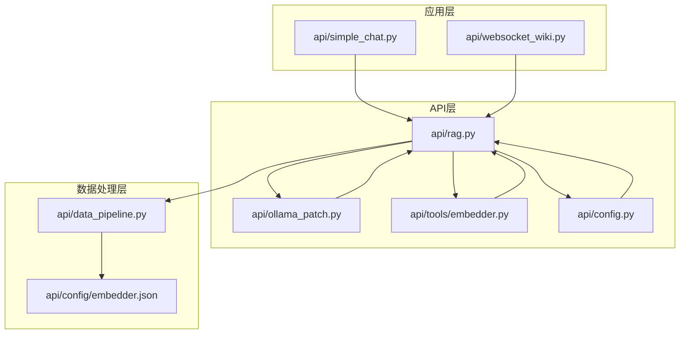
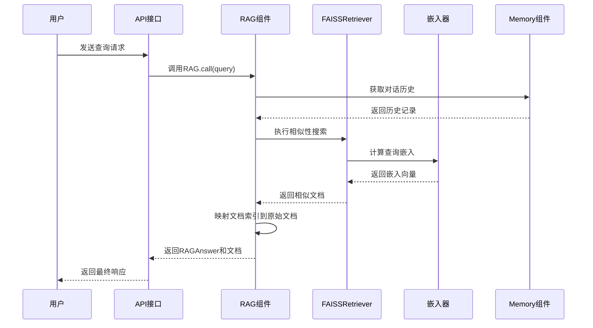
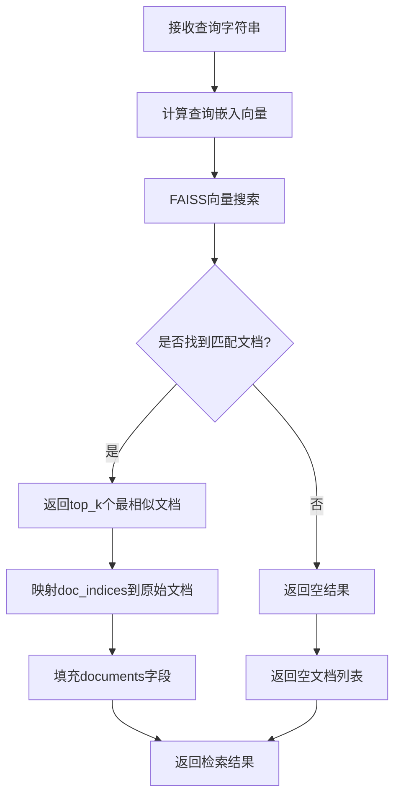
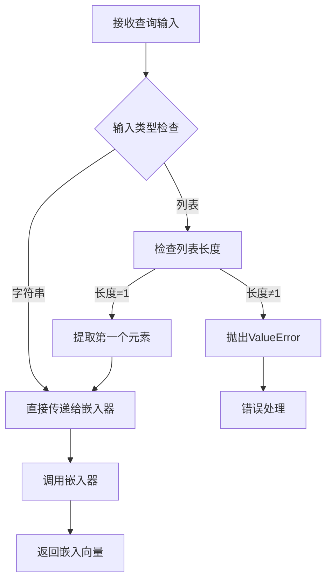
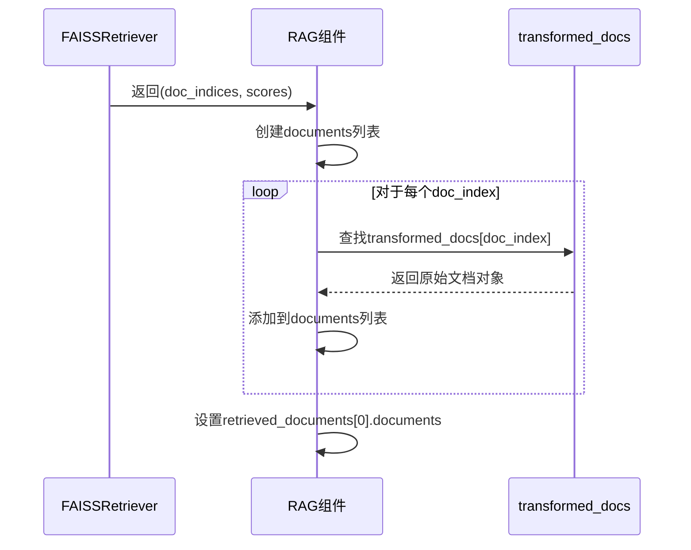
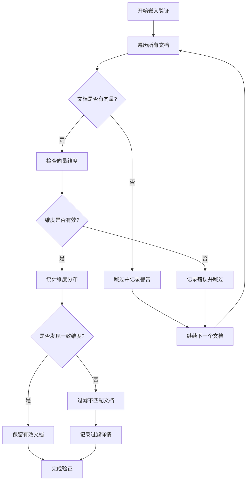
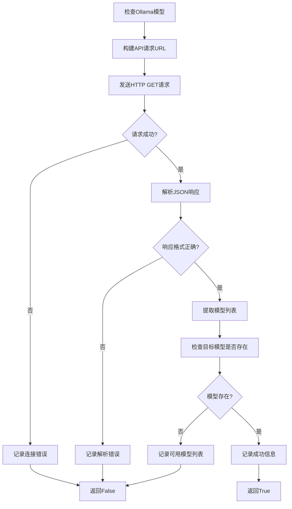
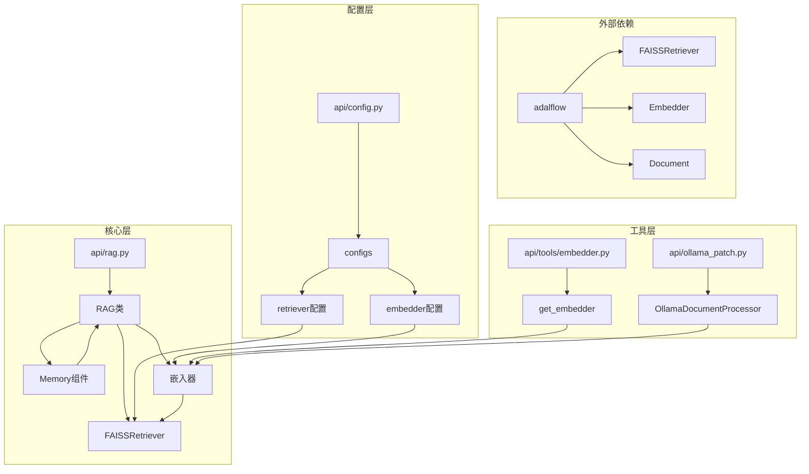

# 查询处理

<cite>
**本文档中引用的文件**
- [api/rag.py](file://api/rag.py)
- [api/ollama_patch.py](file://api/ollama_patch.py)
- [api/tools/embedder.py](file://api/tools/embedder.py)
- [api/config.py](file://api/config.py)
- [api/data_pipeline.py](file://api/data_pipeline.py)
- [api/simple_chat.py](file://api/simple_chat.py)
- [api/websocket_wiki.py](file://api/websocket_wiki.py)
- [api/config/embedder.json](file://api/config/embedder.json)
</cite>

## 目录
1. [简介](#简介)
2. [项目结构概览](#项目结构概览)
3. [核心组件分析](#核心组件分析)
4. [架构概览](#架构概览)
5. [详细组件分析](#详细组件分析)
6. [依赖关系分析](#依赖关系分析)
7. [性能考虑](#性能考虑)
8. [故障排除指南](#故障排除指南)
9. [结论](#结论)

## 简介

deepwiki-open的RAG（检索增强生成）系统是一个基于FAISS向量数据库的智能问答系统，专门设计用于从代码仓库中检索相关信息并生成准确的回答。该系统通过FAISSRetriever执行相似性搜索，结合Memory组件维护对话历史，并通过single_string_embedder补丁确保Ollama嵌入器的兼容性。

## 项目结构概览

RAG系统的文件组织结构清晰，主要包含以下核心模块：

**图表来源**
- [api/rag.py](file://api/rag.py#L1-L50)
- [api/data_pipeline.py](file://api/data_pipeline.py#L1-L50)

**章节来源**
- [api/rag.py](file://api/rag.py#L1-L100)
- [api/config.py](file://api/config.py#L1-L50)

## 核心组件分析

### RAG类的核心功能

RAG类是整个系统的核心控制器，负责协调各个组件的工作流程。其主要职责包括：

- **初始化管理**：根据配置选择合适的嵌入器类型
- **检索器准备**：使用FAISSRetriever进行向量相似性搜索
- **查询处理**：接收用户查询并返回检索结果
- **错误处理**：提供完善的异常处理机制

### Memory组件的对话历史管理

Memory组件实现了自定义的对话管理系统，具有以下特性：

- **安全的对话历史存储**：防止列表赋值索引越界错误
- **持久化支持**：将对话记录保存为字典格式
- **自动恢复机制**：在出现错误时自动重建对话历史

**章节来源**
- [api/rag.py](file://api/rag.py#L51-L142)

## 架构概览

RAG系统的整体架构采用分层设计，确保各组件之间的松耦合和高内聚：

**图表来源**
- [api/rag.py](file://api/rag.py#L416-L445)
- [api/simple_chat.py](file://api/simple_chat.py#L190-L250)

## 详细组件分析

### FAISSRetriever相似性搜索机制

FAISSRetriever是系统的核心检索组件，负责执行高效的向量相似性搜索：

**图表来源**
- [api/rag.py](file://api/rag.py#L382-L405)
- [api/config/embedder.json](file://api/config/embedder.json#L25-L27)

#### 相似度阈值和top_k参数

系统通过配置文件中的`retriever`部分控制检索参数：

| 参数 | 默认值 | 描述 |
|------|--------|------|
| top_k | 20 | 检索返回的文档数量上限 |
| similarity_threshold | 配置可选 | 相似度阈值（系统未显式实现但可通过FAISS配置） |

**章节来源**
- [api/config/embedder.json](file://api/config/embedder.json#L25-L27)

### single_string_embedder补丁函数

针对Ollama嵌入器的特殊需求，系统实现了single_string_embedder补丁函数：

**图表来源**
- [api/rag.py](file://api/rag.py#L194-L204)

该补丁函数确保：
- Ollama嵌入器始终接收单字符串输入
- 提供明确的错误信息处理多字符串输入
- 维护弱引用以避免循环依赖

**章节来源**
- [api/rag.py](file://api/rag.py#L194-L204)

### 文档索引映射机制

系统通过以下流程将检索到的文档索引映射回原始文档：

**图表来源**
- [api/rag.py](file://api/rag.py#L427-L434)

**章节来源**
- [api/rag.py](file://api/rag.py#L427-L434)

### 错误处理策略

系统实现了多层次的错误处理机制：

#### 嵌入验证错误处理

**图表来源**
- [api/rag.py](file://api/rag.py#L251-L343)

#### RAG调用错误处理

当RAG调用失败时，系统提供标准化的错误响应：

| 错误场景 | 处理方式 | 返回内容 |
|----------|----------|----------|
| 嵌入器初始化失败 | 抛出异常并终止 | 无返回 |
| FAISS检索失败 | 记录错误并返回空结果 | 空文档列表 |
| 内存访问错误 | 自动恢复并重新初始化 | 成功状态 |
| 对话历史损坏 | 清理并重建对话历史 | 新的历史记录 |

**章节来源**
- [api/rag.py](file://api/rag.py#L416-L445)

### Ollama模型可用性检查

系统提供了完整的Ollama模型检查机制：

**图表来源**
- [api/ollama_patch.py](file://api/ollama_patch.py#L21-L60)

**章节来源**
- [api/ollama_patch.py](file://api/ollama_patch.py#L21-L60)

## 依赖关系分析

系统的依赖关系呈现清晰的层次结构：

**图表来源**
- [api/rag.py](file://api/rag.py#L1-L50)
- [api/config.py](file://api/config.py#L1-L50)

**章节来源**
- [api/rag.py](file://api/rag.py#L1-L50)
- [api/config.py](file://api/config.py#L1-L50)

## 性能考虑

### 嵌入向量一致性验证

系统实现了严格的嵌入向量一致性检查，确保FAISS检索的准确性：

- **维度统计**：自动识别最常见的向量维度
- **批量过滤**：一次性过滤所有不匹配的文档
- **日志记录**：详细记录过滤过程和结果

### 内存管理优化

- **弱引用使用**：避免RAG实例的循环引用
- **延迟加载**：仅在需要时初始化检索器
- **资源清理**：提供数据库重置功能

### 并发处理支持

虽然当前实现是同步的，但架构设计支持未来的并发扩展：
- **独立组件**：各组件职责单一，便于并行化
- **无状态设计**：减少共享状态带来的复杂性

## 故障排除指南

### 常见问题及解决方案

#### 1. Ollama模型不存在错误

**症状**：启动时提示Ollama模型未找到
**原因**：指定的Ollama模型未安装
**解决**：运行`ollama pull <model_name>`安装所需模型

#### 2. 嵌入向量尺寸不匹配

**症状**：FAISS创建失败，提示向量尺寸不一致
**原因**：文档集合中存在不同维度的嵌入向量
**解决**：系统会自动过滤不匹配的文档，确保所有文档使用相同的嵌入模型

#### 3. 检索结果为空

**症状**：查询返回空文档列表
**可能原因**：
- 查询与文档库内容不相关
- 相似度阈值设置过高
- 文档库为空或损坏

**解决**：检查文档预处理流程和查询语句的相关性

#### 4. 内存访问错误

**症状**：对话历史访问失败
**原因**：内存数据结构损坏
**解决**：系统会自动检测并重建对话历史

**章节来源**
- [api/rag.py](file://api/rag.py#L374-L405)
- [api/ollama_patch.py](file://api/ollama_patch.py#L21-L60)

### 调试技巧

1. **启用详细日志**：设置日志级别为DEBUG查看详细执行过程
2. **检查配置文件**：验证embedder.json中的配置项
3. **监控内存使用**：观察对话历史的大小变化
4. **测试嵌入器**：单独测试嵌入器的可用性

## 结论

deepwiki-open的RAG查询处理模块展现了现代信息检索系统的设计精髓。通过FAISSRetriever的高效向量搜索、Memory组件的智能对话管理、以及single_string_embedder补丁的兼容性保证，系统实现了可靠且高性能的智能问答能力。

系统的主要优势包括：

- **模块化设计**：清晰的职责分离和可扩展的架构
- **健壮的错误处理**：多层次的异常捕获和自动恢复机制
- **跨平台兼容性**：支持多种嵌入器提供商和部署环境
- **性能优化**：严格的向量一致性检查和内存管理

该系统为代码仓库的智能问答提供了坚实的技术基础，能够有效支持开发者在大型代码库中的信息检索需求。