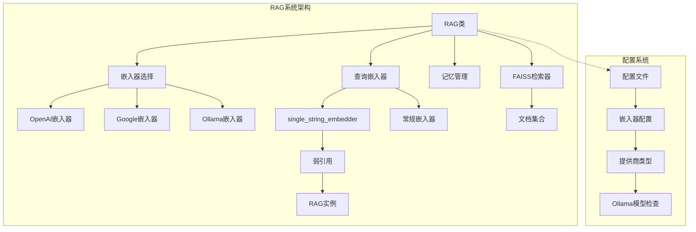
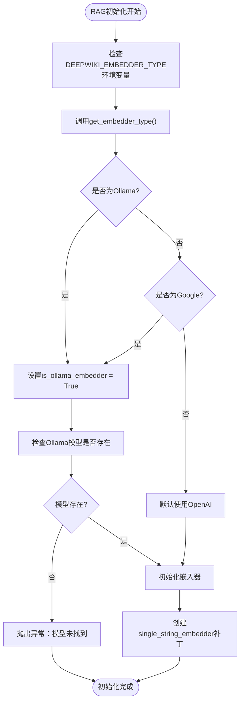
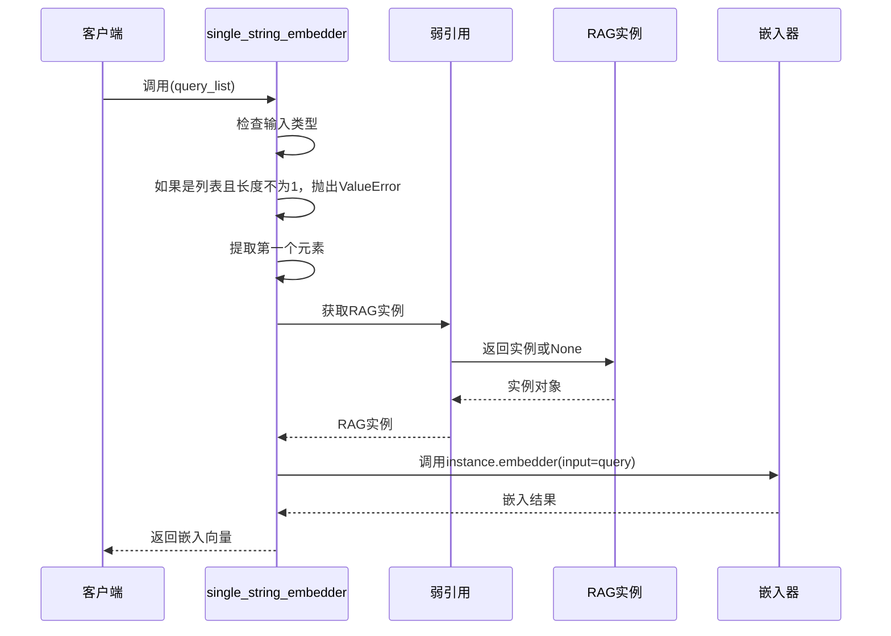
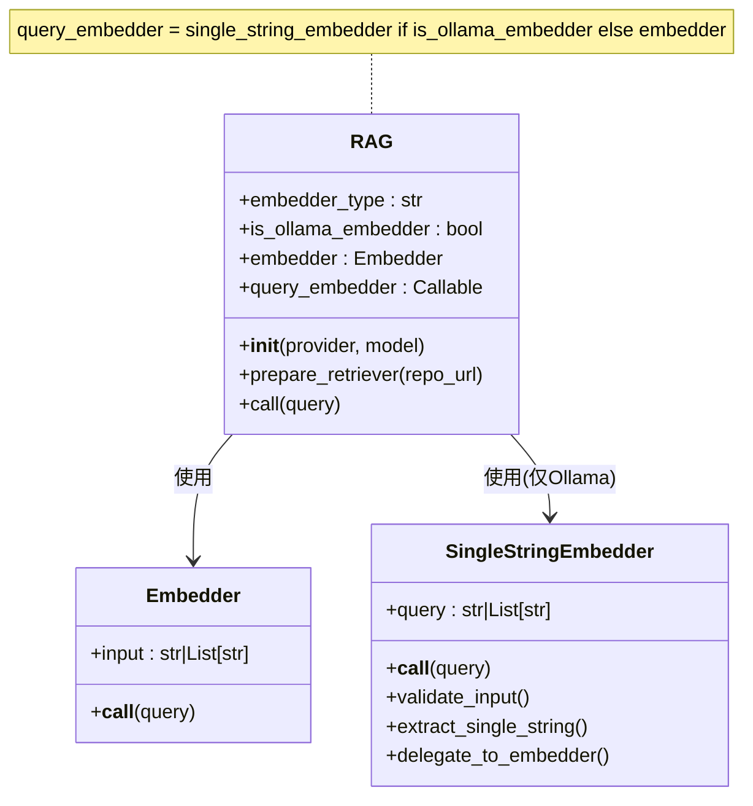
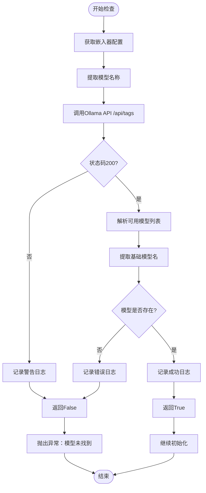
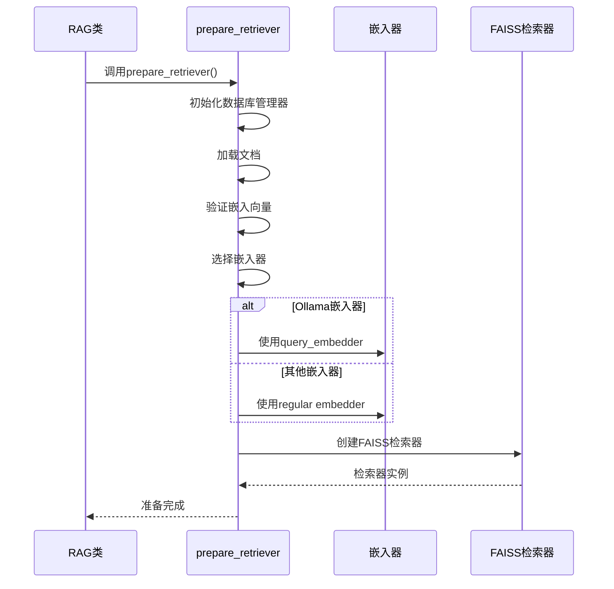
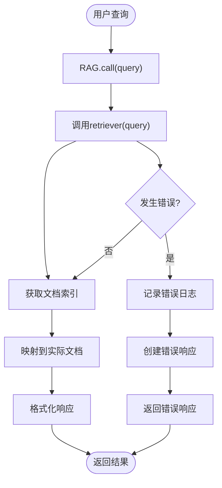

# 查询嵌入

<cite>
**本文档中引用的文件**
- [api/rag.py](file://api/rag.py)
- [api/ollama_patch.py](file://api/ollama_patch.py)
- [api/tools/embedder.py](file://api/tools/embedder.py)
- [api/config.py](file://api/config.py)
- [api/config/embedder.json](file://api/config/embedder.json)
- [tests/unit/test_all_embedders.py](file://tests/unit/test_all_embedders.py)
</cite>

## 目录
1. [简介](#简介)
2. [系统架构概览](#系统架构概览)
3. [RAG类初始化与嵌入器选择](#rag类初始化与嵌入器选择)
4. [single_string_embedder补丁函数详解](#single_string_embedder补丁函数详解)
5. [query_embedder的初始化与使用](#query_embedder的初始化与使用)
6. [Ollama模型检查机制](#ollama模型检查机制)
7. [弱引用的使用目的](#弱引用的使用目的)
8. [prepare_retriever中的查询嵌入](#prepare_retriever中的查询嵌入)
9. [call方法中的查询处理](#call方法中的查询处理)
10. [错误处理与用户指导](#错误处理与用户指导)
11. [总结](#总结)

## 简介

deepwiki-open的RAG（检索增强生成）系统在查询处理过程中需要将用户查询转换为向量表示，这一过程称为查询嵌入。系统支持多种嵌入器提供商，包括OpenAI、Google和Ollama，每种提供商都有其特定的API要求和限制。

查询嵌入是RAG系统的关键组件，它决定了后续信息检索的质量和准确性。系统通过智能的嵌入器选择机制和专门的补丁函数来确保不同提供商的兼容性和稳定性。

## 系统架构概览



**图表来源**
- [api/rag.py](file://api/rag.py#L153-L206)
- [api/config.py](file://api/config.py#L159-L172)

## RAG类初始化与嵌入器选择

RAG类在初始化时会根据配置自动选择合适的嵌入器。这个过程涉及多个步骤和检查机制。

### 嵌入器类型检测

系统通过以下方式确定使用哪种嵌入器：



**图表来源**
- [api/rag.py](file://api/rag.py#L177-L206)
- [api/config.py](file://api/config.py#L214-L226)

### 配置驱动的选择机制

系统通过配置文件和环境变量来决定使用哪个嵌入器：

| 配置项 | 默认值 | 描述 |
|--------|--------|------|
| `DEEPWIKI_EMBEDDER_TYPE` | `openai` | 嵌入器类型：`openai`、`google`、`ollama` |
| `embedder.json` | - | 包含各提供商的客户端配置 |
| `OLLAMA_HOST` | `http://localhost:11434` | Ollama服务地址 |

**节来源**
- [api/rag.py](file://api/rag.py#L157-L206)
- [api/config.py](file://api/config.py#L48-L50)

## single_string_embedder补丁函数详解

`single_string_embedder`是一个专门为Ollama嵌入器设计的补丁函数，它的主要目的是确保无论输入是字符串还是列表，最终都转换为单一字符串传递给Ollama嵌入器。

### 函数设计原理



**图表来源**
- [api/rag.py](file://api/rag.py#L195-L203)

### 输入验证机制

`single_string_embedder`函数实现了严格的输入验证：

| 输入类型 | 处理方式 | 结果 |
|----------|----------|------|
| 单个字符串 | 直接传递给嵌入器 | 正常处理 |
| 字符串列表 | 检查长度是否为1 | 成功提取或抛出异常 |
| 其他类型 | 抛出TypeError | 错误终止 |

### 异常处理策略

函数包含两层异常保护：
1. **输入验证异常**：当输入不是单一字符串时抛出`ValueError`
2. **实例可用性检查**：通过断言确保RAG实例仍然可用

**节来源**
- [api/rag.py](file://api/rag.py#L195-L203)

## query_embedder的初始化与使用

`query_embedder`是RAG类中的一个关键属性，它根据嵌入器类型动态选择合适的嵌入器实现。

### 初始化逻辑



**图表来源**
- [api/rag.py](file://api/rag.py#L193-L206)

### 动态选择机制

query_embedder的初始化遵循以下规则：

```python
# 初始化逻辑
self.query_embedder = single_string_embedder if self.is_ollama_embedder else self.embedder
```

这种设计确保了：
- **Ollama用户**：使用经过验证的单字符串接口
- **其他提供商**：直接使用标准嵌入器接口
- **运行时灵活性**：根据配置动态调整行为

**节来源**
- [api/rag.py](file://api/rag.py#L193-L206)

## Ollama模型检查机制

当使用Ollama嵌入器时，系统会在初始化阶段执行严格的模型检查，以确保Ollama服务正常工作。

### 检查流程



**图表来源**
- [api/ollama_patch.py](file://api/ollama_patch.py#L21-L60)
- [api/rag.py](file://api/rag.py#L179-L187)

### 错误处理机制

如果Ollama模型不存在，系统会提供明确的错误信息和解决建议：

```python
raise Exception(f"Ollama model '{model_name}' not found. Please run 'ollama pull {model_name}' to install it.")
```

这确保了用户能够快速识别问题并采取正确的行动。

**节来源**
- [api/ollama_patch.py](file://api/ollama_patch.py#L21-L60)

## 弱引用的使用目的

系统在`single_string_embedder`函数中使用了`weakref.ref()`来创建弱引用，这是为了实现两个重要目标。

### 避免循环引用

```mermaid
graph LR
subgraph "传统强引用问题"
RAG1[RAG实例] --> Embedder1[嵌入器]
Embedder1 --> QueryFunc1[查询函数]
QueryFunc1 --> RAG1
# 形成循环引用，无法被垃圾回收
end
subgraph "弱引用解决方案"
RAG2[RAG实例] --> Embedder2[嵌入器]
Embedder2 --> QueryFunc2[查询函数]
QueryFunc2 --> WeakRef[弱引用]
WeakRef --> RAG2
# 弱引用允许RAG实例被垃圾回收
end
```

**图表来源**
- [api/rag.py](file://api/rag.py#L193-L203)

### 保持访问能力

弱引用提供了以下优势：

| 特性 | 传统强引用 | 弱引用 |
|------|------------|--------|
| 内存管理 | 循环引用导致内存泄漏 | 自动垃圾回收 |
| 访问能力 | 始终可访问 | 可能返回None |
| 性能影响 | 额外的引用计数 | 最小的性能开销 |

### 断言保护机制

系统在使用弱引用时添加了断言保护：

```python
assert instance is not None, "RAG instance is no longer available, but the query embedder was called."
```

这种设计确保了即使在极端情况下，系统也能提供清晰的错误信息。

**节来源**
- [api/rag.py](file://api/rag.py#L193-L203)

## prepare_retriever中的查询嵌入

在准备检索器的过程中，系统会根据嵌入器类型选择合适的查询嵌入器。

### 嵌入器选择逻辑



**图表来源**
- [api/rag.py](file://api/rag.py#L345-L414)

### 文档验证过程

系统在准备检索器时会执行严格的文档验证：

| 验证步骤 | 目的 | 失败处理 |
|----------|------|----------|
| 嵌入向量存在性检查 | 确保文档有有效向量 | 跳过文档 |
| 向量维度一致性 | 防止混合维度向量 | 过滤不匹配文档 |
| 向量大小验证 | 检查向量是否为空 | 跳过空向量 |
| 类型兼容性检查 | 确保向量格式正确 | 转换或跳过 |

**节来源**
- [api/rag.py](file://api/rag.py#L345-L414)

## call方法中的查询处理

在处理用户查询时，系统会调用检索器来获取相关文档。

### 查询处理流程



**图表来源**
- [api/rag.py](file://api/rag.py#L416-L445)

### 错误恢复机制

系统实现了多层次的错误恢复：

1. **检索器级别**：捕获FAISS检索器异常
2. **文档映射级别**：处理索引映射错误
3. **响应生成级别**：提供友好的错误消息

**节来源**
- [api/rag.py](file://api/rag.py#L416-L445)

## 错误处理与用户指导

系统在查询嵌入过程中实现了全面的错误处理和用户指导机制。

### 常见错误场景

| 错误类型 | 触发条件 | 用户指导 |
|----------|----------|----------|
| Ollama模型未找到 | Ollama服务不可用或模型未安装 | `ollama pull <模型名>` |
| 嵌入向量尺寸不一致 | 文档嵌入向量维度不统一 | 检查文档预处理流程 |
| 查询输入格式错误 | 输入不是字符串或列表 | 确保输入符合API要求 |
| 网络连接失败 | 无法连接到外部API | 检查网络连接和API密钥 |

### 错误信息模板

系统使用结构化的错误信息模板：

```python
f"Ollama model '{model_name}' not found. Please run 'ollama pull {model_name}' to install it."
```

这种格式确保了用户能够快速理解问题并采取相应的解决措施。

**节来源**
- [api/rag.py](file://api/rag.py#L186-L187)
- [api/ollama_patch.py](file://api/ollama_patch.py#L21-L60)

## 总结

deepwiki-open的RAG系统查询嵌入环节展现了高度的工程化设计和用户体验考虑。通过以下关键特性，系统确保了稳定性和易用性：

### 核心优势

1. **智能嵌入器选择**：根据配置自动选择最适合的嵌入器
2. **严格输入验证**：确保Ollama嵌入器的输入格式正确
3. **健壮的错误处理**：提供清晰的错误信息和解决指导
4. **内存安全设计**：使用弱引用避免内存泄漏
5. **灵活的配置系统**：支持多种提供商和部署模式

### 设计亮点

- **single_string_embedder补丁**解决了Ollama API的输入限制
- **弱引用机制**在保证功能完整性的同时避免内存问题
- **多层验证体系**确保数据质量和系统稳定性
- **用户友好的错误提示**帮助快速定位和解决问题

这种设计不仅满足了技术需求，还为用户提供了良好的使用体验，体现了深度工程实践的价值。