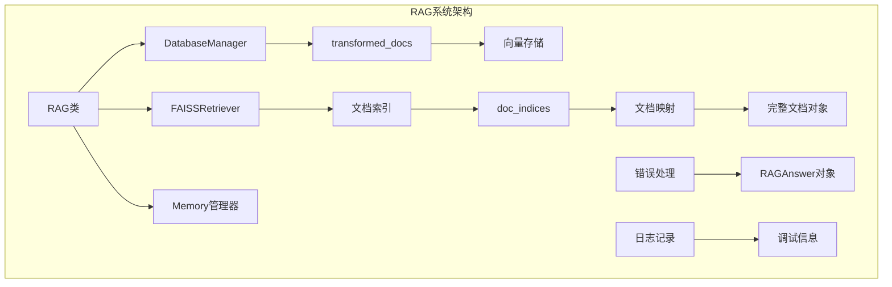
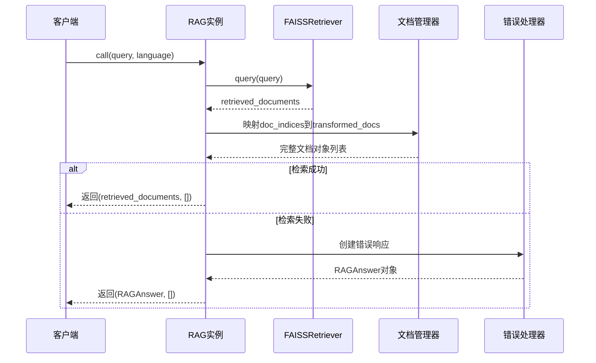
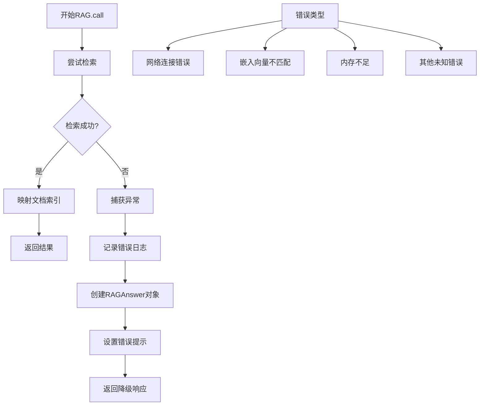
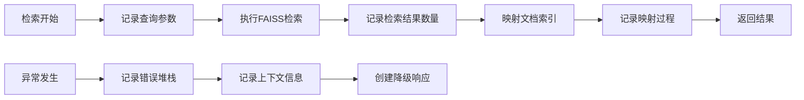

# 结果后处理

<cite>
**本文档引用的文件**
- [api/rag.py](file://api/rag.py)
- [api/data_pipeline.py](file://api/data_pipeline.py)
- [api/logging_config.py](file://api/logging_config.py)
- [api/main.py](file://api/main.py)
- [api/api.py](file://api/api.py)
- [api/simple_chat.py](file://api/simple_chat.py)
- [api/websocket_wiki.py](file://api/websocket_wiki.py)
</cite>

## 目录
1. [简介](#简介)
2. [系统架构概览](#系统架构概览)
3. [RAG.call方法核心流程](#ragcall方法核心流程)
4. [文档索引映射机制](#文档索引映射机制)
5. [错误处理与降级响应](#错误处理与降级响应)
6. [日志记录与调试](#日志记录与调试)
7. [性能优化建议](#性能优化建议)
8. [故障排除指南](#故障排除指南)
9. [总结](#总结)

## 简介

deepwiki-open的RAG（检索增强生成）系统是一个基于向量检索的知识问答系统，专门用于从代码仓库中提取知识并生成准确的回答。本文档深入分析了RAG系统查询处理结果后处理环节的核心机制，重点阐述了如何将检索到的文档索引映射回原始文档集合，以及系统如何优雅地处理各种异常情况。

该系统采用多层架构设计，包括文档预处理、向量化存储、相似度检索和结果后处理等关键组件。在结果后处理阶段，系统需要将FAISS检索器返回的文档索引转换为完整的文档对象，为后续的上下文注入提供数据支持。

## 系统架构概览

deepwiki-open的RAG系统采用模块化架构，主要由以下几个核心组件构成：



**图表来源**
- [api/rag.py](file://api/rag.py#L153-L445)

**章节来源**
- [api/rag.py](file://api/rag.py#L153-L250)

## RAG.call方法核心流程

RAG.call方法是系统的核心入口点，负责处理用户查询并返回最终答案。该方法的执行流程如下：



**图表来源**
- [api/rag.py](file://api/rag.py#L416-L445)

### 核心处理逻辑

RAG.call方法的核心处理逻辑包含以下关键步骤：

1. **检索调用**：调用FAISSRetriever进行语义相似度搜索
2. **文档映射**：将检索到的文档索引映射回原始文档集合
3. **异常处理**：捕获并处理各种可能的运行时错误
4. **响应构建**：根据处理结果构建适当的返回值

**章节来源**
- [api/rag.py](file://api/rag.py#L416-L445)

## 文档索引映射机制

### FAISSRetriever的doc_indices字段

FAISSRetriever在执行相似度搜索后，会返回一个包含文档索引的对象。这些索引存储在`retrieved_documents[0].doc_indices`字段中，表示检索到的文档在原始文档集合中的位置索引。

### 索引映射过程

系统通过以下方式将索引映射为完整的文档对象：

```mermaid
flowchart TD
A[开始映射] --> B[获取doc_indices]
B --> C[遍历每个索引]
C --> D{索引有效?}
D --> |是| E[从transformed_docs获取文档]
D --> |否| F[跳过无效索引]
E --> G[添加到documents列表]
F --> H[继续下一个索引]
G --> H
H --> I{还有索引?}
I --> |是| C
I --> |否| J[完成映射]
J --> K[设置retrieved_documents[0].documents]
```

**图表来源**
- [api/rag.py](file://api/rag.py#L429-L433)

### 实现细节

映射过程的具体实现位于RAG.call方法中：

- **索引验证**：系统会验证每个doc_index的有效性
- **文档获取**：通过索引直接访问`self.transformed_docs`列表
- **字段填充**：将获取的文档对象赋值给`retrieved_documents[0].documents`

这种设计确保了检索结果能够快速转换为可使用的完整文档对象，为后续的上下文注入提供了必要的数据结构。

**章节来源**
- [api/rag.py](file://api/rag.py#L429-L433)

## 错误处理与降级响应

### 异常捕获机制

系统采用try-except机制来捕获RAG.call方法中的各种异常情况：



**图表来源**
- [api/rag.py](file://api/rag.py#L437-L445)

### 降级响应策略

当检索过程中发生异常时，系统会创建一个包含错误信息的RAGAnswer对象作为降级响应：

- **rationale字段**：设置为"Error occurred while processing the query."
- **answer字段**：提供友好的错误提示信息
- **用户体验**：保持一致的响应格式，避免前端处理异常

### 常见错误场景

系统能够处理以下常见错误场景：

1. **检索器初始化失败**：嵌入向量大小不一致
2. **内存不足**：无法加载大量文档
3. **网络超时**：远程嵌入服务不可用
4. **文档损坏**：某些文档的向量数据异常

**章节来源**
- [api/rag.py](file://api/rag.py#L437-L445)

## 日志记录与调试

### 日志配置

系统使用结构化的日志记录机制，配置在[api/logging_config.py](file://api/logging_config.py#L12-L86)中：

- **日志级别**：支持DEBUG、INFO、WARNING、ERROR、CRITICAL
- **输出目标**：同时输出到控制台和轮转文件
- **格式化**：包含时间戳、日志级别、模块名等信息

### 调试信息记录

系统在多个关键节点记录详细的调试信息：



**图表来源**
- [api/logging_config.py](file://api/logging_config.py#L12-L86)

### 关键日志信息

系统记录以下关键信息用于调试：

1. **检索结果统计**：返回的文档数量和相似度分数
2. **对话历史状态**：当前会话的对话轮次和内容
3. **错误堆栈跟踪**：异常发生的详细上下文
4. **性能指标**：检索耗时和内存使用情况

**章节来源**
- [api/logging_config.py](file://api/logging_config.py#L12-L86)

## 性能优化建议

### top_k参数调优

系统使用FAISSRetriever时，可以通过调整`top_k`参数来优化检索质量：

| 参数范围 | 推荐值 | 适用场景 |
|---------|--------|----------|
| 1-5 | 3-5 | 高精度要求，少量高质量结果 |
| 6-15 | 10-15 | 平衡精度和召回率 |
| 16-30 | 20-25 | 大规模检索，注重召回率 |

### 相似度阈值设置

建议设置合理的相似度阈值来过滤低质量结果：

- **高置信度**：相似度 > 0.8
- **中等置信度**：0.6 ≤ 相似度 ≤ 0.8  
- **低置信度**：相似度 < 0.6（需要人工审核）

### 内存优化策略

1. **分批处理**：对于大型文档集合，采用分批加载策略
2. **缓存机制**：缓存频繁访问的文档向量
3. **压缩存储**：使用量化技术减少向量存储空间

### 网络优化

1. **连接池**：复用HTTP连接减少建立开销
2. **超时设置**：合理设置请求超时时间
3. **重试机制**：实现指数退避重试策略

## 故障排除指南

### 常见问题诊断

#### 1. 检索结果为空

**症状**：`retrieved_documents[0].documents`为空列表

**可能原因**：
- 查询过于模糊，缺乏语义相关性
- 文档库中没有合适的匹配文档
- 嵌入模型质量不佳

**解决方案**：
- 提供更具体的查询语句
- 检查文档预处理流程
- 考虑更换嵌入模型

#### 2. 嵌入向量不匹配

**症状**：启动时出现"Embedding size validation failed"错误

**诊断步骤**：
1. 检查文档向量维度一致性
2. 验证嵌入模型配置
3. 查看前10个文档的向量尺寸

**解决方案**：
- 清理损坏的文档
- 重新生成嵌入向量
- 统一嵌入模型版本

#### 3. 内存不足

**症状**：系统抛出内存溢出异常

**优化措施**：
- 减少并发请求数量
- 限制单次检索的文档数量
- 启用文档懒加载机制

### 调试工具

系统提供了多种调试工具：

1. **日志分析**：通过日志文件追踪问题根源
2. **性能监控**：监控检索耗时和资源使用
3. **健康检查**：定期检查系统运行状态

**章节来源**
- [api/rag.py](file://api/rag.py#L395-L414)

## 总结

deepwiki-open的RAG系统查询处理结果后处理环节体现了现代检索增强生成系统的设计精髓。通过精心设计的文档索引映射机制、健壮的错误处理策略和完善的日志记录体系，系统能够在各种复杂环境下稳定运行。

### 关键特性

1. **智能文档映射**：通过索引直接访问完整文档对象
2. **优雅降级**：异常情况下提供友好的错误响应
3. **全面监控**：详细的日志记录支持问题诊断
4. **灵活配置**：支持多种参数调优选项

### 最佳实践

- 定期监控检索质量指标
- 建立完善的日志分析流程
- 制定应急预案处理系统异常
- 持续优化检索参数配置

通过深入理解和正确使用这些机制，开发者可以构建出更加可靠和高效的RAG应用系统。