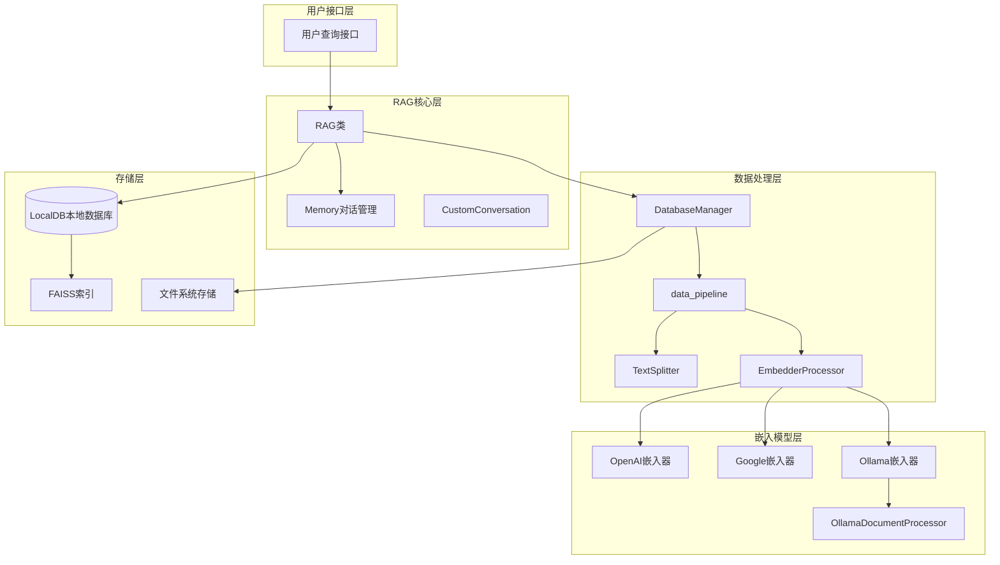
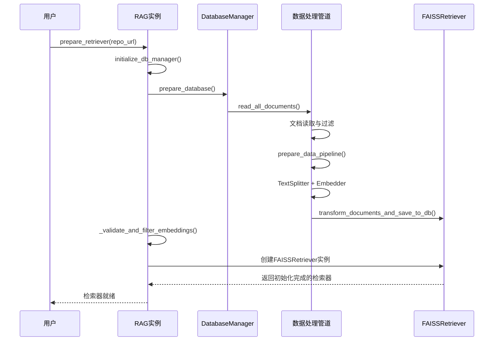
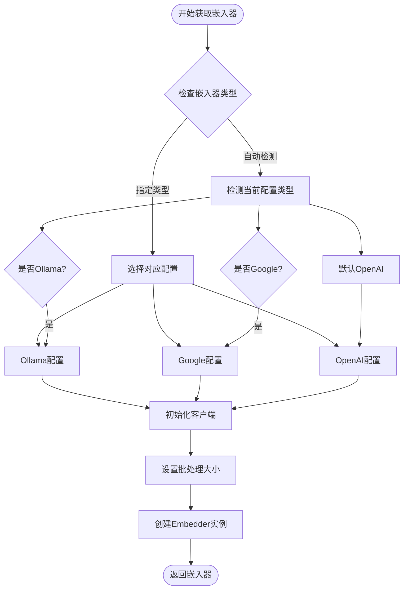
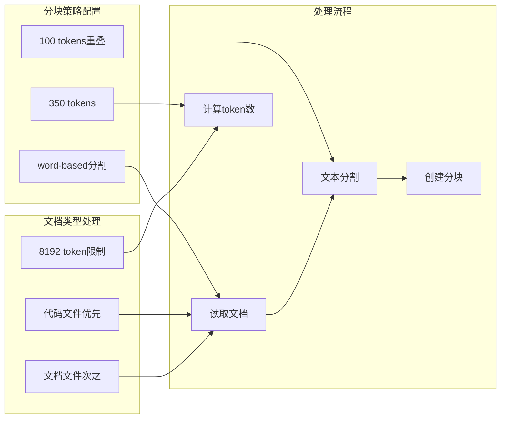
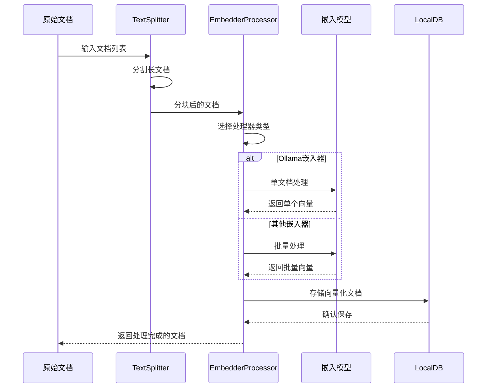
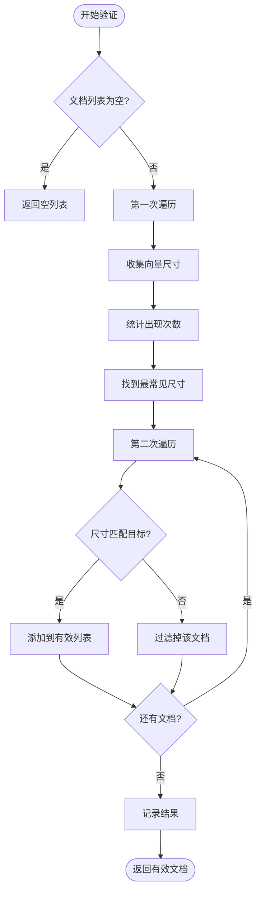
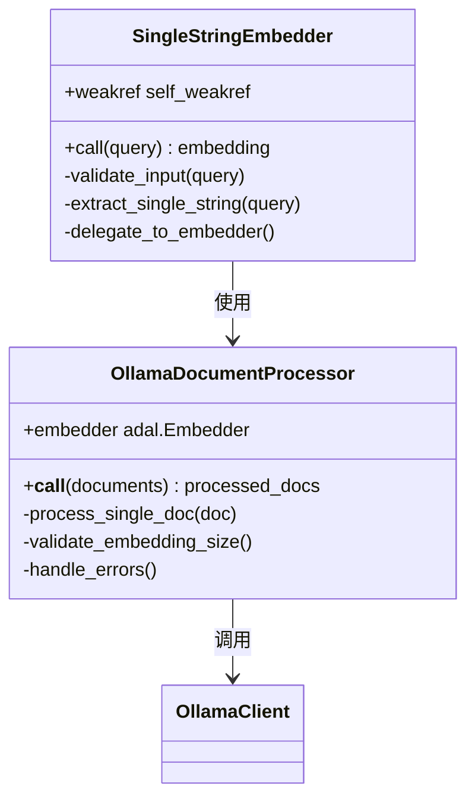
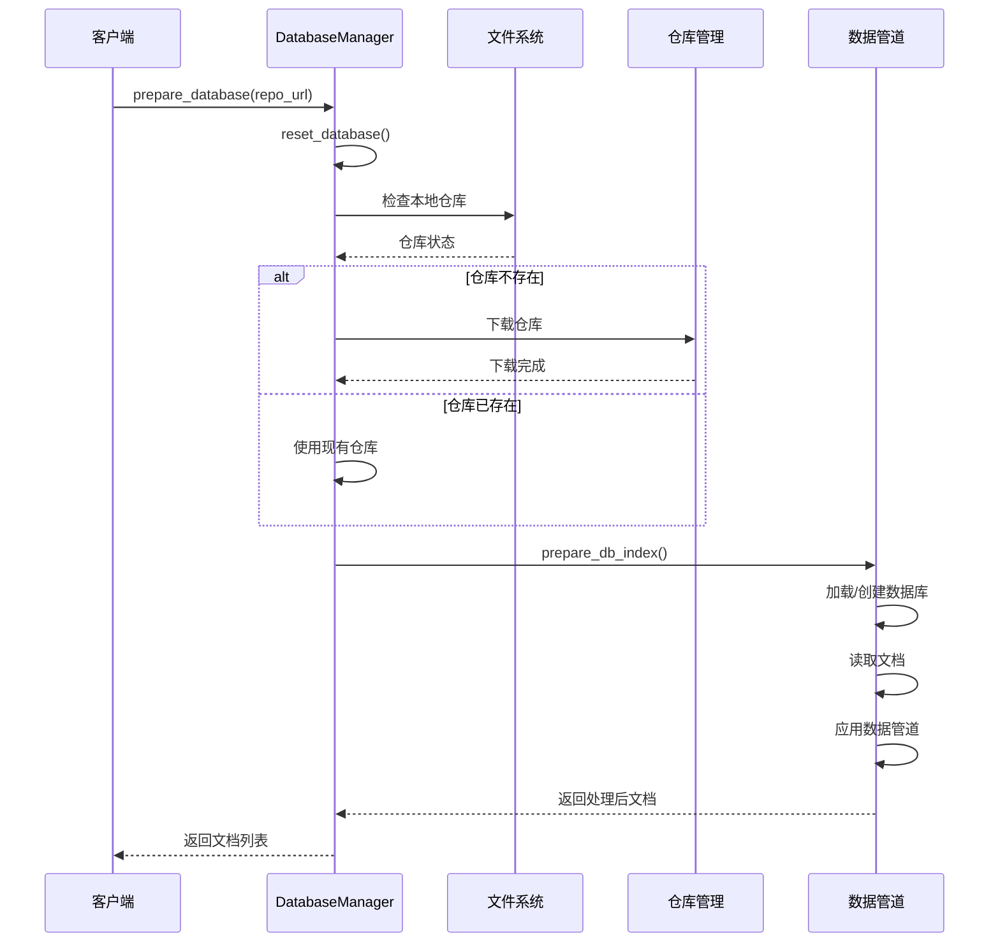
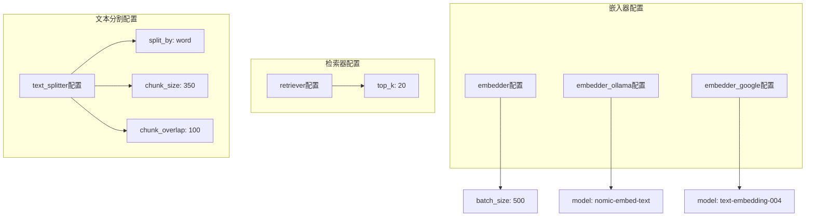

# 检索系统

<cite>
**本文档中引用的文件**
- [api/rag.py](file://api/rag.py)
- [api/tools/embedder.py](file://api/tools/embedder.py)
- [api/data_pipeline.py](file://api/data_pipeline.py)
- [api/config/embedder.json](file://api/config/embedder.json)
- [api/ollama_patch.py](file://api/ollama_patch.py)
- [api/config.py](file://api/config.py)
</cite>

## 目录
1. [简介](#简介)
2. [系统架构概览](#系统架构概览)
3. [FAISSRetriever初始化过程](#faissretriever初始化过程)
4. [嵌入模型管理](#嵌入模型管理)
5. [文档分块策略](#文档分块策略)
6. [向量化处理机制](#向量化处理机制)
7. [嵌入验证逻辑](#嵌入验证逻辑)
8. [Ollama兼容性处理](#ollama兼容性处理)
9. [DatabaseManager数据预处理](#databasemanager数据预处理)
10. [配置文件影响](#配置文件影响)
11. [性能优化建议](#性能优化建议)
12. [常见错误排查](#常见错误排查)
13. [总结](#总结)

## 简介

deepwiki-open的RAG检索系统是一个基于FAISS的向量检索系统，专门设计用于从代码库和文档中提取相关信息。该系统通过复杂的文档处理管道，将源代码和文档转换为向量表示，并建立高效的相似度搜索索引。

核心特性包括：
- 多嵌入模型支持（OpenAI、Google、Ollama）
- 智能文档分块和文本分割
- 嵌入向量一致性验证
- 跨平台仓库支持（GitHub、GitLab、Bitbucket）
- 高性能FAISS索引构建

## 系统架构概览

**图表来源**
- [api/rag.py](file://api/rag.py#L143-L250)
- [api/data_pipeline.py](file://api/data_pipeline.py#L703-L886)

## FAISSRetriever初始化过程

### prepare_retriever方法详解

FAISSRetriever的初始化是整个检索系统的核心，通过`prepare_retriever`方法完成以下关键步骤：

**图表来源**
- [api/rag.py](file://api/rag.py#L345-L416)
- [api/data_pipeline.py](file://api/data_pipeline.py#L713-L870)

### 初始化流程的关键步骤

1. **数据库管理器初始化**：调用`initialize_db_manager()`创建新的DatabaseManager实例
2. **仓库准备**：通过`prepare_database()`方法下载或加载仓库内容
3. **文档转换**：执行完整的数据处理管道，包括文本分割和向量化
4. **嵌入验证**：使用`_validate_and_filter_embeddings()`确保向量一致性
5. **FAISS索引构建**：创建FAISSRetriever实例并建立向量索引

**章节来源**
- [api/rag.py](file://api/rag.py#L345-L416)

## 嵌入模型管理

### get_embedder函数实现

嵌入模型的选择和初始化通过`get_embedder`函数统一管理：

**图表来源**
- [api/tools/embedder.py](file://api/tools/embedder.py#L6-L54)

### 支持的嵌入模型

系统支持三种主要的嵌入模型提供商：

| 提供商 | 配置键 | 默认模型 | 批处理大小 |
|--------|--------|----------|------------|
| OpenAI | embedder | text-embedding-3-small | 500 |
| Google | embedder_google | text-embedding-004 | 100 |
| Ollama | embedder_ollama | nomic-embed-text | 单文档处理 |

**章节来源**
- [api/tools/embedder.py](file://api/tools/embedder.py#L6-L54)
- [api/config/embedder.json](file://api/config/embedder.json#L2-L32)

## 文档分块策略

### TextSplitter配置

系统使用智能的文本分割策略来处理不同类型的文档：

**图表来源**
- [api/config/embedder.json](file://api/config/embedder.json#L28-L32)
- [api/data_pipeline.py](file://api/data_pipeline.py#L144-L371)

### 分块参数详解

- **split_by**: "word" - 基于单词进行分割
- **chunk_size**: 350 - 每个分块的最大token数
- **chunk_overlap**: 100 - 相邻分块之间的重叠token数

这种配置确保：
1. 保持语义完整性
2. 减少上下文丢失
3. 适应不同模型的token限制

**章节来源**
- [api/config/embedder.json](file://api/config/embedder.json#L28-L32)

## 向量化处理机制

### 数据处理管道

系统采用流水线方式处理文档向量化：

**图表来源**
- [api/data_pipeline.py](file://api/data_pipeline.py#L373-L415)

### 处理器选择逻辑

根据嵌入器类型自动选择合适的处理器：

- **Ollama**: 使用`OllamaDocumentProcessor`进行单文档处理
- **其他**: 使用`ToEmbeddings`进行批量处理

**章节来源**
- [api/data_pipeline.py](file://api/data_pipeline.py#L373-L415)

## 嵌入验证逻辑

### _validate_and_filter_embeddings方法

该方法确保所有文档具有一致的向量维度：

**图表来源**
- [api/rag.py](file://api/rag.py#L251-L343)

### 验证规则

1. **尺寸一致性**: 所有文档必须具有相同的向量维度
2. **非空验证**: 跳过没有向量的文档
3. **类型安全**: 支持list、numpy数组等多种向量格式
4. **异常处理**: 对无效向量进行优雅降级

**章节来源**
- [api/rag.py](file://api/rag.py#L251-L343)

## Ollama兼容性处理

### single_string_embedder补丁

针对Ollama的特殊需求，系统实现了`single_string_embedder`补丁：

**图表来源**
- [api/rag.py](file://api/rag.py#L195-L206)
- [api/ollama_patch.py](file://api/ollama_patch.py#L62-L105)

### Ollama特定处理

1. **单字符串限制**: Ollama只支持单个字符串输入
2. **模型检查**: 在初始化时验证模型可用性
3. **错误恢复**: 实现优雅的错误处理机制
4. **批处理适配**: 为Ollama提供单文档处理能力

**章节来源**
- [api/rag.py](file://api/rag.py#L195-L206)
- [api/ollama_patch.py](file://api/ollama_patch.py#L62-L105)

## DatabaseManager数据预处理

### prepare_database方法流程

DatabaseManager负责完整的数据预处理管道：

**图表来源**
- [api/data_pipeline.py](file://api/data_pipeline.py#L713-L870)

### 文件过滤机制

系统提供了灵活的文件过滤配置：

| 过滤类型 | 默认值 | 说明 |
|----------|--------|------|
| 排除目录 | .venv/, .git/, build/ | 开发工具和编译输出 |
| 排除文件 | *.lock, *.log, *.min.* | 构建产物和日志文件 |
| 包含目录 | 无限制 | 可以指定特定目录 |
| 包含文件 | 无限制 | 可以指定特定文件模式 |

**章节来源**
- [api/data_pipeline.py](file://api/data_pipeline.py#L262-L301)

## 配置文件影响

### embedder.json配置结构

配置文件定义了系统的核心参数：

**图表来源**
- [api/config/embedder.json](file://api/config/embedder.json#L1-L33)

### 配置参数说明

- **batch_size**: 控制批量处理大小，影响内存使用和处理速度
- **top_k**: 检索时返回的最相似文档数量
- **chunk_size**: 单个文档分块的大小
- **chunk_overlap**: 相邻分块之间的重叠程度

**章节来源**
- [api/config/embedder.json](file://api/config/embedder.json#L1-L33)

## 性能优化建议

### 内存优化

1. **批处理大小调整**: 根据可用内存调整`batch_size`
   - OpenAI: 500 (默认)
   - Google: 100 (默认)
   - Ollama: 单文档处理

2. **分块大小优化**: 平衡语义完整性和内存使用
   - 当前配置: 350 tokens + 100 token重叠

3. **数据库缓存**: 利用本地数据库避免重复处理

### 并发处理

1. **多线程支持**: 对于支持的嵌入器启用并发处理
2. **异步操作**: 在Web应用中使用异步API调用
3. **资源池化**: 复用连接和客户端实例

### 索引优化

1. **索引类型选择**: 根据数据规模选择合适的FAISS索引
2. **定期重建**: 随着新文档加入定期更新索引
3. **内存映射**: 对大型索引使用内存映射文件

## 常见错误排查

### 嵌入向量不一致错误

**症状**: "All embeddings should be of the same size" 错误

**原因分析**:
1. 不同文档使用了不同的嵌入模型
2. 模型版本不一致
3. 文本预处理差异

**解决方案**:
1. 检查嵌入器配置的一致性
2. 验证模型可用性
3. 重新运行文档处理管道

### Ollama模型未找到

**症状**: "Ollama model 'xxx' not found" 错误

**排查步骤**:
1. 检查Ollama服务是否运行
2. 验证模型名称拼写
3. 执行 `ollama pull model_name` 安装模型

### 内存不足错误

**症状**: 处理大文件时内存溢出

**解决方法**:
1. 减少`batch_size`参数
2. 增加系统内存
3. 使用流式处理替代批量处理

### 权限访问错误

**症状**: 访问私有仓库时权限被拒绝

**解决方案**:
1. 正确配置访问令牌
2. 检查仓库URL格式
3. 验证网络连接

## 总结

deepwiki-open的RAG检索系统展现了现代向量检索技术的最佳实践。通过精心设计的架构，系统实现了：

1. **模块化设计**: 清晰分离各个组件职责
2. **多模型支持**: 灵活适配不同嵌入模型
3. **智能处理**: 自动化的文档分块和向量化
4. **质量保证**: 完善的验证和错误处理机制
5. **性能优化**: 针对不同场景的优化策略

该系统为代码知识库的智能检索提供了强大而可靠的基础设施，支持大规模代码库的高效问答和信息提取。通过合理的配置和优化，可以在各种部署环境中获得优异的性能表现。