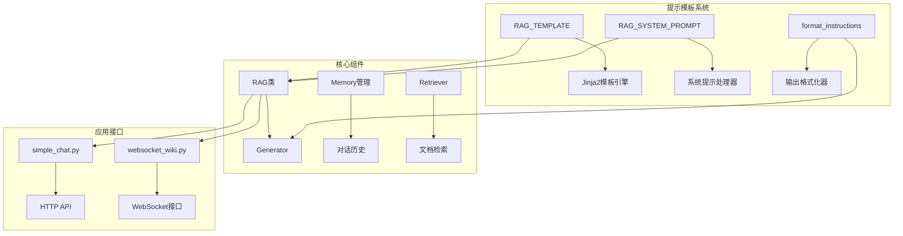
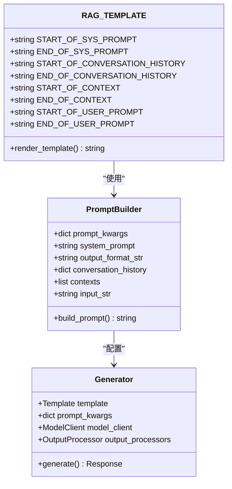
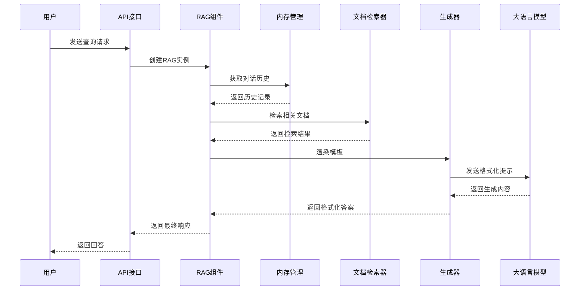
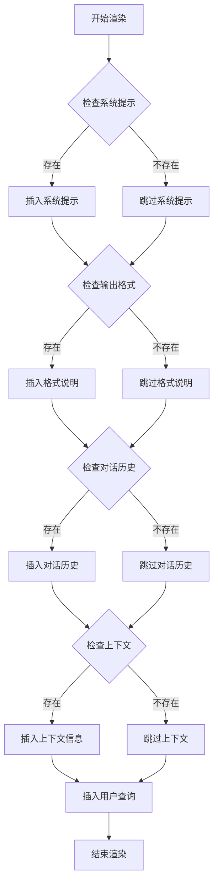
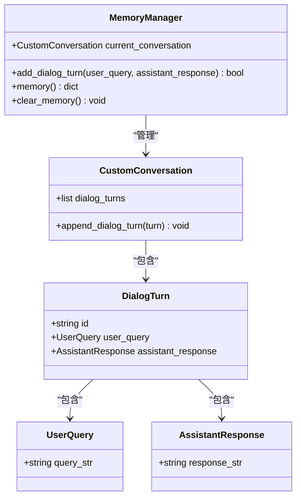
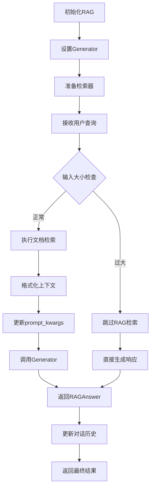
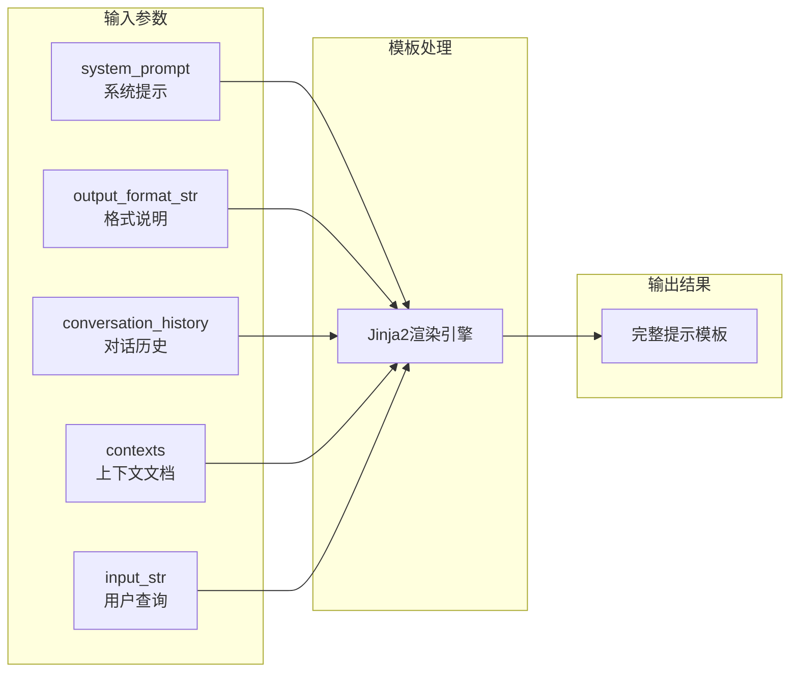
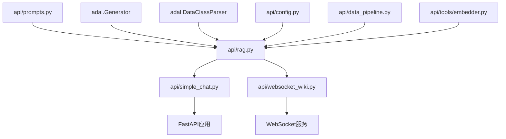
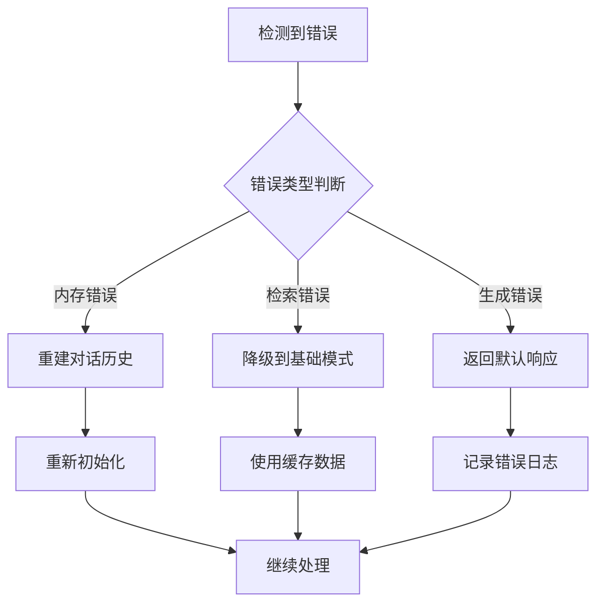

# 提示模板

<cite>
**本文档中引用的文件**
- [api/prompts.py](file://api/prompts.py)
- [api/rag.py](file://api/rag.py)
- [api/simple_chat.py](file://api/simple_chat.py)
- [api/websocket_wiki.py](file://api/websocket_wiki.py)
</cite>

## 目录
1. [简介](#简介)
2. [项目结构概览](#项目结构概览)
3. [核心组件分析](#核心组件分析)
4. [架构概览](#架构概览)
5. [详细组件分析](#详细组件分析)
6. [依赖关系分析](#依赖关系分析)
7. [性能考虑](#性能考虑)
8. [故障排除指南](#故障排除指南)
9. [结论](#结论)

## 简介

deepwiki-open项目中的RAG（检索增强生成）系统采用了一套精心设计的Jinja2模板系统来构建高质量的AI提示。该系统通过RAG_TEMPLATE模板实现了灵活的提示工程，支持动态注入系统提示、对话历史、上下文信息和用户查询，为用户提供准确且上下文相关的代码库问答服务。

## 项目结构概览

deepwiki-open项目采用模块化的架构设计，其中提示模板系统位于核心位置，支撑着整个RAG功能的实现：

**图表来源**
- [api/prompts.py](file://api/prompts.py#L30-L65)
- [api/rag.py](file://api/rag.py#L153-L243)

## 核心组件分析

### RAG_TEMPLATE模板结构

RAG_TEMPLATE是整个RAG系统的核心模板，采用Jinja2语法实现高度可配置的提示生成：

**图表来源**
- [api/prompts.py](file://api/prompts.py#L30-L65)
- [api/rag.py](file://api/rag.py#L232-L243)

**章节来源**
- [api/prompts.py](file://api/prompts.py#L30-L65)

### RAG_SYSTEM_PROMPT设计原则

RAG_SYSTEM_PROMPT定义了AI助手的行为准则和输出规范，包含以下关键设计原则：

| 设计原则 | 描述 | 实现方式 |
|---------|------|----------|
| 语言检测与响应 | 自动检测用户语言并保持一致 | 基于用户输入的语言自动调整响应语言 |
| Markdown格式化 | 强制使用Markdown格式输出 | 包含详细的Markdown语法规范 |
| 重要格式规则 | 避免特定格式元素干扰 | 明确禁止markdown fences和特殊字符转义 |
| 思维链推理 | 支持逐步思考过程 | 允许在rationale字段中包含推理过程 |

**章节来源**
- [api/prompts.py](file://api/prompts.py#L4-L28)

## 架构概览

RAG系统的整体架构展示了从模板到最终响应的完整流程：

**图表来源**
- [api/rag.py](file://api/rag.py#L232-L243)
- [api/simple_chat.py](file://api/simple_chat.py#L184-L202)

## 详细组件分析

### 模板标记系统

RAG_TEMPLATE使用特定的标记来组织和分隔不同的内容部分：

**图表来源**
- [api/prompts.py](file://api/prompts.py#L31-L56)

#### 关键标记的作用和处理流程

| 标记名称 | 作用 | 处理方式 | 示例 |
|---------|------|----------|------|
| `<START_OF_SYS_PROMPT>` | 系统提示开始标识 | 直接插入系统提示文本 | `<START_OF_SYS_PROMPT><system_prompt><END_OF_SYS_PROMPT>` |
| `<END_OF_SYS_PROMPT>` | 系统提示结束标识 | 结束系统提示区域 | 同上 |
| `<START_OF_CONVERSATION_HISTORY>` | 对话历史开始标识 | 循环遍历对话记录 | `<START_OF_CONVERSATION_HISTORY>{对话记录}<END_OF_CONVERSATION_HISTORY>` |
| `<START_OF_CONTEXT>` | 上下文信息开始标识 | 遍历检索到的文档 | `<START_OF_CONTEXT>{文档内容}<END_OF_CONTEXT>` |
| `<START_OF_USER_PROMPT>` | 用户查询开始标识 | 插入用户原始问题 | `<START_OF_USER_PROMPT>{input_str}<END_OF_USER_PROMPT>` |

**章节来源**
- [api/prompts.py](file://api/prompts.py#L31-L56)

### 对话历史管理系统

对话历史管理系统负责维护和管理用户的交互记录：

**图表来源**
- [api/rag.py](file://api/rag.py#L59-L149)

**章节来源**
- [api/rag.py](file://api/rag.py#L59-L149)

### RAG组件的工作流程

RAG组件是整个系统的核心控制器，负责协调各个子系统的协作：

**图表来源**
- [api/rag.py](file://api/rag.py#L416-L446)

**章节来源**
- [api/rag.py](file://api/rag.py#L416-L446)

### 实际模板渲染示例

以下是RAG_TEMPLATE的实际渲染示例，展示了模板如何将各种输入组合成最终的提示：

**图表来源**
- [api/rag.py](file://api/rag.py#L232-L243)

## 依赖关系分析

RAG模板系统的依赖关系展现了各组件之间的相互依赖：

**图表来源**
- [api/rag.py](file://api/rag.py#L153-L243)

**章节来源**
- [api/rag.py](file://api/rag.py#L153-L243)

## 性能考虑

RAG模板系统在设计时充分考虑了性能优化：

### 模板渲染优化
- 使用Jinja2模板引擎进行高效的字符串替换
- 条件渲染减少不必要的内容注入
- 缓存机制避免重复计算

### 内存管理
- 对话历史的智能截断
- 文档检索结果的及时清理
- 垃圾回收机制确保内存释放

### 并发处理
- 异步API接口支持高并发访问
- 连接池管理减少连接开销
- 资源池化提高响应速度

## 故障排除指南

### 常见问题及解决方案

| 问题类型 | 症状 | 可能原因 | 解决方案 |
|---------|------|----------|----------|
| 模板渲染失败 | 提示格式错误 | Jinja2语法错误 | 检查模板语法，验证变量存在性 |
| 对话历史丢失 | 响应缺乏上下文 | Memory管理异常 | 检查add_dialog_turn方法调用 |
| 上下文信息缺失 | 回答缺乏相关性 | 文档检索失败 | 验证检索器配置和文档索引 |
| 输出格式错误 | Markdown格式混乱 | 格式说明不匹配 | 检查format_instructions配置 |

**章节来源**
- [api/rag.py](file://api/rag.py#L126-L141)

### 错误恢复机制

RAG系统实现了多层次的错误恢复机制：

**图表来源**
- [api/rag.py](file://api/rag.py#L126-L141)

## 结论

deepwiki-open的RAG提示模板系统通过精心设计的Jinja2模板架构，实现了灵活、高效且可扩展的AI提示生成能力。该系统的核心优势包括：

1. **模块化设计**：清晰的组件分离使得系统易于维护和扩展
2. **灵活的模板系统**：Jinja2模板提供了强大的动态内容生成功能
3. **智能的上下文管理**：完善的对话历史和文档检索机制
4. **健壮的错误处理**：多层错误恢复确保系统稳定性
5. **高性能优化**：针对大语言模型的专门优化

该模板系统为deepwiki-open项目提供了坚实的AI提示工程基础，支持复杂的代码库问答场景，同时保持了良好的用户体验和系统性能。