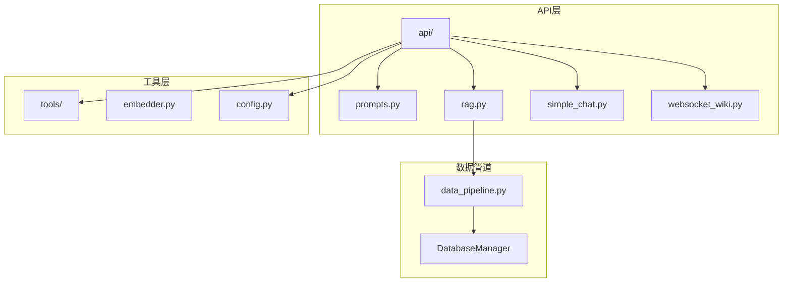
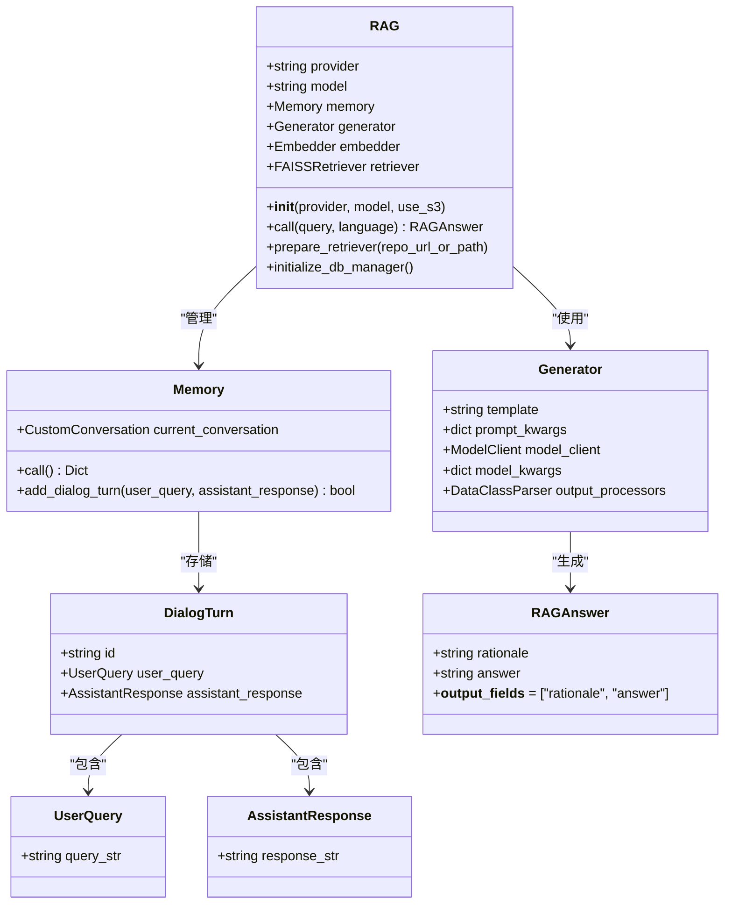
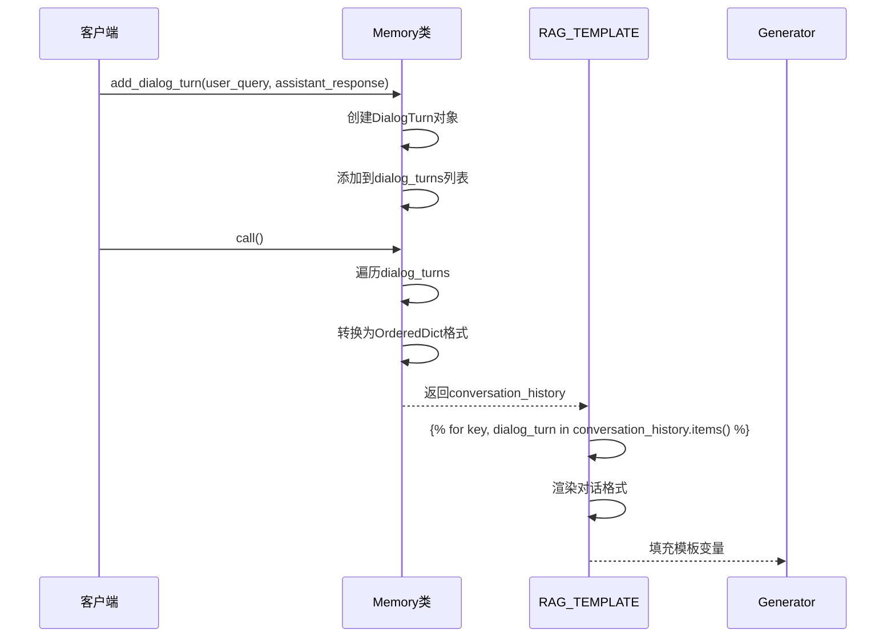
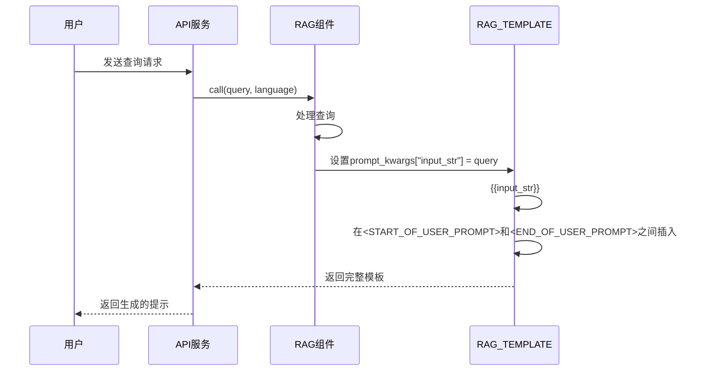
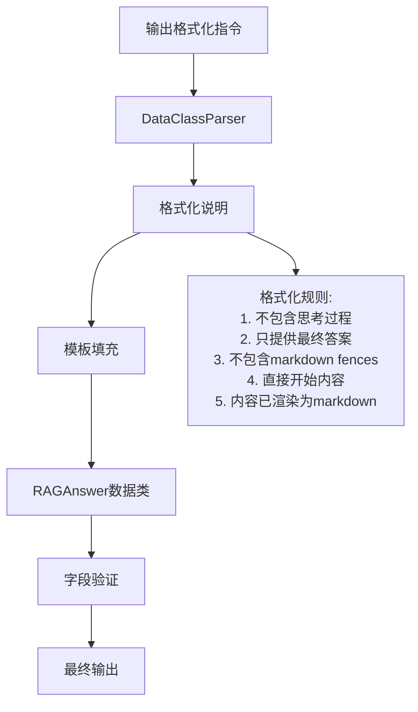
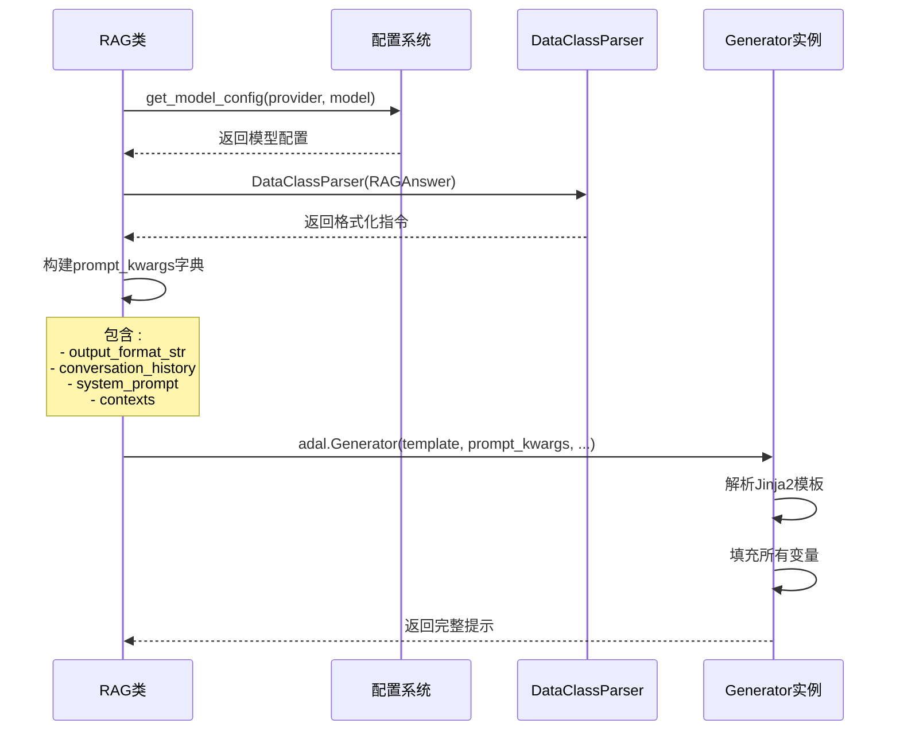
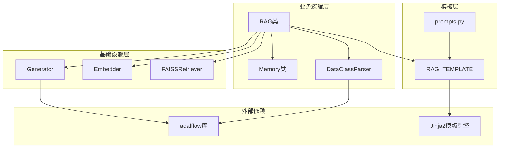

# 模板语法结构

<cite>
**本文档中引用的文件**
- [prompts.py](file://api/prompts.py)
- [rag.py](file://api/rag.py)
- [simple_chat.py](file://api/simple_chat.py)
- [websocket_wiki.py](file://api/websocket_wiki.py)
- [data_pipeline.py](file://api/data_pipeline.py)
</cite>

## 目录
1. [简介](#简介)
2. [项目结构概览](#项目结构概览)
3. [核心组件分析](#核心组件分析)
4. [架构概览](#架构概览)
5. [详细组件分析](#详细组件分析)
6. [依赖关系分析](#依赖关系分析)
7. [性能考虑](#性能考虑)
8. [故障排除指南](#故障排除指南)
9. [结论](#结论)

## 简介

deepwiki-open项目采用了一套精心设计的RAG（检索增强生成）模板系统，该系统基于Jinja2模板引擎构建，提供了灵活且强大的提示模板语法结构。本文档深入解析了RAG_TEMPLATE中的关键标记及其处理流程，包括对话历史管理、上下文注入和用户查询处理等核心功能。

## 项目结构概览

deepwiki-open项目采用模块化架构，主要包含以下核心模块：



**图表来源**
- [prompts.py](file://api/prompts.py#L1-L192)
- [rag.py](file://api/rag.py#L1-L446)

**章节来源**
- [prompts.py](file://api/prompts.py#L1-L192)
- [rag.py](file://api/rag.py#L1-L446)

## 核心组件分析

### RAG_TEMPLATE模板结构

RAG_TEMPLATE是整个RAG系统的核心模板，定义了完整的提示结构：

```mermaid
flowchart TD
Start([模板开始]) --> SysPrompt[系统提示部分<br/><START_OF_SYS_PROMPT><br/>{system_prompt}<br/>{output_format_str}<br/><END_OF_SYS_PROMPT>]
SysPrompt --> ConvHistory{是否有对话历史?}
ConvHistory --> |是| ConvStart[对话历史开始<br/><START_OF_CONVERSATION_HISTORY>]
ConvHistory --> |否| ContextCheck{是否有上下文?}
ConvStart --> ConvLoop[遍历对话轮次<br/>{for key, dialog_turn in conversation_history.items()}]
ConvLoop --> ConvFormat[格式化对话<br/>User: {dialog_turn.user_query.query_str}<br/>You: {dialog_turn.assistant_response.response_str}]
ConvFormat --> ConvEnd[对话历史结束<br/><END_OF_CONVERSATION_HISTORY>]
ConvEnd --> ContextCheck
ContextCheck --> |是| ContextStart[上下文开始<br/><START_OF_CONTEXT>]
ContextCheck --> |否| UserPrompt[用户提示开始<br/><START_OF_USER_PROMPT>]
ContextStart --> ContextLoop[遍历上下文文档<br/>{for context in contexts}]
ContextLoop --> ContextFormat[格式化文档<br/>File Path: {context.meta_data.get('file_path', 'unknown')}<br/>Content: {context.text}]
ContextFormat --> ContextEnd[上下文结束<br/><END_OF_CONTEXT>]
ContextEnd --> UserPrompt
UserPrompt --> UserInput[用户输入<br/>{{input_str}}]
UserInput --> End([模板结束])
```

**图表来源**
- [prompts.py](file://api/prompts.py#L31-L56)

**章节来源**
- [prompts.py](file://api/prompts.py#L30-L57)

## 架构概览

### RAG系统架构



**图表来源**
- [rag.py](file://api/rag.py#L153-L446)

## 详细组件分析

### 对话历史处理机制

#### OrderedDict结构注入与迭代

对话历史通过`conversation_history`参数注入模板，该参数是一个OrderedDict结构：



**图表来源**
- [rag.py](file://api/rag.py#L59-L141)

#### 对话历史标记处理

模板中的对话历史处理遵循以下模式：

| 标记 | 作用 | 处理方式 |
|------|------|----------|
| `<START_OF_CONVERSATION_HISTORY>` | 标记对话历史开始 | 条件渲染，仅当有对话历史时显示 |
| `` | 遍历对话轮次 | 使用Jinja2循环渲染每个对话回合 |
| `{{key}}.` | 显示对话序号 | 动态生成对话编号 |
| `User: {{dialog_turn.user_query.query_str}}` | 用户查询内容 | 提取并显示用户原始问题 |
| `You: {{dialog_turn.assistant_response.response_str}}` | 助手响应内容 | 提取并显示助手回答 |
| `<END_OF_CONVERSATION_HISTORY>` | 标记对话历史结束 | 条件渲染，仅当有对话历史时显示 |

**章节来源**
- [prompts.py](file://api/prompts.py#L36-L44)
- [rag.py](file://api/rag.py#L59-L141)

### 上下文文档处理机制

#### 文档片段遍历与格式化

上下文处理通过`contexts`参数实现，该参数是一个文档列表：

```mermaid
flowchart TD
ContextStart[开始上下文处理] --> ContextCheck{contexts存在?}
ContextCheck --> |否| SkipContext[跳过上下文部分]
ContextCheck --> |是| ContextLoop[开始循环遍历]
ContextLoop --> IndexFormat[生成索引编号<br/>{{loop.index}}.]
IndexFormat --> FilePath[提取文件路径<br/>{{context.meta_data.get('file_path', 'unknown')}}
FilePath --> Content[提取内容<br/>{{context.text}}
Content --> ContextEnd[单个文档处理完成]
ContextEnd --> MoreDocs{还有更多文档?}
MoreDocs --> |是| ContextLoop
MoreDocs --> |否| ContextWrap[包装上下文<br/><START_OF_CONTEXT><br/>...<br/><END_OF_CONTEXT>]
ContextWrap --> SkipContext
SkipContext --> End[处理完成]
```

**图表来源**
- [prompts.py](file://api/prompts.py#L45-L53)

#### 上下文格式化规则

| 元素 | Jinja2表达式 | 描述 | 示例输出 |
|------|-------------|------|----------|
| 文档编号 | `{{loop.index}}.` | 自动生成的文档序号 | `1.` |
| 文件路径 | `{{context.meta_data.get('file_path', 'unknown')}}` | 文档元数据中的文件路径，不存在时显示"unknown" | `/src/main.py` |
| 文档内容 | `{{context.text}}` | 实际的文档内容 | `def function():\n    return True` |
| 包装标记 | `<START_OF_CONTEXT>` 和 `<END_OF_CONTEXT>` | 上下文区域的开始和结束标记 | 用于标识上下文区域 |

**章节来源**
- [prompts.py](file://api/prompts.py#L46-L53)

### 用户查询注入机制

#### input_str变量处理

用户查询通过`input_str`变量注入模板：



**图表来源**
- [rag.py](file://api/rag.py#L416-L445)

**章节来源**
- [prompts.py](file://api/prompts.py#L54-L56)

### 输出格式化指令

#### output_format_str的作用与关联

`output_format_str`是RAGAnswer数据类的格式化指令，与模板中的格式化规则紧密关联：



**图表来源**
- [rag.py](file://api/rag.py#L213-L226)

#### 格式化规则表

| 规则编号 | 规则描述 | 实现位置 | 影响 |
|----------|----------|----------|------|
| 1 | 不包含思考或推理过程 | `format_instructions` | 确保输出简洁 |
| 2 | 只提供最终、打磨的答案 | `format_instructions` | 避免冗余信息 |
| 3 | 不包含markdown fences | `format_instructions` | 避免嵌套代码块 |
| 4 | 不包裹任何类型的fences | `format_instructions` | 简化输出格式 |
| 5 | 直接从内容开始 | `format_instructions` | 提高可读性 |
| 6 | 内容已渲染为markdown | `format_instructions` | 减少客户端处理 |
| 7 | 不使用特殊字符转义 | `format_instructions` | 保持文本原貌 |
| 8 | 列表项直接写为纯文本 | `format_instructions` | 避免转义问题 |
| 9 | 管道字符直接书写 | `format_instructions` | 避免转义问题 |

**章节来源**
- [rag.py](file://api/rag.py#L213-L226)

### Generator实例化与模板协同工作

#### template和prompt_kwargs协同机制

Generator的实例化展示了模板变量的动态填充过程：



**图表来源**
- [rag.py](file://api/rag.py#L231-L243)

#### prompt_kwargs参数详解

| 参数名 | 类型 | 作用 | 示例值 |
|--------|------|------|--------|
| `output_format_str` | string | 格式化指令，来自RAGAnswer数据类 | 格式化说明字符串 |
| `conversation_history` | dict | 对话历史，OrderedDict结构 | `{"uuid": DialogTurn}` |
| `system_prompt` | string | 系统提示语 | RAG_SYSTEM_PROMPT常量 |
| `contexts` | list | 检索到的上下文文档列表 | `[Document, Document, ...]` |
| `input_str` | string | 用户查询输入 | 用户实际问题 |

**章节来源**
- [rag.py](file://api/rag.py#L233-L239)

## 依赖关系分析

### 组件耦合关系



**图表来源**
- [rag.py](file://api/rag.py#L1-L446)
- [prompts.py](file://api/prompts.py#L1-L192)

**章节来源**
- [rag.py](file://api/rag.py#L1-L446)
- [prompts.py](file://api/prompts.py#L1-L192)

## 性能考虑

### 模板渲染优化

1. **条件渲染优化**：对话历史和上下文部分采用条件渲染，避免不必要的模板填充
2. **延迟加载**：只有在需要时才加载和处理对话历史和上下文
3. **内存管理**：使用弱引用避免循环引用导致的内存泄漏
4. **批量处理**：上下文文档采用批量处理，减少模板解析次数

### 输入大小控制

系统实现了多层输入大小控制机制：
- 最大令牌限制：7500令牌的安全阈值
- 嵌入验证：确保所有文档具有一致的嵌入维度
- 错误恢复：输入过大时自动降级处理

## 故障排除指南

### 常见问题与解决方案

#### 对话历史处理问题

| 问题 | 症状 | 解决方案 |
|------|------|----------|
| 对话历史为空 | `<START_OF_CONVERSATION_HISTORY>`不显示 | 检查Memory.add_dialog_turn()调用 |
| 对话格式错误 | 对话显示乱码 | 验证DialogTurn对象的属性完整性 |
| 序号错乱 | 对话编号不连续 | 检查UUID生成和排序逻辑 |

#### 上下文处理问题

| 问题 | 症状 | 解决方案 |
|------|------|----------|
| 文档路径缺失 | 显示"unknown" | 检查文档元数据完整性 |
| 内容截断 | 文档内容不完整 | 验证嵌入大小验证逻辑 |
| 格式混乱 | 文档显示异常 | 检查Jinja2模板语法 |

#### 模板渲染问题

| 问题 | 症状 | 解决方案 |
|------|------|----------|
| 变量未替换 | 模板显示原始变量名 | 检查prompt_kwargs参数 |
| 语法错误 | 模板解析失败 | 验证Jinja2语法正确性 |
| 编码问题 | 特殊字符显示异常 | 检查字符编码设置 |

**章节来源**
- [rag.py](file://api/rag.py#L121-L141)

## 结论

deepwiki-open的RAG模板系统展现了现代AI应用中提示工程的最佳实践。通过精心设计的Jinja2模板语法，系统实现了：

1. **灵活的模板结构**：支持动态对话历史、上下文和用户查询的注入
2. **强类型的数据处理**：通过RAGAnswer数据类确保输出格式的一致性
3. **优雅的错误处理**：多层次的错误检测和恢复机制
4. **高效的性能优化**：条件渲染和批量处理提升系统效率

这套模板系统不仅满足了当前的功能需求，还为未来的扩展和优化奠定了坚实的基础。通过模块化的架构设计和清晰的职责分离，开发者可以轻松地对系统进行定制和改进。