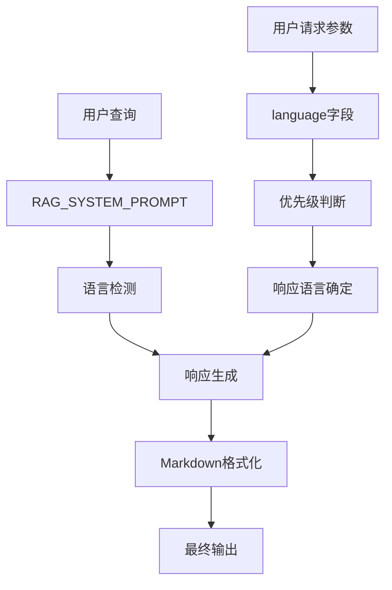
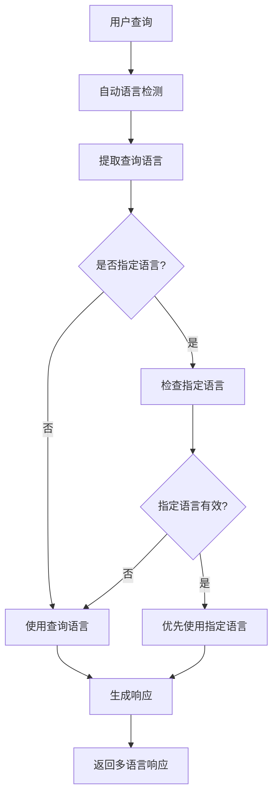
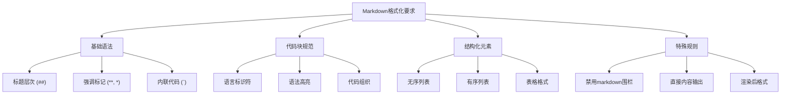
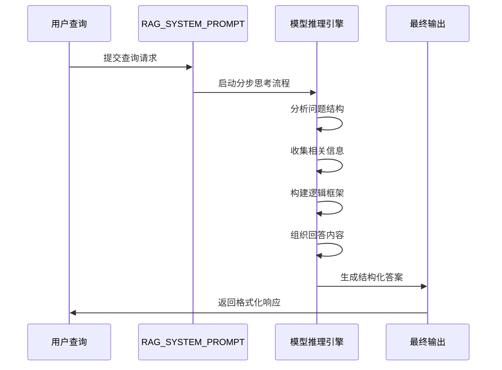
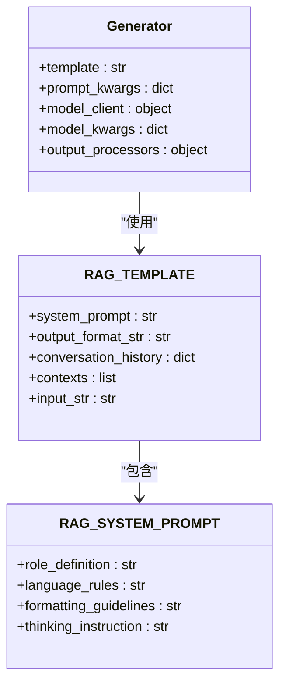
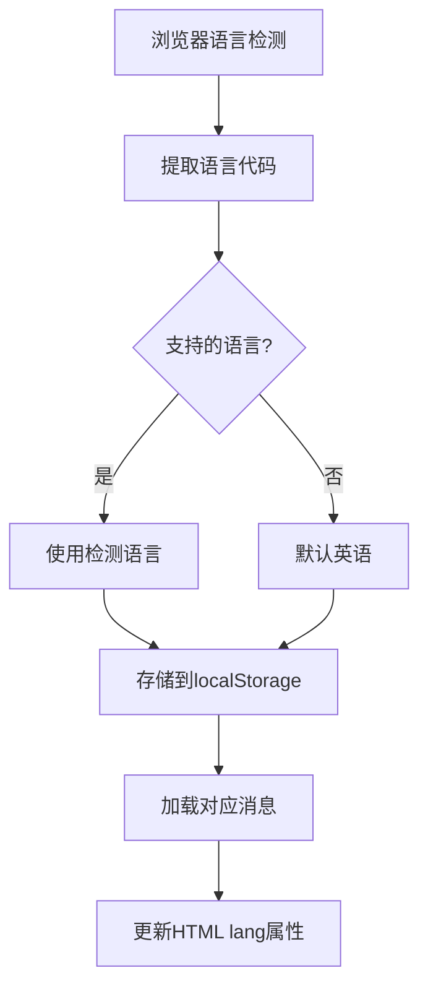
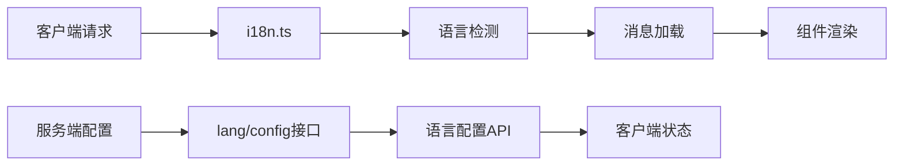

# 系统提示设计

<cite>
**本文档中引用的文件**
- [prompts.py](file://api/prompts.py)
- [rag.py](file://api/rag.py)
- [config.py](file://api/config.py)
- [websocket_wiki.py](file://api/websocket_wiki.py)
- [simple_chat.py](file://api/simple_chat.py)
- [lang.json](file://api/config/lang.json)
- [LanguageContext.tsx](file://src/contexts/LanguageContext.tsx)
- [Markdown.tsx](file://src/components/Markdown.tsx)
- [i18n.ts](file://src/i18n.ts)
</cite>

## 目录
1. [简介](#简介)
2. [RAG_SYSTEM_PROMPT核心设计](#rag_system_prompt核心设计)
3. [语言检测与响应规则](#语言检测与响应规则)
4. [Markdown格式化要求](#markdown格式化要求)
5. [分步思考指令机制](#分步思考指令机制)
6. [系统提示注入机制](#系统提示注入机制)
7. [多语言支持架构](#多语言支持架构)
8. [实际应用示例](#实际应用示例)
9. [总结](#总结)

## 简介

deepwiki-open项目中的RAG_SYSTEM_PROMPT是一个精心设计的系统提示模板，它定义了AI助手在GitHub仓库问答场景下的行为规范和输出格式要求。该系统提示不仅包含了语言处理规则，还详细规定了Markdown格式化标准，以及如何通过模板注入机制影响模型输出行为。

## RAG_SYSTEM_PROMPT核心设计

RAG_SYSTEM_PROMPT是整个RAG系统的核心指令模板，它为AI助手设定了明确的角色定位和行为准则。



**图表来源**
- [prompts.py](file://api/prompts.py#L4-L28)

### 核心功能模块

RAG_SYSTEM_PROMPT包含以下关键功能模块：

1. **角色定义**：明确AI助手作为GitHub仓库代码助手的身份
2. **输入处理**：接收用户查询、上下文和对话历史
3. **语言处理**：实现智能的语言检测和响应规则
4. **格式化指导**：提供详细的Markdown格式化规范
5. **思维引导**：通过分步思考指令提升回答质量

**章节来源**
- [prompts.py](file://api/prompts.py#L4-L28)

## 语言检测与响应规则

### 语言检测机制

RAG_SYSTEM_PROMPT实现了双重语言检测和响应优先级机制：



**图表来源**
- [prompts.py](file://api/prompts.py#L8-L12)
- [simple_chat.py](file://api/simple_chat.py#L246-L249)

### 优先级处理逻辑

语言处理遵循严格的优先级规则：

| 优先级 | 规则描述 | 实现位置 |
|--------|----------|----------|
| 1 | 用户明确指定的语言 | `request.language` 参数 |
| 2 | 查询内容自动检测的语言 | `language_detection()` 函数 |
| 3 | 默认语言配置 | `configs["lang_config"]["default"]` |

### 支持的语言环境

系统支持以下语言环境：

| 语言代码 | 完整名称 | 使用场景 |
|----------|----------|----------|
| en | English | 英语，默认语言 |
| ja | Japanese (日本語) | 日语支持 |
| zh | Mandarin Chinese (中文) | 中文支持 |
| zh-tw | Traditional Chinese (繁體中文) | 繁体中文支持 |
| es | Spanish (Español) | 西班牙语支持 |
| kr | Korean (한국어) | 韩语支持 |
| vi | Vietnamese (Tiếng Việt) | 越南语支持 |
| pt-br | Brazilian Portuguese (Português Brasileiro) | 巴西葡萄牙语支持 |
| fr | Français (French) | 法语支持 |
| ru | Русский (Russian) | 俄语支持 |

**章节来源**
- [lang.json](file://api/config/lang.json#L2-L14)
- [config.py](file://api/config.py#L234-L260)

## Markdown格式化要求

### 格式化规范体系

RAG_SYSTEM_PROMPT定义了完整的Markdown格式化规范，确保输出内容的可读性和专业性：



**图表来源**
- [prompts.py](file://api/prompts.py#L13-L26)

### 具体格式化规则

#### 代码块格式规范

| 规则类型 | 格式示例 | 用途说明 |
|----------|----------|----------|
| 基础代码块 | ```python<br/>print("Hello World")<br/>``` | 普通代码展示 |
| 带语言标识 | ```javascript<br/>console.log("JS");<br/>``` | 特定语言代码 |
| 多语言支持 | ```bash<br/>pip install package<br/>``` | 命令行代码 |
| 配置文件 | ```json<br/>{ "key": "value" }<br/>``` | 结构化数据 |

#### 结构化元素规范

| 元素类型 | Markdown语法 | 渲染效果 | 使用场景 |
|----------|--------------|----------|----------|
| 主要标题 | `## 标题文本` | 加粗大标题 | 章节划分 |
| 列表项 | `- 内容` 或 `1. 内容` | 项目符号或数字列表 | 条目列举 |
| 表格 | `| 列1 \| 列2 |` | 结构化数据展示 | 对比信息 |
| 强调 | `**加粗**` 或 `*斜体*` | 文本强调 | 关键词突出 |

#### 禁止使用的格式

RAG_SYSTEM_PROMPT明确规定了以下格式的禁用：

- **markdown围栏**：禁止在响应开头或结尾使用```markdown
- **直接代码块**：禁止使用原始的```代码块语法
- **嵌套格式**：避免复杂的嵌套格式结构

**章节来源**
- [prompts.py](file://api/prompts.py#L13-L26)
- [Markdown.tsx](file://src/components/Markdown.tsx#L114-L191)

## 分步思考指令机制

### Think Step by Step指令作用

"Think step by step and ensure your answer is well-structured and visually organized." 这一指令在RAG_SYSTEM_PROMPT中发挥着关键作用：



**图表来源**
- [prompts.py](file://api/prompts.py#L27)

### 对回答质量的影响

分步思考指令对生成的回答产生以下积极影响：

1. **逻辑性增强**：确保回答具有清晰的逻辑层次
2. **完整性提升**：覆盖问题的各个方面
3. **可读性改善**：通过结构化组织提高阅读体验
4. **准确性保证**：通过逐步验证减少错误

### 实际应用效果

在实际应用中，这一指令使AI助手能够：
- 先理解问题背景和需求
- 再收集和整理相关信息
- 最后以结构化的方式呈现答案
- 在过程中保持思维的连贯性

**章节来源**
- [prompts.py](file://api/prompts.py#L27)

## 系统提示注入机制

### Generator初始化过程

RAG_SYSTEM_PROMPT通过`adal.Generator`的`prompt_kwargs`参数注入到RAG_TEMPLATE中，这一机制确保了系统提示能够正确传递给模型：



**图表来源**
- [rag.py](file://api/rag.py#L232-L242)

### 注入参数详解

在`RAG`类的初始化过程中，系统提示通过以下参数注入：

| 参数名 | 类型 | 描述 | 来源 |
|--------|------|------|------|
| `system_prompt` | str | RAG系统提示内容 | `system_prompt`变量 |
| `output_format_str` | str | 输出格式说明 | 数据解析器格式说明 |
| `conversation_history` | dict | 对话历史记录 | `memory()`方法返回 |
| `contexts` | list | 相关上下文文档 | 检索结果文档列表 |

### 模板替换机制

RAG_TEMPLATE使用Python的字符串格式化机制进行参数替换：

```python
# 模板参数替换示例
formatted_template = RAG_TEMPLATE.format(
    system_prompt=system_prompt,
    output_format_str=format_instructions,
    conversation_history=conversation_history,
    contexts=contexts,
    input_str=input_str
)
```

这种机制确保了：
- 系统提示内容能够动态注入
- 对话历史能够实时更新
- 上下文信息能够准确传递
- 输入查询能够正确处理

**章节来源**
- [rag.py](file://api/rag.py#L232-L242)

## 多语言支持架构

### 前端语言检测机制

前端通过`LanguageContext`组件实现智能的语言检测和管理：



**图表来源**
- [LanguageContext.tsx](file://src/contexts/LanguageContext.tsx#L36-L62)

### 后端语言配置管理

后端通过配置文件和运行时检测实现完整的多语言支持：

| 组件 | 功能 | 实现方式 |
|------|------|----------|
| `lang.json` | 语言配置文件 | 静态配置支持的语言列表 |
| `load_lang_config()` | 动态加载配置 | 运行时配置加载 |
| `supported_languages` | 支持语言映射 | 语言代码到显示名称的映射 |
| `default` | 默认语言设置 | 系统默认语言 |

### 国际化集成

系统通过Next.js的国际化框架实现全栈多语言支持：



**图表来源**
- [i18n.ts](file://src/i18n.ts#L1-L14)
- [LanguageContext.tsx](file://src/contexts/LanguageContext.tsx#L69-L96)

**章节来源**
- [LanguageContext.tsx](file://src/contexts/LanguageContext.tsx#L36-L202)
- [i18n.ts](file://src/i18n.ts#L1-L14)
- [config.py](file://api/config.py#L234-L260)

## 实际应用示例

### 语言响应优先级示例

假设用户提交以下查询：

```python
# 示例1：明确指定语言
request = {
    "query": "如何安装依赖？",
    "language": "zh"  # 明确指定中文
}

# 示例2：查询语言检测
request = {
    "query": "How to install dependencies?",
    "language": None  # 自动检测为英语
}

# 示例3：混合语言查询
request = {
    "query": "如何安装依赖？请用英文回答。",
    "language": None  # 尽管有中文，但明确要求英文
}
```

### Markdown格式化示例

系统提示生成的典型响应格式：

```markdown
## 项目安装指南

### 步骤1：克隆仓库
```bash
git clone https://github.com/example/repo.git
cd repo
```

### 步骤2：安装依赖
```python
# 使用pip安装
pip install -r requirements.txt

# 或使用conda
conda install --file environment.yml
```

### 步骤3：验证安装
```bash
python -c "import numpy; print(numpy.__version__)"
```

**重要提示：** 确保Python版本 >= 3.8
```

### 错误处理示例

当系统遇到错误时的响应模式：

```markdown
抱歉，我在处理您的问题时遇到了技术问题。让我尝试另一种方法来解答。

**替代方案：**
1. 检查您的网络连接
2. 确认仓库访问权限
3. 尝试重新提问

如果您需要进一步的帮助，请提供更多具体信息。
```

**章节来源**
- [simple_chat.py](file://api/simple_chat.py#L246-L249)
- [websocket_wiki.py](file://api/websocket_wiki.py#L246-L249)

## 总结

deepwiki-open的RAG_SYSTEM_PROMPT设计体现了现代AI系统提示工程的最佳实践。通过精心设计的语言检测机制、严格的Markdown格式化规范、有效的系统提示注入机制，以及完善的多语言支持架构，该系统能够为用户提供高质量、多语言、格式规范的GitHub仓库问答服务。

### 设计亮点

1. **智能语言处理**：双重检测机制确保语言响应的准确性
2. **严格格式控制**：详细的Markdown规范保证输出的专业性
3. **灵活注入机制**：通过模板系统实现动态提示注入
4. **全面多语言支持**：前后端协同实现完整的国际化功能

### 技术价值

该系统提示设计不仅提升了AI助手的响应质量，还为其他类似项目提供了可借鉴的提示工程范例。其模块化的设计思路和标准化的格式规范，使得系统易于维护和扩展，同时保证了用户体验的一致性。