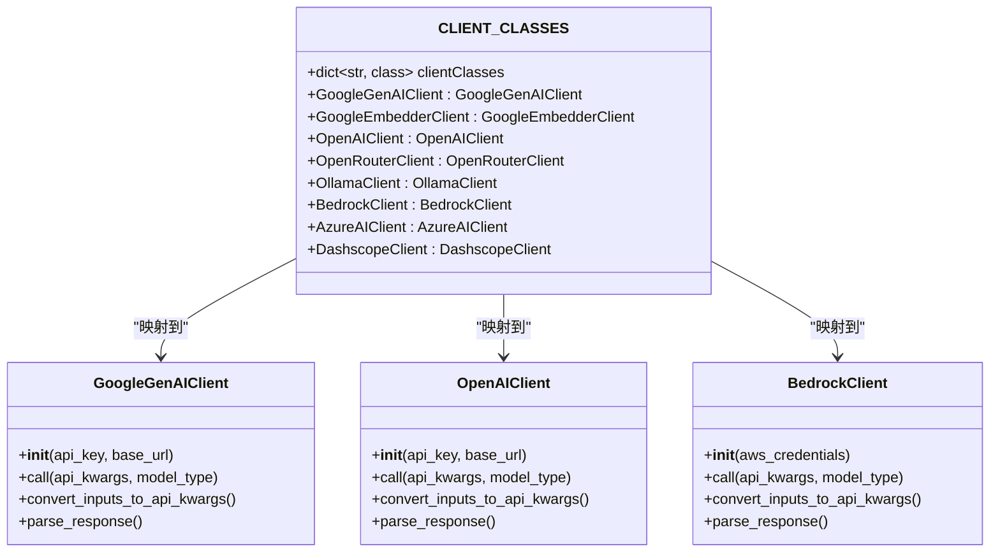
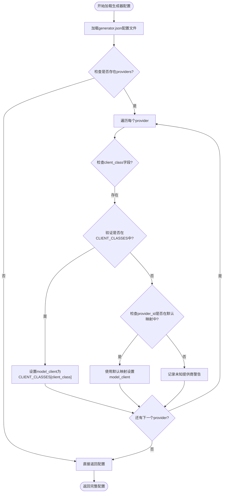
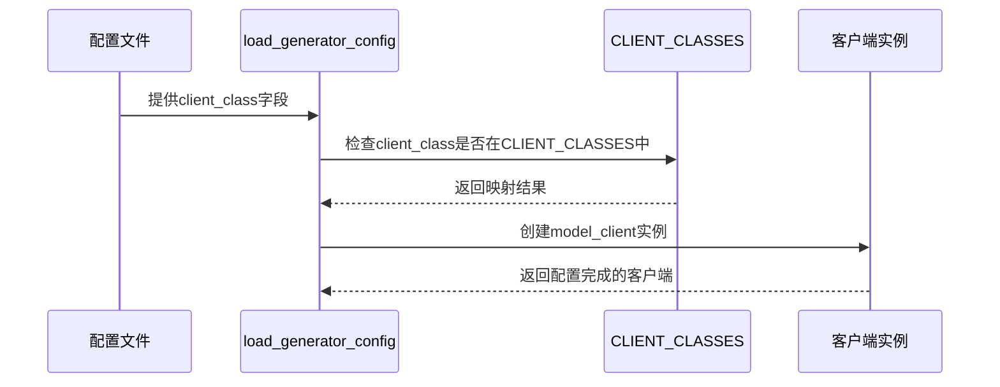
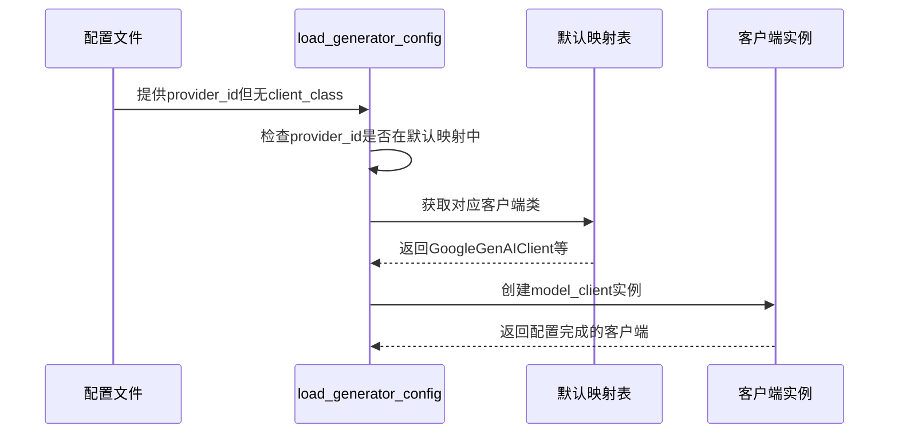
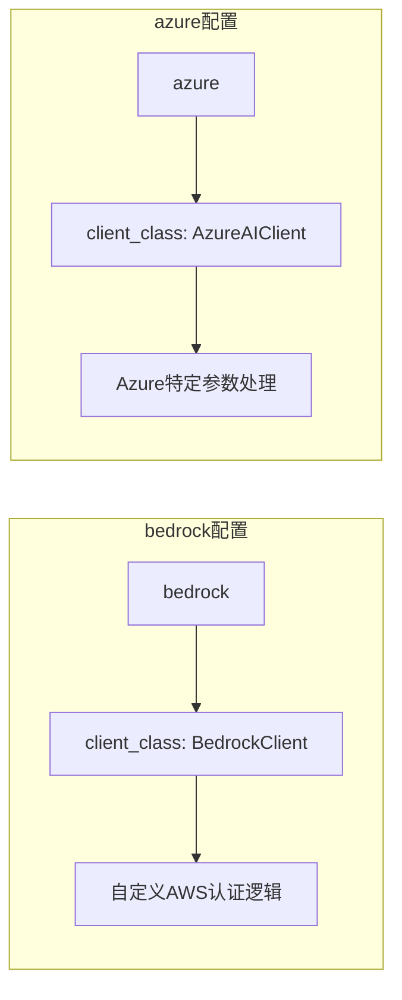
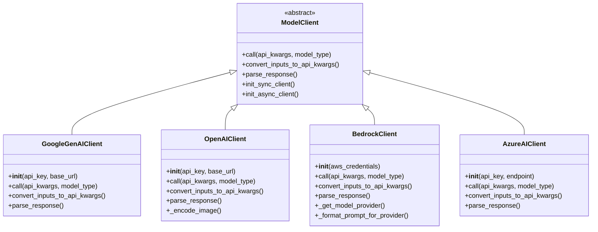
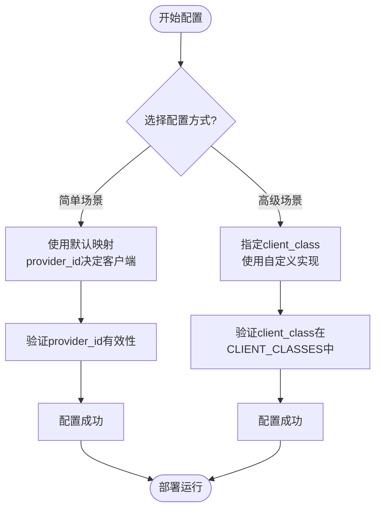

# 客户端映射

<cite>
**本文档中引用的文件**
- [config.py](file://api/config.py)
- [generator.json](file://api/config/generator.json)
- [embedder.json](file://api/config/embedder.json)
- [openai_client.py](file://api/openai_client.py)
- [google_embedder_client.py](file://api/google_embedder_client.py)
- [bedrock_client.py](file://api/bedrock_client.py)
- [simple_chat.py](file://api/simple_chat.py)
- [websocket_wiki.py](file://api/websocket_wiki.py)
- [test_all_embedders.py](file://tests/unit/test_all_embedders.py)
</cite>

## 目录
1. [简介](#简介)
2. [CLIENT_CLASSES字典架构](#client_classes字典架构)
3. [load_generator_config函数详解](#load_generator_config函数详解)
4. [双重映射机制设计](#双重映射机制设计)
5. [配置文件示例分析](#配置文件示例分析)
6. [客户端类实现概览](#客户端类实现概览)
7. [使用场景与最佳实践](#使用场景与最佳实践)
8. [故障排除指南](#故障排除指南)
9. [总结](#总结)

## 简介

deepwiki-open项目采用了一套精心设计的客户端映射系统，通过`CLIENT_CLASSES`字典实现了模型客户端类的统一注册和管理。这个系统的核心价值在于提供了灵活且向后兼容的模型客户端选择机制，支持多种AI服务提供商（如Google、OpenAI、Azure等）的无缝集成。

该映射系统采用了双重映射策略：一方面支持用户自定义的客户端类映射，另一方面提供默认的提供商到客户端类的标准映射。这种设计既保证了系统的可扩展性，又确保了基本功能的稳定性。

## CLIENT_CLASSES字典架构

`CLIENT_CLASSES`字典是整个客户端映射系统的核心注册表，它将字符串名称映射到实际的Python类对象。

**图表来源**
- [config.py](file://api/config.py#L55-L63)

### 字典结构特点

CLIENT_CLASSES字典具有以下关键特征：

1. **字符串键值对**：每个键都是一个字符串标识符，如"GoogleGenAIClient"
2. **类对象引用**：每个值都是对应的Python类对象
3. **统一命名规范**：所有客户端类都遵循清晰的命名约定
4. **模块化导入**：类对象从各自的模块中导入，确保依赖关系清晰

**章节来源**
- [config.py](file://api/config.py#L55-L63)

## load_generator_config函数详解

`load_generator_config`函数是客户端映射系统的核心入口点，负责处理生成器配置并建立客户端类映射。

**图表来源**
- [config.py](file://api/config.py#L121-L144)

### 映射优先级流程

函数按照以下优先级顺序确定客户端类：

1. **第一优先级**：使用配置中的`client_class`字段
2. **第二优先级**：使用预定义的提供商ID映射
3. **第三优先级**：记录警告并跳过

**章节来源**
- [config.py](file://api/config.py#L121-L144)

## 双重映射机制设计

双重映射机制是deepwiki-open客户端映射系统的核心创新，它提供了灵活性和向后兼容性的完美平衡。

### 第一映射层：自定义客户端类

第一层映射允许用户指定特定的客户端类：

**图表来源**
- [config.py](file://api/config.py#L127-L129)

### 第二映射层：默认提供商映射

当没有指定自定义客户端类时，系统会回退到基于提供商ID的默认映射：

**图表来源**
- [config.py](file://api/config.py#L131-L139)

### 设计优势分析

双重映射机制具有以下显著优势：

| 优势类别 | 描述 | 具体体现 |
|---------|------|----------|
| **灵活性** | 支持用户自定义客户端类 | 通过client_class字段实现 |
| **向后兼容性** | 保持现有配置的正常工作 | 默认映射确保旧配置可用 |
| **可扩展性** | 易于添加新的提供商支持 | 新增客户端类到CLIENT_CLASSES即可 |
| **配置简化** | 减少重复配置项 | 默认映射减少显式指定需求 |
| **错误处理** | 提供清晰的错误提示 | 未知提供商时记录警告 |

**章节来源**
- [config.py](file://api/config.py#L127-L143)

## 配置文件示例分析

通过分析配置文件，我们可以更好地理解客户端映射的实际应用场景。

### 通用生成器配置

标准的生成器配置展示了默认映射的使用：

| 提供商 | 配置特点 | 客户端类 | 映射方式 |
|--------|----------|----------|----------|
| google | 使用默认映射 | GoogleGenAIClient | 基于provider_id自动映射 |
| openai | 使用默认映射 | OpenAIClient | 基于provider_id自动映射 |
| openrouter | 使用默认映射 | OpenRouterClient | 基于provider_id自动映射 |
| ollama | 使用默认映射 | OllamaClient | 基于provider_id自动映射 |

### 特殊配置案例

某些提供商使用了自定义客户端类：

**图表来源**
- [generator.json](file://api/config/generator.json#L143-L145)
- [generator.json](file://api/config/generator.json#L174-L175)

### 嵌入器配置对比

嵌入器配置进一步展示了映射机制的应用：

| 嵌入器类型 | 客户端类 | 配置方式 | 用途 |
|-----------|----------|----------|------|
| OpenAI嵌入器 | OpenAIClient | 直接指定client_class | 文本相似度计算 |
| Google嵌入器 | GoogleEmbedderClient | 直接指定client_class | 语义搜索 |
| Ollama嵌入器 | OllamaClient | 直接指定client_class | 本地嵌入计算 |

**章节来源**
- [embedder.json](file://api/config/embedder.json#L2-L4)
- [embedder.json](file://api/config/embedder.json#L11-L13)
- [embedder.json](file://api/config/embedder.json#L17-L19)

## 客户端类实现概览

deepwiki-open支持多种类型的客户端实现，每种都有其特定的功能和用途。

### 核心客户端类层次结构

**图表来源**
- [openai_client.py](file://api/openai_client.py#L120-L200)
- [google_embedder_client.py](file://api/google_embedder_client.py#L20-L100)
- [bedrock_client.py](file://api/bedrock_client.py#L20-L100)

### 主要客户端特性对比

| 客户端类 | 主要功能 | 认证方式 | 特殊能力 |
|----------|----------|----------|----------|
| GoogleGenAIClient | 通用文本生成 | API密钥 | 多模态支持 |
| OpenAIClient | 通用文本生成 | API密钥 | 图像编码、流式响应 |
| BedrockClient | AWS托管模型 | AWS凭证 | 多提供商支持 |
| AzureAIClient | Azure OpenAI | API密钥+端点 | 企业级安全 |

**章节来源**
- [openai_client.py](file://api/openai_client.py#L120-L200)
- [bedrock_client.py](file://api/bedrock_client.py#L20-L100)

## 使用场景与最佳实践

### 基本使用模式

客户端映射系统支持多种使用场景：

1. **简单配置场景**：使用默认映射，无需额外配置
2. **自定义客户端场景**：指定特定的客户端类实现
3. **混合配置场景**：不同提供商使用不同的配置策略

### 推荐配置实践

### 性能优化建议

1. **连接池管理**：合理配置同步和异步客户端
2. **错误重试**：利用backoff装饰器实现智能重试
3. **资源清理**：正确处理客户端生命周期

**章节来源**
- [simple_chat.py](file://api/simple_chat.py#L413-L444)
- [websocket_wiki.py](file://api/websocket_wiki.py#L492-L540)

## 故障排除指南

### 常见问题诊断

| 问题类型 | 症状 | 可能原因 | 解决方案 |
|----------|------|----------|----------|
| 客户端未找到 | KeyError异常 | client_class拼写错误 | 检查CLIENT_CLASSES字典 |
| 配置加载失败 | 配置为空 | 文件路径错误 | 验证配置文件位置 |
| 认证失败 | API调用被拒绝 | 密钥配置错误 | 检查环境变量设置 |
| 超时错误 | 请求超时 | 网络或API限制 | 调整超时参数 |

### 调试技巧

1. **启用详细日志**：设置适当的日志级别
2. **验证映射关系**：检查CLIENT_CLASSES字典内容
3. **测试配置加载**：单独测试配置加载函数
4. **监控API调用**：跟踪实际的API请求和响应

**章节来源**
- [config.py](file://api/config.py#L143)
- [test_all_embedders.py](file://tests/unit/test_all_embedders.py#L84-L120)

## 总结

deepwiki-open的客户端映射系统通过`CLIENT_CLASSES`字典和`load_generator_config`函数的巧妙结合，构建了一个既灵活又稳定的模型客户端管理框架。双重映射机制的设计不仅满足了当前的需求，还为未来的扩展预留了充足的空间。

### 关键技术亮点

1. **统一注册机制**：CLIENT_CLASSES字典提供了集中式的客户端类管理
2. **灵活映射策略**：双重映射确保了配置的多样性和兼容性
3. **模块化设计**：每个客户端类独立实现，便于维护和扩展
4. **完善的错误处理**：清晰的错误提示和降级策略

### 未来发展方向

随着AI服务提供商的不断增多，该映射系统可以通过以下方式进行扩展：
- 添加更多提供商的默认映射
- 支持动态客户端类注册
- 实现更智能的配置推断机制
- 增强性能监控和优化功能

这个客户端映射系统体现了deepwiki-open项目在架构设计上的深思熟虑，为构建可扩展、可维护的AI应用基础设施奠定了坚实的基础。