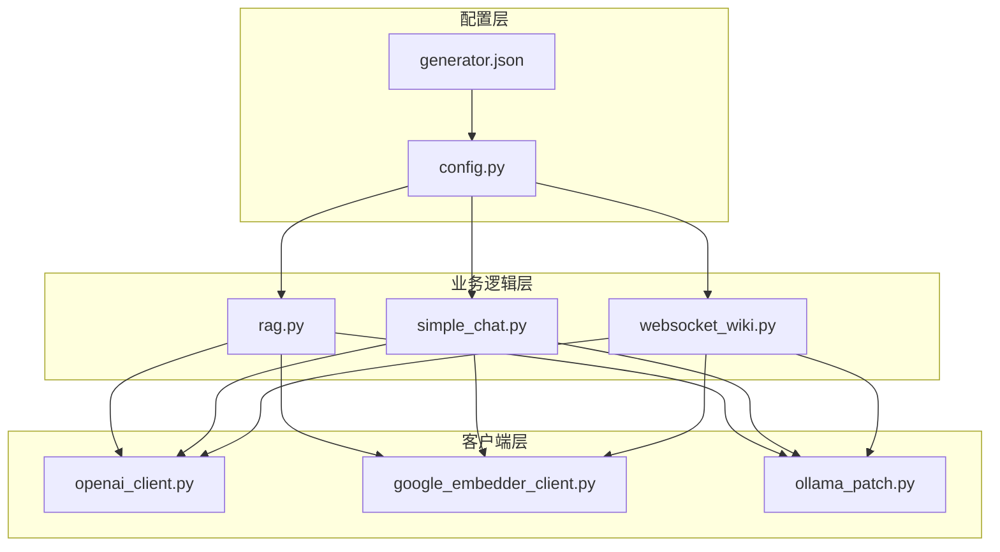
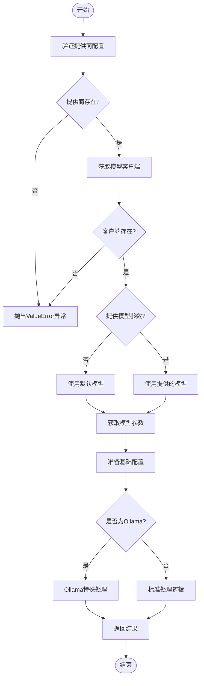
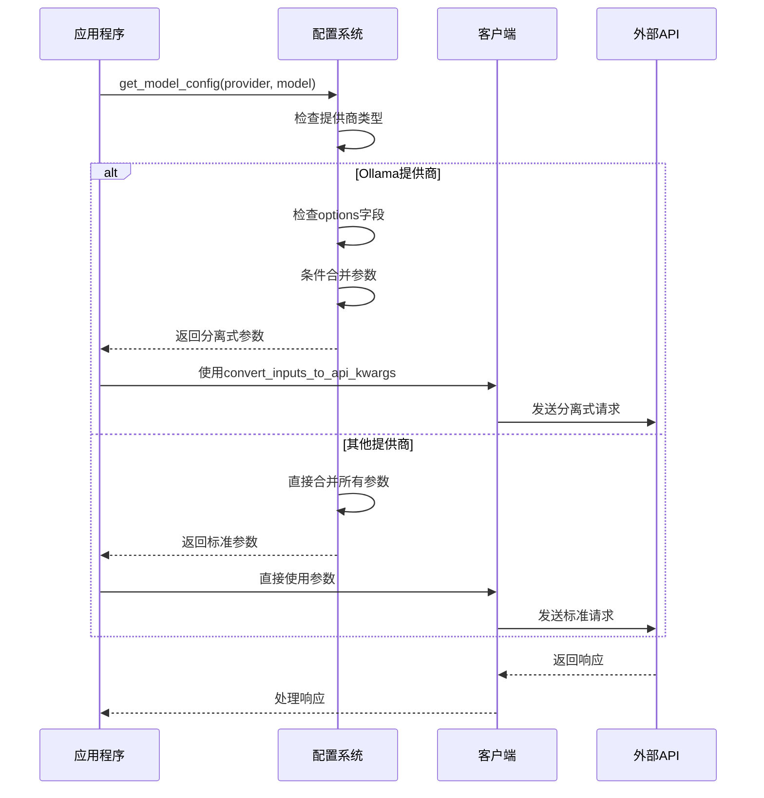

# 模型参数处理

<cite>
**本文档中引用的文件**
- [config.py](file://api/config.py)
- [generator.json](file://api/config/generator.json)
- [rag.py](file://api/rag.py)
- [simple_chat.py](file://api/simple_chat.py)
- [websocket_wiki.py](file://api/websocket_wiki.py)
- [openai_client.py](file://api/openai_client.py)
- [google_embedder_client.py](file://api/google_embedder_client.py)
- [ollama_patch.py](file://api/ollama_patch.py)
</cite>

## 目录
1. [简介](#简介)
2. [项目架构概览](#项目架构概览)
3. [核心函数分析](#核心函数分析)
4. [Ollama提供商特殊处理](#ollama提供商特殊处理)
5. [其他提供商对比分析](#其他提供商对比分析)
6. [参数结构差异详解](#参数结构差异详解)
7. [实际应用场景](#实际应用场景)
8. [性能考虑](#性能考虑)
9. [故障排除指南](#故障排除指南)
10. [总结](#总结)

## 简介

deepwiki-open项目实现了一个灵活的RAG（检索增强生成）系统，支持多种大语言模型提供商。其中，`get_model_config`函数是整个系统的核心组件之一，负责根据指定的提供商和模型参数构造合适的`model_kwargs`字典。该函数特别针对Ollama提供商实现了特殊的参数处理逻辑，与其他提供商形成了显著的差异化设计。

## 项目架构概览

deepwiki-open采用模块化架构设计，主要包含以下核心组件：



**图表来源**
- [config.py](file://api/config.py#L333-L387)
- [rag.py](file://api/rag.py#L227-L242)

## 核心函数分析

### get_model_config函数架构

`get_model_config`函数位于[`config.py`](file://api/config.py#L333-L387)中，是模型配置管理的核心入口点。该函数接受两个主要参数：

- `provider`: 指定使用的模型提供商（如'google'、'openai'、'ollama'等）
- `model`: 指定具体的模型名称，若为None则使用提供商的默认模型

函数执行流程如下：



**图表来源**
- [config.py](file://api/config.py#L333-L387)

**章节来源**
- [config.py](file://api/config.py#L333-L387)

## Ollama提供商特殊处理

### Ollama参数结构的独特性

Ollama提供商在参数处理上采用了与其他提供商不同的设计理念。在[`config.py`](file://api/config.py#L377-L382)中，可以看到专门针对Ollama的处理逻辑：

```python
# Ollama uses a slightly different parameter structure
if "options" in model_params:
    result["model_kwargs"] = {"model": model, **model_params["options"]}
else:
    result["model_kwargs"] = {"model": model}
```

这种设计的核心特点包括：

1. **分离式参数组织**: Ollama将模型参数分为两部分：
   - 基础参数：包含模型名称等基本信息
   - 选项参数：包含温度、top_p、num_ctx等高级配置

2. **条件性合并**: 只有当`model_params`中包含`options`键时，才会进行参数合并

3. **保持简洁性**: 如果没有额外的选项参数，只保留基本的模型名称

### Ollama配置示例

从[`generator.json`](file://api/config/generator.json#L116-L141)可以看出Ollama的配置结构：

```json
"ollama": {
  "default_model": "qwen3:1.7b",
  "supportsCustomModel": true,
  "models": {
    "qwen3:1.7b": {
      "options": {
        "temperature": 0.7,
        "top_p": 0.8,
        "num_ctx": 32000
      }
    }
  }
}
```

这种配置方式的优势在于：
- 参数层次清晰，便于维护和扩展
- 支持细粒度的参数控制
- 保持与Ollama原生API的一致性

**章节来源**
- [config.py](file://api/config.py#L377-L382)
- [generator.json](file://api/config/generator.json#L116-L141)

## 其他提供商对比分析

### Google提供商处理方式

Google提供商采用标准的参数合并策略，在[`config.py`](file://api/config.py#L384-L385)中实现：

```python
# Standard structure for other providers
result["model_kwargs"] = {"model": model, **model_params}
```

Google的配置结构相对简单，直接将所有参数合并到一个字典中：

```json
"google": {
  "default_model": "gemini-2.5-flash",
  "supportsCustomModel": true,
  "models": {
    "gemini-2.5-flash": {
      "temperature": 1.0,
      "top_p": 0.8,
      "top_k": 20
    }
  }
}
```

### OpenAI提供商处理方式

OpenAI提供商同样采用标准结构，但在实际使用中需要通过客户端类进行进一步处理。在[`simple_chat.py`](file://api/simple_chat.py#L373-L391)中可以看到：

```python
model_kwargs = {
    "model": request.model,
    "stream": True,
    "temperature": model_config["temperature"]
}
# Only add top_p if it exists in the model config
if "top_p" in model_config:
    model_kwargs["top_p"] = model_config["top_p"]
```

### 参数处理差异对比表

| 提供商 | 参数结构 | 合并方式 | 特殊处理 |
|--------|----------|----------|----------|
| Google | 标准合并 | 直接展开 | 无 |
| OpenAI | 标准合并 | 条件添加 | 流式响应 |
| Ollama | 分离式 | 条件合并 | 选项参数分离 |
| OpenRouter | 标准合并 | 条件添加 | API密钥处理 |
| Bedrock | 标准合并 | 直接展开 | AWS认证 |

**章节来源**
- [config.py](file://api/config.py#L384-L385)
- [simple_chat.py](file://api/simple_chat.py#L373-L391)

## 参数结构差异详解

### 技术实现层面的差异

不同提供商在参数处理上的技术实现反映了各自API设计哲学的差异：

#### Ollama的分离式设计原理

Ollama的分离式设计源于其本地部署的特性，这种设计具有以下优势：

1. **向后兼容性**: 保持与Ollama原生API的完全兼容
2. **灵活性**: 支持动态调整参数而不影响基础配置
3. **可读性**: 清晰区分必需参数和可选参数

#### 其他提供商的标准设计

其他提供商采用标准设计的原因：

1. **云服务特性**: 大多数云提供商倾向于简化接口
2. **统一性**: 统一的参数结构便于客户端开发
3. **标准化**: 符合行业标准的API设计模式

### 实际应用中的影响

这些差异在实际应用中表现为：



**图表来源**
- [config.py](file://api/config.py#L377-L385)
- [simple_chat.py](file://api/simple_chat.py#L328-L343)

**章节来源**
- [config.py](file://api/config.py#L377-L385)
- [simple_chat.py](file://api/simple_chat.py#L328-L343)

## 实际应用场景

### RAG系统中的应用

在RAG系统中，`get_model_config`函数被广泛应用于多个场景：

#### 文档处理场景

在[`rag.py`](file://api/rag.py#L227-L242)中，该函数用于初始化生成器：

```python
from api.config import get_model_config
generator_config = get_model_config(self.provider, self.model)
self.generator = adal.Generator(
    template=RAG_TEMPLATE,
    prompt_kwargs={
        "output_format_str": format_instructions,
        "conversation_history": self.memory(),
        "system_prompt": system_prompt,
        "contexts": None,
    },
    model_client=generator_config["model_client"](),
    model_kwargs=generator_config["model_kwargs"],
    output_processors=data_parser,
)
```

#### 聊天交互场景

在[`simple_chat.py`](file://api/simple_chat.py#L328)中，该函数用于获取模型配置：

```python
model_config = get_model_config(request.provider, request.model)["model_kwargs"]
```

#### WebSocket实时交互场景

在[`websocket_wiki.py`](file://api/websocket_wiki.py#L428)中，该函数支持实时聊天：

```python
model_config = get_model_config(request.provider, request.model)["model_kwargs"]
```

### 不同提供商的实际效果对比

| 场景 | Google | OpenAI | Ollama | 效果对比 |
|------|--------|--------|--------|----------|
| 本地部署 | ❌ | ❌ | ✅ | Ollama支持本地运行 |
| 流式响应 | ✅ | ✅ | ✅ | 所有都支持流式 |
| 参数控制 | 标准 | 标准 | 细粒度 | Ollama最灵活 |
| 部署复杂度 | 中等 | 中等 | 低 | Ollama最简单 |

**章节来源**
- [rag.py](file://api/rag.py#L227-L242)
- [simple_chat.py](file://api/simple_chat.py#L328)
- [websocket_wiki.py](file://api/websocket_wiki.py#L428)

## 性能考虑

### 参数处理的性能影响

不同提供商的参数处理方式对系统性能的影响：

#### Ollama的性能优势

1. **内存效率**: 分离式参数减少不必要的参数传递
2. **网络优化**: 减少单次请求的数据量
3. **缓存友好**: 更小的参数字典更容易被缓存

#### 其他提供商的性能特点

1. **标准化优势**: 统一的处理逻辑便于优化
2. **批量处理**: 某些提供商更适合批量操作
3. **连接池**: 云提供商通常有更好的连接管理

### 优化建议

1. **参数预处理**: 在调用前预先处理常用参数
2. **缓存机制**: 缓存频繁使用的配置
3. **异步处理**: 利用异步特性提高并发性能

## 故障排除指南

### 常见问题及解决方案

#### Ollama配置问题

**问题**: Ollama模型不存在或不可访问
**解决方案**: 使用[`ollama_patch.py`](file://api/ollama_patch.py#L21-L60)中的检查函数

```python
from api.ollama_patch import check_ollama_model_exists
exists = check_ollama_model_exists("qwen3:1.7b")
```

**问题**: Ollama连接超时
**解决方案**: 检查Ollama服务状态和网络连接

#### 参数格式错误

**问题**: 参数结构不匹配
**解决方案**: 确保按照各提供商的规范组织参数

#### API密钥配置

**问题**: 缺少必要的API密钥
**解决方案**: 检查环境变量配置

**章节来源**
- [ollama_patch.py](file://api/ollama_patch.py#L21-L60)

## 总结

deepwiki-open项目的`get_model_config`函数展现了现代AI应用中参数处理的最佳实践。通过对Ollama提供商的特殊处理，系统不仅保持了与各种大语言模型提供商的兼容性，还充分发挥了Ollama本地部署的优势。

### 关键设计原则

1. **灵活性**: 支持多种提供商的不同参数结构
2. **一致性**: 为上层应用提供统一的接口
3. **可扩展性**: 易于添加新的提供商支持
4. **性能优化**: 针对不同场景进行优化

### 技术创新点

1. **分离式参数设计**: Ollama的分离式参数结构体现了对本地部署特性的深刻理解
2. **条件性处理**: 根据提供商类型采用不同的处理策略
3. **模块化架构**: 清晰的分层设计便于维护和扩展

这种设计模式为构建可扩展的AI应用系统提供了宝贵的参考价值，特别是在需要支持多种模型提供商的复杂场景中。