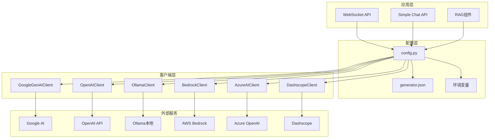
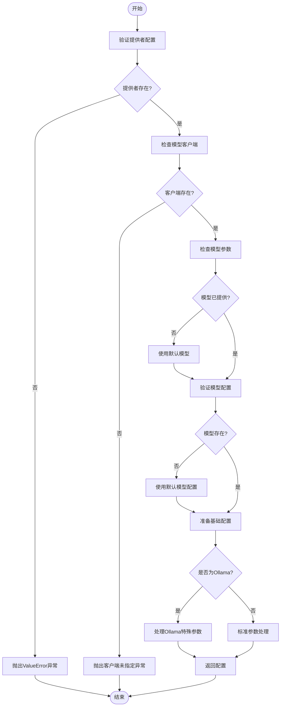
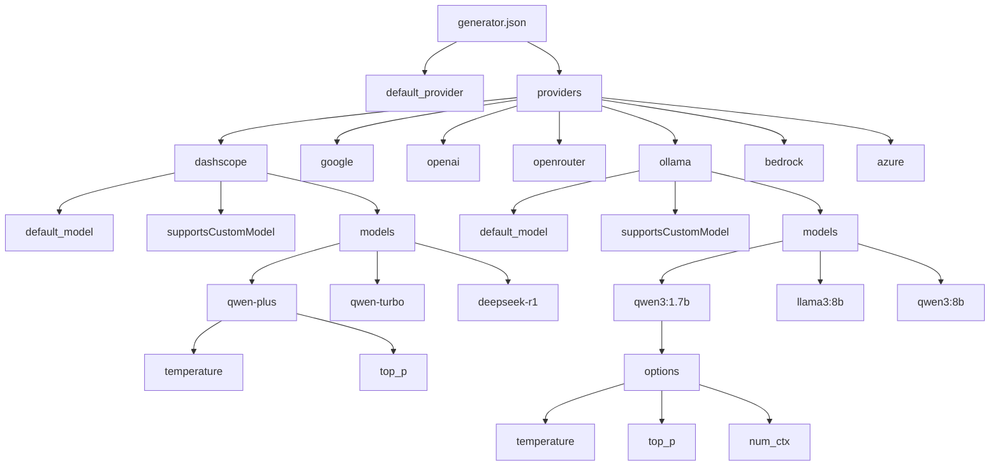
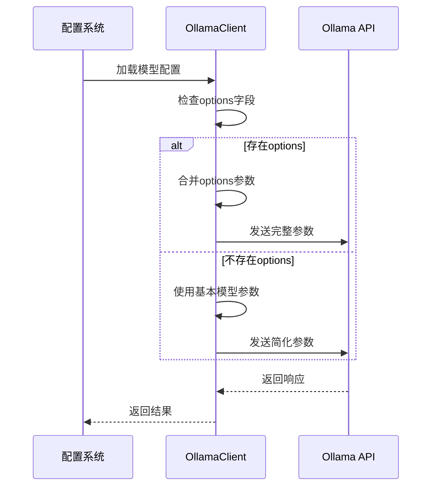
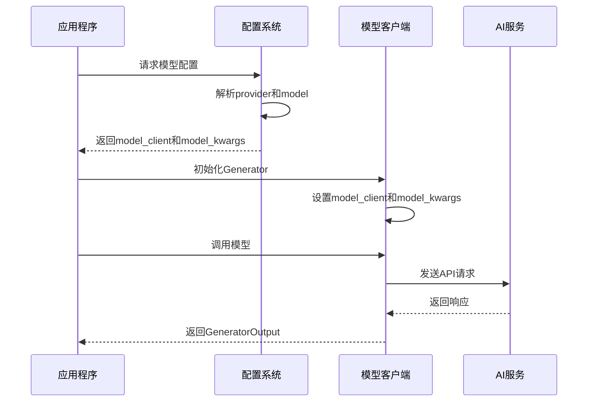
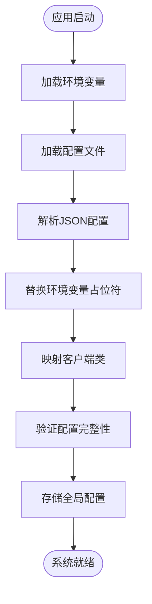

# 模型集成

<cite>
**本文档中引用的文件**
- [generator.json](file://api/config/generator.json)
- [config.py](file://api/config.py)
- [openai_client.py](file://api/openai_client.py)
- [ollama_patch.py](file://api/ollama_patch.py)
- [websocket_wiki.py](file://api/websocket_wiki.py)
- [simple_chat.py](file://api/simple_chat.py)
- [rag.py](file://api/rag.py)
- [main.py](file://api/main.py)
</cite>

## 目录
1. [简介](#简介)
2. [项目架构概览](#项目架构概览)
3. [get_model_config函数详解](#get_model_config函数详解)
4. [模型配置文件结构](#模型配置文件结构)
5. [AI提供商客户端分析](#ai提供商客户端分析)
6. [Ollama特殊处理机制](#ollama特殊处理机制)
7. [adal.Generator集成应用](#adalgenerator集成应用)
8. [配置管理与依赖关系](#配置管理与依赖关系)
9. [性能优化考虑](#性能优化考虑)
10. [故障排除指南](#故障排除指南)
11. [总结](#总结)

## 简介

deepwiki-open项目采用模块化的RAG（检索增强生成）架构，支持多种AI提供商的模型集成。该系统通过统一的配置接口和动态模型加载机制，实现了对Google、OpenAI、Ollama、AWS Bedrock、Azure AI等多种AI服务提供商的无缝集成。

核心特性包括：
- 动态模型配置加载
- 多提供商客户端抽象
- 统一的API调用接口
- 特殊参数处理机制
- 实时模型可用性检查

## 项目架构概览

系统采用分层架构设计，主要包含配置层、客户端层和应用层：

**图表来源**
- [config.py](file://api/config.py#L120-L145)
- [websocket_wiki.py](file://api/websocket_wiki.py#L1-L50)
- [simple_chat.py](file://api/simple_chat.py#L1-L39)

## get_model_config函数详解

`get_model_config`函数是系统的核心配置管理器，负责根据provider和model参数动态加载模型配置。

### 函数工作流程

**图表来源**
- [config.py](file://api/config.py#L334-L387)

### 配置映射机制

系统通过两种方式确定模型客户端：

1. **显式指定**：在配置文件中通过`client_class`字段指定
2. **自动映射**：基于provider名称的默认映射表

**节来源**
- [config.py](file://api/config.py#L125-L144)

### 参数构造过程

不同提供商的参数构造遵循以下模式：

- **标准提供商**（Google、OpenAI、OpenRouter等）：直接合并model参数到`model_kwargs`
- **Ollama提供商**：使用`options`字段作为特殊参数容器

**节来源**
- [config.py](file://api/config.py#L377-L386)

## 模型配置文件结构

generator.json文件定义了所有支持的AI提供商及其模型配置。

### 配置文件架构

**图表来源**
- [generator.json](file://api/config/generator.json#L1-L200)

### 提供商配置差异

| 提供商 | 默认模型 | 支持自定义模型 | 特殊参数 |
|--------|----------|----------------|----------|
| dashscope | qwen-plus | 是 | 标准参数 |
| google | gemini-2.5-flash | 是 | top_k参数 |
| openai | gpt-5-nano | 是 | 温度控制 |
| openrouter | openai/gpt-5-nano | 是 | 路径格式化 |
| ollama | qwen3:1.7b | 是 | options字段 |
| bedrock | anthropic.claude-3-sonnet-20240229-v1:0 | 是 | 客户端类 |
| azure | gpt-4o | 是 | 客户端类 |

**节来源**
- [generator.json](file://api/config/generator.json#L22-L196)

## AI提供商客户端分析

### GoogleGenAIClient

Google GenAI客户端专门用于Google的Generative AI服务，支持文本生成和多模态输入。

**核心特性**：
- 基于Google Generative AI SDK
- 支持流式和非流式调用
- 内置token计数估算
- 多模态内容处理

### OpenAIClient

OpenAI客户端提供了最完整的功能集，支持聊天完成、嵌入和图像生成。

**核心特性**：
- 支持多种OpenAI模型
- 流式响应处理
- 图像生成能力
- 错误重试机制

### OllamaClient

Ollama客户端专门处理本地运行的大语言模型，需要额外的模型可用性检查。

**核心特性**：
- 本地模型推理
- 模型存在性验证
- 批量嵌入限制处理

### 其他提供商客户端

- **AzureAIClient**：Azure OpenAI服务集成
- **BedrockClient**：AWS Bedrock服务集成  
- **DashscopeClient**：阿里云通义千问集成

**节来源**
- [openai_client.py](file://api/openai_client.py#L120-L180)
- [config.py](file://api/config.py#L132-L139)

## Ollama特殊处理机制

Ollama作为本地模型提供商，具有独特的参数处理需求。

### options字段处理

**图表来源**
- [config.py](file://api/config.py#L377-L382)
- [ollama_patch.py](file://api/ollama_patch.py#L21-L60)

### 模型可用性检查

系统提供专门的模型检查机制：

**节来源**
- [ollama_patch.py](file://api/ollama_patch.py#L21-L60)

### 嵌入处理优化

由于Ollama不支持批量嵌入，系统实现了逐文档处理机制：

**节来源**
- [ollama_patch.py](file://api/ollama_patch.py#L62-L105)

## adal.Generator集成应用

系统广泛使用adal.Generator组件进行模型调用，提供统一的接口抽象。

### 基本使用模式

**图表来源**
- [websocket_wiki.py](file://api/websocket_wiki.py#L492-L540)
- [simple_chat.py](file://api/simple_chat.py#L413-L444)

### 不同提供商的初始化示例

**节来源**
- [websocket_wiki.py](file://api/websocket_wiki.py#L497-L531)
- [simple_chat.py](file://api/simple_chat.py#L418-L435)

### 输入转换机制

每个客户端都实现了`convert_inputs_to_api_kwargs`方法，将标准化输入转换为特定API格式：

**节来源**
- [openai_client.py](file://api/openai_client.py#L270-L380)

## 配置管理与依赖关系

### 配置加载流程

**图表来源**
- [config.py](file://api/config.py#L306-L332)

### 客户端类映射

系统维护了一个全局的客户端类映射表：

**节来源**
- [config.py](file://api/config.py#L55-L63)

### 环境变量处理

配置系统支持环境变量占位符替换：

**节来源**
- [config.py](file://api/config.py#L66-L95)

## 性能优化考虑

### 连接池管理

- OpenAI客户端支持同步和异步连接池
- 自动重试机制减少API调用失败
- 流式响应处理提高用户体验

### 缓存策略

- 配置信息缓存避免重复加载
- 模型客户端实例复用
- 嵌入向量缓存（部分实现）

### 错误处理

- 指数退避重试机制
- 超时控制防止阻塞
- 优雅降级支持

## 故障排除指南

### 常见问题及解决方案

| 问题类型 | 症状 | 解决方案 |
|----------|------|----------|
| 配置错误 | ValueError异常 | 检查generator.json配置 |
| API密钥缺失 | 认证失败 | 设置正确的环境变量 |
| 模型不可用 | 连接超时 | 检查Ollama模型是否存在 |
| 参数不匹配 | API调用失败 | 验证模型参数兼容性 |

### 调试技巧

1. **启用详细日志**：设置日志级别为DEBUG
2. **检查环境变量**：确认API密钥正确设置
3. **验证网络连接**：确保能够访问AI服务
4. **测试模型可用性**：使用模型检查工具

**节来源**
- [main.py](file://api/main.py#L47-L52)

## 总结

deepwiki-open的模型集成系统展现了现代AI应用开发的最佳实践：

### 核心优势

1. **统一抽象**：通过adal.Generator提供一致的API接口
2. **灵活配置**：JSON配置文件支持动态模型切换
3. **多提供商支持**：覆盖主流AI服务提供商
4. **特殊处理**：针对Ollama等特殊需求的优化
5. **健壮性**：完善的错误处理和重试机制

### 设计亮点

- **模块化架构**：清晰的职责分离和依赖管理
- **扩展性**：易于添加新的AI提供商支持
- **性能优化**：合理的资源管理和错误恢复
- **开发者友好**：丰富的示例和详细的文档

该系统为构建企业级AI应用提供了坚实的基础，支持从简单的聊天机器人到复杂的RAG系统的各种应用场景。