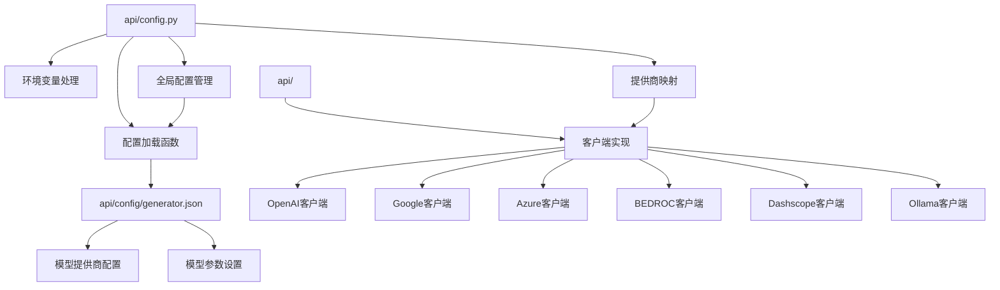
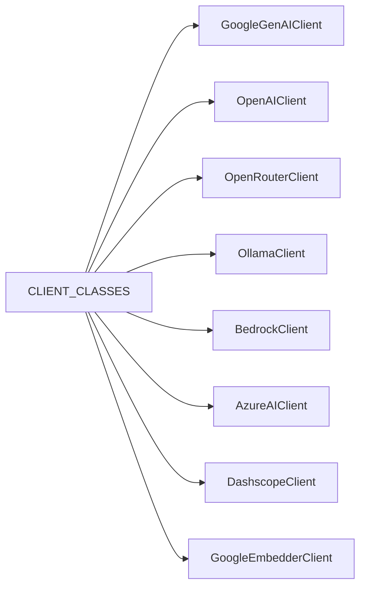
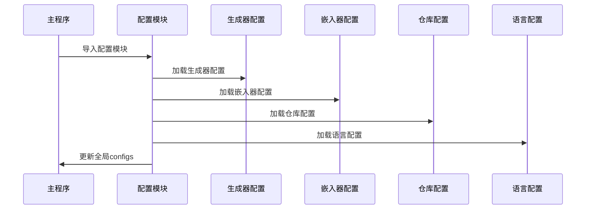
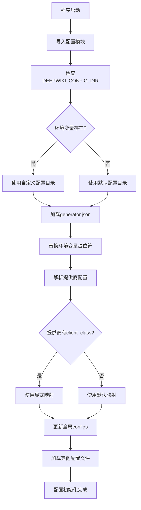

# 配置加载机制

<cite>
**本文档中引用的文件**
- [api/config.py](file://api/config.py)
- [api/config/generator.json](file://api/config/generator.json)
- [api/main.py](file://api/main.py)
- [api/openai_client.py](file://api/openai_client.py)
- [api/google_embedder_client.py](file://api/google_embedder_client.py)
- [api/bedrock_client.py](file://api/bedrock_client.py)
- [api/azureai_client.py](file://api/azureai_client.py)
- [api/dashscope_client.py](file://api/dashscope_client.py)
- [api/ollama_patch.py](file://api/ollama_patch.py)
</cite>

## 目录
1. [简介](#简介)
2. [项目结构概览](#项目结构概览)
3. [核心配置加载函数](#核心配置加载函数)
4. [环境变量处理机制](#环境变量处理机制)
5. [提供商映射系统](#提供商映射系统)
6. [全局配置管理](#全局配置管理)
7. [模型配置获取](#模型配置获取)
8. [客户端类架构](#客户端类架构)
9. [配置加载流程图](#配置加载流程图)
10. [故障排除指南](#故障排除指南)
11. [总结](#总结)

## 简介

deepwiki-open项目采用了一套完善的RAG（检索增强生成）模型配置加载机制，该机制负责从JSON配置文件中读取模型提供商设置，并将其转换为可执行的客户端实例。本文档详细阐述了配置加载的核心组件，包括`load_json_config`函数、环境变量替换机制、提供商映射系统以及全局配置管理。

该配置系统支持多种AI服务提供商，包括OpenAI、Google、Azure、AWS Bedrock、Dashscope等，通过统一的接口为RAG应用提供灵活的模型选择能力。

## 项目结构概览

配置系统的核心文件组织如下：



**图表来源**
- [api/config.py](file://api/config.py#L1-L50)
- [api/config/generator.json](file://api/config/generator.json#L1-L50)

**章节来源**
- [api/config.py](file://api/config.py#L1-L388)
- [api/config/generator.json](file://api/config/generator.json#L1-L200)

## 核心配置加载函数

### load_json_config函数详解

`load_json_config`函数是整个配置系统的核心入口点，负责从指定位置加载JSON配置文件并处理环境变量替换。

#### 函数签名与参数

该函数接受一个字符串参数`filename`，表示要加载的配置文件名。函数返回解析后的Python字典对象，如果发生错误则返回空字典。

#### 路径解析逻辑

配置文件的查找遵循以下优先级：
1. **环境变量优先**：如果设置了`DEEPWIKI_CONFIG_DIR`环境变量，则使用该目录下的配置文件
2. **默认路径回退**：如果未设置环境变量，则使用`api/config/`目录作为默认配置路径

#### 错误处理机制

函数实现了完善的错误处理：
- 文件不存在时记录警告日志并返回空字典
- 解析异常时记录错误日志并返回空字典
- 环境变量访问失败时提供详细的错误信息

#### 环境变量替换

加载完成后，配置内容会通过`replace_env_placeholders`函数进行环境变量替换，确保配置中的占位符被正确替换为实际值。

**章节来源**
- [api/config.py](file://api/config.py#L96-L119)

### replace_env_placeholders函数

该函数实现了递归的环境变量替换功能，支持嵌套的字典、列表和字符串结构。

#### 替换模式识别

使用正则表达式模式`\$\{([A-Z0-9_]+)\}`识别环境变量占位符，其中：
- `${}`语法用于标识环境变量
- 变量名必须为大写字母、数字和下划线的组合
- 支持嵌套结构中的多层替换

#### 替换策略

对于不同数据类型采用不同的处理策略：
- **字典**：递归处理所有键值对
- **列表**：递归处理所有元素
- **字符串**：直接替换匹配的环境变量
- **其他类型**：保持原样不变

#### 警告机制

当环境变量未找到时，函数会记录警告日志并保留原始占位符字符串，避免配置丢失。

**章节来源**
- [api/config.py](file://api/config.py#L66-L95)

## 环境变量处理机制

### 环境变量配置

系统支持多种环境变量配置，包括API密钥、认证凭据和运行时参数：

| 环境变量 | 用途 | 示例值 |
|---------|------|--------|
| `DEEPWIKI_CONFIG_DIR` | 自定义配置目录路径 | `/etc/deepwiki/config` |
| `OPENAI_API_KEY` | OpenAI API密钥 | `sk-...` |
| `GOOGLE_API_KEY` | Google AI API密钥 | `AIza...` |
| `AZURE_OPENAI_API_KEY` | Azure OpenAI密钥 | `...` |
| `AWS_ACCESS_KEY_ID` | AWS访问密钥ID | `AKIA...` |
| `AWS_SECRET_ACCESS_KEY` | AWS秘密访问密钥 | `...` |
| `AWS_REGION` | AWS区域 | `us-east-1` |
| `DASHSCOPE_API_KEY` | 阿里云Dashscope密钥 | `sk-...` |

### 环境变量传播

系统在启动时会将关键环境变量传播到子进程中，确保所有组件都能访问必要的认证信息。

**章节来源**
- [api/config.py](file://api/config.py#L18-L41)
- [api/main.py](file://api/main.py#L54-L62)

## 提供商映射系统

### CLIENT_CLASSES映射表

系统维护了一个全局的客户端类映射表`CLIENT_CLASSES`，将字符串标识符映射到具体的客户端实现类：



**图表来源**
- [api/config.py](file://api/config.py#L55-L63)

### load_generator_config函数

该函数负责加载生成器配置并为每个提供商分配相应的客户端类。

#### 映射策略

配置加载采用双重映射策略：

1. **显式指定**：如果配置中包含`client_class`字段，则直接使用映射表中的对应类
2. **隐式映射**：如果未指定`client_class`，则根据`provider_id`进行默认映射

#### 默认映射表

| 提供商ID | 默认客户端类 |
|---------|-------------|
| `google` | `GoogleGenAIClient` |
| `openai` | `OpenAIClient` |
| `openrouter` | `OpenRouterClient` |
| `ollama` | `OllamaClient` |
| `bedrock` | `BedrockClient` |
| `azure` | `AzureAIClient` |
| `dashscope` | `DashscopeClient` |

#### 错误处理

对于未知的提供商或无效的客户端类，系统会记录警告信息但不会中断配置加载。

**章节来源**
- [api/config.py](file://api/config.py#L120-L145)

## 全局配置管理

### configs全局变量

系统使用全局变量`configs`存储所有加载的配置信息，该变量在模块级别初始化为空字典。

#### 初始化流程

配置初始化遵循以下步骤：



**图表来源**
- [api/config.py](file://api/config.py#L303-L332)

#### 配置合并策略

各配置模块独立加载后，通过以下策略合并到全局配置：

1. **生成器配置**：提取默认提供商和所有提供商的详细配置
2. **嵌入器配置**：合并所有嵌入器相关配置项
3. **仓库配置**：添加文件过滤器和仓库元数据
4. **语言配置**：设置支持的语言列表和默认语言

**章节来源**
- [api/config.py](file://api/config.py#L303-L332)

## 模型配置获取

### get_model_config函数

该函数是配置系统的最终出口，为RAG应用提供特定提供商和模型的完整配置。

#### 参数与返回值

函数接受两个参数：
- `provider`：指定的模型提供商名称
- `model`：可选的模型名称，如果未提供则使用提供商的默认模型

返回值是一个包含以下键的字典：
- `model_client`：对应的客户端类实例
- `model_kwargs`：模型相关的参数配置

#### 配置验证

函数实现了严格的配置验证：
1. 检查全局配置是否已加载
2. 验证指定提供商是否存在
3. 确认模型客户端已正确设置
4. 验证模型名称的有效性

#### 特殊处理

针对Ollama提供商，函数实施特殊的参数处理逻辑：
- 将`options`参数解包为独立的模型参数
- 为非Ollama提供商使用标准参数结构

**章节来源**
- [api/config.py](file://api/config.py#L333-L388)

## 客户端类架构

### ModelClient基类

所有客户端类都继承自`adalflow.core.model_client.ModelClient`基类，提供了统一的接口规范。

#### 核心方法

每个客户端类必须实现以下核心方法：

| 方法名 | 功能描述 | 返回类型 |
|-------|----------|----------|
| `call` | 同步API调用 | Any |
| `acall` | 异步API调用 | Any |
| `convert_inputs_to_api_kwargs` | 输入转换 | Dict |
| `parse_chat_completion` | 响应解析 | GeneratorOutput |
| `parse_embedding_response` | 嵌入响应解析 | EmbedderOutput |

### 具体客户端实现

#### OpenAI客户端

OpenAI客户端支持完整的聊天完成和嵌入功能，包括流式响应处理和批量操作支持。

#### Google客户端

Google客户端集成Google Generative AI API，支持文本生成和嵌入计算。

#### Azure客户端

Azure客户端提供Azure OpenAI服务的兼容接口，支持API密钥和Azure AD令牌认证。

#### Bedrock客户端

AWS Bedrock客户端支持多个提供商的模型，包括Anthropic Claude、Amazon Titan等。

#### Dashscope客户端

阿里云Dashscope客户端提供Qwen系列模型的访问接口。

#### Ollama客户端

Ollama客户端支持本地部署的大语言模型，提供轻量级的推理能力。

**章节来源**
- [api/openai_client.py](file://api/openai_client.py#L120-L150)
- [api/google_embedder_client.py](file://api/google_embedder_client.py#L20-L50)
- [api/azureai_client.py](file://api/azureai_client.py#L118-L190)
- [api/bedrock_client.py](file://api/bedrock_client.py#L20-L100)
- [api/dashscope_client.py](file://api/dashscope_client.py#L104-L180)
- [api/ollama_patch.py](file://api/ollama_patch.py#L62-L105)

## 配置加载流程图

以下是完整的配置加载流程：



**图表来源**
- [api/config.py](file://api/config.py#L96-L145)
- [api/main.py](file://api/main.py#L63-L80)

## 故障排除指南

### 常见问题与解决方案

#### 配置文件加载失败

**症状**：程序启动时提示配置文件不存在或加载失败

**原因分析**：
1. 配置文件路径错误
2. 文件权限不足
3. JSON格式错误

**解决方法**：
1. 检查`DEEPWIKI_CONFIG_DIR`环境变量设置
2. 验证配置文件的JSON格式正确性
3. 确认文件读取权限

#### 环境变量未生效

**症状**：配置中的环境变量占位符未被替换

**原因分析**：
1. 环境变量未设置
2. 占位符语法错误
3. 字符串编码问题

**解决方法**：
1. 检查环境变量名称拼写
2. 验证占位符格式`${VAR_NAME}`
3. 确认字符编码一致性

#### 提供商映射错误

**症状**：指定的提供商无法找到对应的客户端类

**原因分析**：
1. 提供商名称拼写错误
2. 客户端类未正确注册
3. 缺少必要的依赖包

**解决方法**：
1. 验证提供商名称在映射表中
2. 检查客户端类的导入路径
3. 安装缺失的依赖包

#### 模型配置获取失败

**症状**：调用`get_model_config`时抛出异常

**原因分析**：
1. 全局配置未正确初始化
2. 指定的提供商不存在
3. 模型名称无效

**解决方法**：
1. 确保配置模块已正确导入
2. 验证提供商名称的大小写
3. 检查模型名称是否在配置中定义

### 调试技巧

#### 日志配置

启用详细日志记录以跟踪配置加载过程：

```python
import logging
logging.basicConfig(level=logging.DEBUG)
```

#### 配置验证

使用以下代码验证配置加载状态：

```python
from api.config import configs
print("已加载的配置提供商:", list(configs.get("providers", {}).keys()))
```

#### 环境变量检查

验证环境变量的可用性：

```python
import os
required_vars = ['OPENAI_API_KEY', 'GOOGLE_API_KEY']
missing = [var for var in required_vars if not os.environ.get(var)]
print("缺失的必需环境变量:", missing)
```

## 总结

deepwiki-open的RAG模型配置加载机制展现了现代软件架构的最佳实践，通过模块化设计、灵活的配置管理和强大的错误处理能力，为复杂的AI应用提供了可靠的基础设施。

### 关键特性

1. **灵活的配置加载**：支持自定义配置目录和环境变量覆盖
2. **智能的环境变量处理**：递归替换和完善的错误恢复机制
3. **统一的提供商映射**：支持显式和隐式的客户端类映射
4. **健壮的全局配置管理**：模块化的配置合并和验证机制
5. **标准化的客户端接口**：基于ModelClient基类的统一抽象

### 设计优势

- **可扩展性**：新增提供商只需添加客户端类和配置条目
- **可维护性**：清晰的职责分离和模块化设计
- **可靠性**：完善的错误处理和配置验证机制
- **易用性**：简洁的API接口和丰富的配置选项

这套配置加载机制不仅满足了当前的功能需求，还为未来的扩展和优化奠定了坚实的基础，是构建大规模AI应用的重要基础设施组件。