# RAG生成系统深度解析

<cite>
**本文档引用的文件**
- [api/rag.py](file://api/rag.py)
- [api/prompts.py](file://api/prompts.py)
- [api/config.py](file://api/config.py)
- [api/data_pipeline.py](file://api/data_pipeline.py)
- [api/tools/embedder.py](file://api/tools/embedder.py)
- [api/simple_chat.py](file://api/simple_chat.py)
- [api/config/generator.json](file://api/config/generator.json)
- [api/config/embedder.json](file://api/config/embedder.json)
</cite>

## 目录
1. [系统概述](#系统概述)
2. [核心组件架构](#核心组件架构)
3. [Generator初始化详解](#generator初始化详解)
4. [模板与提示词设计](#模板与提示词设计)
5. [输出解析器工作机制](#输出解析器工作机制)
6. [对话历史管理](#对话历史管理)
7. [多提供商模型配置](#多提供商模型配置)
8. [错误处理与性能优化](#错误处理与性能优化)
9. [实际应用示例](#实际应用示例)
10. [总结](#总结)

## 系统概述

deepwiki-open的RAG生成系统是一个基于AdalFlow框架构建的智能问答系统，专门针对GitHub仓库内容提供精准的语义检索和生成式回答。该系统通过融合检索增强生成（RAG）技术和多模态AI模型，实现了对代码仓库的深度理解和智能问答。

### 核心特性

- **多提供商支持**：兼容Google、OpenAI、Ollama、AWS Bedrock等多种AI服务提供商
- **智能检索**：基于向量相似度的语义检索，确保答案的准确性和相关性
- **上下文感知**：维护对话历史，提供连贯的交互体验
- **格式化输出**：标准化的Markdown格式输出，支持富文本渲染
- **错误恢复**：完善的错误处理机制，确保系统稳定性

## 核心组件架构

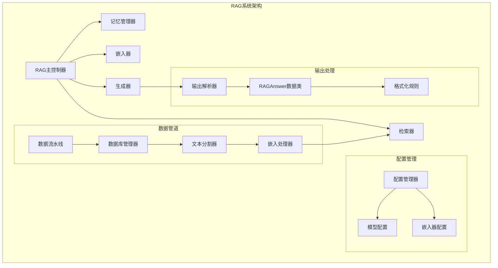

**图表来源**
- [api/rag.py](file://api/rag.py#L153-L243)
- [api/data_pipeline.py](file://api/data_pipeline.py#L703-L886)

**章节来源**
- [api/rag.py](file://api/rag.py#L153-L243)
- [api/data_pipeline.py](file://api/data_pipeline.py#L703-L886)

## Generator初始化详解

### 初始化流程架构

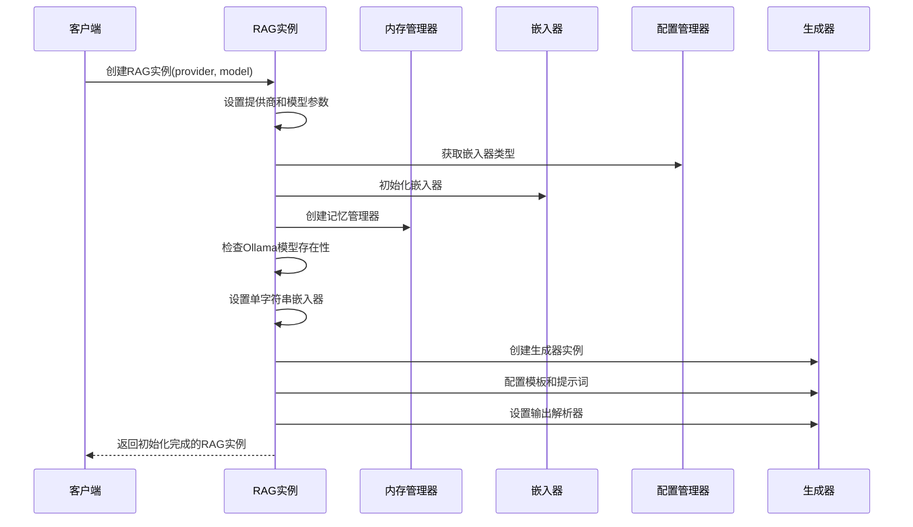

**图表来源**
- [api/rag.py](file://api/rag.py#L157-L243)

### 关键初始化步骤

#### 1. 提供商和模型配置
系统根据传入的provider参数选择相应的AI服务提供商，支持以下选项：
- `google`: Google Generative AI
- `openai`: OpenAI API
- `openrouter`: OpenRouter代理服务
- `ollama`: 本地Ollama模型
- `bedrock`: AWS Bedrock
- `azure`: Azure AI

#### 2. 嵌入器类型检测
系统自动检测当前使用的嵌入器类型（OpenAI、Google或Ollama），并相应地初始化嵌入器实例。

#### 3. Ollama模型验证
对于Ollama提供商，系统会检查指定模型是否已安装，确保生成过程的顺利进行。

#### 4. 单字符串嵌入器适配
针对Ollama的特殊需求，系统提供了单字符串嵌入器适配器，确保与其他提供商的一致性。

**章节来源**
- [api/rag.py](file://api/rag.py#L157-L243)

## 模板与提示词设计

### RAG_TEMPLATE结构分析

RAG_TEMPLATE是系统的核心模板，采用Jinja2语法实现动态内容填充：

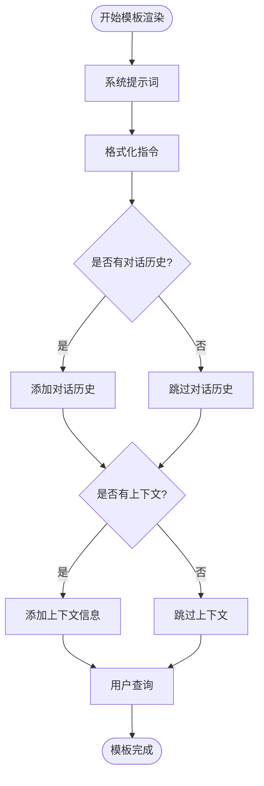

**图表来源**
- [api/prompts.py](file://api/prompts.py#L30-L65)

### 系统提示词设计原则

#### RAG_SYSTEM_PROMPT特点

1. **语言检测与响应**：自动检测用户查询语言并保持一致
2. **Markdown格式化**：强制使用Markdown语法进行内容格式化
3. **安全编码**：避免特殊字符转义问题
4. **简洁明了**：去除冗余的思考过程，直接提供最终答案

#### 输出格式化规则

系统定义了严格的输出格式化规则，确保生成内容的一致性：

| 规则编号 | 规则描述 | 实现方式 |
|---------|---------|---------|
| 1 | 不包含思考过程 | 严格限制在最终答案层面 |
| 2 | 不包含Markdown围栏 | 移除```开头和结尾标记 |
| 3 | 不包裹任何围栏 | 避免任何形式的代码块标记 |
| 4 | 直接开始内容 | 无前缀或后缀文本 |
| 5 | 渲染为Markdown | 内容本身已是Markdown格式 |

**章节来源**
- [api/prompts.py](file://api/prompts.py#L4-L65)

## 输出解析器工作机制

### DataClassParser工作原理

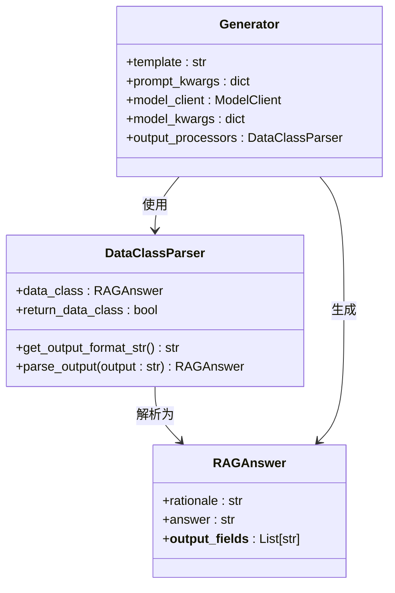

**图表来源**
- [api/rag.py](file://api/rag.py#L146-L152)
- [api/rag.py](file://api/rag.py#L210-L212)

### 数据类定义与字段约束

RAGAnswer数据类定义了两个核心字段：

#### rationale字段
- **用途**：记录推理链路和思考过程
- **默认值**：空字符串
- **元数据**：包含描述信息，用于解析器理解字段含义

#### answer字段
- **用途**：存储最终的回答内容
- **格式要求**：Markdown格式，无需包含代码块围栏
- **渲染支持**：可与react-markdown组件配合使用

### 输出解析流程

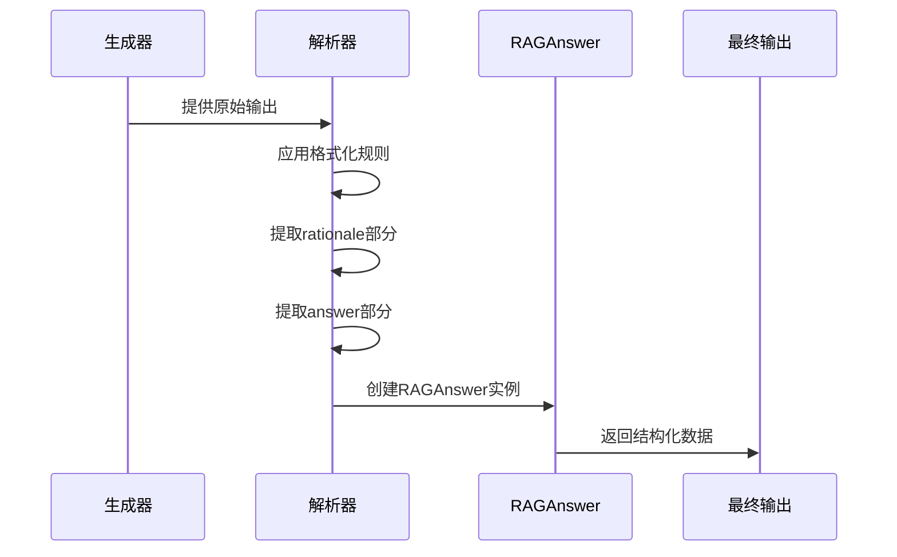

**图表来源**
- [api/rag.py](file://api/rag.py#L210-L226)

**章节来源**
- [api/rag.py](file://api/rag.py#L146-L226)

## 对话历史管理

### Memory类设计

Memory类负责管理对话历史，提供持久化的对话状态存储：

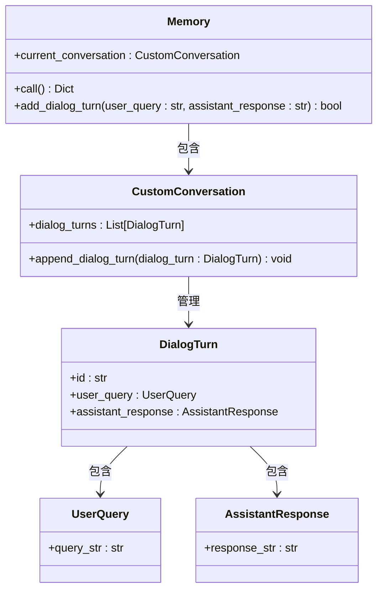

**图表来源**
- [api/rag.py](file://api/rag.py#L28-L44)
- [api/rag.py](file://api/rag.py#L146-L152)

### 对话历史处理机制

#### 添加对话轮次
系统通过add_dialog_turn方法安全地添加新的对话轮次，包含以下功能：

1. **UUID生成**：为每个对话轮次生成唯一标识符
2. **对象封装**：将用户查询和助手响应封装为标准对象
3. **异常处理**：提供完整的错误恢复机制

#### 记忆调用
call方法返回当前对话历史的字典表示：

1. **完整性检查**：验证对话轮次列表的存在性和有效性
2. **ID映射**：将对话轮次转换为以ID为键的字典结构
3. **日志记录**：提供详细的调试信息

#### 错误恢复策略
当遇到内存损坏或数据不一致时，系统提供多层次的恢复机制：

1. **自动重建**：创建新的对话会话实例
2. **数据迁移**：尝试将现有数据迁移到新实例
3. **降级处理**：在无法恢复时提供基础功能

**章节来源**
- [api/rag.py](file://api/rag.py#L51-L142)

## 多提供商模型配置

### 配置管理系统

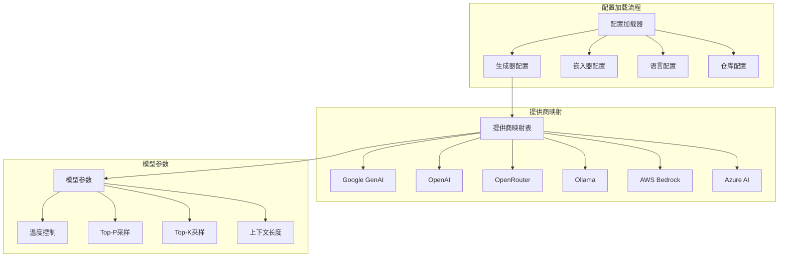

**图表来源**
- [api/config.py](file://api/config.py#L334-L388)
- [api/config/generator.json](file://api/config/generator.json#L1-L200)

### 支持的提供商特性

#### Google Generative AI
- **默认模型**：gemini-2.5-flash
- **参数配置**：temperature、top_p、top_k
- **特点**：高精度语义理解，强大的上下文处理能力

#### OpenAI
- **默认模型**：gpt-5-nano
- **参数配置**：temperature、top_p
- **特点**：广泛的语言理解能力，成熟的API生态

#### Ollama
- **默认模型**：qwen3:1.7b
- **参数配置**：temperature、top_p、num_ctx
- **特点**：本地部署，隐私保护，离线可用

#### AWS Bedrock
- **默认模型**：anthropic.claude-3-sonnet-20240229-v1:0
- **参数配置**：temperature、top_p
- **特点**：企业级安全性，合规性强

#### Azure AI
- **默认模型**：gpt-4o
- **参数配置**：temperature、top_p
- **特点**：微软生态系统集成，企业级支持

### 动态配置加载

get_model_config函数实现了动态配置加载机制：

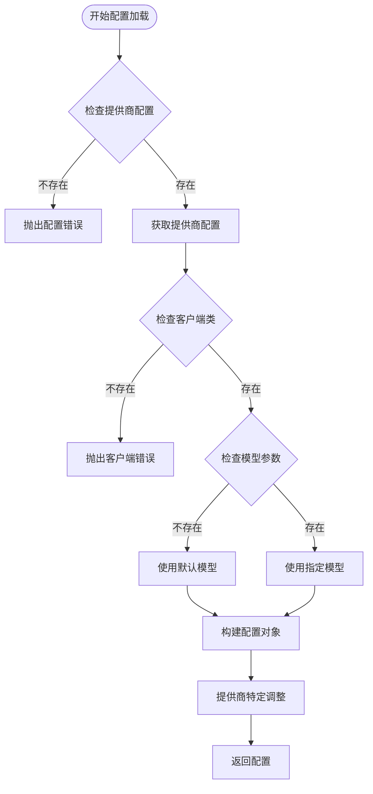

**图表来源**
- [api/config.py](file://api/config.py#L334-L388)

**章节来源**
- [api/config.py](file://api/config.py#L334-L388)
- [api/config/generator.json](file://api/config/generator.json#L1-L200)

## 错误处理与性能优化

### 嵌入验证机制

系统实现了严格的嵌入向量验证机制，确保检索质量：

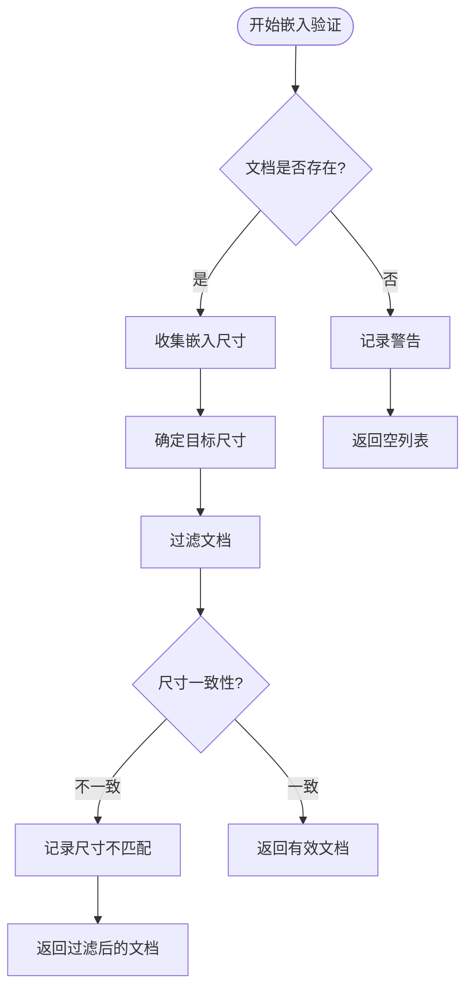

**图表来源**
- [api/rag.py](file://api/rag.py#L251-L343)

### 性能优化策略

#### 1. 批量处理优化
- **OpenAI嵌入器**：支持批量处理，提高吞吐量
- **Google嵌入器**：有限批次处理，平衡性能与资源
- **Ollama嵌入器**：单文档处理，确保兼容性

#### 2. 缓存机制
- **本地数据库**：持久化存储文档和嵌入向量
- **会话缓存**：临时存储对话历史和检索结果
- **配置缓存**：避免重复的配置加载操作

#### 3. 资源管理
- **连接池**：复用API连接，减少建立连接的开销
- **超时控制**：设置合理的请求超时时间
- **重试机制**：在网络不稳定时提供自动重试

### 错误恢复机制

#### 分层错误处理

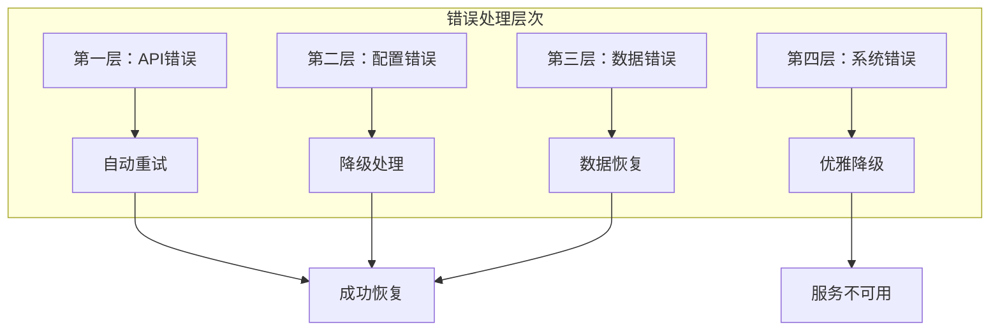

#### 具体错误场景处理

1. **嵌入向量不一致**
   - 自动检测并过滤不一致的向量
   - 记录详细的错误信息用于调试
   - 提供友好的错误消息给用户

2. **API调用失败**
   - 实现指数退避重试机制
   - 提供备用提供商切换
   - 返回结构化的错误响应

3. **内存溢出**
   - 实施内存监控和预警
   - 自动清理过期的对话历史
   - 限制单次请求的上下文长度

**章节来源**
- [api/rag.py](file://api/rag.py#L251-L445)

## 实际应用示例

### 基本使用流程

以下是使用RAG系统的典型流程：

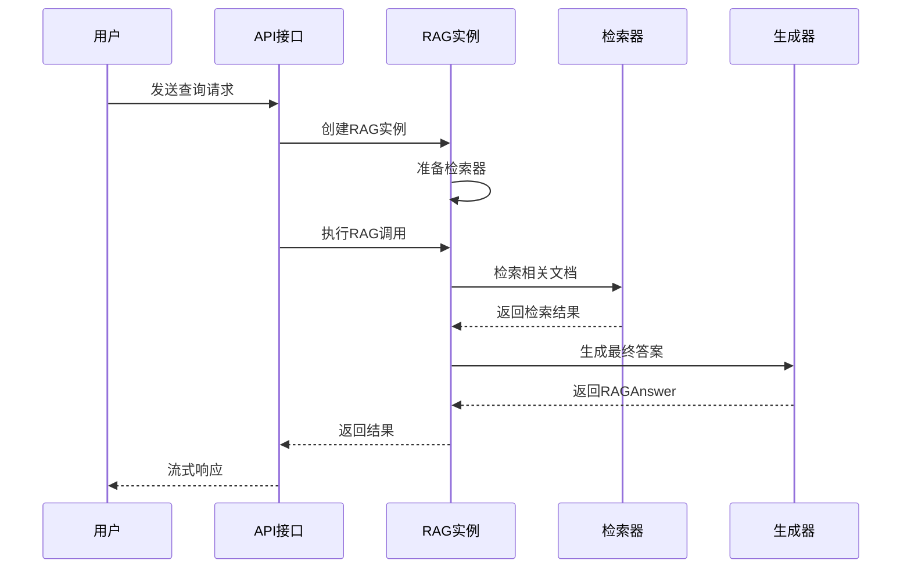

**图表来源**
- [api/simple_chat.py](file://api/simple_chat.py#L75-L690)

### 高级功能示例

#### 深度研究模式
系统支持多轮深度研究，特别适用于复杂的技术问题：

1. **首次迭代**：制定研究计划，识别关键方面
2. **中间迭代**：逐步深入，填补知识空白
3. **最终迭代**：综合所有发现，提供完整结论

#### 文件级上下文
支持针对特定文件的精确问答：

- 自动提取文件内容作为上下文
- 维护文件间的引用关系
- 提供文件级别的精确引用

#### 多语言支持
系统具备智能语言检测能力：

- 自动识别用户查询的语言
- 保持对话语言的一致性
- 支持多种语言的配置和输出

**章节来源**
- [api/simple_chat.py](file://api/simple_chat.py#L75-L690)

## 总结

deepwiki-open的RAG生成系统展现了现代AI问答系统的设计精髓。通过精心设计的架构，系统实现了以下核心价值：

### 技术创新点

1. **模块化设计**：清晰的组件分离，便于维护和扩展
2. **多提供商兼容**：统一的接口支持多种AI服务
3. **智能错误恢复**：多层次的错误处理确保系统稳定性
4. **性能优化**：针对不同场景的优化策略

### 应用价值

1. **开发效率提升**：快速获取代码仓库相关信息
2. **知识管理**：构建结构化的项目知识库
3. **团队协作**：提供统一的知识共享平台
4. **学习辅助**：帮助开发者快速理解复杂项目

### 未来发展方向

1. **模型能力提升**：集成更先进的大语言模型
2. **检索精度优化**：改进语义匹配算法
3. **用户体验改善**：提供更自然的交互方式
4. **企业级功能**：增强权限管理和审计功能

这个系统不仅展示了技术实现的精妙，更为AI驱动的知识管理系统提供了宝贵的参考范例。通过持续的优化和扩展，它有望成为开发者社区中不可或缺的重要工具。