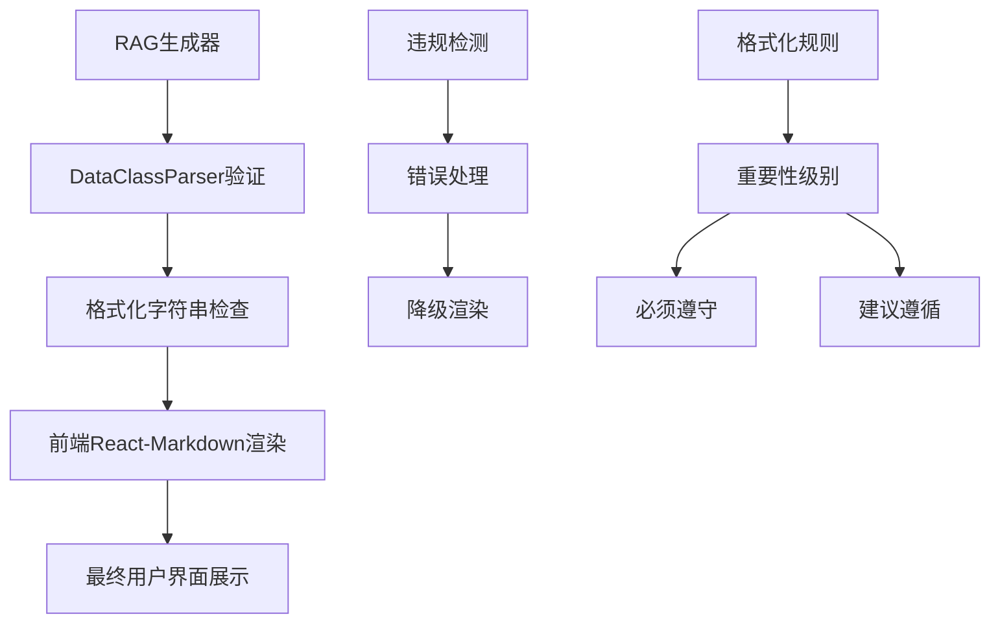
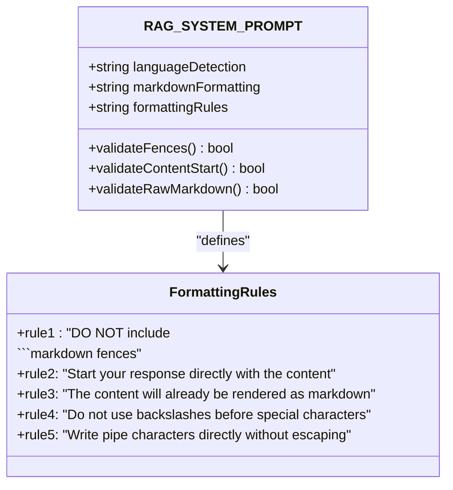
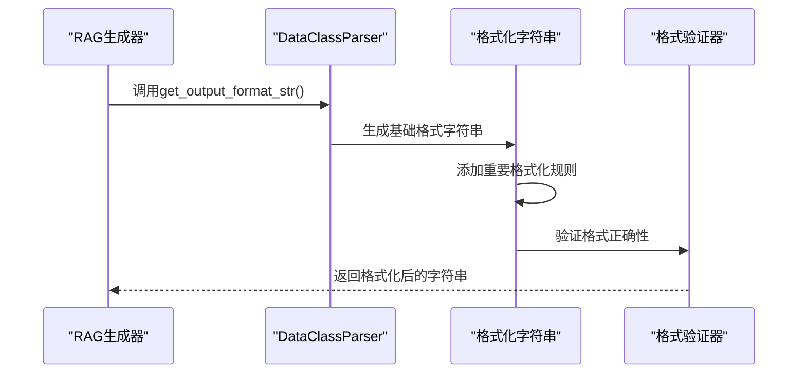
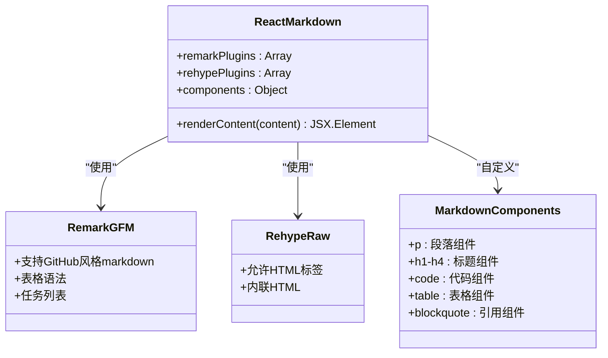
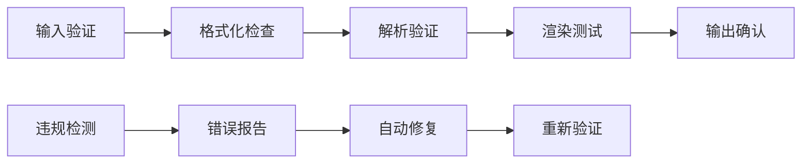
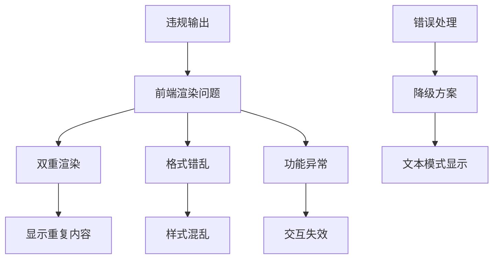
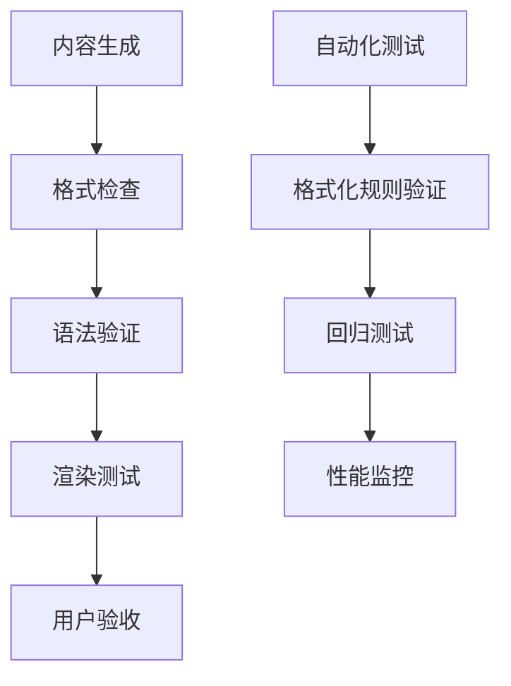
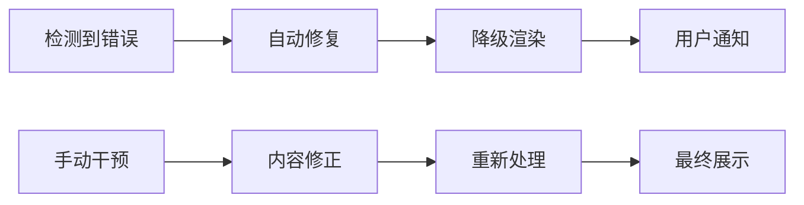

# 格式化规则

<cite>
**本文档引用的文件**
- [prompts.py](file://api/prompts.py)
- [rag.py](file://api/rag.py)
- [Markdown.tsx](file://src/components/Markdown.tsx)
- [workshop/page.tsx](file://src/app/[owner]/[repo]/workshop/page.tsx)
- [page.tsx](file://src/app/[owner]/[repo]/page.tsx)
- [data_pipeline.py](file://api/data_pipeline.py)
- [openrouter_client.py](file://api/openrouter_client.py)
</cite>

## 目录
1. [简介](#简介)
2. [核心格式化规则](#核心格式化规则)
3. [RAG_SYSTEM_PROMPT中的格式化要求](#rag_system_prompt中的格式化要求)
4. [DataClassParser的格式化字符串](#dataclassparser的格式化字符串)
5. [前端React-Markdown渲染机制](#前端react-markdown渲染机制)
6. [格式化规则的强制执行](#格式化规则的强制执行)
7. [违规输出的影响分析](#违规输出的影响分析)
8. [合规与违规输出对比示例](#合规与违规输出对比示例)
9. [最佳实践指南](#最佳实践指南)
10. [故障排除](#故障排除)

## 简介

deepwiki-open项目采用严格的RAG（检索增强生成）输出格式化规则，确保生成的内容能够被前端React-Markdown组件正确渲染。这些规则通过多个层面的验证和强制执行机制，防止格式错误导致的渲染问题。

本文档深入分析了系统中定义的重要格式化规则，包括禁止使用markdown代码围栏、直接内容开头、特殊字符转义等关键要求，以及这些规则如何通过DataClassParser的格式化字符串强制执行，并分析违反规则可能导致的解析失败或前端显示异常。

## 核心格式化规则

### 主要规则概述

系统定义了以下核心格式化规则：

1. **禁止markdown代码围栏**：不得在回答首尾包含```markdown围栏
2. **直接内容开头**：必须直接从内容开始，不添加前缀
3. **原始markdown内容**：提供的内容已经是markdown格式，无需额外包装
4. **避免特殊字符转义**：不要在答案中使用反斜杠转义特殊字符
5. **管道字符处理**：直接书写管道字符（|）而不进行转义

### 规则层次结构



**图表来源**
- [rag.py](file://api/rag.py#L213-L225)
- [prompts.py](file://api/prompts.py#L22-L26)

## RAG_SYSTEM_PROMPT中的格式化要求

### 系统提示词中的格式化指导

RAG_SYSTEM_PROMPT定义了详细的Markdown格式化要求：



**图表来源**
- [prompts.py](file://api/prompts.py#L4-L28)

### 具体格式化指令

系统提示词中的重要格式化规则包括：

1. **禁止代码围栏**：明确要求"DO NOT include ```markdown fences at the beginning or end of your answer"
2. **直接内容开始**：要求"Start your response directly with the content"
3. **原始markdown**：说明"The content will already be rendered as markdown"
4. **特殊字符处理**：禁止对特殊字符进行转义

**节来源**
- [prompts.py](file://api/prompts.py#L22-L26)

## DataClassParser的格式化字符串

### 格式化字符串的构建

DataClassParser通过`get_output_format_str()`方法生成格式化字符串，并附加重要格式化规则：



**图表来源**
- [rag.py](file://api/rag.py#L211-L225)

### 格式化规则的具体实现

格式化字符串包含以下重要规则：

1. **思维过程排除**："DO NOT include your thinking or reasoning process"
2. **最终答案提供**："Provide only the final, polished answer"
3. **禁止代码围栏**："DO NOT include ```markdown fences"
4. **无包装要求**："DO NOT wrap your response in any kind of fences"
5. **直接内容开始**："Start your response directly with the content"
6. **原始markdown**："The content will already be rendered as markdown"
7. **特殊字符处理**："Do not use backslashes before special characters"
8. **管道字符处理**："For pipe characters (|) in text, write them directly"

**节来源**
- [rag.py](file://api/rag.py#L214-L225)

## 前端React-Markdown渲染机制

### React-Markdown组件配置

前端使用React-Markdown组件渲染markdown内容，配置包括：



**图表来源**
- [Markdown.tsx](file://src/components/Markdown.tsx#L196-L204)

### 渲染流程分析

前端渲染流程确保格式化规则的有效执行：

1. **内容预处理**：移除可能存在的markdown围栏
2. **组件映射**：将markdown元素映射到React组件
3. **语法高亮**：为代码块提供语法高亮支持
4. **特殊处理**：Mermaid图表和其他特殊元素

**节来源**
- [Markdown.tsx](file://src/components/Markdown.tsx#L13-L208)

## 格式化规则的强制执行

### 多层验证机制

系统通过多层验证机制确保格式化规则得到遵守：



### DataClassParser的强制执行

DataClassParser通过以下方式强制执行格式化规则：

1. **输出格式字符串**：生成包含格式化规则的模板
2. **字段验证**：验证answer字段是否符合格式要求
3. **类型检查**：确保输出是正确的数据类型
4. **约束验证**：检查字段值是否满足约束条件

**节来源**
- [rag.py](file://api/rag.py#L146-L151)

## 违规输出的影响分析

### 渲染问题识别

违反格式化规则可能导致以下问题：



### 具体影响场景

1. **代码围栏违规**：
   - 前端检测到```markdown时自动移除
   - 可能导致内容截断或格式丢失
   - 影响代码块和表格的正确显示

2. **特殊字符转义**：
   - 反斜杠被错误转义
   - 导致特殊字符显示异常
   - 影响链接、表格等元素的正常显示

3. **管道字符处理**：
   - 表格列分隔符显示异常
   - 导致表格布局错乱
   - 影响数据展示的可读性

**节来源**
- [workshop/page.tsx](file://src/app/[owner]/[repo]/workshop/page.tsx#L435-L437)

## 合规与违规输出对比示例

### 合规输出示例

合规的RAG输出应该具有以下特征：

```markdown
# API配置指南

## 基本配置

以下是API的基本配置选项：

| 参数名 | 类型 | 默认值 | 描述 |
|--------|------|--------|------|
| timeout | number | 30000 | 请求超时时间（毫秒） |
| retries | number | 3 | 最大重试次数 |

### 代码示例

```python
config = {
    "timeout": 30000,
    "retries": 3
}
```

注意：所有参数都应直接提供，不需要额外的markdown包装。
```

### 违规输出示例

违规的输出可能包含以下问题：

```markdown
```markdown
# API配置指南

## 基本配置

以下是API的基本配置选项：

| 参数名 | 类型 | 默认值 | 描述 |
|--------|------|--------|------|
| timeout | number | 30000 | 请求超时时间（毫秒） |
| retries | number | 3 | 最大重试次数 |

### 代码示例

```python
config = {
    "timeout": 30000,
    "retries": 3
}
```
```

### 违规问题分析

1. **代码围栏问题**：整个内容被包裹在```markdown中
2. **特殊字符转义**：可能包含不必要的转义字符
3. **格式不一致**：与系统期望的原始markdown格式不符

**节来源**
- [page.tsx](file://src/app/[owner]/[repo]/page.tsx#L486-L495)

## 最佳实践指南

### 开发者指南

为了确保生成的内容符合格式化规则，请遵循以下最佳实践：

1. **直接内容生成**：
   - 不要在回答开头添加任何前缀
   - 直接提供markdown格式的内容
   - 避免使用```markdown代码围栏

2. **特殊字符处理**：
   - 直接书写管道字符（|）而不转义
   - 避免在文本中使用反斜杠转义
   - 正确处理引号和括号等特殊字符

3. **内容结构**：
   - 使用标准的markdown语法
   - 确保标题层级清晰
   - 合理使用列表和表格

### 测试和验证

建议在开发过程中进行以下验证：



## 故障排除

### 常见问题解决

当遇到格式化相关的问题时，可以按照以下步骤进行排查：

1. **检查输出格式**：
   - 确认没有```markdown代码围栏
   - 验证内容是否直接开始
   - 检查特殊字符是否正确处理

2. **验证前端渲染**：
   - 检查React-Markdown组件配置
   - 确认插件设置正确
   - 验证自定义组件映射

3. **调试工具使用**：
   - 使用浏览器开发者工具检查DOM结构
   - 查看控制台错误信息
   - 分析网络请求和响应

### 错误恢复机制

系统提供了多种错误恢复机制：



**节来源**
- [workshop/page.tsx](file://src/app/[owner]/[repo]/workshop/page.tsx#L435-L437)

## 结论

deepwiki-open项目的格式化规则体系通过多层次的验证和强制执行机制，确保RAG生成的内容能够在前端React-Markdown组件中正确渲染。这些规则不仅保证了用户体验的一致性，还防止了因格式错误导致的各种渲染问题。

开发者应当严格遵守这些格式化规则，特别是在处理复杂内容如表格、代码块和特殊字符时。通过理解规则的设计原理和实施细节，可以更好地利用系统的强大功能，为用户提供高质量的markdown内容展示体验。