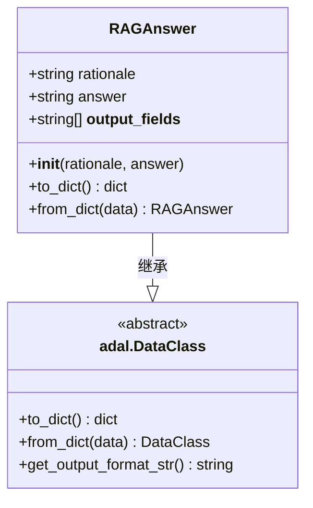
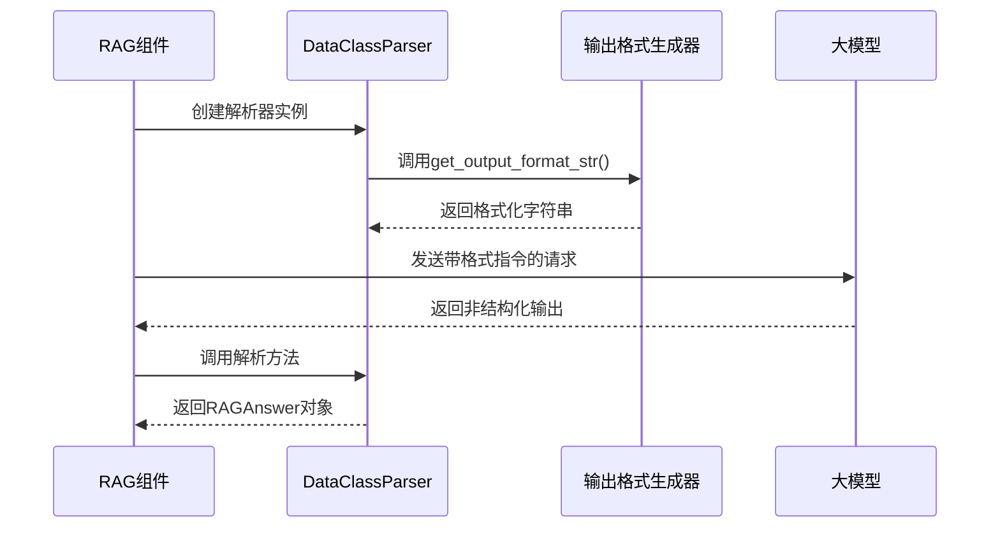
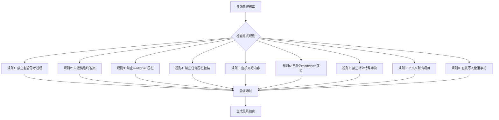
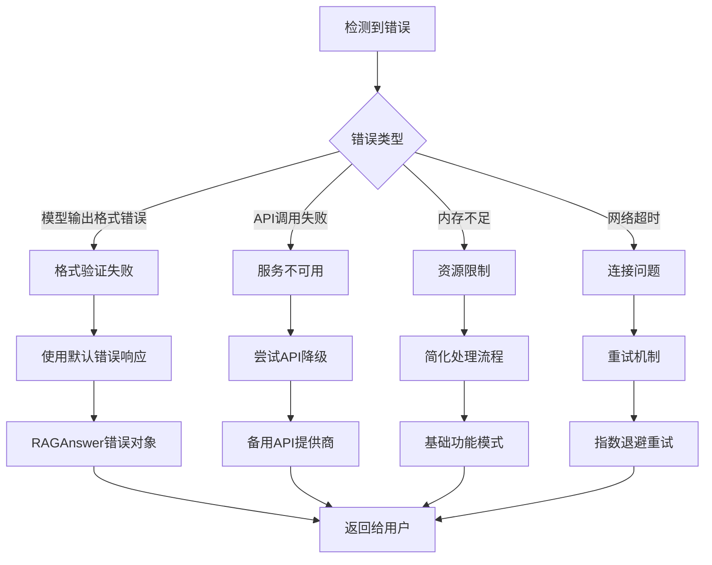
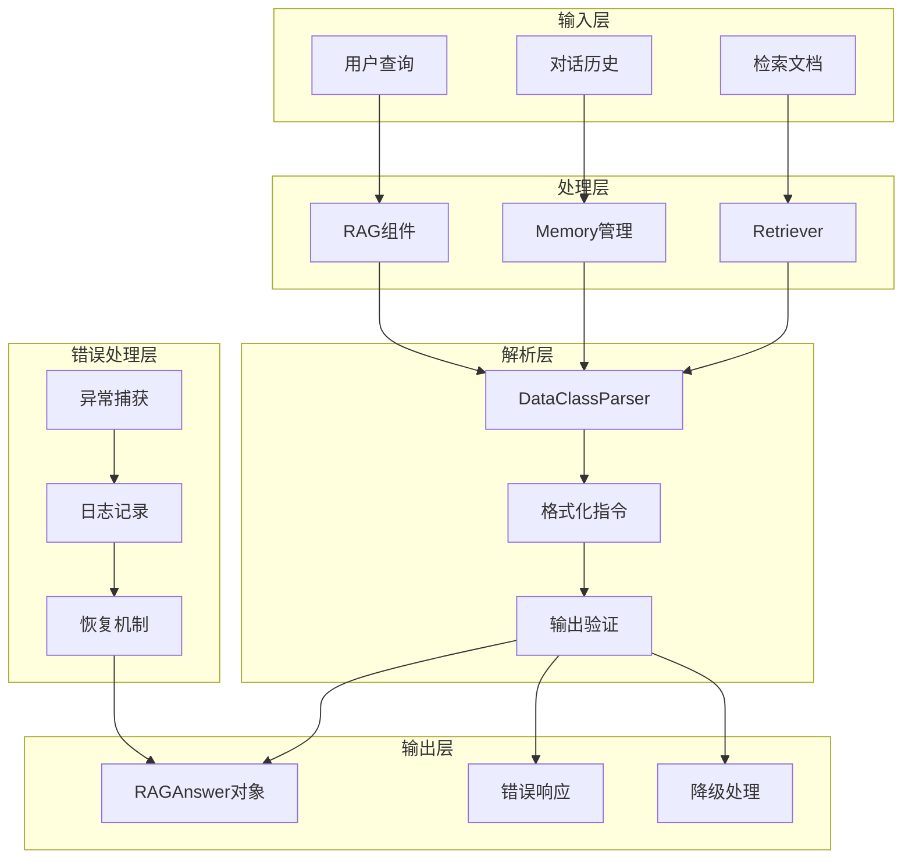
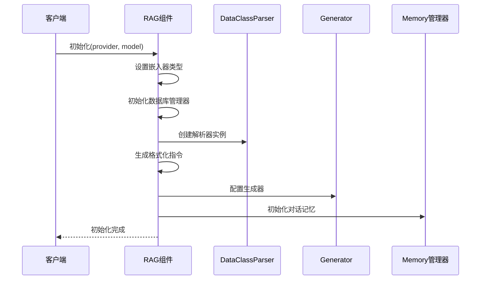
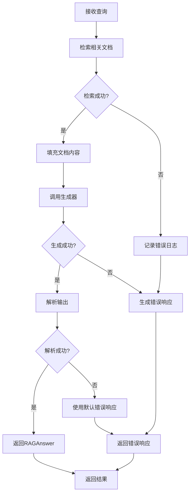
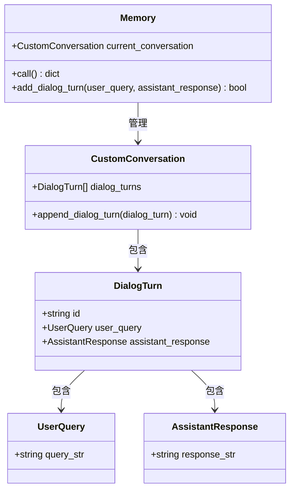
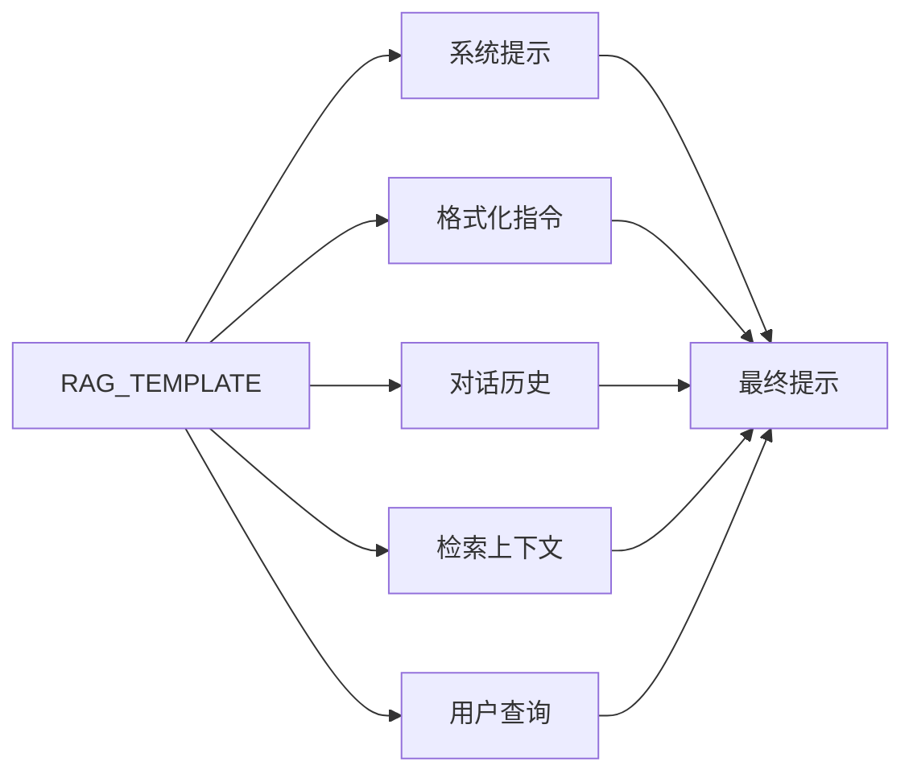
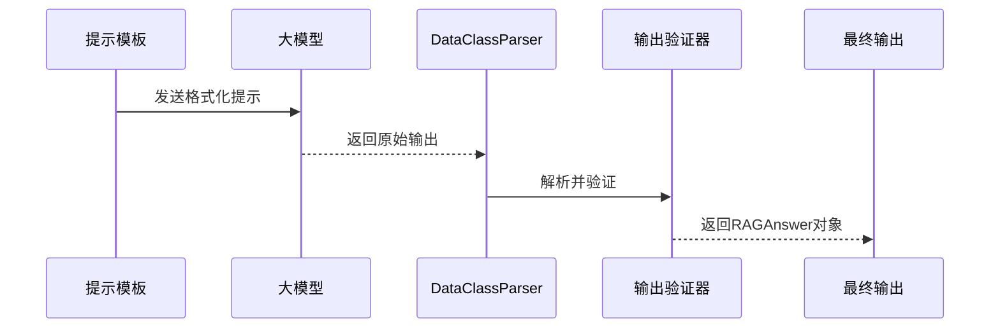

# 输出处理

<cite>
**本文档中引用的文件**
- [rag.py](file://api/rag.py)
- [prompts.py](file://api/prompts.py)
- [simple_chat.py](file://api/simple_chat.py)
- [websocket_wiki.py](file://api/websocket_wiki.py)
- [openrouter_client.py](file://api/openrouter_client.py)
- [openai_client.py](file://api/openai_client.py)
- [azureai_client.py](file://api/azureai_client.py)
</cite>

## 目录
1. [简介](#简介)
2. [RAGAnswer数据类结构](#raganswer数据类结构)
3. [DataClassParser解析机制](#dataclassparser解析机制)
4. [格式化指令系统](#格式化指令系统)
5. [错误处理与降级策略](#错误处理与降级策略)
6. [架构概览](#架构概览)
7. [详细组件分析](#详细组件分析)
8. [性能考虑](#性能考虑)
9. [故障排除指南](#故障排除指南)
10. [结论](#结论)

## 简介

deepwiki-open项目实现了一套完整的RAG（检索增强生成）输出处理系统，该系统通过严格的结构化输出控制和多层错误处理机制，确保大模型的非结构化输出能够被可靠地转换为标准化的RAGAnswer对象。本文档深入解析了系统的输出处理机制，包括数据类设计、解析器工作原理、格式化规则以及错误恢复策略。

## RAGAnswer数据类结构

RAGAnswer是系统的核心数据结构，采用Python的dataclass装饰器实现，提供了严格的类型安全和序列化支持。

### 数据类定义



**图表来源**
- [rag.py](file://api/rag.py#L146-L151)

### 字段语义定义

RAGAnswer包含两个核心字段，每个字段都有明确的语义职责：

#### rationale字段
- **类型**: `str`
- **默认值**: `""`
- **描述**: 链式思维推理过程，记录回答的思考轨迹
- **用途**: 提供透明度，展示模型如何得出最终答案

#### answer字段  
- **类型**: `str`
- **默认值**: `""`
- **描述**: 用户查询的答案，采用markdown格式渲染
- **特殊要求**: 不包含markdown代码围栏（```），直接提供纯文本内容

#### __output_fields__序列化机制
- **类型**: `list[str]`
- **值**: `["rationale", "answer"]`
- **功能**: 定义可序列化的字段列表，支持自动序列化和反序列化

**章节来源**
- [rag.py](file://api/rag.py#L146-L151)

## DataClassParser解析机制

DataClassParser是系统的核心解析组件，负责将大模型的非结构化输出转换为标准化的RAGAnswer对象。

### 解析器初始化



**图表来源**
- [rag.py](file://api/rag.py#L210-L212)

### 格式化字符串生成

解析器通过`get_output_format_str()`方法生成精确的输出格式说明，确保模型理解期望的数据结构：

- **字段映射**: 明确指定每个字段的名称和类型
- **约束条件**: 包含所有格式要求和验证规则
- **示例引导**: 提供正确的输出格式示例

### 输出验证机制

解析器实现了多层次的验证机制：

1. **语法验证**: 检查输出是否符合预期格式
2. **语义验证**: 验证字段内容的合理性
3. **完整性检查**: 确保所有必需字段都存在

**章节来源**
- [rag.py](file://api/rag.py#L210-L212)

## 格式化指令系统

IMPORTANT FORMATTING RULES是系统的核心约束机制，确保输出符合前端渲染要求。

### 规则体系



**图表来源**
- [rag.py](file://api/rag.py#L216-L225)

### 关键规则详解

#### 规则1-2: 思考过程限制
- **目的**: 确保输出简洁，避免冗余信息
- **影响**: 模型必须直接提供最终答案而非推理过程

#### 规则3-4: 围栏禁令
- **原因**: 前端react-markdown组件已处理markdown渲染
- **效果**: 避免双重渲染和格式冲突

#### 规则7-9: 特殊字符处理
- **规则7**: 禁止在特殊字符前使用反斜杠
- **规则8**: 列表项直接显示，不使用转义
- **规则9**: 管道字符(|)直接显示，不转义

**章节来源**
- [rag.py](file://api/rag.py#L216-L225)

## 错误处理与降级策略

系统实现了完善的错误处理和降级机制，确保在各种异常情况下都能提供有意义的响应。

### 错误分类与处理



**图表来源**
- [rag.py](file://api/rag.py#L440-L444)
- [simple_chat.py](file://api/simple_chat.py#L578-L656)

### 默认错误响应

当模型输出不符合预期格式时，系统会生成标准化的错误响应：

```python
error_response = RAGAnswer(
    rationale="Error occurred while processing the query.",
    answer="I apologize, but I encountered an error while processing your question. Please try again or rephrase your question."
)
```

### API降级策略

系统支持多层级的API降级：

1. **主API失败**: 自动切换到备用API提供商
2. **备用API失败**: 使用简化提示进行基础处理
3. **所有API失败**: 返回明确的错误信息

### 内存管理与资源控制

- **对话历史限制**: 限制对话轮次数量防止内存溢出
- **文档批处理**: 分批处理检索结果避免内存压力
- **弱引用机制**: 使用weakref防止循环引用

**章节来源**
- [rag.py](file://api/rag.py#L440-L444)
- [simple_chat.py](file://api/simple_chat.py#L578-L656)

## 架构概览

deepwiki-open的输出处理系统采用分层架构设计，确保各组件职责清晰、耦合度低。



**图表来源**
- [rag.py](file://api/rag.py#L153-L243)

## 详细组件分析

### RAG组件核心逻辑

RAG组件是整个输出处理系统的核心控制器，负责协调各个子组件的工作。

#### 初始化流程



**图表来源**
- [rag.py](file://api/rag.py#L157-L243)

#### 查询处理流程



**图表来源**
- [rag.py](file://api/rag.py#L416-L445)

### Memory管理系统

Memory组件负责维护对话历史，支持上下文连续性和状态管理。

#### 对话历史管理



**图表来源**
- [rag.py](file://api/rag.py#L28-L42)
- [rag.py](file://api/rag.py#L51-L89)

#### 错误恢复机制

Memory系统实现了健壮的错误恢复机制：

- **异常检测**: 自动检测对话历史中的异常状态
- **自动重建**: 在发现错误时自动重建对话历史
- **数据验证**: 验证对话轮次的完整性和一致性

**章节来源**
- [rag.py](file://api/rag.py#L51-L141)

### Generator配置与优化

Generator组件负责构建和执行大模型的调用，集成了格式化指令和输出处理器。

#### 模板系统

系统使用Jinja2模板引擎构建动态提示：



**图表来源**
- [prompts.py](file://api/prompts.py#L30-L57)

#### 输出处理器链



**图表来源**
- [rag.py](file://api/rag.py#L232-L242)

**章节来源**
- [rag.py](file://api/rag.py#L232-L242)

## 性能考虑

输出处理系统在设计时充分考虑了性能优化，采用了多种策略来提升响应速度和资源利用率。

### 内存优化策略

- **弱引用使用**: 在关键组件中使用weakref防止内存泄漏
- **批量处理**: 对文档和嵌入向量采用批量处理减少内存碎片
- **延迟加载**: 按需加载对话历史和检索结果

### 缓存机制

- **嵌入缓存**: 缓存常用的嵌入向量避免重复计算
- **解析缓存**: 缓存解析器配置和格式化指令
- **对话缓存**: 缓存频繁访问的对话历史片段

### 异步处理

系统支持异步处理模式，特别是在WebSocket和流式响应场景中：

- **并发处理**: 支持多个查询同时处理
- **流式响应**: 实现渐进式响应提升用户体验
- **超时控制**: 设置合理的超时时间防止资源占用

## 故障排除指南

### 常见问题诊断

#### 格式化错误
**症状**: 模型输出无法解析为RAGAnswer对象
**原因**: 输出格式不符合IMPORTANT FORMATTING RULES
**解决方案**: 检查格式化指令配置，确保规则正确应用

#### API调用失败
**症状**: 无法从大模型获取响应
**原因**: 网络问题、认证失败或API配额耗尽
**解决方案**: 实施降级策略，使用备用API提供商

#### 内存不足
**症状**: 处理大型查询时出现内存错误
**解决方案**: 启用内存管理机制，限制对话历史长度

### 调试工具

系统提供了完善的日志记录和调试功能：

- **详细日志**: 记录每个处理步骤的详细信息
- **性能监控**: 监控处理时间和资源使用情况
- **错误追踪**: 追踪错误传播路径和根本原因

**章节来源**
- [rag.py](file://api/rag.py#L437-L445)

## 结论

deepwiki-open的RAG输出处理系统通过精心设计的架构和完善的错误处理机制，实现了可靠的大模型输出转换。系统的核心优势包括：

1. **严格的数据结构控制**: 通过RAGAnswer数据类确保输出的结构化和一致性
2. **智能的解析机制**: DataClassParser提供准确的输出解析和验证
3. **完善的格式约束**: IMPORTANT FORMATTING RULES确保前端兼容性
4. **健壮的错误处理**: 多层级的降级策略保证系统稳定性
5. **灵活的扩展能力**: 模块化设计支持新功能的快速集成

该系统为RAG应用提供了坚实的基础，能够在各种复杂场景下稳定运行，为用户提供高质量的问答体验。