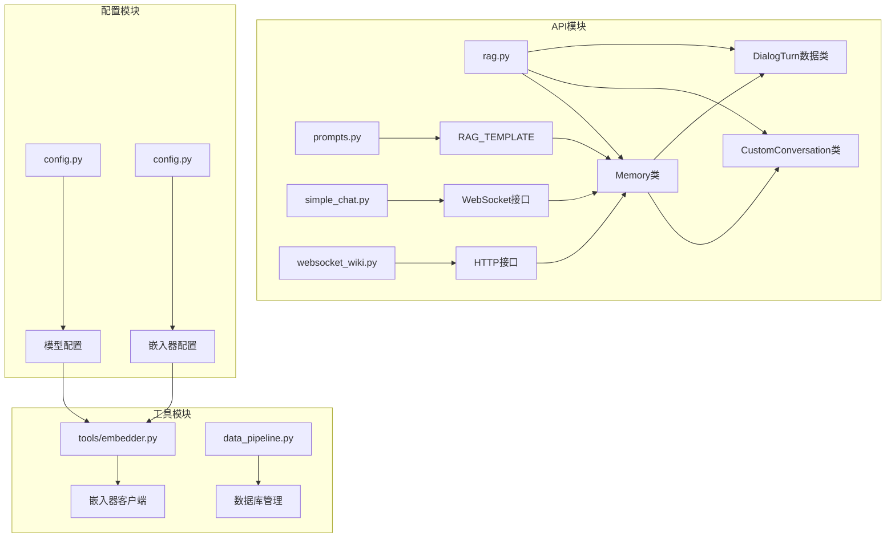
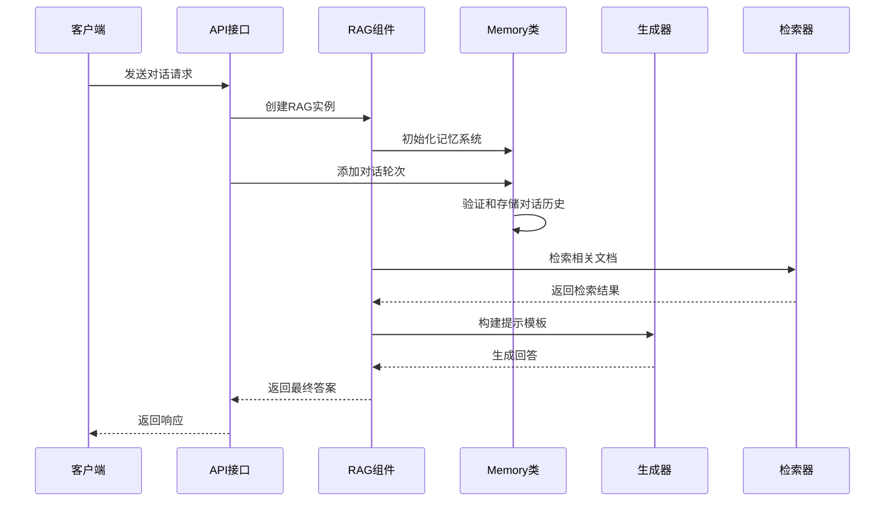
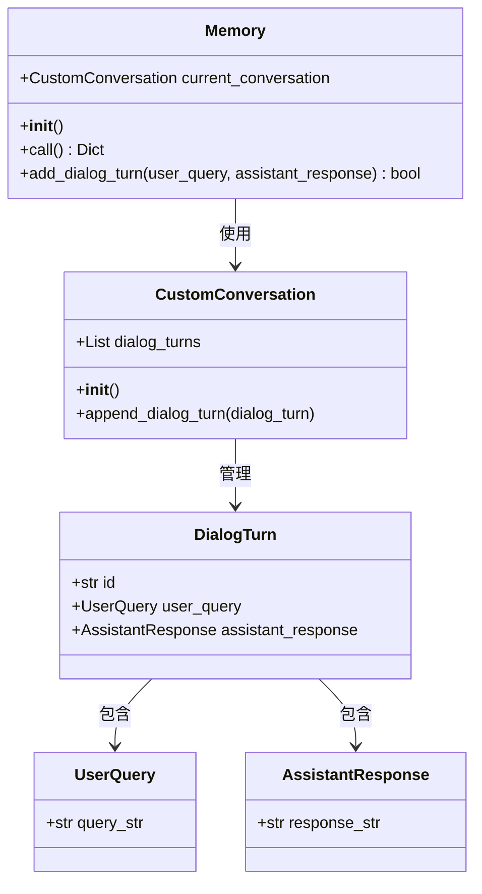
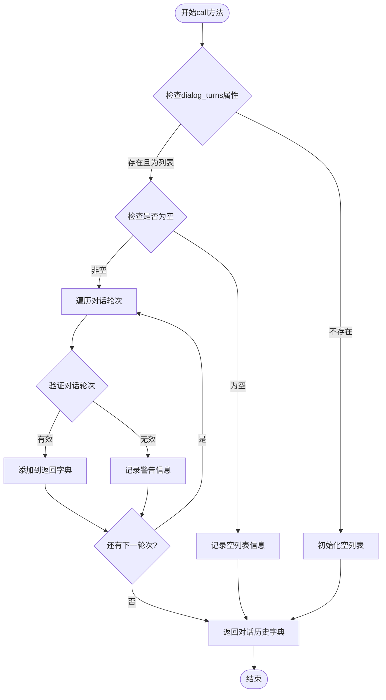
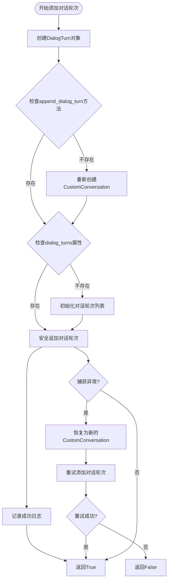
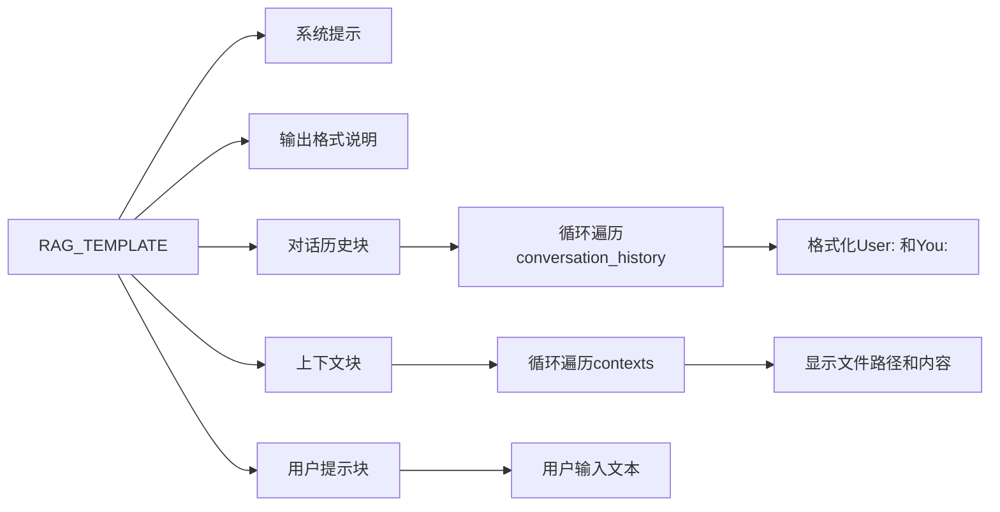
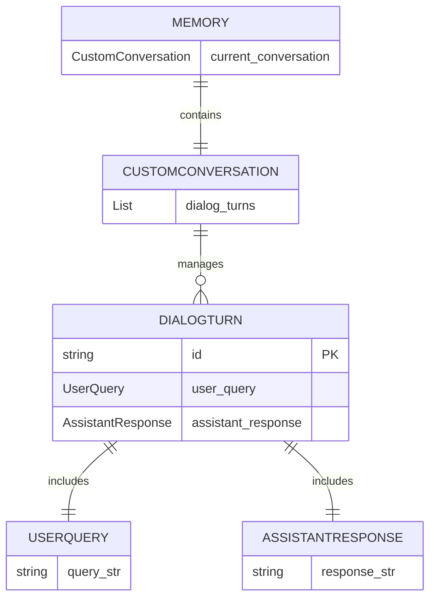
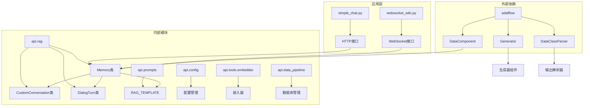

# 深度维基开放项目：RAG记忆管理系统

<cite>
**本文档中引用的文件**
- [rag.py](file://api/rag.py)
- [prompts.py](file://api/prompts.py)
- [simple_chat.py](file://api/simple_chat.py)
- [websocket_wiki.py](file://api/websocket_wiki.py)
- [main.py](file://api/main.py)
</cite>

## 目录
1. [简介](#简介)
2. [项目结构](#项目结构)
3. [核心组件](#核心组件)
4. [架构概览](#架构概览)
5. [详细组件分析](#详细组件分析)
6. [依赖关系分析](#依赖关系分析)
7. [性能考虑](#性能考虑)
8. [故障排除指南](#故障排除指南)
9. [结论](#结论)

## 简介

深度维基开放项目（deepwiki-open）是一个基于检索增强生成（RAG）技术的智能问答系统，专门用于GitHub仓库内容的理解和交互。该系统的核心记忆管理系统负责维护对话历史、管理上下文感知能力，并通过精心设计的数据结构确保系统的稳定性和可靠性。

本文档深入分析了RAG记忆管理系统的关键组件，特别是Memory类的实现细节，包括CustomConversation的自定义实现如何解决对话轮次列表赋值索引越界问题，以及add_dialog_turn方法如何安全地添加对话轮次并处理异常情况。

## 项目结构

深度维基开放项目的RAG记忆管理系统主要分布在以下关键文件中：

**图表来源**
- [rag.py](file://api/rag.py#L1-L446)
- [prompts.py](file://api/prompts.py#L1-L192)
- [simple_chat.py](file://api/simple_chat.py#L1-L315)
- [websocket_wiki.py](file://api/websocket_wiki.py#L1-L425)

**章节来源**
- [rag.py](file://api/rag.py#L1-L50)
- [prompts.py](file://api/prompts.py#L1-L60)

## 核心组件

RAG记忆管理系统包含以下核心组件：

### Memory类
Memory类是整个记忆管理系统的核心，继承自adalflow的DataComponent，负责管理对话历史和上下文信息。

### CustomConversation类
CustomConversation类是对原始Conversation类的自定义实现，专门解决了列表赋值索引越界的问题。

### DialogTurn数据类
DialogTurn类封装了单个对话轮次的所有信息，包括用户查询、助手响应和唯一标识符。

### RAG_TEMPLATE
RAG_TEMPLATE定义了检索增强生成的模板结构，用于将对话历史注入到生成器的提示中。

**章节来源**
- [rag.py](file://api/rag.py#L51-L150)

## 架构概览

RAG记忆管理系统采用分层架构设计，确保了良好的可扩展性和稳定性：

**图表来源**
- [rag.py](file://api/rag.py#L153-L243)
- [simple_chat.py](file://api/simple_chat.py#L130-L315)
- [websocket_wiki.py](file://api/websocket_wiki.py#L121-L425)

## 详细组件分析

### Memory类实现详解

Memory类是RAG记忆管理系统的核心，提供了完整的对话历史管理功能：

#### 类结构设计

**图表来源**
- [rag.py](file://api/rag.py#L28-L43)
- [rag.py](file://api/rag.py#L23-L39)

#### call方法的序列化机制

call方法负责将对话历史序列化为字典格式，供生成器使用：

**图表来源**
- [rag.py](file://api/rag.py#L59-L89)

#### add_dialog_turn方法的安全性设计

add_dialog_turn方法实现了多重安全保障机制：

**图表来源**
- [rag.py](file://api/rag.py#L91-L141)

**章节来源**
- [rag.py](file://api/rag.py#L59-L141)

### CustomConversation的自定义实现

CustomConversation类专门解决了原始Conversation类中的列表赋值索引越界问题：

#### 解决方案设计

CustomConversation通过以下机制确保安全性：
- 明确的初始化过程，避免未定义状态
- 增强的append_dialog_turn方法，包含额外的类型检查
- 异常处理机制，防止程序崩溃

#### 方法对比分析

| 特性 | 原始Conversation | CustomConversation |
|------|------------------|-------------------|
| 初始化方式 | 可能存在未定义状态 | 明确定义的空列表 |
| 列表操作 | 直接索引访问 | 安全的append方法 |
| 错误处理 | 基本异常捕获 | 增强的恢复机制 |
| 日志记录 | 有限的日志输出 | 详细的调试信息 |

**章节来源**
- [rag.py](file://api/rag.py#L28-L43)

### 对话历史注入机制

RAG记忆管理系统通过RAG_TEMPLATE将对话历史注入到生成器的提示中：

#### 模板结构分析

RAG_TEMPLATE采用Jinja2模板语法，支持动态内容注入：

**图表来源**
- [prompts.py](file://api/prompts.py#L30-L65)

#### 上下文感知能力

系统通过以下方式维持上下文感知能力：

1. **连续对话支持**：每次请求都携带完整的对话历史
2. **语境保持**：通过对话轮次ID确保语境连续性
3. **智能截断**：根据令牌限制自动调整对话历史长度
4. **错误恢复**：当对话历史损坏时能够自动恢复

**章节来源**
- [prompts.py](file://api/prompts.py#L30-L65)

### 内存管理策略

RAG记忆管理系统采用了多层次的内存管理策略：

#### 数据结构设计

**图表来源**
- [rag.py](file://api/rag.py#L14-L39)

#### 错误恢复机制

系统实现了完善的错误恢复机制：

1. **异常检测**：实时监控内存操作中的异常
2. **自动恢复**：当检测到错误时自动重建内存结构
3. **数据保护**：在恢复过程中尽可能保护现有数据
4. **日志记录**：详细记录所有错误和恢复操作

**章节来源**
- [rag.py](file://api/rag.py#L79-L88)
- [rag.py](file://api/rag.py#L126-L141)

## 依赖关系分析

RAG记忆管理系统的依赖关系体现了清晰的分层架构：

**图表来源**
- [rag.py](file://api/rag.py#L1-L10)
- [rag.py](file://api/rag.py#L153-L243)

**章节来源**
- [rag.py](file://api/rag.py#L1-L10)
- [rag.py](file://api/rag.py#L153-L243)

## 性能考虑

RAG记忆管理系统在设计时充分考虑了性能优化：

### 令牌限制管理
- 设置最大输入令牌数为7500，低于8192的限制
- 实时计算令牌数量，避免超出限制
- 智能截断过长的对话历史

### 内存优化策略
- 使用弱引用避免循环引用
- 及时清理不需要的数据
- 批量处理对话轮次以提高效率

### 并发处理能力
- 支持多线程并发访问
- 使用适当的锁机制保护共享资源
- 异步处理大型对话历史

## 故障排除指南

### 常见问题及解决方案

#### 对话历史丢失
**症状**：调用call方法时返回空字典
**原因**：对话轮次列表被意外清空或损坏
**解决方案**：
1. 检查是否有异常导致内存结构损坏
2. 查看日志中的错误信息
3. 系统会自动尝试恢复，如果失败则需要重新初始化

#### 添加对话轮次失败
**症状**：add_dialog_turn方法返回False
**原因**：内存操作过程中发生异常
**解决方案**：
1. 检查输入参数的有效性
2. 查看详细的错误日志
3. 系统会自动尝试恢复，如果持续失败可能需要重启服务

#### 模板渲染错误
**症状**：生成器无法正确渲染RAG_TEMPLATE
**原因**：对话历史格式不正确或缺少必要字段
**解决方案**：
1. 验证DialogTurn对象的完整性
2. 检查用户查询和助手响应的内容
3. 确保每个对话轮次都有唯一的ID

**章节来源**
- [rag.py](file://api/rag.py#L79-L88)
- [rag.py](file://api/rag.py#L126-L141)

## 结论

深度维基开放项目的RAG记忆管理系统展现了优秀的软件工程实践，通过以下关键特性确保了系统的可靠性和可维护性：

### 主要优势

1. **安全性设计**：通过CustomConversation类解决了原始实现中的索引越界问题
2. **健壮性保证**：完善的异常处理和错误恢复机制
3. **可扩展性**：清晰的模块化设计支持功能扩展
4. **性能优化**：合理的内存管理和令牌限制控制
5. **易用性**：简洁的API设计和详细的日志记录

### 最佳实践建议

1. **定期备份对话历史**：虽然系统有恢复机制，但重要对话应定期备份
2. **监控内存使用**：关注对话历史的增长趋势，及时清理过期数据
3. **测试异常场景**：在开发过程中充分测试各种异常情况
4. **优化模板结构**：根据实际需求调整RAG_TEMPLATE的复杂度
5. **性能调优**：根据具体使用场景调整令牌限制和缓存策略

该记忆管理系统为深度维基开放项目提供了坚实的基础，使其能够在复杂的对话环境中保持上下文感知能力，为用户提供高质量的智能问答体验。