# deepwiki-open 后端架构文档

<cite>
**本文档引用的文件**
- [api/main.py](file://api/main.py)
- [api/api.py](file://api/api.py)
- [api/data_pipeline.py](file://api/data_pipeline.py)
- [api/rag.py](file://api/rag.py)
- [api/config.py](file://api/config.py)
- [api/simple_chat.py](file://api/simple_chat.py)
- [api/websocket_wiki.py](file://api/websocket_wiki.py)
- [api/prompts.py](file://api/prompts.py)
- [api/logging_config.py](file://api/logging_config.py)
- [api/tools/embedder.py](file://api/tools/embedder.py)
- [api/config/generator.json](file://api/config/generator.json)
- [api/config/embedder.json](file://api/config/embedder.json)
- [api/config/lang.json](file://api/config/lang.json)
- [api/config/repo.json](file://api/config/repo.json)
</cite>

## 目录
1. [简介](#简介)
2. [系统架构概览](#系统架构概览)
3. [FastAPI 应用启动流程](#fastapi-应用启动流程)
4. [REST API 路由组织](#rest-api-路由组织)
5. [数据管道处理流程](#数据管道处理流程)
6. [RAG 系统实现](#rag-系统实现)
7. [实时交互支持](#实时交互支持)
8. [配置驱动设计](#配置驱动设计)
9. [提示词模板系统](#提示词模板系统)
10. [错误处理与日志记录](#错误处理与日志记录)
11. [安全考虑](#安全考虑)
12. [总结](#总结)

## 简介

deepwiki-open 是一个基于 FastAPI 的智能代码知识库系统，提供了强大的代码分析和问答功能。该系统采用模块化架构设计，支持多种 AI 提供商，具备流式对话、WebSocket 实时交互、RAG 检索增强生成等功能。

## 系统架构概览

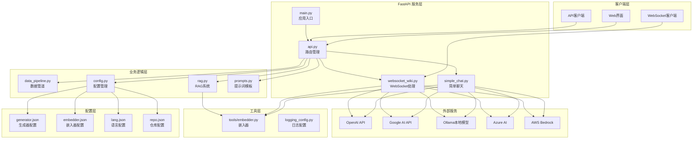

**图表来源**
- [api/main.py](file://api/main.py#L1-L80)
- [api/api.py](file://api/api.py#L1-L635)
- [api/data_pipeline.py](file://api/data_pipeline.py#L1-L886)
- [api/rag.py](file://api/rag.py#L1-L446)

## FastAPI 应用启动流程

### 应用初始化阶段

系统从 `main.py` 开始启动，执行以下关键步骤：

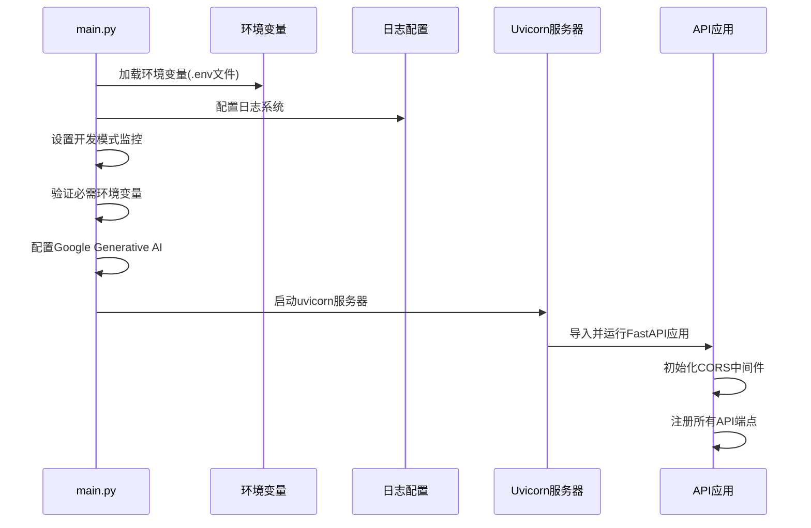

**图表来源**
- [api/main.py](file://api/main.py#L1-L80)

### 关键启动组件

1. **环境变量加载**：使用 `dotenv` 加载 `.env` 文件中的配置
2. **日志系统配置**：通过 `logging_config.py` 设置旋转日志文件
3. **开发模式优化**：启用文件变更监控和自动重载
4. **API密钥验证**：检查必需的API密钥是否已设置
5. **Google AI配置**：预配置Google Generative AI客户端

**章节来源**
- [api/main.py](file://api/main.py#L1-L80)

## REST API 路由组织

### 核心路由结构

`api.py` 文件定义了完整的REST API路由结构，包含以下主要端点：

```mermaid
graph TD
Root[根路径 /] --> Health[健康检查 /health]
Root --> Docs[API文档 /docs]
Root --> ChatStream[流式聊天 /chat/completions/stream]
Root --> WebSocket[WebSocket聊天 /ws/chat]
Root --> ModelsConfig[模型配置 /models/config]
Root --> LangConfig[语言配置 /lang/config]
Root --> AuthStatus[认证状态 /auth/status]
Root --> AuthValidate[认证验证 /auth/validate]
Root --> WikiCache[Wiki缓存 /api/wiki_cache]
Root --> ProcessedProjects[已处理项目 /api/processed_projects]
Root --> ExportWiki[导出Wiki /export/wiki]
Root --> LocalRepo[本地仓库结构 /local_repo/structure]
Root --> WikiProjects[Wiki项目列表 /wiki/projects]
```

**图表来源**
- [api/api.py](file://api/api.py#L540-L570)

### 主要端点功能

| 端点 | 方法 | 功能描述 | 响应类型 |
|------|------|----------|----------|
| `/chat/completions/stream` | POST | 流式聊天完成 | 文本事件流 |
| `/ws/chat` | WebSocket | WebSocket实时聊天 | 实时消息流 |
| `/models/config` | GET | 获取可用模型配置 | JSON响应 |
| `/api/wiki_cache` | GET/POST/DELETE | Wiki缓存管理 | JSON响应 |
| `/api/processed_projects` | GET | 已处理项目列表 | JSON数组 |
| `/export/wiki` | POST | 导出Wiki内容 | 文件下载 |

**章节来源**
- [api/api.py](file://api/api.py#L167-L635)

## 数据管道处理流程

### 仓库分析工作流程

`data_pipeline.py` 实现了完整的代码仓库分析流程：

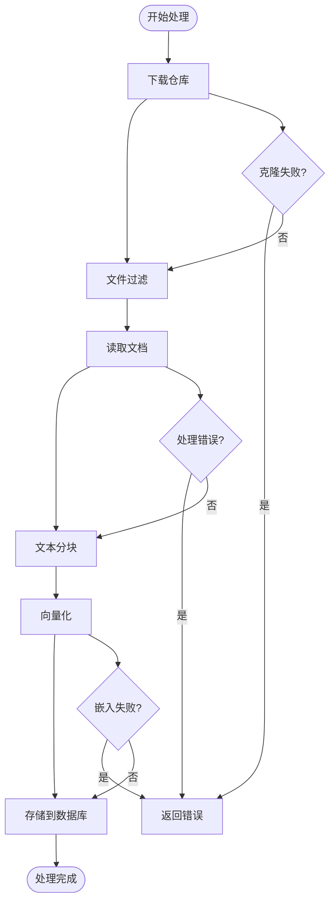

**图表来源**
- [api/data_pipeline.py](file://api/data_pipeline.py#L70-L886)

### 核心处理步骤

1. **仓库下载**：支持GitHub、GitLab、Bitbucket等多种仓库类型
2. **文件过滤**：根据配置排除特定目录和文件
3. **文档读取**：递归扫描指定目录下的代码和文档文件
4. **文本分块**：使用 `TextSplitter` 将大文件分割成可管理的块
5. **向量化**：通过嵌入器生成向量表示
6. **数据库存储**：保存到本地数据库进行后续检索

**章节来源**
- [api/data_pipeline.py](file://api/data_pipeline.py#L1-L886)

## RAG 系统实现

### RAG 架构设计

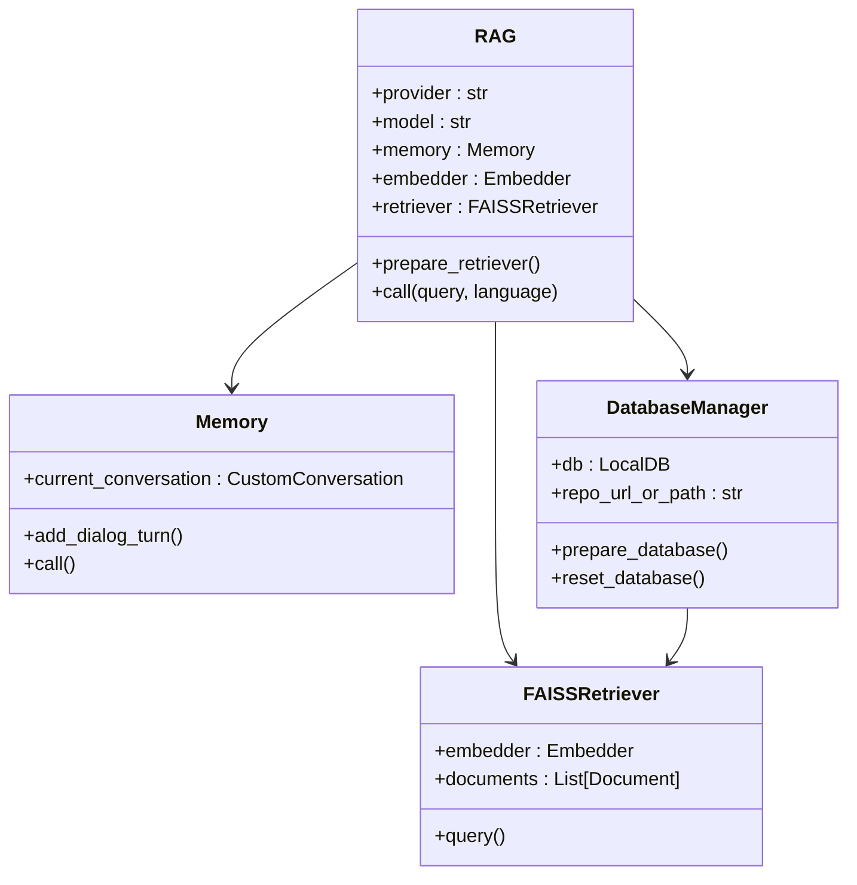

**图表来源**
- [api/rag.py](file://api/rag.py#L154-L446)

### 检索增强生成流程

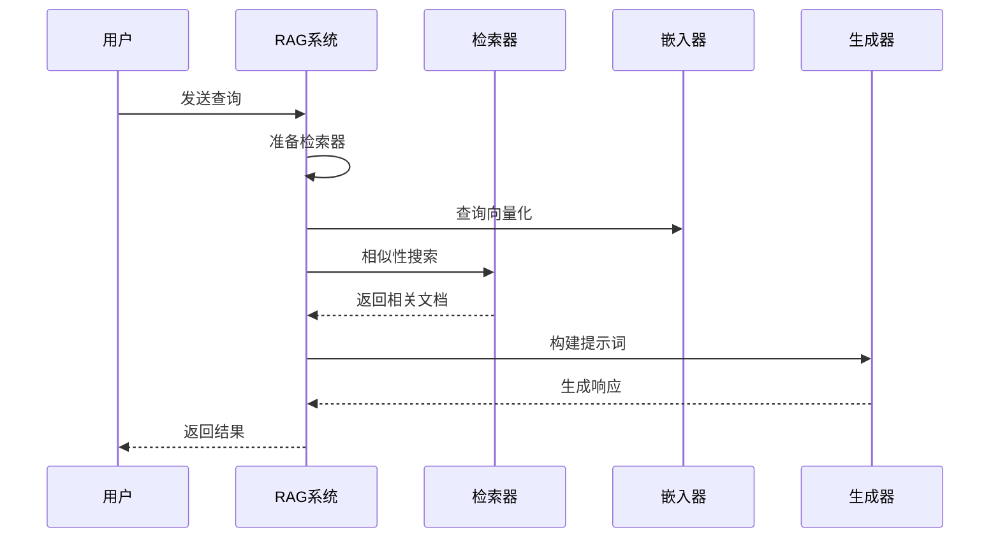

**图表来源**
- [api/rag.py](file://api/rag.py#L416-L446)

### 核心特性

1. **多提供商支持**：兼容OpenAI、Google、Ollama、Azure、Bedrock等
2. **会话记忆**：维护对话历史，支持连续问答
3. **动态检索**：根据查询实时检索相关文档
4. **错误恢复**：具备完善的错误处理和恢复机制
5. **嵌入验证**：确保向量维度一致性

**章节来源**
- [api/rag.py](file://api/rag.py#L1-L446)

## 实时交互支持

### 简单聊天 vs WebSocket 对比

| 特性 | 简单聊天 | WebSocket |
|------|----------|-----------|
| 连接方式 | HTTP请求-响应 | 持久连接 |
| 实时性 | 延迟较高 | 实时推送 |
| 资源占用 | 较低 | 中等 |
| 使用场景 | 短期问答 | 长期对话 |
| 错误处理 | 单次重试 | 连接恢复 |

### WebSocket 处理流程

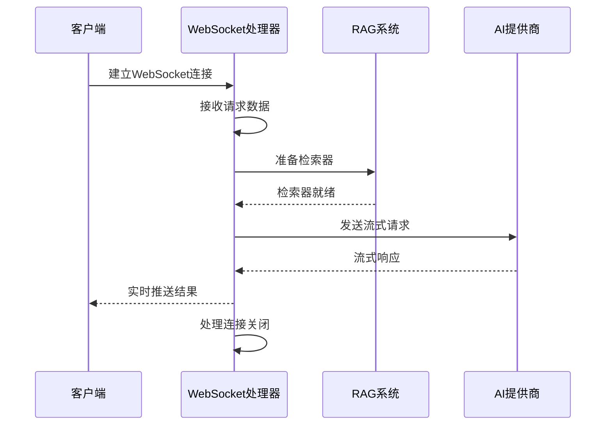

**图表来源**
- [api/websocket_wiki.py](file://api/websocket_wiki.py#L52-L770)

**章节来源**
- [api/simple_chat.py](file://api/simple_chat.py#L1-L690)
- [api/websocket_wiki.py](file://api/websocket_wiki.py#L1-L770)

## 配置驱动设计

### 配置系统架构

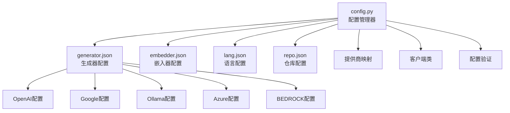

**图表来源**
- [api/config.py](file://api/config.py#L1-L388)
- [api/config/generator.json](file://api/config/generator.json#L1-L200)

### 支持的AI提供商

| 提供商 | 默认模型 | 特性 |
|--------|----------|------|
| OpenAI | gpt-5-nano | 支持自定义模型 |
| Google | gemini-2.5-flash | 支持自定义模型 |
| OpenRouter | openai/gpt-5-nano | 多模型聚合 |
| Ollama | qwen3:1.7b | 本地部署 |
| Azure | gpt-4o | 企业级 |
| Bedrock | anthropic.claude-3-sonnet | AWS云原生 |
| DashScope | qwen-plus | 阿里云 |

### 配置加载机制

1. **环境变量优先**：支持通过环境变量覆盖配置
2. **动态加载**：运行时加载和解析JSON配置文件
3. **类型验证**：确保配置参数的正确性
4. **默认值提供**：为缺失配置提供合理默认值

**章节来源**
- [api/config.py](file://api/config.py#L1-L388)
- [api/config/generator.json](file://api/config/generator.json#L1-L200)
- [api/config/embedder.json](file://api/config/embedder.json#L1-L34)

## 提示词模板系统

### 提示词设计原则

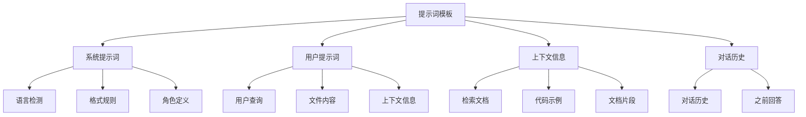

**图表来源**
- [api/prompts.py](file://api/prompts.py#L1-L192)

### 深度研究流程

系统支持多轮深度研究，具有以下迭代模式：

1. **首次迭代**：制定研究计划，确定研究范围
2. **中间迭代**：深入探索，填补知识空白
3. **最终迭代**：综合所有发现，提供完整结论

### 格式化规则

提示词遵循严格的格式化规范：
- 不使用Markdown代码块标记
- 直接提供纯文本内容
- 支持多种编程语言的语法高亮
- 自动语言检测和响应

**章节来源**
- [api/prompts.py](file://api/prompts.py#L1-L192)

## 错误处理与日志记录

### 日志系统设计

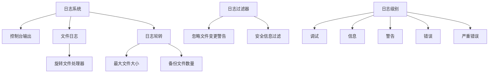

**图表来源**
- [api/logging_config.py](file://api/logging_config.py#L1-L86)

### 错误处理策略

1. **分层错误处理**：在不同层次捕获和处理错误
2. **优雅降级**：当高级功能不可用时提供基础功能
3. **详细日志记录**：记录完整的错误堆栈和上下文信息
4. **用户友好提示**：向用户提供清晰的错误说明

### 安全防护措施

1. **路径遍历防护**：防止恶意路径访问
2. **输入验证**：验证所有用户输入参数
3. **API密钥保护**：避免在日志中泄露敏感信息
4. **资源限制**：限制文件大小和处理时间

**章节来源**
- [api/logging_config.py](file://api/logging_config.py#L1-L86)

## 安全考虑

### 输入验证机制

系统实现了多层次的安全防护：

1. **路径安全检查**：防止目录遍历攻击
2. **文件大小限制**：限制上传和处理的文件大小
3. **API密钥管理**：安全存储和传输API密钥
4. **CORS配置**：严格控制跨域请求

### 认证与授权

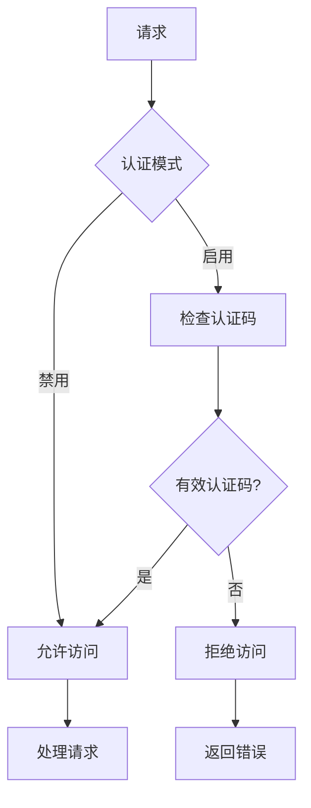

**图表来源**
- [api/api.py](file://api/api.py#L149-L166)

### 数据保护

1. **敏感信息过滤**：自动过滤日志中的敏感信息
2. **临时文件清理**：及时删除临时处理文件
3. **缓存安全**：安全存储和访问缓存数据
4. **网络通信加密**：使用HTTPS保护数据传输

## 总结

deepwiki-open 后端架构展现了现代AI应用的最佳实践：

### 核心优势

1. **模块化设计**：清晰的职责分离和组件化架构
2. **可扩展性**：支持多种AI提供商和配置选项
3. **实时交互**：提供流式和WebSocket两种交互方式
4. **容错能力**：完善的错误处理和恢复机制
5. **配置驱动**：灵活的配置管理和环境适配

### 技术亮点

- **RAG系统**：结合检索和生成的智能问答
- **多模态支持**：同时处理代码和文档内容
- **实时处理**：支持流式响应和WebSocket交互
- **多语言支持**：国际化和本地化功能
- **性能优化**：向量化检索和缓存机制

该架构为构建企业级AI知识库应用提供了坚实的基础，具备良好的可维护性和扩展性，能够适应不断变化的需求和技术发展。