# AI提供商客户端集成文档

<cite>
**本文档中引用的文件**
- [openai_client.py](file://api/openai_client.py)
- [google_embedder_client.py](file://api/google_embedder_client.py)
- [azureai_client.py](file://api/azureai_client.py)
- [dashscope_client.py](file://api/dashscope_client.py)
- [bedrock_client.py](file://api/bedrock_client.py)
- [openrouter_client.py](file://api/openrouter_client.py)
- [ollama_patch.py](file://api/ollama_patch.py)
- [config.py](file://api/config.py)
- [embedder.py](file://api/tools/embedder.py)
- [generator.json](file://api/config/generator.json)
- [embedder.json](file://api/config/embedder.json)
</cite>

## 目录
1. [简介](#简介)
2. [项目架构概览](#项目架构概览)
3. [核心组件分析](#核心组件分析)
4. [AI提供商客户端详解](#ai提供商客户端详解)
5. [统一接口设计](#统一接口设计)
6. [配置管理](#配置管理)
7. [错误处理与重试机制](#错误处理与重试机制)
8. [最佳实践](#最佳实践)
9. [故障排除指南](#故障排除指南)
10. [总结](#总结)

## 简介

deepwiki-open是一个基于RAG（检索增强生成）架构的知识库系统，支持多种AI提供商的插件化集成。该系统通过统一的ModelClient接口，为不同的AI服务提供商（如OpenAI、Google、Azure、阿里云等）提供了标准化的访问方式，实现了灵活的AI模型选择和无缝的切换能力。

本文档详细分析了七个核心AI客户端的实现，包括它们的认证机制、请求参数转换、流式响应处理和错误处理策略，以及如何通过统一接口与RAG系统集成。

## 项目架构概览

系统采用分层架构设计，通过抽象的ModelClient接口实现AI提供商的插件化支持：

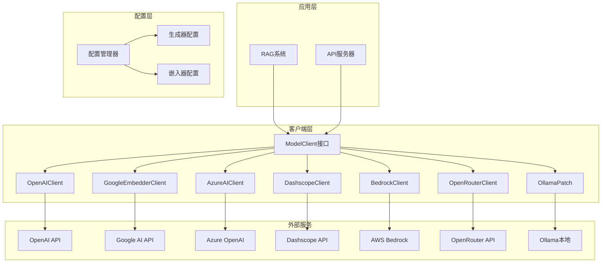

**图表来源**
- [config.py](file://api/config.py#L55-L63)
- [openai_client.py](file://api/openai_client.py#L120-L140)

## 核心组件分析

### ModelClient基类设计

所有AI客户端都继承自AdalFlow框架的ModelClient基类，提供了统一的接口规范：

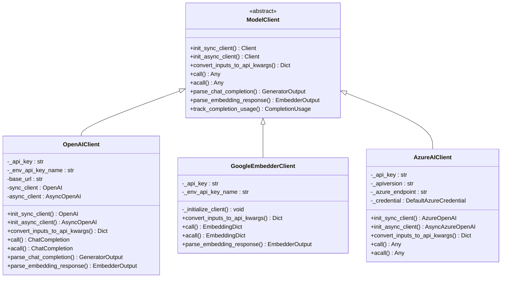

**章节来源**
- [openai_client.py](file://api/openai_client.py#L120-L140)
- [google_embedder_client.py](file://api/google_embedder_client.py#L20-L40)
- [azureai_client.py](file://api/azureai_client.py#L118-L140)

## AI提供商客户端详解

### OpenAIClient - OpenAI API集成

OpenAIClient是系统中最完整和功能最丰富的AI客户端，支持聊天完成、文本嵌入和图像生成等多种功能。

#### 认证机制
- **API密钥认证**：支持环境变量`OPENAI_API_KEY`或直接传入API密钥
- **基础URL配置**：支持自定义API端点，用于第三方服务或本地部署
- **环境变量优先级**：优先使用环境变量，避免硬编码敏感信息

#### 请求参数转换
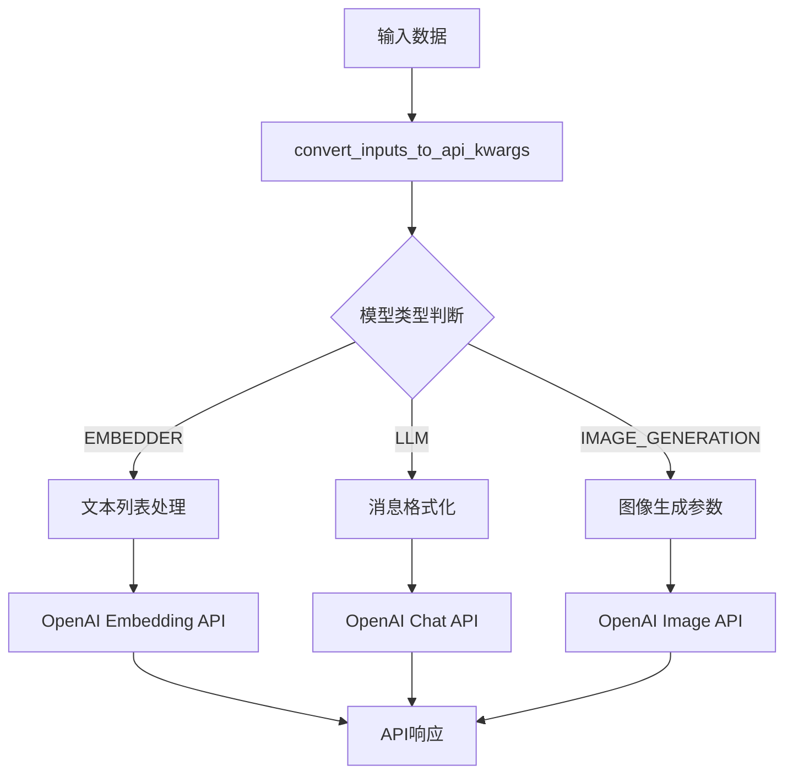

**图表来源**
- [openai_client.py](file://api/openai_client.py#L270-L380)

#### 流式响应处理
- **同步流式**：通过`handle_streaming_response`函数处理实时数据流
- **异步流式**：支持异步生成器模式，适用于高并发场景
- **内容解析**：自动提取增量内容，保持原始消息结构

#### 多模态支持
- **图像输入**：支持本地路径、URL和Base64编码的图像
- **详细级别控制**：可配置图像识别的详细程度（auto、low、high）
- **混合内容**：支持文本和图像的组合输入

**章节来源**
- [openai_client.py](file://api/openai_client.py#L1-L630)

### GoogleEmbedderClient - Google AI嵌入服务

GoogleEmbedderClient专门处理Google的文本嵌入服务，提供语义相似度计算能力。

#### 特色功能
- **批量嵌入**：支持单个文本和批量文本的统一处理
- **任务类型配置**：可指定`SEMANTIC_SIMILARITY`、`CLASSIFICATION`等任务类型
- **灵活的响应解析**：支持单个嵌入和批量嵌入的不同响应格式

#### 嵌入维度处理
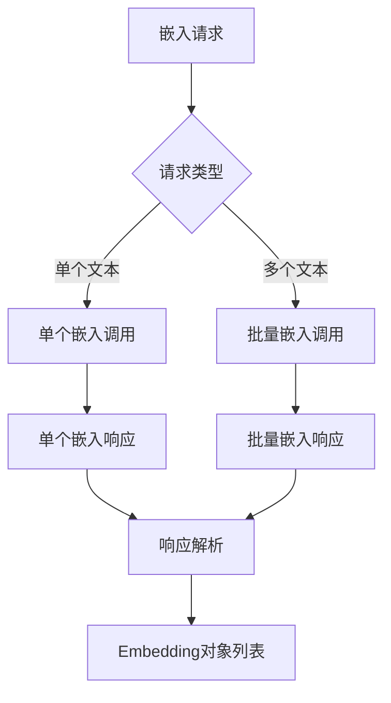

**图表来源**
- [google_embedder_client.py](file://api/google_embedder_client.py#L141-L185)

**章节来源**
- [google_embedder_client.py](file://api/google_embedder_client.py#L1-L231)

### AzureAIClient - Azure OpenAI服务

AzureAIClient提供企业级的Azure OpenAI服务集成，支持多种认证方式。

#### 认证方式
- **API密钥认证**：传统的API密钥验证
- **Azure AD令牌**：基于身份的访问控制
- **凭据链**：自动检测和使用可用的凭据

#### 企业特性
- **专用端点**：支持自定义Azure区域和端点
- **版本控制**：明确的API版本管理
- **合规性**：符合企业安全和合规要求

**章节来源**
- [azureai_client.py](file://api/azureai_client.py#L1-L488)

### DashscopeClient - 阿里云通义千问

DashscopeClient集成了阿里云的Dashscope平台，提供与OpenAI兼容的API接口。

#### 批量处理优化
- **缓存机制**：智能缓存嵌入结果，减少API调用
- **批量大小限制**：自动调整批量大小以符合API限制
- **错误恢复**：部分失败时的优雅降级

#### 数据过滤
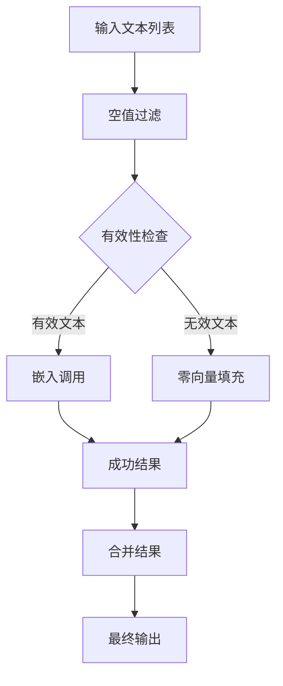

**图表来源**
- [dashscope_client.py](file://api/dashscope_client.py#L410-L480)

**章节来源**
- [dashscope_client.py](file://api/dashscope_client.py#L1-L914)

### BedrockClient - AWS Bedrock服务

BedrockClient提供对AWS Bedrock平台上各种大模型的统一访问。

#### 多提供商支持
- **Claude系列**：Anthropic的对话模型
- **Titan系列**：Amazon的自研模型
- **Cohere系列**：Cohere的生成模型
- **AI21系列**：AI21 Labs的模型

#### 协议适配
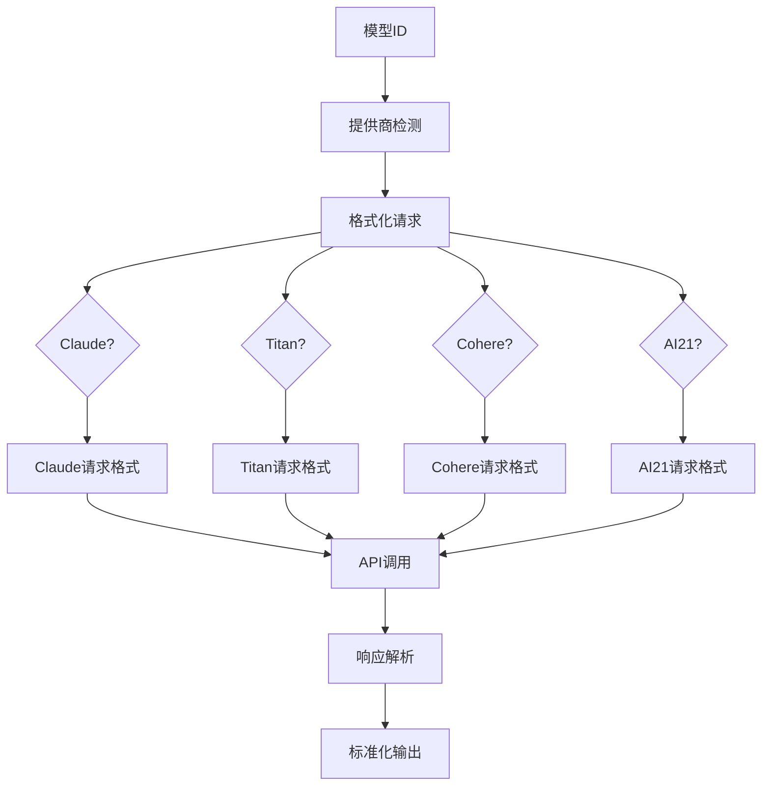

**图表来源**
- [bedrock_client.py](file://api/bedrock_client.py#L128-L220)

**章节来源**
- [bedrock_client.py](file://api/bedrock_client.py#L1-L318)

### OpenRouterClient - 统一模型市场

OpenRouterClient提供对数百个AI模型的统一访问，作为模型市场的中间层。

#### 异步处理
- **流式生成**：支持实时的流式响应
- **XML解析**：特殊处理XML格式的响应
- **错误处理**：完善的异常捕获和错误返回

#### 模型市场特性
- **模型发现**：自动发现和访问新的AI模型
- **价格透明**：显示不同模型的价格差异
- **负载均衡**：在多个提供商间分配请求

**章节来源**
- [openrouter_client.py](file://api/openrouter_client.py#L1-L526)

### OllamaPatch - 本地模型支持

OllamaPatch提供了对本地Ollama模型的特殊支持，解决了批量处理的限制。

#### 模型检查
- **可用性验证**：启动时检查模型是否存在
- **动态加载**：运行时动态验证模型状态
- **错误提示**：清晰的错误信息指导用户

#### 文档处理器
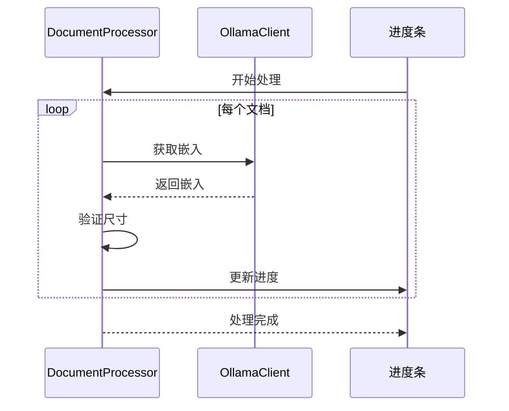

**图表来源**
- [ollama_patch.py](file://api/ollama_patch.py#L62-L105)

**章节来源**
- [ollama_patch.py](file://api/ollama_patch.py#L1-L105)

## 统一接口设计

### ModelClient接口规范

所有AI客户端都遵循统一的ModelClient接口，确保了系统的可扩展性和一致性：

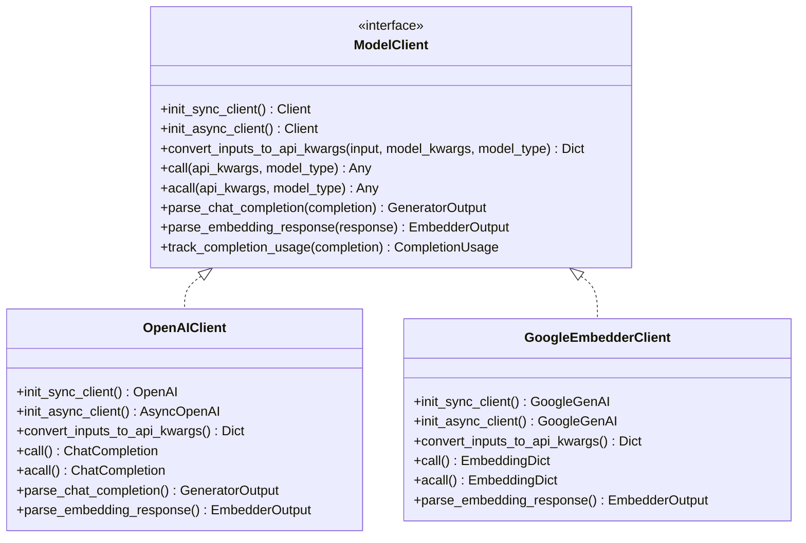

**图表来源**
- [openai_client.py](file://api/openai_client.py#L120-L140)
- [google_embedder_client.py](file://api/google_embedder_client.py#L20-L40)

### 输入转换机制

每个客户端都有独特的convert_inputs_to_api_kwargs方法，负责将标准输入转换为特定提供商的API格式：

| 客户端 | 输入类型 | 转换特点 |
|--------|----------|----------|
| OpenAIClient | 文本/消息 | 支持多模态输入，系统提示符处理 |
| GoogleEmbedderClient | 文本列表 | 自动批量处理，任务类型配置 |
| AzureAIClient | 文本 | 系统提示符格式化 |
| DashscopeClient | 文档/文本 | 文本提取，工作空间ID注入 |
| BedrockClient | 文本 | 提供商特定格式转换 |
| OpenRouterClient | 文本/消息 | OpenAI兼容格式 |

**章节来源**
- [openai_client.py](file://api/openai_client.py#L270-L380)
- [google_embedder_client.py](file://api/google_embedder_client.py#L141-L185)
- [azureai_client.py](file://api/azureai_client.py#L348-L397)

## 配置管理

### 配置文件结构

系统通过JSON配置文件管理不同提供商的设置：

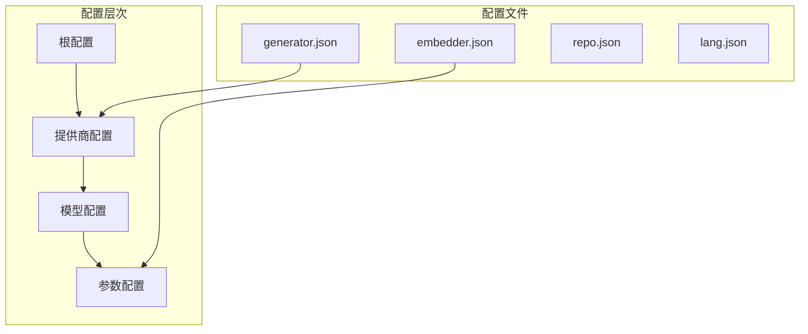

**图表来源**
- [generator.json](file://api/config/generator.json#L1-L200)
- [embedder.json](file://api/config/embedder.json#L1-L34)

### 环境变量管理

系统支持灵活的环境变量配置：

| 变量名 | 用途 | 默认值 |
|--------|------|--------|
| OPENAI_API_KEY | OpenAI API密钥 | 无 |
| GOOGLE_API_KEY | Google AI API密钥 | 无 |
| OPENROUTER_API_KEY | OpenRouter API密钥 | 无 |
| AWS_ACCESS_KEY_ID | AWS访问密钥 | 无 |
| AWS_SECRET_ACCESS_KEY | AWS秘密密钥 | 无 |
| AWS_REGION | AWS区域 | us-east-1 |
| DEEPWIKI_EMBEDDER_TYPE | 嵌入器类型 | openai |

**章节来源**
- [config.py](file://api/config.py#L18-L41)

### 动态配置加载

配置系统支持运行时动态加载和环境变量替换：

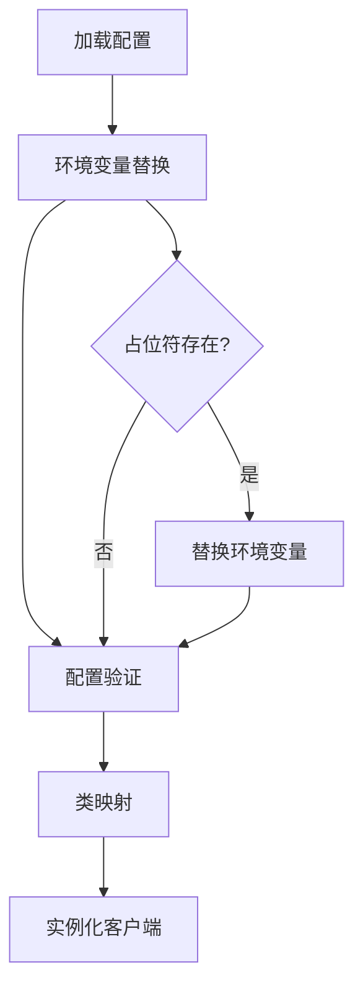

**图表来源**
- [config.py](file://api/config.py#L66-L95)

**章节来源**
- [config.py](file://api/config.py#L1-L388)

## 错误处理与重试机制

### Backoff重试策略

所有客户端都使用backoff库实现指数退避重试：

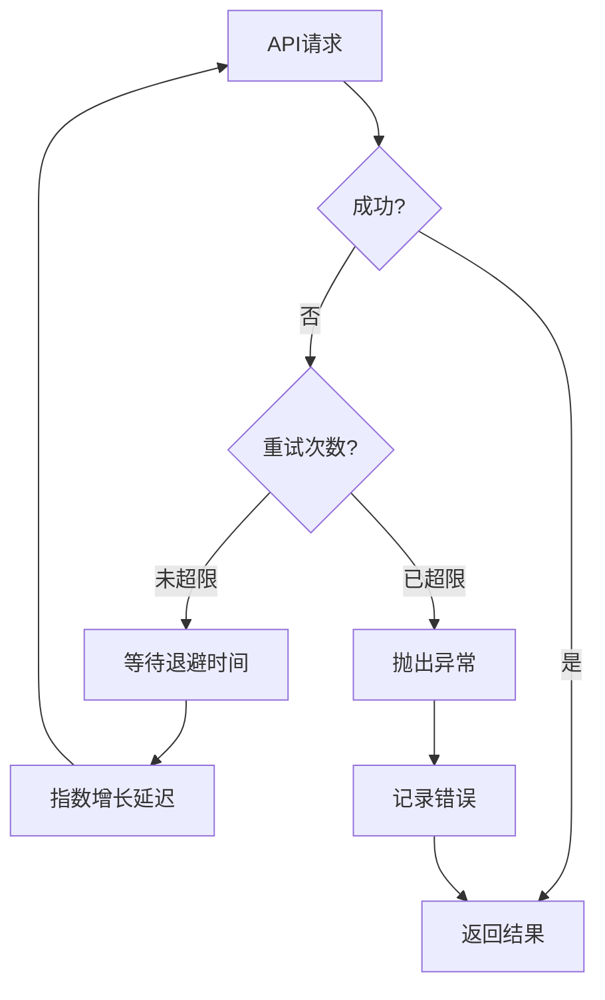

**图表来源**
- [openai_client.py](file://api/openai_client.py#L400-L410)
- [azureai_client.py](file://api/azureai_client.py#L399-L409)

### 异常类型处理

不同客户端处理特定的异常类型：

| 客户端 | 主要异常 | 处理策略 |
|--------|----------|----------|
| OpenAIClient | RateLimitError, APITimeoutError | 指数退避重试 |
| GoogleEmbedderClient | Exception | 基础异常处理 |
| AzureAIClient | 同OpenAI | 统一异常处理 |
| DashscopeClient | 同OpenAI | 统一异常处理 |
| BedrockClient | botocore.exceptions | AWS特定错误处理 |
| OpenRouterClient | RequestException | HTTP异常处理 |

**章节来源**
- [openai_client.py](file://api/openai_client.py#L400-L410)
- [bedrock_client.py](file://api/bedrock_client.py#L221-L225)

## 最佳实践

### API密钥管理

1. **环境变量优先**：始终使用环境变量存储API密钥
2. **最小权限原则**：为每个服务分配最小必要的权限
3. **定期轮换**：定期更换API密钥以提高安全性
4. **监控使用**：监控API使用情况，及时发现异常

### 性能优化

1. **连接池复用**：利用HTTP连接池减少连接开销
2. **批量处理**：合理使用批量API减少调用次数
3. **缓存策略**：实现智能缓存减少重复请求
4. **异步处理**：在高并发场景下使用异步调用

### 错误处理

1. **优雅降级**：在服务不可用时提供备选方案
2. **详细日志**：记录详细的错误信息便于调试
3. **用户友好**：向用户提供清晰的错误提示
4. **监控告警**：建立完善的监控和告警机制

### 配置管理

1. **版本控制**：将配置文件纳入版本控制系统
2. **环境隔离**：不同环境使用不同的配置
3. **默认值**：为所有配置项提供合理的默认值
4. **文档维护**：及时更新配置文档

## 故障排除指南

### 常见问题及解决方案

#### API密钥相关问题

**问题**：`ValueError: Environment variable XXX_API_KEY must be set`
**解决方案**：
1. 检查环境变量是否正确设置
2. 验证API密钥的有效性
3. 确认密钥具有相应的权限

#### 网络连接问题

**问题**：连接超时或网络不可达
**解决方案**：
1. 检查网络连接状态
2. 验证防火墙设置
3. 确认API端点的可达性

#### 模型可用性问题

**问题**：指定的模型不存在或不可用
**解决方案**：
1. 检查模型名称拼写
2. 验证模型在当前账户下的可用性
3. 使用备用模型

#### 批量处理问题

**问题**：大批量请求失败
**解决方案**：
1. 减少批量大小
2. 实现分批处理逻辑
3. 添加适当的错误处理

### 调试技巧

1. **启用详细日志**：设置日志级别为DEBUG获取更多信息
2. **检查网络请求**：使用网络抓包工具分析请求和响应
3. **验证配置**：确认配置文件中的各项设置正确无误
4. **测试独立功能**：单独测试各个组件的功能

**章节来源**
- [openai_client.py](file://api/openai_client.py#L190-L204)
- [google_embedder_client.py](file://api/google_embedder_client.py#L69-L76)

## 总结

deepwiki-open的AI提供商客户端集成系统展现了现代软件架构的最佳实践：

### 技术亮点

1. **统一接口设计**：通过ModelClient基类实现了标准化的接口规范
2. **插件化架构**：支持多种AI提供商的无缝集成和切换
3. **错误处理机制**：完善的重试策略和异常处理
4. **配置管理**：灵活的配置系统支持动态调整

### 架构优势

1. **可扩展性**：新增AI提供商只需实现ModelClient接口
2. **可维护性**：清晰的职责分离和模块化设计
3. **可靠性**：多重错误处理和监控机制
4. **灵活性**：支持多种认证方式和配置选项

### 应用价值

该系统为构建企业级AI应用提供了坚实的基础，支持从开发测试到生产部署的全生命周期需求。通过标准化的接口设计和灵活的配置管理，开发者可以专注于业务逻辑的实现，而无需关心底层AI服务的具体细节。

这种架构设计不仅提高了开发效率，还确保了系统的稳定性和可维护性，为企业级AI应用的规模化部署奠定了坚实基础。