# Azure AI客户端

<cite>
**本文档中引用的文件**
- [azureai_client.py](file://api/azureai_client.py)
- [config.py](file://api/config.py)
- [simple_chat.py](file://api/simple_chat.py)
- [websocket_wiki.py](file://api/websocket_wiki.py)
- [main.py](file://api/main.py)
- [generator.json](file://api/config/generator.json)
- [embedder.json](file://api/config/embedder.json)
</cite>

## 目录
1. [简介](#简介)
2. [项目结构](#项目结构)
3. [核心组件](#核心组件)
4. [架构概览](#架构概览)
5. [详细组件分析](#详细组件分析)
6. [依赖关系分析](#依赖关系分析)
7. [性能考虑](#性能考虑)
8. [故障排除指南](#故障排除指南)
9. [结论](#结论)

## 简介

Azure AI客户端是deepwiki-open项目中用于与Azure OpenAI服务API进行交互的核心组件。该客户端封装了Azure OpenAI的各种功能，包括嵌入向量生成和聊天补全请求，支持两种认证方式：API密钥认证和Azure AD令牌认证。通过统一的接口设计，开发者可以轻松地在应用程序中集成Azure托管的OpenAI模型。

## 项目结构

Azure AI客户端位于项目的API模块中，采用模块化设计，便于维护和扩展：

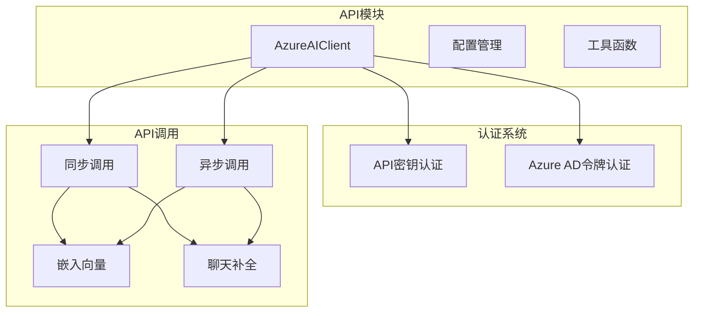

**图表来源**
- [azureai_client.py](file://api/azureai_client.py#L118-L488)

**章节来源**
- [azureai_client.py](file://api/azureai_client.py#L1-L50)

## 核心组件

### AzureAIClient类

AzureAIClient是整个Azure AI客户端的核心类，继承自ModelClient基类，提供了与Azure OpenAI服务交互的完整功能集。

#### 主要特性

1. **双重认证支持**：同时支持API密钥和Azure AD令牌认证
2. **同步异步调用**：提供同步和异步两种API调用方式
3. **消息格式转换**：自动将标准输入转换为Azure兼容的消息格式
4. **错误处理**：内置重试机制和异常处理
5. **流式响应**：支持流式聊天补全响应

#### 认证方式

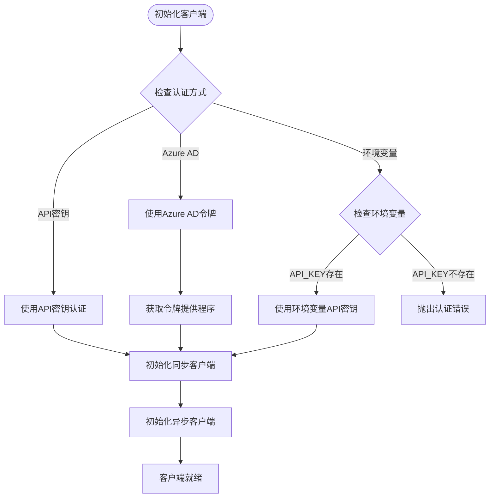

**图表来源**
- [azureai_client.py](file://api/azureai_client.py#L233-L289)

**章节来源**
- [azureai_client.py](file://api/azureai_client.py#L118-L289)

## 架构概览

Azure AI客户端采用分层架构设计，确保了代码的可维护性和扩展性：

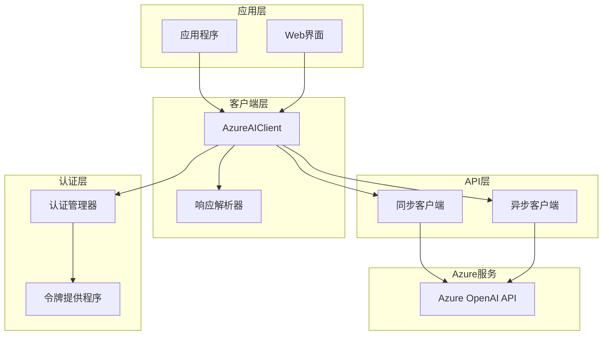

**图表来源**
- [azureai_client.py](file://api/azureai_client.py#L118-L150)

## 详细组件分析

### 初始化与认证

#### API密钥认证

当使用API密钥认证时，客户端会优先从构造函数参数或环境变量中获取认证信息：

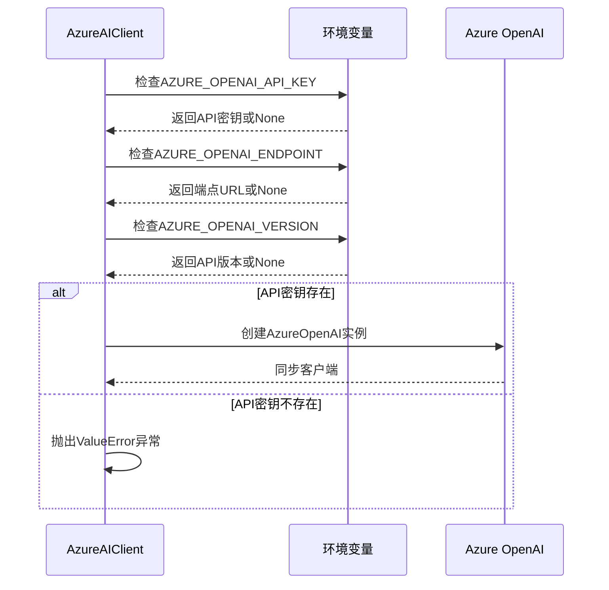

**图表来源**
- [azureai_client.py](file://api/azureai_client.py#L233-L261)

#### Azure AD令牌认证

Azure AD认证通过DefaultAzureCredential自动获取令牌：

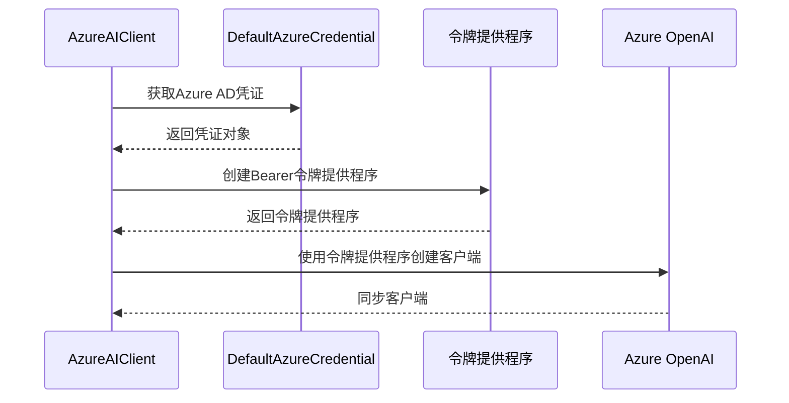

**图表来源**
- [azureai_client.py](file://api/azureai_client.py#L248-L256)

**章节来源**
- [azureai_client.py](file://api/azureai_client.py#L233-L289)

### 输入转换机制

convert_inputs_to_api_kwargs方法负责将标准输入转换为Azure兼容的消息格式：

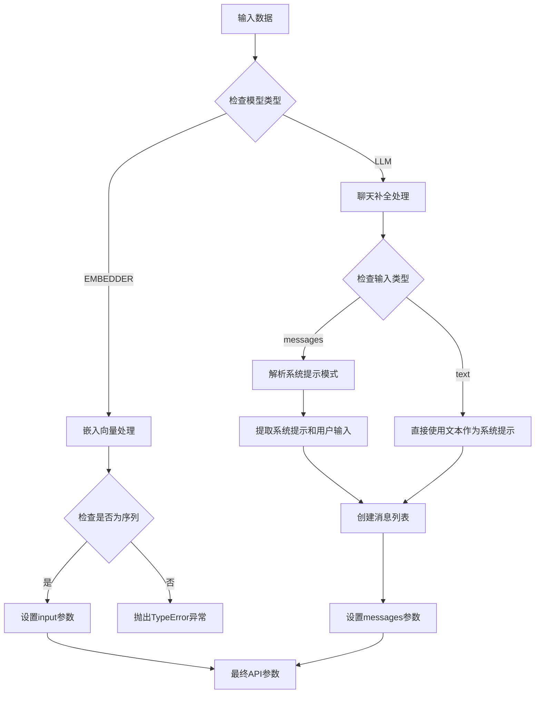

**图表来源**
- [azureai_client.py](file://api/azureai_client.py#L348-L397)

#### 消息格式转换详解

对于聊天补全请求，客户端支持两种输入格式：

1. **文本格式**：直接将输入作为系统提示
2. **消息格式**：支持复杂的系统提示和用户输入分离

**章节来源**
- [azureai_client.py](file://api/azureai_client.py#L348-L397)

### API调用处理

#### 同步调用流程

call方法处理同步API调用，支持嵌入向量和聊天补全：

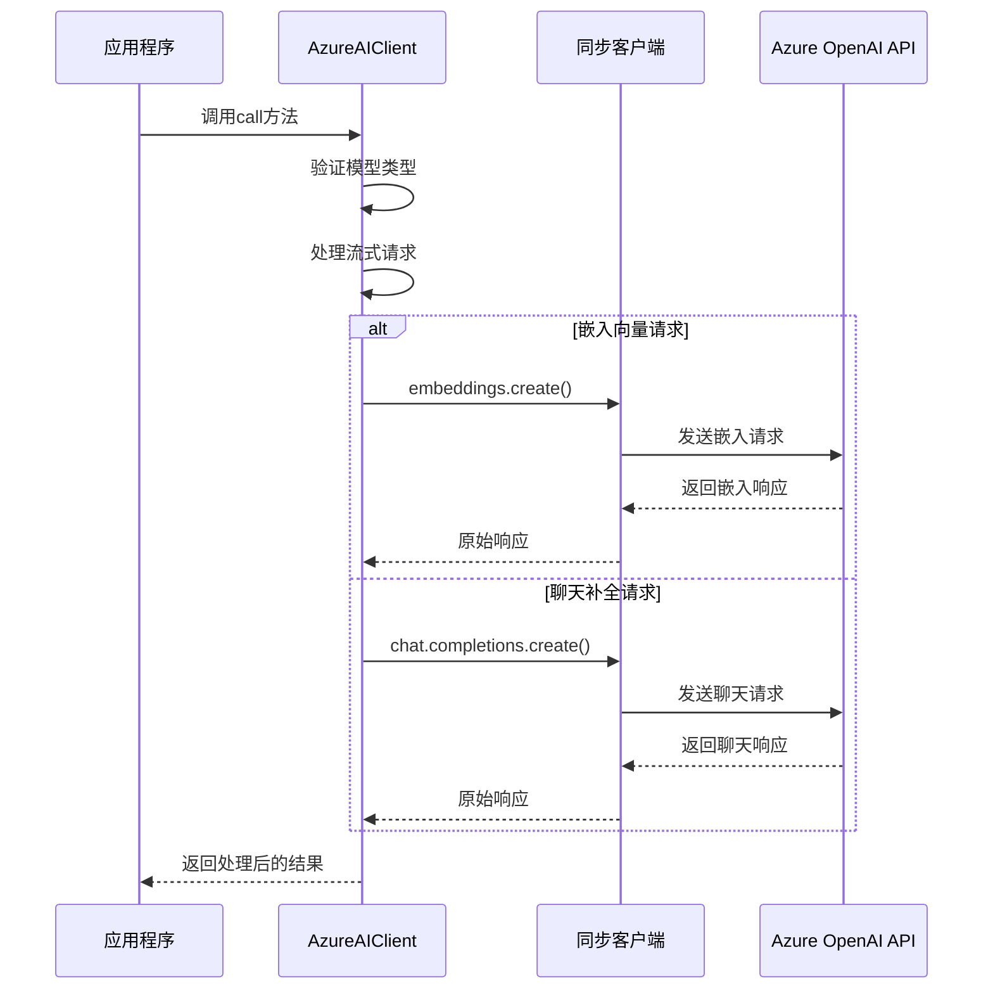

**图表来源**
- [azureai_client.py](file://api/azureai_client.py#L409-L425)

#### 异步调用流程

acall方法处理异步API调用，提供非阻塞的并发能力：

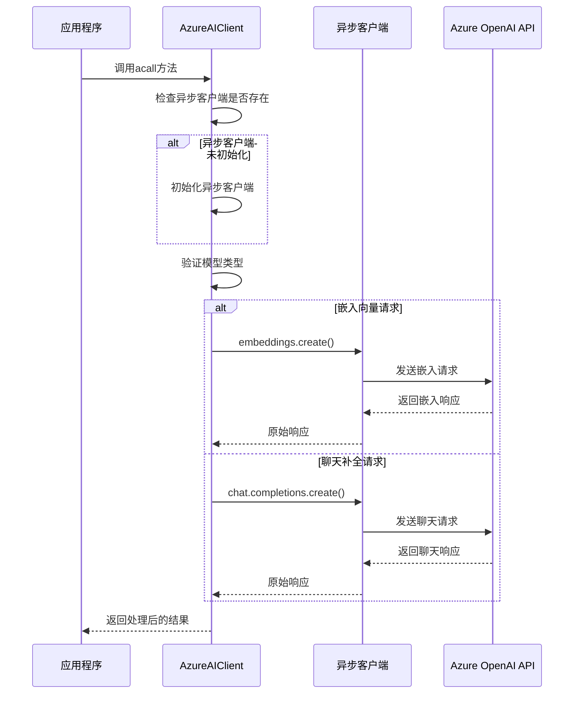

**图表来源**
- [azureai_client.py](file://api/azureai_client.py#L436-L450)

**章节来源**
- [azureai_client.py](file://api/azureai_client.py#L409-L450)

### 流式响应处理

客户端支持流式聊天补全响应，提供实时的用户体验：

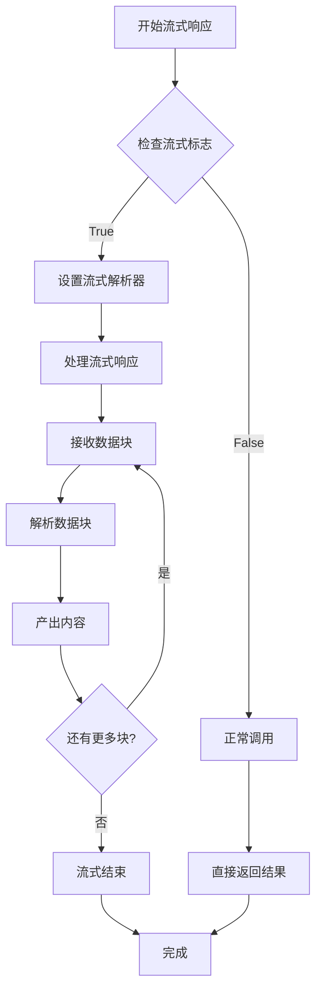

**图表来源**
- [azureai_client.py](file://api/azureai_client.py#L90-L96)

**章节来源**
- [azureai_client.py](file://api/azureai_client.py#L90-L96)

### 错误处理与重试机制

客户端内置了强大的错误处理和重试机制：

| 异常类型 | 重试策略 | 最大重试时间 |
|---------|---------|-------------|
| APITimeoutError | 指数退避 | 5秒 |
| InternalServerError | 指数退避 | 5秒 |
| RateLimitError | 指数退避 | 5秒 |
| UnprocessableEntityError | 指数退避 | 5秒 |
| BadRequestError | 指数退避 | 5秒 |

**章节来源**
- [azureai_client.py](file://api/azureai_client.py#L399-L408)

## 依赖关系分析

### 外部依赖

Azure AI客户端依赖以下外部库：

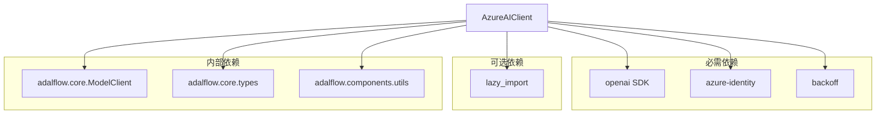

**图表来源**
- [azureai_client.py](file://api/azureai_client.py#L22-L66)

### 内部集成

客户端与deepwiki-open项目的其他组件紧密集成：

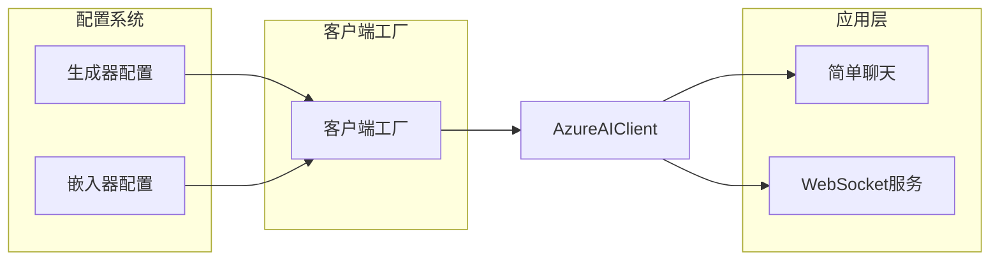

**图表来源**
- [config.py](file://api/config.py#L120-L145)
- [simple_chat.py](file://api/simple_chat.py#L500-L516)

**章节来源**
- [azureai_client.py](file://api/azureai_client.py#L22-L66)
- [config.py](file://api/config.py#L120-L145)

## 性能考虑

### 并发处理

Azure AI客户端支持异步操作，能够有效处理高并发请求：

- **异步客户端**：按需初始化，避免不必要的资源消耗
- **连接池**：利用OpenAI SDK的连接池机制
- **流式处理**：减少内存占用，提高响应速度

### 缓存策略

虽然当前实现没有内置缓存，但可以通过以下方式优化性能：

1. **请求去重**：在应用层实现请求去重逻辑
2. **响应缓存**：对相同输入的结果进行缓存
3. **预热机制**：预先初始化常用模型

### 资源管理

- **客户端复用**：推荐在应用中复用AzureAIClient实例
- **连接关闭**：确保及时释放网络连接
- **内存管理**：合理控制流式响应的缓冲区大小

## 故障排除指南

### 常见问题及解决方案

#### 认证失败

**问题描述**：客户端无法通过身份验证

**可能原因**：
1. 环境变量未正确设置
2. API密钥无效
3. Azure AD权限不足

**解决方案**：
```bash
# 检查环境变量
echo $AZURE_OPENAI_API_KEY
echo $AZURE_OPENAI_ENDPOINT
echo $AZURE_OPENAI_VERSION

# 验证API密钥有效性
curl -X GET "$AZURE_OPENAI_ENDPOINT/openai/deployments" \
  -H "api-key: $AZURE_OPENAI_API_KEY" \
  -H "Content-Type: application/json"
```

#### 端点配置错误

**问题描述**：无法连接到Azure OpenAI服务

**诊断步骤**：
1. 验证端点URL格式
2. 检查网络连接
3. 确认API版本兼容性

#### 流式响应问题

**问题描述**：流式响应中断或不完整

**调试方法**：
```python
# 启用详细日志
import logging
logging.getLogger('api.azureai_client').setLevel(logging.DEBUG)

# 检查响应解析
response = client.call(api_kwargs=api_kwargs, model_type=ModelType.LLM)
for chunk in response:
    print(f"Received chunk: {chunk}")
```

**章节来源**
- [azureai_client.py](file://api/azureai_client.py#L141-L151)

### 环境变量配置

完整的环境变量配置指南：

| 变量名 | 描述 | 示例值 | 必需 |
|-------|------|--------|------|
| AZURE_OPENAI_API_KEY | Azure OpenAI API密钥 | sk-xxx | 是 |
| AZURE_OPENAI_ENDPOINT | Azure OpenAI服务端点 | https://your-resource.openai.azure.com/ | 是 |
| AZURE_OPENAI_VERSION | API版本 | 2023-05-15 | 是 |

### 配置最佳实践

1. **安全存储**：使用环境变量或密钥管理服务存储敏感信息
2. **版本兼容**：选择稳定的API版本，避免频繁升级
3. **监控告警**：设置错误率和响应时间监控
4. **降级策略**：实现多提供商的降级机制

**章节来源**
- [azureai_client.py](file://api/azureai_client.py#L141-L151)

## 结论

Azure AI客户端为deepwiki-open项目提供了强大而灵活的Azure OpenAI服务集成能力。通过支持多种认证方式、提供同步异步调用选项、实现智能输入转换和完善的错误处理机制，该客户端能够满足各种应用场景的需求。

### 主要优势

1. **易用性**：简洁的API设计，降低学习成本
2. **灵活性**：支持多种认证方式和配置选项
3. **可靠性**：内置重试机制和错误处理
4. **性能**：支持异步操作和流式响应
5. **可扩展性**：模块化设计，便于功能扩展

### 未来发展方向

1. **缓存机制**：实现智能缓存以提高性能
2. **监控集成**：添加详细的性能指标和监控
3. **配置管理**：提供更灵活的配置管理方案
4. **测试覆盖**：增加单元测试和集成测试覆盖率

通过持续的优化和改进，Azure AI客户端将继续为deepwiki-open项目提供稳定可靠的Azure OpenAI服务集成能力。