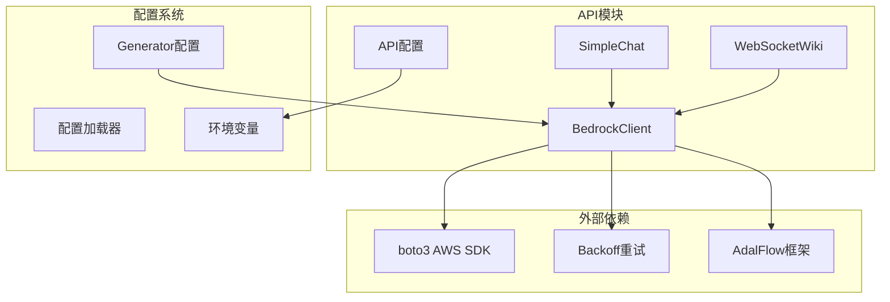
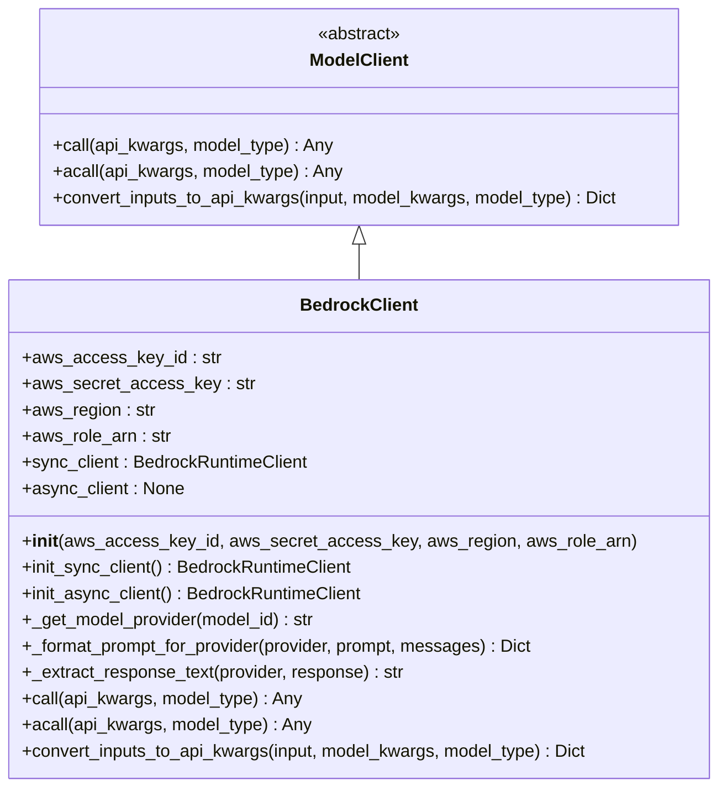
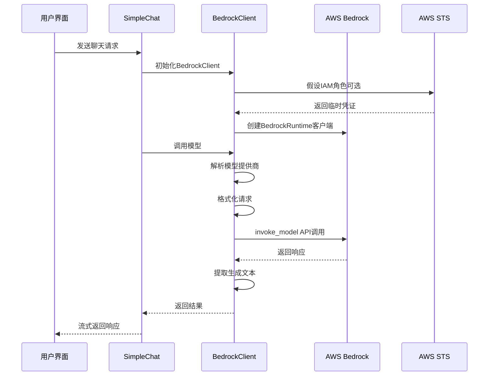
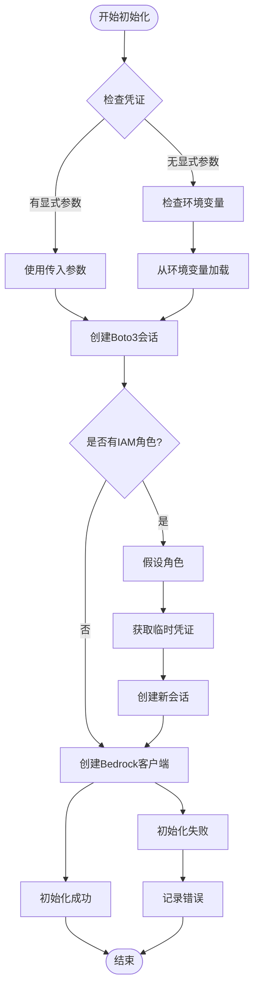
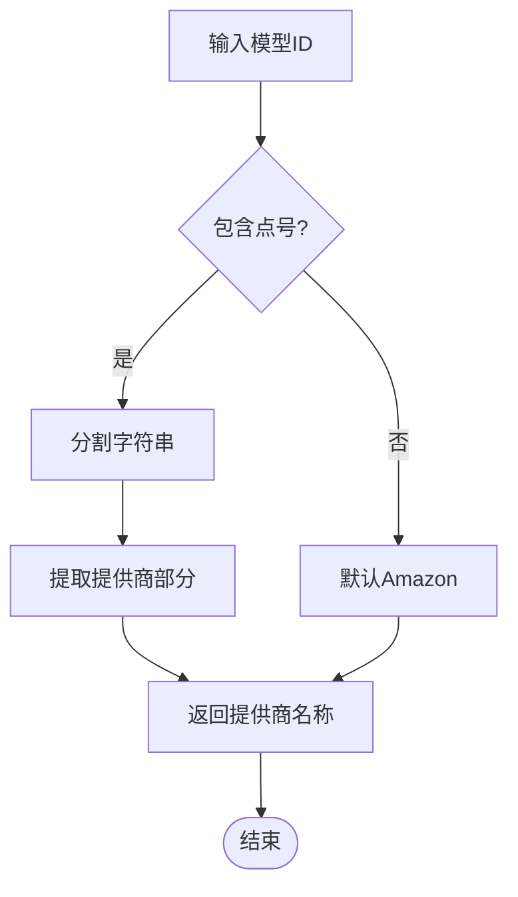
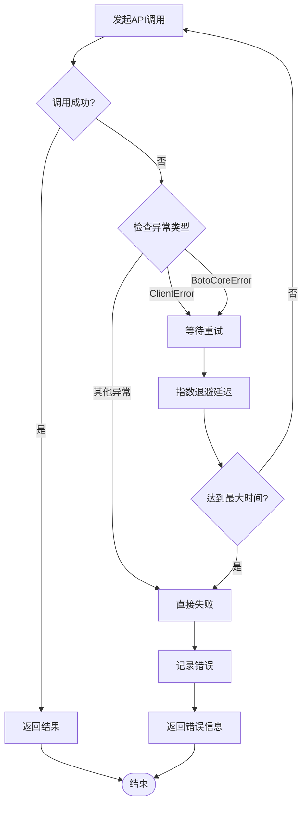

# Bedrock客户端集成文档

<cite>
**本文档引用的文件**
- [bedrock_client.py](file://api/bedrock_client.py)
- [config.py](file://api/config.py)
- [generator.json](file://api/config/generator.json)
- [simple_chat.py](file://api/simple_chat.py)
- [logging_config.py](file://api/logging_config.py)
- [api.py](file://api/api.py)
- [websocket_wiki.py](file://api/websocket_wiki.py)
</cite>

## 目录
1. [简介](#简介)
2. [项目结构概览](#项目结构概览)
3. [核心组件分析](#核心组件分析)
4. [架构概览](#架构概览)
5. [详细组件分析](#详细组件分析)
6. [认证机制详解](#认证机制详解)
7. [请求格式化与响应处理](#请求格式化与响应处理)
8. [配置指南](#配置指南)
9. [使用示例](#使用示例)
10. [故障排除](#故障排除)
11. [总结](#总结)

## 简介

AWS Bedrock客户端是deepwiki-open项目中的核心组件，作为AWS Bedrock服务的统一接口，支持多种基础模型提供商，包括Anthropic Claude、Amazon Titan、Cohere Command等。该客户端实现了标准化的模型调用接口，为deepwiki-open提供了强大的语言模型能力。

BedrockClient类继承自`adalflow.core.model_client.ModelClient`，提供了同步和异步的模型调用功能，支持多种认证方式，并能够自动处理不同提供商的请求格式和响应解析。

## 项目结构概览

deepwiki-open项目采用模块化架构，Bedrock客户端作为独立的API模块存在：



**图表来源**
- [bedrock_client.py](file://api/bedrock_client.py#L1-L318)
- [config.py](file://api/config.py#L1-L388)

**章节来源**
- [bedrock_client.py](file://api/bedrock_client.py#L1-L318)
- [config.py](file://api/config.py#L1-L388)

## 核心组件分析

BedrockClient类是整个系统的核心，具有以下关键特性：

### 主要功能模块

1. **认证管理**：支持访问密钥、IAM角色等多种认证方式
2. **模型抽象**：统一处理不同提供商的模型调用
3. **请求格式化**：根据提供商要求格式化请求参数
4. **响应解析**：提取和标准化不同提供商的响应结果
5. **错误处理**：集成重试机制和异常处理

### 类层次结构



**图表来源**
- [bedrock_client.py](file://api/bedrock_client.py#L20-L318)

**章节来源**
- [bedrock_client.py](file://api/bedrock_client.py#L20-L318)

## 架构概览

Bedrock客户端在整个deepwiki-open系统中扮演着重要角色，作为多模型提供商的统一入口：



**图表来源**
- [bedrock_client.py](file://api/bedrock_client.py#L38-L104)
- [simple_chat.py](file://api/simple_chat.py#L397-L411)

## 详细组件分析

### 认证初始化流程

BedrockClient的初始化过程包含多个认证选项：



**图表来源**
- [bedrock_client.py](file://api/bedrock_client.py#L38-L104)

### 模型提供商识别

客户端通过模型ID自动识别提供商：



**图表来源**
- [bedrock_client.py](file://api/bedrock_client.py#L115-L126)

**章节来源**
- [bedrock_client.py](file://api/bedrock_client.py#L38-L104)
- [bedrock_client.py](file://api/bedrock_client.py#L115-L126)

## 认证机制详解

### 多种认证方式

BedrockClient支持三种主要的认证方式：

#### 1. 访问密钥认证
通过AWS_ACCESS_KEY_ID和AWS_SECRET_ACCESS_KEY进行直接认证：
- 支持显式参数传递
- 自动从环境变量加载
- 默认区域设置为us-east-1

#### 2. IAM角色认证
通过AWS_ROLE_ARN指定IAM角色进行身份切换：
- 使用AWS Security Token Service (STS)
- 获取临时安全凭证
- 支持跨账户访问

#### 3. 环境变量优先级
认证参数按以下优先级确定：
1. 显式传递的参数
2. 环境变量AWS_ACCESS_KEY_ID
3. 环境变量AWS_SECRET_ACCESS_KEY
4. 环境变量AWS_REGION
5. 环境变量AWS_ROLE_ARN

### 认证配置表

| 参数名称 | 描述 | 默认值 | 环境变量 |
|---------|------|--------|----------|
| aws_access_key_id | AWS访问密钥ID | 从环境变量读取 | AWS_ACCESS_KEY_ID |
| aws_secret_access_key | AWS秘密访问密钥 | 从环境变量读取 | AWS_SECRET_ACCESS_KEY |
| aws_region | AWS区域 | us-east-1 | AWS_REGION |
| aws_role_arn | IAM角色ARN | 从环境变量读取 | AWS_ROLE_ARN |

**章节来源**
- [bedrock_client.py](file://api/bedrock_client.py#L38-L61)
- [config.py](file://api/config.py#L19-L41)

## 请求格式化与响应处理

### 动态请求格式化

_bedrock_client方法根据不同的模型提供商格式化请求：

#### Anthropic Claude格式
```json
{
  "anthropic_version": "bedrock-2023-05-31",
  "messages": [
    {
      "role": "user",
      "content": [
        {
          "type": "text",
          "text": "用户消息内容"
        }
      ]
    }
  ],
  "max_tokens": 4096,
  "temperature": 0.7,
  "top_p": 0.8
}
```

#### Amazon Titan格式
```json
{
  "inputText": "提示文本",
  "textGenerationConfig": {
    "maxTokenCount": 4096,
    "stopSequences": [],
    "temperature": 0.7,
    "topP": 0.8
  }
}
```

#### 其他提供商格式
- **Cohere**: 使用`prompt`字段和`temperature`参数
- **AI21**: 使用`prompt`字段和`maxTokens`参数
- **默认格式**: 简单的`{"prompt": "..."}`结构

### 响应解析机制

_extract_response_text方法根据不同提供商提取生成文本：

| 提供商 | 响应键路径 | 示例值 |
|--------|------------|--------|
| Anthropic | response["content"][0]["text"] | "生成的文本内容" |
| Amazon | response["results"][0]["outputText"] | "生成的文本内容" |
| Cohere | response["generations"][0]["text"] | "生成的文本内容" |
| AI21 | response["completions"][0]["data"]["text"] | "生成的文本内容" |

### 错误处理与重试

客户端集成了backoff重试机制，支持指数退避策略：



**图表来源**
- [bedrock_client.py](file://api/bedrock_client.py#L221-L288)

**章节来源**
- [bedrock_client.py](file://api/bedrock_client.py#L128-L219)
- [bedrock_client.py](file://api/bedrock_client.py#L221-L288)

## 配置指南

### 环境变量配置

在使用Bedrock客户端之前，需要正确配置以下环境变量：

#### 必需配置
```bash
# AWS认证凭据
export AWS_ACCESS_KEY_ID="your-access-key-id"
export AWS_SECRET_ACCESS_KEY="your-secret-access-key"

# AWS区域（可选，默认us-east-1）
export AWS_REGION="us-west-2"
```

#### 可选配置
```bash
# IAM角色ARN（用于跨账户访问）
export AWS_ROLE_ARN="arn:aws:iam::123456789012:role/DeepWikiRole"

# 日志级别配置
export LOG_LEVEL="DEBUG"
export LOG_FILE_PATH="/var/log/deepwiki/bedrock.log"
```

### 配置文件设置

在generator.json配置文件中添加Bedrock配置：

```json
{
  "providers": {
    "bedrock": {
      "client_class": "BedrockClient",
      "default_model": "anthropic.claude-3-sonnet-20240229-v1:0",
      "supportsCustomModel": true,
      "models": {
        "anthropic.claude-3-sonnet-20240229-v1:0": {
          "temperature": 0.7,
          "top_p": 0.8
        },
        "anthropic.claude-3-haiku-20240307-v1:0": {
          "temperature": 0.7,
          "top_p": 0.8
        },
        "amazon.titan-text-express-v1": {
          "temperature": 0.7,
          "top_p": 0.8
        }
      }
    }
  }
}
```

### 权限配置

确保AWS IAM用户或角色具有以下权限：

```json
{
  "Version": "2012-10-17",
  "Statement": [
    {
      "Effect": "Allow",
      "Action": [
        "bedrock:InvokeModel",
        "bedrock:GetFoundationModel",
        "sts:AssumeRole"
      ],
      "Resource": "*"
    }
  ]
}
```

**章节来源**
- [config.py](file://api/config.py#L19-L41)
- [generator.json](file://api/config/generator.json#L143-L172)

## 使用示例

### 基本使用

```python
from api.bedrock_client import BedrockClient

# 初始化客户端
client = BedrockClient()

# 创建生成器
generator = adal.Generator(
    model_client=client,
    model_kwargs={"model": "anthropic.claude-3-sonnet-20240229-v1:0"}
)

# 同步调用
response = client.call(
    api_kwargs={
        "input": "解释什么是机器学习",
        "model": "anthropic.claude-3-sonnet-20240229-v1:0",
        "temperature": 0.7,
        "top_p": 0.8
    },
    model_type=ModelType.LLM
)

print(response)
```

### 在deepwiki-open中使用

在simple_chat.py中，Bedrock客户端被集成到聊天系统中：

```python
# 检查AWS凭证
if not AWS_ACCESS_KEY_ID or not AWS_SECRET_ACCESS_KEY:
    logger.warning("AWS凭证未配置，但继续执行请求")

# 初始化Bedrock客户端
model = BedrockClient()
model_kwargs = {
    "model": request.model,
    "temperature": model_config["temperature"],
    "top_p": model_config["top_p"]
}

# 调用模型
response = await model.acall(
    api_kwargs=api_kwargs, 
    model_type=ModelType.LLM
)
```

### 异步使用

```python
import asyncio
from api.bedrock_client import BedrockClient

async def main():
    client = BedrockClient()
    
    response = await client.acall(
        api_kwargs={
            "input": "写一首关于春天的诗",
            "model": "anthropic.claude-3-haiku-20240307-v1:0"
        },
        model_type=ModelType.LLM
    )
    
    print(response)

asyncio.run(main())
```

**章节来源**
- [bedrock_client.py](file://api/bedrock_client.py#L27-L35)
- [simple_chat.py](file://api/simple_chat.py#L397-L411)

## 故障排除

### 常见问题及解决方案

#### 1. 认证失败
**症状**: "AWS Bedrock client not initialized. Check your AWS credentials and region."

**解决方案**:
- 检查环境变量是否正确设置
- 验证AWS凭证的有效性
- 确认AWS区域配置正确

#### 2. 模型调用超时
**症状**: API调用过程中出现超时错误

**解决方案**:
- 检查网络连接
- 调整模型参数（减少max_tokens）
- 增加重试次数

#### 3. 权限不足
**症状**: "AccessDeniedException" 或类似权限错误

**解决方案**:
- 检查IAM策略配置
- 确认具有bedrock:InvokeModel权限
- 验证模型访问权限

#### 4. 请求格式错误
**症状**: 不同提供商的响应格式不一致

**解决方案**:
- 使用内置的格式化函数
- 检查模型ID格式
- 验证请求参数完整性

### 调试配置

启用详细日志记录以帮助诊断问题：

```bash
export LOG_LEVEL=DEBUG
export LOG_FILE_PATH=/tmp/deepwiki-bedrock-debug.log
```

### 性能优化建议

1. **连接复用**: 保持客户端实例复用
2. **批量处理**: 对于大量请求，考虑批量处理
3. **缓存策略**: 缓存频繁使用的模型响应
4. **监控指标**: 监控API调用成功率和延迟

**章节来源**
- [bedrock_client.py](file://api/bedrock_client.py#L230-L234)
- [logging_config.py](file://api/logging_config.py#L12-L86)

## 总结

AWS Bedrock客户端是deepwiki-open项目中不可或缺的组件，它提供了：

1. **统一的接口**: 支持多种模型提供商的统一调用接口
2. **灵活的认证**: 支持多种认证方式，适应不同部署场景
3. **智能的格式化**: 自动处理不同提供商的请求格式差异
4. **健壮的错误处理**: 集成重试机制和异常处理
5. **易于配置**: 通过环境变量和配置文件轻松设置

该客户端的设计充分体现了深度学习平台对多模型提供商支持的需求，为用户提供了一致且可靠的AI服务能力。通过合理的配置和使用，可以充分发挥AWS Bedrock的强大功能，为deepwiki-open项目提供优质的语言模型支持。