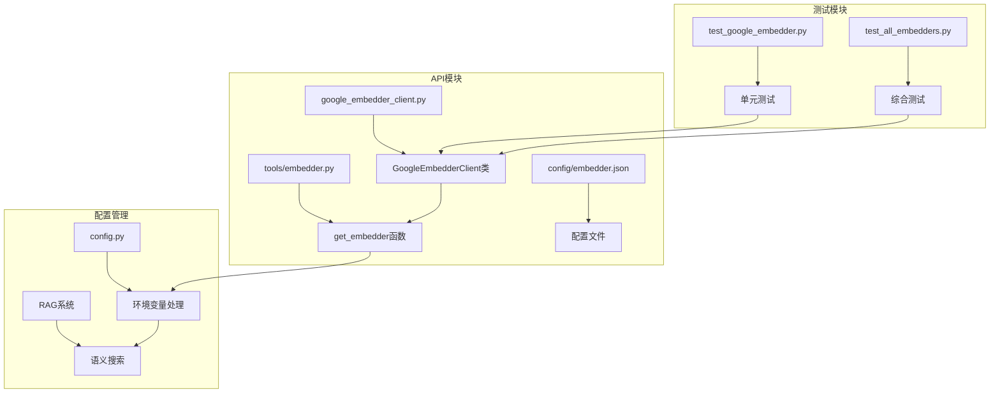
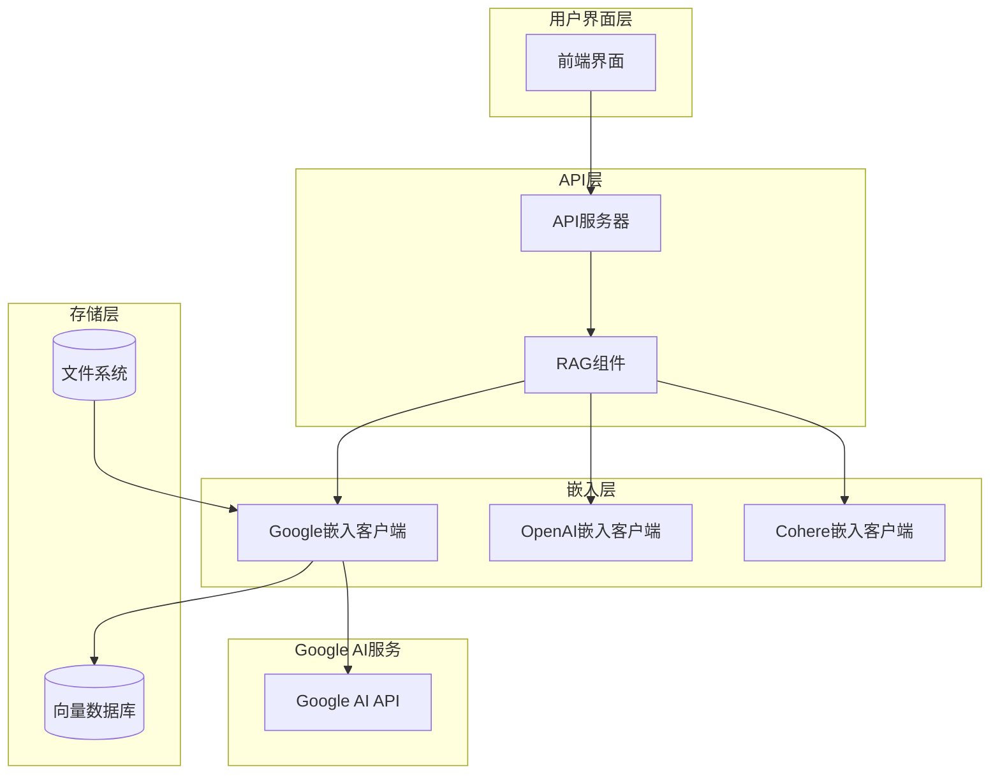
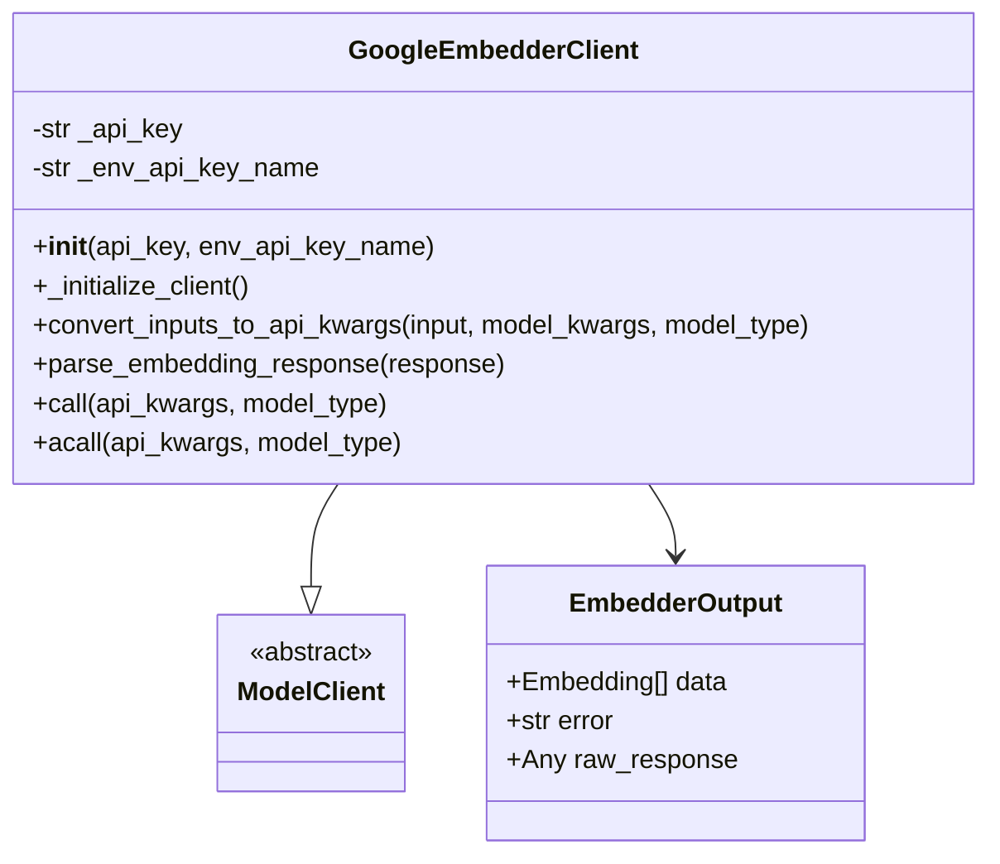
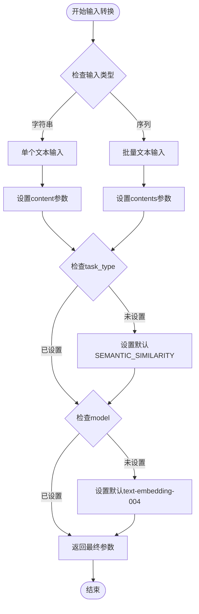
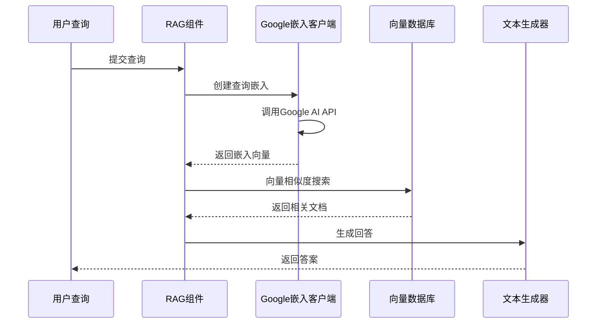
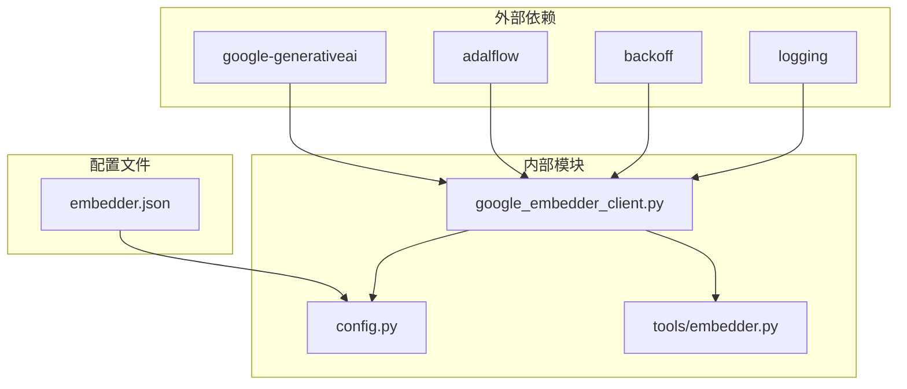

# Google嵌入客户端

<cite>
**本文档中引用的文件**
- [google_embedder_client.py](file://api/google_embedder_client.py)
- [embedder.py](file://api/tools/embedder.py)
- [embedder.json](file://api/config/embedder.json)
- [config.py](file://api/config.py)
- [rag.py](file://api/rag.py)
- [data_pipeline.py](file://api/data_pipeline.py)
- [test_google_embedder.py](file://tests/unit/test_google_embedder.py)
- [test_all_embedders.py](file://tests/unit/test_all_embedders.py)
</cite>

## 目录
1. [简介](#简介)
2. [项目结构](#项目结构)
3. [核心组件](#核心组件)
4. [架构概览](#架构概览)
5. [详细组件分析](#详细组件分析)
6. [依赖关系分析](#依赖关系分析)
7. [性能考虑](#性能考虑)
8. [故障排除指南](#故障排除指南)
9. [结论](#结论)

## 简介

Google嵌入客户端是deepwiki-open项目中的一个重要组件，专门用于集成Google AI的嵌入模型服务。该客户端封装了Google AI Embeddings API，提供了统一的接口来处理文本嵌入任务，支持语义搜索、文档检索和相似性计算等功能。

Google嵌入客户端主要支持以下模型：
- **text-embedding-004**：最新的高精度嵌入模型
- **embedding-001**：传统嵌入模型

该客户端与deepwiki-open的RAG（检索增强生成）系统深度集成，为语义搜索功能提供核心的向量表示能力。

## 项目结构

Google嵌入客户端在项目中的组织结构如下：



**图表来源**
- [google_embedder_client.py](file://api/google_embedder_client.py#L1-L231)
- [embedder.py](file://api/tools/embedder.py#L1-L55)
- [config.py](file://api/config.py#L1-L388)

**章节来源**
- [google_embedder_client.py](file://api/google_embedder_client.py#L1-L231)
- [embedder.py](file://api/tools/embedder.py#L1-L55)
- [embedder.json](file://api/config/embedder.json#L1-L34)

## 核心组件

Google嵌入客户端包含以下核心组件：

### GoogleEmbedderClient类
这是主要的客户端类，继承自`ModelClient`，负责：
- API密钥管理和认证
- 输入数据转换
- 响应解析和格式化
- 单次和批量嵌入调用

### 认证机制
- 支持通过环境变量`GOOGLE_API_KEY`进行认证
- 提供可选的直接API密钥参数
- 自动检测和使用环境变量

### 输入转换逻辑
- 将不同格式的输入标准化为Google AI API格式
- 处理单个和批量文本输入
- 设置默认模型参数和任务类型

### 响应解析
- 解析单个和批量嵌入响应
- 转换为标准的`EmbedderOutput`格式
- 处理各种错误情况和异常

**章节来源**
- [google_embedder_client.py](file://api/google_embedder_client.py#L20-L231)

## 架构概览

Google嵌入客户端在整个deepwiki-open系统中的架构位置：



**图表来源**
- [rag.py](file://api/rag.py#L153-L200)
- [google_embedder_client.py](file://api/google_embedder_client.py#L1-L50)

## 详细组件分析

### GoogleEmbedderClient类详细分析

#### 类定义和初始化



**图表来源**
- [google_embedder_client.py](file://api/google_embedder_client.py#L20-L231)

#### 认证机制实现

Google嵌入客户端采用灵活的认证机制：

1. **环境变量优先**：默认从`GOOGLE_API_KEY`环境变量读取API密钥
2. **参数覆盖**：允许通过构造函数参数提供API密钥
3. **自动验证**：初始化时验证API密钥的有效性

#### 输入转换逻辑

`convert_inputs_to_api_kwargs`方法实现了智能的输入转换：



**图表来源**
- [google_embedder_client.py](file://api/google_embedder_client.py#L141-L184)

#### 响应解析机制

`parse_embedding_response`方法处理多种响应格式：

```mermaid
flowchart TD
Start([开始响应解析]) --> CheckType{检查响应类型}
CheckType --> |字典| CheckKeys{检查键存在}
CheckType --> |对象| CheckEmbeddings{检查embeddings属性}
CheckType --> |其他| LogWarning[记录警告并返回空结果]
CheckKeys --> |embedding| CheckEmbeddingValue{检查值类型}
CheckKeys --> |embeddings| ProcessBatchFormat[处理批量格式]
CheckKeys --> |其他| LogWarning
CheckEmbeddingValue --> |列表[float]| ProcessSingle[处理单个嵌入]
CheckEmbeddingValue --> |其他| LogWarning
ProcessSingle --> CreateEmbedding[创建Embedding对象]
ProcessBatchFormat --> CreateBatchEmbeddings[创建批量Embedding对象]
CheckEmbeddings --> CreateBatchEmbeddings
CreateEmbedding --> CreateOutput[创建EmbedderOutput]
CreateBatchEmbeddings --> CreateOutput
LogWarning --> CreateOutput
CreateOutput --> End([返回结果])
```

**图表来源**
- [google_embedder_client.py](file://api/google_embedder_client.py#L78-L139)

**章节来源**
- [google_embedder_client.py](file://api/google_embedder_client.py#L53-L231)

### 配置系统集成

Google嵌入客户端与deepwiki-open的配置系统紧密集成：

#### 配置文件结构

| 配置项 | 默认值 | 描述 |
|--------|--------|------|
| client_class | GoogleEmbedderClient | 使用的客户端类 |
| batch_size | 100 | 批量处理大小 |
| model | text-embedding-004 | 默认模型名称 |
| task_type | SEMANTIC_SIMILARITY | 默认任务类型 |

#### 环境变量配置

| 环境变量 | 必需 | 描述 |
|----------|------|------|
| GOOGLE_API_KEY | 是 | Google AI API密钥 |
| DEEPWIKI_EMBEDDER_TYPE | 否 | 嵌入器类型（google） |

**章节来源**
- [embedder.json](file://api/config/embedder.json#L17-L23)
- [config.py](file://api/config.py#L19-L31)

### RAG系统集成

Google嵌入客户端在RAG系统中的作用：



**图表来源**
- [rag.py](file://api/rag.py#L153-L200)
- [google_embedder_client.py](file://api/google_embedder_client.py#L186-L231)

**章节来源**
- [rag.py](file://api/rag.py#L153-L200)

## 依赖关系分析

Google嵌入客户端的依赖关系图：



**图表来源**
- [google_embedder_client.py](file://api/google_embedder_client.py#L1-L16)
- [config.py](file://api/config.py#L10-L16)

**章节来源**
- [google_embedder_client.py](file://api/google_embedder_client.py#L1-L16)
- [config.py](file://api/config.py#L10-L16)

## 性能考虑

### 批量处理优化

Google嵌入客户端支持批量处理以提高效率：

- **批量大小**：默认100个文本块
- **内存管理**：合理控制批量大小避免内存溢出
- **并发处理**：利用`backoff`库实现指数退避重试

### 缓存策略

虽然当前实现没有内置缓存，但建议在应用层面实现：

- **查询缓存**：缓存常见查询的嵌入结果
- **文档缓存**：缓存文档嵌入避免重复计算
- **会话缓存**：在同一会话内复用嵌入结果

### 错误处理

实现了多层次的错误处理机制：

- **网络错误**：自动重试机制
- **API限制**：指数退避重试
- **数据格式错误**：优雅降级处理

## 故障排除指南

### 常见问题及解决方案

#### 1. API密钥问题

**问题**：`ValueError: Environment variable GOOGLE_API_KEY must be set`

**解决方案**：
- 检查环境变量是否正确设置
- 确认API密钥有效性和权限
- 验证网络连接

#### 2. 模型不可用

**问题**：Google AI API返回模型不可用错误

**解决方案**：
- 检查模型名称拼写
- 确认API配额充足
- 验证地区可用性

#### 3. 响应格式错误

**问题**：解析嵌入响应时出现格式错误

**解决方案**：
- 检查API版本兼容性
- 验证输入数据格式
- 查看日志获取详细错误信息

**章节来源**
- [google_embedder_client.py](file://api/google_embedder_client.py#L69-L76)
- [test_google_embedder.py](file://tests/unit/test_google_embedder.py#L23-L74)

### 测试和验证

提供了完整的测试套件来验证功能：

- **单元测试**：测试客户端核心功能
- **集成测试**：测试与RAG系统的集成
- **端到端测试**：测试完整的工作流程

**章节来源**
- [test_google_embedder.py](file://tests/unit/test_google_embedder.py#L1-L183)
- [test_all_embedders.py](file://tests/unit/test_all_embedders.py#L187-L214)

## 结论

Google嵌入客户端是deepwiki-open项目中的关键组件，它成功地封装了Google AI的嵌入服务，为整个系统提供了强大的语义搜索能力。该客户端具有以下优势：

1. **灵活性**：支持多种配置方式和输入格式
2. **可靠性**：完善的错误处理和重试机制
3. **性能**：优化的批量处理和并发控制
4. **集成性**：与RAG系统无缝集成

通过合理的配置和使用，Google嵌入客户端能够显著提升deepwiki-open项目的语义搜索效果，为用户提供更准确、更相关的知识检索体验。

未来的改进方向包括：
- 添加本地缓存机制
- 实现更智能的批量处理策略
- 增强错误恢复能力
- 提供更多的配置选项