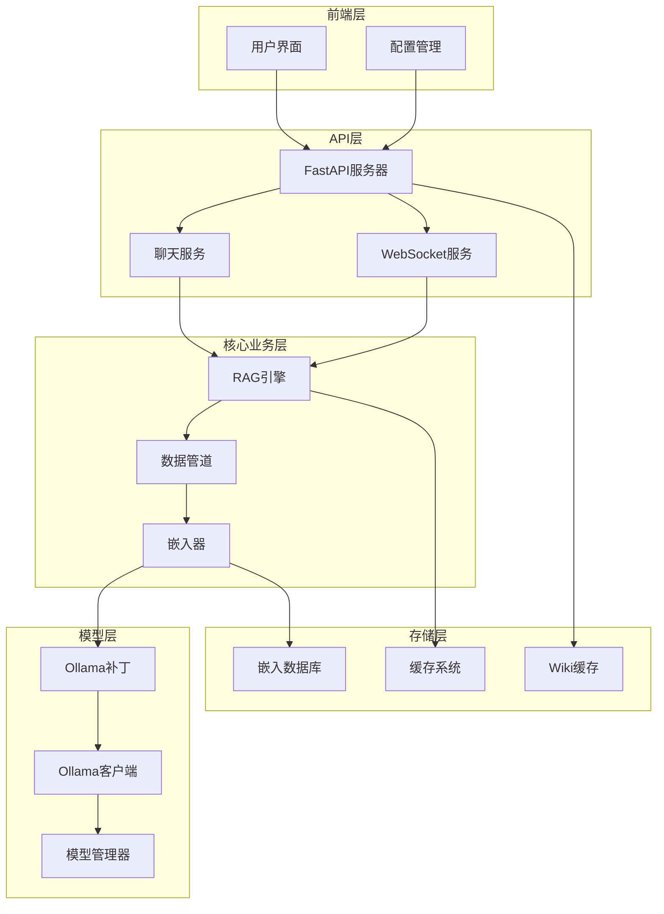
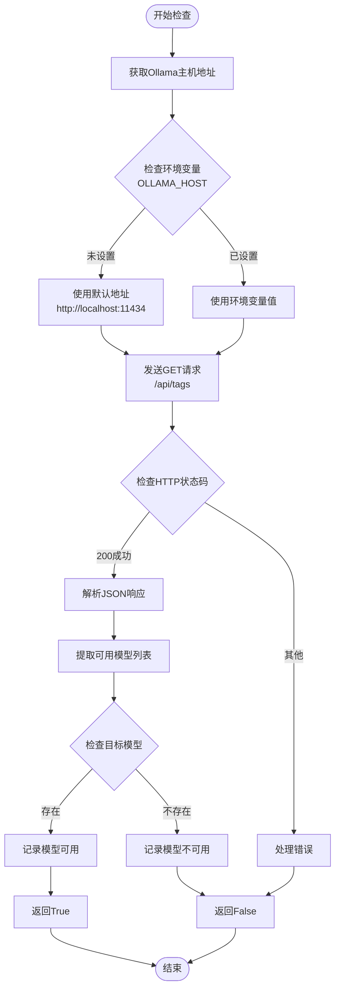
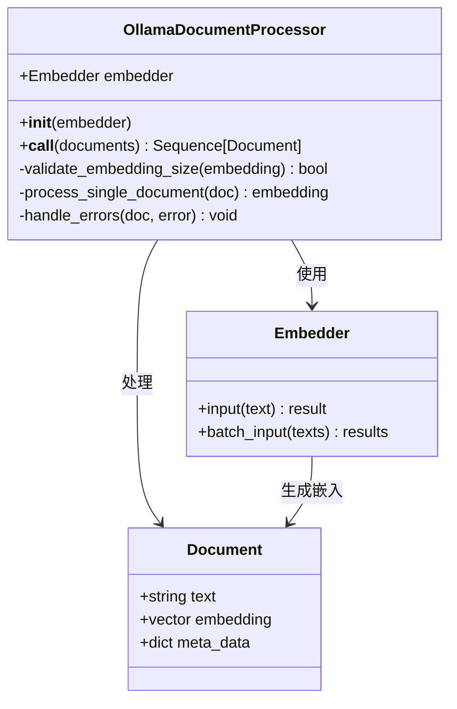
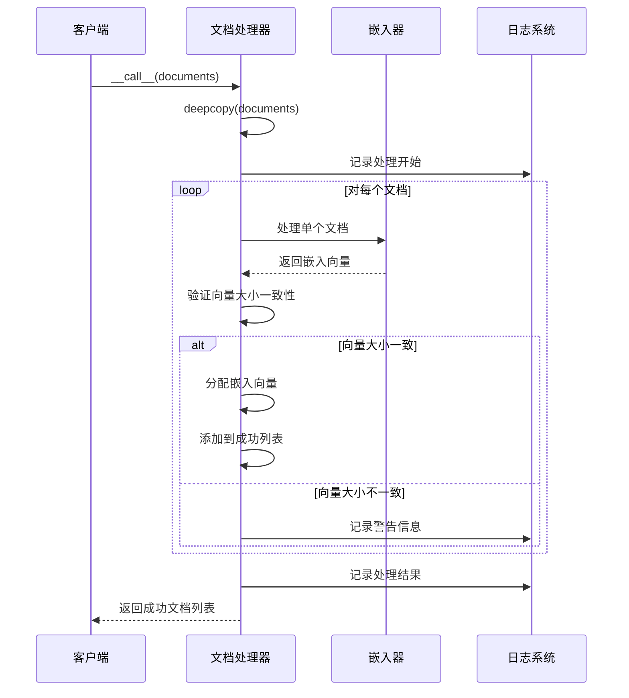
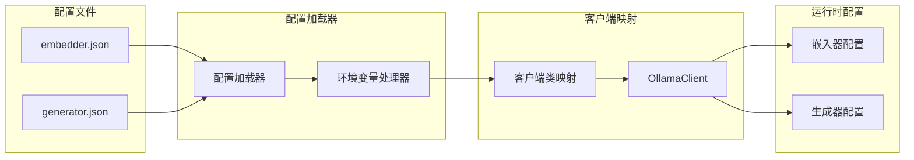
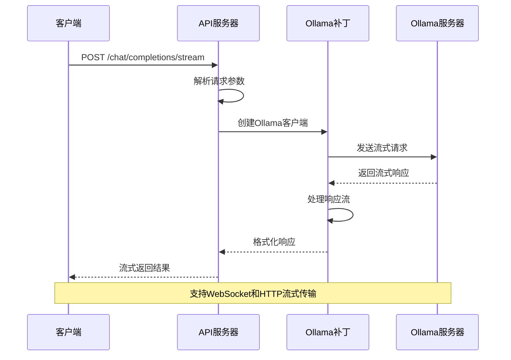

# Ollama补丁集成文档

<cite>
**本文档中引用的文件**
- [ollama_patch.py](file://api/ollama_patch.py)
- [api.py](file://api/api.py)
- [openai_client.py](file://api/openai_client.py)
- [config.py](file://api/config.py)
- [main.py](file://api/main.py)
- [simple_chat.py](file://api/simple_chat.py)
- [websocket_wiki.py](file://api/websocket_wiki.py)
- [Ollama-instruction.md](file://Ollama-instruction.md)
- [README.md](file://README.md)
- [embedder.json](file://api/config/embedder.json)
- [generator.json](file://api/config/generator.json)
</cite>

## 目录
1. [简介](#简介)
2. [系统架构概览](#系统架构概览)
3. [Ollama补丁核心组件](#ollama补丁核心组件)
4. [模型可用性检查机制](#模型可用性检查机制)
5. [文档处理器设计](#文档处理器设计)
6. [配置系统集成](#配置系统集成)
7. [API端点适配](#api端点适配)
8. [部署和使用指南](#部署和使用指南)
9. [性能优化策略](#性能优化策略)
10. [故障排除指南](#故障排除指南)
11. [总结](#总结)

## 简介

DeepWiki-Open是一个强大的代码文档生成工具，通过Ollama补丁集成为用户提供了完全本地化的AI模型推理能力。该补丁使得本地Ollama服务能够像标准API客户端一样被调用，实现了无需依赖外部云服务的完全私有化AI解决方案。

Ollama补丁的核心价值在于：
- **完全本地化**：所有AI推理在本地完成，保护数据隐私
- **成本效益**：避免昂贵的API调用费用
- **离线可用**：无需互联网连接即可运行
- **自定义模型**：支持用户自定义的本地模型

## 系统架构概览

DeepWiki-Open采用模块化架构设计，Ollama补丁作为重要的组件集成到整个系统中：



**图表来源**
- [api.py](file://api/api.py#L1-L50)
- [simple_chat.py](file://api/simple_chat.py#L1-L50)
- [websocket_wiki.py](file://api/websocket_wiki.py#L1-L50)

## Ollama补丁核心组件

### 模型可用性检查器

Ollama补丁的核心功能之一是模型可用性检查机制，确保在使用特定模型之前验证其存在性：



**图表来源**
- [ollama_patch.py](file://api/ollama_patch.py#L21-L60)

### 文档处理器

Ollama补丁包含专门的文档处理器，用于处理Adalflow框架中的嵌入操作：



**图表来源**
- [ollama_patch.py](file://api/ollama_patch.py#L62-L105)

**节来源**
- [ollama_patch.py](file://api/ollama_patch.py#L62-L105)

## 模型可用性检查机制

### 实现细节

模型可用性检查机制通过HTTP API与Ollama服务通信，验证指定模型是否存在于本地实例中：

#### 关键特性
- **自动发现**：自动检测Ollama服务的可用性
- **超时控制**：设置5秒超时防止长时间等待
- **错误处理**：优雅处理网络和API错误
- **日志记录**：详细的调试信息输出

#### 配置选项
- **默认主机**：`http://localhost:11434`
- **环境变量**：可通过`OLLAMA_HOST`环境变量自定义
- **超时设置**：5秒HTTP请求超时

**节来源**
- [ollama_patch.py](file://api/ollama_patch.py#L21-L60)

## 文档处理器设计

### 批处理限制

由于Adalflow Ollama客户端不支持批量嵌入，文档处理器采用逐个处理的方式：



**图表来源**
- [ollama_patch.py](file://api/ollama_patch.py#L71-L105)

### 错误处理策略

文档处理器实现了完善的错误处理机制：

#### 嵌入大小验证
- **预期大小跟踪**：记录第一个文档的嵌入维度
- **一致性检查**：后续文档必须具有相同维度
- **异常文档跳过**：记录问题并继续处理其他文档

#### 异常类型处理
- **网络错误**：重试机制和降级处理
- **模型错误**：模型不可用时的替代方案
- **内存错误**：大文档的分块处理

**节来源**
- [ollama_patch.py](file://api/ollama_patch.py#L71-L105)

## 配置系统集成

### 嵌入器配置

Ollama补丁通过配置系统无缝集成到DeepWiki的多提供商架构中：



**图表来源**
- [config.py](file://api/config.py#L55-L64)
- [embedder.json](file://api/config/embedder.json#L11-L15)
- [generator.json](file://api/config/generator.json#L116-L142)

### 动态配置切换

系统支持运行时动态切换嵌入器类型：

#### 支持的嵌入器类型
- **OpenAI**：默认配置，使用`text-embedding-3-small`
- **Google**：使用`text-embedding-004`模型
- **Ollama**：本地模型，使用`nomic-embed-text`

#### 配置优先级
1. **环境变量**：`DEEPWIKI_EMBEDDER_TYPE`
2. **配置文件**：`embedder.json`中的默认设置
3. **回退机制**：自动选择可用的嵌入器

**节来源**
- [config.py](file://api/config.py#L160-L193)
- [embedder.json](file://api/config/embedder.json#L1-L34)

## API端点适配

### 流式响应处理

Ollama补丁与DeepWiki的API系统深度集成，支持多种响应模式：



**图表来源**
- [simple_chat.py](file://api/simple_chat.py#L75-L90)
- [websocket_wiki.py](file://api/websocket_wiki.py#L52-L75)

### 请求/响应格式转换

Ollama补丁负责处理不同API格式之间的转换：

#### 输入格式标准化
- **消息结构**：统一的消息格式转换
- **参数映射**：将DeepWiki参数映射到Ollama格式
- **流式支持**：透明的流式和非流式处理

#### 输出格式统一
- **响应解析**：从Ollama格式解析出标准格式
- **错误处理**：统一的错误响应格式
- **元数据提取**：令牌使用情况等统计信息

**节来源**
- [simple_chat.py](file://api/simple_chat.py#L75-L200)
- [websocket_wiki.py](file://api/websocket_wiki.py#L52-L200)

## 部署和使用指南

### 环境准备

#### 系统要求
- **操作系统**：Windows 10+, macOS 10.14+, Linux (Ubuntu 18.04+)
- **内存**：至少8GB RAM（推荐16GB+）
- **存储**：10GB+ 可用空间
- **Python**：3.8+
- **Docker**（可选）：19.03+

#### Ollama安装

根据操作系统选择合适的安装方式：

```bash
# Windows
# 下载 https://ollama.com/download 并运行安装程序

# macOS
# 下载 https://ollama.com/download 并拖拽到应用程序文件夹

# Linux
curl -fsSL https://ollama.com/install.sh | sh
```

### 模型下载

下载推荐的模型组合：

```bash
# 嵌入模型
ollama pull nomic-embed-text

# 语言模型
ollama pull qwen3:1.7b
```

### 配置设置

#### 环境变量配置

创建项目根目录下的`.env`文件：

```bash
# 端口配置
PORT=8001

# Ollama主机配置（如果不在本地）
OLLAMA_HOST=http://localhost:11434

# 嵌入器类型（可选）
DEEPWIKI_EMBEDDER_TYPE=ollama
```

#### 配置文件替换

```bash
# 替换嵌入器配置
cp api/config/embedder.ollama.json.bak api/config/embedder.json
```

### 启动流程

#### 手动启动

```bash
# 安装依赖
python -m pip install poetry==2.0.1 && poetry install

# 启动后端
python -m api.main

# 在另一个终端启动前端
npm install
npm run dev
```

#### Docker启动

```bash
# 构建镜像
docker build -f Dockerfile-ollama-local -t deepwiki:ollama-local .

# 运行容器
docker run -p 3000:3000 -p 8001:8001 \
  -v ~/.adalflow:/root/.adalflow \
  -e OLLAMA_HOST=http://localhost:11434 \
  deepwiki:ollama-local
```

### 使用界面

1. 打开浏览器访问 `http://localhost:3000`
2. 输入GitHub、GitLab或Bitbucket仓库URL
3. 勾选"使用本地Ollama模型"选项
4. 点击"生成Wiki"按钮

**节来源**
- [Ollama-instruction.md](file://Ollama-instruction.md#L1-L190)
- [README.md](file://README.md#L31-L115)

## 性能优化策略

### 内存管理

#### 嵌入向量优化
- **批处理限制**：每次处理最多500个文档
- **内存监控**：实时监控内存使用情况
- **垃圾回收**：及时释放不需要的对象

#### 缓存策略
- **模型缓存**：本地缓存已下载的模型
- **嵌入缓存**：缓存计算过的文档嵌入
- **会话管理**：优化长对话的内存使用

### 并发处理

#### 文档处理优化
- **单文档处理**：避免批量处理的复杂性
- **进度跟踪**：使用tqdm显示处理进度
- **错误隔离**：单个文档失败不影响整体处理

#### 网络优化
- **连接池**：复用HTTP连接
- **超时控制**：合理的超时设置
- **重试机制**：自动重试失败的请求

### 模型选择建议

| 模型 | 大小 | 速度 | 质量 | 推荐用途 |
|------|------|------|------|----------|
| phi3:mini | 1.3GB | 快 | 良好 | 小项目，快速测试 |
| qwen3:1.7b | 3.8GB | 中等 | 更好 | 默认选择，平衡性能 |
| llama3:8b | 8GB | 慢 | 最佳 | 复杂项目，详细分析 |

**节来源**
- [ollama_patch.py](file://api/ollama_patch.py#L71-L105)

## 故障排除指南

### 常见问题及解决方案

#### 连接问题

**问题**：无法连接到Ollama服务器
```bash
# 检查Ollama服务状态
ollama list

# 检查端口占用
netstat -an | grep 11434

# 重启Ollama服务
ollama serve
```

**解决方案**：
- 确保Ollama服务正在运行
- 检查防火墙设置
- 验证端口配置正确性

#### 模型问题

**问题**：模型下载失败
```bash
# 清理损坏的模型
ollama rm model_name

# 重新下载
ollama pull model_name
```

**解决方案**：
- 检查网络连接
- 验证磁盘空间
- 使用代理（如需要）

#### 性能问题

**问题**：生成速度慢
**解决方案**：
- 使用较小的模型
- 减少并发请求数量
- 升级硬件配置

#### 内存问题

**问题**：内存不足错误
**解决方案**：
- 关闭其他内存密集型应用
- 使用更小的模型
- 增加系统虚拟内存

### 调试技巧

#### 日志配置
```bash
# 设置调试级别
export LOG_LEVEL=DEBUG

# 指定日志文件
export LOG_FILE_PATH=./debug.log

# 启动应用
python -m api.main
```

#### 网络诊断
```bash
# 测试Ollama连接
curl http://localhost:11434/api/tags

# 检查模型列表
curl http://localhost:11434/api/models
```

**节来源**
- [Ollama-instruction.md](file://Ollama-instruction.md#L114-L189)

## 总结

DeepWiki-Open的Ollama补丁集成提供了一个强大而灵活的本地AI解决方案。通过精心设计的架构和完善的错误处理机制，该补丁成功地将本地Ollama服务无缝集成到现有的API生态系统中。

### 主要优势

1. **完全本地化**：保护用户数据隐私，无需担心云端传输
2. **成本效益**：避免昂贵的API调用费用
3. **灵活性**：支持多种模型和配置选项
4. **稳定性**：完善的错误处理和恢复机制
5. **易用性**：简单的配置和部署流程

### 技术创新

- **模型可用性检查**：智能的模型发现和验证机制
- **文档处理器**：针对Ollama特性的优化处理
- **配置系统集成**：无缝的多提供商支持
- **流式响应处理**：完整的实时交互支持

### 应用前景

Ollama补丁为DeepWiki-Open开启了新的应用场景：
- **企业内部部署**：满足严格的合规要求
- **离线开发环境**：无网络连接的开发场景
- **隐私敏感项目**：处理敏感代码和数据
- **成本控制**：降低长期运营成本

通过持续的优化和改进，Ollama补丁将继续为用户提供更加稳定、高效和可靠的本地AI解决方案。