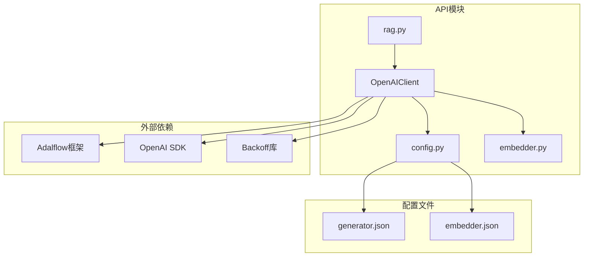
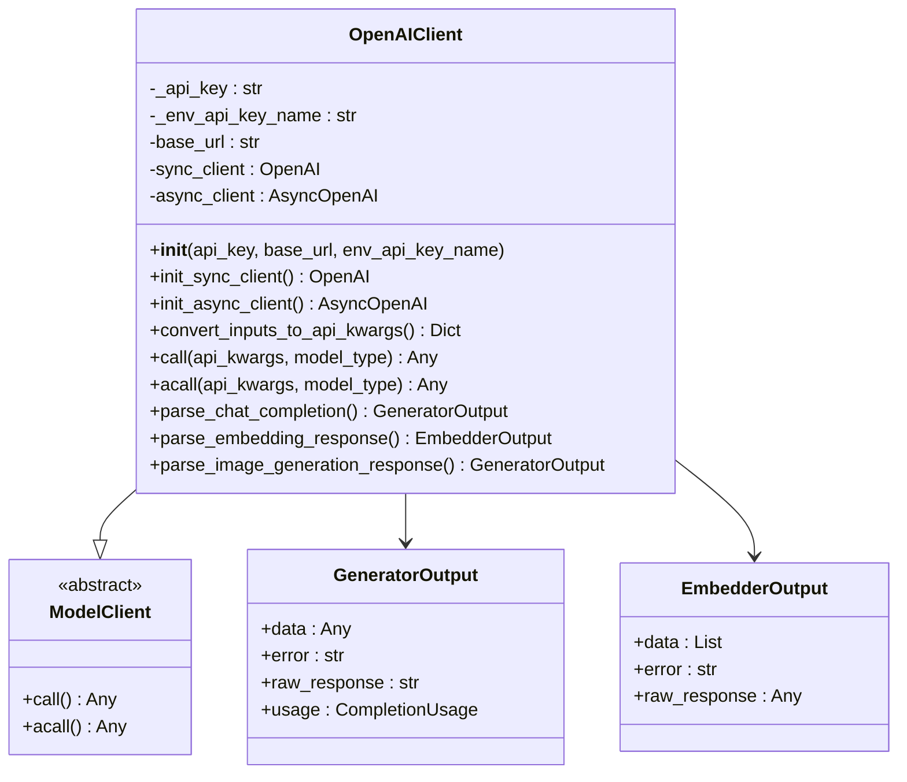
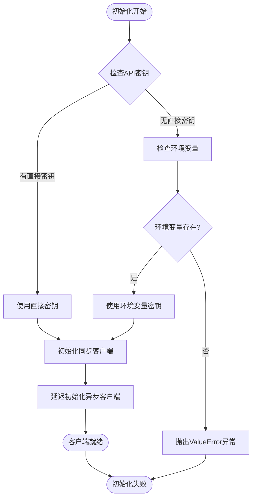
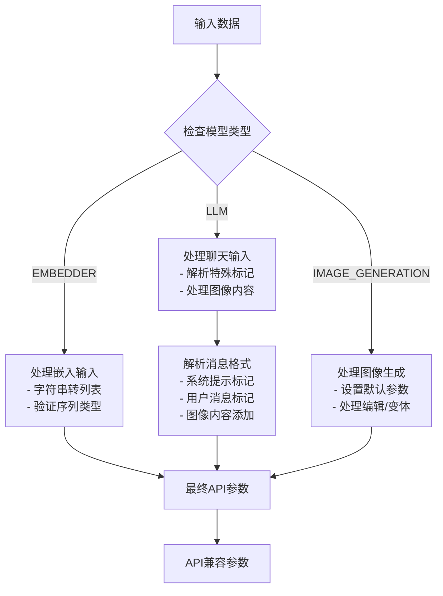
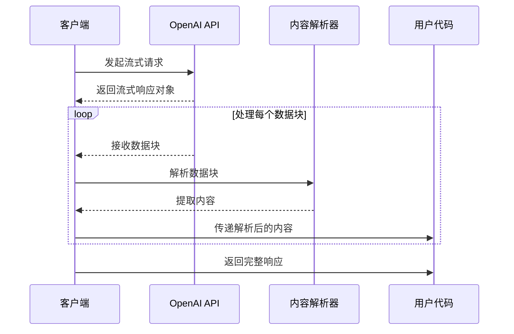
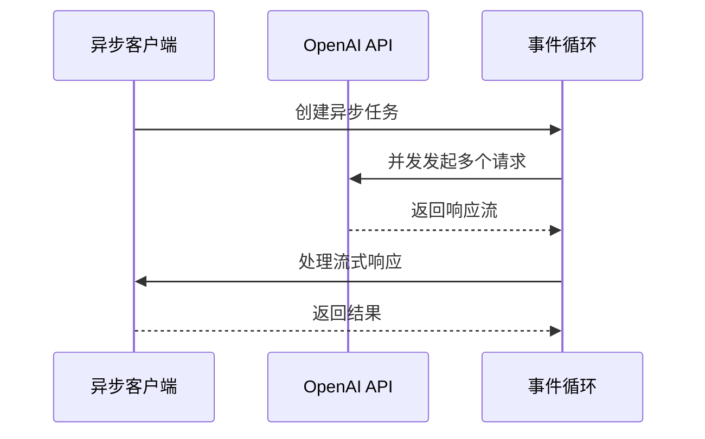
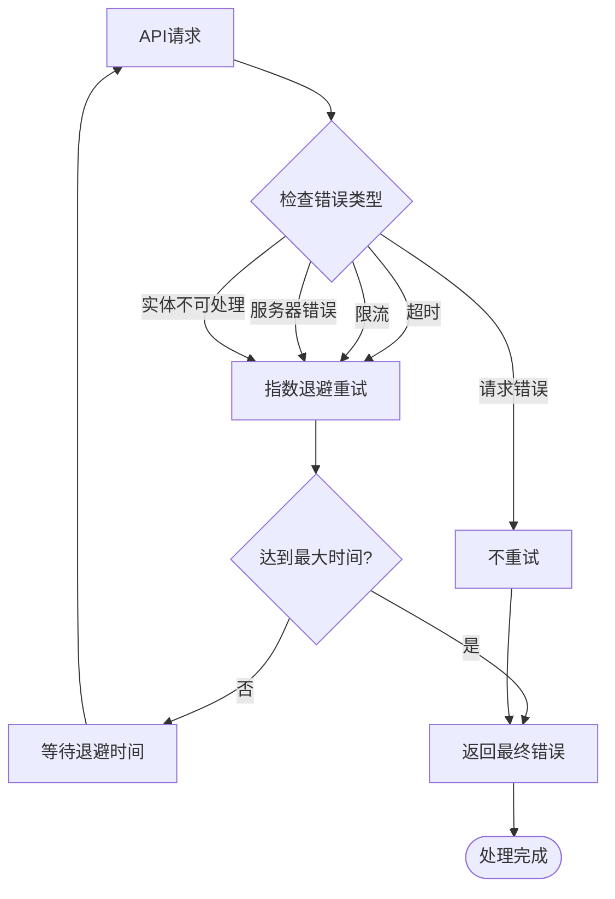
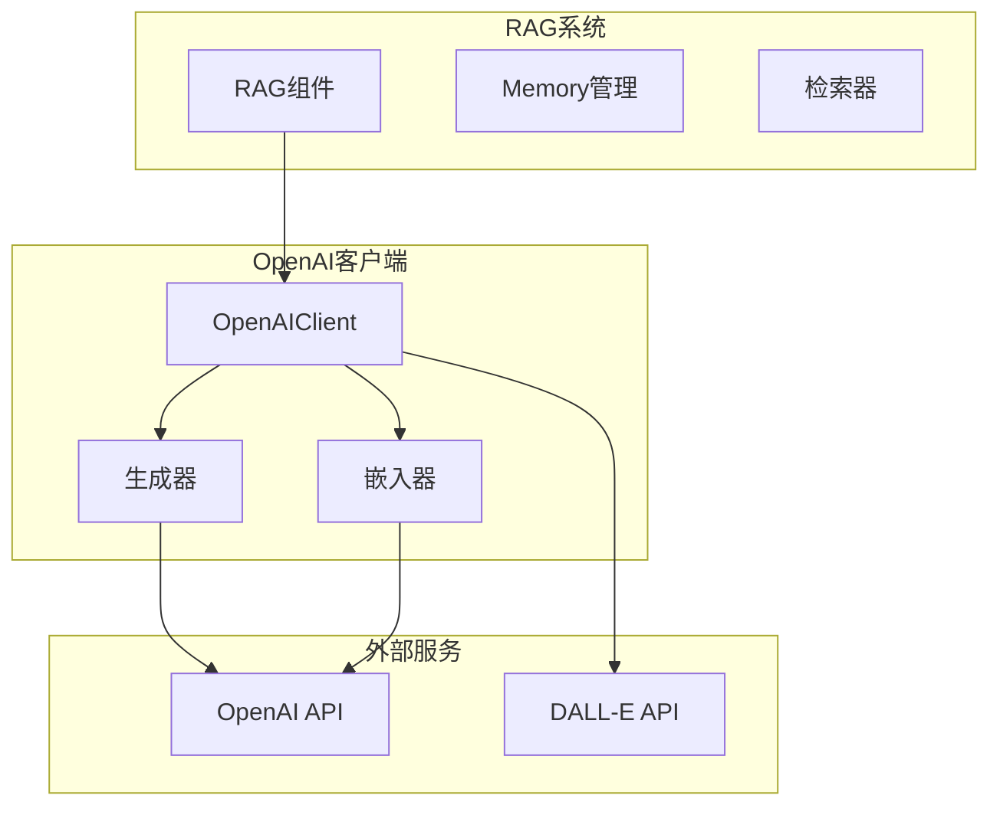
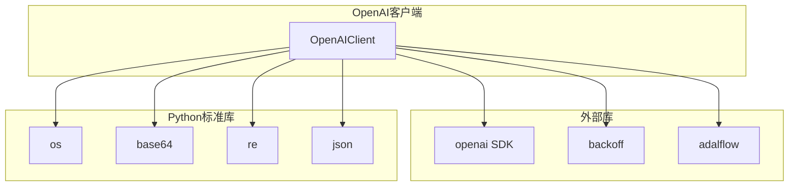

# OpenAI客户端集成文档

<cite>
**本文档中引用的文件**
- [openai_client.py](file://api/openai_client.py)
- [config.py](file://api/config.py)
- [rag.py](file://api/rag.py)
- [api.py](file://api/api.py)
- [embedder.py](file://api/tools/embedder.py)
- [generator.json](file://api/config/generator.json)
- [embedder.json](file://api/config/embedder.json)
</cite>

## 目录
1. [简介](#简介)
2. [项目结构](#项目结构)
3. [核心组件](#核心组件)
4. [架构概览](#架构概览)
5. [详细组件分析](#详细组件分析)
6. [依赖关系分析](#依赖关系分析)
7. [性能考虑](#性能考虑)
8. [故障排除指南](#故障排除指南)
9. [结论](#结论)

## 简介

deepwiki-open项目中的OpenAI客户端是一个强大的封装器，用于简化OpenAI API的使用。该客户端实现了统一的ModelClient接口，支持嵌入、聊天补全和图像生成等多种模型类型，并通过先进的错误处理和重试机制确保服务的可靠性。

OpenAIClient类提供了以下核心功能：
- **认证机制**：通过环境变量`OPENAI_API_KEY`进行安全认证
- **多模型支持**：嵌入、聊天补全、图像生成等
- **流式响应**：支持同步和异步流式传输
- **智能重试**：基于backoff库的指数退避重试策略
- **统一接口**：与RAG系统无缝集成

## 项目结构

**图表来源**
- [openai_client.py](file://api/openai_client.py#L1-L50)
- [config.py](file://api/config.py#L1-L30)

**章节来源**
- [openai_client.py](file://api/openai_client.py#L1-L100)
- [config.py](file://api/config.py#L1-L50)

## 核心组件

### OpenAIClient类

OpenAIClient是整个OpenAI集成的核心，继承自Adalflow的ModelClient基类，提供了完整的OpenAI API封装。

#### 主要特性

1. **认证管理**
   - 支持环境变量和直接传入API密钥
   - 自动验证密钥有效性
   - 支持自定义基础URL

2. **多模型支持**
   - 嵌入模型（text-embedding-*）
   - 聊天模型（gpt-4o、gpt-4、o1等）
   - 图像生成模型（DALL-E 2/3）

3. **流式处理**
   - 同步流式调用
   - 异步流式调用
   - 智能内容解析

**章节来源**
- [openai_client.py](file://api/openai_client.py#L119-L200)

## 架构概览

**图表来源**
- [openai_client.py](file://api/openai_client.py#L119-L200)
- [openai_client.py](file://api/openai_client.py#L218-L250)

## 详细组件分析

### 认证机制

OpenAIClient采用灵活的认证方式，优先使用环境变量进行安全配置。

#### 初始化流程

**图表来源**
- [openai_client.py](file://api/openai_client.py#L190-L204)

#### 配置选项

| 参数 | 类型 | 默认值 | 描述 |
|------|------|--------|------|
| `api_key` | Optional[str] | None | 直接传入的API密钥 |
| `base_url` | Optional[str] | "https://api.openai.com/v1" | API基础URL |
| `env_api_key_name` | str | "OPENAI_API_KEY" | 环境变量名称 |
| `env_base_url_name` | str | "OPENAI_BASE_URL" | 基础URL环境变量名 |

**章节来源**
- [openai_client.py](file://api/openai_client.py#L161-L189)

### 请求参数转换

convert_inputs_to_api_kwargs方法是OpenAI客户端的核心转换器，负责将标准化输入转换为OpenAI API特定格式。

#### 多模态输入处理

**图表来源**
- [openai_client.py](file://api/openai_client.py#L270-L380)

#### 图像处理功能

OpenAIClient支持多种图像输入方式：

| 输入类型 | 格式 | 示例 |
|----------|------|------|
| 本地路径 | str | "/path/to/image.jpg" |
| URL链接 | str | "https://example.com/image.jpg" |
| Base64编码 | Dict | {"type": "image_url", "image_url": {...}} |
| 列表形式 | List | ["image1.jpg", "image2.png"] |

**章节来源**
- [openai_client.py](file://api/openai_client.py#L538-L588)

### 流式响应处理

OpenAI客户端实现了强大的流式处理能力，支持同步和异步两种模式。

#### 同步流式处理

**图表来源**
- [openai_client.py](file://api/openai_client.py#L420-L460)

#### 异步流式处理

异步版本提供了更好的并发性能：

**图表来源**
- [openai_client.py](file://api/openai_client.py#L488-L517)

**章节来源**
- [openai_client.py](file://api/openai_client.py#L420-L517)

### 错误处理与重试机制

OpenAI客户端集成了robust的错误处理和重试机制，确保服务的稳定性。

#### 重试策略

**图表来源**
- [openai_client.py](file://api/openai_client.py#L400-L410)

#### 支持的错误类型

| 错误类型 | 描述 | 重试策略 |
|----------|------|----------|
| APITimeoutError | API请求超时 | 指数退避 |
| InternalServerError | 服务器内部错误 | 指数退避 |
| RateLimitError | 请求频率限制 | 指数退避 |
| UnprocessableEntityError | 请求实体无法处理 | 不重试 |
| BadRequestError | 请求格式错误 | 不重试 |

**章节来源**
- [openai_client.py](file://api/openai_client.py#L400-L410)

### RAG系统集成

OpenAI客户端与RAG（检索增强生成）系统深度集成，提供统一的模型访问接口。

#### 集成架构

**图表来源**
- [rag.py](file://api/rag.py#L153-L243)
- [openai_client.py](file://api/openai_client.py#L119-L150)

**章节来源**
- [rag.py](file://api/rag.py#L153-L243)

## 依赖关系分析

### 核心依赖

**图表来源**
- [openai_client.py](file://api/openai_client.py#L1-L30)

### 配置依赖

OpenAI客户端的配置通过多个JSON文件进行管理：

| 配置文件 | 用途 | 关键设置 |
|----------|------|----------|
| generator.json | 生成器模型配置 | 模型列表、温度、top_p |
| embedder.json | 嵌入器配置 | 批处理大小、模型参数 |
| lang.json | 语言配置 | 支持的语言列表 |

**章节来源**
- [config.py](file://api/config.py#L120-L149)
- [generator.json](file://api/config/generator.json#L1-L50)
- [embedder.json](file://api/config/embedder.json#L1-L34)

## 性能考虑

### 并发处理

OpenAI客户端支持同步和异步两种并发模式：

1. **同步模式**：适用于简单的单线程应用
2. **异步模式**：支持高并发请求处理
3. **延迟初始化**：异步客户端仅在首次使用时创建

### 缓存策略

- **客户端缓存**：同步和异步客户端实例缓存
- **配置缓存**：模型配置信息缓存
- **连接复用**：HTTP连接池优化

### 内存管理

- **流式处理**：避免大响应的内存占用
- **批量处理**：嵌入器支持批量操作
- **资源清理**：自动清理临时资源

## 故障排除指南

### 常见问题及解决方案

#### 认证问题

**问题**：`ValueError: Environment variable OPENAI_API_KEY must be set`

**解决方案**：
1. 设置环境变量：`export OPENAI_API_KEY="your-api-key"`
2. 或在代码中直接传入：`OpenAIClient(api_key="your-api-key")`

#### 连接问题

**问题**：API请求超时或连接失败

**解决方案**：
1. 检查网络连接
2. 验证API密钥有效性
3. 调整基础URL配置
4. 检查防火墙设置

#### 模型问题

**问题**：指定的模型不存在或不可用

**解决方案**：
1. 验证模型名称拼写
2. 检查账户是否有该模型权限
3. 使用默认模型作为备选

**章节来源**
- [openai_client.py](file://api/openai_client.py#L191-L204)

### 调试技巧

1. **启用调试日志**：设置日志级别为DEBUG
2. **检查API响应**：通过`raw_response`字段查看原始响应
3. **验证参数**：打印转换后的API参数
4. **测试连接**：使用简单的API调用来验证连接

## 结论

deepwiki-open项目的OpenAI客户端提供了一个强大、灵活且可靠的OpenAI API封装。其主要优势包括：

1. **统一接口**：通过ModelClient接口与RAG系统无缝集成
2. **多模型支持**：涵盖嵌入、聊天和图像生成等多种场景
3. **健壮性**：完善的错误处理和重试机制
4. **灵活性**：支持多种认证方式和配置选项
5. **性能优化**：流式处理和并发支持

该客户端不仅简化了OpenAI API的使用，还为构建复杂的AI应用提供了坚实的基础。通过合理的配置和使用，可以充分发挥OpenAI模型的能力，同时保持系统的稳定性和可维护性。

对于开发者而言，建议：
- 优先使用环境变量进行认证配置
- 根据具体需求选择合适的模型和参数
- 充分利用流式处理提升用户体验
- 定期监控和优化API调用性能