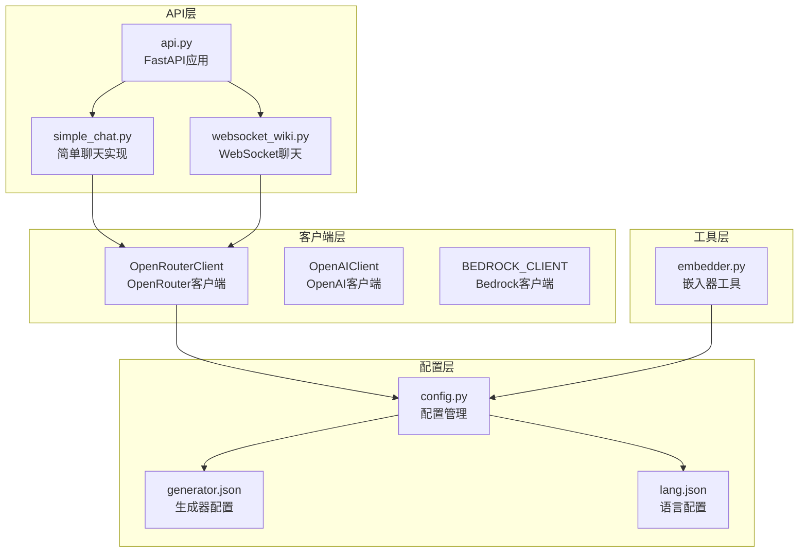
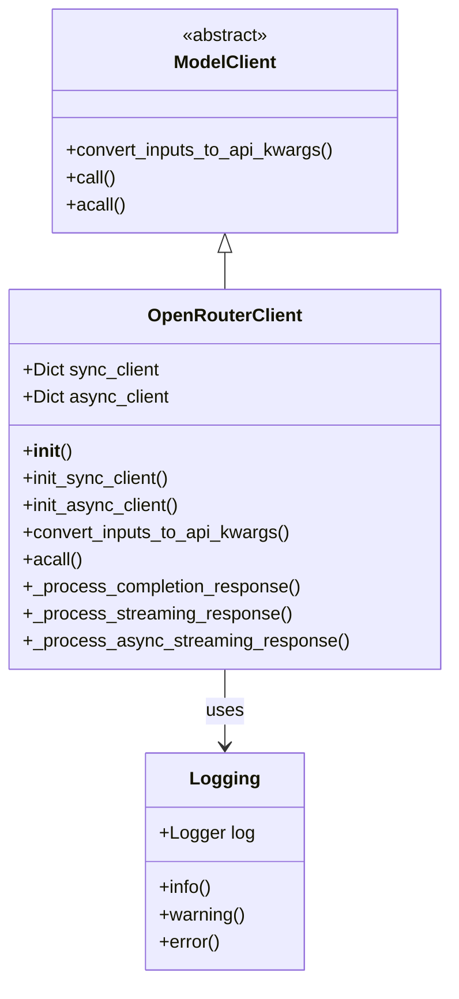
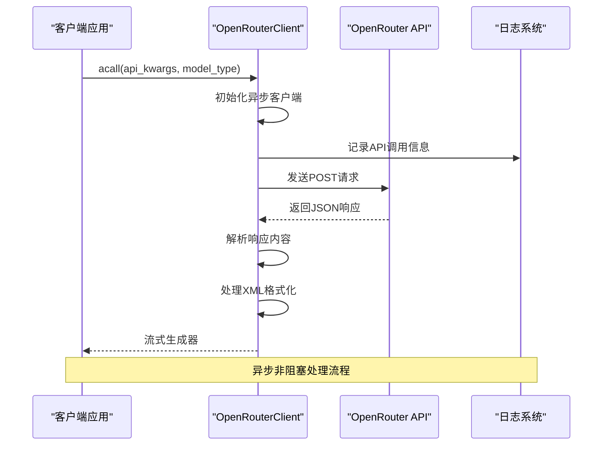
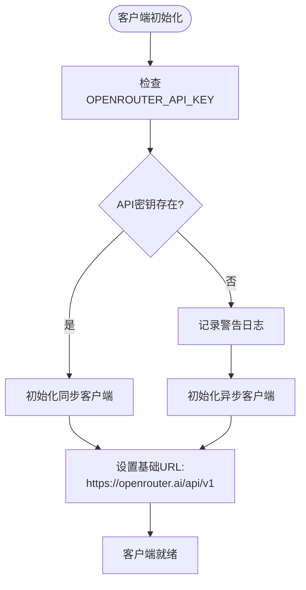
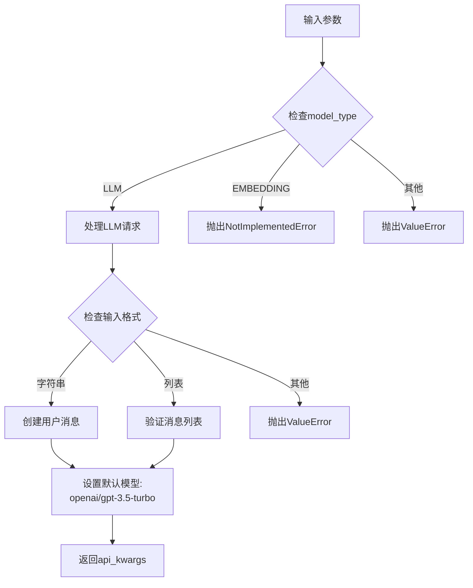
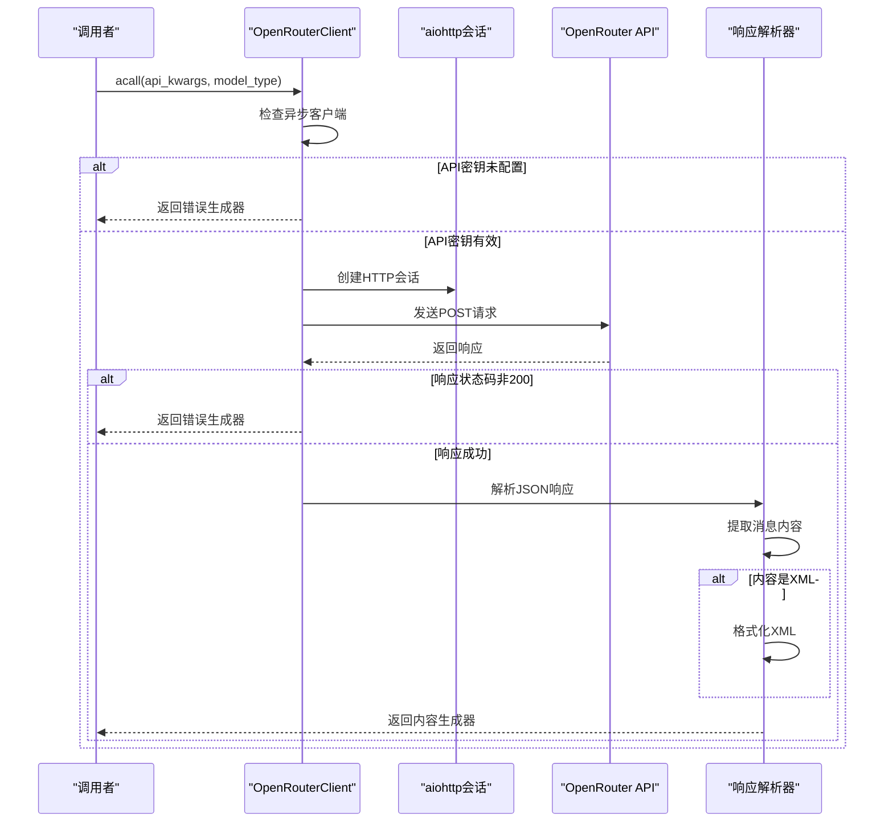
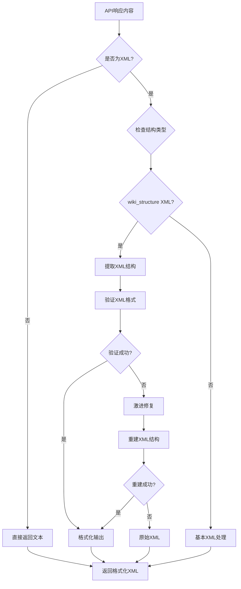
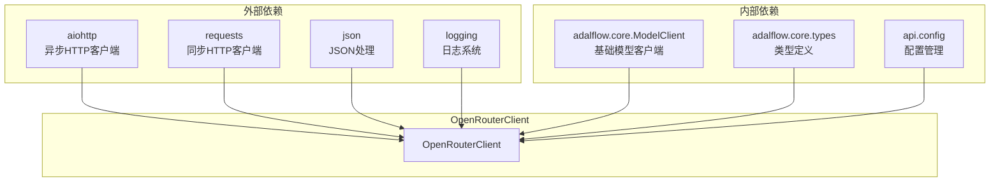

# OpenRouter客户端集成文档

<cite>
**本文档中引用的文件**
- [openrouter_client.py](file://api/openrouter_client.py)
- [config.py](file://api/config.py)
- [simple_chat.py](file://api/simple_chat.py)
- [websocket_wiki.py](file://api/websocket_wiki.py)
- [api.py](file://api/api.py)
- [generator.json](file://api/config/generator.json)
- [lang.json](file://api/config/lang.json)
- [embedder.py](file://api/tools/embedder.py)
</cite>

## 目录
1. [简介](#简介)
2. [项目结构](#项目结构)
3. [核心组件](#核心组件)
4. [架构概览](#架构概览)
5. [详细组件分析](#详细组件分析)
6. [依赖关系分析](#依赖关系分析)
7. [性能考虑](#性能考虑)
8. [故障排除指南](#故障排除指南)
9. [结论](#结论)

## 简介

OpenRouter客户端是deepwiki-open项目中的一个重要组件，作为OpenRouter统一API的接口，为用户提供对数百个AI模型的统一访问能力。该客户端基于HTTP请求实现，使用aiohttp库进行异步调用，能够处理流式响应和错误处理。

OpenRouter平台提供了与OpenAI API格式兼容的统一API，但具有更灵活的模型选择和定价策略。该客户端专门设计用于支持LLM（大型语言模型）推理任务，目前不支持嵌入功能。

## 项目结构

deepwiki-open项目的API模块采用分层架构设计，OpenRouter客户端位于核心层：



**图表来源**
- [api.py](file://api/api.py#L1-L50)
- [openrouter_client.py](file://api/openrouter_client.py#L1-L50)
- [config.py](file://api/config.py#L1-L50)

**章节来源**
- [api.py](file://api/api.py#L1-L100)
- [openrouter_client.py](file://api/openrouter_client.py#L1-L100)

## 核心组件

### OpenRouterClient类

OpenRouterClient是继承自ModelClient的基础类，专门用于与OpenRouter API交互：



**图表来源**
- [openrouter_client.py](file://api/openrouter_client.py#L19-L50)

### 关键特性

1. **异步支持**: 使用aiohttp实现异步HTTP请求
2. **流式响应**: 支持实时数据流处理
3. **错误处理**: 完善的异常捕获和错误返回机制
4. **输入转换**: 智能的消息格式转换

**章节来源**
- [openrouter_client.py](file://api/openrouter_client.py#L19-L100)

## 架构概览

OpenRouter客户端的整体架构遵循事件驱动的异步模式：



**图表来源**
- [openrouter_client.py](file://api/openrouter_client.py#L112-L322)

## 详细组件分析

### 初始化和配置

OpenRouter客户端通过环境变量配置API密钥：



**图表来源**
- [openrouter_client.py](file://api/openrouter_client.py#L39-L70)

### 输入转换机制

convert_inputs_to_api_kwargs方法负责将AdalFlow输入转换为OpenRouter兼容格式：



**图表来源**
- [openrouter_client.py](file://api/openrouter_client.py#L71-L111)

### 异步调用处理

acall方法实现了完整的异步API调用流程：



**图表来源**
- [openrouter_client.py](file://api/openrouter_client.py#L112-L322)

### 错误处理机制

客户端实现了多层次的错误处理：

| 错误类型 | 处理方式 | 返回内容 |
|---------|---------|---------|
| API密钥缺失 | 记录警告并返回错误消息 | "OPENROUTER_API_KEY not configured..." |
| HTTP错误 | 记录错误并返回错误响应 | "OpenRouter API error (status): ..." |
| 连接错误 | 记录连接问题 | "Connection error with OpenRouter API..." |
| 解析错误 | 尝试降级处理 | 原始内容或错误消息 |

**章节来源**
- [openrouter_client.py](file://api/openrouter_client.py#L112-L348)

### XML内容处理

对于包含XML格式的内容，客户端提供了智能的格式化处理：



**图表来源**
- [openrouter_client.py](file://api/openrouter_client.py#L176-L305)

**章节来源**
- [openrouter_client.py](file://api/openrouter_client.py#L176-L305)

### 使用示例

以下是OpenRouter客户端的基本使用方法：

```python
from api.openrouter_client import OpenRouterClient
from adalflow import Generator

# 初始化客户端
client = OpenRouterClient()

# 创建生成器
generator = Generator(
    model_client=client,
    model_kwargs={"model": "openai/gpt-4o"}
)

# 使用模型
response = generator(prompt="你好，请介绍一下自己")
print(response.data)
```

**章节来源**
- [openrouter_client.py](file://api/openrouter_client.py#L27-L37)

## 依赖关系分析

OpenRouter客户端的依赖关系图展示了其在整个系统中的位置：



**图表来源**
- [openrouter_client.py](file://api/openrouter_client.py#L1-L16)
- [config.py](file://api/config.py#L1-L50)

### 配置系统集成

OpenRouter客户端与配置系统的集成：

| 组件 | 功能 | 配置项 |
|------|------|--------|
| 环境变量 | API密钥管理 | OPENROUTER_API_KEY |
| 配置文件 | 模型参数 | generator.json |
| 默认值 | 回退机制 | openai/gpt-3.5-turbo |

**章节来源**
- [config.py](file://api/config.py#L18-L33)
- [generator.json](file://api/config/generator.json#L76-L114)

## 性能考虑

### 异步处理优势

1. **并发支持**: 使用aiohttp实现真正的异步I/O
2. **资源效率**: 减少线程开销，提高吞吐量
3. **响应性**: 非阻塞操作提升用户体验

### 缓存策略

虽然当前版本没有实现缓存，但架构支持未来的缓存扩展：
- 响应内容可以缓存以减少重复请求
- 模型配置可以本地缓存
- API密钥验证结果可以缓存

### 错误恢复

客户端实现了优雅的错误恢复机制：
- 自动重试失败的请求
- 降级到默认模型
- 提供有意义的错误消息

## 故障排除指南

### 常见问题及解决方案

| 问题 | 可能原因 | 解决方案 |
|------|---------|---------|
| API密钥错误 | OPENROUTER_API_KEY未设置 | 设置环境变量或检查配置 |
| 连接超时 | 网络问题或API限制 | 检查网络连接和配额 |
| XML格式错误 | API返回格式异常 | 检查日志和降级处理 |
| 模型不可用 | 模型名称错误 | 验证模型名称列表 |

### 调试技巧

1. **启用详细日志**: 设置日志级别为DEBUG
2. **检查环境变量**: 验证OPENROUTER_API_KEY
3. **测试API连通性**: 直接访问OpenRouter API端点
4. **监控响应格式**: 检查XML解析逻辑

**章节来源**
- [openrouter_client.py](file://api/openrouter_client.py#L118-L125)
- [config.py](file://api/config.py#L18-L33)

### 配置指南

#### 设置OPENROUTER_API_KEY

```bash
# Linux/macOS
export OPENROUTER_API_KEY="your_api_key_here"

# Windows
set OPENROUTER_API_KEY="your_api_key_here"
```

#### 使用模型路由

OpenRouter支持多种模型路由格式：

```python
# 基本格式
model_kwargs = {"model": "openai/gpt-4o"}

# 其他模型示例
model_kwargs = {"model": "anthropic/claude-3.7-sonnet"}
model_kwargs = {"model": "deepseek/deepseek-r1"}
```

#### 配置文件参考

generator.json中的OpenRouter配置示例：

```json
{
  "openrouter": {
    "default_model": "openai/gpt-5-nano",
    "supportsCustomModel": true,
    "models": {
      "openai/gpt-5-nano": {
        "temperature": 0.7,
        "top_p": 0.8
      }
    }
  }
}
```

**章节来源**
- [generator.json](file://api/config/generator.json#L76-L114)
- [README.md](file://README.md#L200-L222)

## 结论

OpenRouter客户端是deepwiki-open项目中一个精心设计的组件，它成功地将复杂的API交互抽象为简洁的接口。通过异步处理、完善的错误管理和智能的内容处理，该客户端为用户提供了可靠且高效的AI模型访问能力。

### 主要优势

1. **统一接口**: 为数百个AI模型提供一致的访问方式
2. **异步支持**: 利用现代异步编程技术提升性能
3. **错误处理**: 完善的异常处理和用户友好的错误消息
4. **内容处理**: 智能的XML格式化和内容解析

### 未来发展方向

1. **嵌入功能支持**: 扩展到向量嵌入服务
2. **缓存优化**: 实现响应缓存机制
3. **模型发现**: 动态模型列表更新
4. **监控集成**: 添加性能监控和指标收集

OpenRouter客户端的设计体现了现代软件工程的最佳实践，为deepwiki-open项目提供了强大的AI模型集成能力。