# 通义千问客户端集成文档

<cite>
**本文档中引用的文件**
- [dashscope_client.py](file://api/dashscope_client.py)
- [config.py](file://api/config.py)
- [generator.json](file://api/config/generator.json)
- [embedder.json](file://api/config/embedder.json)
- [rag.py](file://api/rag.py)
- [tools/embedder.py](file://api/tools/embedder.py)
- [prompts.py](file://api/prompts.py)
- [websocket_wiki.py](file://api/websocket_wiki.py)
- [simple_chat.py](file://api/simple_chat.py)
</cite>

## 目录
1. [简介](#简介)
2. [项目结构概览](#项目结构概览)
3. [核心组件分析](#核心组件分析)
4. [架构概览](#架构概览)
5. [详细组件分析](#详细组件分析)
6. [认证机制](#认证机制)
7. [配置管理](#配置管理)
8. [与RAG系统的集成](#与rag系统的集成)
9. [使用指南](#使用指南)
10. [故障排除](#故障排除)
11. [总结](#总结)

## 简介

deepwiki-open项目中的通义千问（DashScope）客户端是一个专门设计用于封装阿里云DashScope API的组件，为项目提供了对通义千问系列大模型的统一访问接口。该客户端通过实现标准的ModelClient接口，与项目的RAG（检索增强生成）系统无缝集成，支持中文场景下的文档生成、代码分析和智能问答功能。

该客户端采用OpenAI兼容的API设计模式，通过环境变量进行配置管理，支持同步和异步两种调用方式，并提供了完善的错误处理和重试机制。

## 项目结构概览

deepwiki-open项目采用模块化架构设计，通义千问客户端作为其中的重要组成部分，位于API层中：

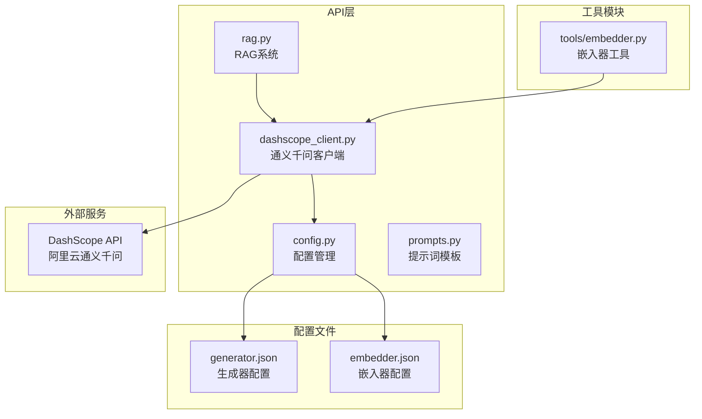

**图表来源**
- [dashscope_client.py](file://api/dashscope_client.py#L1-L50)
- [config.py](file://api/config.py#L1-L50)
- [rag.py](file://api/rag.py#L1-L50)

**章节来源**
- [dashscope_client.py](file://api/dashscope_client.py#L1-L100)
- [config.py](file://api/config.py#L1-L100)

## 核心组件分析

### DashscopeClient类

DashscopeClient是通义千问客户端的核心类，继承自ModelClient基类，提供了完整的API封装功能：

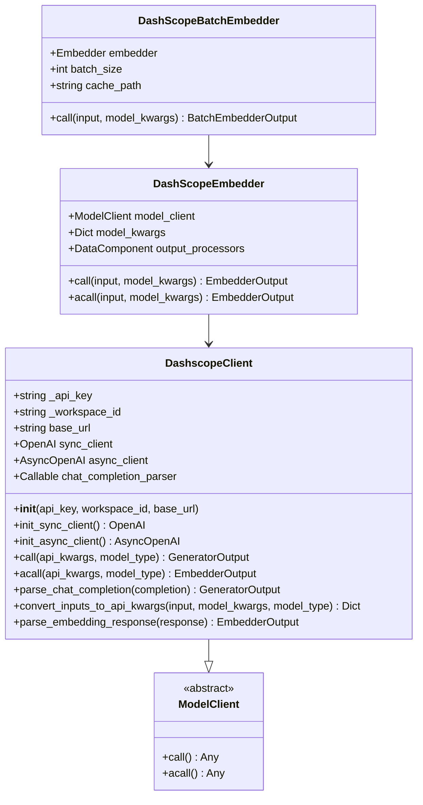

**图表来源**
- [dashscope_client.py](file://api/dashscope_client.py#L104-L200)
- [dashscope_client.py](file://api/dashscope_client.py#L636-L680)
- [dashscope_client.py](file://api/dashscope_client.py#L721-L810)

### 认证和配置管理

客户端通过环境变量进行认证和配置管理，支持灵活的部署需求：

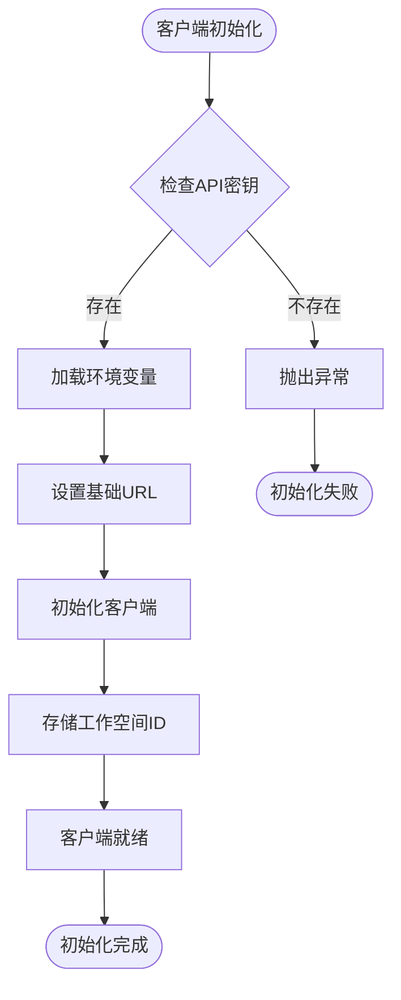

**图表来源**
- [dashscope_client.py](file://api/dashscope_client.py#L146-L173)

**章节来源**
- [dashscope_client.py](file://api/dashscope_client.py#L104-L200)
- [config.py](file://api/config.py#L18-L41)

## 架构概览

通义千问客户端在deepwiki-open项目中的架构位置体现了清晰的分层设计：

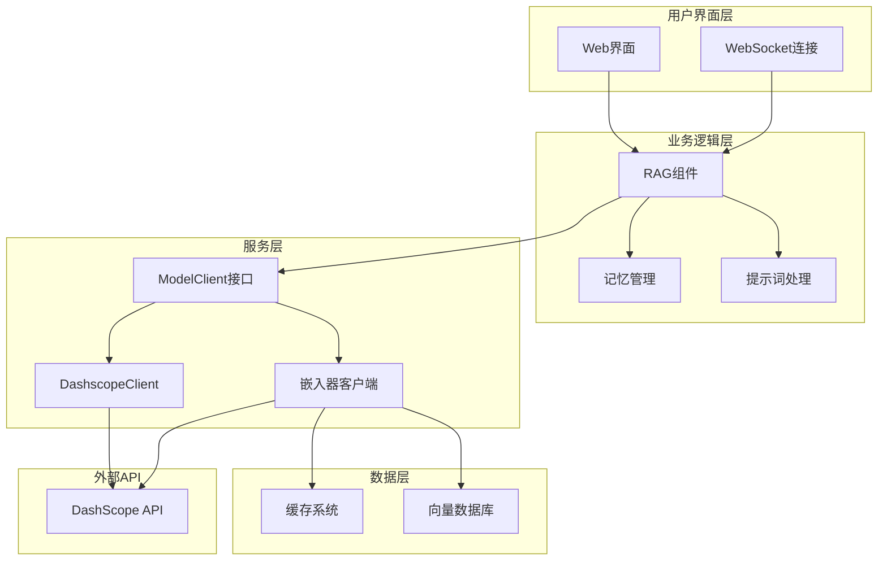

**图表来源**
- [rag.py](file://api/rag.py#L153-L200)
- [dashscope_client.py](file://api/dashscope_client.py#L104-L150)
- [websocket_wiki.py](file://api/websocket_wiki.py#L1-L30)

## 详细组件分析

### 同步和异步调用机制

客户端支持同步和异步两种调用方式，以适应不同的应用场景：

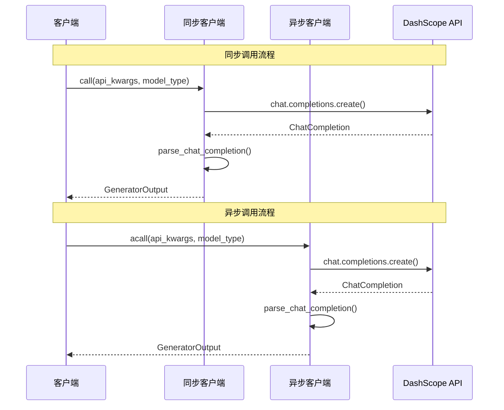

**图表来源**
- [dashscope_client.py](file://api/dashscope_client.py#L391-L407)
- [dashscope_client.py](file://api/dashscope_client.py#L498-L517)

### 响应解析和错误处理

客户端实现了完善的响应解析和错误处理机制：

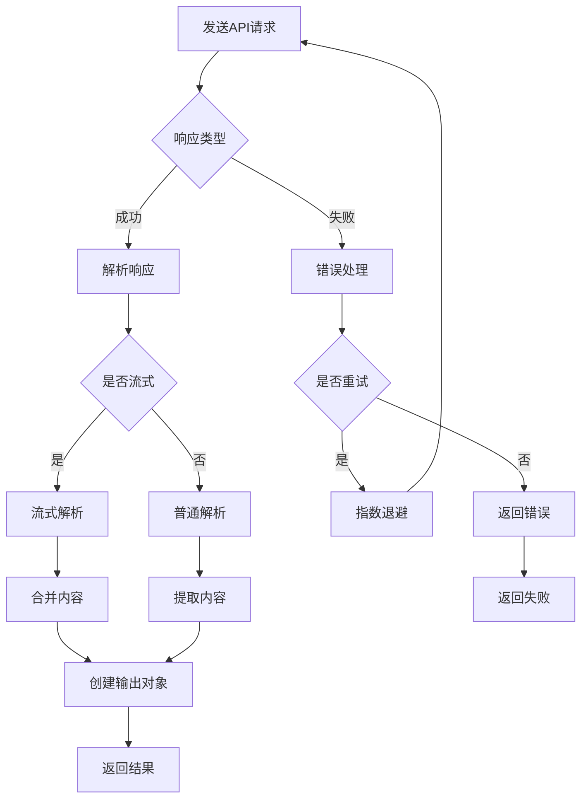

**图表来源**
- [dashscope_client.py](file://api/dashscope_client.py#L197-L266)
- [dashscope_client.py](file://api/dashscope_client.py#L380-L390)

### 模型参数配置

客户端支持多种通义千问模型的配置：

| 模型名称 | 默认温度 | 默认top_p | 支持特性 |
|---------|---------|----------|---------|
| qwen-plus | 0.7 | 0.8 | 标准对话能力 |
| qwen-turbo | 0.7 | 0.8 | 高速推理 |
| deepseek-r1 | 0.7 | 0.8 | 复杂推理 |

**章节来源**
- [generator.json](file://api/config/generator.json#L4-L20)
- [dashscope_client.py](file://api/dashscope_client.py#L305-L378)

## 认证机制

### API密钥管理

通义千问客户端通过环境变量进行API密钥管理，确保安全性：

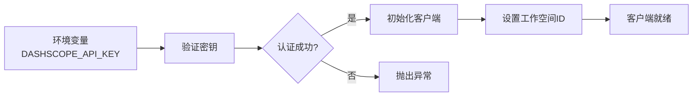

**图表来源**
- [dashscope_client.py](file://api/dashscope_client.py#L156-L162)

### 工作空间ID配置

客户端支持可选的工作空间ID配置，用于多租户环境：

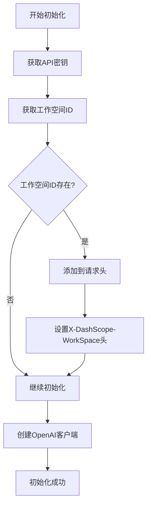

**图表来源**
- [dashscope_client.py](file://api/dashscope_client.py#L168-L173)

**章节来源**
- [dashscope_client.py](file://api/dashscope_client.py#L146-L173)
- [config.py](file://api/config.py#L18-L41)

## 配置管理

### 生成器配置

项目通过JSON配置文件管理通义千问模型的参数：

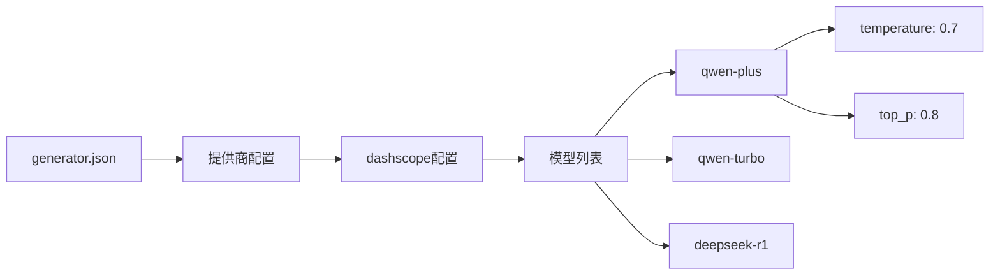

**图表来源**
- [generator.json](file://api/config/generator.json#L4-L20)

### 嵌入器配置

嵌入器配置支持多种模型和参数组合：

| 配置项 | 值 | 说明 |
|-------|---|------|
| client_class | DashscopeClient | 使用的客户端类 |
| batch_size | 100 | 批处理大小限制 |
| model_kwargs.model | text-embedding-v1 | 嵌入模型名称 |
| model_kwargs.dimensions | 1536 | 向量维度 |

**章节来源**
- [generator.json](file://api/config/generator.json#L1-L200)
- [embedder.json](file://api/config/embedder.json#L1-L34)

## 与RAG系统的集成

### 统一接口集成

通义千问客户端通过ModelClient接口与RAG系统集成：

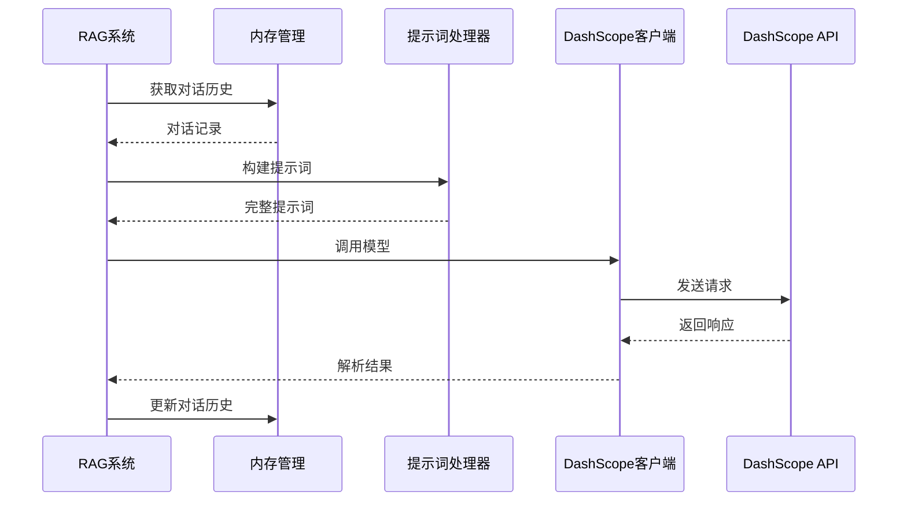

**图表来源**
- [rag.py](file://api/rag.py#L153-L200)
- [dashscope_client.py](file://api/dashscope_client.py#L391-L407)

### 文档生成和问答功能

客户端支持多种应用场景的文档生成和问答功能：

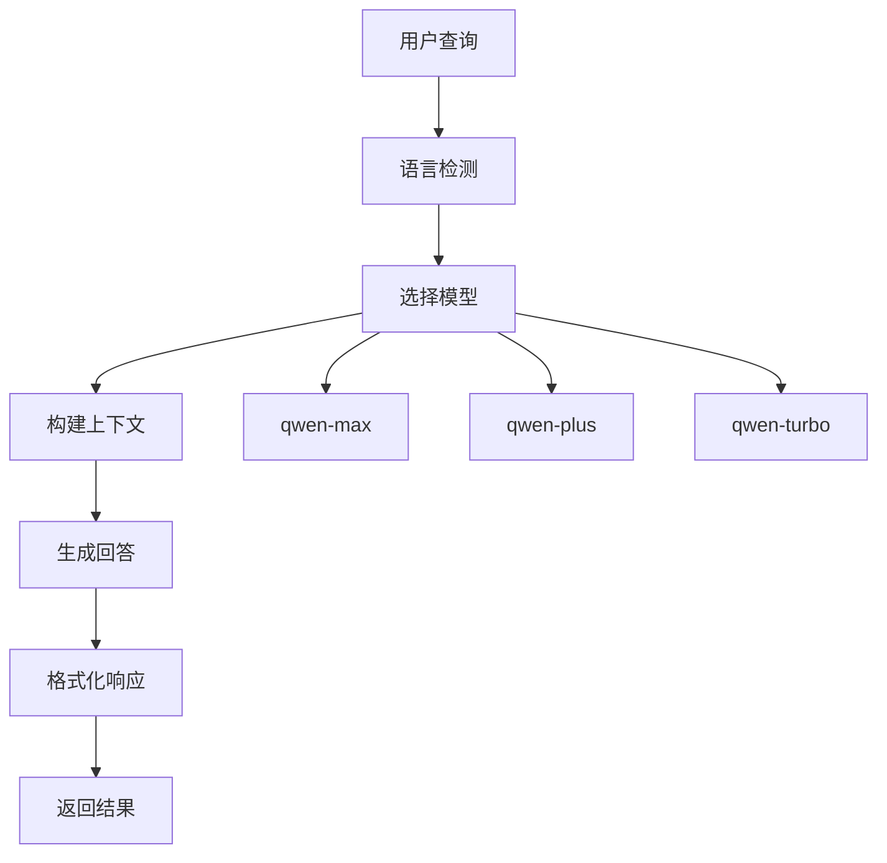

**图表来源**
- [prompts.py](file://api/prompts.py#L1-L30)
- [rag.py](file://api/rag.py#L153-L200)

**章节来源**
- [rag.py](file://api/rag.py#L153-L200)
- [prompts.py](file://api/prompts.py#L1-L50)

## 使用指南

### 配置API密钥

1. 设置环境变量：
```bash
export DASHSCOPE_API_KEY="your-api-key-here"
export DASHSCOPE_WORKSPACE_ID="your-workspace-id"  # 可选
```

2. 或者在配置文件中指定：
```json
{
  "providers": {
    "dashscope": {
      "default_model": "qwen-plus",
      "supportsCustomModel": true,
      "models": {
        "qwen-plus": {
          "temperature": 0.7,
          "top_p": 0.8
        }
      }
    }
  }
}
```

### 选择通义千问模型

支持的模型包括：
- **qwen-plus**: 标准对话模型，适合一般用途
- **qwen-turbo**: 高速推理模型，适合快速响应
- **deepseek-r1**: 复杂推理模型，适合深度分析

### 基本使用示例

```python
from api.dashscope_client import DashscopeClient
from api.config import get_model_config

# 获取模型配置
model_config = get_model_config(provider="dashscope", model="qwen-plus")

# 初始化客户端
client = model_config["model_client"]()

# 调用模型
response = client.call(
    api_kwargs={
        "messages": [{"role": "user", "content": "你好，请介绍一下自己"}],
        "model": "qwen-plus"
    },
    model_type="LLM"
)
```

**章节来源**
- [dashscope_client.py](file://api/dashscope_client.py#L120-L144)
- [config.py](file://api/config.py#L334-L387)

## 故障排除

### 常见问题及解决方案

| 问题 | 原因 | 解决方案 |
|------|------|---------|
| API密钥无效 | 环境变量未设置或值错误 | 检查DASHSCOPE_API_KEY环境变量 |
| 连接超时 | 网络问题或API限流 | 检查网络连接，等待重试 |
| 模型不可用 | 模型名称错误或权限不足 | 确认模型名称和账户权限 |
| 响应格式错误 | API版本不匹配 | 检查客户端与API版本兼容性 |

### 错误处理机制

客户端实现了完善的错误处理和重试机制：

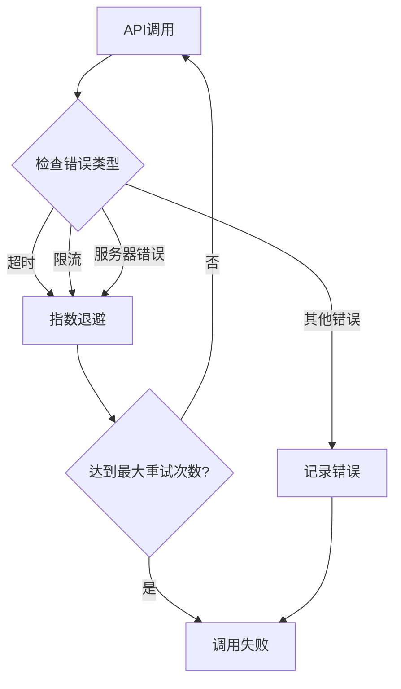

**图表来源**
- [dashscope_client.py](file://api/dashscope_client.py#L380-L390)

**章节来源**
- [dashscope_client.py](file://api/dashscope_client.py#L380-L407)

## 总结

deepwiki-open项目的通义千问客户端提供了一个完整、可靠的阿里云DashScope API封装解决方案。通过标准化的ModelClient接口，该客户端成功地与项目的RAG系统集成，为用户提供强大的中文场景下文档生成和智能问答能力。

主要特性包括：
- **统一接口**: 通过ModelClient接口实现标准化调用
- **灵活配置**: 支持多种模型和参数配置
- **完善认证**: 基于环境变量的安全认证机制
- **错误处理**: 完善的错误处理和重试机制
- **性能优化**: 支持同步和异步调用，以及批处理优化

该客户端的设计充分考虑了生产环境的需求，具有良好的扩展性和维护性，为deepwiki-open项目提供了稳定可靠的通义千问模型接入能力。