# HTTP流通信机制

<cite>
**本文档引用的文件**
- [simple_chat.py](file://api/simple_chat.py)
- [main.py](file://api/main.py)
- [api.py](file://api/api.py)
- [prompts.py](file://api/prompts.py)
- [data_pipeline.py](file://api/data_pipeline.py)
- [rag.py](file://api/rag.py)
- [openai_client.py](file://api/openai_client.py)
- [openrouter_client.py](file://api/openrouter_client.py)
- [bedrock_client.py](file://api/bedrock_client.py)
- [azureai_client.py](file://api/azureai_client.py)
- [ollama_patch.py](file://api/ollama_patch.py)
- [config.py](file://api/config.py)
</cite>

## 目录
1. [简介](#简介)
2. [项目架构概览](#项目架构概览)
3. [核心组件分析](#核心组件分析)
4. [HTTP流通信机制](#http流通信机制)
5. [请求处理流程](#请求处理流程)
6. [多提供商支持](#多提供商支持)
7. [错误处理与降级机制](#错误处理与降级机制)
8. [性能优化策略](#性能优化策略)
9. [故障排除指南](#故障排除指南)
10. [总结](#总结)

## 简介

deepwiki-open是一个基于FastAPI构建的智能聊天系统，专门设计用于处理代码仓库的问答请求。该系统的核心优势在于其强大的HTTP流通信机制，能够实现实时、高效的流式响应传输，同时支持多种AI提供商和智能降级策略。

本文档将深入解析`simple_chat.py`中`chat_completions_stream`函数的实现细节，包括其如何通过FastAPI的`StreamingResponse`实现流式传输，以及如何处理复杂的请求结构和多提供商集成。

## 项目架构概览

deepwiki-open采用模块化架构设计，主要包含以下核心模块：

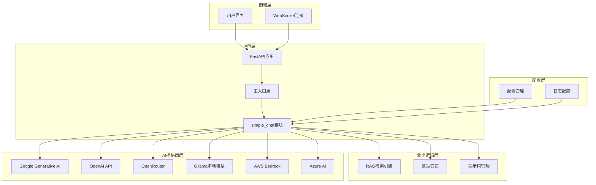

**图表来源**
- [main.py](file://api/main.py#L1-L80)
- [api.py](file://api/api.py#L1-L635)
- [simple_chat.py](file://api/simple_chat.py#L1-L690)

**章节来源**
- [main.py](file://api/main.py#L1-L80)
- [api.py](file://api/api.py#L1-L635)

## 核心组件分析

### ChatCompletionRequest模型

`ChatCompletionRequest`是系统的核心数据模型，定义了完整的请求结构：

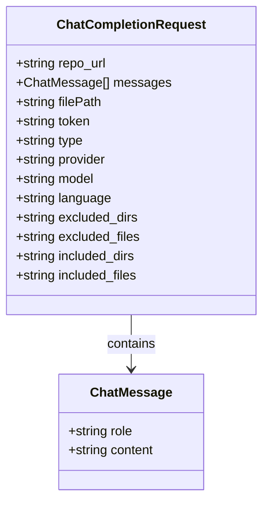

**图表来源**
- [simple_chat.py](file://api/simple_chat.py#L51-L73)

该模型支持以下关键功能：
- **仓库信息管理**：通过`repo_url`和`type`参数指定目标仓库
- **消息历史维护**：通过`messages`列表维护对话上下文
- **文件级查询**：通过`filePath`参数支持特定文件的上下文查询
- **访问控制**：通过`token`参数支持私有仓库访问
- **多语言支持**：通过`language`参数支持国际化
- **过滤配置**：通过`excluded_dirs`、`excluded_files`等参数自定义处理范围

**章节来源**
- [simple_chat.py](file://api/simple_chat.py#L51-L73)

### 流式响应机制

系统通过FastAPI的`StreamingResponse`实现真正的流式传输：

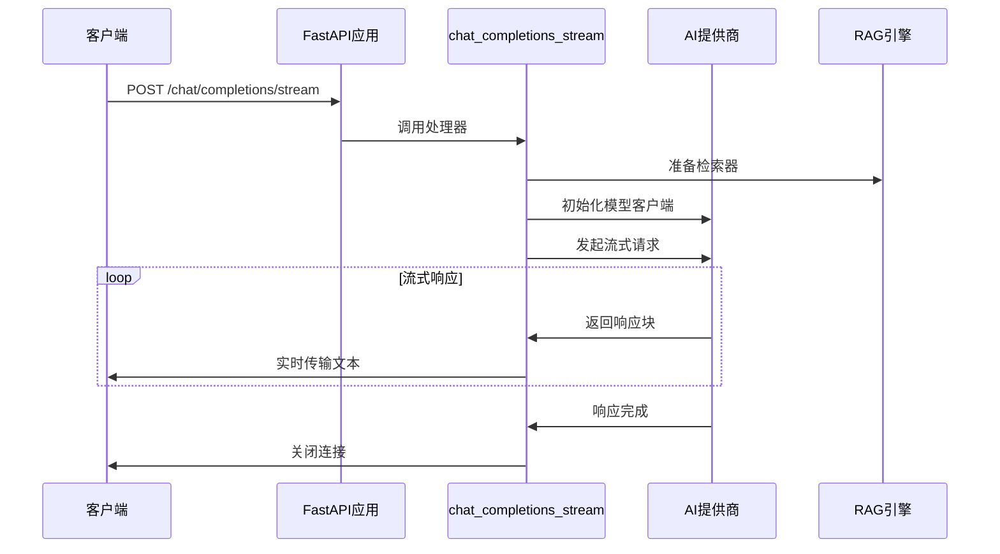

**图表来源**
- [simple_chat.py](file://api/simple_chat.py#L447-L677)

**章节来源**
- [simple_chat.py](file://api/simple_chat.py#L447-L677)

## HTTP流通信机制

### FastAPI StreamingResponse实现

`chat_completions_stream`函数的核心是通过异步生成器实现流式响应：

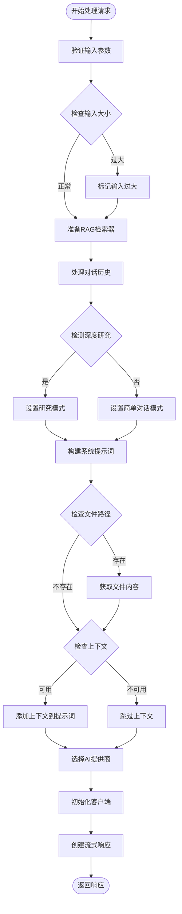

**图表来源**
- [simple_chat.py](file://api/simple_chat.py#L75-L446)

**章节来源**
- [simple_chat.py](file://api/simple_chat.py#L75-L446)

### 异步流式处理

系统实现了统一的异步流式处理接口，支持所有AI提供商：

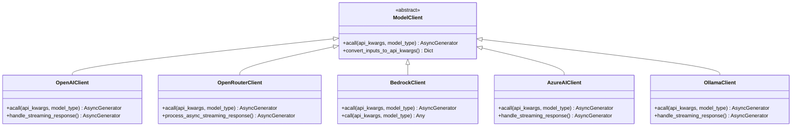

**图表来源**
- [openai_client.py](file://api/openai_client.py#L120-L630)
- [openrouter_client.py](file://api/openrouter_client.py#L19-L526)
- [bedrock_client.py](file://api/bedrock_client.py#L20-L318)
- [azureai_client.py](file://api/azureai_client.py#L118-L488)
- [ollama_patch.py](file://api/ollama_patch.py#L62-L105)

**章节来源**
- [openai_client.py](file://api/openai_client.py#L120-L630)
- [openrouter_client.py](file://api/openrouter_client.py#L19-L526)
- [bedrock_client.py](file://api/bedrock_client.py#L20-L318)
- [azureai_client.py](file://api/azureai_client.py#L118-L488)
- [ollama_patch.py](file://api/ollama_patch.py#L62-L105)

## 请求处理流程

### 输入验证与预处理

系统在接收到请求后会进行严格的输入验证：

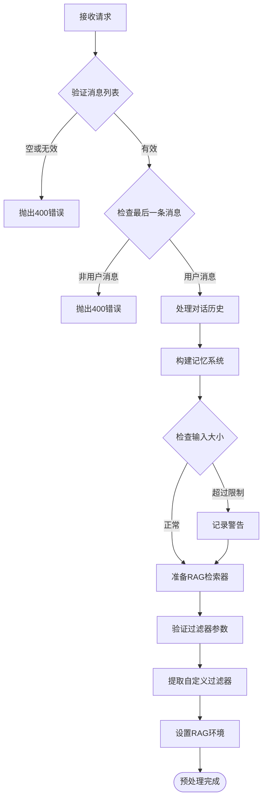

**图表来源**
- [simple_chat.py](file://api/simple_chat.py#L130-L141)

**章节来源**
- [simple_chat.py](file://api/simple_chat.py#L130-L141)

### RAG检索与上下文构建

系统实现了智能的RAG（检索增强生成）机制：

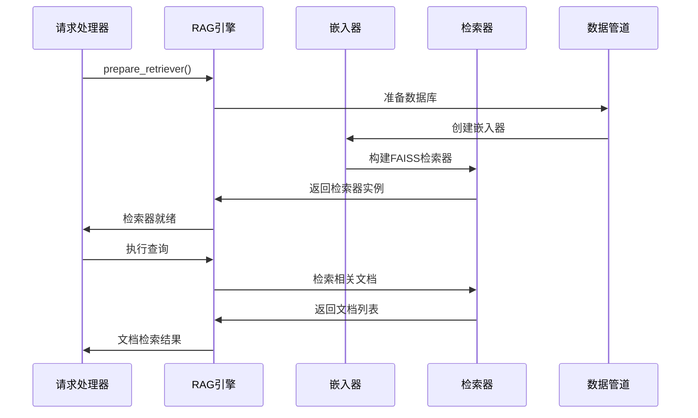

**图表来源**
- [rag.py](file://api/rag.py#L345-L446)
- [data_pipeline.py](file://api/data_pipeline.py#L144-L800)

**章节来源**
- [rag.py](file://api/rag.py#L345-L446)
- [data_pipeline.py](file://api/data_pipeline.py#L144-L800)

### 提示词动态生成

系统根据不同的使用场景动态生成提示词：

| 场景类型 | 提示词模板 | 特点 |
|---------|-----------|------|
| 简单对话 | `SIMPLE_CHAT_SYSTEM_PROMPT` | 直接回答，简洁明了 |
| 首次深度研究 | `DEEP_RESEARCH_FIRST_ITERATION_PROMPT` | 制定研究计划，明确目标 |
| 中间迭代研究 | `DEEP_RESEARCH_INTERMEDIATE_ITERATION_PROMPT` | 更新研究进展，深化分析 |
| 最终深度研究 | `DEEP_RESEARCH_FINAL_ITERATION_PROMPT` | 总结研究成果，提供结论 |

**章节来源**
- [prompts.py](file://api/prompts.py#L59-L191)

## 多提供商支持

### 支持的AI提供商

系统支持多个主流AI提供商，每个都有其独特的特性：

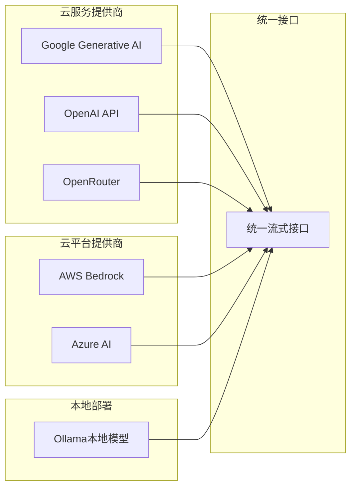

**图表来源**
- [config.py](file://api/config.py#L55-L64)

### 提供商特定处理

每个提供商都有其特定的处理逻辑：

| 提供商 | 特殊处理 | 错误处理 |
|-------|---------|---------|
| OpenAI | 支持流式和非流式调用 | 自动重试机制 |
| OpenRouter | 异步流式处理，XML格式修复 | API密钥验证 |
| Bedrock | AWS认证，模型格式转换 | 客户端错误重试 |
| Azure AI | Azure AD认证，版本管理 | 认证失败处理 |
| Ollama | 单文档处理，本地模型检查 | 模型存在性验证 |

**章节来源**
- [openai_client.py](file://api/openai_client.py#L400-L630)
- [openrouter_client.py](file://api/openrouter_client.py#L112-L526)
- [bedrock_client.py](file://api/bedrock_client.py#L226-L318)
- [azureai_client.py](file://api/azureai_client.py#L400-L488)
- [ollama_patch.py](file://api/ollama_patch.py#L21-L105)

## 错误处理与降级机制

### Token限制错误处理

系统实现了智能的降级机制来处理token限制问题：

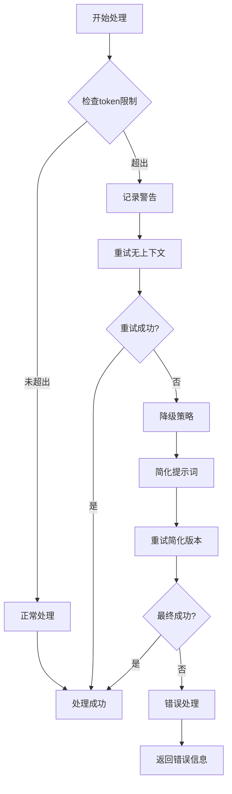

**图表来源**
- [simple_chat.py](file://api/simple_chat.py#L529-L676)

### 多层次错误恢复

系统实现了多层次的错误恢复机制：

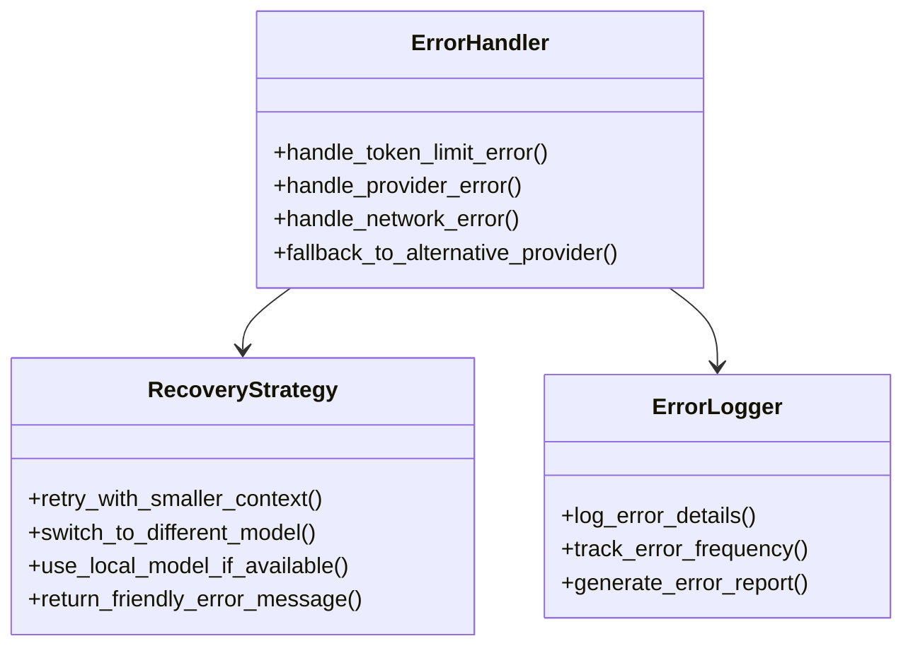

**图表来源**
- [simple_chat.py](file://api/simple_chat.py#L529-L676)

**章节来源**
- [simple_chat.py](file://api/simple_chat.py#L529-L676)

## 性能优化策略

### 输入大小监控

系统实现了智能的输入大小监控机制：

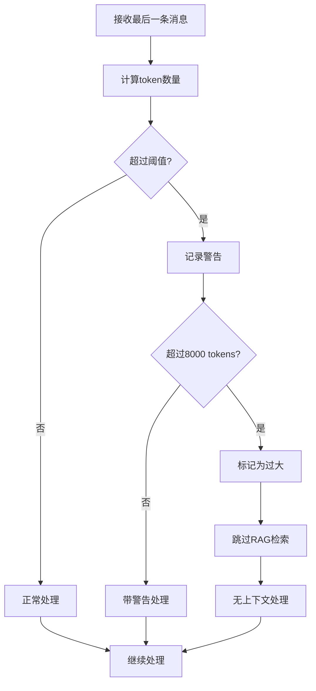

**图表来源**
- [simple_chat.py](file://api/simple_chat.py#L79-L88)

### 缓存与优化

系统通过多种方式优化性能：

| 优化策略 | 实现方式 | 效果 |
|---------|---------|------|
| 对话历史缓存 | 内存中的对话记忆系统 | 减少重复计算 |
| 文件内容缓存 | 临时存储文件内容 | 避免重复下载 |
| 模型配置缓存 | 预加载模型配置 | 减少初始化时间 |
| 连接池管理 | 复用HTTP连接 | 降低连接开销 |

**章节来源**
- [simple_chat.py](file://api/simple_chat.py#L138-L149)

## 故障排除指南

### 常见问题诊断

以下是常见问题及其解决方案：

| 问题类型 | 症状 | 可能原因 | 解决方案 |
|---------|------|---------|---------|
| 流式响应中断 | 响应突然停止 | Token限制、网络问题 | 启用降级机制 |
| API密钥错误 | 认证失败 | 密钥配置错误 | 检查环境变量 |
| 模型不可用 | 请求被拒绝 | 模型未部署或配额耗尽 | 切换到备用模型 |
| RAG检索失败 | 无上下文信息 | 嵌入向量不一致 | 清理缓存重新生成 |

### 日志分析

系统提供了详细的日志记录机制：

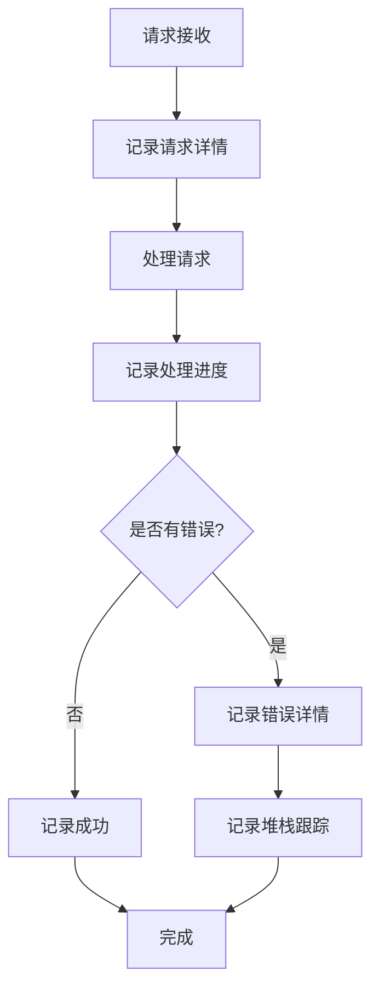

**图表来源**
- [simple_chat.py](file://api/simple_chat.py#L31-L32)

**章节来源**
- [simple_chat.py](file://api/simple_chat.py#L31-L32)

## 总结

deepwiki-open的HTTP流通信机制展现了现代AI应用的最佳实践。通过精心设计的架构，系统实现了：

1. **实时流式响应**：通过FastAPI的`StreamingResponse`提供即时的用户体验
2. **多提供商兼容**：统一接口支持Google、OpenAI、Ollama等多种AI服务
3. **智能降级策略**：在遇到错误时自动切换到备用方案
4. **性能优化**：通过缓存、令牌监控等机制确保高效运行
5. **健壮的错误处理**：多层次的错误恢复机制保证系统稳定性

这种设计不仅满足了当前的功能需求，还为未来的扩展和优化奠定了坚实的基础。开发者可以轻松地添加新的AI提供商，或者改进现有的处理逻辑，而无需大幅修改核心架构。