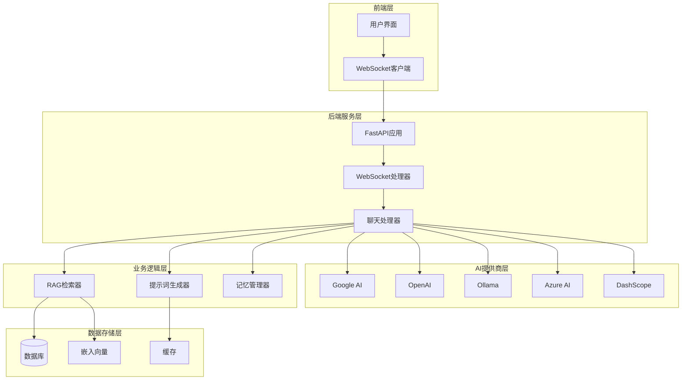
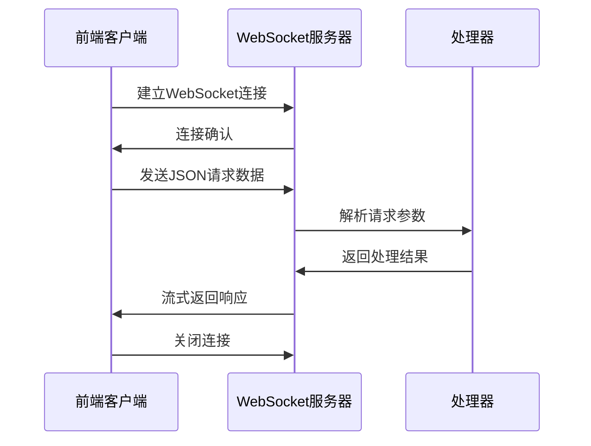
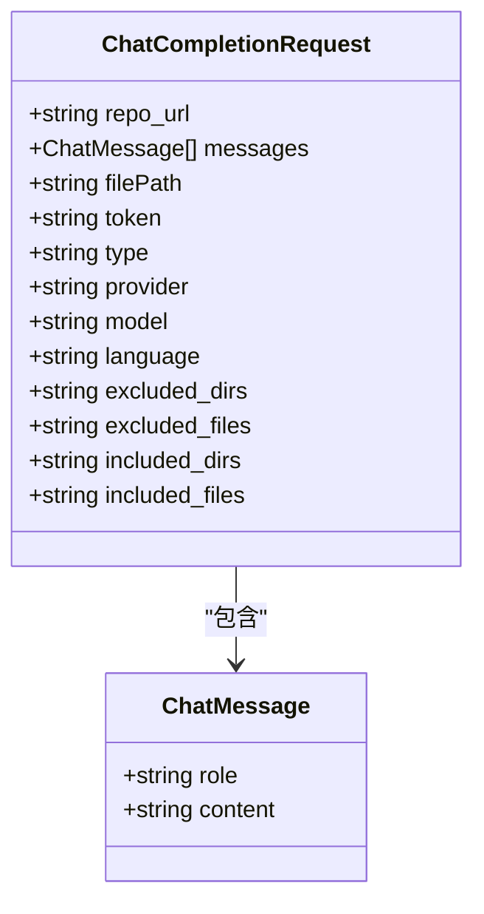
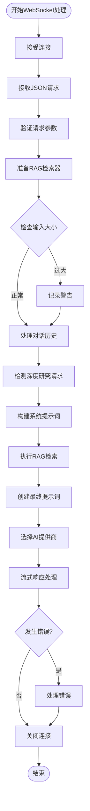
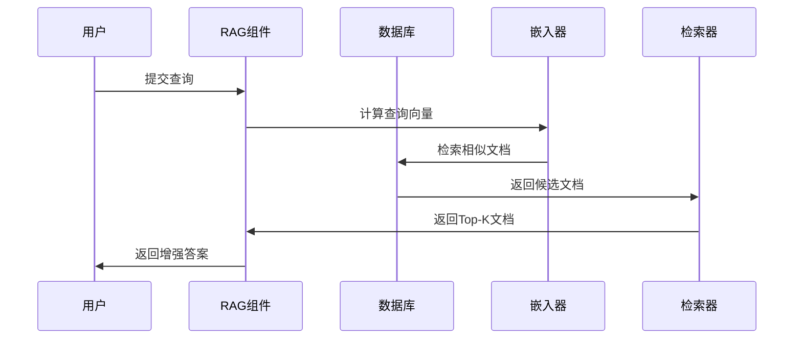
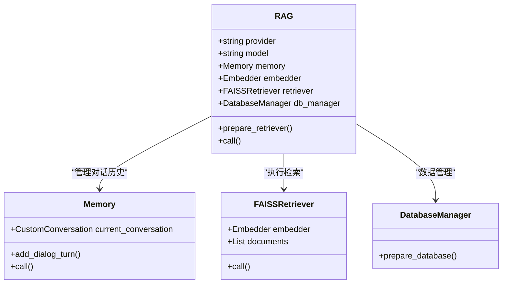
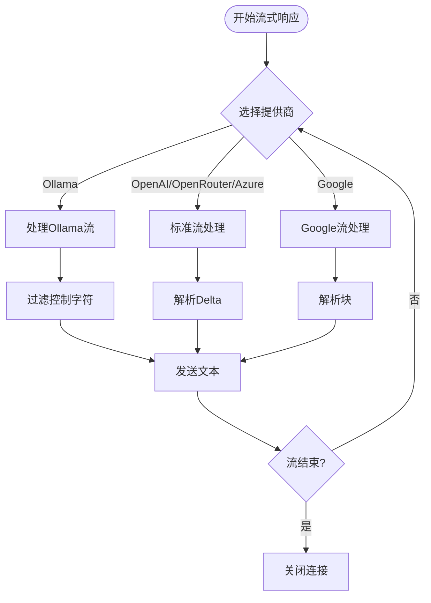
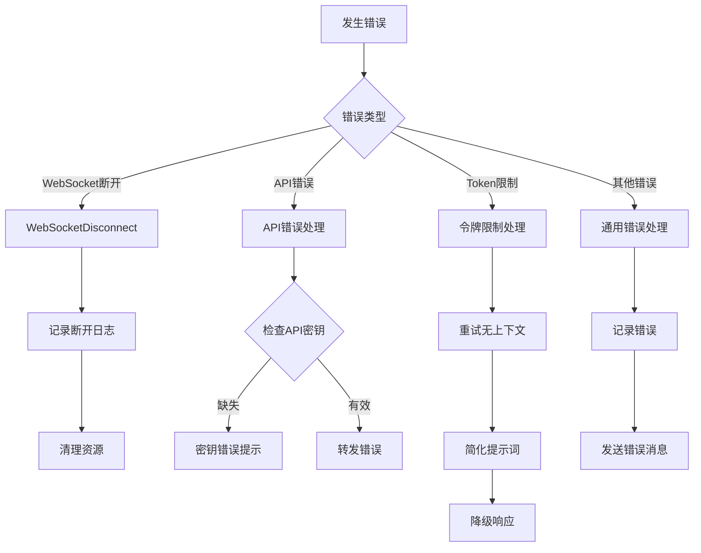
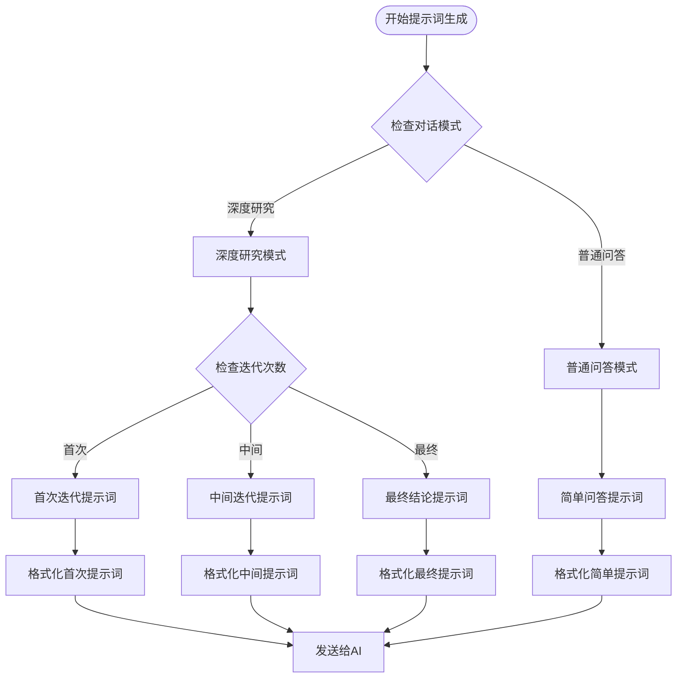

# WebSocket通信机制详尽文档

<cite>
**本文档引用的文件**
- [websocket_wiki.py](file://api/websocket_wiki.py)
- [simple_chat.py](file://api/simple_chat.py)
- [api.py](file://api/api.py)
- [main.py](file://api/main.py)
- [websocketClient.ts](file://src/utils/websocketClient.ts)
- [config.py](file://api/config.py)
- [rag.py](file://api/rag.py)
- [prompts.py](file://api/prompts.py)
</cite>

## 目录
1. [简介](#简介)
2. [项目架构概览](#项目架构概览)
3. [WebSocket连接建立](#websocket连接建立)
4. [ChatCompletionRequest模型](#chatcompletionrequest模型)
5. [handle_websocket_chat函数详解](#handle_websocket_chat函数详解)
6. [RAG检索机制](#rag检索机制)
7. [多提供商AI集成](#多提供商ai集成)
8. [错误处理与降级方案](#错误处理与降级方案)
9. [系统提示词动态生成](#系统提示词动态生成)
10. [性能优化策略](#性能优化策略)
11. [故障排除指南](#故障排除指南)
12. [总结](#总结)

## 简介

deepwiki-open项目实现了基于WebSocket协议的全双工实时通信机制，为用户提供流畅的聊天交互体验。该系统通过WebSocket协议替代传统的HTTP长轮询或短轮询方式，实现了真正的实时双向通信，特别适用于需要即时响应的AI对话场景。

WebSocket通信机制的核心优势包括：
- **全双工通信**：客户端和服务器可以同时发送和接收消息
- **低延迟**：避免了HTTP请求的完整往返时间
- **资源效率**：减少了不必要的连接开销和状态维护
- **实时性**：支持即时的消息推送和流式响应

## 项目架构概览

deepwiki-open的WebSocket通信架构采用分层设计，包含前端客户端、后端服务端和多个AI提供商适配层。



**图表来源**
- [api.py](file://api/api.py#L400-L401)
- [websocket_wiki.py](file://api/websocket_wiki.py#L52-L770)

**章节来源**
- [api.py](file://api/api.py#L1-L635)
- [websocket_wiki.py](file://api/websocket_wiki.py#L1-L770)

## WebSocket连接建立

### 前端WebSocket客户端

前端使用TypeScript实现WebSocket客户端，提供简洁的连接管理和事件处理接口。



**图表来源**
- [websocketClient.ts](file://src/utils/websocketClient.ts#L43-L86)

### 后端WebSocket端点配置

后端FastAPI应用通过`add_websocket_route`方法注册WebSocket端点，支持并发连接处理。

**章节来源**
- [api.py](file://api/api.py#L400-L401)
- [websocketClient.ts](file://src/utils/websocketClient.ts#L1-L86)

## ChatCompletionRequest模型

ChatCompletionRequest模型定义了WebSocket请求的数据结构，包含了完整的对话上下文和配置参数。

### 模型字段详解

| 字段名 | 类型 | 必需 | 描述 |
|--------|------|------|------|
| repo_url | string | 是 | 要查询的仓库URL |
| messages | ChatMessage[] | 是 | 对话消息列表 |
| filePath | string? | 否 | 可选的文件路径，用于特定文件上下文 |
| token | string? | 否 | 私有仓库访问令牌 |
| type | string? | 否 | 仓库类型（github、gitlab、bitbucket，默认github） |
| provider | string? | 否 | AI提供商（google、openai、openrouter、ollama、azure、dashscope，默认google） |
| model | string? | 否 | 指定提供商的模型名称 |
| language | string? | 否 | 内容生成语言（默认en） |
| excluded_dirs | string? | 否 | 排除目录的逗号分隔列表 |
| excluded_files | string? | 否 | 排除文件模式的逗号分隔列表 |
| included_dirs | string? | 否 | 包含目录的逗号分隔列表 |
| included_files | string? | 否 | 包含文件模式的逗号分隔列表 |

### ChatMessage模型

每个对话消息包含角色和内容两个核心字段：



**图表来源**
- [websocket_wiki.py](file://api/websocket_wiki.py#L27-L51)

**章节来源**
- [websocket_wiki.py](file://api/websocket_wiki.py#L27-L51)

## handle_websocket_chat函数详解

`handle_websocket_chat`函数是WebSocket通信的核心处理器，实现了完整的实时对话流程。

### 函数执行流程



**图表来源**
- [websocket_wiki.py](file://api/websocket_wiki.py#L52-L770)

### 核心处理步骤

#### 1. 连接接受与请求解析
函数首先接受WebSocket连接，然后解析传入的JSON请求数据为ChatCompletionRequest对象。

#### 2. 输入大小验证
系统会计算最后一条消息的token数量，如果超过8000个token，则标记为输入过大，并在后续处理中采取相应措施。

#### 3. RAG检索器初始化
根据请求参数创建RAG实例，配置检索器参数，包括排除和包含的目录/文件模式。

#### 4. 对话历史处理
遍历所有消息，将用户消息和助手回复配对存储到对话记忆中，为上下文理解提供基础。

#### 5. 深度研究模式检测
系统会扫描消息内容，识别是否包含"[DEEP RESEARCH]"标签，确定是否进入多轮深度研究模式。

#### 6. 提示词构建
根据不同的对话模式（普通问答或深度研究）动态生成系统提示词，确保AI理解当前的交互语境。

**章节来源**
- [websocket_wiki.py](file://api/websocket_wiki.py#L52-L770)

## RAG检索机制

RAG（Retrieval-Augmented Generation）机制是系统的核心功能之一，通过从知识库中检索相关信息来增强AI回答的质量。

### RAG工作流程



**图表来源**
- [rag.py](file://api/rag.py#L416-L446)

### RAG组件架构



**图表来源**
- [rag.py](file://api/rag.py#L144-L446)

### 嵌入向量验证

系统实现了严格的嵌入向量验证机制，确保所有文档具有相同维度的向量表示：

- **第一遍扫描**：收集所有文档的嵌入向量尺寸
- **统计分析**：找出最常见的正确尺寸作为目标尺寸
- **第二遍过滤**：移除所有不匹配目标尺寸的文档
- **错误处理**：提供详细的错误信息和调试线索

**章节来源**
- [rag.py](file://api/rag.py#L1-L446)

## 多提供商AI集成

系统支持多个AI提供商，每个提供商都有其特定的API调用方式和参数格式。

### 支持的提供商

| 提供商 | 客户端类 | 特殊处理 | 适用场景 |
|--------|----------|----------|----------|
| Google | GoogleGenAIClient | 标准生成配置 | 通用对话、代码分析 |
| OpenAI | OpenAIClient | 流式响应处理 | 高质量回答、复杂推理 |
| OpenRouter | OpenRouterClient | API密钥验证 | 多模型聚合 |
| Ollama | OllamaClient | 本地部署支持 | 离线使用、隐私保护 |
| Azure AI | AzureAIClient | 企业级配置 | 企业环境、合规要求 |
| DashScope | DashscopeClient | 阿里云生态 | 国内用户、本地化 |

### 异步流式响应处理



**图表来源**
- [websocket_wiki.py](file://api/websocket_wiki.py#L542-L770)

### 提供商特定配置

每个提供商都有其独特的配置参数和处理逻辑：

- **Ollama**：需要添加`/no_think`指令，特殊字符过滤
- **OpenAI/OpenRouter**：标准流式响应处理
- **Azure AI**：企业级安全配置
- **Google**：生成配置参数设置

**章节来源**
- [websocket_wiki.py](file://api/websocket_wiki.py#L431-L770)

## 错误处理与降级方案

系统实现了多层次的错误处理和降级机制，确保在各种异常情况下都能提供可用的服务。

### 错误分类与处理



**图表来源**
- [websocket_wiki.py](file://api/websocket_wiki.py#L761-L769)

### 降级策略

#### 1. 令牌限制降级
当输入超出最大令牌限制时，系统会自动尝试以下降级方案：

- **移除检索上下文**：不再使用RAG检索的信息
- **简化提示词**：移除对话历史和文件内容
- **直接回答**：基于基本的系统提示词进行回答

#### 2. API错误处理
对于各种API错误，系统提供具体的错误信息和解决方案：

- **OpenAI API错误**：提示检查API密钥配置
- **Azure AI错误**：提示检查企业级配置
- **网络错误**：提供重试建议

#### 3. 嵌入向量错误
当遇到嵌入向量问题时：

- **尺寸不一致**：自动过滤不匹配的文档
- **无效向量**：跳过有问题的文档
- **错误报告**：提供详细的诊断信息

**章节来源**
- [websocket_wiki.py](file://api/websocket_wiki.py#L761-L770)

## 系统提示词动态生成

系统能够根据不同的对话场景动态生成合适的系统提示词，这是实现高质量AI交互的关键技术。

### 提示词生成策略



**图表来源**
- [prompts.py](file://api/prompts.py#L59-L191)

### 深度研究模式提示词

深度研究模式支持多轮对话，每一轮都有特定的目标和格式：

#### 首次迭代
- **目标**：制定研究计划，明确研究主题
- **格式**：包含"## Research Plan"和"## Next Steps"
- **内容**：概述研究方法、关键方面和下一步计划

#### 中间迭代
- **目标**：深入研究特定方面，填补知识空白
- **格式**：包含"## Research Update {iteration}"
- **内容**：新的发现、未解决的问题和进一步的研究方向

#### 最终迭代
- **目标**：综合所有发现，提供完整结论
- **格式**：包含"## Final Conclusion"
- **内容**：全面的分析、具体证据和行动建议

### 普通问答模式提示词

普通问答模式专注于提供准确、简洁的答案：

- **直接回答**：不使用Markdown标题或代码块
- **简洁表达**：避免冗余解释和填充词
- **事实导向**：严格基于现有代码或文档回答
- **技术精确**：包含具体的代码引用和实现细节

**章节来源**
- [prompts.py](file://api/prompts.py#L1-L191)

## 性能优化策略

为了确保WebSocket通信的高效性和稳定性，系统采用了多种性能优化策略。

### 连接管理优化

- **并发连接**：支持多个客户端同时连接
- **资源池化**：复用AI客户端连接
- **内存管理**：及时清理对话历史和临时数据

### 响应优化

- **流式传输**：实时发送AI生成的文本片段
- **缓冲控制**：合理控制输出缓冲区大小
- **压缩传输**：对大量文本进行适当的压缩

### 缓存策略

- **对话历史缓存**：短期缓存最近的对话历史
- **嵌入向量缓存**：缓存常用的文档嵌入
- **模型响应缓存**：缓存相似查询的结果

### 资源监控

系统提供了健康检查端点，监控关键指标：

- **服务状态**：检查API服务的运行状态
- **内存使用**：监控内存消耗情况
- **连接数**：跟踪活跃的WebSocket连接数
- **错误率**：统计各类错误的发生频率

## 故障排除指南

### 常见问题及解决方案

#### 1. WebSocket连接失败
**症状**：客户端无法建立WebSocket连接
**可能原因**：
- 服务器未启动或端口被占用
- CORS配置问题
- 网络防火墙阻止连接

**解决方案**：
- 检查服务器日志确认服务状态
- 验证CORS配置是否允许跨域请求
- 检查网络连接和防火墙设置

#### 2. API密钥认证失败
**症状**：收到API密钥相关的错误消息
**可能原因**：
- 环境变量未正确设置
- API密钥已过期或无效
- 提供商账户余额不足

**解决方案**：
- 检查`.env`文件中的API密钥配置
- 验证API密钥的有效性
- 查看提供商账户状态

#### 3. 令牌限制错误
**症状**：收到"token limit exceeded"错误
**可能原因**：
- 输入文本过长
- 对话历史过长
- 上下文信息过多

**解决方案**：
- 简化输入问题或缩短对话历史
- 使用更短的模型
- 分多次提问

#### 4. 嵌入向量错误
**症状**："No valid documents with embeddings found"错误
**可能原因**：
- 文档预处理失败
- 嵌入模型配置错误
- 文件编码问题

**解决方案**：
- 检查文档预处理日志
- 验证嵌入模型配置
- 确认文件编码格式

### 调试技巧

#### 1. 启用详细日志
```python
import logging
logging.basicConfig(level=logging.DEBUG)
```

#### 2. 监控网络流量
使用浏览器开发者工具或网络抓包工具监控WebSocket通信

#### 3. 检查环境变量
确认所有必要的环境变量都已正确设置

#### 4. 验证配置文件
检查`generator.json`和`embedder.json`配置文件的正确性

**章节来源**
- [websocket_wiki.py](file://api/websocket_wiki.py#L761-L770)
- [config.py](file://api/config.py#L1-L388)

## 总结

deepwiki-open的WebSocket通信机制是一个高度集成的实时对话系统，通过以下关键技术实现了优秀的用户体验：

### 核心特性

1. **全双工实时通信**：基于WebSocket协议的双向通信，提供即时响应
2. **智能上下文管理**：通过RAG机制和对话历史管理，保持对话连贯性
3. **多提供商支持**：统一接口支持Google、OpenAI、Ollama等多个AI提供商
4. **动态提示词生成**：根据不同场景自动生成合适的系统提示词
5. **健壮的错误处理**：多层次的错误处理和降级机制确保服务稳定性

### 技术优势

- **低延迟**：避免HTTP请求的完整往返时间
- **高并发**：支持多个客户端同时连接
- **可扩展性**：模块化设计便于添加新的AI提供商
- **容错性**：完善的错误处理和降级策略

### 应用价值

该WebSocket通信机制为deepwiki-open项目提供了强大的实时对话能力，使用户能够获得流畅、准确、个性化的AI辅助编程体验。通过全双工通信和智能上下文管理，系统能够理解复杂的编程场景，提供有针对性的技术指导和代码分析。

未来的发展方向包括：
- 支持更多的AI提供商和模型
- 优化大文件和复杂项目的处理能力
- 增强多语言支持和本地化功能
- 提供更丰富的对话交互形式