# 实时通信机制

<cite>
**本文档引用的文件**
- [api/simple_chat.py](file://api/simple_chat.py)
- [api/websocket_wiki.py](file://api/websocket_wiki.py)
- [api/api.py](file://api/api.py)
- [api/main.py](file://api/main.py)
- [api/prompts.py](file://api/prompts.py)
- [api/data_pipeline.py](file://api/data_pipeline.py)
- [api/rag.py](file://api/rag.py)
- [src/utils/websocketClient.ts](file://src/utils/websocketClient.ts)
- [src/app/api/chat/stream/route.ts](file://src/app/api/chat/stream/route.ts)
- [src/components/Ask.tsx](file://src/components/Ask.tsx)
</cite>

## 目录
1. [简介](#简介)
2. [项目架构概览](#项目架构概览)
3. [ChatCompletionRequest模型设计](#chatcompletionrequest模型设计)
4. [HTTP流式通信机制](#http流式通信机制)
5. [WebSocket实时通信机制](#websocket实时通信机制)
6. [通信方式对比分析](#通信方式对比分析)
7. [系统错误处理与降级方案](#系统错误处理与降级方案)
8. [前端集成与客户端实现](#前端集成与客户端实现)
9. [性能优化策略](#性能优化策略)
10. [总结](#总结)

## 简介

deepwiki-open项目实现了两种主要的实时通信机制：基于HTTP流的传统通信方式和基于WebSocket的现代实时通信方式。这两种机制都支持与多个AI提供商（Google、OpenAI、Ollama等）的异步流式响应集成，并提供了优雅的错误处理和降级方案。

## 项目架构概览

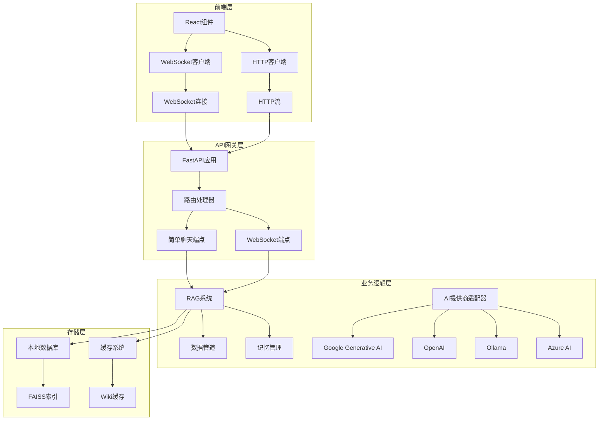

**图表来源**
- [api/api.py](file://api/api.py#L1-L50)
- [src/utils/websocketClient.ts](file://src/utils/websocketClient.ts#L1-L86)

## ChatCompletionRequest模型设计

### 模型结构定义

ChatCompletionRequest模型是整个通信机制的核心数据结构，定义了请求的所有必要参数：

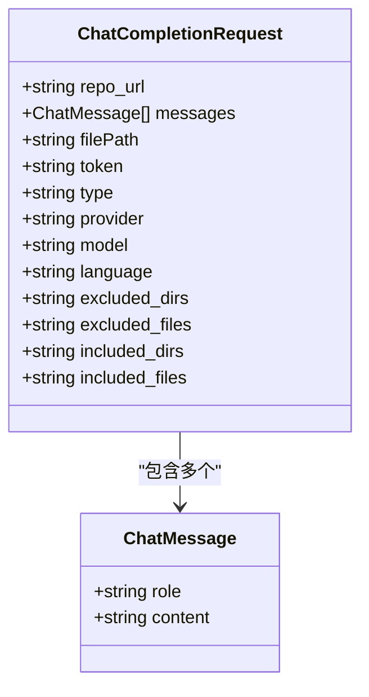

**图表来源**
- [api/simple_chat.py](file://api/simple_chat.py#L55-L74)
- [api/websocket_wiki.py](file://api/websocket_wiki.py#L32-L51)

### 关键字段说明

| 字段名 | 类型 | 必需 | 描述 |
|--------|------|------|------|
| repo_url | string | 是 | 要查询的仓库URL |
| messages | List[ChatMessage] | 是 | 对话消息列表 |
| filePath | string | 否 | 仓库中要包含在提示中的文件路径 |
| token | string | 否 | 私有仓库的个人访问令牌 |
| type | string | 否 | 仓库类型（github、gitlab、bitbucket） |
| provider | string | 否 | AI提供商（google、openai、openrouter、ollama、azure） |
| model | string | 否 | 指定提供商的模型名称 |
| language | string | 否 | 内容生成的语言代码 |

**章节来源**
- [api/simple_chat.py](file://api/simple_chat.py#L55-L74)
- [api/websocket_wiki.py](file://api/websocket_wiki.py#L32-L51)

## HTTP流式通信机制

### 实现原理

HTTP流式通信通过FastAPI的StreamingResponse实现，支持服务器发送事件（Server-Sent Events）格式的数据流传输。

### 核心处理流程

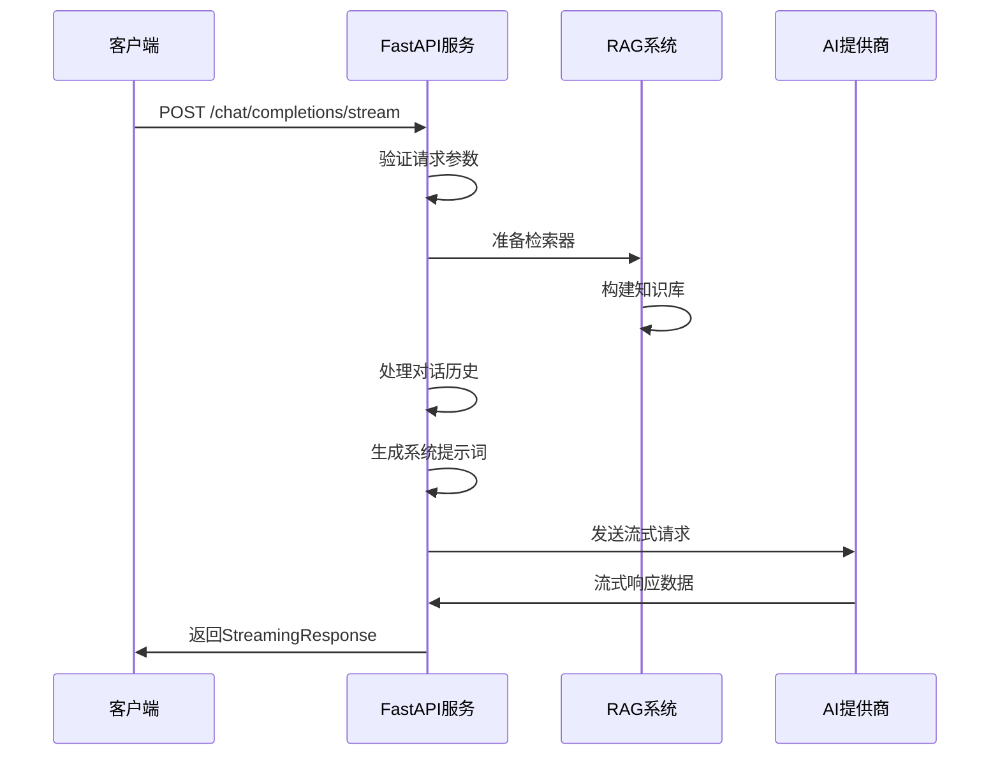

**图表来源**
- [api/simple_chat.py](file://api/simple_chat.py#L75-L678)

### 输入验证与预处理

系统在接收到请求后会进行严格的输入验证：

1. **Token大小检查**：使用`count_tokens()`函数检查输入文本的token数量
2. **消息格式验证**：确保消息列表不为空且最后一个消息来自用户
3. **对话历史处理**：构建完整的对话历史记录

### RAG检索与上下文构建

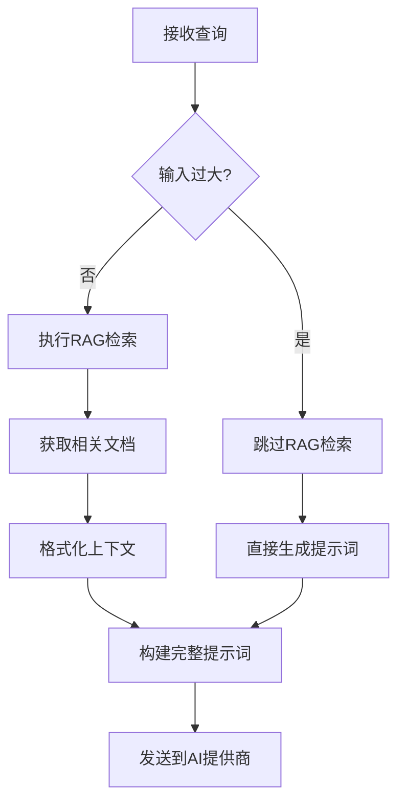

**图表来源**
- [api/simple_chat.py](file://api/simple_chat.py#L180-L238)

**章节来源**
- [api/simple_chat.py](file://api/simple_chat.py#L75-L678)

## WebSocket实时通信机制

### 连接建立与消息处理

WebSocket通信提供了更高效的实时交互体验，支持双向通信和即时响应。

### 连接生命周期管理

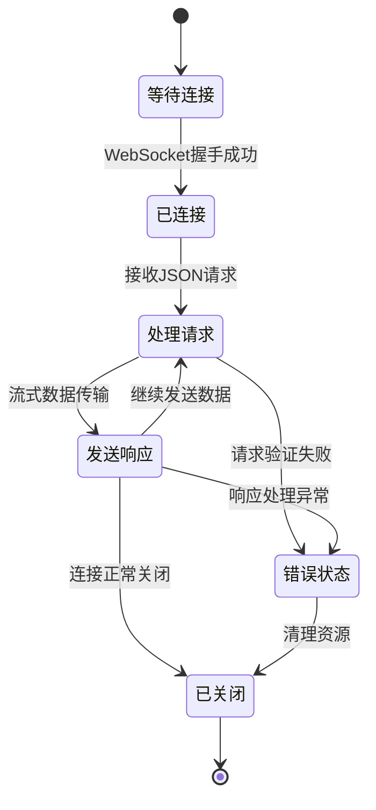

**图表来源**
- [api/websocket_wiki.py](file://api/websocket_wiki.py#L52-L770)

### 异步消息处理

WebSocket端点采用异步处理模式，能够同时处理多个并发连接：

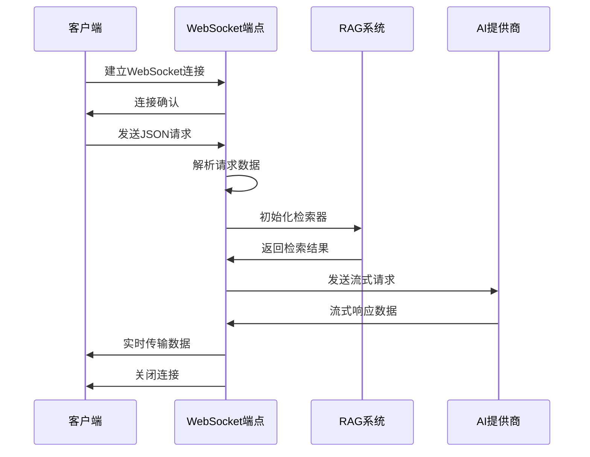

**图表来源**
- [api/websocket_wiki.py](file://api/websocket_wiki.py#L52-L770)

**章节来源**
- [api/websocket_wiki.py](file://api/websocket_wiki.py#L52-L770)

## 通信方式对比分析

### 技术特性对比

| 特性 | HTTP流式 | WebSocket |
|------|----------|-----------|
| 连接类型 | 单向流式传输 | 双向实时通信 |
| 连接持久性 | 短连接 | 长连接 |
| 资源消耗 | 较低 | 较高 |
| 实时性 | 延迟较高 | 实时响应 |
| 并发支持 | 依赖HTTP/2 | 原生支持 |
| 错误恢复 | 重试机制 | 自动重连 |

### 使用场景选择

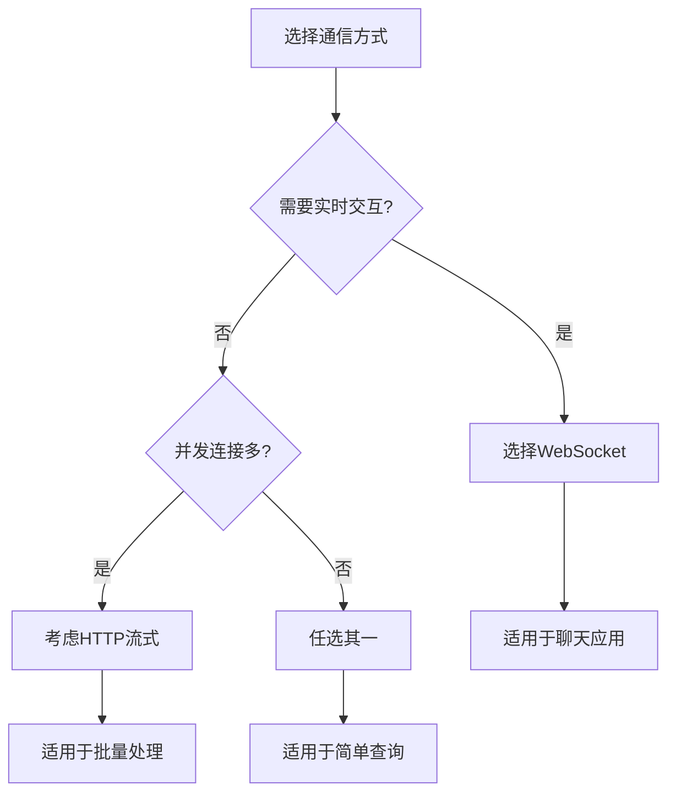

**章节来源**
- [api/simple_chat.py](file://api/simple_chat.py#L1-L50)
- [api/websocket_wiki.py](file://api/websocket_wiki.py#L1-L50)

## 系统错误处理与降级方案

### Token限制错误处理

系统实现了智能的token限制检测和自动降级机制：

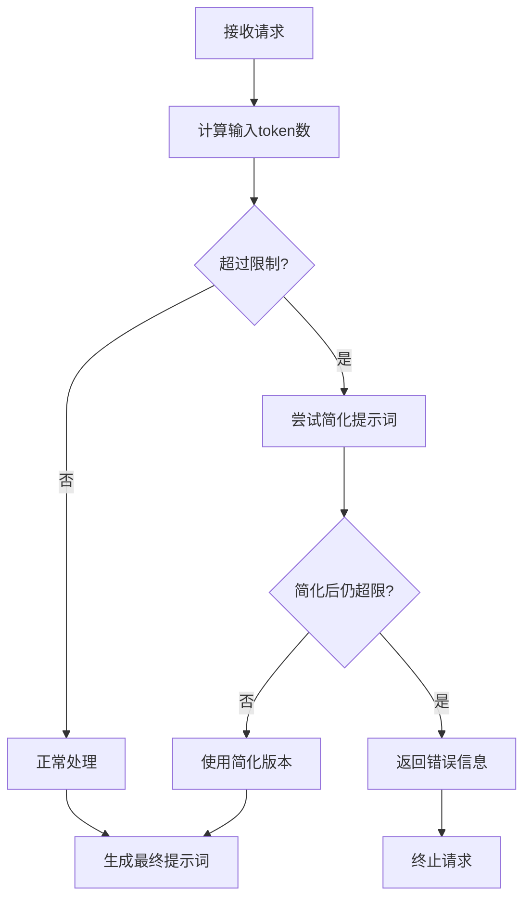

**图表来源**
- [api/simple_chat.py](file://api/simple_chat.py#L529-L671)

### 多提供商错误恢复

系统为每个AI提供商都实现了专门的错误处理和恢复机制：

| 提供商 | 错误类型 | 恢复策略 |
|--------|----------|----------|
| OpenAI | API密钥无效 | 显示友好错误信息 |
| Google | 配额超限 | 尝试其他提供商 |
| Ollama | 模型不存在 | 提示安装模型 |
| Azure | 认证失败 | 显示配置指导 |

**章节来源**
- [api/simple_chat.py](file://api/simple_chat.py#L529-L671)
- [api/websocket_wiki.py](file://api/websocket_wiki.py#L625-L759)

## 前端集成与客户端实现

### WebSocket客户端封装

前端提供了完整的WebSocket客户端实现，支持自动重连和错误处理：

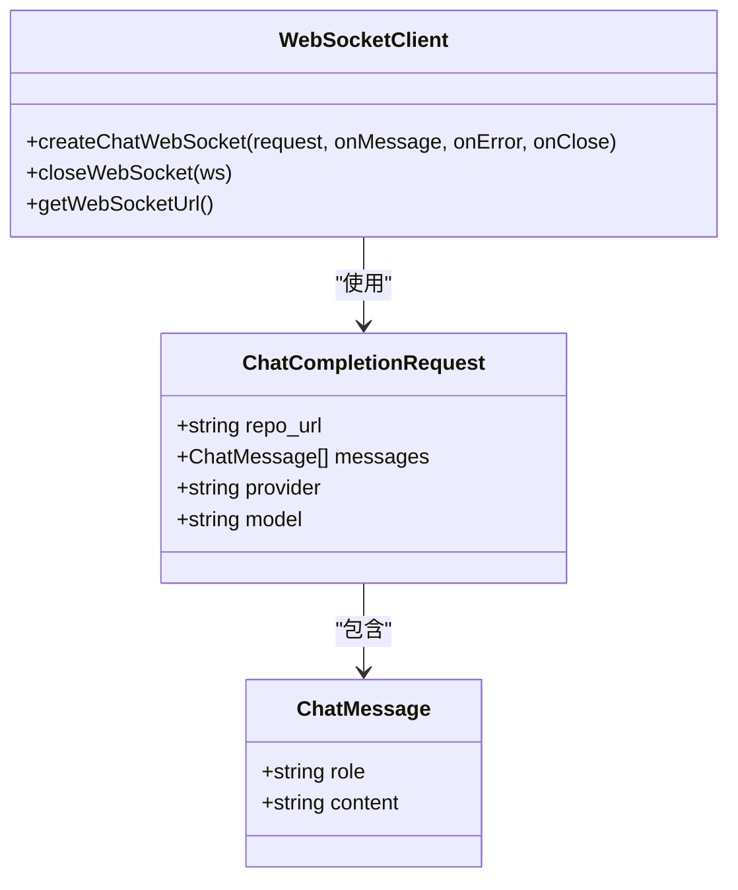

**图表来源**
- [src/utils/websocketClient.ts](file://src/utils/websocketClient.ts#L1-L86)

### React组件集成

前端React组件展示了如何优雅地处理WebSocket连接和HTTP回退：

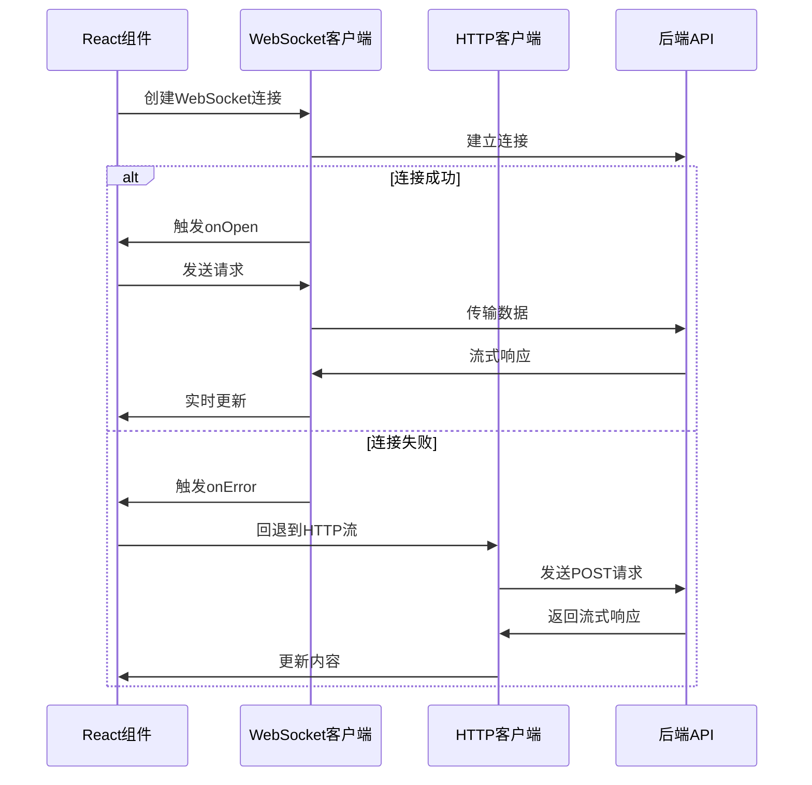

**图表来源**
- [src/components/Ask.tsx](file://src/components/Ask.tsx#L405-L437)

**章节来源**
- [src/utils/websocketClient.ts](file://src/utils/websocketClient.ts#L1-L86)
- [src/app/api/chat/stream/route.ts](file://src/app/api/chat/stream/route.ts#L1-L113)

## 性能优化策略

### 连接池管理

系统实现了智能的连接池管理，优化资源利用率：

1. **连接复用**：WebSocket连接保持活跃状态
2. **超时控制**：设置合理的连接超时时间
3. **资源清理**：及时释放不再使用的连接

### 缓存机制

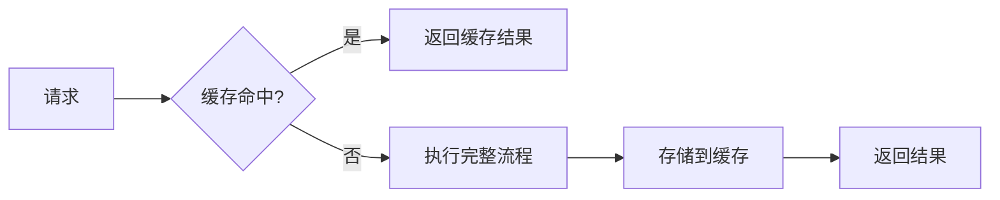

### 并发控制

系统通过以下机制控制并发访问：

- **连接数限制**：防止过多并发连接
- **队列管理**：处理请求排队
- **优先级调度**：重要请求优先处理

## 总结

deepwiki-open项目的实时通信机制展现了现代Web应用的最佳实践：

1. **双模式支持**：同时提供HTTP流式和WebSocket两种通信方式
2. **智能降级**：完善的错误处理和自动降级机制
3. **多提供商集成**：统一接口支持多个AI服务提供商
4. **前端友好**：完整的客户端实现和错误处理
5. **性能优化**：智能缓存和连接管理策略

这种设计不仅保证了系统的稳定性和可靠性，还为用户提供了流畅的实时交互体验。通过灵活的架构设计，系统能够适应不同的应用场景和需求变化，为未来的功能扩展奠定了坚实的基础。