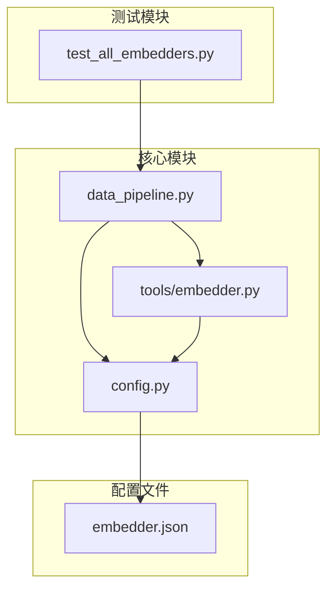
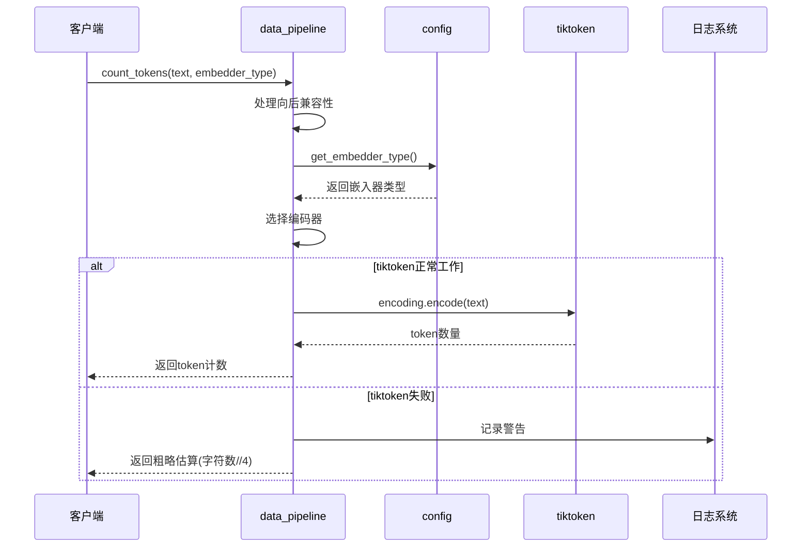
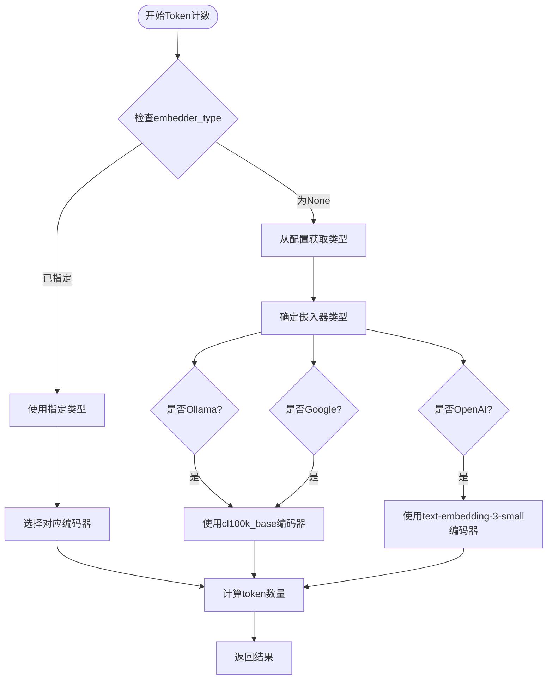
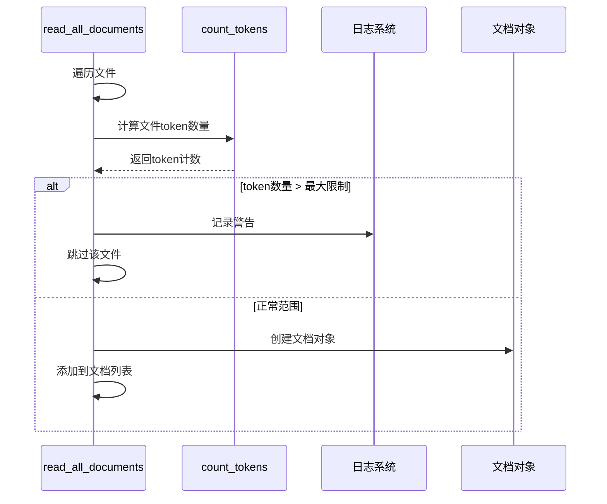
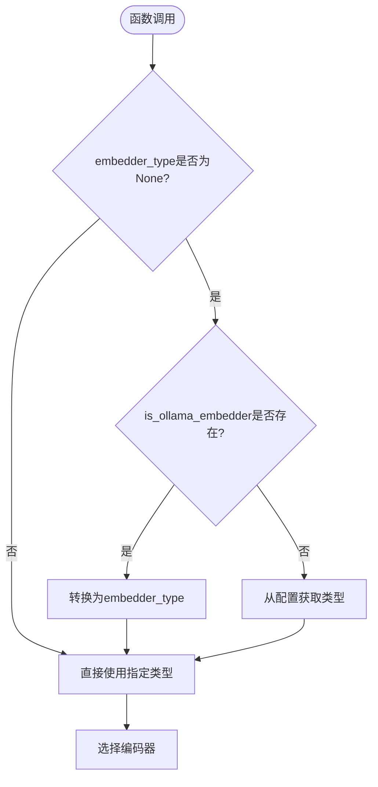
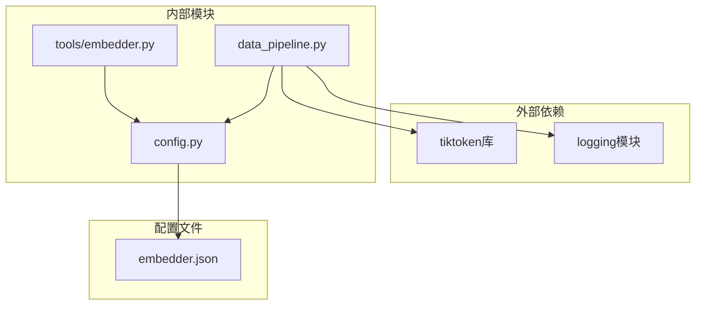

# Token计数机制文档

<cite>
**本文档中引用的文件**
- [data_pipeline.py](file://api/data_pipeline.py)
- [embedder.py](file://api/tools/embedder.py)
- [config.py](file://api/config.py)
- [embedder.json](file://api/config/embedder.json)
- [test_all_embedders.py](file://tests/unit/test_all_embedders.py)
</cite>

## 目录
1. [简介](#简介)
2. [项目结构概览](#项目结构概览)
3. [核心组件分析](#核心组件分析)
4. [架构设计](#架构设计)
5. [详细组件分析](#详细组件分析)
6. [依赖关系分析](#依赖关系分析)
7. [性能考虑](#性能考虑)
8. [故障排除指南](#故障排除指南)
9. [结论](#结论)

## 简介

deepwiki-open项目中的Token计数机制是一个关键的安全防护系统，专门用于精确估算不同嵌入模型的token消耗。该机制通过`tiktoken`库实现，能够根据不同的嵌入器类型（OpenAI、Google、Ollama）选择合适的编码器，并提供优雅的降级策略以确保系统的稳定性和可靠性。

## 项目结构概览

Token计数功能主要分布在以下核心模块中：

**图表来源**
- [data_pipeline.py](file://api/data_pipeline.py#L1-L886)
- [config.py](file://api/config.py#L1-L388)
- [embedder.py](file://api/tools/embedder.py#L1-L55)

**章节来源**
- [data_pipeline.py](file://api/data_pipeline.py#L1-L886)
- [config.py](file://api/config.py#L1-L388)

## 核心组件分析

### count_tokens函数

`count_tokens`函数是整个Token计数机制的核心，位于`data_pipeline.py`文件中。该函数提供了精确的token计算能力，支持多种嵌入器类型的编码器选择。

#### 主要特性

1. **多模型编码器支持**：
   - OpenAI模型：使用`text-embedding-3-small`模型编码
   - Google模型：使用`cl100k_base`编码器
   - Ollama模型：使用`cl100k_base`编码器

2. **向后兼容性**：
   - 支持`is_ollama_embedder`参数的遗留版本
   - 自动检测当前配置的嵌入器类型

3. **优雅降级策略**：
   - 当`tiktoken`处理失败时，使用字符数除以4的粗略估算
   - 记录警告日志以便问题追踪

**章节来源**
- [data_pipeline.py](file://api/data_pipeline.py#L26-L67)

## 架构设计

Token计数机制采用分层架构设计，确保了良好的可扩展性和维护性：

**图表来源**
- [data_pipeline.py](file://api/data_pipeline.py#L26-L67)
- [config.py](file://api/config.py#L215-L227)

## 详细组件分析

### 编码器选择逻辑

Token计数机制根据嵌入器类型智能选择合适的编码器：

**图表来源**
- [data_pipeline.py](file://api/data_pipeline.py#L46-L61)

#### 编码器映射表

| 嵌入器类型 | 使用的编码器 | 模型名称 |
|-----------|-------------|----------|
| Ollama | cl100k_base | - |
| Google | cl100k_base | - |
| OpenAI | text-embedding-3-small | text-embedding-3-small |

**章节来源**
- [data_pipeline.py](file://api/data_pipeline.py#L52-L60)

### 安全防护机制

Token计数机制在数据处理流程中发挥着重要的安全防护作用：

**图表来源**
- [data_pipeline.py](file://api/data_pipeline.py#L315-L353)

#### 安全阈值设置

系统设置了明确的token数量限制：

- **代码文件**：最大token数量为`MAX_EMBEDDING_TOKENS * 10`（默认81920）
- **文档文件**：最大token数量为`MAX_EMBEDDING_TOKENS`（默认8192）

**章节来源**
- [data_pipeline.py](file://api/data_pipeline.py#L24-L26)
- [data_pipeline.py](file://api/data_pipeline.py#L315-L353)

### 向后兼容性处理

为了确保与旧版本的兼容性，系统提供了多层次的参数支持：

**图表来源**
- [data_pipeline.py](file://api/data_pipeline.py#L42-L49)

**章节来源**
- [data_pipeline.py](file://api/data_pipeline.py#L42-L49)

## 依赖关系分析

Token计数机制的依赖关系体现了清晰的模块化设计：

**图表来源**
- [data_pipeline.py](file://api/data_pipeline.py#L1-L10)
- [config.py](file://api/config.py#L1-L10)

### 关键依赖项

1. **tiktoken库**：提供精确的token编码和解码功能
2. **logging模块**：记录系统运行状态和错误信息
3. **配置系统**：动态获取嵌入器类型和配置信息

**章节来源**
- [data_pipeline.py](file://api/data_pipeline.py#L1-L10)
- [config.py](file://api/config.py#L1-L10)

## 性能考虑

### 优化策略

1. **缓存机制**：虽然当前实现没有显式的缓存，但可以通过装饰器模式添加缓存
2. **批量处理**：对于大量文本的处理，可以考虑批量token计数
3. **异步处理**：在高并发场景下，可以使用异步方式处理token计数

### 性能指标

- **正常情况**：tiktoken编码速度通常在毫秒级别
- **降级情况**：字符数估算速度接近O(1)
- **内存使用**：主要取决于输入文本大小

## 故障排除指南

### 常见问题及解决方案

#### 1. tiktoken处理失败

**症状**：出现"Error counting tokens with tiktoken"警告日志

**原因**：tiktoken库可能遇到未知编码或格式问题

**解决方案**：
- 检查输入文本的编码格式
- 验证文本内容是否包含特殊字符
- 更新tiktoken库到最新版本

#### 2. token数量估算不准确

**症状**：实际token数量与估算值差异较大

**原因**：降级策略使用字符数除以4的简单估算

**解决方案**：
- 在关键场景下使用精确的tiktoken计算
- 对于重要文档，可以增加额外的验证步骤

#### 3. 嵌入器类型识别错误

**症状**：使用了错误的编码器

**原因**：配置文件或环境变量设置不正确

**解决方案**：
- 检查`DEEPWIKI_EMBEDDER_TYPE`环境变量
- 验证`embedder.json`配置文件的正确性
- 使用`get_embedder_type()`函数确认当前类型

**章节来源**
- [data_pipeline.py](file://api/data_pipeline.py#L64-L67)

### 调试技巧

1. **启用详细日志**：设置日志级别为DEBUG以获取更多信息
2. **单元测试**：使用提供的测试用例验证功能
3. **配置验证**：定期检查配置文件的有效性

**章节来源**
- [test_all_embedders.py](file://tests/unit/test_all_embedders.py#L239-L256)

## 结论

deepwiki-open项目的Token计数机制是一个设计精良、功能完备的安全防护系统。它通过以下关键特性确保了系统的可靠性和效率：

1. **精确性**：使用专业的`tiktoken`库进行token计算
2. **灵活性**：支持多种嵌入器类型的编码器选择
3. **稳定性**：提供优雅的降级策略和错误处理机制
4. **安全性**：在数据处理前预估token数量，防止API调用失败
5. **可维护性**：清晰的代码结构和完善的测试覆盖

该机制不仅保护了系统免受因单个文件过大而导致的嵌入API调用失败，还为开发者提供了可靠的工具来监控和管理token使用量。通过合理的配置和适当的监控，这个Token计数机制能够有效支持大规模文档处理任务，同时保持系统的稳定性和性能。