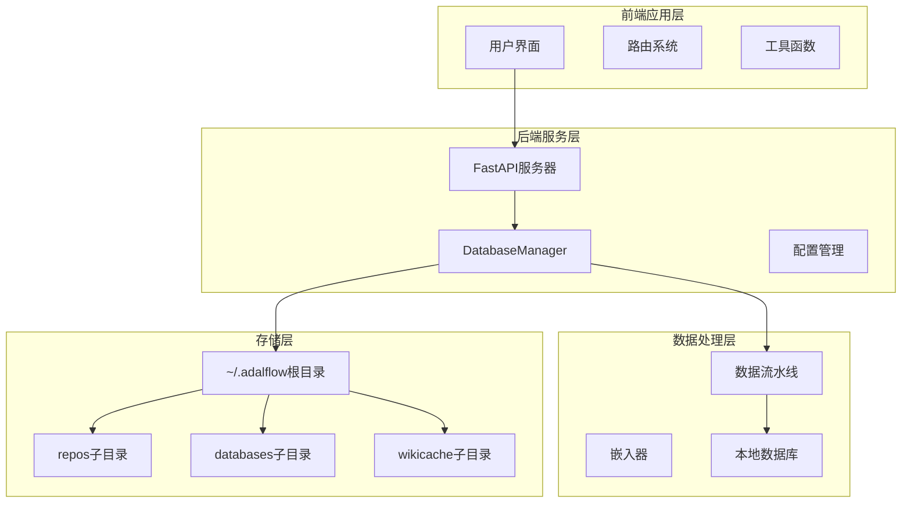
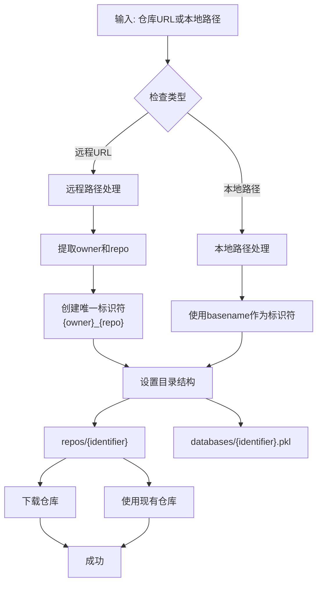
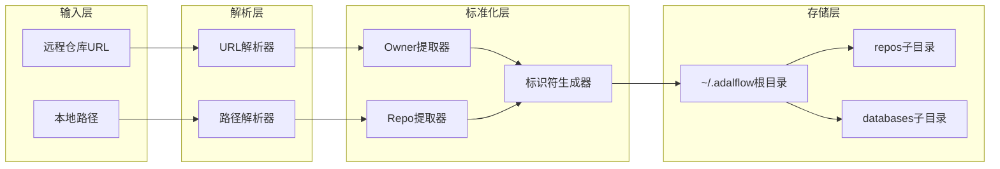
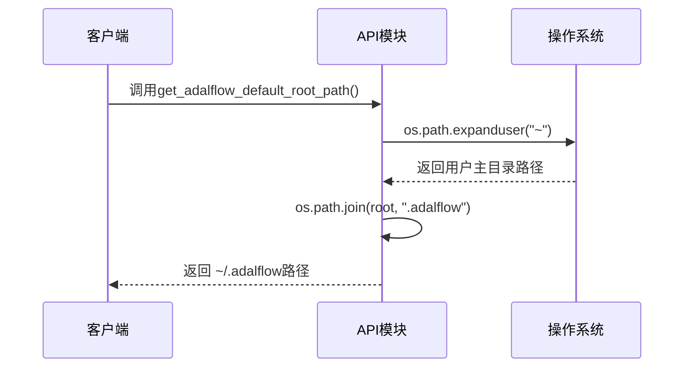
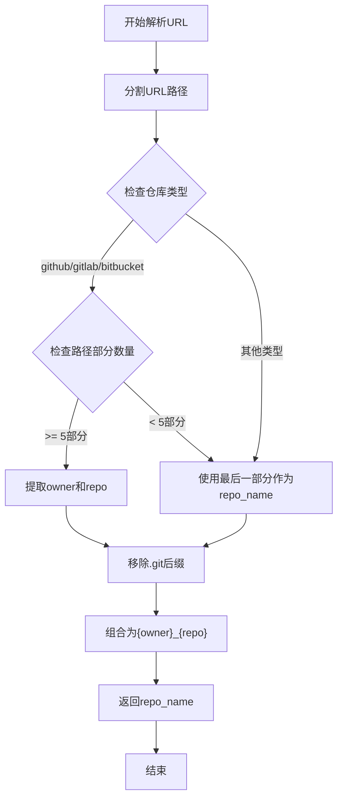
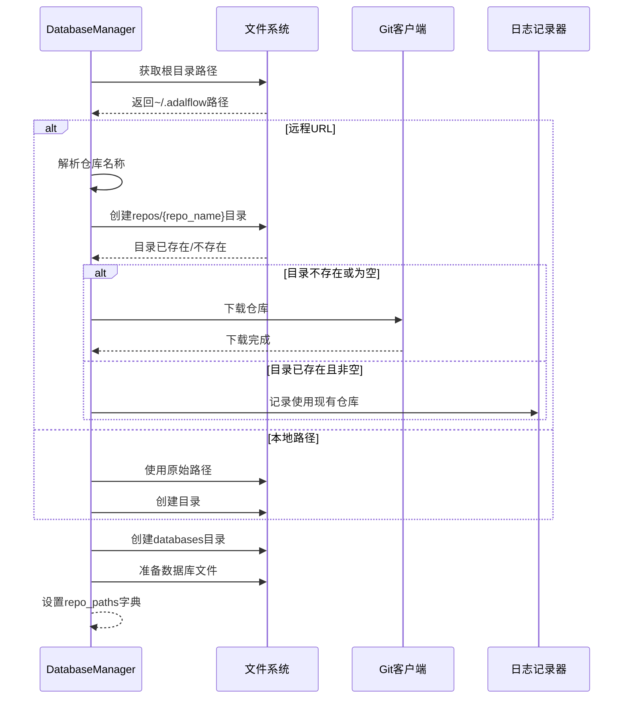
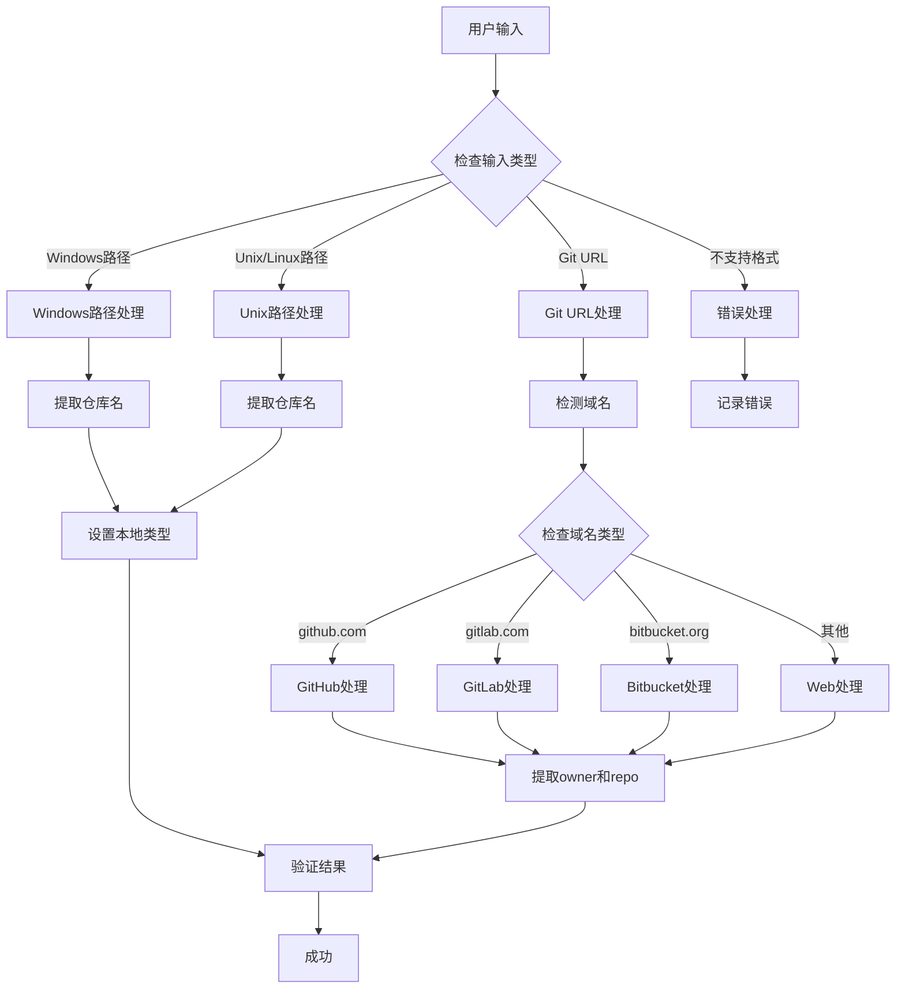
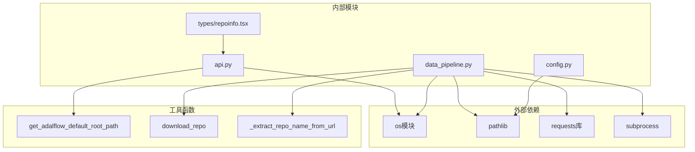

# 仓库路径处理机制

<cite>
**本文档引用的文件**
- [data_pipeline.py](file://api/data_pipeline.py)
- [api.py](file://api/api.py)
- [test_extract_repo_name.py](file://test/test_extract_repo_name.py)
- [config.py](file://api/config.py)
- [page.tsx](file://src/app/page.tsx)
- [urlDecoder.tsx](file://src/utils/urlDecoder.tsx)
- [getRepoUrl.tsx](file://src/utils/getRepoUrl.tsx)
- [repoinfo.tsx](file://src/types/repoinfo.tsx)
</cite>

## 目录
1. [简介](#简介)
2. [项目结构概览](#项目结构概览)
3. [核心组件分析](#核心组件分析)
4. [架构概览](#架构概览)
5. [详细组件分析](#详细组件分析)
6. [依赖关系分析](#依赖关系分析)
7. [性能考虑](#性能考虑)
8. [故障排除指南](#故障排除指南)
9. [结论](#结论)

## 简介

本文档深入分析了DeepWiki项目中DatabaseManager类如何通过`_get_adalflow_default_root_path`方法确定本地存储根目录（`~/.adalflow`），并结合`_create_repo`和`_extract_repo_name_from_url`方法实现跨平台仓库路径的标准化组织。详细描述了从GitHub、GitLab、Bitbucket URL中解析owner和repo名称的逻辑，以及如何生成唯一的`{owner}_{repo}`标识符用于repos和databases子目录的持久化存储。涵盖了本地路径与远程URL的差异化处理流程，并提供了实际路径映射示例。

## 项目结构概览

该项目采用前后端分离的架构设计，主要包含以下关键模块：

**图表来源**
- [api.py](file://api/api.py#L35-L38)
- [data_pipeline.py](file://api/data_pipeline.py#L702-L884)

**章节来源**
- [api.py](file://api/api.py#L1-L49)
- [data_pipeline.py](file://api/data_pipeline.py#L1-L50)

## 核心组件分析

### DatabaseManager类

DatabaseManager是整个仓库路径处理的核心类，负责管理本地数据库实例的创建、加载、转换和持久化。该类的主要职责包括：

- **仓库准备**：通过`prepare_database`方法准备数据库
- **路径管理**：通过`_create_repo`方法管理本地存储路径
- **URL解析**：通过`_extract_repo_name_from_url`方法解析远程仓库URL
- **数据库索引**：通过`prepare_db_index`方法准备数据库索引

### 路径处理机制

路径处理机制的核心在于统一管理和标准化不同类型的仓库访问方式：

**图表来源**
- [data_pipeline.py](file://api/data_pipeline.py#L768-L806)

**章节来源**
- [data_pipeline.py](file://api/data_pipeline.py#L702-L884)

## 架构概览

### 跨平台路径标准化架构

系统采用统一的路径标准化策略，确保在不同操作系统上的一致性：

**图表来源**
- [data_pipeline.py](file://api/data_pipeline.py#L753-L766)
- [api.py](file://api/api.py#L35-L38)

## 详细组件分析

### get_adalflow_default_root_path方法

该方法负责确定默认的本地存储根目录，采用跨平台兼容的方式：

**图表来源**
- [api.py](file://api/api.py#L35-L38)

该方法的实现简洁而高效，利用Python标准库的跨平台特性：
- 使用`os.path.expanduser("~")`获取用户主目录
- 使用`os.path.join()`构建跨平台兼容的路径
- 默认返回`~/.adalflow`作为根目录

**章节来源**
- [api.py](file://api/api.py#L35-L38)

### _extract_repo_name_from_url方法

该方法实现了复杂的URL解析逻辑，支持多种Git托管服务：

**图表来源**
- [data_pipeline.py](file://api/data_pipeline.py#L753-L766)

#### 支持的URL格式

| 仓库类型 | URL格式示例 | 提取的owner | 提取的repo |
|---------|------------|------------|-----------|
| GitHub | `https://github.com/owner/repo` | owner | repo |
| GitHub | `https://github.com/owner/repo.git` | owner | repo |
| GitLab | `https://gitlab.com/owner/repo` | owner | repo |
| GitLab | `https://gitlab.com/group/subgroup/repo` | subgroup | repo |
| Bitbucket | `https://bitbucket.org/owner/repo` | owner | repo |

**章节来源**
- [data_pipeline.py](file://api/data_pipeline.py#L757-L766)
- [test_extract_repo_name.py](file://test/test_extract_repo_name.py#L40-L78)

### _create_repo方法

该方法是仓库路径处理的核心，负责创建和管理本地存储结构：

**图表来源**
- [data_pipeline.py](file://api/data_pipeline.py#L768-L806)

#### 路径结构组织

系统采用层次化的目录结构来组织仓库和数据库文件：

| 组件 | 路径模式 | 用途 |
|------|---------|------|
| 仓库目录 | `~/.adalflow/repos/{owner}_{repo}/` | 存储克隆的Git仓库 |
| 数据库文件 | `~/.adalflow/databases/{owner}_{repo}.pkl` | 存储向量数据库索引 |
| 缓存目录 | `~/.adalflow/wikicache/` | 存储生成的Wiki内容缓存 |

**章节来源**
- [data_pipeline.py](file://api/data_pipeline.py#L768-L806)

### 前端路径处理

前端应用也实现了类似的路径处理逻辑，支持多种输入格式：

**图表来源**
- [page.tsx](file://src/app/page.tsx#L193-L238)

**章节来源**
- [page.tsx](file://src/app/page.tsx#L193-L238)
- [urlDecoder.tsx](file://src/utils/urlDecoder.tsx#L1-L19)

## 依赖关系分析

### 核心依赖图

**图表来源**
- [api.py](file://api/api.py#L1-L10)
- [data_pipeline.py](file://api/data_pipeline.py#L1-L20)

### 模块间交互

各模块之间的交互遵循清晰的职责分离原则：

| 模块 | 主要职责 | 依赖模块 | 输出 |
|------|---------|---------|------|
| api.py | 路径管理、API服务 | os, pathlib | 根目录路径 |
| data_pipeline.py | 仓库管理、数据处理 | requests, subprocess, api | 仓库路径、数据库文件 |
| config.py | 配置管理 | pathlib | 配置对象 |
| page.tsx | 前端路径处理 | urlDecoder, getRepoUrl | 仓库信息对象 |

**章节来源**
- [api.py](file://api/api.py#L1-L49)
- [data_pipeline.py](file://api/data_pipeline.py#L1-L886)
- [config.py](file://api/config.py#L1-L388)

## 性能考虑

### 路径操作优化

系统在路径处理方面采用了多项优化策略：

1. **缓存机制**：避免重复的路径解析操作
2. **条件检查**：仅在必要时执行昂贵的操作
3. **并行处理**：对于多个仓库同时处理的情况
4. **内存管理**：及时释放不再需要的路径对象

### 存储优化

- **增量更新**：只下载变化的部分
- **压缩存储**：数据库文件采用压缩格式
- **清理策略**：定期清理过期的缓存文件

## 故障排除指南

### 常见问题及解决方案

#### 1. 路径权限问题

**症状**：无法创建或写入`~/.adalflow`目录
**解决方案**：
- 检查用户权限
- 确保主目录可写
- 使用`chmod`调整权限

#### 2. URL解析失败

**症状**：无法正确解析仓库URL
**解决方案**：
- 验证URL格式
- 检查网络连接
- 确认仓库类型支持

#### 3. 仓库下载失败

**症状**：Git克隆过程出错
**解决方案**：
- 检查Git安装
- 验证访问令牌
- 网络代理设置

**章节来源**
- [data_pipeline.py](file://api/data_pipeline.py#L782-L806)

## 结论

DeepWiki项目的仓库路径处理机制展现了优秀的软件架构设计：

1. **统一性**：通过`~/.adalflow`根目录实现跨平台一致性
2. **扩展性**：支持多种Git托管服务和访问方式
3. **可靠性**：完善的错误处理和恢复机制
4. **性能**：优化的路径操作和存储策略

该机制不仅满足了当前的功能需求，还为未来的功能扩展奠定了坚实的基础。通过清晰的模块划分和职责分离，系统具备了良好的可维护性和可测试性。