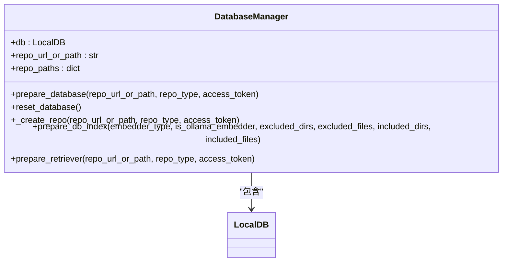
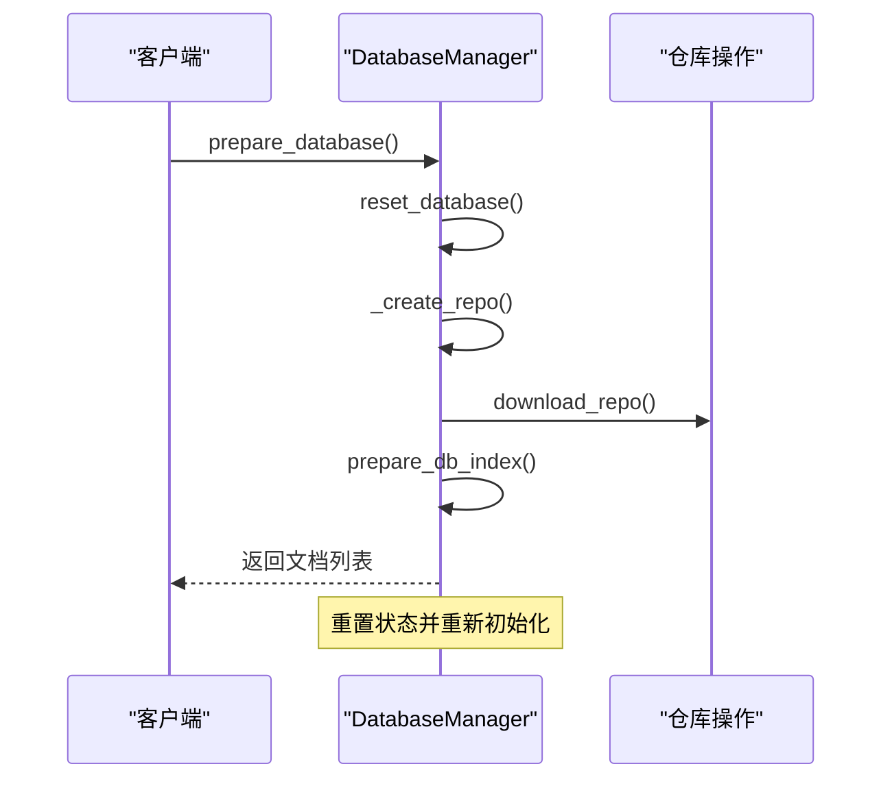
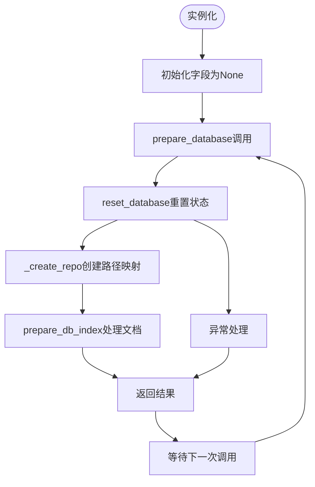
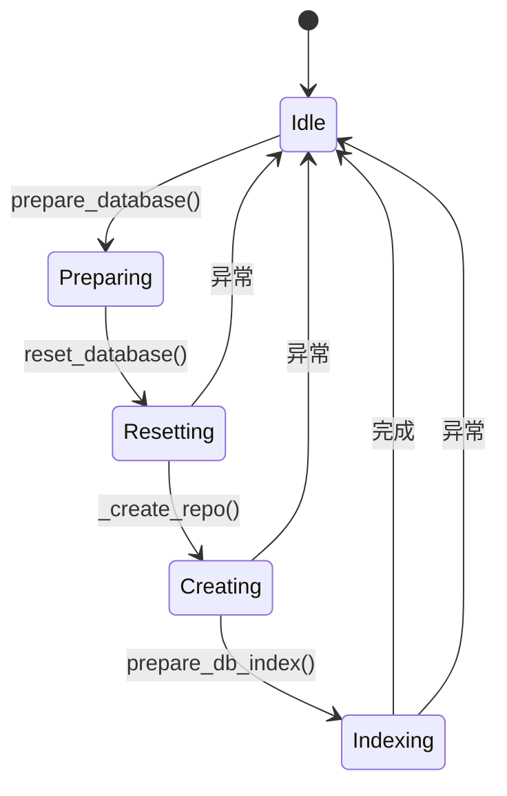

# 数据库状态管理

<cite>
**本文档中引用的文件**   
- [data_pipeline.py](file://api/data_pipeline.py)
</cite>

## 目录
1. [引言](#引言)
2. [核心字段设计与状态管理](#核心字段设计与状态管理)
3. [prepare_database调用过程分析](#preparedatabase调用过程分析)
4. [字段生命周期与多请求隔离策略](#字段生命周期与多请求隔离策略)
5. [状态污染风险与防护措施](#状态污染风险与防护措施)

## 引言
DatabaseManager类是deepwiki-open项目中负责管理本地数据库实例创建、加载、转换和持久化的关键组件。该类通过三个核心字段self.db、self.repo_url_or_path和self.repo_paths协同工作，维护当前仓库的数据上下文。本文档将详细阐述这些字段的设计目的、状态管理机制以及在多请求场景下的隔离策略。

## 核心字段设计与状态管理

DatabaseManager类在初始化时定义了三个核心字段：

- **self.db**: 存储LocalDB实例，用于管理文档的存储和检索
- **self.repo_url_or_path**: 存储当前处理的仓库URL或本地路径
- **self.repo_paths**: 字典结构，包含仓库存储目录和数据库文件路径

这些字段共同维护了当前仓库的数据上下文，确保在处理不同仓库时能够正确地隔离数据。

**Diagram sources**
- [data_pipeline.py](file://api/data_pipeline.py#L708-L711)

**Section sources**
- [data_pipeline.py](file://api/data_pipeline.py#L708-L711)

## prepare_database调用过程分析

prepare_database方法是DatabaseManager的核心入口，其调用过程如下：

1. 首先调用reset_database方法重置所有状态
2. 然后调用_create_repo方法创建仓库结构
3. 最后调用prepare_db_index方法准备数据库索引

在reset_database调用过程中，所有核心字段都被重置为None，确保了状态的干净初始化。

**Diagram sources**
- [data_pipeline.py](file://api/data_pipeline.py#L713-L743)

**Section sources**
- [data_pipeline.py](file://api/data_pipeline.py#L713-L743)

## 字段生命周期与多请求隔离策略

DatabaseManager类的字段生命周期遵循严格的初始化和重置模式：

**Diagram sources**
- [data_pipeline.py](file://api/data_pipeline.py#L708-L752)

**Section sources**
- [data_pipeline.py](file://api/data_pipeline.py#L708-L752)

## 状态污染风险与防护措施

尽管DatabaseManager类通过reset_database方法提供了状态重置机制，但仍存在潜在的状态污染风险：

1. **并发访问风险**: 多个请求同时使用同一个DatabaseManager实例可能导致状态冲突
2. **异常中断风险**: 在_prepare_repo或prepare_db_index执行过程中发生异常可能导致状态不一致

现有的防护措施包括：

- 在prepare_database开始时立即调用reset_database确保状态干净
- 使用独立的文件路径为每个仓库存储数据，避免文件级别的冲突
- 通过_repository name从URL提取确保仓库标识的唯一性

**Diagram sources**
- [data_pipeline.py](file://api/data_pipeline.py#L745-L752)

**Section sources**
- [data_pipeline.py](file://api/data_pipeline.py#L745-L752)