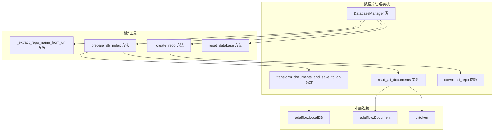
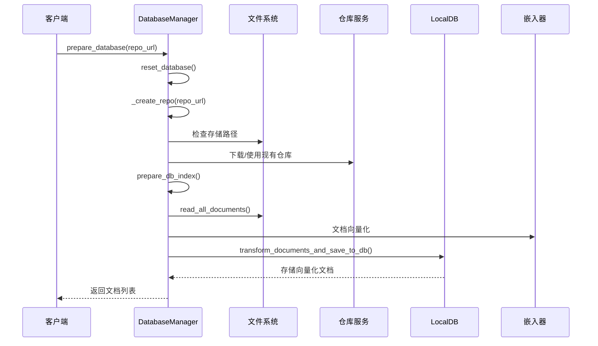
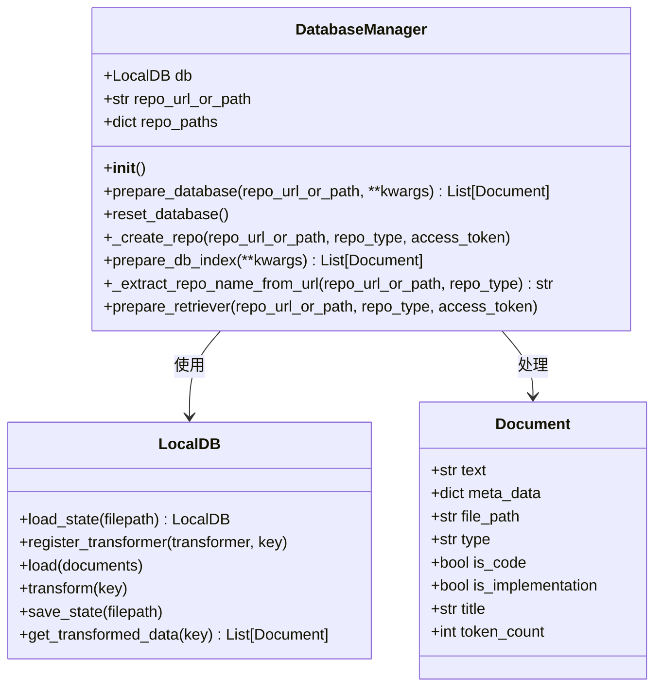
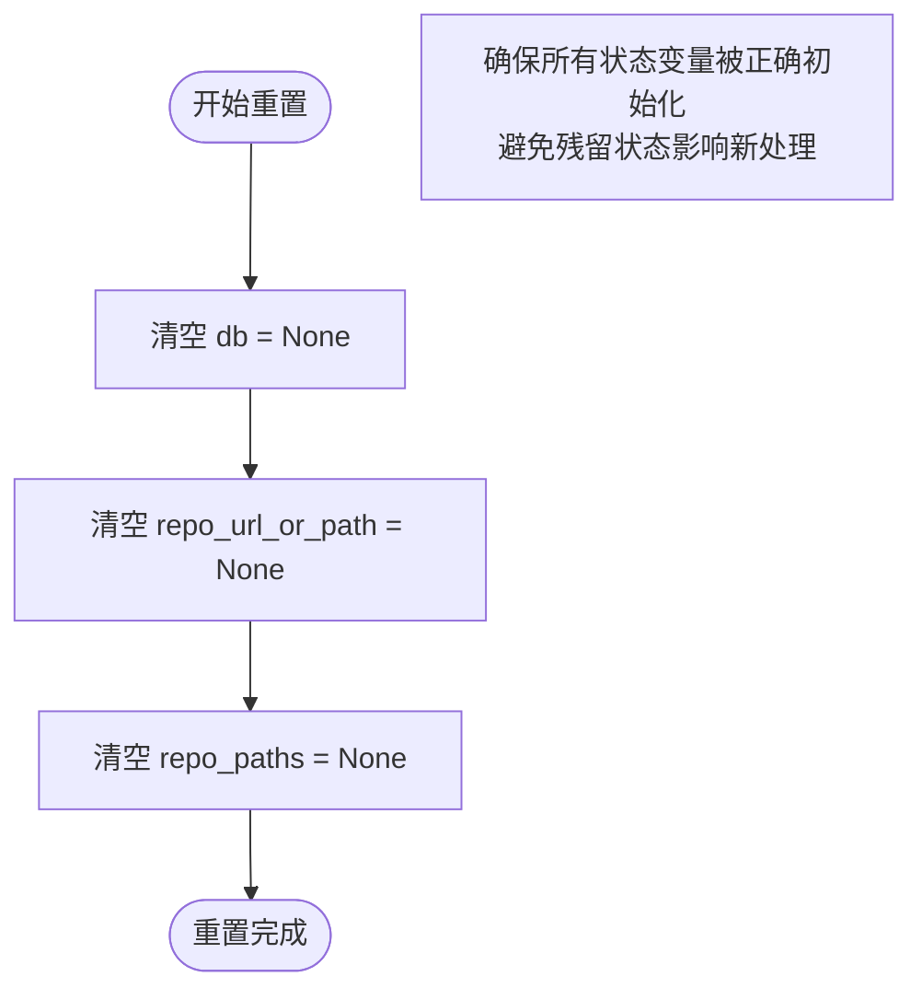
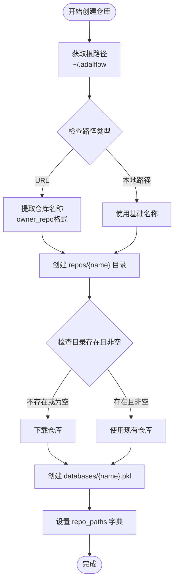
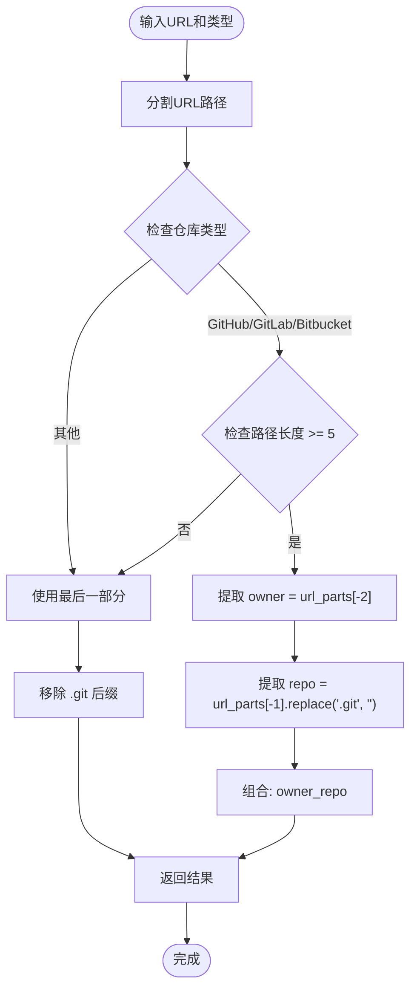
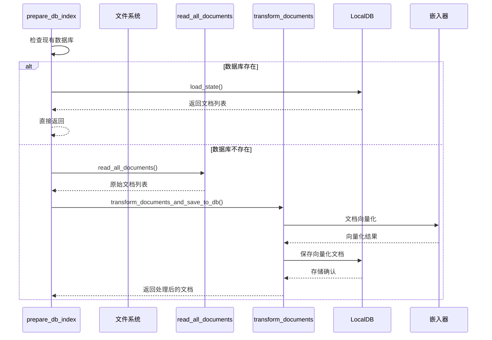
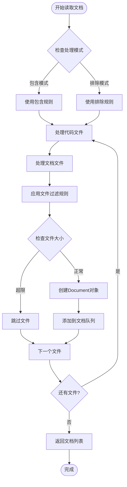
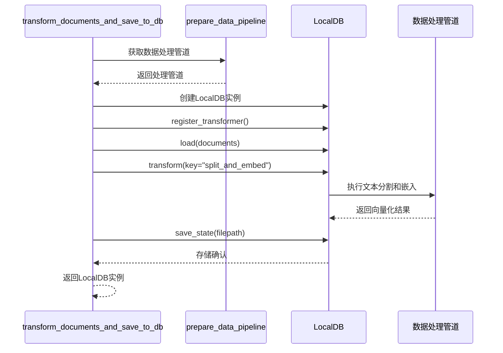
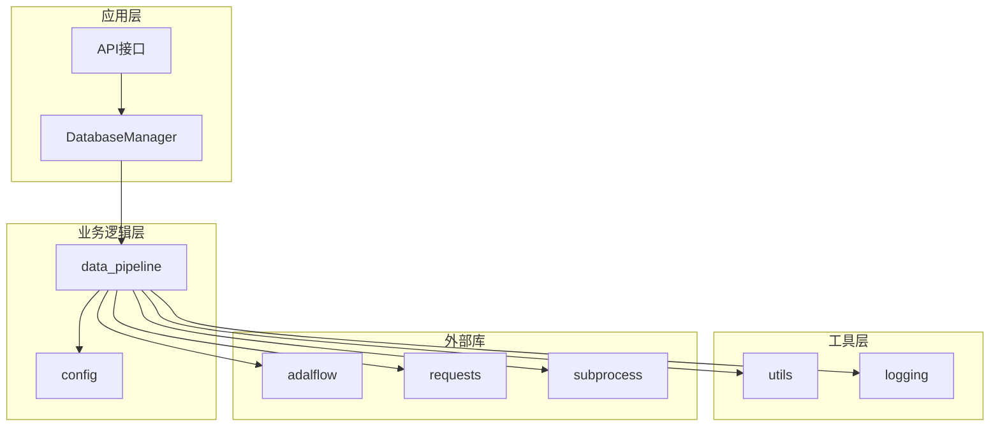

# 数据库管理

<cite>
**本文档中引用的文件**
- [data_pipeline.py](file://api/data_pipeline.py)
- [api.py](file://api/api.py)
- [config.py](file://api/config.py)
- [test_extract_repo_name.py](file://test/test_extract_repo_name.py)
</cite>

## 目录
1. [简介](#简介)
2. [项目结构](#项目结构)
3. [核心组件](#核心组件)
4. [架构概览](#架构概览)
5. [详细组件分析](#详细组件分析)
6. [依赖关系分析](#依赖关系分析)
7. [性能考虑](#性能考虑)
8. [故障排除指南](#故障排除指南)
9. [结论](#结论)

## 简介

deepwiki-open项目的数据库管理模块是一个核心的数据流水线协调器，负责管理从代码仓库到可检索知识库的完整转换过程。该模块的核心是`DatabaseManager`类，它协调着仓库下载、文档处理、向量化存储和RAG系统集成等关键功能。

该模块采用分层架构设计，通过状态管理和流水线协调实现了高效的数据处理能力，支持多种类型的代码仓库（GitHub、GitLab、Bitbucket）和本地路径，为深度学习和知识管理提供了强大的基础设施支持。

## 项目结构

数据库管理模块主要位于`api/data_pipeline.py`文件中，包含以下核心组件：



**图表来源**
- [data_pipeline.py](file://api/data_pipeline.py#L702-L886)

**章节来源**
- [data_pipeline.py](file://api/data_pipeline.py#L1-L886)

## 核心组件

### DatabaseManager 类

`DatabaseManager`类是整个数据库管理模块的核心控制器，负责协调数据流水线的各个阶段。该类维护三个关键状态字段：

- **db**: 当前的LocalDB实例，用于存储和管理文档向量
- **repo_url_or_path**: 仓库的URL或本地路径，记录当前处理的目标
- **repo_paths**: 包含仓库存储路径和数据库文件路径的字典

### 核心方法概览

| 方法名 | 功能描述 | 返回类型 |
|--------|----------|----------|
| `prepare_database` | 高层入口方法，协调整个数据库准备流程 | List[Document] |
| `reset_database` | 重置数据库到初始状态 | None |
| `_create_repo` | 创建和准备仓库存储结构 | None |
| `prepare_db_index` | 准备索引数据库，完成向量化存储 | List[Document] |
| `_extract_repo_name_from_url` | 从URL提取仓库名称标识符 | str |
| `prepare_retriever` | 兼容性方法，用于检索器准备 | List[Document] |

**章节来源**
- [data_pipeline.py](file://api/data_pipeline.py#L702-L886)

## 架构概览

数据库管理模块采用流水线架构模式，将复杂的文档处理任务分解为清晰的阶段：



**图表来源**
- [data_pipeline.py](file://api/data_pipeline.py#L713-L742)
- [data_pipeline.py](file://api/data_pipeline.py#L818-L869)

## 详细组件分析

### DatabaseManager 类详细分析

#### 初始化和状态管理



**图表来源**
- [data_pipeline.py](file://api/data_pipeline.py#L702-L710)
- [data_pipeline.py](file://api/data_pipeline.py#L712-L742)

#### prepare_database 方法详解

`prepare_database`方法是整个数据库管理流程的高层入口，它协调了三个关键步骤：

1. **状态重置**: 调用`reset_database()`清理之前的处理状态
2. **仓库准备**: 通过`_create_repo()`方法创建和准备仓库存储结构
3. **索引构建**: 调用`prepare_db_index()`完成文档读取、向量化和存储

该方法的设计体现了单一职责原则，每个步骤都有明确的边界和责任。

**章节来源**
- [data_pipeline.py](file://api/data_pipeline.py#L712-L742)

#### _reset_repo 方法状态管理机制

_reset_repo方法（实际上是reset_database）实现了完整的状态重置机制：



**图表来源**
- [data_pipeline.py](file://api/data_pipeline.py#L744-L750)

这种状态管理模式确保了每次数据库处理都是独立的，避免了状态污染和竞态条件。

**章节来源**
- [data_pipeline.py](file://api/data_pipeline.py#L744-L750)

#### _create_repo 方法存储路径管理

_create_repo方法负责确定和创建存储结构，这是整个系统的基础：



**图表来源**
- [data_pipeline.py](file://api/data_pipeline.py#L768-L817)

#### _get_adalflow_default_root_path 确定存储根目录

该方法通过调用`get_adalflow_default_root_path()`确定存储根目录：

```python
def get_adalflow_default_root_path():
    return os.path.expanduser(os.path.join("~", ".adalflow"))
```

这个路径策略有以下特点：
- **用户特定**: 使用`~`表示当前用户的主目录
- **统一命名**: `.adalflow`作为统一的存储目录
- **跨平台兼容**: `os.path.expanduser`确保在不同操作系统上的一致性

**章节来源**
- [api.py](file://api/api.py#L35-L36)
- [data_pipeline.py](file://api/data_pipeline.py#L783)

#### _extract_repo_name_from_url 方法仓库标识符生成

该方法根据不同的仓库类型生成唯一的{owner}_{repo}标识符：



**图表来源**
- [data_pipeline.py](file://api/data_pipeline.py#L753-L766)

这种方法确保了：
- **唯一性**: 不同仓库即使名称相同也能区分
- **标准化**: 统一的命名格式便于管理和查找
- **兼容性**: 支持各种仓库托管平台的标准URL格式

**章节来源**
- [data_pipeline.py](file://api/data_pipeline.py#L753-L766)

#### prepare_db_index 方法向量化存储流程

prepare_db_index方法是文档处理流水线的核心，实现了完整的向量化存储流程：



**图表来源**
- [data_pipeline.py](file://api/data_pipeline.py#L818-L869)

该方法的关键特性包括：
- **缓存机制**: 自动检测和加载现有数据库
- **错误恢复**: 加载失败时自动重新创建
- **批量处理**: 支持大规模文档的高效处理
- **状态持久化**: 通过LocalDB实现数据的持久化存储

**章节来源**
- [data_pipeline.py](file://api/data_pipeline.py#L818-L869)

### 文档处理管道分析

#### read_all_documents 函数文档收集机制

该函数实现了智能的文档收集和过滤机制：



**图表来源**
- [data_pipeline.py](file://api/data_pipeline.py#L144-L371)

#### transform_documents_and_save_to_db 函数向量化处理

该函数协调了文档的向量化处理和数据库存储：



**图表来源**
- [data_pipeline.py](file://api/data_pipeline.py#L417-L441)

**章节来源**
- [data_pipeline.py](file://api/data_pipeline.py#L144-L371)
- [data_pipeline.py](file://api/data_pipeline.py#L417-L441)

## 依赖关系分析

数据库管理模块的依赖关系展现了清晰的分层架构：



**图表来源**
- [data_pipeline.py](file://api/data_pipeline.py#L1-L15)
- [config.py](file://api/config.py#L1-L20)

### 关键依赖说明

| 依赖项 | 用途 | 版本要求 |
|--------|------|----------|
| adalflow | 提供LocalDB和Document类型 | 最新稳定版 |
| requests | HTTP请求处理 | 2.25+ |
| tiktoken | Token计数和编码 | 最新版本 |
| subprocess | Git命令执行 | Python标准库 |

**章节来源**
- [data_pipeline.py](file://api/data_pipeline.py#L1-L15)

## 性能考虑

### 内存管理优化

数据库管理模块采用了多项内存优化策略：

1. **流式处理**: read_all_documents采用生成器模式，避免一次性加载大量文档
2. **分批处理**: transform_documents_and_save_to_db支持批量处理，控制内存使用
3. **及时释放**: prepare_database方法确保处理完成后及时释放资源

### 缓存策略

- **数据库缓存**: 通过LocalDB实现向量化结果的持久化存储
- **仓库缓存**: 智能检测现有仓库，避免重复下载
- **配置缓存**: 配置信息在模块级别缓存，减少重复加载

### 并发处理

虽然当前实现是同步的，但架构设计支持未来的并发扩展：
- 独立的文档读取和向量化处理阶段
- 可插拔的嵌入器支持
- 模块化的处理管道设计

## 故障排除指南

### 常见问题及解决方案

#### 仓库下载失败

**症状**: `ValueError: Error during cloning`
**原因**: 网络连接问题或访问权限不足
**解决方案**:
1. 检查网络连接
2. 验证访问令牌的有效性
3. 确认仓库URL的正确性

#### 内存不足错误

**症状**: 处理大型仓库时出现内存溢出
**原因**: 单次处理过多文档或文件过大
**解决方案**:
1. 调整排除规则减少处理文件数量
2. 增加系统内存或使用分批处理
3. 限制单个文件的最大Token数量

#### 数据库加载失败

**症状**: `Error loading existing database`
**原因**: 数据库文件损坏或格式不匹配
**解决方案**:
1. 删除损坏的数据库文件
2. 重新运行prepare_database方法
3. 检查文件权限设置

**章节来源**
- [data_pipeline.py](file://api/data_pipeline.py#L132-L139)
- [data_pipeline.py](file://api/data_pipeline.py#L845-L852)

## 结论

deepwiki-open的数据库管理模块展现了优秀的软件架构设计：

1. **模块化设计**: 清晰的职责分离和接口定义
2. **状态管理**: 完善的状态重置和恢复机制
3. **扩展性**: 支持多种仓库类型和处理策略
4. **性能优化**: 智能缓存和内存管理策略
5. **错误处理**: 健壮的异常处理和恢复机制

该模块为deepwiki-open项目提供了坚实的数据基础设施，支持大规模代码仓库的知识化处理，为后续的RAG系统和智能问答功能奠定了重要基础。通过合理的抽象和封装，它成功地将复杂的文档处理任务转化为易于理解和维护的代码结构。