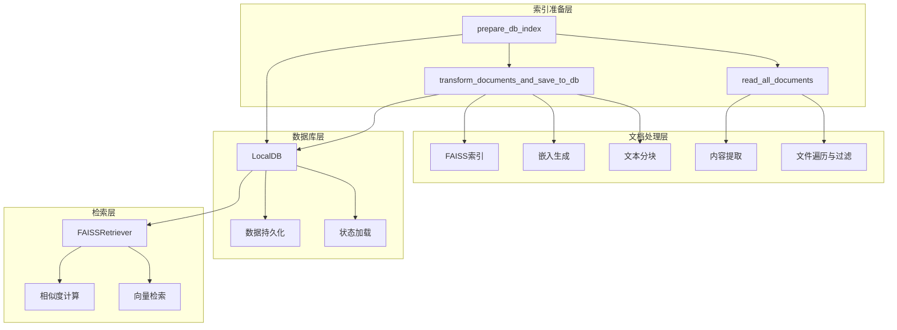
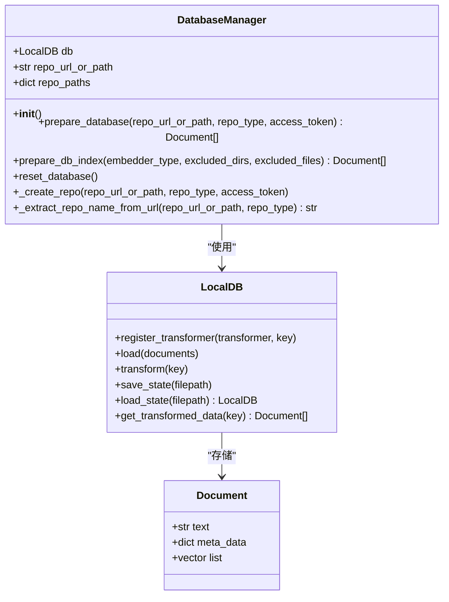
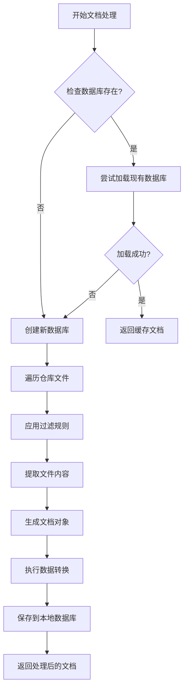
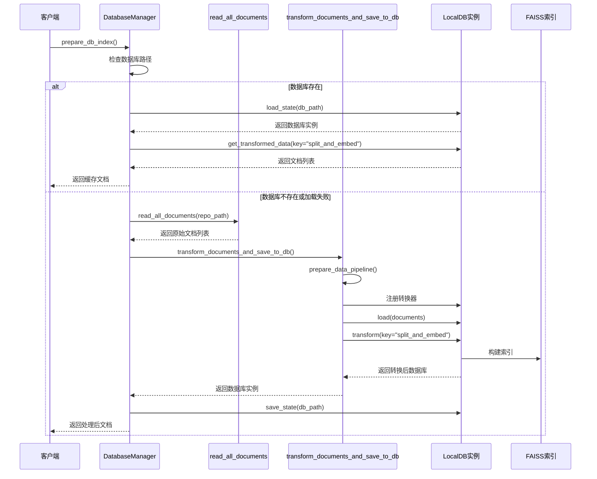
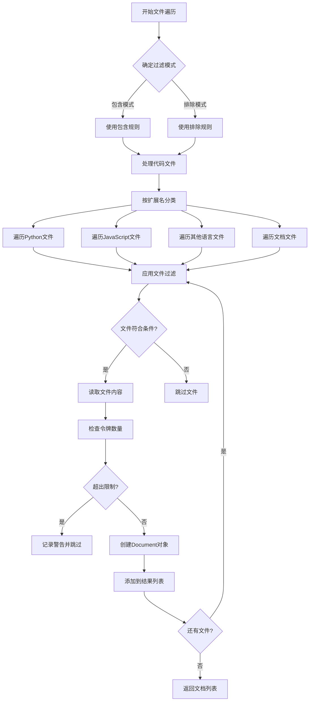
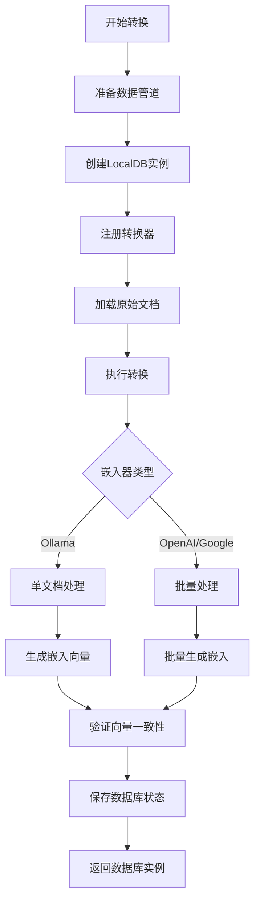
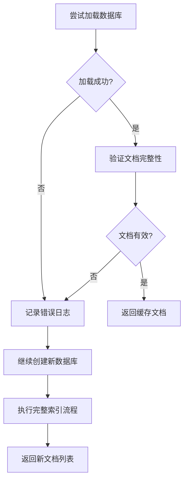
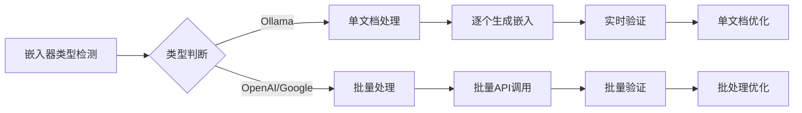
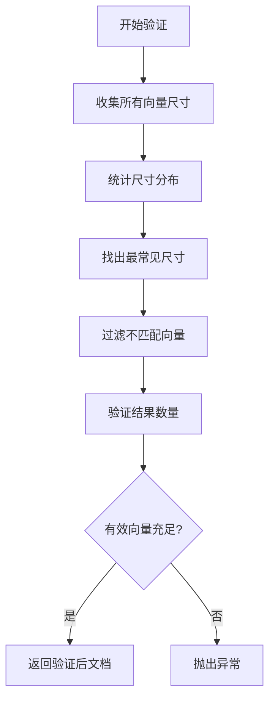

# 索引准备流程

<cite>
**本文档中引用的文件**
- [data_pipeline.py](file://api/data_pipeline.py)
- [rag.py](file://api/rag.py)
- [config.py](file://api/config.py)
- [dashscope_client.py](file://api/dashscope_client.py)
- [ollama_patch.py](file://api/ollama_patch.py)
</cite>

## 目录
1. [简介](#简介)
2. [系统架构概览](#系统架构概览)
3. [核心组件分析](#核心组件分析)
4. [完整执行流程](#完整执行流程)
5. [数据库加载优化机制](#数据库加载优化机制)
6. [文档处理管道](#文档处理管道)
7. [向量索引构建](#向量索引构建)
8. [错误处理与恢复机制](#错误处理与恢复机制)
9. [性能优化策略](#性能优化策略)
10. [总结](#总结)

## 简介

`prepare_db_index`方法是深度知识库系统中向量化索引构建的核心入口点，负责从代码仓库中提取文档内容、生成嵌入向量并构建FAISS索引。该方法实现了智能的数据库加载优化、文档过滤和异常恢复机制，为RAG（检索增强生成）系统提供高质量的向量检索能力。

## 系统架构概览

系统采用模块化设计，主要包含以下核心组件：



**图表来源**
- [data_pipeline.py](file://api/data_pipeline.py#L818-L869)
- [rag.py](file://api/rag.py#L345-L405)

## 核心组件分析

### DatabaseManager类

`DatabaseManager`是索引准备流程的主要协调者，负责管理数据库的生命周期和索引构建过程。



**图表来源**
- [data_pipeline.py](file://api/data_pipeline.py#L703-L885)

**章节来源**
- [data_pipeline.py](file://api/data_pipeline.py#L703-L885)

### 文档处理管道

系统实现了灵活的文档处理管道，支持多种文件类型和处理策略：



**图表来源**
- [data_pipeline.py](file://api/data_pipeline.py#L818-L869)

**章节来源**
- [data_pipeline.py](file://api/data_pipeline.py#L818-L869)

## 完整执行流程

### prepare_db_index方法详解

`prepare_db_index`方法是索引准备流程的核心入口，其执行流程如下：



**图表来源**
- [data_pipeline.py](file://api/data_pipeline.py#L818-L869)

### read_all_documents详细流程

该方法负责遍历仓库文件并提取文本内容：



**图表来源**
- [data_pipeline.py](file://api/data_pipeline.py#L144-L371)

**章节来源**
- [data_pipeline.py](file://api/data_pipeline.py#L144-L371)

### transform_documents_and_save_to_db处理流程

该方法执行文档的分块、嵌入生成和FAISS索引持久化：



**图表来源**
- [data_pipeline.py](file://api/data_pipeline.py#L417-L441)

**章节来源**
- [data_pipeline.py](file://api/data_pipeline.py#L417-L441)

## 数据库加载优化机制

### 缓存命中判断

系统实现了智能的数据库加载优化机制，优先使用已有的.pkl数据库文件：

| 优化策略 | 实现方式 | 性能提升 |
|---------|---------|---------|
| 路径检查 | `os.path.exists(self.repo_paths["save_db_file"])` | 避免重复构建 |
| 异常恢复 | `try-except`块捕获加载异常 | 提高系统稳定性 |
| 内存管理 | `LocalDB.load_state()`直接加载 | 减少内存占用 |
| 日志记录 | 详细的加载状态日志 | 便于问题诊断 |

### 异常恢复机制

当数据库加载失败时，系统自动降级到重新构建流程：



**图表来源**
- [data_pipeline.py](file://api/data_pipeline.py#L842-L852)

**章节来源**
- [data_pipeline.py](file://api/data_pipeline.py#L842-L852)

## 文档处理管道

### 文件过滤机制

系统支持灵活的文件过滤配置，支持包含和排除两种模式：

| 过滤模式 | 配置参数 | 优先级 | 应用场景 |
|---------|---------|-------|---------|
| 包含模式 | `included_dirs`, `included_files` | 高 | 特定目录或文件处理 |
| 排除模式 | `excluded_dirs`, `excluded_files` | 中 | 默认排除测试和临时文件 |
| 混合模式 | 同时指定包含和排除规则 | 最高 | 精确控制处理范围 |

### 文档元数据结构

每个处理后的文档都包含丰富的元数据信息：

| 元数据字段 | 类型 | 描述 | 用途 |
|-----------|------|------|------|
| `file_path` | str | 相对文件路径 | 文件定位和引用 |
| `type` | str | 文件扩展名 | 文件类型识别 |
| `is_code` | bool | 是否为代码文件 | 处理策略选择 |
| `is_implementation` | bool | 是否为实现文件 | 质量评估 |
| `title` | str | 文件标题 | 显示和排序 |
| `token_count` | int | 令牌数量 | 分块策略调整 |

**章节来源**
- [data_pipeline.py](file://api/data_pipeline.py#L321-L331)

### 嵌入生成优化

系统根据不同的嵌入器类型采用不同的处理策略：



**图表来源**
- [data_pipeline.py](file://api/data_pipeline.py#L395-L411)

**章节来源**
- [data_pipeline.py](file://api/data_pipeline.py#L395-L411)

## 向量索引构建

### FAISS索引配置

系统使用FAISS构建高效的向量检索索引：

| 配置参数 | 默认值 | 说明 | 性能影响 |
|---------|-------|------|---------|
| `index_type` | "IVF" | 索引算法类型 | 检索精度与速度平衡 |
| `n_clusters` | 100 | 聚类数量 | 内存使用与检索质量 |
| `metric_type` | "L2" | 距离度量方式 | 相似度计算准确性 |

### 文档向量映射

检索器通过`document_map_func`函数将文档映射为向量：

```python
document_map_func=lambda doc: doc.vector
```

这种设计允许：
- 灵活的向量表示
- 支持不同维度的向量
- 便于向量验证和过滤

**章节来源**
- [rag.py](file://api/rag.py#L388-L390)

## 错误处理与恢复机制

### 嵌入向量验证

系统实现了严格的嵌入向量验证机制，确保索引质量：



**图表来源**
- [rag.py](file://api/rag.py#L251-L343)

### 异常处理策略

| 异常类型 | 处理策略 | 恢复方案 |
|---------|---------|---------|
| 文件读取错误 | 记录警告并跳过 | 继续处理其他文件 |
| 嵌入生成失败 | 创建空向量 | 标记为无效文档 |
| 数据库加载失败 | 重新构建索引 | 使用默认配置 |
| 向量尺寸不一致 | 过滤不匹配向量 | 报告统计信息 |

**章节来源**
- [rag.py](file://api/rag.py#L251-L343)

## 性能优化策略

### 并发处理优化

系统针对不同嵌入器类型采用不同的并发策略：

| 嵌入器类型 | 处理方式 | 批次大小 | 并发度 |
|-----------|---------|---------|-------|
| Ollama | 单文档处理 | 1 | 串行 |
| OpenAI | 批量处理 | 500 | 并行 |
| Google | 批量处理 | 500 | 并行 |

### 内存管理优化

- **延迟加载**：仅在需要时加载数据库
- **流式处理**：大文件分块处理
- **缓存策略**：合理利用内存缓存
- **垃圾回收**：及时释放不需要的对象

### 网络请求优化

对于远程嵌入服务，系统实现了：
- 请求重试机制
- 批量请求合并
- 连接池复用
- 超时控制

## 总结

`prepare_db_index`方法作为向量化索引构建的核心入口，实现了完整的文档处理流水线，包括：

1. **智能数据库加载**：优先使用缓存，异常时自动重建
2. **灵活文件过滤**：支持包含和排除模式，精确控制处理范围
3. **高效文档处理**：分块、嵌入生成、向量验证的完整流程
4. **健壮错误处理**：多层次异常捕获和恢复机制
5. **性能优化**：针对不同场景的优化策略

该方法为RAG系统提供了高质量、高性能的向量检索能力，是整个知识库系统的基础支撑组件。通过合理的架构设计和优化策略，确保了系统的稳定性和可扩展性。