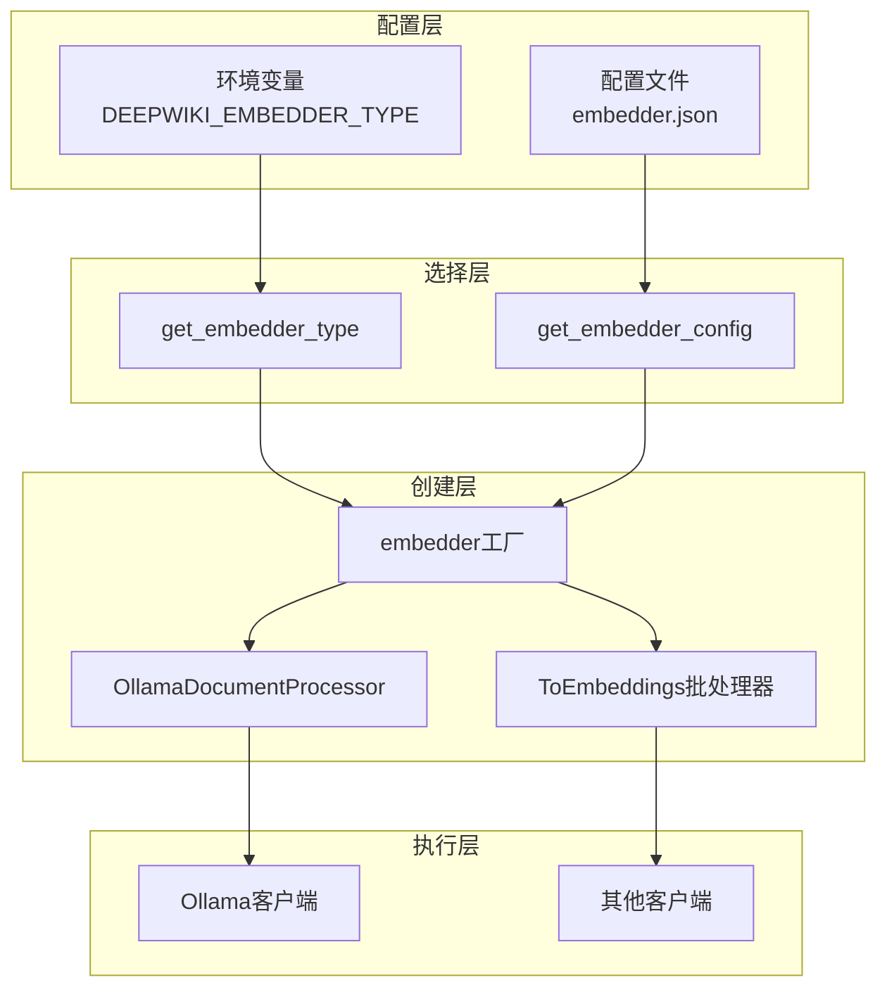
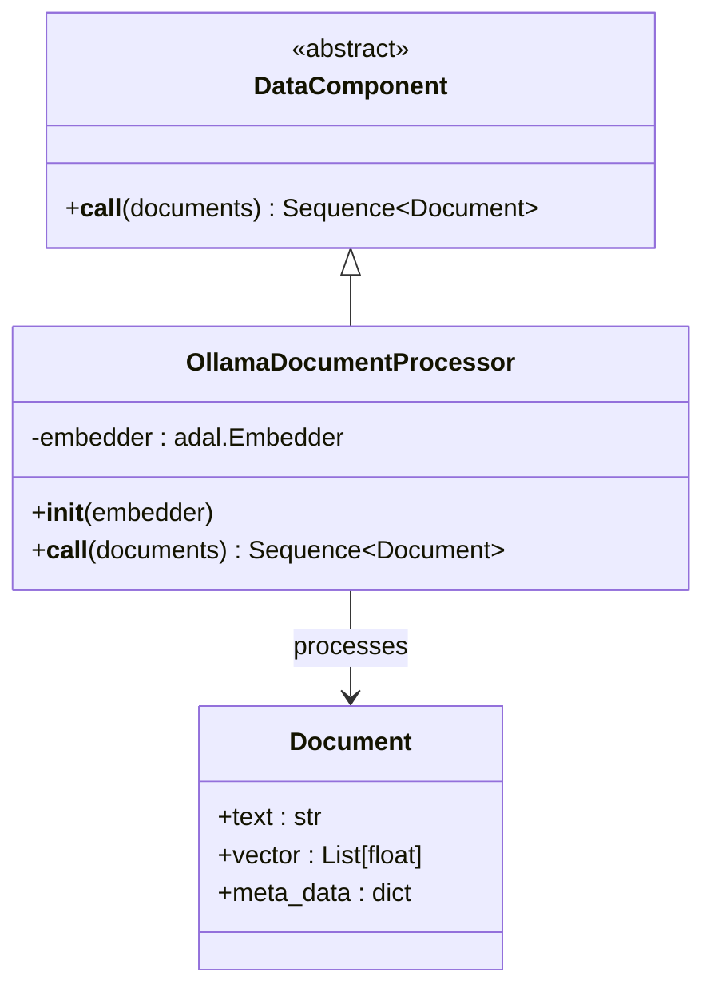
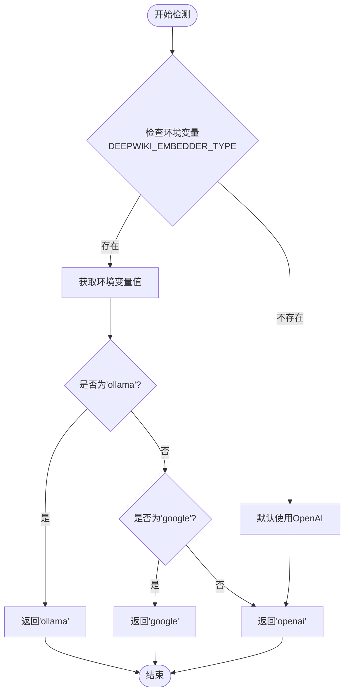
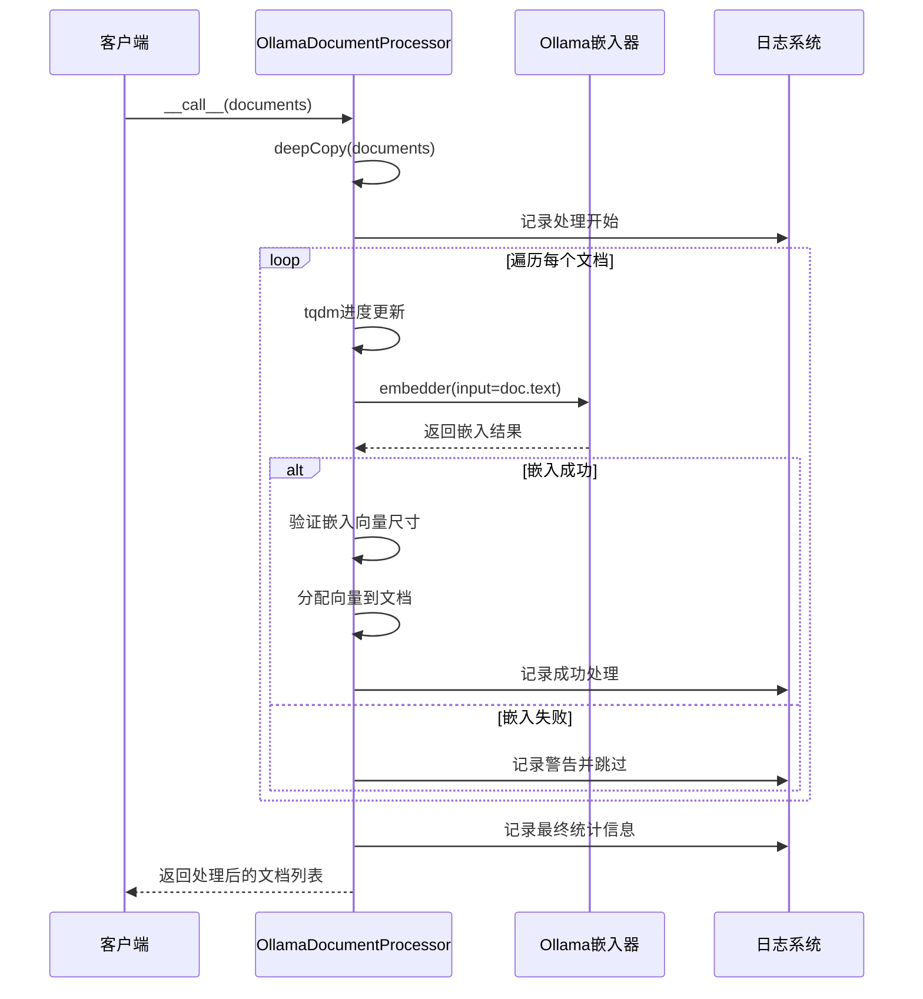
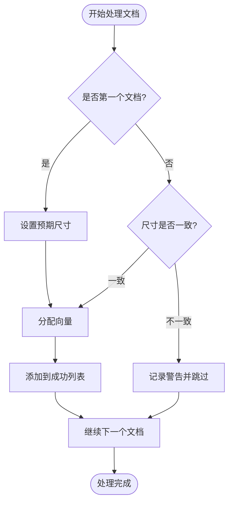
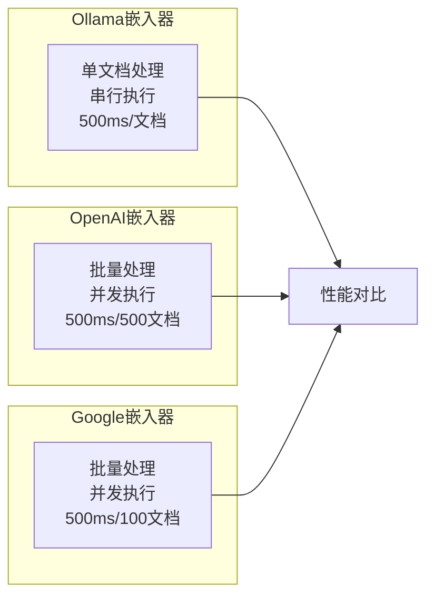
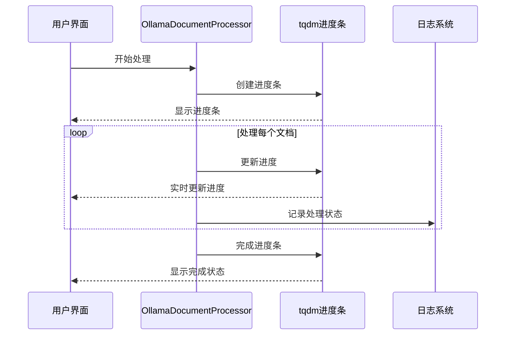

# Ollama嵌入器深度解析

<cite>
**本文档引用的文件**
- [api/ollama_patch.py](file://api/ollama_patch.py)
- [api/tools/embedder.py](file://api/tools/embedder.py)
- [api/config.py](file://api/config.py)
- [api/data_pipeline.py](file://api/data_pipeline.py)
- [api/config/embedder.json](file://api/config/embedder.json)
- [tests/unit/test_all_embedders.py](file://tests/unit/test_all_embedders.py)
</cite>

## 目录
1. [引言](#引言)
2. [项目架构概览](#项目架构概览)
3. [OllamaDocumentProcessor核心分析](#olammadocumentprocessor核心分析)
4. [嵌入器类型检测机制](#嵌入器类型检测机制)
5. [单文档处理模式详解](#单文档处理模式详解)
6. [性能影响与优化策略](#性能影响与优化策略)
7. [可观测性设计](#可观测性设计)
8. [故障排除指南](#故障排除指南)
9. [总结](#总结)

## 引言

Ollama嵌入器是DeepWiki系统中的一个重要组件，它为本地化AI模型提供了强大的文本嵌入能力。然而，由于AdalFlow框架的Ollama客户端不支持批量嵌入处理，系统不得不采用单文档逐个处理的特殊模式。这种设计虽然带来了性能上的挑战，但也确保了系统的稳定性和兼容性。

本文档将深入分析Ollama嵌入器的特殊处理流程，重点阐述OllamaDocumentProcessor类的设计理念、实现细节以及对系统性能的影响。

## 项目架构概览

DeepWiki系统采用了模块化的架构设计，支持多种嵌入器类型的动态切换。系统通过配置文件和环境变量来管理不同嵌入器的参数和行为。

**图表来源**
- [api/config.py](file://api/config.py#L214-L226)
- [api/tools/embedder.py](file://api/tools/embedder.py#L6-L55)
- [api/data_pipeline.py](file://api/data_pipeline.py#L373-L410)

**章节来源**
- [api/config.py](file://api/config.py#L48-L50)
- [api/config/embedder.json](file://api/config/embedder.json#L1-L34)

## OllamaDocumentProcessor核心分析

OllamaDocumentProcessor是系统中专门为Ollama嵌入器设计的文档处理器，它继承自DataComponent基类，专门用于处理AdalFlow框架中不支持批量嵌入的特殊情况。

### 类结构设计

**图表来源**
- [api/ollama_patch.py](file://api/ollama_patch.py#L62-L105)

### 核心功能特性

OllamaDocumentProcessor具有以下关键特性：

1. **单文档处理模式**：每次只处理一个文档，避免批量操作的复杂性
2. **嵌入向量尺寸验证**：确保所有文档生成的嵌入向量具有相同的维度
3. **异常处理机制**：完善的错误捕获和日志记录
4. **进度监控**：集成tqdm提供实时进度反馈

**章节来源**
- [api/ollama_patch.py](file://api/ollama_patch.py#L62-L105)

## 嵌入器类型检测机制

系统通过多层次的检测机制来确定当前使用的嵌入器类型，确保正确选择相应的处理器。

### 检测流程

**图表来源**
- [api/config.py](file://api/config.py#L215-L227)

### 配置优先级

系统按照以下优先级顺序确定嵌入器类型：

1. **环境变量**：DEEPWIKI_EMBEDDER_TYPE（最高优先级）
2. **配置文件**：根据客户端类自动推断
3. **默认值**：OpenAI（最低优先级）

**章节来源**
- [api/config.py](file://api/config.py#L215-L227)
- [api/config.py](file://api/config.py#L160-L173)

## 单文档处理模式详解

### 处理流程分析

OllamaDocumentProcessor的__call__方法实现了严格的单文档处理逻辑：

**图表来源**
- [api/ollama_patch.py](file://api/ollama_patch.py#L71-L105)

### 关键处理步骤

1. **文档复制**：使用deepcopy确保原始文档不变
2. **进度跟踪**：通过tqdm提供实时进度反馈
3. **嵌入生成**：调用embedder为每个文档单独生成嵌入
4. **尺寸验证**：确保所有嵌入向量具有相同维度
5. **异常处理**：捕获并记录处理过程中的所有异常

### 嵌入向量尺寸一致性验证

系统实现了严格的嵌入向量尺寸验证机制：

**图表来源**
- [api/ollama_patch.py](file://api/ollama_patch.py#L86-L96)

**章节来源**
- [api/ollama_patch.py](file://api/ollama_patch.py#L71-L105)

## 性能影响与优化策略

### 性能特征分析

单文档处理模式对系统性能产生了显著影响：

| 性能指标 | 影响程度 | 原因分析 |
|---------|---------|---------|
| 处理速度 | 显著降低 | 每个文档都需要独立的网络请求 |
| 网络开销 | 增加 | 缺乏批量请求的效率优势 |
| 内存使用 | 中等 | 需要同时维护多个文档对象 |
| 并发能力 | 有限 | 默认串行处理 |

### 与其他嵌入器的对比

**图表来源**
- [api/config/embedder.json](file://api/config/embedder.json#L3-L5)
- [api/config/embedder.json](file://api/config/embedder.json#L18-L20)

### 优化建议

1. **缓存机制**：实现嵌入向量缓存减少重复计算
2. **异步处理**：考虑使用异步IO提高并发性能
3. **预处理优化**：在处理前进行文档大小和格式验证
4. **资源池管理**：复用Ollama客户端连接

**章节来源**
- [api/data_pipeline.py](file://api/data_pipeline.py#L402-L410)

## 可观测性设计

### 进度条显示机制

系统集成了tqdm库提供实时进度反馈：

**图表来源**
- [api/ollama_patch.py](file://api/ollama_patch.py#L78-L80)

### 详细日志记录

系统实现了多层次的日志记录机制：

| 日志级别 | 记录内容 | 使用场景 |
|---------|---------|---------|
| INFO | 处理开始、成功数量统计 | 正常运行监控 |
| WARNING | 尺寸不一致、处理失败 | 异常情况提醒 |
| ERROR | 异常处理、系统错误 | 故障诊断 |

### 监控指标

系统收集以下关键监控指标：

1. **处理时间**：每个文档的处理耗时
2. **成功率**：成功处理的文档比例
3. **错误率**：处理失败的文档比例
4. **内存使用**：处理过程中的内存占用

**章节来源**
- [api/ollama_patch.py](file://api/ollama_patch.py#L73-L105)

## 故障排除指南

### 常见问题及解决方案

#### 1. Ollama模型不可用

**症状**：无法连接到Ollama服务或模型不存在

**解决方案**：
- 检查Ollama服务是否正常运行
- 验证模型名称是否正确
- 确认网络连接状态

#### 2. 嵌入向量尺寸不一致

**症状**：日志中出现尺寸不一致警告

**解决方案**：
- 检查模型配置是否正确
- 验证输入文档格式
- 考虑重新初始化嵌入器

#### 3. 处理速度过慢

**症状**：大量文档处理时间过长

**解决方案**：
- 启用嵌入向量缓存
- 考虑使用更高效的模型
- 优化系统资源配置

### 调试技巧

1. **启用详细日志**：设置日志级别为DEBUG获取更多信息
2. **监控网络请求**：检查Ollama服务的响应时间
3. **验证模型状态**：确认Ollama模型已正确加载

**章节来源**
- [api/ollama_patch.py](file://api/ollama_patch.py#L21-L60)

## 总结

Ollama嵌入器的特殊处理流程体现了系统设计中的权衡考虑。虽然单文档逐个处理模式在性能上不如批量处理高效，但它确保了与AdalFlow框架的兼容性和系统的稳定性。

### 主要特点总结

1. **兼容性优先**：适应AdalFlow框架的限制
2. **质量保证**：严格的嵌入向量验证机制
3. **可观测性**：完善的日志和进度跟踪
4. **容错能力**：健壮的异常处理机制

### 发展方向

未来可以考虑以下改进方向：

1. **异步处理**：引入异步IO提高并发性能
2. **智能缓存**：基于内容相似性的嵌入向量缓存
3. **负载均衡**：多Ollama实例的负载分担
4. **性能监控**：更细粒度的性能指标收集

通过深入理解Ollama嵌入器的设计理念和实现细节，开发者可以更好地利用这一强大的本地化AI能力，同时为系统的持续优化提供指导。