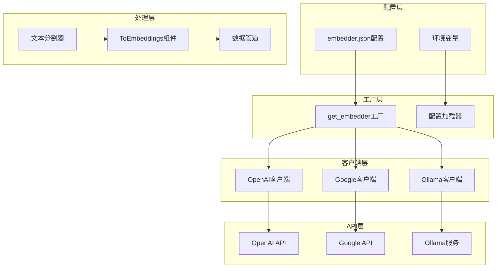
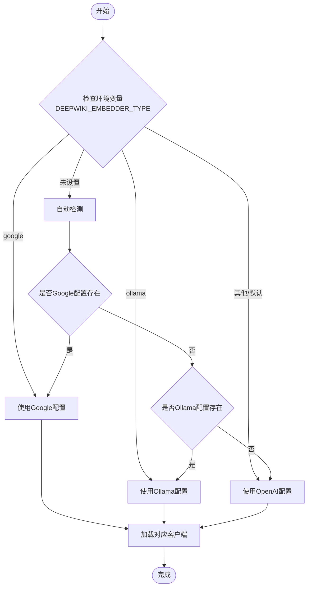
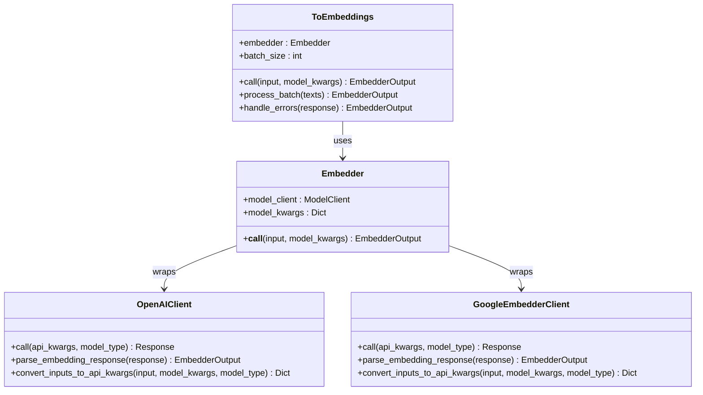
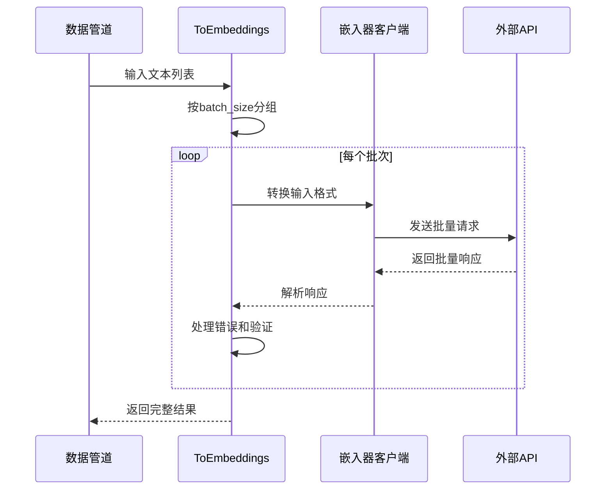
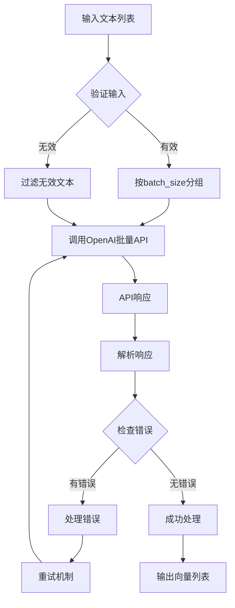
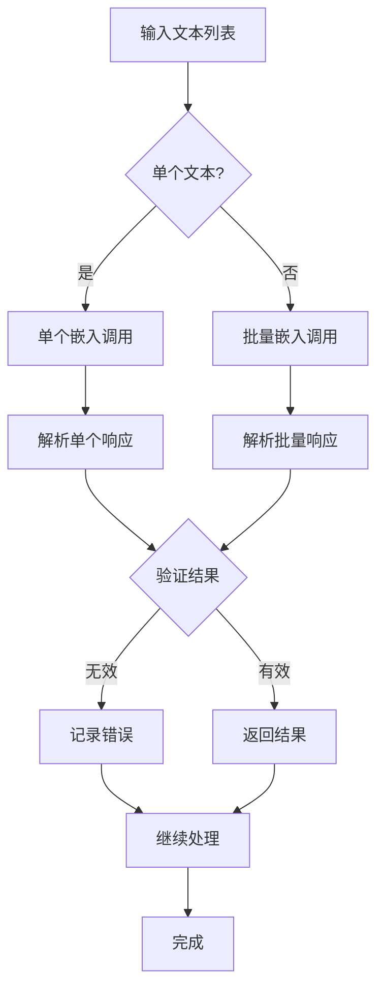
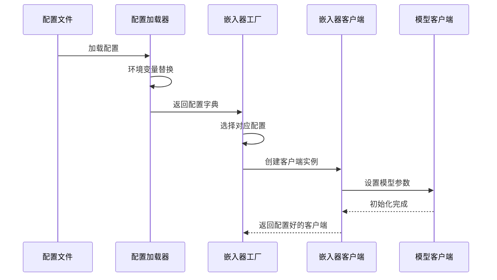
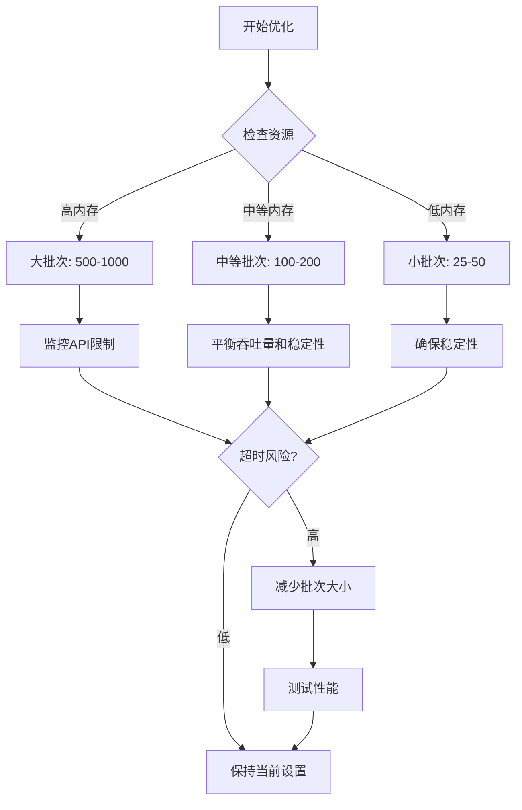
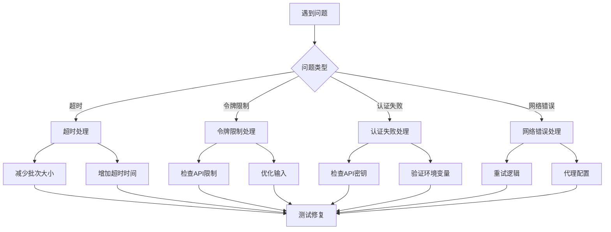

# OpenAI/Google嵌入器

<cite>
**本文档引用的文件**
- [api/tools/embedder.py](file://api/tools/embedder.py)
- [api/data_pipeline.py](file://api/data_pipeline.py)
- [api/openai_client.py](file://api/openai_client.py)
- [api/google_embedder_client.py](file://api/google_embedder_client.py)
- [api/config/embedder.json](file://api/config/embedder.json)
- [api/config.py](file://api/config.py)
- [tests/unit/test_all_embedders.py](file://tests/unit/test_all_embedders.py)
- [api/dashscope_client.py](file://api/dashscope_client.py)
</cite>

## 目录
1. [简介](#简介)
2. [系统架构概览](#系统架构概览)
3. [嵌入器类型与配置](#嵌入器类型与配置)
4. [ToEmbeddings组件详解](#toembeddings组件详解)
5. [批量处理机制](#批量处理机制)
6. [配置文件分析](#配置文件分析)
7. [性能优化策略](#性能优化策略)
8. [故障排除指南](#故障排除指南)
9. [总结](#总结)

## 简介

deepwiki-open项目实现了三种主要的嵌入器：OpenAI、Google和Ollama。其中，OpenAI和Google嵌入器通过API调用实现，支持批量向量化处理，而Ollama嵌入器采用本地部署方式，仅支持单文档处理。本文档重点分析OpenAI和Google嵌入器的实现机制，特别是ToEmbeddings组件如何利用batch_size配置实现高效的批量向量化处理。

## 系统架构概览



**图表来源**
- [api/tools/embedder.py](file://api/tools/embedder.py#L6-L54)
- [api/config/embedder.json](file://api/config/embedder.json#L1-L34)

## 嵌入器类型与配置

### 嵌入器类型检测

系统通过多种方式确定当前使用的嵌入器类型：



**图表来源**
- [api/config.py](file://api/config.py#L160-L227)

### 配置优先级

系统按照以下优先级选择嵌入器配置：
1. 显式指定的`embedder_type`参数
2. 环境变量`DEEPWIKI_EMBEDDER_TYPE`
3. 当前配置文件中的默认设置
4. 自动检测可用的配置

**章节来源**
- [api/config.py](file://api/config.py#L160-L227)
- [api/tools/embedder.py](file://api/tools/embedder.py#L18-L37)

## ToEmbeddings组件详解

### 组件架构

ToEmbeddings是AdalFlow框架中的核心组件，负责将文本转换为向量表示。在deepwiki-open中，它被专门用于OpenAI和Google嵌入器的批量处理。



**图表来源**
- [api/tools/embedder.py](file://api/tools/embedder.py#L39-L54)
- [api/data_pipeline.py](file://api/data_pipeline.py#L402-L410)

### 批量处理流程



**图表来源**
- [api/data_pipeline.py](file://api/data_pipeline.py#L402-L410)

**章节来源**
- [api/data_pipeline.py](file://api/data_pipeline.py#L373-L415)

## 批量处理机制

### OpenAI嵌入器的批量处理

OpenAI嵌入器通过其原生的批量API实现高效处理：



**图表来源**
- [api/openai_client.py](file://api/openai_client.py#L411-L475)

### Google嵌入器的批量处理

Google嵌入器同样支持批量处理，但需要特殊的处理逻辑：



**图表来源**
- [api/google_embedder_client.py](file://api/google_embedder_client.py#L206-L223)

### 批量大小配置

不同嵌入器的推荐批量大小：

| 嵌入器类型 | 推荐批量大小 | 最大限制 | 性能特点 |
|------------|-------------|----------|----------|
| OpenAI | 500 | 2048 | 高吞吐量，低延迟 |
| Google | 100 | 1000 | 中等吞吐量，稳定 |
| Ollama | 1 | 无限制 | 单文档处理，本地 |

**章节来源**
- [api/config/embedder.json](file://api/config/embedder.json#L4-L23)
- [api/data_pipeline.py](file://api/data_pipeline.py#L407-L409)

## 配置文件分析

### 主配置文件结构

embedder.json包含三个主要配置段：

```mermaid
graph LR
subgraph "配置文件结构"
A[embedder] --> A1[OpenAI配置]
B[embedder_google] --> B1[Google配置]
C[embedder_ollama] --> C1[Ollama配置]
D[retriever] --> D1[检索器配置]
E[text_splitter] --> E1[文本分割器配置]
end
A1 --> A2[client_class: OpenAIClient]
A1 --> A3[batch_size: 500]
A1 --> A4[model_kwargs: {...}]
B1 --> B2[client_class: GoogleEmbedderClient]
B1 --> B3[batch_size: 100]
B1 --> B4[model_kwargs: {...}]
C1 --> C2[client_class: OllamaClient]
C1 --> C3[model_kwargs: {...}]
```

**图表来源**
- [api/config/embedder.json](file://api/config/embedder.json#L1-L34)

### 模型参数注入过程



**图表来源**
- [api/config.py](file://api/config.py#L148-L173)
- [api/tools/embedder.py](file://api/tools/embedder.py#L39-L54)

**章节来源**
- [api/config/embedder.json](file://api/config/embedder.json#L1-L34)
- [api/config.py](file://api/config.py#L148-L173)

## 性能优化策略

### 合理设置batch_size

根据不同的使用场景和资源限制，建议采用以下策略：



### 成本效率优化

批量处理在成本效率方面的优势：

1. **API调用次数减少**：批量处理显著降低API调用频率
2. **令牌利用率提高**：充分利用每个批次的令牌配额
3. **网络开销降低**：减少连接建立和断开的开销
4. **并发控制优化**：更好地管理API配额和速率限制

### 吞吐量优化建议

| 优化维度 | OpenAI | Google | Ollama |
|----------|--------|--------|--------|
| 并发数 | 10-20 | 5-10 | 1-2 |
| 批次大小 | 500 | 100 | 1 |
| 缓存策略 | 启用 | 启用 | 启用 |
| 错误重试 | 指数退避 | 指数退避 | 无 |
| 超时设置 | 30秒 | 60秒 | 无限制 |

**章节来源**
- [api/data_pipeline.py](file://api/data_pipeline.py#L407-L409)
- [api/config/embedder.json](file://api/config/embedder.json#L4-L23)

## 故障排除指南

### 常见问题及解决方案



### 性能监控指标

关键性能指标包括：

1. **吞吐量**：每秒处理的文本数量
2. **延迟**：从请求到响应的时间
3. **错误率**：失败请求的比例
4. **API配额使用率**：已使用配额占总配额的百分比
5. **内存使用率**：批量处理过程中的内存消耗

**章节来源**
- [api/openai_client.py](file://api/openai_client.py#L400-L409)
- [api/google_embedder_client.py](file://api/google_embedder_client.py#L186-L190)

## 总结

deepwiki-open项目的OpenAI和Google嵌入器实现展现了现代AI应用的最佳实践。通过ToEmbeddings组件的批量处理机制，系统能够：

1. **高效处理大规模文本数据**：通过合理的batch_size配置，最大化API利用率
2. **提供灵活的配置选项**：支持多种嵌入器类型和自定义参数
3. **实现智能错误处理**：包括重试机制和错误恢复策略
4. **优化资源使用**：平衡性能、成本和稳定性需求

对于开发者而言，理解这些机制有助于：
- 选择合适的嵌入器类型
- 优化批量处理参数
- 实现高效的向量化工作流
- 应对生产环境的各种挑战

通过持续的监控和优化，可以确保嵌入器系统在各种负载下都能保持高性能和高可靠性。