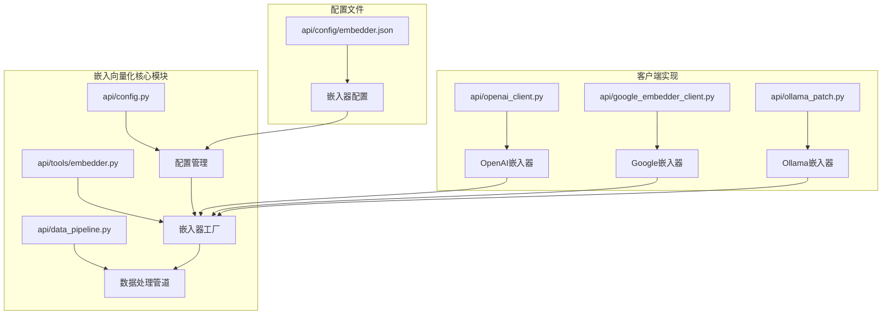
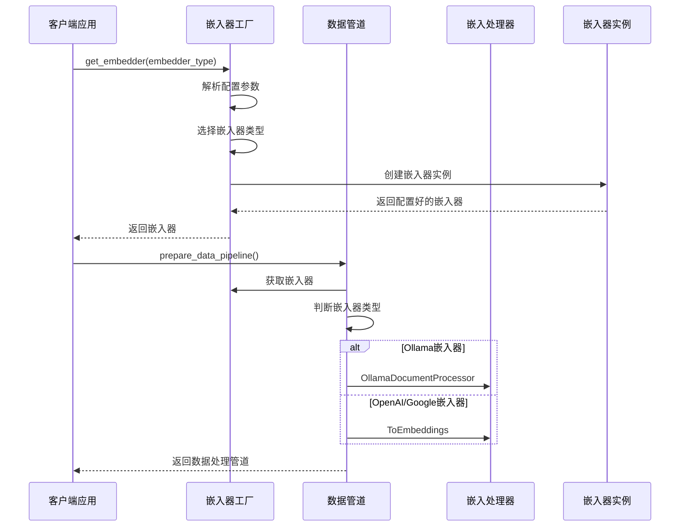
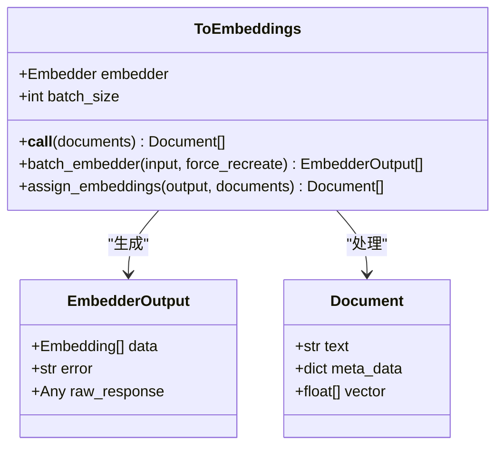
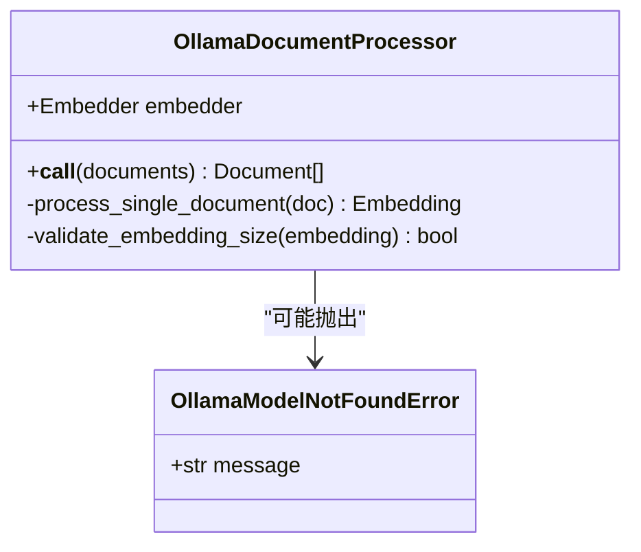
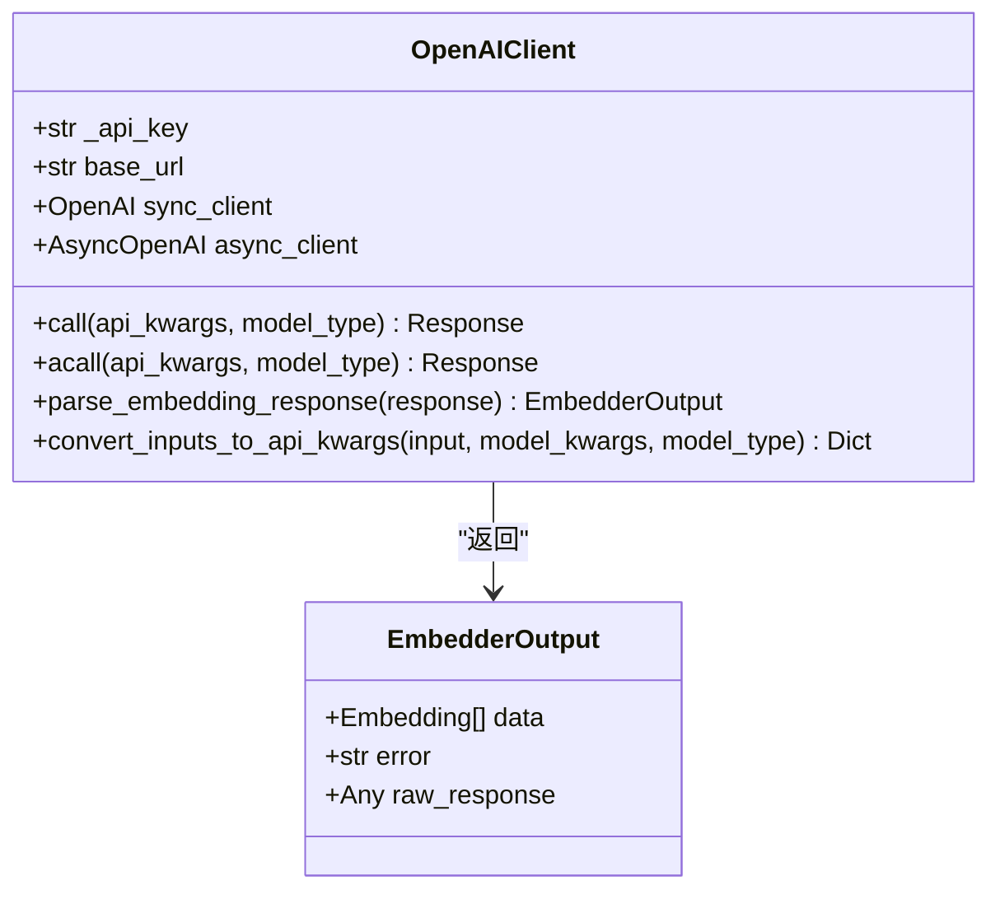
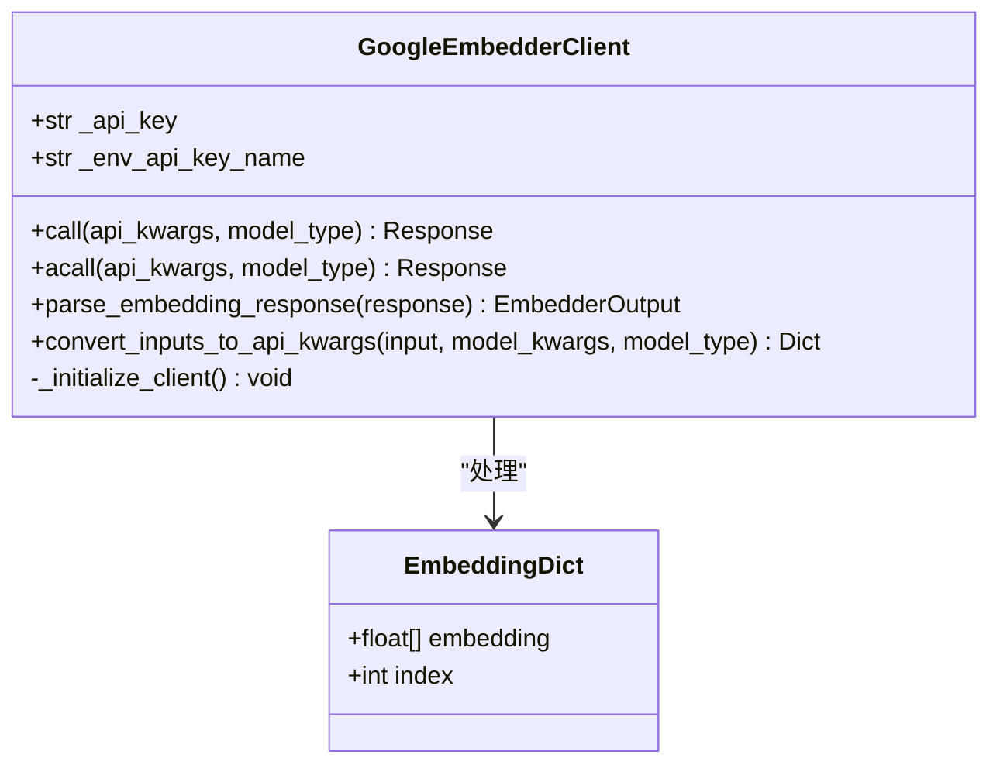
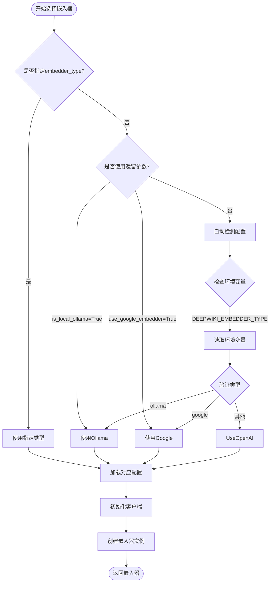
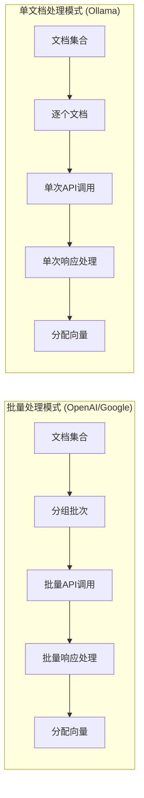

# 嵌入向量化

<cite>
**本文档中引用的文件**
- [api/tools/embedder.py](file://api/tools/embedder.py)
- [api/data_pipeline.py](file://api/data_pipeline.py)
- [api/openai_client.py](file://api/openai_client.py)
- [api/google_embedder_client.py](file://api/google_embedder_client.py)
- [api/ollama_patch.py](file://api/ollama_patch.py)
- [api/config.py](file://api/config.py)
- [api/config/embedder.json](file://api/config/embedder.json)
- [api/logging_config.py](file://api/logging_config.py)
- [tests/unit/test_all_embedders.py](file://tests/unit/test_all_embedders.py)
- [tests/unit/test_google_embedder.py](file://tests/unit/test_google_embedder.py)
</cite>

## 目录
1. [简介](#简介)
2. [项目结构概览](#项目结构概览)
3. [核心组件分析](#核心组件分析)
4. [架构概览](#架构概览)
5. [详细组件分析](#详细组件分析)
6. [嵌入器类型选择机制](#嵌入器类型选择机制)
7. [批量处理与单文档处理对比](#批量处理与单文档处理对比)
8. [性能考量与优化策略](#性能考量与优化策略)
9. [故障排除指南](#故障排除指南)
10. [结论](#结论)

## 简介

deepwiki-open项目实现了一个灵活且可扩展的嵌入向量化系统，支持多种嵌入器类型（OpenAI、Google、Ollama），并根据不同嵌入器的特点采用相应的处理策略。该系统通过智能的嵌入器选择机制和优化的数据处理管道，实现了高效的文本向量化处理。

## 项目结构概览

嵌入向量化功能主要分布在以下模块中：



**图表来源**
- [api/tools/embedder.py](file://api/tools/embedder.py#L1-L55)
- [api/data_pipeline.py](file://api/data_pipeline.py#L1-L800)
- [api/config.py](file://api/config.py#L1-L388)

## 核心组件分析

### 嵌入器工厂 (get_embedder)

嵌入器工厂是整个嵌入向量化系统的核心入口点，负责根据配置参数动态选择合适的嵌入器实例。

**节来源**
- [api/tools/embedder.py](file://api/tools/embedder.py#L6-L54)

### 数据处理管道 (prepare_data_pipeline)

数据处理管道负责构建完整的文档到向量的转换流程，包括文本分割和嵌入生成两个阶段。

**节来源**
- [api/data_pipeline.py](file://api/data_pipeline.py#L373-L415)

### 配置管理系统

配置管理系统提供了统一的嵌入器配置访问接口，支持环境变量驱动的配置管理。

**节来源**
- [api/config.py](file://api/config.py#L160-L227)
- [api/config/embedder.json](file://api/config/embedder.json#L1-L34)

## 架构概览

嵌入向量化系统采用分层架构设计，确保了良好的可扩展性和维护性：



**图表来源**
- [api/tools/embedder.py](file://api/tools/embedder.py#L6-L54)
- [api/data_pipeline.py](file://api/data_pipeline.py#L373-L415)

## 详细组件分析

### ToEmbeddings处理器

ToEmbeddings是AdalFlow框架提供的标准嵌入处理器，专门用于批量处理文档的向量化。



**图表来源**
- [api/data_pipeline.py](file://api/data_pipeline.py#L830-L910)

### OllamaDocumentProcessor处理器

OllamaDocumentProcessor专门为Ollama嵌入器设计，由于Ollama不支持批量处理，因此采用逐个文档处理的方式。



**图表来源**
- [api/ollama_patch.py](file://api/ollama_patch.py#L62-L104)

### OpenAI嵌入器客户端

OpenAI客户端实现了完整的OpenAI API集成，支持流式和非流式调用。



**图表来源**
- [api/openai_client.py](file://api/openai_client.py#L120-L630)

### Google嵌入器客户端

Google客户端提供了对Google AI Embeddings API的完整支持，包括单文档和批量处理。



**图表来源**
- [api/google_embedder_client.py](file://api/google_embedder_client.py#L20-L231)

**节来源**
- [api/google_embedder_client.py](file://api/google_embedder_client.py#L20-L231)

## 嵌入器类型选择机制

系统通过多层次的配置和检测机制来确定使用哪种嵌入器：



**图表来源**
- [api/tools/embedder.py](file://api/tools/embedder.py#L18-L37)
- [api/config.py](file://api/config.py#L215-L227)

### 配置优先级

嵌入器选择遵循以下优先级顺序：

1. **显式参数优先**：`embedder_type`参数具有最高优先级
2. **遗留参数次之**：`is_local_ollama`和`use_google_embedder`参数
3. **环境变量第三**：`DEEPWIKI_EMBEDDER_TYPE`环境变量
4. **默认值最低**：OpenAI作为默认嵌入器

**节来源**
- [api/tools/embedder.py](file://api/tools/embedder.py#L18-L37)
- [api/config.py](file://api/config.py#L49-L50)

## 批量处理与单文档处理对比

### OpenAI/Google嵌入器 - 批量处理模式

OpenAI和Google嵌入器支持批量处理，能够一次性处理多个文档，显著提高处理效率：

| 特性 | OpenAI | Google |
|------|--------|--------|
| **批处理支持** | ✅ 支持 | ✅ 支持 |
| **默认批次大小** | 500 | 100 |
| **网络开销** | 较低（单次请求） | 较低（单次请求） |
| **延迟特性** | 线性增长 | 线性增长 |
| **错误处理** | 批次级别 | 批次级别 |
| **适用场景** | 大规模文档集 | 中等规模文档集 |

### Ollama嵌入器 - 单文档处理模式

Ollama嵌入器由于技术限制，只能逐个处理文档：

| 特性 | Ollama |
|------|--------|
| **批处理支持** | ❌ 不支持 |
| **处理方式** | 单文档逐个处理 |
| **默认批次大小** | 1 |
| **网络开销** | 较高（多次请求） |
| **延迟特性** | 指数增长 |
| **错误处理** | 文档级别 |
| **适用场景** | 小规模或本地部署 |



**图表来源**
- [api/data_pipeline.py](file://api/data_pipeline.py#L402-L410)
- [api/ollama_patch.py](file://api/ollama_patch.py#L71-L104)

**节来源**
- [api/data_pipeline.py](file://api/data_pipeline.py#L402-L410)
- [api/ollama_patch.py](file://api/ollama_patch.py#L62-L104)

## 性能考量与优化策略

### 延迟优化

不同嵌入器类型的延迟特性存在显著差异：

```mermaid
graph TD
subgraph "延迟特性分析"
A[文档数量] --> B{嵌入器类型}
B --> |OpenAI/Google| C[线性延迟<br/>O(n × batch_size)]
B --> |Ollama| D[指数延迟<br/>O(n)]
C --> E[适合大规模处理]
D --> F[适合小规模处理]
end
subgraph "优化策略"
G[缓存机制] --> H[减少重复计算]
I[并发处理] --> J[提高吞吐量]
K[预热机制] --> L[减少冷启动时间]
end
```

### 成本优化

| 嵌入器类型 | 成本因素 | 优化建议 |
|------------|----------|----------|
| **OpenAI** | 按token计费 | 使用较小维度模型，合并短文本 |
| **Google** | 按请求计费 | 合理设置批次大小，避免频繁调用 |
| **Ollama** | 硬件成本 | 本地部署，避免云服务费用 |

### 精度权衡

不同嵌入器在精度方面各有特点：

- **OpenAI**：提供业界领先的语义理解能力
- **Google**：在多语言任务上表现优异
- **Ollama**：适合特定领域或隐私敏感场景

**节来源**
- [api/config/embedder.json](file://api/config/embedder.json#L1-L34)

## 故障排除指南

### 常见问题及解决方案

#### 1. Ollama模型不可用

**问题症状**：`OllamaModelNotFoundError`异常

**解决方案**：
- 检查Ollama服务是否运行：`ollama list`
- 验证模型是否存在：`ollama show model_name`
- 确认环境变量配置正确

#### 2. Google嵌入器解析错误

**问题症状**：`'list' object has no attribute 'embedding'`

**解决方案**：
- 检查Google API密钥有效性
- 验证模型名称拼写
- 确认API权限配置

#### 3. 批量处理超时

**问题症状**：大批量文档处理超时

**解决方案**：
- 减少批次大小
- 增加超时时间设置
- 考虑分批处理

**节来源**
- [api/ollama_patch.py](file://api/ollama_patch.py#L21-L60)
- [tests/unit/test_google_embedder.py](file://tests/unit/test_google_embedder.py#L46-L66)

## 结论

deepwiki-open的嵌入向量化系统展现了优秀的架构设计和灵活性。通过智能的嵌入器选择机制、针对不同嵌入器特性的优化处理策略，以及完善的配置管理系统，该系统能够适应各种部署场景和性能需求。

### 主要优势

1. **多嵌入器支持**：统一接口支持OpenAI、Google、Ollama三种主流嵌入器
2. **自适应处理**：根据嵌入器能力自动选择批量或单文档处理模式
3. **灵活配置**：支持环境变量驱动的配置管理
4. **错误恢复**：完善的错误处理和日志记录机制

### 最佳实践建议

1. **生产环境**：优先使用OpenAI或Google嵌入器以获得最佳性能
2. **本地部署**：考虑使用Ollama嵌入器以降低成本和提高隐私保护
3. **监控告警**：建立完善的日志监控体系
4. **缓存策略**：实施适当的向量缓存机制以提高响应速度

该系统为构建高质量的RAG（检索增强生成）应用提供了坚实的基础，其设计理念和实现方式值得在类似项目中借鉴和应用。