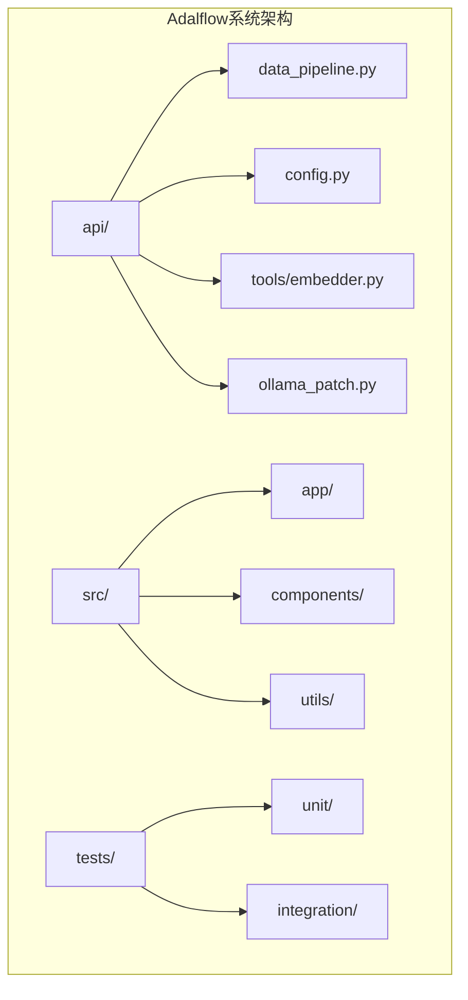
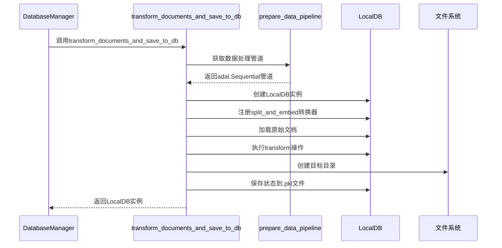
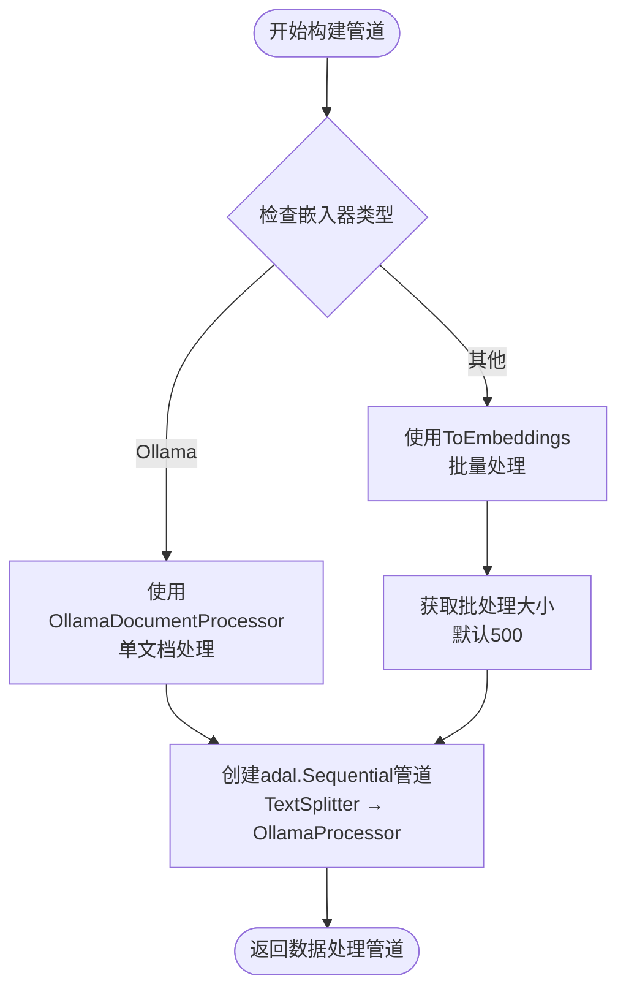
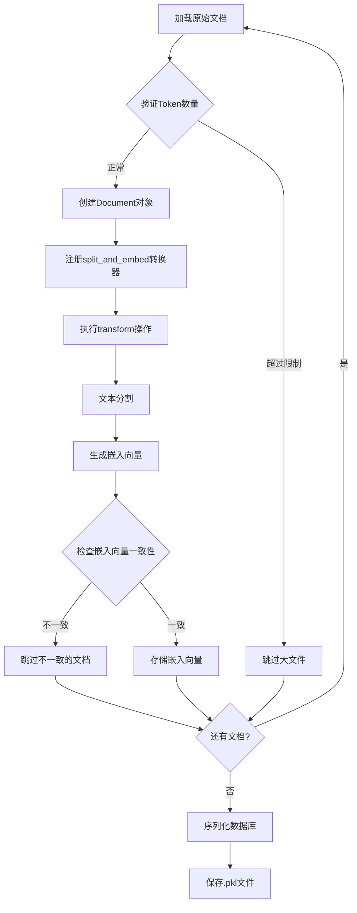
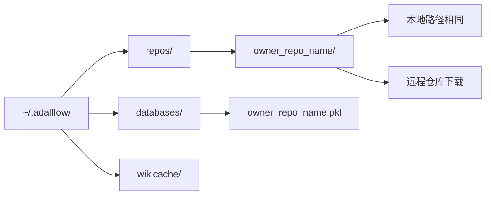
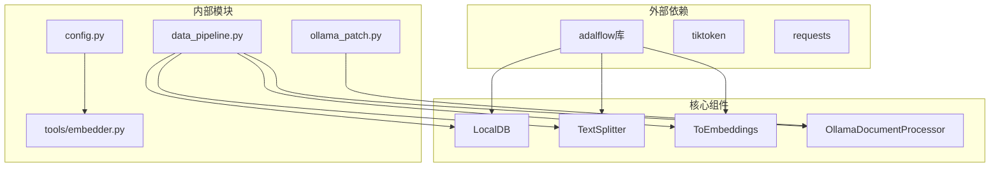

# 数据持久化

<cite>
**本文档中引用的文件**
- [data_pipeline.py](file://api/data_pipeline.py)
- [config.py](file://api/config.py)
- [ollama_patch.py](file://api/ollama_patch.py)
- [README.md](file://README.md)
- [api/README.md](file://api/README.md)
</cite>

## 目录
1. [简介](#简介)
2. [项目结构概览](#项目结构概览)
3. [核心组件分析](#核心组件分析)
4. [架构概览](#架构概览)
5. [详细组件分析](#详细组件分析)
6. [依赖关系分析](#依赖关系分析)
7. [性能考虑](#性能考虑)
8. [故障排除指南](#故障排除指南)
9. [结论](#结论)

## 简介

本文档深入阐述了Adalflow系统中`transform_documents_and_save_to_db`函数如何协调整个数据转换与持久化流程。该函数作为数据管道的核心协调者，负责从文档准备到最终数据库存储的完整生命周期管理。通过调用`prepare_data_pipeline`获取处理链，注册`split_and_embed`转换器，并执行完整的加载、转换和保存操作，确保数据能够高效地被序列化存储至`.pkl`数据库文件中。

该系统采用本地存储架构，所有数据都存储在用户机器上，包括克隆的仓库（`~/.adalflow/repos/`）、嵌入向量和索引（`~/.adalflow/databases/`）以及生成的Wiki缓存（`~/.adalflow/wikicache/`）。这种设计确保了数据隐私性和离线可用性。

## 项目结构概览

Adalflow系统采用模块化架构，主要包含以下关键目录：

**图表来源**
- [data_pipeline.py](file://api/data_pipeline.py#L1-L50)
- [config.py](file://api/config.py#L1-L30)

**章节来源**
- [data_pipeline.py](file://api/data_pipeline.py#L1-L100)
- [README.md](file://README.md#L1-L50)

## 核心组件分析

### transform_documents_and_save_to_db函数

该函数是数据转换与持久化流程的核心协调者，负责：

1. **数据管道准备**：调用`prepare_data_pipeline`获取预配置的数据处理链
2. **数据库实例创建**：初始化`LocalDB`实例用于数据存储
3. **转换器注册**：通过`LocalDB.register_transformer`注册`split_and_embed`转换器
4. **数据加载**：使用`db.load`方法加载原始文档
5. **转换执行**：通过`db.transform`应用数据处理链
6. **状态保存**：将最终状态序列化保存至指定的`.pkl`文件

### prepare_data_pipeline函数

该函数构建了数据转换管道，根据嵌入器类型选择不同的处理策略：

- **Ollama嵌入器**：使用`OllamaDocumentProcessor`进行单文档处理
- **其他嵌入器**：使用`ToEmbeddings`进行批量处理，默认批大小为500

### DatabaseManager类

作为数据库管理的核心类，提供以下功能：

- **数据库准备**：`prepare_database`方法协调整个数据库创建流程
- **仓库管理**：`_create_repo`方法处理本地或远程仓库的下载和存储
- **索引构建**：`prepare_db_index`方法管理现有数据库的加载和新数据库的创建

**章节来源**
- [data_pipeline.py](file://api/data_pipeline.py#L417-L441)
- [data_pipeline.py](file://api/data_pipeline.py#L373-L415)
- [data_pipeline.py](file://api/data_pipeline.py#L703-L884)

## 架构概览

系统采用分层架构设计，清晰分离了数据获取、处理和存储的各个阶段：

**图表来源**
- [data_pipeline.py](file://api/data_pipeline.py#L417-L441)
- [data_pipeline.py](file://api/data_pipeline.py#L373-L415)

## 详细组件分析

### 数据转换管道构建

**图表来源**
- [data_pipeline.py](file://api/data_pipeline.py#L373-L415)

### 文档处理与转换流程

**图表来源**
- [data_pipeline.py](file://api/data_pipeline.py#L417-L441)
- [ollama_patch.py](file://api/ollama_patch.py#L70-L104)

### 数据库路径生成规则

系统采用统一的路径生成规则来管理数据存储：

**图表来源**
- [data_pipeline.py](file://api/data_pipeline.py#L768-L806)

**章节来源**
- [data_pipeline.py](file://api/data_pipeline.py#L373-L441)
- [data_pipeline.py](file://api/data_pipeline.py#L768-L806)

## 依赖关系分析

系统的依赖关系体现了清晰的分层架构：

**图表来源**
- [data_pipeline.py](file://api/data_pipeline.py#L1-L20)
- [config.py](file://api/config.py#L1-L30)

**章节来源**
- [data_pipeline.py](file://api/data_pipeline.py#L1-L20)
- [config.py](file://api/config.py#L1-L50)

## 性能考虑

系统在设计时充分考虑了性能优化：

1. **批处理优化**：对于非Ollama嵌入器，使用500个文档的默认批处理大小
2. **内存管理**：通过逐步处理避免大量内存占用
3. **错误恢复**：对不一致的嵌入向量进行跳过处理，确保数据完整性
4. **并发控制**：Ollama处理器采用单文档处理模式，避免并发问题

## 故障排除指南

### 常见问题及解决方案

1. **嵌入向量不一致**
   - 症状：日志显示"Document has inconsistent embedding size"
   - 解决方案：检查嵌入器配置和模型版本一致性

2. **文件过大导致跳过**
   - 症状：大文件被跳过但无明显错误提示
   - 解决方案：调整`MAX_EMBEDDING_TOKENS`限制或手动处理大文件

3. **权限问题**
   - 症状：无法创建目录或保存文件
   - 解决方案：确保用户对`~/.adalflow`目录有写权限

**章节来源**
- [data_pipeline.py](file://api/data_pipeline.py#L417-L441)
- [ollama_patch.py](file://api/ollama_patch.py#L70-L104)

## 结论

`transform_documents_and_save_to_db`函数作为Adalflow系统数据持久化的核心组件，成功实现了从原始文档到持久化数据库的完整转换流程。通过精心设计的管道架构、灵活的嵌入器支持和robust的错误处理机制，该系统能够高效地处理各种类型的文档数据，并确保数据的安全存储。

系统采用的本地存储架构不仅保证了数据隐私，还提供了离线可用性。统一的路径管理和配置驱动的设计使得系统具有良好的可扩展性和维护性。通过合理的性能优化和错误处理策略，该系统能够在生产环境中稳定运行，为用户提供可靠的数据处理服务。