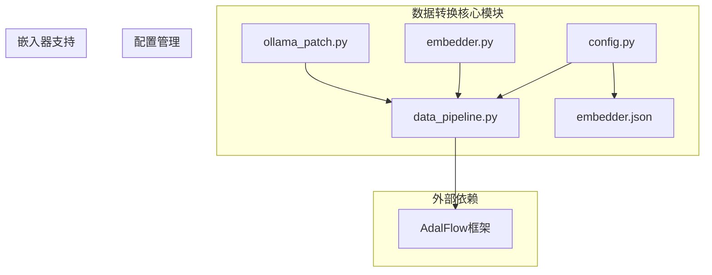
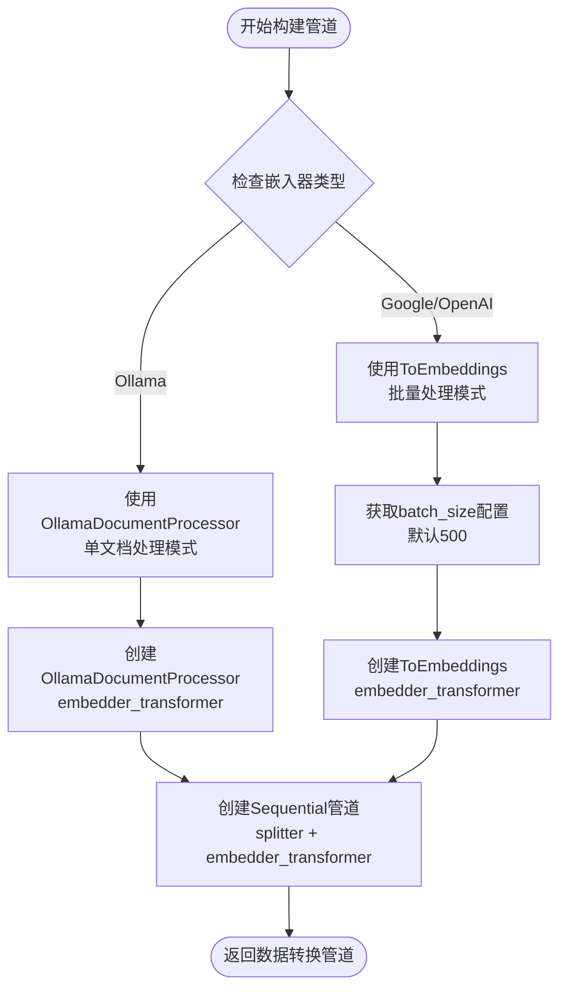
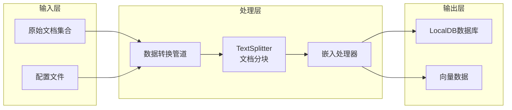
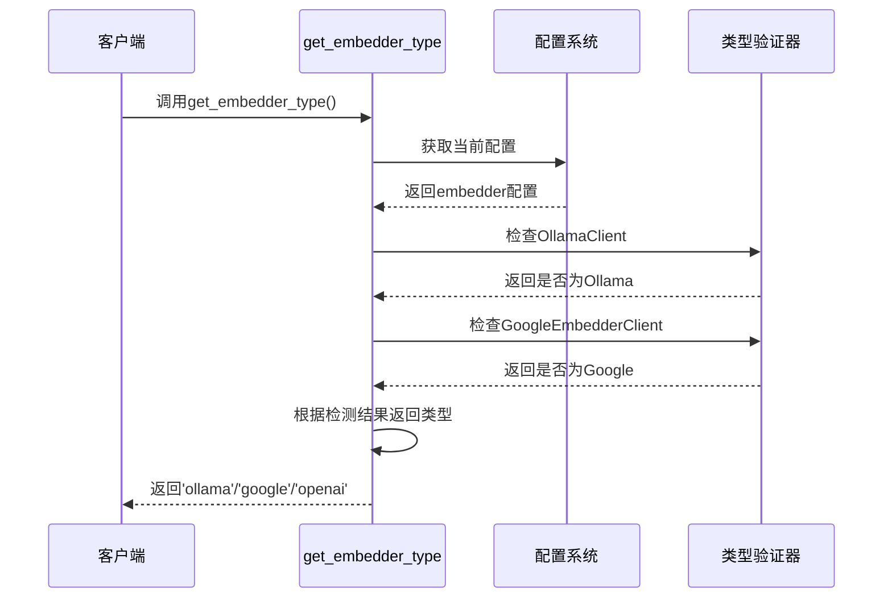
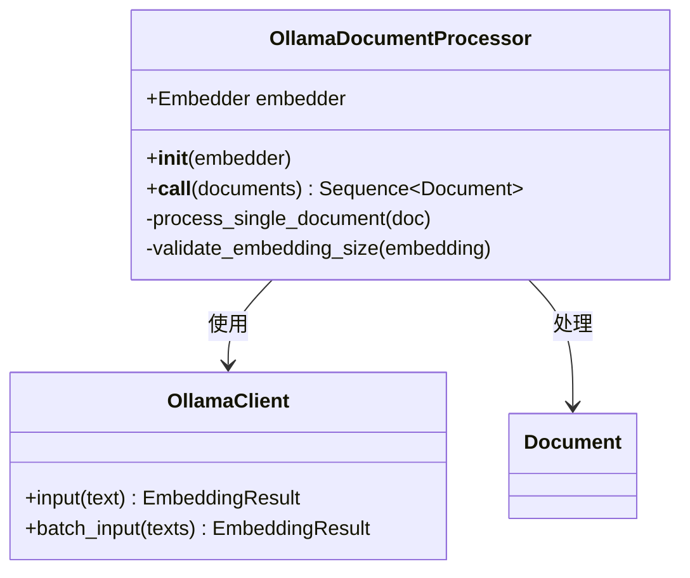
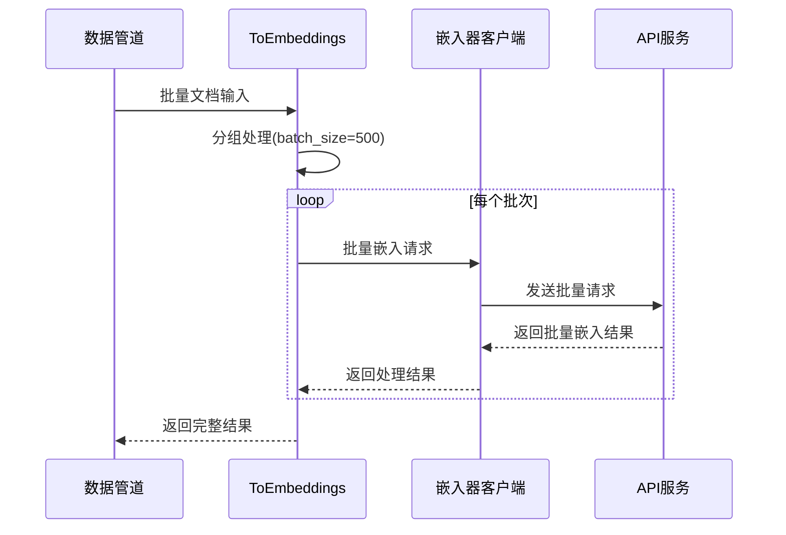
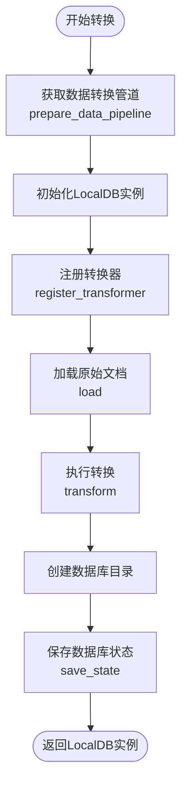
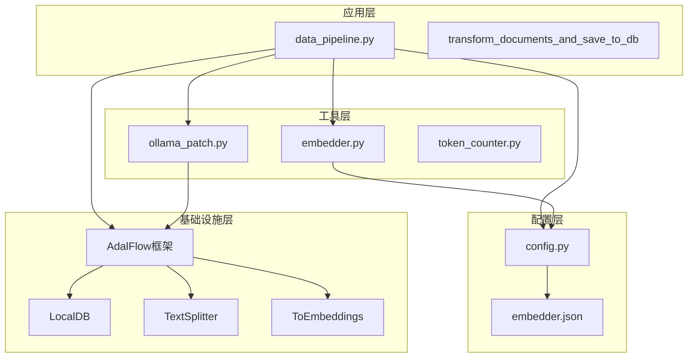

# 数据转换

<cite>
**本文档中引用的文件**
- [data_pipeline.py](file://api/data_pipeline.py)
- [embedder.py](file://api/tools/embedder.py)
- [config.py](file://api/config.py)
- [embedder.json](file://api/config/embedder.json)
- [ollama_patch.py](file://api/ollama_patch.py)
- [test_all_embedders.py](file://tests/unit/test_all_embedders.py)
</cite>

## 目录
1. [简介](#简介)
2. [项目结构概览](#项目结构概览)
3. [核心组件分析](#核心组件分析)
4. [架构概览](#架构概览)
5. [详细组件分析](#详细组件分析)
6. [依赖关系分析](#依赖关系分析)
7. [性能考虑](#性能考虑)
8. [故障排除指南](#故障排除指南)
9. [结论](#结论)

## 简介

deepwiki-open是一个基于AdalFlow框架构建的知识库系统，其核心功能之一是通过`prepare_data_pipeline`函数构建Sequential数据处理管道。该系统能够智能地根据配置选择合适的嵌入模型，并对文档进行分块处理和向量化，最终将处理后的数据持久化到LocalDB数据库中。

本文档详细阐述了数据转换流程的核心机制，包括TextSplitter的分块策略、不同嵌入器的选择逻辑、以及transform_documents_and_save_to_db函数如何协调整个转换过程。

## 项目结构概览

deepwiki-open的数据转换模块主要分布在以下关键文件中：

**图表来源**
- [data_pipeline.py](file://api/data_pipeline.py#L1-L50)
- [embedder.py](file://api/tools/embedder.py#L1-L20)
- [config.py](file://api/config.py#L1-L50)

**章节来源**
- [data_pipeline.py](file://api/data_pipeline.py#L1-L100)
- [embedder.py](file://api/tools/embedder.py#L1-L55)
- [config.py](file://api/config.py#L1-L100)

## 核心组件分析

### prepare_data_pipeline函数

`prepare_data_pipeline`函数是数据转换流程的核心入口点，负责构建AdalFlow的Sequential数据处理管道。该函数根据配置自动选择合适的文本分割器和嵌入处理器。

#### 主要功能特性

1. **嵌入器类型检测**：通过`get_embedder_type()`函数自动识别当前配置的嵌入器类型
2. **配置驱动的组件选择**：根据嵌入器类型动态选择TextSplitter和ToEmbeddings组件
3. **批处理优化**：为不同嵌入器类型配置最优的批处理参数

#### 嵌入器类型处理逻辑

**图表来源**
- [data_pipeline.py](file://api/data_pipeline.py#L373-L415)

**章节来源**
- [data_pipeline.py](file://api/data_pipeline.py#L373-L415)

### TextSplitter配置

TextSplitter组件负责将文档内容按照配置的策略进行分块处理。根据`embedder.json`中的配置，系统采用以下分块策略：

| 配置项 | 值 | 说明 |
|--------|-----|------|
| split_by | word | 按单词边界进行分割 |
| chunk_size | 350 | 每个分块的最大单词数 |
| chunk_overlap | 100 | 分块之间的重叠单词数 |

这种配置确保了：
- **语义完整性**：每个分块包含完整的语义单元
- **上下文连续性**：相邻分块有重叠，保持上下文连续性
- **适中的大小**：避免过大的分块影响处理效率

**章节来源**
- [embedder.json](file://api/config/embedder.json#L28-L32)

## 架构概览

deepwiki-open的数据转换架构采用模块化设计，各组件职责明确，通过AdalFlow的Sequential管道实现数据流的串联处理。

**图表来源**
- [data_pipeline.py](file://api/data_pipeline.py#L412-L415)
- [data_pipeline.py](file://api/data_pipeline.py#L417-L441)

## 详细组件分析

### 嵌入器选择机制

#### get_embedder_type函数

`get_embedder_type`函数是嵌入器类型检测的核心，它通过以下步骤确定当前使用的嵌入器类型：

**图表来源**
- [config.py](file://api/config.py#L215-L227)
- [config.py](file://api/config.py#L175-L214)

#### 不同嵌入器的处理策略

##### Ollama嵌入器

对于Ollama嵌入器，系统采用单文档处理模式：

**图表来源**
- [ollama_patch.py](file://api/ollama_patch.py#L62-L105)

##### OpenAI/Google嵌入器

对于OpenAI和Google嵌入器，系统采用批量处理模式：

**图表来源**
- [data_pipeline.py](file://api/data_pipeline.py#L406-L410)

**章节来源**
- [config.py](file://api/config.py#L215-L227)
- [embedder.py](file://api/tools/embedder.py#L6-L54)
- [ollama_patch.py](file://api/ollama_patch.py#L62-L105)

### transform_documents_and_save_to_db函数

该函数是数据转换流程的协调者，负责注册转换器、加载文档、执行转换链并将结果持久化到LocalDB数据库文件。

#### 流程控制图

**图表来源**
- [data_pipeline.py](file://api/data_pipeline.py#L417-L441)

#### 关键操作详解

1. **转换器注册**：通过`register_transformer`方法将数据转换管道注册为"split_and_embed"键
2. **文档加载**：使用`load`方法将原始文档集合加载到数据库中
3. **转换执行**：调用`transform`方法执行注册的转换管道
4. **状态保存**：将转换后的数据状态保存到指定的数据库文件路径

**章节来源**
- [data_pipeline.py](file://api/data_pipeline.py#L417-L441)

### 文档读取与过滤机制

`read_all_documents`函数实现了智能的文档读取和过滤功能，支持包含模式和排除模式两种过滤策略。

#### 过滤模式对比

| 模式类型 | 描述 | 优先级 | 示例场景 |
|----------|------|--------|----------|
| 包含模式 | 明确指定要处理的目录和文件 | 高 | 只处理特定子目录 |
| 排除模式 | 默认排除常见目录和文件 | 中 | 忽略测试文件和缓存 |
| 自定义模式 | 用户提供的额外排除规则 | 低 | 特殊项目的排除需求 |

**章节来源**
- [data_pipeline.py](file://api/data_pipeline.py#L144-L371)

## 依赖关系分析

deepwiki-open的数据转换模块具有清晰的依赖层次结构：

**图表来源**
- [data_pipeline.py](file://api/data_pipeline.py#L1-L20)
- [embedder.py](file://api/tools/embedder.py#L1-L10)
- [config.py](file://api/config.py#L1-L30)

**章节来源**
- [data_pipeline.py](file://api/data_pipeline.py#L1-L50)
- [embedder.py](file://api/tools/embedder.py#L1-L55)
- [config.py](file://api/config.py#L1-L100)

## 性能考虑

### 嵌入器性能优化

1. **批处理策略**：OpenAI和Google嵌入器使用500个文档的批处理大小，平衡了内存使用和处理效率
2. **单文档处理**：Ollama嵌入器由于不支持批量处理，采用逐个文档处理的方式
3. **令牌限制**：系统设置了8192令牌的硬上限，防止大文件导致的内存问题

### 内存管理

1. **渐进式处理**：文档处理采用迭代方式，避免一次性加载所有文档到内存
2. **错误恢复**：单个文档处理失败不会影响整体流程，系统会跳过有问题的文档
3. **资源清理**：处理完成后及时释放临时资源

### 并发处理

虽然当前实现是顺序处理，但架构设计支持未来的并发扩展：
- TextSplitter可以并行处理不同的文档
- ToEmbeddings支持批量API调用
- OllamaDocumentProcessor可以考虑多线程处理

## 故障排除指南

### 常见问题及解决方案

#### 嵌入器连接问题

**问题**：无法连接到指定的嵌入器服务
**解决方案**：
1. 检查环境变量配置（如OPENAI_API_KEY）
2. 验证网络连接
3. 确认嵌入器服务可用性

#### Ollama模型不存在

**问题**：Ollama嵌入器报告模型不存在
**解决方案**：
1. 使用`check_ollama_model_exists`函数检查模型可用性
2. 确保Ollama服务正在运行
3. 安装所需的嵌入模型

#### 文档处理失败

**问题**：某些文档处理失败
**解决方案**：
1. 检查文档编码格式
2. 验证文档大小是否超过限制
3. 查看详细的错误日志

**章节来源**
- [ollama_patch.py](file://api/ollama_patch.py#L21-L60)
- [data_pipeline.py](file://api/data_pipeline.py#L25-L67)

## 结论

deepwiki-open的数据转换流程展现了现代知识库系统的设计精髓。通过`prepare_data_pipeline`函数构建的AdalFlow Sequential管道，实现了：

1. **智能化的嵌入器选择**：根据配置自动选择最适合的嵌入模型
2. **灵活的文档处理策略**：支持多种嵌入器类型的差异化处理
3. **可靠的转换流程**：通过LocalDB确保数据转换的可靠性和可恢复性
4. **可扩展的架构设计**：模块化设计便于添加新的嵌入器类型和处理策略

该系统不仅满足了当前的功能需求，还为未来的扩展和优化奠定了坚实的基础。通过合理的配置管理和错误处理机制，确保了在各种部署环境下的稳定运行。