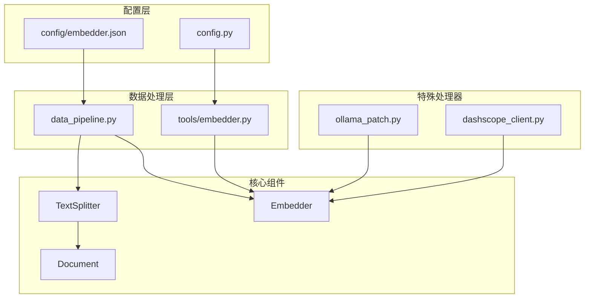
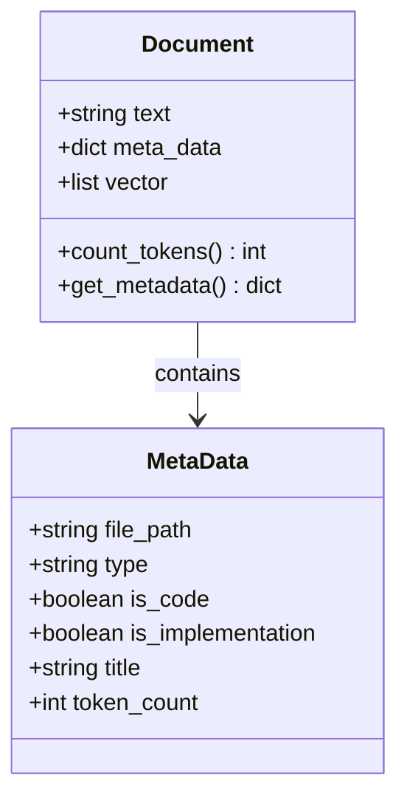
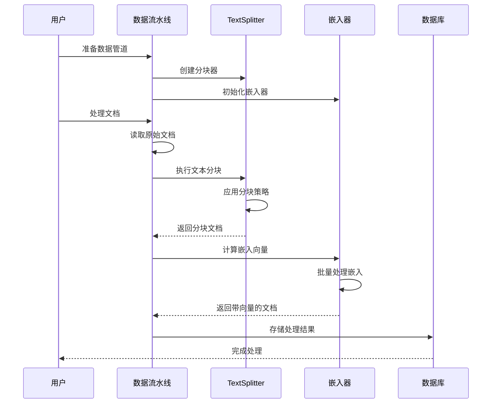
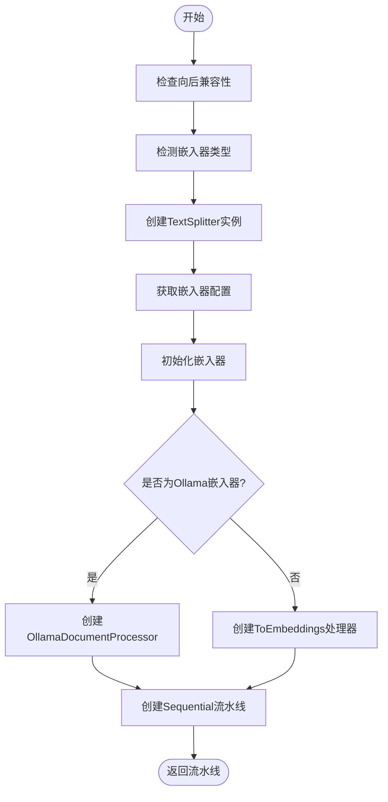
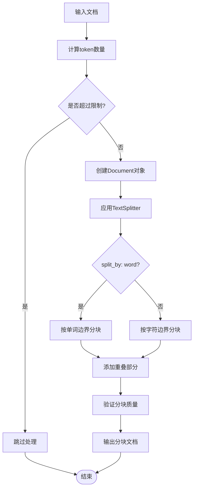
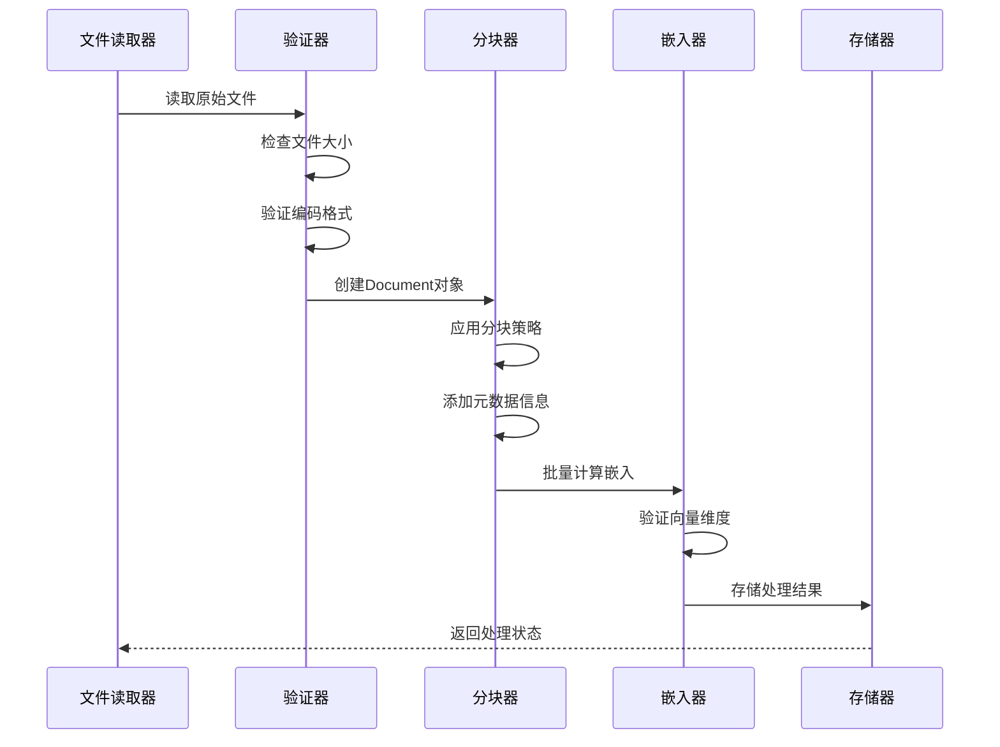
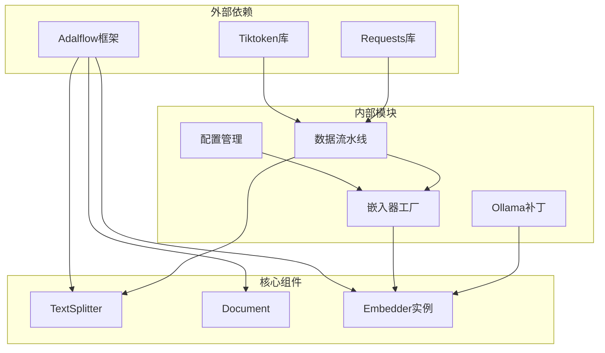

# 文本分块

<cite>
**本文档中引用的文件**
- [data_pipeline.py](file://api/data_pipeline.py)
- [config/embedder.json](file://api/config/embedder.json)
- [config.py](file://api/config.py)
- [tools/embedder.py](file://api/tools/embedder.py)
- [ollama_patch.py](file://api/ollama_patch.py)
- [dashscope_client.py](file://api/dashscope_client.py)
- [rag.py](file://api/rag.py)
- [test_all_embedders.py](file://tests/unit/test_all_embedders.py)
</cite>

## 目录
1. [简介](#简介)
2. [项目结构概览](#项目结构概览)
3. [核心组件分析](#核心组件分析)
4. [架构概览](#架构概览)
5. [详细组件分析](#详细组件分析)
6. [依赖关系分析](#依赖关系分析)
7. [性能考虑](#性能考虑)
8. [故障排除指南](#故障排除指南)
9. [结论](#结论)

## 简介

deepwiki-open项目中的文本分块机制是RAG（检索增强生成）系统的核心组件之一，负责将大型文档分割成适合嵌入模型处理的小块。该系统通过`TextSplitter`组件实现了灵活的分块策略，支持多种分块参数配置，并与嵌入器紧密集成以确保高质量的语义表示。

文本分块机制的主要目标是在保持语义完整性的前提下，将文档合理切分为适合向量化处理的片段，同时避免信息丢失和上下文断裂。系统采用配置驱动的方式，允许用户根据具体需求调整分块策略。

## 项目结构概览

deepwiki-open项目的文本分块功能主要分布在以下关键模块中：

**图表来源**
- [data_pipeline.py](file://api/data_pipeline.py#L1-L50)
- [config/embedder.json](file://api/config/embedder.json#L1-L34)

**章节来源**
- [data_pipeline.py](file://api/data_pipeline.py#L1-L886)
- [config/embedder.json](file://api/config/embedder.json#L1-L34)

## 核心组件分析

### TextSplitter配置

文本分块的核心配置位于`config/embedder.json`文件中，定义了以下关键参数：

| 参数 | 类型 | 默认值 | 描述 |
|------|------|--------|------|
| split_by | string | "word" | 分块依据：word（按单词）或character（按字符） |
| chunk_size | integer | 350 | 每个分块的最大大小（以token为单位） |
| chunk_overlap | integer | 100 | 分块之间的重叠大小（以token为单位） |

这些参数直接影响分块的质量和检索效果：

- **chunk_size（分块大小）**：控制每个文本片段的长度，过小会导致语义不完整，过大则可能超出嵌入模型的token限制
- **chunk_overlap（分块重叠）**：确保相邻分块之间存在语义连续性，防止重要信息在边界处丢失
- **split_by（分块依据）**：决定分块的基本单位，word模式更适合自然语言处理，character模式适用于代码等结构化文本

### Document对象结构

系统中的Document对象包含以下核心属性：

**图表来源**
- [data_pipeline.py](file://api/data_pipeline.py#L355-L365)

**章节来源**
- [data_pipeline.py](file://api/data_pipeline.py#L355-L365)
- [config/embedder.json](file://api/config/embedder.json#L28-L32)

## 架构概览

文本分块机制的整体架构遵循数据流水线模式，从文档读取到最终的向量存储形成完整的处理链路：

**图表来源**
- [data_pipeline.py](file://api/data_pipeline.py#L373-L410)
- [rag.py](file://api/rag.py#L343-L372)

## 详细组件分析

### prepare_data_pipeline函数

`prepare_data_pipeline`函数是文本分块机制的核心入口点，负责创建完整的数据转换流水线：

**图表来源**
- [data_pipeline.py](file://api/data_pipeline.py#L373-L410)

该函数的关键步骤包括：

1. **向后兼容性处理**：支持旧版本的`is_ollama_embedder`参数
2. **嵌入器类型检测**：自动识别当前使用的嵌入器类型
3. **TextSplitter创建**：使用配置文件中的参数初始化分块器
4. **处理器选择**：根据嵌入器类型选择合适的文档处理器
5. **流水线构建**：将分块器和嵌入器组合成顺序处理流水线

### 文本分块策略

文本分块采用基于token的智能分块策略，确保每个分块都符合嵌入模型的要求：

**图表来源**
- [data_pipeline.py](file://api/data_pipeline.py#L344-L371)

### 嵌入器集成

不同类型的嵌入器采用不同的处理策略：

#### OpenAI和Google嵌入器
- 使用批量处理模式，提高处理效率
- 支持较大的批次大小（默认500）
- 自动处理token计数和截断

#### Ollama嵌入器
- 由于Ollama客户端不支持批量处理，采用单文档处理模式
- 使用专门的`OllamaDocumentProcessor`类
- 提供更细粒度的错误处理和验证

**章节来源**
- [data_pipeline.py](file://api/data_pipeline.py#L373-L410)
- [ollama_patch.py](file://api/ollama_patch.py#L62-L105)

### 文档处理流程

系统中的文档处理遵循严格的流程，确保每个步骤的质量控制：

**图表来源**
- [data_pipeline.py](file://api/data_pipeline.py#L144-L371)
- [dashscope_client.py](file://api/dashscope_client.py#L829-L911)

**章节来源**
- [data_pipeline.py](file://api/data_pipeline.py#L144-L371)
- [dashscope_client.py](file://api/dashscope_client.py#L829-L911)

## 依赖关系分析

文本分块机制涉及多个组件之间的复杂依赖关系：

**图表来源**
- [data_pipeline.py](file://api/data_pipeline.py#L1-L20)
- [config.py](file://api/config.py#L1-L50)

**章节来源**
- [data_pipeline.py](file://api/data_pipeline.py#L1-L20)
- [config.py](file://api/config.py#L1-L50)

## 性能考虑

### 分块参数优化

分块策略的选择直接影响系统的整体性能：

- **chunk_size调优**：建议根据嵌入模型的token限制和应用场景平衡大小
- **chunk_overlap设置**：通常设置为chunk_size的20-30%，确保语义连续性
- **split_by选择**：对于自然语言文档优先使用word模式，对于代码文档可考虑character模式

### 批处理优化

系统针对不同嵌入器类型采用不同的批处理策略：

- **批量处理**：OpenAI和Google嵌入器支持大批量处理，提高吞吐量
- **单文档处理**：Ollama嵌入器采用逐个处理，确保兼容性和稳定性
- **内存管理**：合理设置批次大小，避免内存溢出

### Token计数优化

系统使用tiktoken库进行精确的token计数，支持多种嵌入器类型：

- **编码适配**：根据嵌入器类型选择合适的token编码
- **降级策略**：当tiktoken不可用时提供简单的字符计数替代方案
- **缓存机制**：避免重复计算相同文本的token数量

## 故障排除指南

### 常见问题及解决方案

#### 分块失败问题

**症状**：某些文档无法正确分块
**原因**：token数量超过限制或编码问题
**解决方案**：
1. 检查`MAX_EMBEDDING_TOKENS`配置
2. 验证文件编码格式
3. 调整分块参数

#### 嵌入向量异常

**症状**：生成的嵌入向量为空或维度不匹配
**原因**：网络问题、API限制或模型配置错误
**解决方案**：
1. 检查API密钥配置
2. 验证嵌入器类型设置
3. 查看错误日志获取详细信息

#### 性能问题

**症状**：处理速度缓慢
**原因**：批次大小不当或网络延迟
**解决方案**：
1. 调整`batch_size`参数
2. 优化网络连接
3. 考虑使用本地嵌入模型

**章节来源**
- [data_pipeline.py](file://api/data_pipeline.py#L27-L67)
- [dashscope_client.py](file://api/dashscope_client.py#L829-L911)

## 结论

deepwiki-open项目的文本分块机制展现了现代RAG系统设计的最佳实践。通过灵活的配置驱动架构、智能的分块策略和高效的嵌入器集成，该系统能够处理各种规模和类型的文档，为下游的检索和生成任务提供高质量的语义表示。

系统的主要优势包括：

1. **配置灵活性**：支持多种分块策略和参数组合
2. **类型安全**：强类型定义确保数据一致性
3. **性能优化**：针对不同场景的处理策略
4. **错误处理**：完善的异常捕获和恢复机制
5. **扩展性**：模块化设计便于功能扩展

未来的发展方向可以考虑引入更智能的分块算法，如基于语义相似度的动态分块，以及支持更多类型的文档格式和嵌入模型。