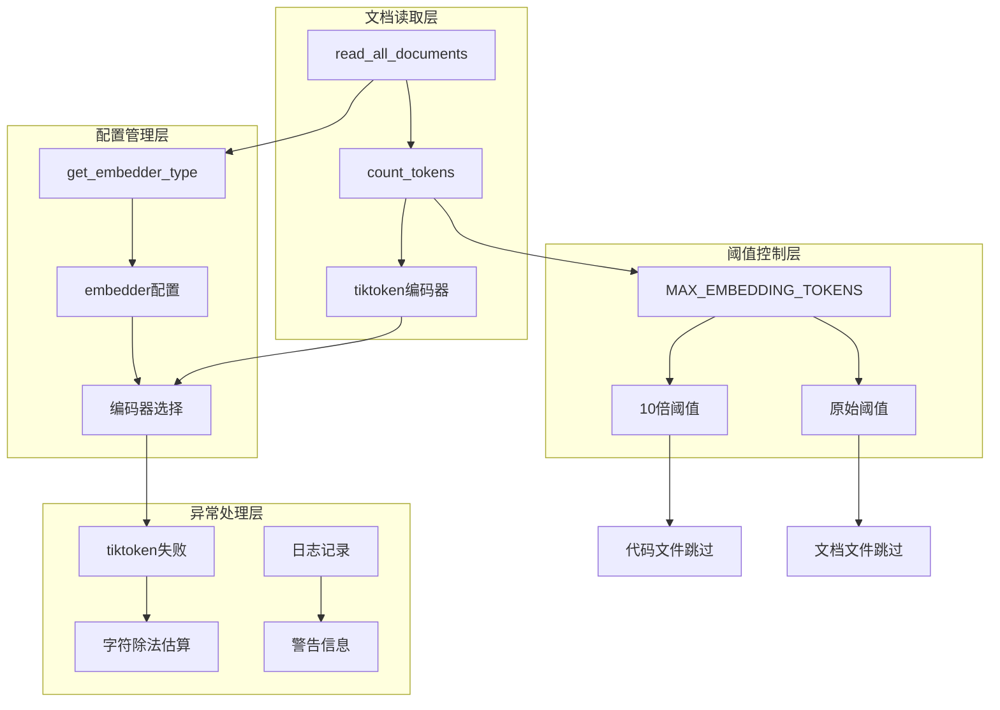
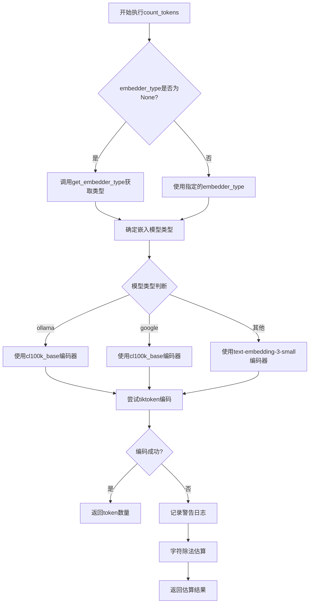
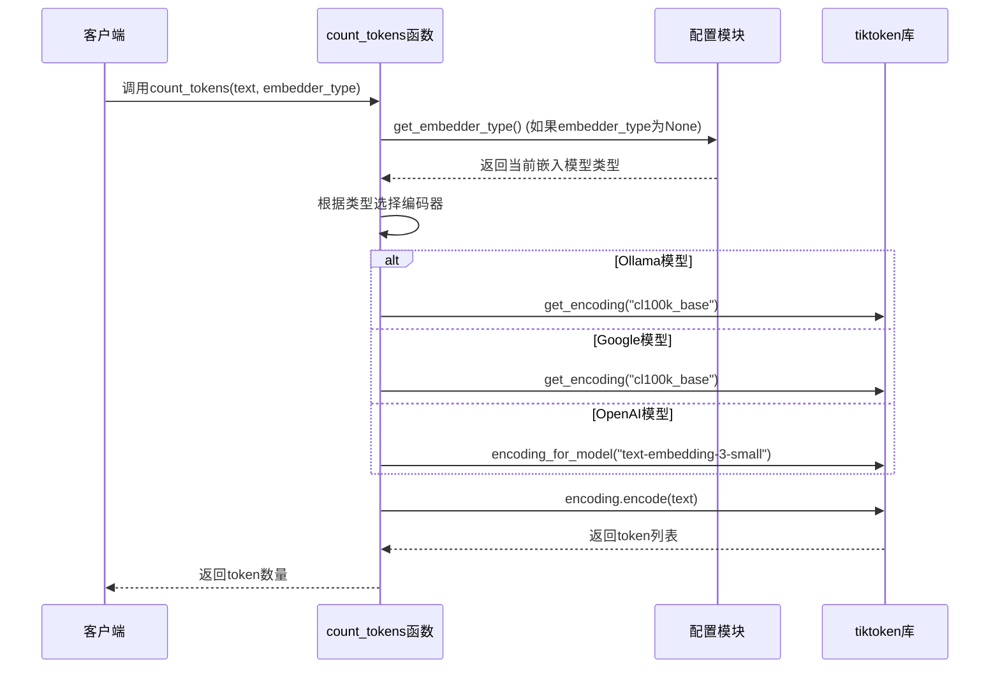
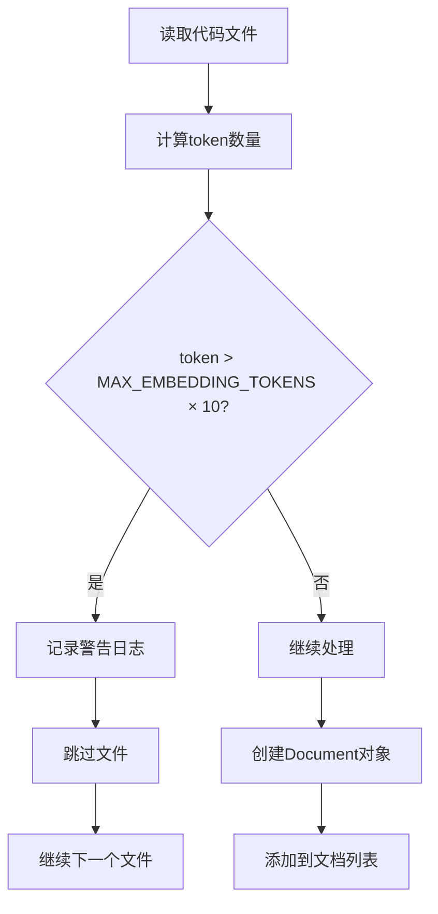
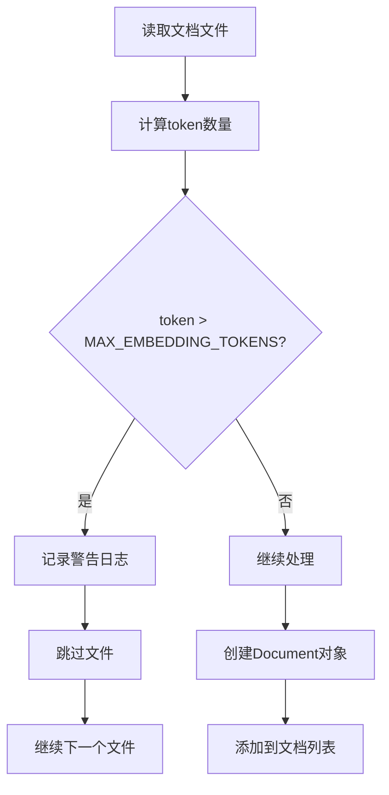
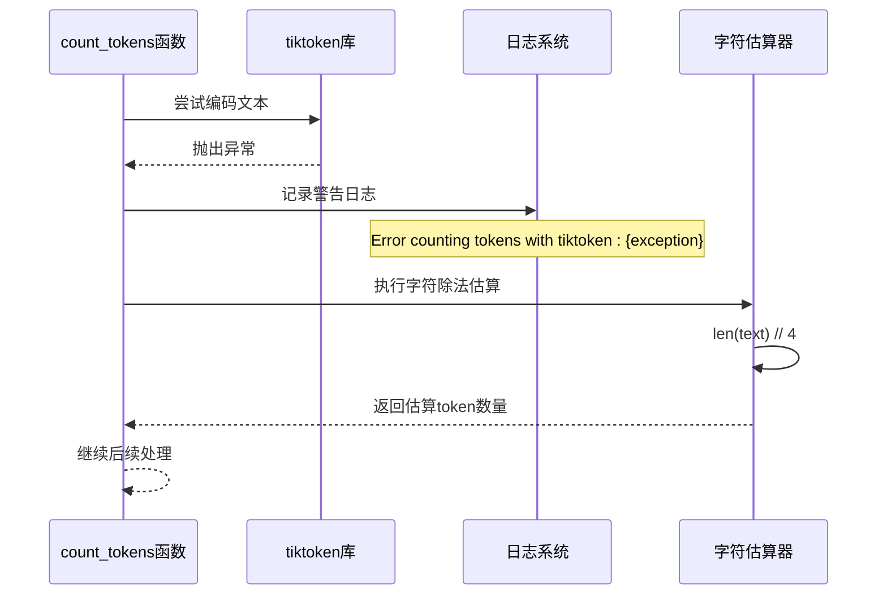
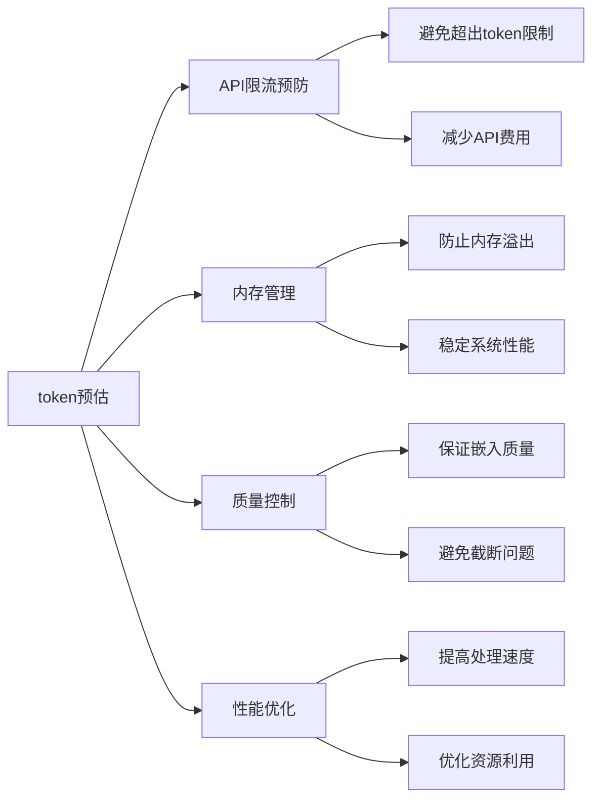

# Token校验机制

<cite>
**本文档中引用的文件**
- [data_pipeline.py](file://api/data_pipeline.py)
- [config.py](file://api/config.py)
- [embedder.py](file://api/tools/embedder.py)
- [logging_config.py](file://api/logging_config.py)
- [dashscope_client.py](file://api/dashscope_client.py)
- [ollama_patch.py](file://api/ollama_patch.py)
- [test_all_embedders.py](file://tests/unit/test_all_embedders.py)
- [uv.lock](file://uv.lock)
</cite>

## 目录
1. [概述](#概述)
2. [核心组件架构](#核心组件架构)
3. [count_tokens函数详解](#count_tokens函数详解)
4. [嵌入模型编码器选择](#嵌入模型编码器选择)
5. [MAX_EMBEDDING_TOKENS常量](#max_embedding_tokens常量)
6. [跳过策略对比](#跳过策略对比)
7. [异常降级处理](#异常降级处理)
8. [token预估的重要性](#token预估的重要性)
9. [实际日志输出示例](#实际日志输出示例)
10. [性能考虑](#性能考虑)
11. [故障排除指南](#故障排除指南)

## 概述

该系统实现了一套完整的token校验机制，用于在文档读取过程中对文本内容进行token数量计算和验证。该机制通过tiktoken库为基础，支持多种嵌入模型（OpenAI、Google、Ollama），并提供了完善的异常降级处理和阈值控制功能。

## 核心组件架构



**图表来源**
- [data_pipeline.py](file://api/data_pipeline.py#L144-L371)
- [config.py](file://api/config.py#L215-L227)

## count_tokens函数详解

`count_tokens`函数是整个token校验机制的核心，负责根据不同的嵌入模型类型选择合适的编码器进行token计算。

### 函数签名和参数

```python
def count_tokens(text: str, embedder_type: str = None, is_ollama_embedder: bool = None) -> int
```

### 参数说明

| 参数 | 类型 | 默认值 | 描述 |
|------|------|--------|------|
| text | str | 必需 | 要计算token的文本内容 |
| embedder_type | str | None | 嵌入模型类型 ('openai', 'google', 'ollama') |
| is_ollama_embedder | bool | None | 废弃参数，使用embedder_type替代 |

### 执行流程



**图表来源**
- [data_pipeline.py](file://api/data_pipeline.py#L27-L67)

**章节来源**
- [data_pipeline.py](file://api/data_pipeline.py#L27-L67)

## 嵌入模型编码器选择

系统根据不同的嵌入模型自动选择最适合的编码器，确保token计算的准确性。

### 编码器映射表

| 嵌入模型类型 | 编码器名称 | 使用场景 | 精度级别 |
|-------------|-----------|----------|----------|
| ollama | cl100k_base | Ollama本地模型 | 高精度 |
| google | cl100k_base | Google Embedding API | 中等精度 |
| openai | text-embedding-3-small | OpenAI官方模型 | 最高精度 |
| 其他 | text-embedding-3-small | 默认OpenAI模型 | 最高精度 |

### 编码器选择逻辑



**图表来源**
- [data_pipeline.py](file://api/data_pipeline.py#L52-L60)
- [config.py](file://api/config.py#L215-L227)

**章节来源**
- [data_pipeline.py](file://api/data_pipeline.py#L52-L60)
- [config.py](file://api/config.py#L160-L173)

## MAX_EMBEDDING_TOKENS常量

系统定义了硬性限制常量`MAX_EMBEDDING_TOKENS = 8192`，这是所有嵌入模型的标准最大token限制。

### 常量定义和用途

```python
# 最大token限制常量
MAX_EMBEDDING_TOKENS = 8192
```

### 阈值应用场景

| 文档类型 | 阈值设置 | 跳过策略 | 原因 |
|---------|---------|----------|------|
| 代码文件 | MAX_EMBEDDING_TOKENS × 10 | 严格过滤 | 代码文件通常较大，需要更严格的控制 |
| 文档文件 | MAX_EMBEDDING_TOKENS | 标准过滤 | 文档文件相对较小，使用标准阈值 |

**章节来源**
- [data_pipeline.py](file://api/data_pipeline.py#L25-L25)

## 跳过策略对比

系统针对不同类型的文档文件采用了差异化的跳过策略，以平衡处理效率和数据完整性。

### 代码文件跳过策略



**图表来源**
- [data_pipeline.py](file://api/data_pipeline.py#L316-L319)

### 文档文件跳过策略



**图表来源**
- [data_pipeline.py](file://api/data_pipeline.py#L350-L353)

### 跳过策略对比表

| 特征 | 代码文件策略 | 文档文件策略 |
|------|-------------|-------------|
| 阈值倍数 | 10倍阈值 | 原始阈值 |
| 处理方式 | 严格过滤 | 标准过滤 |
| 性能影响 | 更低吞吐量 | 正常吞吐量 |
| 数据完整性 | 可能丢失部分代码 | 完整保留 |
| 内存消耗 | 较少内存占用 | 正常内存占用 |

**章节来源**
- [data_pipeline.py](file://api/data_pipeline.py#L316-L353)

## 异常降级处理

当tiktoken库无法正常工作时，系统提供了字符除法估算作为降级方案，确保系统能够继续运行。

### 降级流程



**图表来源**
- [data_pipeline.py](file://api/data_pipeline.py#L64-L67)

### 降级策略说明

| 场景 | tiktoken行为 | 降级方案 | 估算公式 | 精度影响 |
|------|-------------|----------|----------|----------|
| 编码器加载失败 | 抛出异常 | 字符除法 | len(text) // 4 | 粗略估算 |
| 文本编码错误 | 抛出异常 | 字符除法 | len(text) // 4 | 粗略估算 |
| 内存不足 | 抛出异常 | 字符除法 | len(text) // 4 | 粗略估算 |
| 网络连接问题 | 抛出异常 | 字符除法 | len(text) // 4 | 粗略估算 |

**章节来源**
- [data_pipeline.py](file://api/data_pipeline.py#L64-L67)

## token预估的重要性

token预估在防止API超限、控制内存消耗和优化嵌入质量方面发挥着关键作用。

### 预估功能的价值



### 预估精度对比

| 预估方法 | 精度 | 速度 | 内存消耗 | 适用场景 |
|---------|------|------|----------|----------|
| tiktoken精确计算 | ±5% | 中等 | 中等 | 生产环境 |
| 字符除法估算 | ±20% | 极快 | 极低 | 异常降级 |
| 机器学习预测 | ±2% | 慢 | 高 | 高精度需求 |

**章节来源**
- [data_pipeline.py](file://api/data_pipeline.py#L27-L67)

## 实际日志输出示例

以下是系统在不同场景下的典型日志输出示例：

### 正常token计算日志

```
INFO - Found 123 documents
```

### 大文件跳过日志

```
WARNING - Skipping large file src/large_module.py: Token count (8500) exceeds limit
```

### tiktoken异常降级日志

```
WARNING - Error counting tokens with tiktoken: Encoding 'text-embedding-3-small' not found
WARNING - Skipping problematic file due to token counting failure
```

### 嵌入大小不一致日志

```
WARNING - Document 'src/utils.py' has inconsistent embedding size 768 != 1536, skipping
```

### 日志配置示例

```python
# 日志格式配置
log_format = "%(asctime)s - %(levelname)s - %(name)s - %(filename)s:%(lineno)d - %(message)s"

# 文件处理器配置
file_handler = RotatingFileHandler(
    resolved_path, 
    maxBytes=max_bytes, 
    backupCount=backup_count, 
    encoding="utf-8"
)
```

**章节来源**
- [data_pipeline.py](file://api/data_pipeline.py#L318-L352)
- [logging_config.py](file://api/logging_config.py#L61-L70)

## 性能考虑

### 计算复杂度分析

| 操作 | 时间复杂度 | 空间复杂度 | 说明 |
|------|-----------|-----------|------|
| tiktoken编码 | O(n) | O(n) | n为文本长度 |
| 字符除法估算 | O(1) | O(1) | 常数时间复杂度 |
| 文档遍历 | O(m) | O(1) | m为文档数量 |
| token比较 | O(1) | O(1) | 常数时间复杂度 |

### 优化建议

1. **批量处理优化**：对于大量文档，考虑使用批处理模式
2. **缓存机制**：对重复文档的token计算结果进行缓存
3. **异步处理**：在支持的环境中使用异步token计算
4. **内存管理**：及时释放不再需要的文档对象

### 性能监控指标

```python
# 关键性能指标监控
metrics = {
    "token_calculation_time": float,      # token计算耗时
    "documents_processed": int,           # 处理的文档数量
    "tokens_skipped": int,               # 跳过的token数量
    "fallback_count": int,               # 降级次数
    "memory_usage": float                # 内存使用量
}
```

## 故障排除指南

### 常见问题及解决方案

| 问题类型 | 症状 | 可能原因 | 解决方案 |
|---------|------|----------|----------|
| tiktoken加载失败 | Encoding not found错误 | 编码器缺失或损坏 | 重新安装tiktoken库 |
| 内存不足 | MemoryError异常 | 文档过大或内存泄漏 | 增加内存限制或优化算法 |
| API超限 | 429错误响应 | token数量过多 | 调整阈值或分批处理 |
| 编码问题 | UnicodeDecodeError | 文件编码不匹配 | 指定正确编码格式 |

### 调试技巧

1. **启用详细日志**：设置日志级别为DEBUG以获取更多信息
2. **监控token分布**：分析文档的token数量分布情况
3. **性能分析**：使用性能分析工具识别瓶颈
4. **异常捕获**：在关键位置添加异常处理逻辑

### 配置检查清单

- [ ] tiktoken库版本是否为0.9.0或更高
- [ ] 环境变量DEEPWIKI_EMBEDDER_TYPE设置正确
- [ ] MAX_EMBEDDING_TOKENS常量未被意外修改
- [ ] 日志配置确保适当的日志级别
- [ ] 内存和CPU资源充足

**章节来源**
- [data_pipeline.py](file://api/data_pipeline.py#L64-L67)
- [uv.lock](file://uv.lock#L1394-L1406)