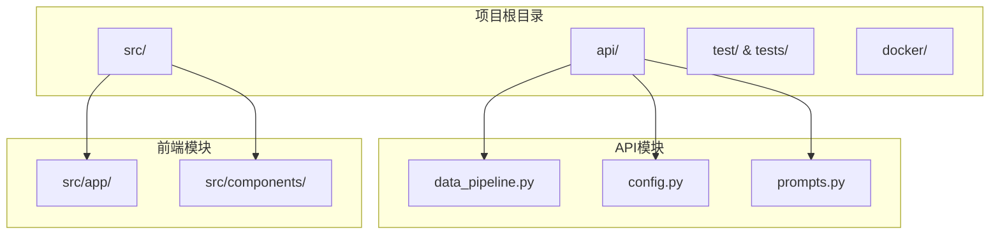
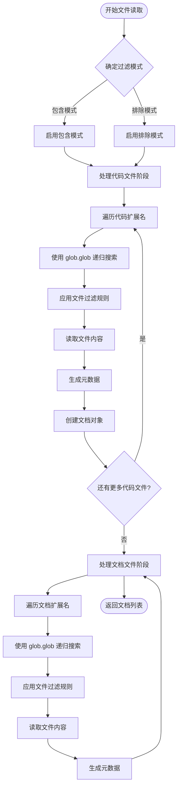
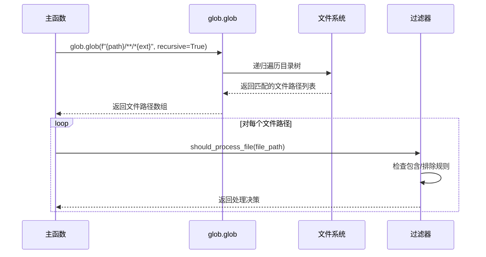
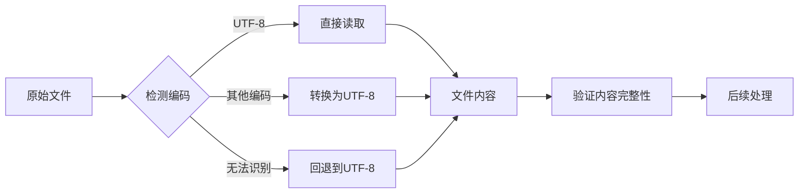
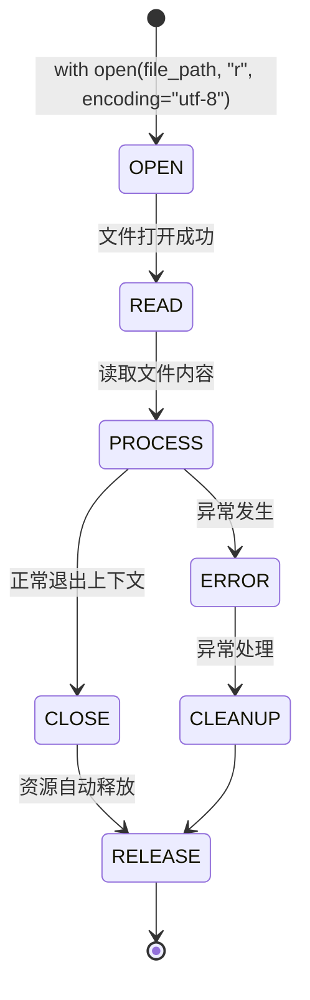
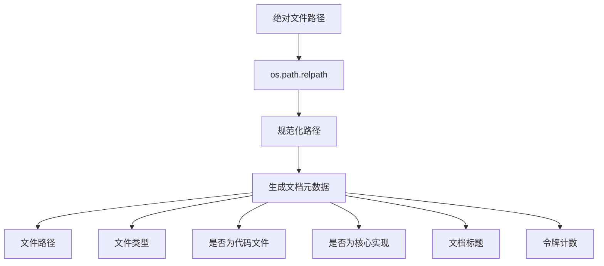
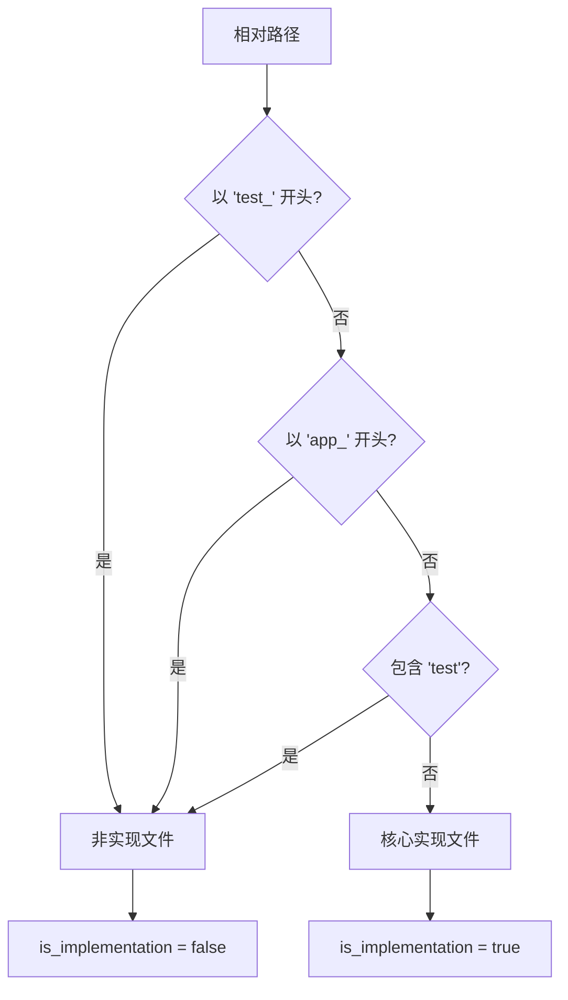
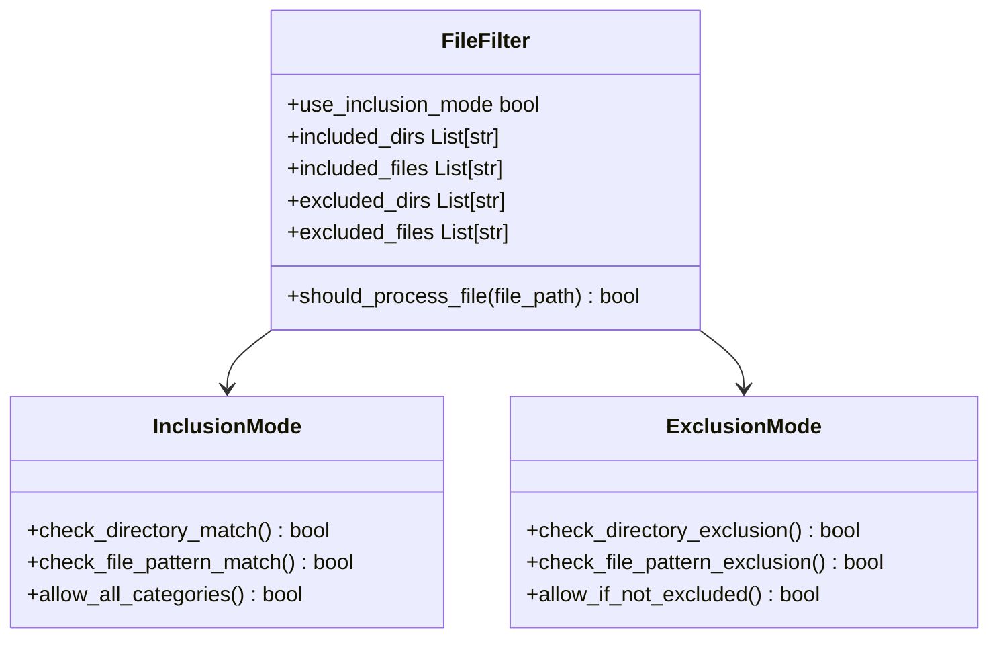
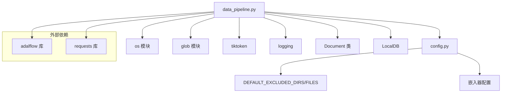
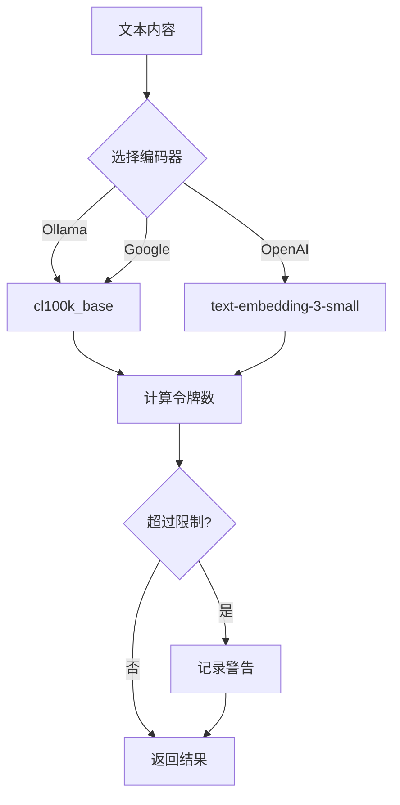

# 文件读取

<cite>
**本文档中引用的文件**
- [data_pipeline.py](file://api/data_pipeline.py)
- [config.py](file://api/config.py)
- [prompts.py](file://api/prompts.py)
- [websocket_wiki.py](file://api/websocket_wiki.py)
- [test_all_embedders.py](file://tests/unit/test_all_embedders.py)
</cite>

## 目录
1. [简介](#简介)
2. [项目结构概览](#项目结构概览)
3. [核心组件分析](#核心组件分析)
4. [架构概览](#架构概览)
5. [详细组件分析](#详细组件分析)
6. [依赖关系分析](#依赖关系分析)
7. [性能考虑](#性能考虑)
8. [故障排除指南](#故障排除指南)
9. [结论](#结论)

## 简介

本文档详细描述了 `read_all_documents` 函数中文件读取的执行流程，该函数是深度知识库系统的核心组件之一。该函数负责递归扫描指定目录下的所有文件，按代码文件和文档文件分阶段处理，并使用 UTF-8 编码强制读取策略确保多语言源码兼容性。

## 项目结构概览

该项目采用模块化架构，主要包含以下关键目录：
- `api/`: 核心 API 和数据处理功能
- `src/`: 前端应用和组件
- `test/` 和 `tests/`: 测试套件
- `docker/`: 容器化配置

**图表来源**
- [data_pipeline.py](file://api/data_pipeline.py#L1-L50)
- [config.py](file://api/config.py#L1-L30)

**章节来源**
- [data_pipeline.py](file://api/data_pipeline.py#L1-L100)
- [config.py](file://api/config.py#L1-L50)

## 核心组件

### read_all_documents 函数

`read_all_documents` 是文件读取流程的核心函数，它实现了以下关键功能：

1. **文件扩展名分类**: 将文件分为代码文件 (`code_extensions`) 和文档文件 (`doc_extensions`)
2. **递归搜索机制**: 使用 `glob.glob` 的递归搜索功能扫描整个目录树
3. **过滤模式支持**: 支持包含模式和排除模式两种文件过滤策略
4. **编码保障**: 强制使用 UTF-8 编码读取所有文件
5. **令牌计数限制**: 实现基于嵌入器类型的令牌数量限制

### 文件扩展名配置

系统预定义了两类文件扩展名：

**代码文件扩展名**:
- `.py`, `.js`, `.ts`, `.java`, `.cpp`, `.c`, `.h`, `.hpp`, `.go`, `.rs`
- `.jsx`, `.tsx`, `.html`, `.css`, `.php`, `.swift`, `.cs`

**文档文件扩展名**:
- `.md`, `.txt`, `.rst`, `.json`, `.yaml`, `.yml`

**章节来源**
- [data_pipeline.py](file://api/data_pipeline.py#L172-L175)

## 架构概览

文件读取系统采用分阶段处理架构，确保高效且有序的数据处理流程。

**图表来源**
- [data_pipeline.py](file://api/data_pipeline.py#L295-L369)

## 详细组件分析

### glob.glob 递归搜索机制

系统使用 `glob.glob` 函数进行递归文件搜索，其工作原理如下：

**图表来源**
- [data_pipeline.py](file://api/data_pipeline.py#L296-L339)

#### 性能影响分析

1. **内存使用**: `glob.glob` 会一次性加载所有匹配的文件路径到内存
2. **磁盘 I/O**: 递归搜索会产生大量磁盘访问操作
3. **CPU 开销**: 大量文件路径的字符串匹配和过滤操作
4. **优化策略**: 
   - 使用包含模式减少搜索范围
   - 早期过滤避免不必要的文件读取
   - 并行处理不同扩展名的文件类型

### UTF-8 编码强制读取策略

系统采用统一的 UTF-8 编码读取策略，确保多语言源码的兼容性：

**图表来源**
- [data_pipeline.py](file://api/data_pipeline.py#L304-L305)

#### 多语言兼容性保障

1. **Unicode 支持**: UTF-8 编码支持全球所有语言字符
2. **BOM 处理**: 自动处理文件开头的字节顺序标记
3. **错误恢复**: 遇到编码错误时的优雅降级机制
4. **跨平台一致性**: 在不同操作系统上保持一致的编码行为

**章节来源**
- [data_pipeline.py](file://api/data_pipeline.py#L304-L305)

### open() 上下文管理器资源释放保障

系统使用 Python 的上下文管理器模式确保文件资源的正确释放：

**图表来源**
- [data_pipeline.py](file://api/data_pipeline.py#L304-L305)

#### 资源管理优势

1. **自动清理**: 即使发生异常也能确保文件句柄被正确关闭
2. **内存安全**: 防止因忘记关闭文件而导致的内存泄漏
3. **并发安全**: 在多线程环境下提供安全的文件访问
4. **可预测性**: 确保资源释放的时间点可控

**章节来源**
- [data_pipeline.py](file://api/data_pipeline.py#L304-L305)

### relative_path 生成方式及元数据作用

相对路径的生成对于文档管理和元数据组织至关重要：

**图表来源**
- [data_pipeline.py](file://api/data_pipeline.py#L306-L307)

#### 元数据字段详解

| 字段名 | 类型 | 描述 | 示例值 |
|--------|------|------|--------|
| file_path | string | 相对文件路径 | "src/utils/helper.py" |
| type | string | 文件扩展名（不带点） | "py", "md", "json" |
| is_code | boolean | 是否为代码文件 | true, false |
| is_implementation | boolean | 是否为核心实现文件 | true, false |
| title | string | 文档标题 | "src/utils/helper.py" |
| token_count | integer | 令牌计数 | 1234 |

**章节来源**
- [data_pipeline.py](file://api/data_pipeline.py#L323-L330)

### is_implementation 标志位识别机制

系统通过路径关键词自动识别核心实现文件：

**图表来源**
- [data_pipeline.py](file://api/data_pipeline.py#L309-L313)

#### 关键词识别规则

1. **排除测试文件**: 以 `test_` 或包含 `test` 的路径
2. **排除应用文件**: 以 `app_` 开头的路径
3. **路径规范化**: 忽略大小写进行关键词匹配
4. **精确匹配**: 确保不会误判相关但不同的文件

**章节来源**
- [data_pipeline.py](file://api/data_pipeline.py#L309-L313)

### 文件过滤规则系统

系统实现了灵活的文件过滤机制，支持包含和排除两种模式：

**图表来源**
- [data_pipeline.py](file://api/data_pipeline.py#L226-L293)

#### 过滤规则优先级

1. **包含模式优先级**:
   - 目录匹配 > 文件模式匹配 > 默认允许
   - 空规则集表示允许所有文件

2. **排除模式优先级**:
   - 排除规则 > 默认排除规则 > 允许所有文件
   - 支持动态添加排除规则

**章节来源**
- [data_pipeline.py](file://api/data_pipeline.py#L226-L293)

## 依赖关系分析

文件读取系统的依赖关系复杂，涉及多个模块和外部库：

**图表来源**
- [data_pipeline.py](file://api/data_pipeline.py#L1-L15)
- [config.py](file://api/config.py#L1-L30)

### 核心依赖项

| 依赖项 | 版本要求 | 用途 | 关键功能 |
|--------|----------|------|----------|
| adalflow | 最新版本 | 文档处理和数据库 | Document 类、LocalDB |
| tiktoken | 最新版本 | 令牌计数 | 编码检测和令牌计算 |
| requests | 最新版本 | API 调用 | GitHub/GitLab/Bitbucket 文件获取 |
| glob | 内置 | 文件搜索 | 递归文件匹配 |

**章节来源**
- [data_pipeline.py](file://api/data_pipeline.py#L1-L15)
- [config.py](file://api/config.py#L1-L30)

## 性能考虑

### 大规模文件处理优化

1. **内存管理**: 
   - 分阶段处理避免同时加载过多文件
   - 及时释放不再需要的文件内容
   - 使用生成器模式处理大型文件集合

2. **I/O 优化**:
   - 批量文件读取减少系统调用
   - 异步处理提高并发性能
   - 缓存频繁访问的配置信息

3. **算法优化**:
   - 早期过滤减少不必要的处理
   - 并行处理不同文件类型
   - 智能缓存文件访问模式

### 令牌计数性能

系统实现了智能的令牌计数机制，平衡准确性和性能：

**图表来源**
- [data_pipeline.py](file://api/data_pipeline.py#L27-L67)

## 故障排除指南

### 常见问题及解决方案

1. **文件编码问题**
   - **症状**: UnicodeDecodeError 异常
   - **原因**: 文件使用非 UTF-8 编码
   - **解决方案**: 系统自动尝试多种编码或使用回退机制

2. **大文件处理问题**
   - **症状**: 内存使用过高或处理超时
   - **原因**: 单个文件过大超出令牌限制
   - **解决方案**: 自动跳过超过限制的文件并记录警告

3. **权限问题**
   - **症状**: PermissionError 异常
   - **原因**: 无权访问某些目录或文件
   - **解决方案**: 自动跳过不可访问的文件

4. **网络连接问题**
   - **症状**: API 调用失败
   - **原因**: 网络不稳定或认证失败
   - **解决方案**: 重试机制和详细的错误报告

**章节来源**
- [data_pipeline.py](file://api/data_pipeline.py#L334-L335)
- [data_pipeline.py](file://api/data_pipeline.py#L318-L319)

## 结论

`read_all_documents` 函数展现了现代文件处理系统的最佳实践，通过以下关键特性实现了高效、可靠的文件读取：

1. **分阶段处理**: 优先处理代码文件，然后处理文档文件，确保核心内容优先处理
2. **智能过滤**: 支持灵活的包含/排除模式，适应各种项目结构
3. **编码保障**: 统一的 UTF-8 编码策略确保多语言兼容性
4. **资源管理**: 上下文管理器确保资源的正确释放
5. **性能优化**: 智能的令牌计数和文件过滤机制
6. **错误处理**: 完善的异常处理和日志记录

该设计不仅满足了当前的功能需求，还为未来的扩展提供了良好的架构基础，是构建大规模文档处理系统的重要参考实现。