# 文档读取功能深度解析

<cite>
**本文档引用的文件**
- [api/data_pipeline.py](file://api/data_pipeline.py)
- [api/config.py](file://api/config.py)
- [tests/unit/test_all_embedders.py](file://tests/unit/test_all_embedders.py)
- [src/components/UserSelector.tsx](file://src/components/UserSelector.tsx)
- [api/websocket_wiki.py](file://api/websocket_wiki.py)
- [api/simple_chat.py](file://api/simple_chat.py)
</cite>

## 目录
1. [概述](#概述)
2. [核心架构](#核心架构)
3. [read_all_documents函数详解](#read_all_documents函数详解)
4. [双模式过滤机制](#双模式过滤机制)
5. [文件类型优先级处理](#文件类型优先级处理)
6. [should_process_file辅助函数](#should_process_file辅助函数)
7. [token计数与文件大小控制](#token计数与文件大小控制)
8. [异常处理与编码保证](#异常处理与编码保证)
9. [配置系统集成](#配置系统集成)
10. [实际应用场景](#实际应用场景)

## 概述

deepwiki-open的文档读取功能是一个高度智能化的文件扫描和处理系统，专门设计用于递归扫描代码库目录，智能识别和提取有价值的文档内容。该系统的核心是`read_all_documents`函数，它实现了复杂的双模式过滤机制，能够根据用户需求精确控制文件处理范围，同时具备强大的异常处理能力和性能优化特性。

## 核心架构

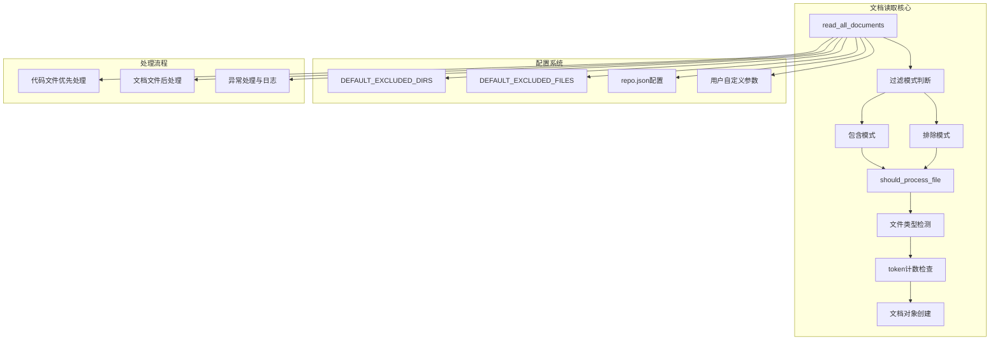

**图表来源**
- [api/data_pipeline.py](file://api/data_pipeline.py#L144-L371)

## read_all_documents函数详解

`read_all_documents`函数是整个文档读取系统的核心入口点，它采用参数化设计，支持灵活的文件过滤和处理策略。

### 函数签名与参数

该函数接受以下关键参数：
- `path`: 要扫描的根目录路径
- `embedder_type`: 嵌入器类型标识
- `excluded_dirs`: 排除的目录列表
- `excluded_files`: 排除的文件模式列表
- `included_dirs`: 包含的目录列表  
- `included_files`: 包含的文件模式列表

### 主要处理流程

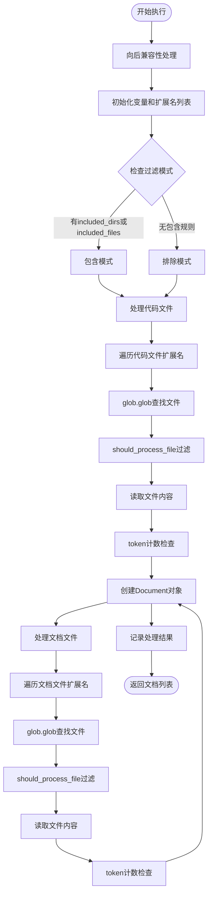

**图表来源**
- [api/data_pipeline.py](file://api/data_pipeline.py#L144-L371)

**章节来源**
- [api/data_pipeline.py](file://api/data_pipeline.py#L144-L371)

## 双模式过滤机制

deepwiki-open实现了两种互补的文件过滤模式，为用户提供精确的文件处理控制能力。

### 包含模式（Inclusion Mode）

当用户指定`included_dirs`或`included_files`参数时，系统自动切换到包含模式。在这种模式下，只有明确指定的目录和文件才会被处理。

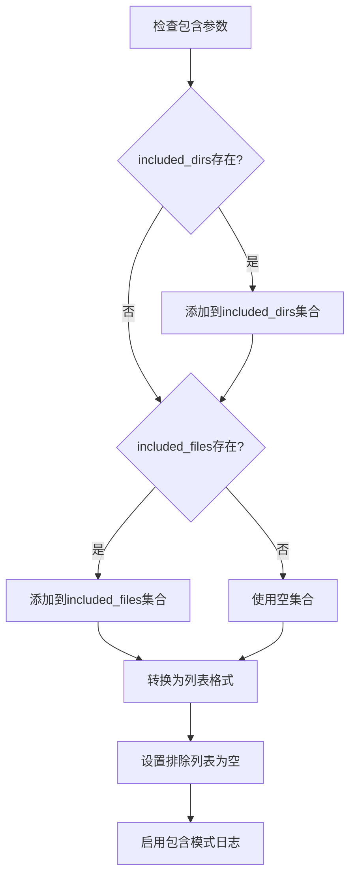

**图表来源**
- [api/data_pipeline.py](file://api/data_pipeline.py#L180-L193)

### 排除模式（Exclusion Mode）

默认情况下，系统运行在排除模式下，使用预定义的排除规则集合作为基础过滤器。

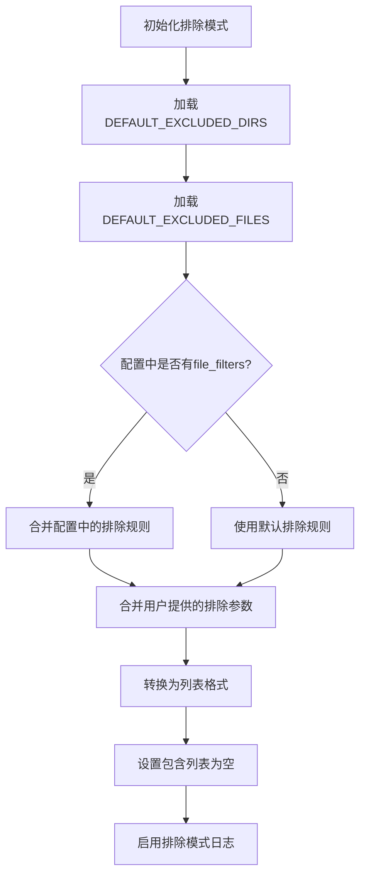

**图表来源**
- [api/data_pipeline.py](file://api/data_pipeline.py#L194-L218)

### 配置优先级

系统遵循严格的配置优先级原则：
1. 用户显式参数（最高优先级）
2. 配置文件中的`file_filters`设置
3. 系统默认排除规则（最低优先级）

**章节来源**
- [api/data_pipeline.py](file://api/data_pipeline.py#L180-L218)
- [api/config.py](file://api/config.py#L263-L301)

## 文件类型优先级处理

系统采用智能的文件类型处理顺序，确保代码文件优先于文档文件被处理。

### 代码文件优先处理

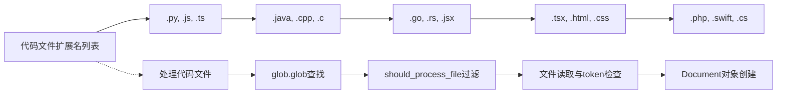

**图表来源**
- [api/data_pipeline.py](file://api/data_pipeline.py#L173-L175)

### 文档文件后处理

文档文件处理遵循相同的过滤和验证流程，但具有不同的token限制：

| 文件类型 | 扩展名列表 | token限制 | 特殊属性 |
|---------|-----------|----------|---------|
| Markdown | `.md` | 8192 | `is_code: false` |
| 文本文件 | `.txt` | 8192 | `is_code: false` |
| ReStructuredText | `.rst` | 8192 | `is_code: false` |
| JSON配置 | `.json` | 8192 | `is_code: false` |
| YAML配置 | `.yaml, .yml` | 8192 | `is_code: false` |

**章节来源**
- [api/data_pipeline.py](file://api/data_pipeline.py#L173-L175)
- [api/data_pipeline.py](file://api/data_pipeline.py#L337-L371)

## should_process_file辅助函数

`should_process_file`函数是文件过滤逻辑的核心，实现了复杂的路径匹配和规则应用算法。

### 包含模式下的路径匹配

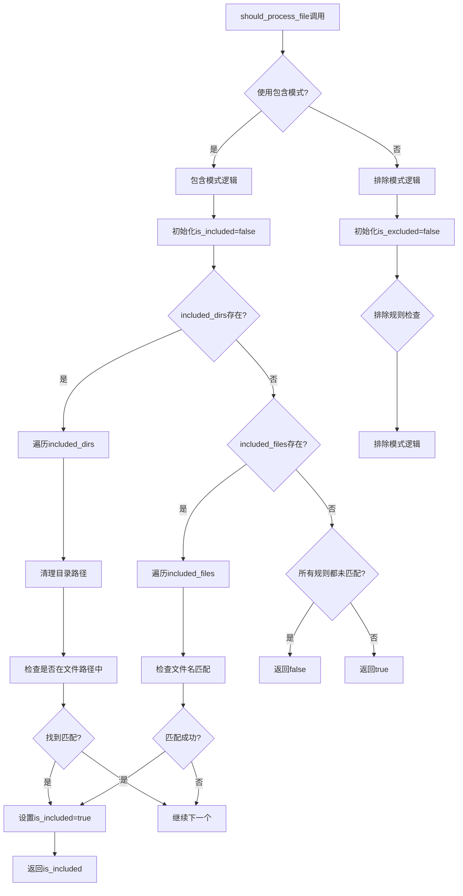

**图表来源**
- [api/data_pipeline.py](file://api/data_pipeline.py#L226-L294)

### 排除模式下的路径匹配

排除模式采用相反的逻辑，只有不匹配任何排除规则的文件才会被处理：

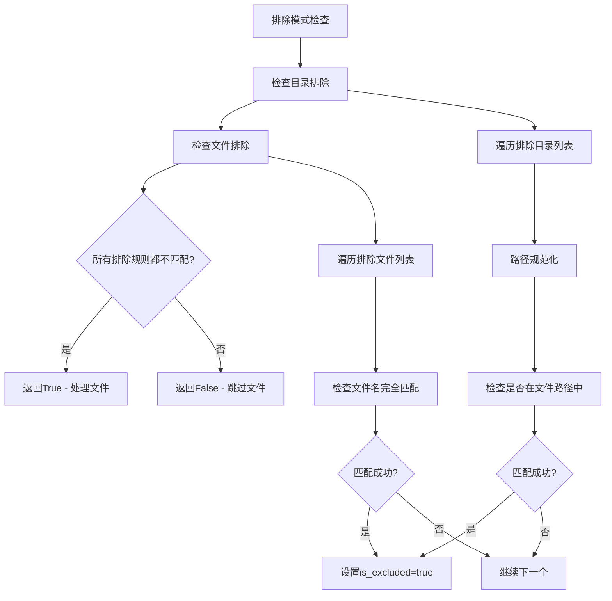

**图表来源**
- [api/data_pipeline.py](file://api/data_pipeline.py#L276-L294)

### 路径匹配算法细节

系统使用以下算法确保精确的路径匹配：

1. **路径规范化**: 使用`os.path.normpath()`标准化路径分隔符
2. **相对路径处理**: 通过`os.path.relpath()`计算相对于根目录的路径
3. **通配符支持**: 支持`*.ext`格式的文件模式匹配
4. **目录层次检查**: 检查文件是否位于指定目录的子树中

**章节来源**
- [api/data_pipeline.py](file://api/data_pipeline.py#L226-L294)

## token计数与文件大小控制

系统实现了智能的token计数机制，用于控制单个文件的大小，避免超出嵌入模型的token限制。

### count_tokens函数实现

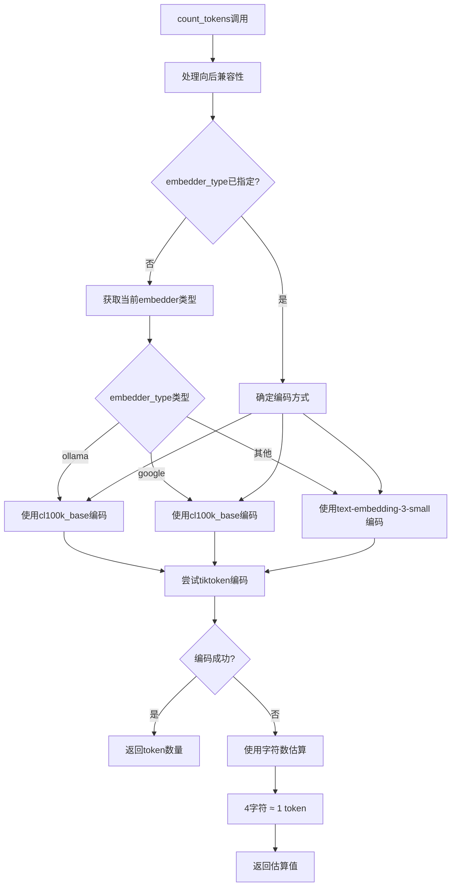

**图表来源**
- [api/data_pipeline.py](file://api/data_pipeline.py#L27-L67)

### token限制策略

系统针对不同类型的文件采用不同的token限制策略：

| 文件类型 | token限制 | 限制倍数 | 用途 |
|---------|----------|---------|------|
| 代码文件 | 8192 | ×10 | 允许较大代码文件 |
| 文档文件 | 8192 | ×1 | 标准文档大小限制 |

### 异常处理机制

当文件过大时，系统会：
1. 记录警告日志
2. 跳过该文件的处理
3. 继续处理其他文件
4. 在最终结果中统计处理的文件数量

**章节来源**
- [api/data_pipeline.py](file://api/data_pipeline.py#L27-L67)
- [api/data_pipeline.py](file://api/data_pipeline.py#L316-L319)

## 异常处理与编码保证

系统实现了完善的异常处理机制，确保文件读取过程的稳定性和可靠性。

### UTF-8编码保证

所有文件读取操作都明确指定`encoding="utf-8"`，确保：
- 支持多语言字符集
- 避免编码错误
- 保持文本完整性

### 异常处理层次

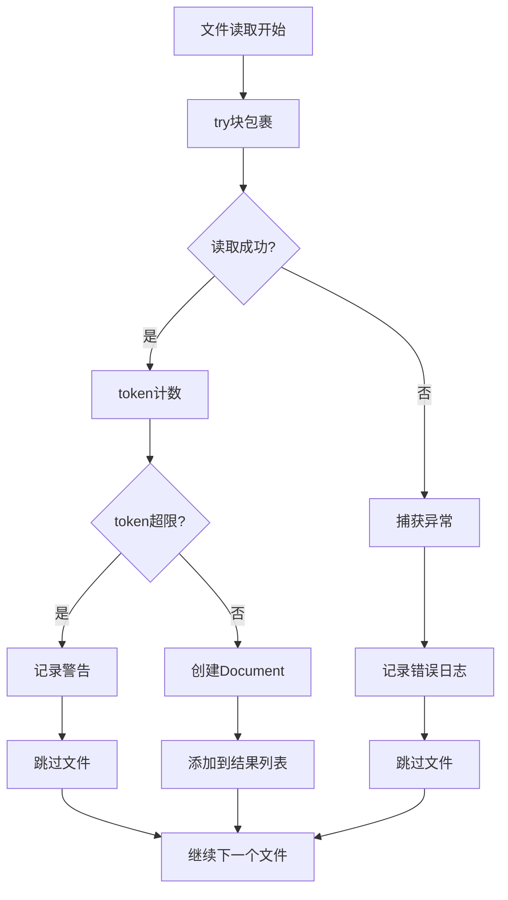

**图表来源**
- [api/data_pipeline.py](file://api/data_pipeline.py#L303-L335)
- [api/data_pipeline.py](file://api/data_pipeline.py#L344-L368)

### 错误恢复策略

系统采用优雅降级策略：
1. 单个文件读取失败不影响整体进程
2. 详细的错误日志便于问题诊断
3. 自动跳过损坏或无法读取的文件

**章节来源**
- [api/data_pipeline.py](file://api/data_pipeline.py#L303-L335)
- [api/data_pipeline.py](file://api/data_pipeline.py#L344-L368)

## 配置系统集成

deepwiki-open的文档读取功能与配置系统深度集成，支持多层次的配置管理。

### 默认排除规则

系统预定义了丰富的默认排除规则：

#### 目录排除规则
- 虚拟环境目录：`.venv/`, `venv/`, `env/`, `virtualenv/`
- 版本控制系统：`.git/`, `.svn/`, `.hg/`, `.bzr/`
- 缓存和编译输出：`__pycache__/`, `.pytest_cache/`
- 构建产物：`dist/`, `build/`, `out/`, `target/`
- 开发工具：`.idea/`, `.vscode/`, `.vs/`, `.eclipse/`

#### 文件排除规则
- 锁定文件：`package-lock.json`, `yarn.lock`, `Cargo.lock`
- 配置文件：`.env*`, `.gitignore`, `.prettierrc`
- 临时文件：`*.min.js`, `*.map`, `*.gz`
- 编译产物：`*.pyc`, `*.class`, `*.exe`

### 配置文件集成

系统从`repo.json`配置文件中读取额外的排除规则：

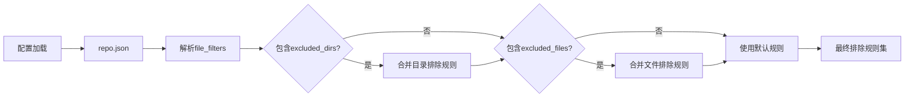

**图表来源**
- [api/config.py](file://api/config.py#L307-L328)

### 用户界面集成

前端组件提供了直观的过滤器配置界面：

- **排除模式**: 默认行为，提供排除目录和文件的输入框
- **包含模式**: 仅处理指定的目录和文件
- 实时验证和提示功能

**章节来源**
- [api/config.py](file://api/config.py#L263-L301)
- [src/components/UserSelector.tsx](file://src/components/UserSelector.tsx#L136-L497)

## 实际应用场景

### 代码库文档化

系统特别适用于大型代码库的自动化文档化：

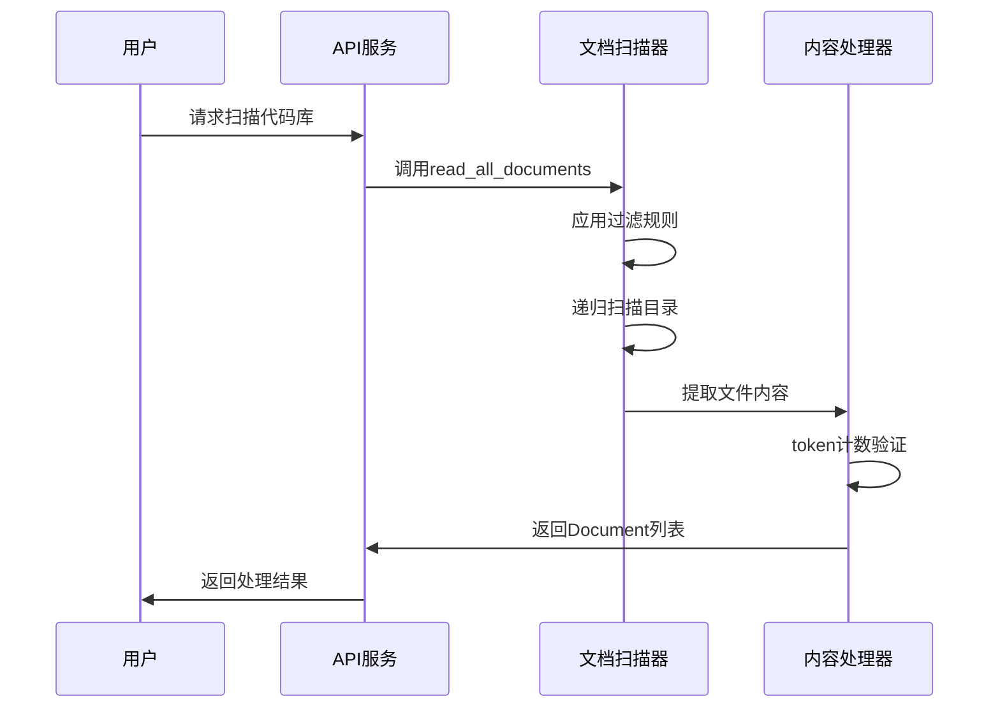

**图表来源**
- [api/data_pipeline.py](file://api/data_pipeline.py#L144-L371)

### RAG系统集成

文档读取功能与检索增强生成（RAG）系统紧密集成：

1. **文档准备**: 自动生成高质量的文档索引
2. **语义检索**: 基于嵌入向量的智能文档检索
3. **上下文构建**: 自动组织相关文档片段

### 多语言支持

系统支持多种编程语言和文档格式：
- **代码语言**: Python, JavaScript, TypeScript, Java, Go, Rust等
- **文档格式**: Markdown, reStructuredText, JSON, YAML等
- **配置文件**: 各种构建工具和框架的配置文件

**章节来源**
- [api/data_pipeline.py](file://api/data_pipeline.py#L173-L175)
- [api/websocket_wiki.py](file://api/websocket_wiki.py#L204-L232)

## 总结

deepwiki-open的文档读取功能展现了现代软件工程中复杂系统的精妙设计。通过`read_all_documents`函数为核心的递归扫描机制，结合双模式过滤、智能token控制和完善的异常处理，系统实现了高效、可靠、可配置的文档处理能力。

该系统不仅满足了技术文档自动化的需要，更为后续的AI驱动的知识管理和智能问答系统奠定了坚实的基础。其模块化的设计和丰富的配置选项，使其能够适应各种复杂的部署场景和业务需求。