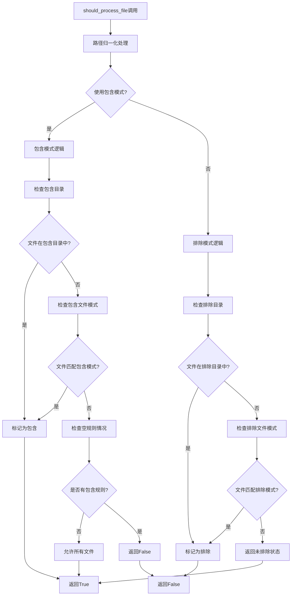
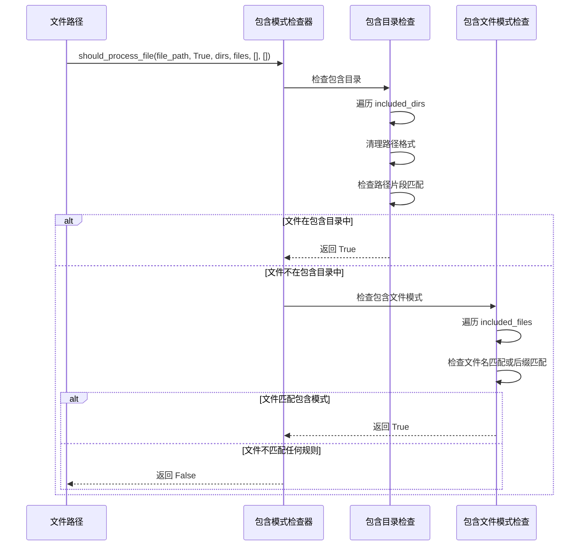
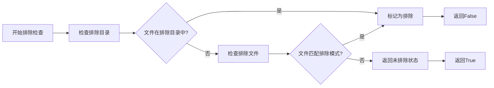
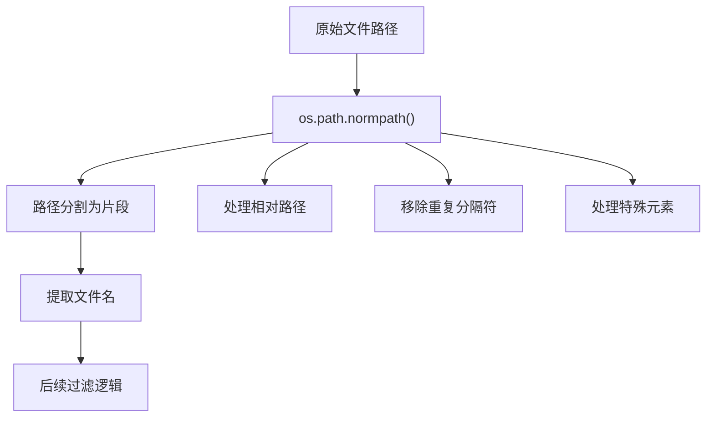
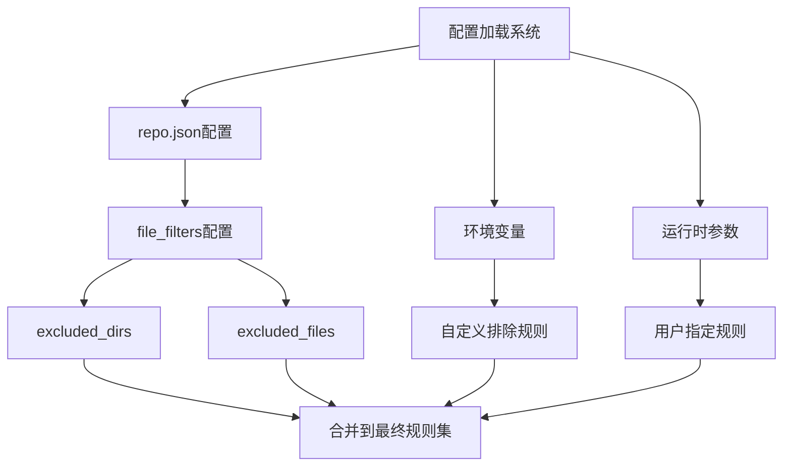
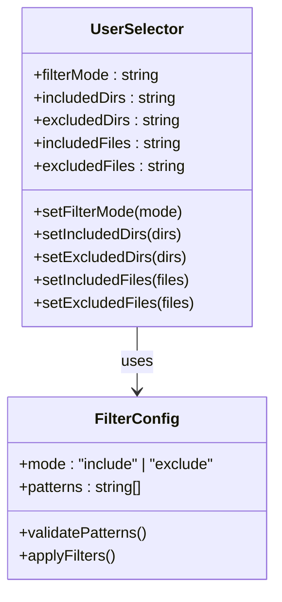

# 过滤逻辑

<cite>
**本文档引用的文件**
- [data_pipeline.py](file://api/data_pipeline.py)
- [config.py](file://api/config.py)
- [websocket_wiki.py](file://api/websocket_wiki.py)
- [simple_chat.py](file://api/simple_chat.py)
- [UserSelector.tsx](file://src/components/UserSelector.tsx)
</cite>

## 目录
1. [简介](#简介)
2. [核心过滤函数](#核心过滤函数)
3. [包含模式与排除模式](#包含模式与排除模式)
4. [路径归一化处理](#路径归一化处理)
5. [默认排除规则](#默认排除规则)
6. [配置系统](#配置系统)
7. [安全考虑](#安全考虑)
8. [使用示例](#使用示例)
9. [总结](#总结)

## 简介

deepwiki-open项目的文档读取功能采用了一套精密的文件过滤系统，该系统通过`should_process_file`函数实现了灵活且安全的文件处理控制。该过滤系统支持两种主要模式：包含模式（inclusion mode）和排除模式（exclusion mode），并提供了多层次的安全保护机制。

## 核心过滤函数

### should_process_file函数架构

`should_process_file`函数是整个过滤系统的核心，它接受文件路径和多种配置参数，返回布尔值指示文件是否应该被处理。



**图表来源**
- [data_pipeline.py](file://api/data_pipeline.py#L226-L293)

**节来源**
- [data_pipeline.py](file://api/data_pipeline.py#L226-L293)

### 函数签名与参数

函数接受以下参数：
- `file_path`: 要检查的文件路径
- `use_inclusion`: 布尔值，指示是否使用包含模式
- `included_dirs`: 包含目录列表
- `included_files`: 包含文件模式列表  
- `excluded_dirs`: 排除目录列表
- `excluded_files`: 排除文件模式列表

## 包含模式与排除模式

### 包含模式（Inclusion Mode）

当用户指定包含规则时，系统进入包含模式。在这种模式下，只有明确指定的目录和文件才会被处理。

#### 包含规则优先级

1. **目录匹配**: 检查文件是否位于任何包含的目录中
2. **文件模式匹配**: 检查文件名是否匹配任何包含的文件模式
3. **空规则处理**: 如果没有指定任何包含规则，则允许所有文件



**图表来源**
- [data_pipeline.py](file://api/data_pipeline.py#L245-L273)

### 排除模式（Exclusion Mode）

当用户未指定包含规则时，系统自动进入排除模式。这种模式下，系统会先应用默认排除规则，然后应用用户自定义的排除规则。

#### 排除规则流程



**图表来源**
- [data_pipeline.py](file://api/data_pipeline.py#L275-L293)

**节来源**
- [data_pipeline.py](file://api/data_pipeline.py#L177-L223)

## 路径归一化处理

### os.path.normpath的重要性

路径归一化是过滤系统的关键安全特性，通过`os.path.normpath()`函数确保路径的一致性和安全性。

#### 归一化处理步骤

1. **路径规范化**: 将相对路径转换为绝对路径
2. **重复分隔符处理**: 移除多余的路径分隔符
3. **特殊路径处理**: 处理`.`和`..`等特殊路径元素
4. **平台兼容性**: 确保路径格式符合操作系统要求



**图表来源**
- [data_pipeline.py](file://api/data_pipeline.py#L242)

### 目录遍历安全防护

归一化处理有效防止了目录遍历攻击（Directory Traversal Attacks），例如：

- `../config.py` → 正确解析为实际路径
- `../../etc/passwd` → 被正确限制在当前目录范围内
- `././././file.py` → 简化为标准路径格式

**节来源**
- [data_pipeline.py](file://api/data_pipeline.py#L242)

## 默认排除规则

### DEFAULT_EXCLUDED_DIRS

系统预定义了一组默认排除目录，涵盖常见的开发工具和构建产物：

| 类别 | 排除目录 |
|------|----------|
| 虚拟环境 | `./.venv/`, `./venv/`, `./env/`, `./virtualenv/` |
| 版本控制 | `./.git/`, `./.svn/`, `./.hg/`, `./.bzr/` |
| 缓存文件 | `./__pycache__/`, `./.pytest_cache/`, `./.mypy_cache/` |
| 构建产物 | `./dist/`, `./build/`, `./out/`, `./target/` |
| 文档目录 | `./docs/`, `./_docs/`, `./site-docs/` |
| IDE配置 | `./.idea/`, `./.vscode/`, `./.vs/` |

### DEFAULT_EXCLUDED_FILES

系统还预定义了大量默认排除文件类型：

| 文件类型 | 示例文件 |
|----------|----------|
| 锁定文件 | `package-lock.json`, `yarn.lock`, `Cargo.lock` |
| 配置文件 | `.env`, `.gitignore`, `.prettierrc` |
| 编译产物 | `*.pyc`, `*.class`, `*.o`, `*.so` |
| 压缩文件 | `*.zip`, `*.tar`, `*.gz`, `*.rar` |
| 图片资源 | `*.jpg`, `*.png`, `*.gif`, `*.svg` |
| 其他文件 | `Thumbs.db`, `.DS_Store`, `desktop.ini` |

**节来源**
- [config.py](file://api/config.py#L262-L301)

## 配置系统

### 动态配置加载

系统支持从多个配置源动态加载文件过滤规则：



**图表来源**
- [config.py](file://api/config.py#L303-L332)

### 配置优先级

配置系统的优先级顺序如下：

1. **运行时参数**（最高优先级）
2. **用户自定义配置**（来自repo.json）
3. **环境变量替换**（次高优先级）
4. **默认系统规则**（最低优先级）

**节来源**
- [config.py](file://api/config.py#L303-L332)
- [data_pipeline.py](file://api/data_pipeline.py#L195-L218)

## 安全考虑

### 多层安全防护

过滤系统实现了多层安全防护机制：

#### 1. 路径规范化
- 使用`os.path.normpath()`防止路径遍历攻击
- 自动处理相对路径和特殊路径元素
- 确保路径解析的一致性

#### 2. 权限隔离
- 默认排除敏感目录（如`.git/`, `.svn/`）
- 排除临时文件和缓存文件
- 限制对配置文件的访问

#### 3. 输入验证
- 对用户提供的过滤规则进行严格验证
- 支持通配符模式匹配但避免任意命令执行
- 提供清晰的错误反馈机制

### 安全最佳实践

1. **最小权限原则**: 默认只处理必要的文件类型
2. **白名单机制**: 在包含模式下使用显式白名单
3. **黑名单补充**: 在排除模式下使用全面黑名单
4. **输入清理**: 对用户输入进行充分清理和验证

## 使用示例

### 基本使用场景

#### 排除模式示例

```python
# 使用默认排除规则
documents = read_all_documents(
    path="/project/root",
    excluded_dirs=["./node_modules/", "./dist/"],
    excluded_files=["*.log", "*.tmp"]
)
```

#### 包含模式示例

```python
# 只处理特定目录和文件
documents = read_all_documents(
    path="/project/root",
    included_dirs=["./src/", "./lib/"],
    included_files=["*.py", "*.js", "*.ts"]
)
```

### Web界面使用

前端组件提供了直观的过滤配置界面：



**图表来源**
- [UserSelector.tsx](file://src/components/UserSelector.tsx#L387-L522)

### WebSocket API使用

通过WebSocket接口可以实时配置过滤规则：

```python
# WebSocket请求示例
{
    "repo_url": "https://github.com/example/repo",
    "excluded_dirs": "./node_modules/\n./dist/",
    "excluded_files": "*.log\n*.tmp",
    "included_dirs": "",
    "included_files": ""
}
```

**节来源**
- [websocket_wiki.py](file://api/websocket_wiki.py#L85-L96)
- [simple_chat.py](file://api/simple_chat.py#L95-L111)

## 总结

deepwiki-open项目的文档读取功能过滤系统是一个设计精良、安全可靠的文件处理框架。其核心特点包括：

### 主要优势

1. **灵活性**: 支持包含模式和排除模式，满足不同使用场景需求
2. **安全性**: 实现了多层安全防护，有效防止路径遍历攻击
3. **可配置性**: 支持多层次配置，从默认规则到用户自定义规则
4. **易用性**: 提供直观的Web界面和API接口
5. **性能优化**: 通过合理的规则设计减少不必要的文件扫描

### 技术亮点

- **路径归一化**: 使用`os.path.normpath()`确保路径安全
- **双模式支持**: 包含模式和排除模式的无缝切换
- **通配符匹配**: 支持文件名后缀匹配和精确匹配
- **默认规则**: 预定义的全面排除规则集合
- **配置管理**: 动态配置加载和优先级处理

该过滤系统为deepwiki-open项目提供了强大而安全的文档处理能力，是整个知识库构建流程的重要基础设施。