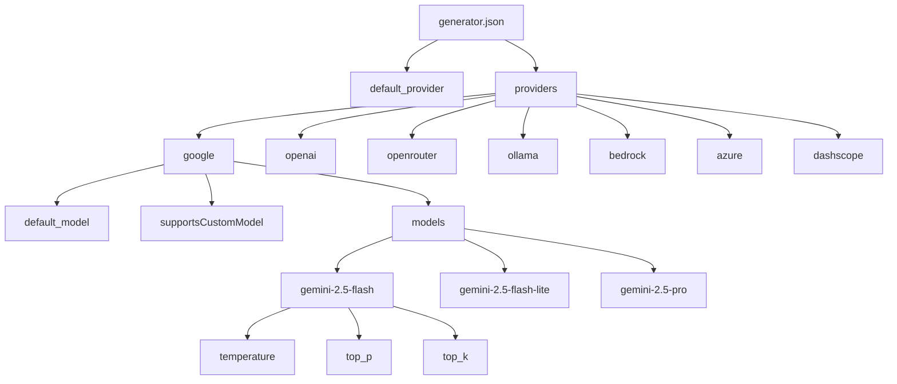
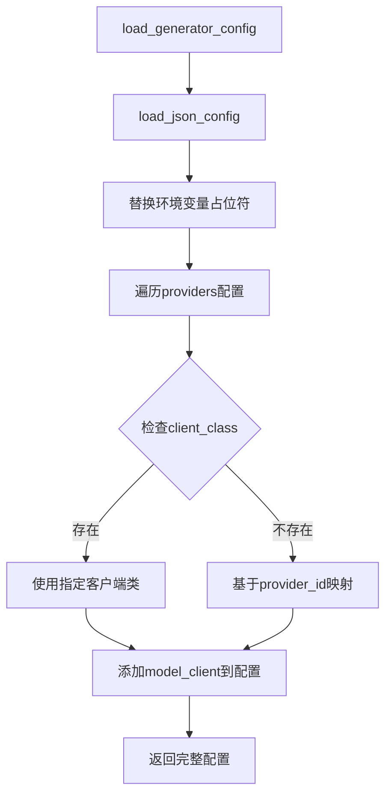
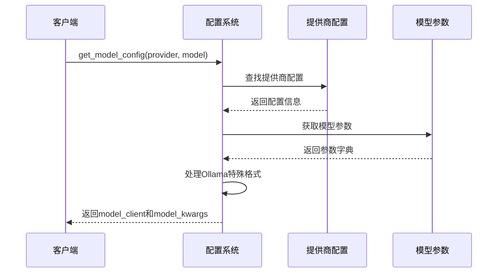
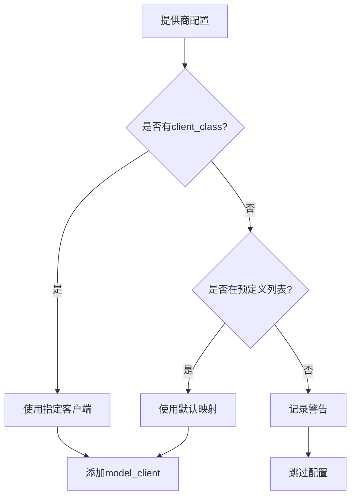

# AI提供商配置

<cite>
**本文档引用的文件**
- [api/config/generator.json](file://api/config/generator.json)
- [api/config.py](file://api/config.py)
- [api/openai_client.py](file://api/openai_client.py)
- [api/openrouter_client.py](file://api/openrouter_client.py)
- [api/dashscope_client.py](file://api/dashscope_client.py)
- [api/bedrock_client.py](file://api/bedrock_client.py)
- [api/azureai_client.py](file://api/azureai_client.py)
- [api/ollama_patch.py](file://api/ollama_patch.py)
</cite>

## 目录
1. [简介](#简介)
2. [generator.json文件结构](#generatorjson文件结构)
3. [配置加载机制](#配置加载机制)
4. [提供商配置详解](#提供商配置详解)
5. [模型配置映射](#模型配置映射)
6. [客户端类映射](#客户端类映射)
7. [运行时配置获取](#运行时配置获取)
8. [配置验证与错误处理](#配置验证与错误处理)
9. [最佳实践](#最佳实践)

## 简介

deepwiki-open项目采用模块化的AI提供商配置系统，通过JSON配置文件和Python代码实现灵活的多提供商支持。该系统允许用户在不修改核心代码的情况下，轻松切换不同的AI服务提供商，并为每个提供商配置特定的模型参数。

## generator.json文件结构

### 核心配置架构

generator.json文件是整个AI提供商配置的核心，采用分层结构设计：



**图表来源**
- [api/config/generator.json](file://api/config/generator.json#L1-L200)

### default_provider字段

`default_provider`字段指定了系统启动时的默认AI提供商：

```json
{
  "default_provider": "google"
}
```

该字段决定了系统初始化时使用哪个提供商作为默认选项。当用户未明确指定提供商时，系统会自动使用此配置值。

### providers对象结构

`providers`对象包含所有可用的AI提供商配置，每个提供商都有以下通用属性：

- **default_model**: 默认使用的模型名称
- **supportsCustomModel**: 是否支持自定义模型
- **models**: 包含各模型的具体参数配置

**章节来源**
- [api/config/generator.json](file://api/config/generator.json#L2-L199)

## 配置加载机制

### load_generator_config函数

配置加载的核心函数负责从JSON文件读取配置并进行初步处理：



**图表来源**
- [api/config.py](file://api/config.py#L121-L145)

### 环境变量替换机制

配置系统支持环境变量占位符替换，允许动态配置敏感信息：

```python
# 支持的格式：${ENV_VAR_NAME}
# 示例："${OPENAI_API_KEY}"
```

**章节来源**
- [api/config.py](file://api/config.py#L66-L95)

## 提供商配置详解

### Google GenAI提供商

Google GenAI提供商配置展示了标准的配置模式：

```json
{
  "google": {
    "default_model": "gemini-2.5-flash",
    "supportsCustomModel": true,
    "models": {
      "gemini-2.5-flash": {
        "temperature": 1.0,
        "top_p": 0.8,
        "top_k": 20
      }
    }
  }
}
```

**特点**：
- 使用GoogleGenAIClient作为默认客户端
- 支持top_k参数用于采样策略
- 温度值设置为1.0，提供较高创造性输出

### OpenAI提供商

OpenAI提供商配置支持多种模型变体：

```json
{
  "openai": {
    "default_model": "gpt-5-nano",
    "supportsCustomModel": true,
    "models": {
      "gpt-5": { "temperature": 1.0 },
      "gpt-4o": { "temperature": 0.7, "top_p": 0.8 },
      "o1": { "temperature": 0.7, "top_p": 0.8 }
    }
  }
}
```

**特点**：
- 支持最新的o1系列模型
- 提供不同精度级别的模型选择
- 兼容OpenAI API格式

### OpenRouter提供商

OpenRouter作为统一API代理，支持多个提供商的模型：

```json
{
  "openrouter": {
    "default_model": "openai/gpt-5-nano",
    "supportsCustomModel": true,
    "models": {
      "openai/gpt-4o": { "temperature": 0.7, "top_p": 0.8 },
      "anthropic/claude-3.7-sonnet": { "temperature": 0.7, "top_p": 0.8 }
    }
  }
}
```

**特点**：
- 模型ID格式：`provider/model-name`
- 统一的API接口访问多个提供商
- 支持Claude等第三方模型

### Ollama本地模型

Ollama配置支持本地部署的开源模型：

```json
{
  "ollama": {
    "default_model": "qwen3:1.7b",
    "supportsCustomModel": true,
    "models": {
      "qwen3:1.7b": {
        "options": {
          "temperature": 0.7,
          "top_p": 0.8,
          "num_ctx": 32000
        }
      }
    }
  }
}
```

**特点**：
- 使用options对象封装模型参数
- 支持上下文长度配置（num_ctx）
- 适合本地部署和隐私保护场景

### AWS Bedrock提供商

Bedrock配置支持AWS云原生AI服务：

```json
{
  "bedrock": {
    "client_class": "BedrockClient",
    "default_model": "anthropic.claude-3-sonnet-20240229-v1:0",
    "supportsCustomModel": true,
    "models": {
      "anthropic.claude-3-sonnet-20240229-v1:0": {
        "temperature": 0.7,
        "top_p": 0.8
      }
    }
  }
}
```

**特点**：
- 显式指定client_class，使用专用客户端
- 支持多种提供商的模型（Anthropic、Amazon、Cohere等）
- 基于AWS IAM认证

### Azure OpenAI提供商

Azure提供商配置支持企业级AI服务：

```json
{
  "azure": {
    "client_class": "AzureAIClient",
    "default_model": "gpt-4o",
    "supportsCustomModel": true,
    "models": {
      "gpt-4o": { "temperature": 0.7, "top_p": 0.8 }
    }
  }
}
```

**特点**：
- 支持API密钥和AAD令牌认证
- 与Azure生态系统深度集成
- 适用于企业部署场景

### 阿里云DashScope提供商

DashScope配置支持阿里云AI服务：

```json
{
  "dashscope": {
    "default_model": "qwen-plus",
    "supportsCustomModel": true,
    "models": {
      "qwen-plus": { "temperature": 0.7, "top_p": 0.8 }
    }
  }
}
```

**特点**：
- 基于OpenAI兼容API
- 支持Workspace ID配置
- 适合中国地区部署

**章节来源**
- [api/config/generator.json](file://api/config/generator.json#L22-L199)

## 模型配置映射

### get_model_config函数

get_model_config函数是运行时配置获取的核心，实现了灵活的模型配置动态生成：



**图表来源**
- [api/config.py](file://api/config.py#L334-L387)

### 参数处理逻辑

系统根据提供商类型处理不同的参数格式：

1. **标准提供商**：直接合并模型参数
2. **Ollama提供商**：使用options对象包装参数

```python
# 标准格式
result["model_kwargs"] = {"model": model, **model_params}

# Ollama格式
result["model_kwargs"] = {"model": model, **model_params["options"]}
```

### 默认模型回退机制

当指定模型不存在时，系统自动回退到提供商的默认模型：

```python
if model in provider_config.get("models", {}):
    model_params = provider_config["models"][model]
else:
    default_model = provider_config.get("default_model")
    model_params = provider_config["models"][default_model]
```

**章节来源**
- [api/config.py](file://api/config.py#L364-L369)

## 客户端类映射

### CLIENT_CLASSES映射表

系统维护了一个全局的客户端类映射表，将提供商名称映射到对应的客户端实现：

```python
CLIENT_CLASSES = {
    "GoogleGenAIClient": GoogleGenAIClient,
    "GoogleEmbedderClient": GoogleEmbedderClient,
    "OpenAIClient": OpenAIClient,
    "OpenRouterClient": OpenRouterClient,
    "OllamaClient": OllamaClient,
    "BedrockClient": BedrockClient,
    "AzureAIClient": AzureAIClient,
    "DashscopeClient": DashscopeClient
}
```

### 自动映射机制

系统优先使用配置中的`client_class`字段，如果不存在则根据提供商ID自动映射：



**图表来源**
- [api/config.py](file://api/config.py#L127-L143)

### 特殊客户端处理

某些提供商需要特殊的客户端实现：

- **BedrockClient**: AWS原生客户端，需要IAM认证
- **AzureAIClient**: Azure OpenAI客户端，支持AAD认证
- **OllamaClient**: 本地模型客户端，需要连接本地服务

**章节来源**
- [api/config.py](file://api/config.py#L55-L64)
- [api/config.py](file://api/config.py#L127-L143)

## 运行时配置获取

### 动态配置生成

系统在运行时根据用户请求动态生成配置，确保灵活性和一致性：

```python
def get_model_config(provider="google", model=None):
    # 获取提供商配置
    provider_config = configs["providers"].get(provider)
    
    # 获取模型参数
    model_params = {}
    if model in provider_config.get("models", {}):
        model_params = provider_config["models"][model]
    
    # 构建最终配置
    result = {
        "model_client": model_client,
        "model_kwargs": {"model": model, **model_params}
    }
    
    return result
```

### 配置缓存机制

系统将加载的配置存储在全局变量`configs`中，避免重复加载：

```python
# 初始化空配置
configs = {}

# 加载所有配置文件
generator_config = load_generator_config()
embedder_config = load_embedder_config()

# 更新配置
if generator_config:
    configs["default_provider"] = generator_config.get("default_provider", "google")
    configs["providers"] = generator_config.get("providers", {})
```

**章节来源**
- [api/config.py](file://api/config.py#L303-L387)

## 配置验证与错误处理

### 输入验证

系统在多个层面进行配置验证：

1. **提供商存在性验证**
2. **模型存在性验证**
3. **客户端类有效性验证**

```python
# 验证提供商配置
if not provider_config:
    raise ValueError(f"Configuration for provider '{provider}' not found")

# 验证模型客户端
if not model_client:
    raise ValueError(f"Model client not specified for provider '{provider}'")
```

### 错误恢复机制

当配置出现问题时，系统提供合理的错误提示和默认行为：

- **未知提供商**：记录警告并跳过
- **模型不存在**：回退到默认模型
- **客户端初始化失败**：返回错误信息而非崩溃

### 日志记录

系统广泛使用日志记录来跟踪配置加载和使用过程：

```python
logger.warning(f"Unknown provider or client class: {provider_id}")
logger.info(f"Ollama model '{model_name}' is available")
```

**章节来源**
- [api/config.py](file://api/config.py#L143-L144)
- [api/ollama_patch.py](file://api/ollama_patch.py#L48-L50)

## 最佳实践

### 配置文件管理

1. **环境变量分离**：敏感信息使用环境变量
2. **配置备份**：定期备份generator.json文件
3. **版本控制**：将配置文件纳入版本控制系统

### 性能优化

1. **懒加载**：客户端实例按需初始化
2. **连接池**：复用HTTP连接减少开销
3. **超时设置**：合理设置API调用超时时间

### 安全考虑

1. **API密钥管理**：使用环境变量存储密钥
2. **权限控制**：限制对配置文件的访问权限
3. **审计日志**：记录配置变更和使用情况

### 扩展新提供商

添加新提供商的步骤：

1. 在generator.json中添加提供商配置
2. 实现对应的客户端类
3. 在CLIENT_CLASSES中注册客户端类
4. 测试配置加载和模型调用

这个配置系统为deepwiki-open提供了强大而灵活的AI服务支持能力，使得系统能够适应不同的部署环境和业务需求。