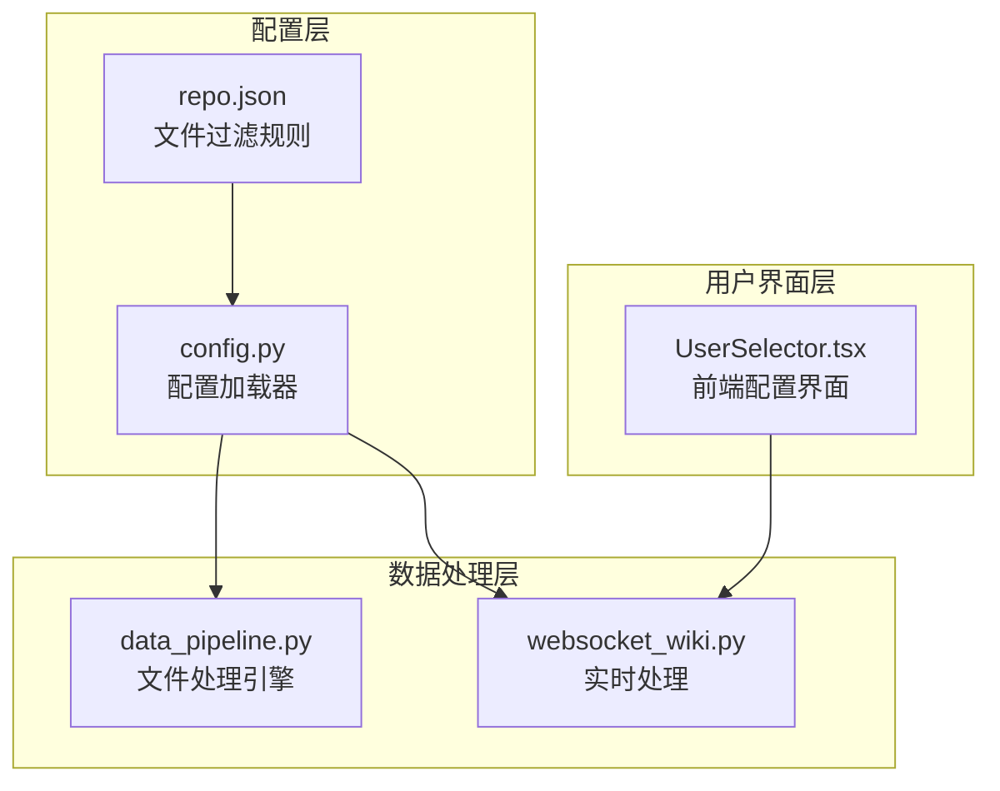
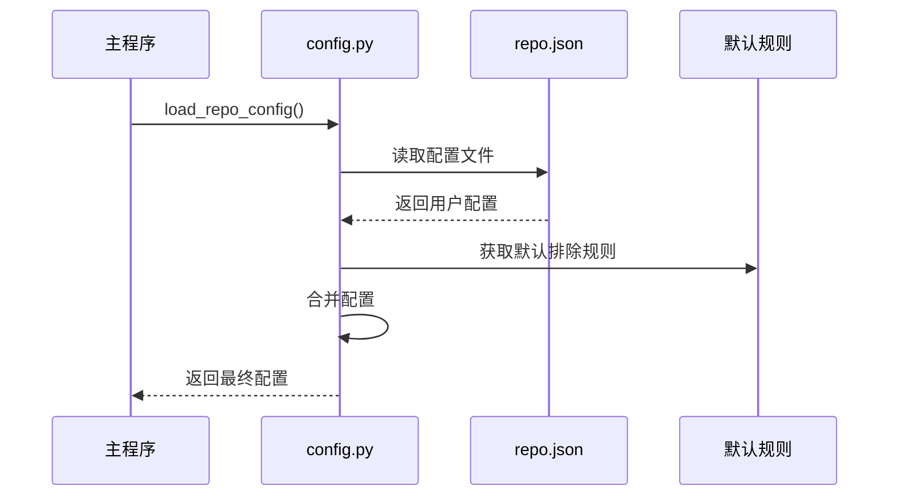
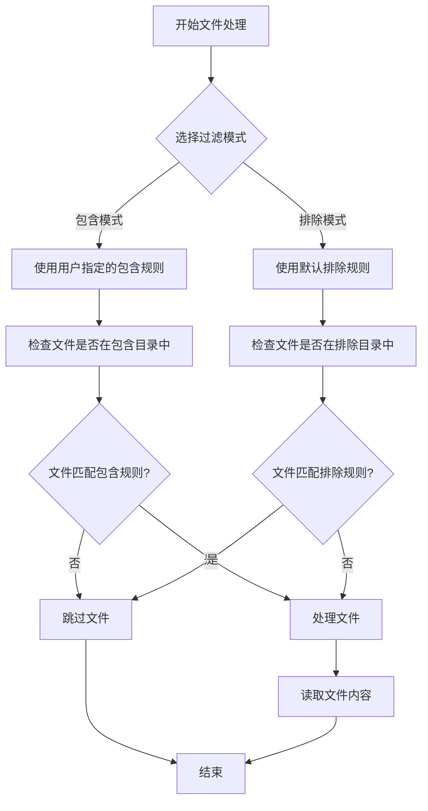
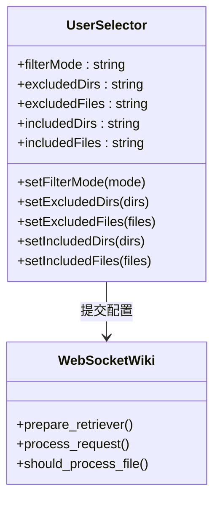
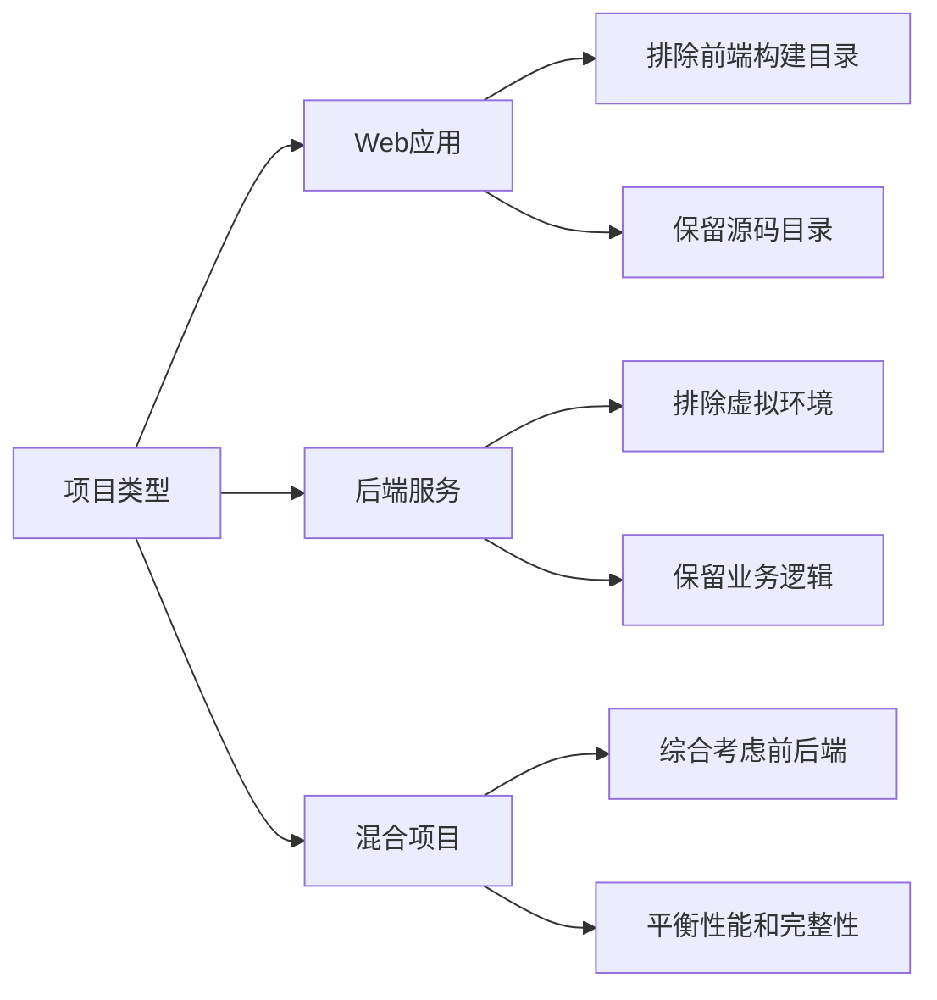

# 仓库配置

<cite>
**本文档中引用的文件**
- [api/config/repo.json](file://api/config/repo.json)
- [api/config.py](file://api/config.py)
- [api/data_pipeline.py](file://api/data_pipeline.py)
- [api/websocket_wiki.py](file://api/websocket_wiki.py)
- [src/components/UserSelector.tsx](file://src/components/UserSelector.tsx)
- [api/main.py](file://api/main.py)
</cite>

## 目录
1. [简介](#简介)
2. [项目结构概览](#项目结构概览)
3. [repo.json配置文件详解](#repojson配置文件详解)
4. [默认排除规则](#默认排除规则)
5. [配置加载机制](#配置加载机制)
6. [文件过滤逻辑](#文件过滤逻辑)
7. [用户自定义配置](#用户自定义配置)
8. [实际配置示例](#实际配置示例)
9. [最佳实践建议](#最佳实践建议)
10. [故障排除指南](#故障排除指南)

## 简介

deepwiki-open是一个智能代码知识库系统，它通过分析代码仓库来生成高质量的文档。为了确保文档生成的质量和效率，系统提供了灵活的仓库配置机制，允许用户精确控制哪些文件参与分析过程。

本文档详细介绍了repo.json配置文件的工作原理，包括file_filters和repository字段的配置方法，以及如何通过DEFAULT_EXCLUDED_DIRS和DEFAULT_EXCLUDED_FILES常量定义默认的排除规则。

## 项目结构概览

deepwiki-open采用模块化架构设计，核心配置功能分布在以下关键组件中：



**图表来源**
- [api/config/repo.json](file://api/config/repo.json#L1-L129)
- [api/config.py](file://api/config.py#L1-L388)
- [api/data_pipeline.py](file://api/data_pipeline.py#L1-L886)

## repo.json配置文件详解

repo.json是系统的核心配置文件，位于`api/config/`目录下，负责定义代码仓库的分析规则。

### file_filters字段结构

file_filters字段包含两个主要子字段，用于精确控制文件包含和排除规则：

| 字段 | 类型 | 描述 | 示例 |
|------|------|------|------|
| `excluded_dirs` | Array[String] | 排除的目录列表 | `["./node_modules/", "./.git/"]` |
| `excluded_files` | Array[String] | 排除的文件模式列表 | `["*.min.js", "*.map", ".DS_Store"]` |

### repository字段配置

repository字段定义仓库级别的限制参数：

| 参数 | 类型 | 默认值 | 描述 |
|------|------|--------|------|
| `max_size_mb` | Number | 50000 | 仓库最大大小限制（MB） |

**章节来源**
- [api/config/repo.json](file://api/config/repo.json#L1-L129)

## 默认排除规则

系统内置了一套全面的默认排除规则，通过DEFAULT_EXCLUDED_DIRS和DEFAULT_EXCLUDED_FILES常量定义，确保无关文件不会干扰分析过程。

### DEFAULT_EXCLUDED_DIRS常量

虚拟环境、版本控制和构建产物目录被自动排除：

```mermaid
flowchart TD
A[默认排除目录] --> B[虚拟环境目录]
A --> C[版本控制系统]
A --> D[构建输出目录]
A --> E[IDE配置目录]
A --> F[日志临时文件]
B --> B1[".venv/", "venv/", "env/"]
B --> B2["virtualenv/", "node_modules/"]
C --> C1[".git/", ".svn/", ".hg/", ".bzr/"]
D --> D1["dist/", "build/", "out/", "target/"]
E --> E1[".idea/", ".vscode/", ".vs/"]
F --> F1["logs/", "log/", "tmp/", "temp/"]
```

**图表来源**
- [api/config.py](file://api/config.py#L263-L279)

### DEFAULT_EXCLUDED_FILES常量

系统排除各种锁文件、编译产物和临时文件：

| 文件类型 | 排除模式 | 说明 |
|----------|----------|------|
| 锁文件 | `yarn.lock`, `pnpm-lock.yaml`, `npm-shrinkwrap.json` | 包管理器锁定文件 |
| 配置文件 | `*.cfg`, `*.ini`, `.gitignore`, `.editorconfig` | 开发工具配置文件 |
| 编译产物 | `*.pyc`, `*.pyd`, `*.class`, `*.o`, `*.obj` | 编译生成的二进制文件 |
| 压缩文件 | `*.zip`, `*.tar`, `*.gz`, `*.rar` | 压缩包文件 |
| 平台文件 | `.DS_Store`, `Thumbs.db`, `desktop.ini` | 操作系统生成的文件 |

**章节来源**
- [api/config.py](file://api/config.py#L281-L301)

## 配置加载机制

系统通过load_repo_config函数加载repo.json配置，并将其与默认排除规则合并。

### 配置加载流程



**图表来源**
- [api/config.py](file://api/config.py#L230-L232)

### 配置合并策略

系统采用分层合并策略，优先级从高到低为：
1. 用户自定义配置（repo.json）
2. 默认排除规则（DEFAULT_EXCLUDED_DIRS/FILES）
3. 内置基础规则

**章节来源**
- [api/config.py](file://api/config.py#L307-L332)

## 文件过滤逻辑

系统实现了复杂的文件过滤逻辑，支持包含模式和排除模式两种工作方式。

### 过滤模式对比

| 特性 | 包含模式 (Include) | 排除模式 (Exclude) |
|------|-------------------|-------------------|
| 工作原理 | 只处理指定路径 | 排除指定路径外的所有内容 |
| 默认行为 | 处理所有文件 | 排除默认排除列表 |
| 性能特点 | 需要明确指定 | 自动包含大部分文件 |
| 使用场景 | 精确控制分析范围 | 快速排除不需要的文件 |

### 文件处理算法



**图表来源**
- [api/data_pipeline.py](file://api/data_pipeline.py#L226-L294)

**章节来源**
- [api/data_pipeline.py](file://api/data_pipeline.py#L180-L222)

## 用户自定义配置

用户可以通过多种方式自定义文件过滤规则，满足不同项目的特殊需求。

### 实时配置接口

前端通过UserSelector组件提供直观的配置界面：



**图表来源**
- [src/components/UserSelector.tsx](file://src/components/UserSelector.tsx#L376-L497)
- [api/websocket_wiki.py](file://api/websocket_wiki.py#L85-L96)

### 动态配置应用

系统支持在运行时动态应用配置变更，无需重启服务：

| 配置项 | 应用方式 | 生效时间 |
|--------|----------|----------|
| 排除目录 | 实时更新 | 立即生效 |
| 排除文件 | 实时更新 | 立即生效 |
| 包含目录 | 实时更新 | 立即生效 |
| 包含文件 | 实时更新 | 立即生效 |

**章节来源**
- [api/websocket_wiki.py](file://api/websocket_wiki.py#L85-L96)

## 实际配置示例

以下是针对不同类型项目的实际配置示例，展示如何优化文档生成的质量和效率。

### 示例1：前端React项目配置

```json
{
  "file_filters": {
    "excluded_dirs": [
      "./node_modules/",
      "./dist/",
      "./build/",
      "./coverage/",
      "./public/"
    ],
    "excluded_files": [
      "*.test.js",
      "*.spec.js",
      "*.min.js",
      "*.map",
      ".env.local",
      ".env.development"
    ]
  },
  "repository": {
    "max_size_mb": 1000
  }
}
```

### 示例2：Python Django项目配置

```json
{
  "file_filters": {
    "excluded_dirs": [
      "./venv/",
      "./.venv/",
      "./__pycache__/",
      "./migrations/",
      "./static/",
      "./media/"
    ],
    "excluded_files": [
      "*.pyc",
      "*.sqlite3",
      "*.log",
      "manage.py",
      "settings_local.py"
    ]
  },
  "repository": {
    "max_size_mb": 2000
  }
}
```

### 示例3：混合技术栈项目配置

```json
{
  "file_filters": {
    "excluded_dirs": [
      "./node_modules/",
      "./vendor/",
      "./dist/",
      "./out/",
      "./logs/",
      "./tmp/"
    ],
    "excluded_files": [
      "*.min.js",
      "*.min.css",
      "*.map",
      "*.lock",
      ".DS_Store",
      "Thumbs.db"
    ]
  },
  "repository": {
    "max_size_mb": 5000
  }
}
```

### 高级配置技巧

| 技巧 | 说明 | 示例 |
|------|------|------|
| 目录通配符 | 使用`packages/*/dist`匹配多级目录 | `"packages/*/build"` |
| 文件模式 | 支持通配符匹配 | `"*.test.*"` |
| 路径规范化 | 自动处理相对路径和绝对路径 | `"./src/"` |
| 大小写敏感 | 文件扩展名匹配区分大小写 | `"*.JS"` vs `"*.js"` |

## 最佳实践建议

基于系统的设计理念和实际使用经验，以下是推荐的最佳实践：

### 配置优化原则

1. **最小化原则**：只包含必要的文件和目录
2. **性能优先**：避免包含大型构建输出目录
3. **安全性考虑**：排除敏感配置文件
4. **可维护性**：保持配置简洁明了

### 常见配置模式



### 性能调优建议

| 优化方向 | 具体措施 | 预期效果 |
|----------|----------|----------|
| 减少扫描范围 | 排除大型第三方库目录 | 加快初始化速度 |
| 控制文件数量 | 限制单次处理的文件数 | 提升响应性能 |
| 优化内存使用 | 设置合理的大小限制 | 防止内存溢出 |
| 缓存策略 | 利用默认排除规则缓存 | 减少重复计算 |

## 故障排除指南

常见配置问题及解决方案：

### 问题1：文件未被识别

**症状**：期望分析的文件没有出现在结果中

**可能原因**：
- 文件路径被默认排除规则覆盖
- 用户配置的排除规则过于严格
- 文件扩展名不匹配

**解决方案**：
1. 检查文件是否在默认排除列表中
2. 调整用户配置的排除规则
3. 验证文件扩展名匹配模式

### 问题2：性能问题

**症状**：文档生成速度过慢

**可能原因**：
- 包含了过多的文件
- 包含了大型构建输出目录
- 配置了过多的排除规则

**解决方案**：
1. 优化包含/排除规则
2. 排除不必要的大型目录
3. 使用更精确的文件模式匹配

### 问题3：内存不足

**症状**：处理大型仓库时出现内存错误

**可能原因**：
- max_size_mb设置过大
- 包含了大量大文件
- 配置不当导致重复处理

**解决方案**：
1. 调整max_size_mb限制
2. 排除大型文件和目录
3. 优化配置减少重复处理

**章节来源**
- [api/data_pipeline.py](file://api/data_pipeline.py#L295-L371)

## 结论

deepwiki-open的仓库配置系统提供了强大而灵活的文件过滤机制，通过repo.json配置文件、默认排除规则和用户自定义配置的有机结合，能够满足各种复杂项目的文档生成需求。

系统的核心优势在于：
- **灵活性**：支持包含和排除两种工作模式
- **性能**：通过分层配置策略优化处理效率  
- **易用性**：提供直观的前端配置界面
- **可扩展性**：支持动态配置更新和高级定制

通过合理配置文件过滤规则，用户可以显著提升文档生成的质量和效率，同时避免无关文件的干扰，确保知识库内容的专业性和准确性。