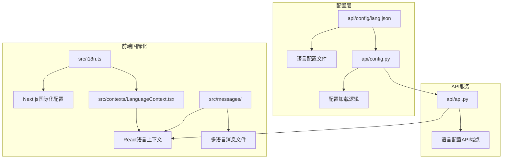
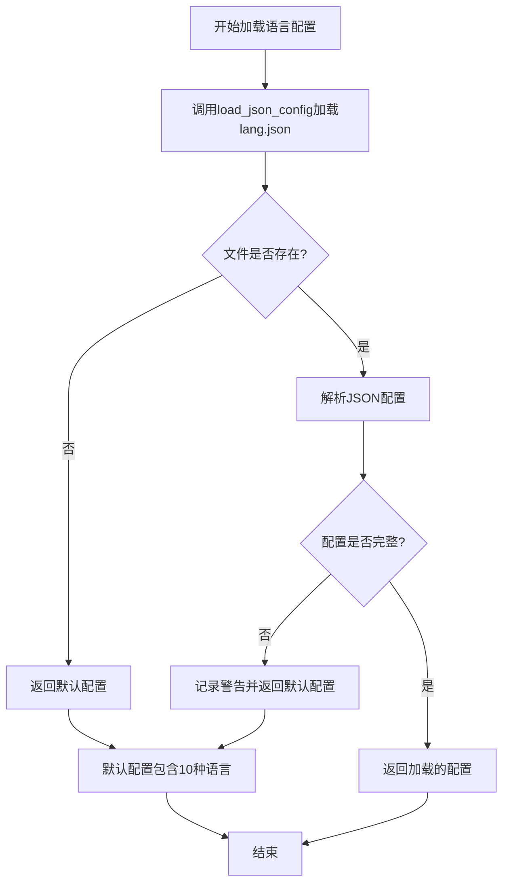
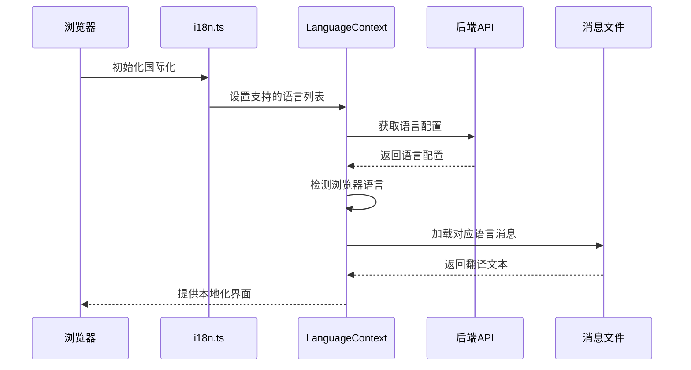
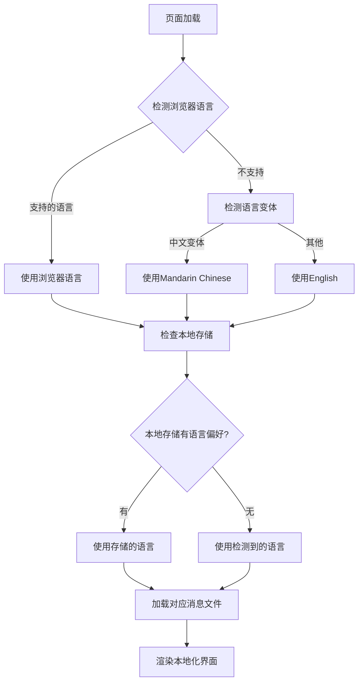
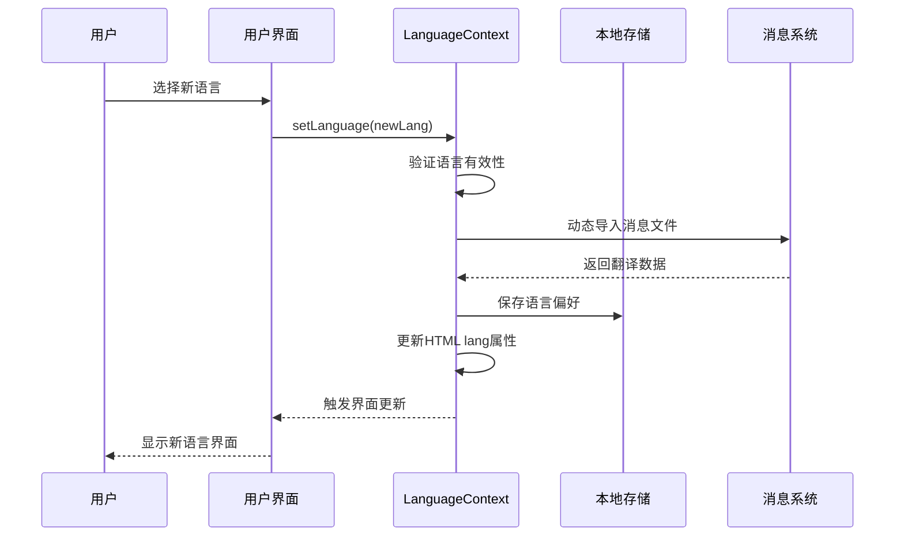
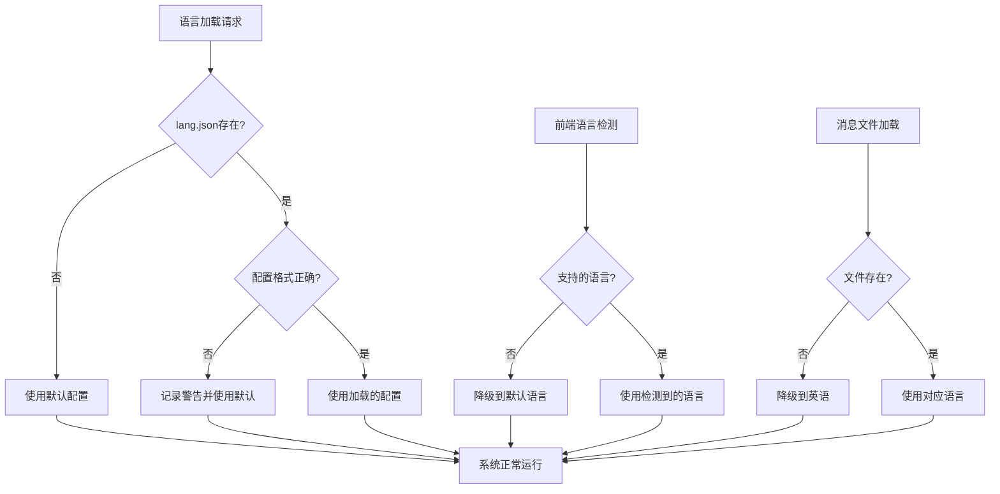
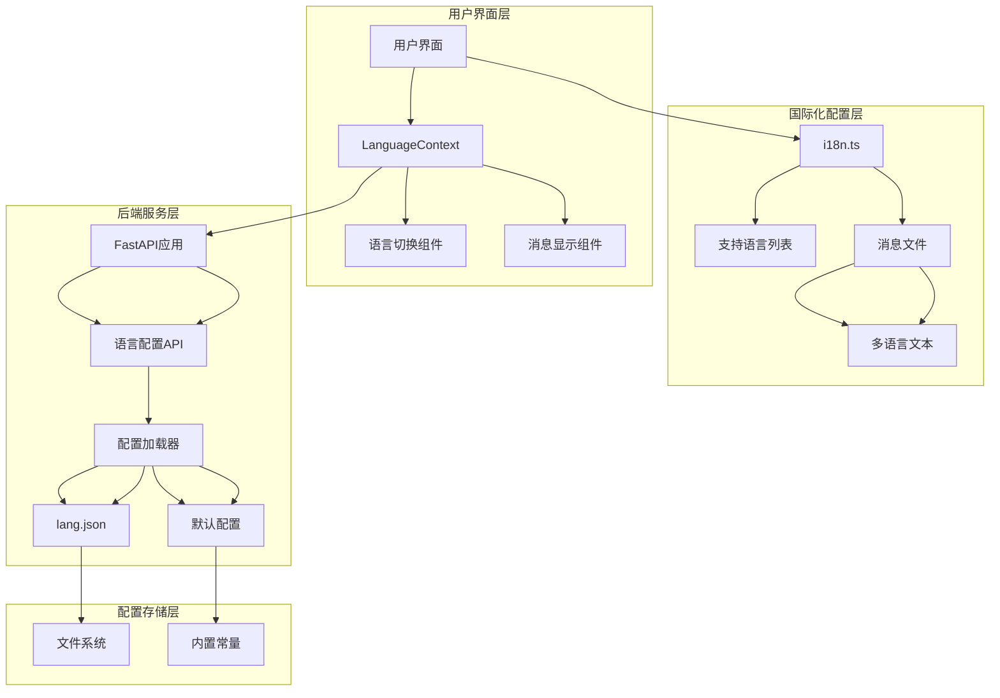

# 多语言配置

<cite>
**本文档中引用的文件**
- [api/config/lang.json](file://api/config/lang.json)
- [api/config.py](file://api/config.py)
- [src/i18n.ts](file://src/i18n.ts)
- [src/contexts/LanguageContext.tsx](file://src/contexts/LanguageContext.tsx)
- [src/messages/en.json](file://src/messages/en.json)
- [src/messages/zh.json](file://src/messages/zh.json)
- [src/messages/ja.json](file://src/messages/ja.json)
- [src/messages/es.json](file://src/messages/es.json)
- [src/messages/pt-br.json](file://src/messages/pt-br.json)
- [api/api.py](file://api/api.py)
</cite>

## 目录
1. [简介](#简介)
2. [项目结构概览](#项目结构概览)
3. [lang.json配置文件详解](#langjson配置文件详解)
4. [后端语言配置加载机制](#后端语言配置加载机制)
5. [前端国际化系统](#前端国际化系统)
6. [语言切换与动态支持](#语言切换与动态支持)
7. [错误处理与回退机制](#错误处理与回退机制)
8. [系统架构图](#系统架构图)
9. [最佳实践与建议](#最佳实践与建议)
10. [总结](#总结)

## 简介

deepwiki-open是一个支持多语言的AI驱动文档生成系统，具备完善的国际化功能。该系统通过精心设计的配置文件和前后端协作机制，实现了灵活的语言支持和无缝的用户体验。本文档详细阐述了系统的多语言配置架构，包括配置文件结构、加载机制、错误处理以及前端集成等核心组件。

## 项目结构概览

deepwiki-open的多语言支持分布在多个层次，形成了完整的国际化生态系统：



**图表来源**
- [api/config/lang.json](file://api/config/lang.json#L1-L16)
- [api/config.py](file://api/config.py#L233-L260)
- [src/i18n.ts](file://src/i18n.ts#L1-L15)
- [src/contexts/LanguageContext.tsx](file://src/contexts/LanguageContext.tsx#L1-L203)

## lang.json配置文件详解

### 支持语言列表定义

lang.json文件是系统多语言配置的核心，定义了所有支持的语言及其本地化显示名称：

```mermaid
graph LR
A[supported_languages] --> B[en: English]
A --> C[ja: Japanese (日本語)]
A --> D[zh: Mandarin Chinese (中文)]
A --> E[zh-tw: Traditional Chinese (繁體中文)]
A --> F[es: Spanish (Español)]
A --> G[kr: Korean (한국어)]
A --> H[vi: Vietnamese (Tiếng Việt)]
A --> I[pt-br: Brazilian Portuguese (Português Brasileiro)]
A --> J[fr: French (Français)]
A --> K[ru: Russian (Русский)]
L[default] --> M[en]
```

**图表来源**
- [api/config/lang.json](file://api/config/lang.json#L2-L14)

### 配置结构分析

| 字段 | 类型 | 描述 | 示例值 |
|------|------|------|--------|
| supported_languages | Object | 支持的语言映射表 | `{ "en": "English", "zh": "Mandarin Chinese (中文)" }` |
| default | String | 默认语言代码 | "en" |

**节来源**
- [api/config/lang.json](file://api/config/lang.json#L1-L16)

## 后端语言配置加载机制

### load_lang_config函数实现

系统通过`load_lang_config`函数实现语言配置的智能加载：



**图表来源**
- [api/config.py](file://api/config.py#L233-L260)

### 默认配置回退机制

当lang.json文件缺失或格式错误时，系统会自动启用内置的默认配置：

| 回退场景 | 处理方式 | 默认语言 | 支持语言数量 |
|----------|----------|----------|--------------|
| 文件不存在 | 创建默认配置 | English (en) | 10种语言 |
| 格式错误 | 记录警告并使用默认 | English (en) | 10种语言 |
| 缺少必需字段 | 记录警告并使用默认 | English (en) | 10种语言 |

**节来源**
- [api/config.py](file://api/config.py#L234-L260)

## 前端国际化系统

### Next.js国际化配置

前端采用Next.js的国际化框架，通过i18n.ts文件定义支持的语言列表：



**图表来源**
- [src/i18n.ts](file://src/i18n.ts#L1-L15)
- [src/contexts/LanguageContext.tsx](file://src/contexts/LanguageContext.tsx#L69-L99)

### 语言检测与选择机制

前端实现了智能的语言检测和选择机制：



**图表来源**
- [src/contexts/LanguageContext.tsx](file://src/contexts/LanguageContext.tsx#L25-L66)

**节来源**
- [src/contexts/LanguageContext.tsx](file://src/contexts/LanguageContext.tsx#L25-L66)

## 语言切换与动态支持

### 动态语言切换实现

系统支持运行时动态切换语言，无需重新加载页面：



**图表来源**
- [src/contexts/LanguageContext.tsx](file://src/contexts/LanguageContext.tsx#L152-L176)

### 语言配置API端点

后端提供了专门的语言配置API端点，供前端获取当前支持的语言列表：

| 端点 | 方法 | 功能 | 响应格式 |
|------|------|------|----------|
| `/lang/config` | GET | 获取语言配置 | `{ "supported_languages": {...}, "default": "en" }` |

**节来源**
- [api/api.py](file://api/api.py#L148-L151)

## 错误处理与回退机制

### 完整的错误处理链路

系统建立了多层次的错误处理和回退机制：



**图表来源**
- [api/config.py](file://api/config.py#L253-L259)
- [src/contexts/LanguageContext.tsx](file://src/contexts/LanguageContext.tsx#L70-L96)

### 错误恢复策略

| 错误类型 | 恢复策略 | 最终状态 | 用户体验 |
|----------|----------|----------|----------|
| lang.json缺失 | 使用内置默认配置 | 系统正常运行 | 无影响 |
| 配置文件损坏 | 记录警告并使用默认 | 系统正常运行 | 无影响 |
| 浏览器语言不支持 | 降级到英语 | 界面显示英语 | 自然降级 |
| 消息文件缺失 | 降级到英语 | 界面显示英语 | 无内容丢失 |

**节来源**
- [src/contexts/LanguageContext.tsx](file://src/contexts/LanguageContext.tsx#L138-L142)

## 系统架构图

### 整体多语言系统架构



**图表来源**
- [src/contexts/LanguageContext.tsx](file://src/contexts/LanguageContext.tsx#L1-L203)
- [api/api.py](file://api/api.py#L148-L151)
- [api/config.py](file://api/config.py#L233-L260)

## 最佳实践与建议

### 配置文件维护

1. **语言代码标准化**：严格遵循ISO语言代码标准
2. **本地化名称准确性**：确保显示名称准确反映语言特性
3. **默认语言一致性**：保持默认语言与主要用户群体匹配

### 性能优化建议

1. **懒加载策略**：使用动态导入减少初始包大小
2. **缓存机制**：合理利用localStorage缓存用户偏好
3. **预加载优化**：预加载常用语言的消息文件

### 扩展性考虑

1. **新增语言支持**：通过修改lang.json即可添加新语言
2. **消息文件管理**：保持消息文件结构的一致性
3. **API版本控制**：为语言配置API提供版本支持

## 总结

deepwiki-open的多语言配置系统展现了现代Web应用国际化设计的最佳实践。通过精心设计的配置文件、智能的加载机制、完善的错误处理和流畅的用户体验，系统实现了高度可靠和可扩展的多语言支持。

系统的核心优势包括：
- **配置驱动**：通过lang.json文件实现灵活的语言配置
- **智能回退**：多层次的错误处理确保系统稳定性
- **动态支持**：支持运行时语言切换和实时更新
- **性能优化**：采用懒加载和缓存策略提升用户体验

这种架构不仅满足了当前的多语言需求，也为未来的功能扩展和语言支持提供了坚实的基础。开发者可以通过简单的配置修改轻松添加新的语言支持，而无需改动核心业务逻辑，体现了良好的软件工程实践。