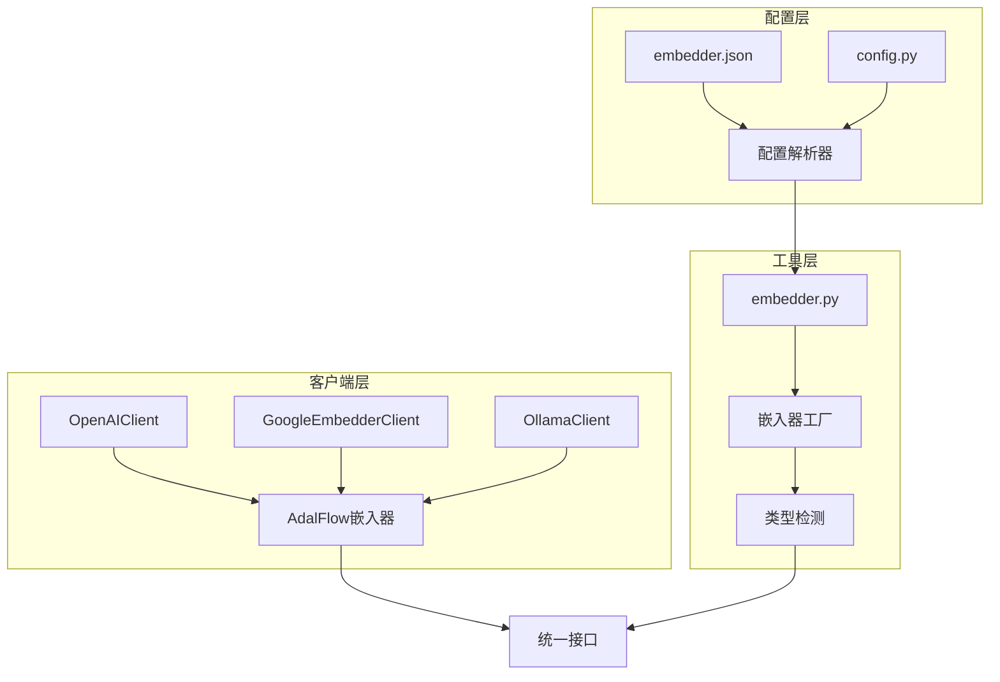
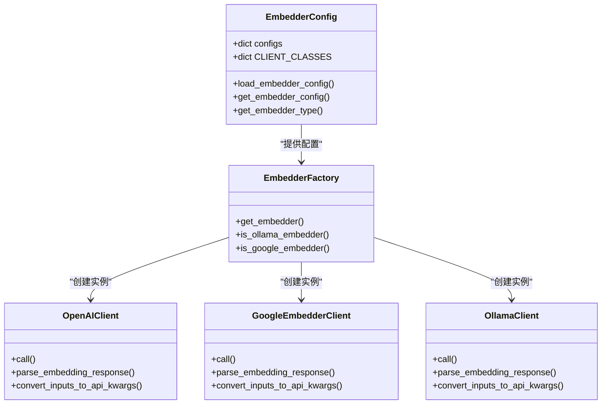
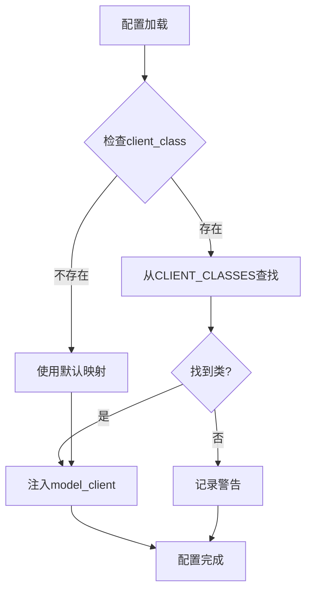
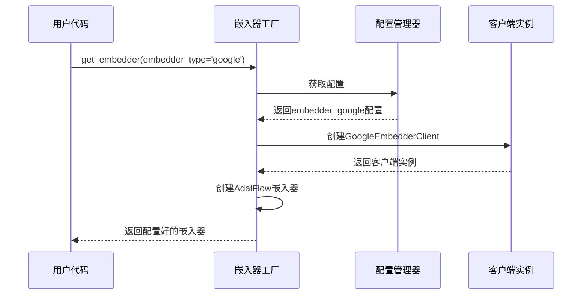
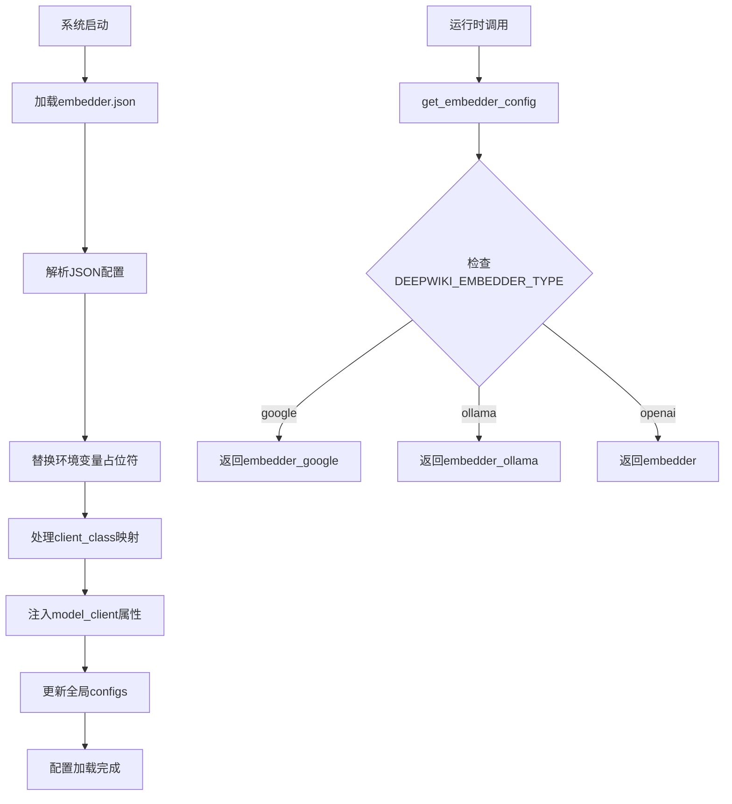
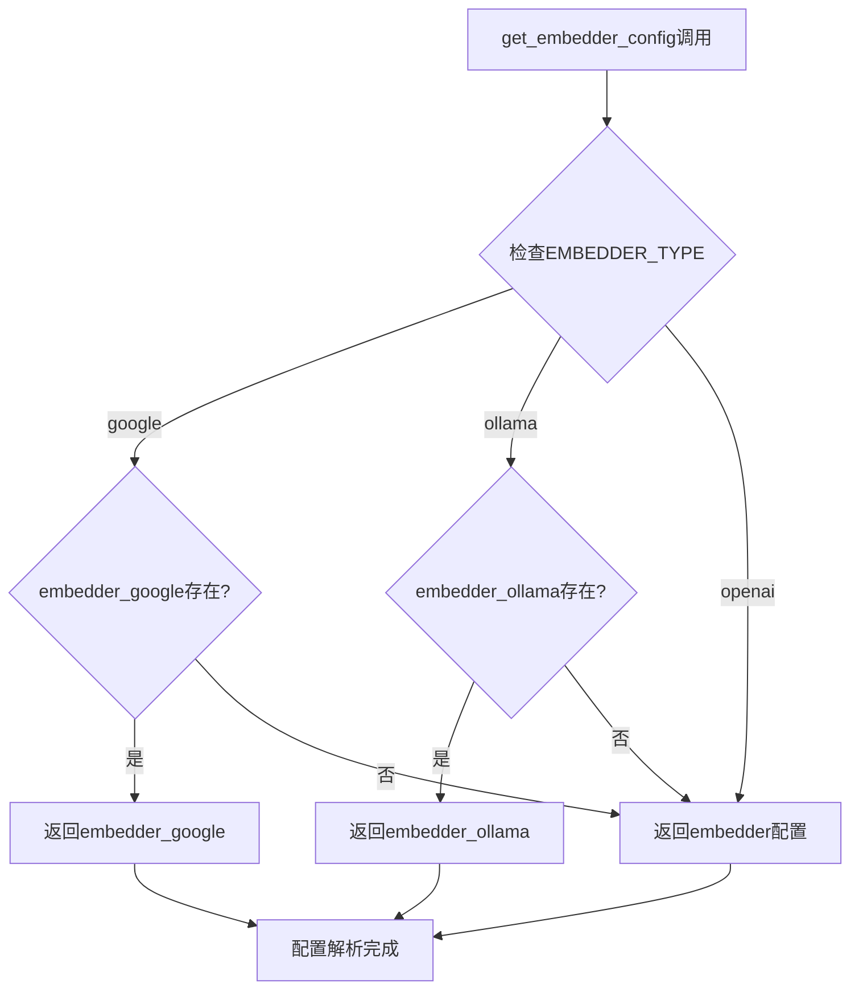

# 嵌入器类型配置

<cite>
**本文档中引用的文件**
- [embedder.json](file://api/config/embedder.json)
- [config.py](file://api/config.py)
- [embedder.py](file://api/tools/embedder.py)
- [google_embedder_client.py](file://api/google_embedder_client.py)
- [openai_client.py](file://api/openai_client.py)
- [test_all_embedders.py](file://tests/unit/test_all_embedders.py)
- [test_google_embedder.py](file://tests/unit/test_google_embedder.py)
</cite>

## 目录
1. [简介](#简介)
2. [项目结构概览](#项目结构概览)
3. [核心配置文件分析](#核心配置文件分析)
4. [嵌入器类型架构](#嵌入器类型架构)
5. [详细组件分析](#详细组件分析)
6. [环境变量配置](#环境变量配置)
7. [配置加载机制](#配置加载机制)
8. [使用示例](#使用示例)
9. [故障排除指南](#故障排除指南)
10. [总结](#总结)

## 简介

deepwiki-open是一个基于AdalFlow框架构建的智能知识库系统，支持多种AI模型提供商的嵌入器配置。该系统通过统一的配置接口，实现了对OpenAI、Ollama和Google三种主流嵌入器提供商的无缝集成，为用户提供灵活的向量嵌入能力。

本文档详细阐述了嵌入器类型配置系统的架构设计、配置文件结构、客户端类映射机制以及运行时配置解析流程，帮助开发者深入理解系统的嵌入器配置原理。

## 项目结构概览

deepwiki-open的嵌入器配置系统采用模块化设计，主要包含以下关键组件：



**图表来源**
- [embedder.json](file://api/config/embedder.json#L1-L34)
- [config.py](file://api/config.py#L55-L64)
- [embedder.py](file://api/tools/embedder.py#L1-L55)

## 核心配置文件分析

### embedder.json配置结构

embedder.json是嵌入器配置的核心文件，定义了三种不同的嵌入器配置：

| 配置项 | 描述 | 默认值 | 适用场景 |
|--------|------|--------|----------|
| `embedder` | OpenAI嵌入器配置 | text-embedding-3-small, 256维 | 云端部署，高精度需求 |
| `embedder_ollama` | Ollama本地嵌入器配置 | nomic-embed-text | 本地部署，隐私保护 |
| `embedder_google` | Google嵌入器配置 | text-embedding-004 | 谷歌生态集成 |

**节来源**
- [embedder.json](file://api/config/embedder.json#L1-L34)

### 客户端类映射表

系统通过CLIENT_CLASSES字典实现客户端类的动态映射：

| 客户端名称 | 实现类 | 功能特性 |
|------------|--------|----------|
| OpenAIClient | OpenAIClient | 支持批量嵌入，流式处理 |
| GoogleEmbedderClient | GoogleEmbedderClient | 支持语义相似度任务 |
| OllamaClient | OllamaClient | 本地部署，离线使用 |

**节来源**
- [config.py](file://api/config.py#L55-L64)

## 嵌入器类型架构

### 系统架构图



**图表来源**
- [config.py](file://api/config.py#L147-L158)
- [embedder.py](file://api/tools/embedder.py#L6-L55)

### 类注册机制

系统通过CLIENT_CLASSES字典实现客户端类的注册和查找：



**图表来源**
- [config.py](file://api/config.py#L147-L158)

## 详细组件分析

### OpenAI嵌入器配置

OpenAI嵌入器配置支持多种参数定制：

| 参数 | 类型 | 描述 | 示例值 |
|------|------|------|--------|
| model | string | 模型名称 | text-embedding-3-small |
| dimensions | integer | 向量维度 | 256 |
| encoding_format | string | 编码格式 | float |
| batch_size | integer | 批处理大小 | 500 |

**节来源**
- [embedder.json](file://api/config/embedder.json#L2-L9)
- [openai_client.py](file://api/openai_client.py#L257-L268)

### Google嵌入器配置

Google嵌入器专为语义相似度任务优化：

| 参数 | 类型 | 描述 | 示例值 |
|------|------|------|--------|
| model | string | 模型名称 | text-embedding-004 |
| task_type | string | 任务类型 | SEMANTIC_SIMILARITY |
| batch_size | integer | 批处理大小 | 100 |

**节来源**
- [embedder.json](file://api/config/embedder.json#L17-L23)
- [google_embedder_client.py](file://api/google_embedder_client.py#L141-L184)

### Ollama嵌入器配置

Ollama嵌入器支持本地部署和自定义模型：

| 参数 | 类型 | 描述 | 示例值 |
|------|------|------|--------|
| model | string | 模型名称 | nomic-embed-text |
| batch_size | integer | 批处理大小 | 无（单文档处理） |

**节来源**
- [embedder.json](file://api/config/embedder.json#L11-L16)

### 嵌入器工厂模式

get_embedder函数实现了智能的嵌入器创建逻辑：



**图表来源**
- [embedder.py](file://api/tools/embedder.py#L6-L55)

**节来源**
- [embedder.py](file://api/tools/embedder.py#L6-L55)

## 环境变量配置

### DEEPWIKI_EMBEDDER_TYPE环境变量

系统通过DEEPWIKI_EMBEDDER_TYPE环境变量实现运行时嵌入器类型选择：

| 可选值 | 默认行为 | 优先级 |
|--------|----------|--------|
| openai | 使用embedder配置 | 最低 |
| google | 使用embedder_google配置 | 中等 |
| ollama | 使用embedder_ollama配置 | 最高 |

### API密钥配置

各提供商需要相应的API密钥环境变量：

| 提供商 | 环境变量 | 必需性 |
|--------|----------|--------|
| OpenAI | OPENAI_API_KEY | 是 |
| Google | GOOGLE_API_KEY | 是 |
| Ollama | 无需配置 | 否 |

**节来源**
- [config.py](file://api/config.py#L48-L50)

## 配置加载机制

### 配置加载流程



**图表来源**
- [config.py](file://api/config.py#L147-L158)
- [config.py](file://api/config.py#L160-L174)

### 运行时配置解析

get_embedder_config函数根据环境变量动态选择配置：



**图表来源**
- [config.py](file://api/config.py#L160-L174)

**节来源**
- [config.py](file://api/config.py#L147-L158)
- [config.py](file://api/config.py#L160-L174)

## 使用示例

### 基本嵌入器创建

```python
# 使用默认配置（根据DEEPWIKI_EMBEDDER_TYPE）
from api.tools.embedder import get_embedder
embedder = get_embedder()

# 显式指定嵌入器类型
google_embedder = get_embedder(embedder_type='google')
ollama_embedder = get_embedder(embedder_type='ollama')
openai_embedder = get_embedder(embedder_type='openai')
```

### 高级配置使用

```python
# 使用遗留参数（已弃用但兼容）
from api.tools.embedder import get_embedder
google_embedder = get_embedder(use_google_embedder=True)
ollama_embedder = get_embedder(is_local_ollama=True)
```

### 集成到数据管道

```python
# 在数据处理管道中使用嵌入器
from api.data_pipeline import prepare_data_pipeline
pipeline = prepare_data_pipeline(embedder_type='google')
```

**节来源**
- [embedder.py](file://api/tools/embedder.py#L6-L55)

## 故障排除指南

### 常见问题及解决方案

| 问题 | 原因 | 解决方案 |
|------|------|----------|
| 嵌入器创建失败 | API密钥缺失 | 设置相应提供商的API密钥环境变量 |
| 配置未生效 | 环境变量错误 | 检查DEEPWIKI_EMBEDDER_TYPE设置 |
| 性能问题 | 批处理大小不当 | 调整配置文件中的batch_size参数 |
| 兼容性问题 | 客户端版本不匹配 | 更新AdalFlow和相关依赖包 |

### 调试技巧

1. **检查配置加载状态**：
   ```python
   from api.config import configs
   print(configs)  # 查看所有加载的配置
   ```

2. **验证嵌入器类型检测**：
   ```python
   from api.config import get_embedder_type
   print(get_embedder_type())  # 获取当前嵌入器类型
   ```

3. **测试特定客户端**：
   ```python
   from api.tools.embedder import get_embedder
   embedder = get_embedder(embedder_type='google')  # 测试Google嵌入器
   ```

**节来源**
- [test_all_embedders.py](file://tests/unit/test_all_embedders.py#L87-L138)

## 总结

deepwiki-open的嵌入器类型配置系统通过精心设计的架构，实现了对多种AI模型提供商的统一接入。系统的主要特点包括：

1. **灵活的配置管理**：通过embedder.json文件和环境变量实现配置的灵活切换
2. **统一的接口设计**：所有嵌入器都通过AdalFlow框架提供一致的使用接口
3. **智能的类型检测**：自动识别和选择合适的嵌入器类型
4. **完善的错误处理**：提供详细的错误信息和回退机制

该系统为开发者提供了强大而易用的嵌入器配置能力，支持从简单的文本嵌入到复杂的多模态处理场景，是构建智能知识库应用的理想选择。