# 嵌入模型配置

<cite>
**本文档中引用的文件**
- [embedder.json](file://api/config/embedder.json)
- [config.py](file://api/config.py)
- [embedder.py](file://api/tools/embedder.py)
- [google_embedder_client.py](file://api/google_embedder_client.py)
- [openai_client.py](file://api/openai_client.py)
- [ollama_patch.py](file://api/ollama_patch.py)
- [data_pipeline.py](file://api/data_pipeline.py)
- [rag.py](file://api/rag.py)
</cite>

## 目录
1. [简介](#简介)
2. [项目结构概览](#项目结构概览)
3. [核心配置文件分析](#核心配置文件分析)
4. [嵌入器类型详解](#嵌入器类型详解)
5. [配置加载机制](#配置加载机制)
6. [运行时嵌入器切换](#运行时嵌入器切换)
7. [文本分块策略](#文本分块策略)
8. [检索器配置](#检索器配置)
9. [性能考虑](#性能考虑)
10. [故障排除指南](#故障排除指南)
11. [总结](#总结)

## 简介

DeepWiki-open是一个基于嵌入模型的知识库问答系统，支持多种嵌入器提供商，包括OpenAI、Google和Ollama。本文档详细解释了嵌入模型配置的核心组件，包括`embedder.json`配置文件的结构、不同嵌入器的特点与用途，以及系统如何根据环境变量动态选择合适的嵌入器配置。

该系统提供了灵活的配置机制，允许用户在运行时切换不同的嵌入器，同时支持本地部署和云端服务的不同需求场景。

## 项目结构概览

DeepWiki-open的嵌入模型配置主要分布在以下关键文件中：

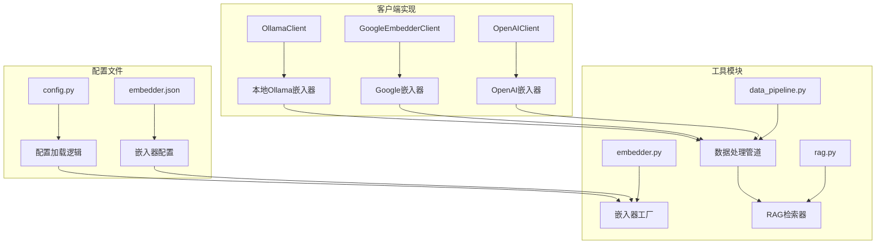

**图表来源**
- [embedder.json](file://api/config/embedder.json#L1-L34)
- [config.py](file://api/config.py#L1-L388)
- [embedder.py](file://api/tools/embedder.py#L1-L55)

## 核心配置文件分析

### embedder.json配置结构

`embedder.json`文件是嵌入模型配置的核心，定义了三种不同的嵌入器配置：

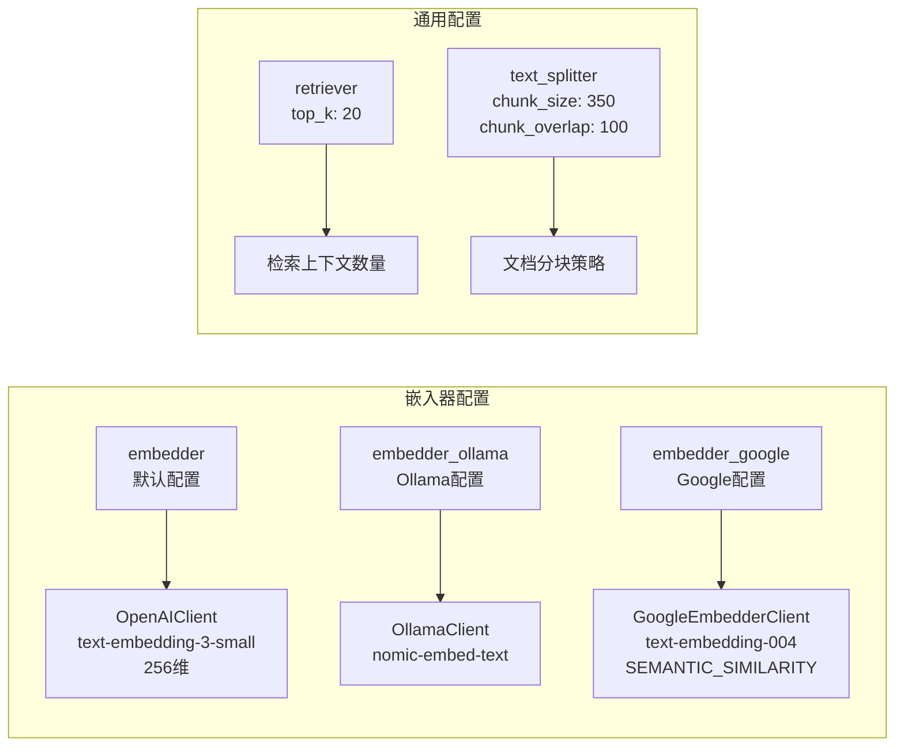

**图表来源**
- [embedder.json](file://api/config/embedder.json#L1-L34)

**节来源**
- [embedder.json](file://api/config/embedder.json#L1-L34)

## 嵌入器类型详解

### OpenAI嵌入器 (embedder)

OpenAI嵌入器是系统的默认配置，提供高质量的文本嵌入能力：

| 参数 | 值 | 描述 |
|------|-----|------|
| client_class | OpenAIClient | 指定使用的客户端类 |
| model | text-embedding-3-small | 使用的嵌入模型 |
| dimensions | 256 | 输出向量维度 |
| encoding_format | float | 编码格式 |

**特点：**
- 支持批量处理，batch_size为500
- 提供256维高维嵌入向量
- 具有优秀的语义理解能力
- 支持流式和非流式调用

### Ollama嵌入器 (embedder_ollama)

Ollama嵌入器支持本地部署，适合隐私敏感或离线使用场景：

| 参数 | 值 | 描述 |
|------|-----|------|
| client_class | OllamaClient | 本地Ollama客户端 |
| model | nomic-embed-text | 本地可用的嵌入模型 |

**特点：**
- 完全本地化部署，无需网络连接
- 支持自定义Ollama主机地址
- 需要预先安装和配置Ollama服务
- 不支持批量处理，采用单文档处理模式

### Google嵌入器 (embedder_google)

Google嵌入器提供强大的语义相似性计算能力：

| 参数 | 值 | 描述 |
|------|-----|------|
| client_class | GoogleEmbedderClient | Google AI客户端 |
| model | text-embedding-004 | 最新的Google嵌入模型 |
| task_type | SEMANTIC_SIMILARITY | 任务类型 |

**特点：**
- 支持批量处理，batch_size为100
- 专为语义相似性任务优化
- 提供多种任务类型的嵌入支持
- 支持异步调用（尽管实际实现为同步）

**节来源**
- [embedder.json](file://api/config/embedder.json#L2-L10)
- [embedder.json](file://api/config/embedder.json#L11-L16)
- [embedder.json](file://api/config/embedder.json#L17-L24)

## 配置加载机制

### 配置加载流程

系统通过`config.py`中的`load_embedder_config`函数加载嵌入器配置：

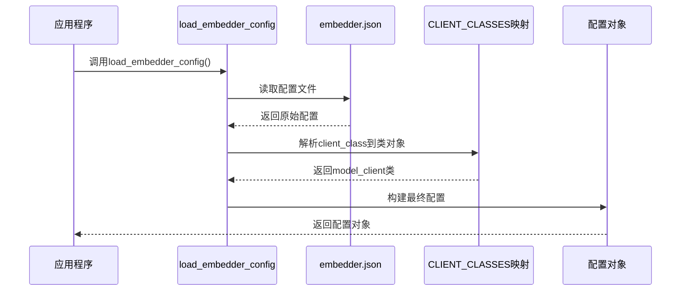

**图表来源**
- [config.py](file://api/config.py#L147-L158)

### 环境变量驱动的配置

系统通过`DEEPWIKI_EMBEDDER_TYPE`环境变量控制当前使用的嵌入器类型：

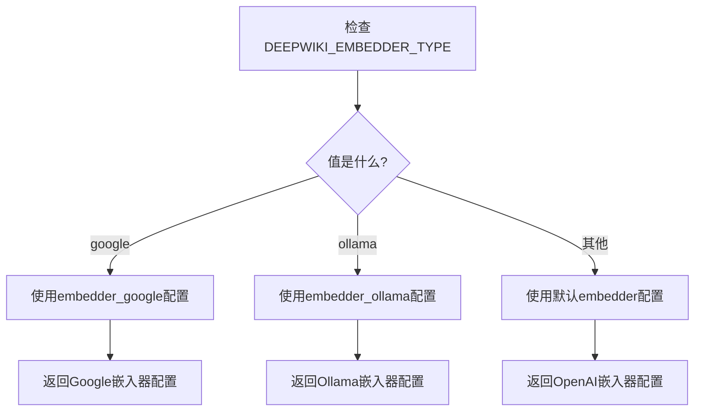

**图表来源**
- [config.py](file://api/config.py#L160-L174)

**节来源**
- [config.py](file://api/config.py#L147-L174)

## 运行时嵌入器切换

### 类型检测函数

系统提供了专门的辅助函数来检测当前使用的嵌入器类型：

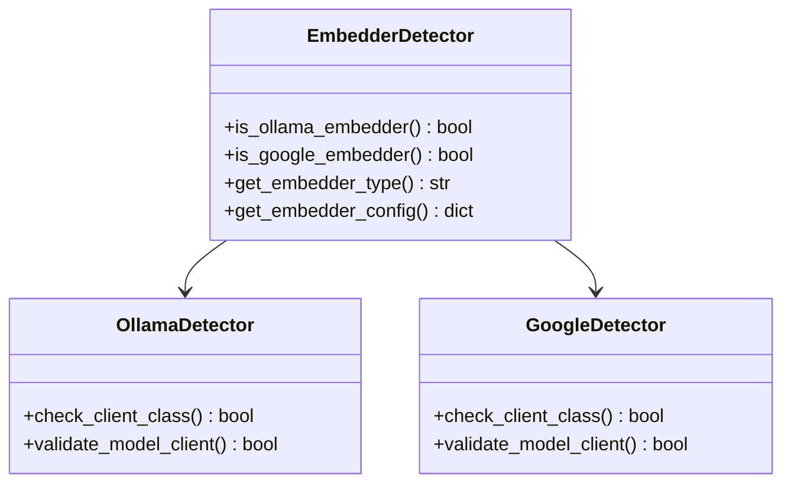

**图表来源**
- [config.py](file://api/config.py#L175-L214)

### 嵌入器工厂模式

`embedder.py`模块实现了嵌入器工厂模式，根据参数或环境变量创建合适的嵌入器实例：

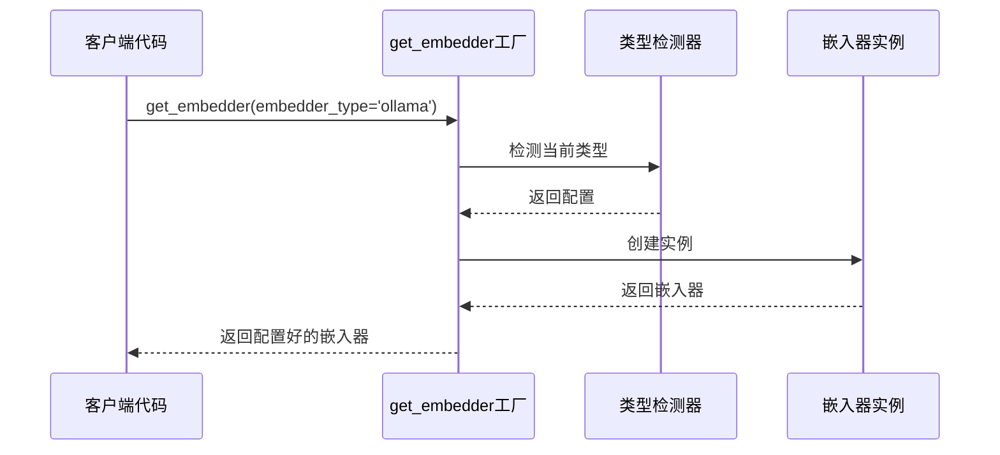

**图表来源**
- [embedder.py](file://api/tools/embedder.py#L6-L55)

**节来源**
- [config.py](file://api/config.py#L175-L214)
- [embedder.py](file://api/tools/embedder.py#L6-L55)

## 文本分块策略

### 分块参数配置

文本分块策略通过`text_splitter`配置控制文档分割方式：

| 参数 | 值 | 描述 |
|------|-----|------|
| split_by | word | 分割单位（按词分割） |
| chunk_size | 350 | 单个块的最大词数 |
| chunk_overlap | 100 | 块之间的重叠词数 |

### 分块策略的影响

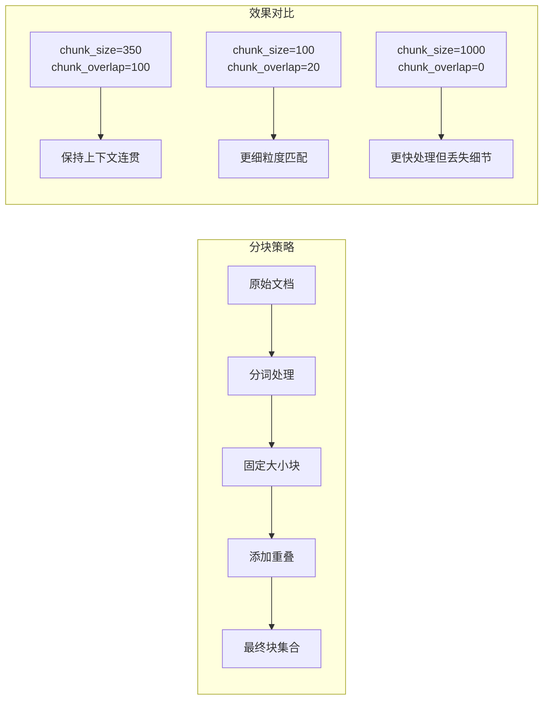

### Ollama特殊处理

对于Ollama嵌入器，由于不支持批量处理，系统使用特殊的`OllamaDocumentProcessor`：

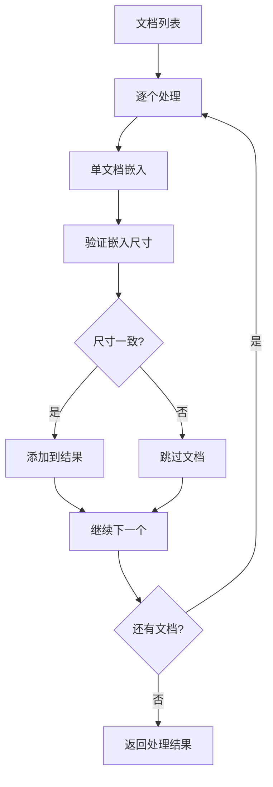

**图表来源**
- [ollama_patch.py](file://api/ollama_patch.py#L62-L105)

**节来源**
- [embedder.json](file://api/config/embedder.json#L28-L32)
- [ollama_patch.py](file://api/ollama_patch.py#L62-L105)

## 检索器配置

### top_k参数设置

检索器的`top_k`参数控制每次检索返回的上下文数量：

| 参数 | 默认值 | 描述 | 性能影响 |
|------|--------|------|----------|
| top_k | 20 | 检索的上下文数量 | 影响召回率和响应时间 |

### 检索器工作流程

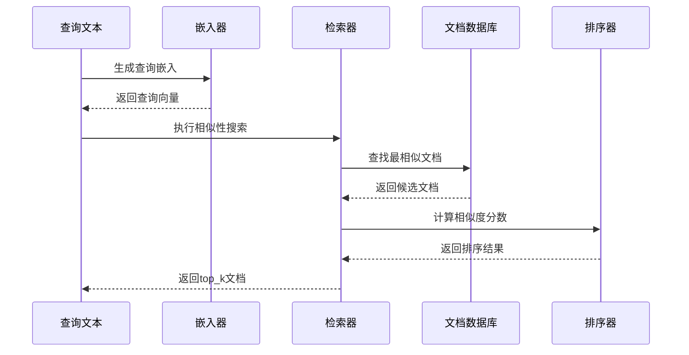

**图表来源**
- [rag.py](file://api/rag.py#L382-L391)

**节来源**
- [embedder.json](file://api/config/embedder.json#L25-L27)
- [rag.py](file://api/rag.py#L382-L391)

## 性能考虑

### 批处理优化

不同嵌入器的批处理策略：

| 嵌入器类型 | batch_size | 性能特点 | 适用场景 |
|------------|------------|----------|----------|
| OpenAI | 500 | 高吞吐量 | 大规模文档处理 |
| Google | 100 | 中等吞吐量 | 平衡性能需求 |
| Ollama | 单文档 | 低延迟 | 小规模或实时处理 |

### 内存管理

系统在处理大规模文档时的内存优化策略：

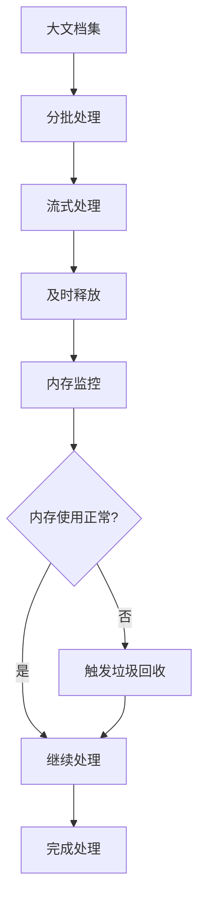

### Token限制处理

系统对不同嵌入器的Token限制进行了适配：

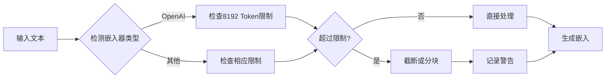

**图表来源**
- [data_pipeline.py](file://api/data_pipeline.py#L27-L30)

## 故障排除指南

### 常见问题及解决方案

#### 1. 嵌入器初始化失败

**症状：** 嵌入器创建时抛出异常
**原因：** API密钥缺失或配置错误
**解决：** 检查环境变量设置，确保正确的API密钥已配置

#### 2. Ollama连接失败

**症状：** Ollama嵌入器无法连接
**原因：** Ollama服务未启动或主机配置错误
**解决：** 验证Ollama服务状态，检查`OLLAMA_HOST`环境变量

#### 3. 嵌入尺寸不一致

**症状：** 文档处理过程中出现尺寸不匹配错误
**原因：** 不同文档使用了不同的嵌入模型参数
**解决：** 统一嵌入器配置，确保所有文档使用相同的模型参数

#### 4. 性能问题

**症状：** 嵌入处理速度慢
**原因：** 配置不当或网络延迟
**解决：** 调整batch_size参数，优化网络连接

### 调试技巧

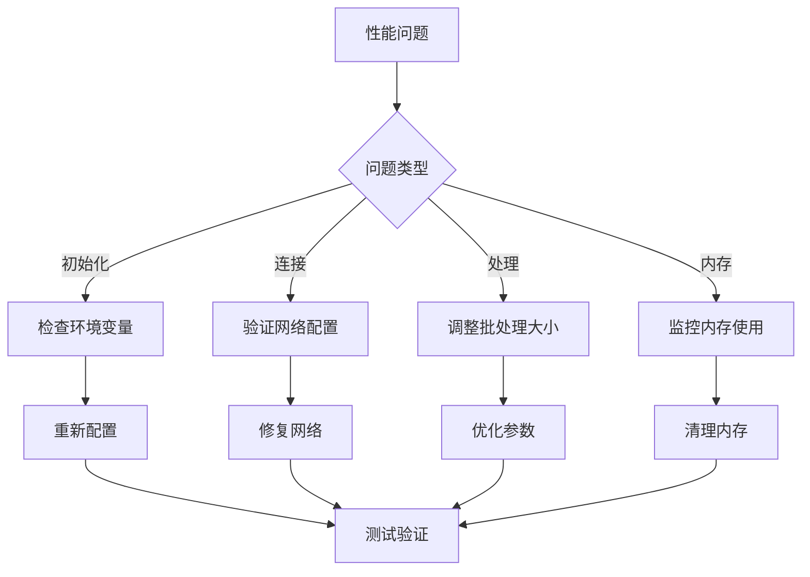

**节来源**
- [config.py](file://api/config.py#L175-L214)
- [ollama_patch.py](file://api/ollama_patch.py#L21-L60)

## 总结

DeepWiki-open的嵌入模型配置系统提供了灵活而强大的多嵌入器支持。通过`embedder.json`配置文件，用户可以轻松配置不同提供商的嵌入器，系统通过环境变量驱动的配置加载机制实现了运行时的嵌入器切换。

关键特性包括：

1. **多提供商支持：** OpenAI、Google、Ollama三大主流提供商
2. **灵活配置：** 支持批量处理、参数定制、环境变量替换
3. **运行时切换：** 通过环境变量动态选择嵌入器类型
4. **性能优化：** 针对不同嵌入器的特殊处理和批处理优化
5. **容错机制：** 完善的错误处理和调试支持

这种设计使得DeepWiki-open能够适应不同的部署需求和性能要求，无论是云端服务还是本地部署，都能获得最佳的嵌入效果。